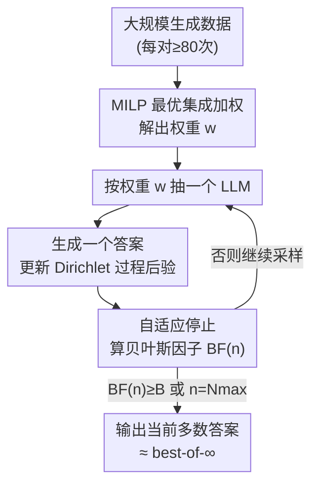

# Best-of-∞: Asymptotic Performance of Test-Time LLM Ensembling

**会议**: ICLR2026  
**OpenReview**: [https://openreview.net/forum?id=3qiCnLf3jf](https://openreview.net/forum?id=3qiCnLf3jf)  
**代码**: https://github.com/jkomiyama/BoInf-code-publish/  
**领域**: LLM 推理 / 测试时计算 / 集成  
**关键词**: best-of-N、多数投票、自适应采样、贝叶斯因子、混合整数线性规划

## 一句话总结
这篇论文把多数投票（majority voting）看作从模型答案分布里反复采样，研究采样数 $N\to\infty$ 时的极限准确率（称为 best-of-∞），并用贝叶斯因子做自适应停止来在有限预算下逼近这个极限；进一步把"多个 LLM 加权集成的最优权重"形式化成一个混合整数线性规划（MILP），证明集成能稳定超过任何单一模型。

## 研究背景与动机

**领域现状**：在测试时多花算力（test-time compute）是提升 LLM 推理可靠性的有效手段，其中最简单实用的一类是 best-of-N（BoN）：对同一道题采样 $N$ 个答案再选一个。选法主要有两种——用奖励模型/让 LLM 当裁判去挑"最好"的那个，或者直接做多数投票（self-consistency），选出现频率最高的答案。

**现有痛点**：奖励模型类方法容易被 reward hacking，且 $N$ 增大时反而可能过拟合奖励信号；而多数投票虽然鲁棒、随 $N$ 增大几乎稳定变好，但实践中大家只能取一个固定的小 $N$（技术报告里常见 8 次生成），既说不清"如果一直采样下去能到多高"，也不知道"在给定预算下该给每道题分配几次生成"。更进一步，当手里有好几个开源 LLM 时，怎么把它们**最优地**组合起来做联合多数投票，此前没有可计算的答案——朴素地为有限 $N$ 枚举所有答案组合是指数级的。

**核心矛盾**：固定 $N$ 的多数投票把算力**均匀**摊到每道题上，但简单题三五次就能定下来、难题需要多采几次；同时，"哪个权重组合最优"这个优化目标在权重单纯形上是**非凹**的，梯度法会卡在次优解，而精确组合优化在有限 $N$ 下又是指数复杂度。

**本文目标**：(1) 给"采样到底能到多好"一个理论上限——best-of-∞；(2) 设计一个能在有限预算下逼近该上限、且按题目难度自适应分配采样数的停止规则；(3) 把"多 LLM 集成的最优权重"变成一个能用现成求解器解的优化问题。

**切入角度**：作者的关键观察是——**只有在 $N\to\infty$ 的极限下**，集成的目标函数才会呈现出一种"多面体（polytope）"结构，从而把指数级的组合优化压缩成一个标准 MILP。换句话说，"取极限"反而让优化变简单了。

**核心 idea**：把多数投票视为对未知答案分布的采样，用 Dirichlet 过程先验 + 贝叶斯因子判断"当前最高票是否就是真·众数"来决定何时停采（自适应逼近 best-of-∞）；并利用极限下的多面体结构，把最优集成权重写成 MILP 一次解出。

## 方法详解

### 整体框架

方法分**离线学权重**和**在线自适应推理**两条线。离线侧：用大规模生成数据（每个 LLM-问题对至少 80 次生成）估计每个模型在每道题上的答案分布，再解一个 MILP 得到集成权重向量 $w=(w_1,\dots,w_K)$。在线侧：对一道新题，按权重 $w$ 随机抽一个 LLM 生成一个答案，把答案计入一个 Dirichlet 过程后验，算贝叶斯因子 $\mathrm{BF}(n)$ 判断当前最高票答案是否已经"足够可信地"是真正的众数；一旦 $\mathrm{BF}(n)$ 超过阈值 $B$（或达到上限 $N_{\max}$）就停采，输出当前多数答案。难题会自动多采几次，简单题三次就停——这就是"在固定总预算下逼近 best-of-∞"的关键。

### 关键设计

**1. best-of-∞ 视角：把多数投票当作对答案分布的采样，取 $N\to\infty$ 极限**

固定 $N$ 的多数投票准确率随 $N$ 抖动且说不清天花板。本文换一个视角：每次生成都是从该 LLM 在这道题上的真实答案分布 $p=(p_1,p_2,\dots)$ 里独立采样，多数投票就是用经验众数估计真·众数。当 $N\to\infty$，只要不存在并列第一（即 $p_1>p_2\ge\cdots$），经验众数几乎必然收敛到真·众数 $\arg\max_j p_j$，对应的准确率就是 best-of-∞——它是这个 LLM（或集成）在无限采样下能达到的确定性上限。这一视角的价值在于：它把"采样还能不能更好"这个经验问题，变成了"极限值是多少、怎么用有限样本逼近"的可分析问题，也为后面集成优化的多面体结构铺路。

**2. 自适应停止：用 Dirichlet 过程后验 + 贝叶斯因子判断"何时已经看够了"**

固定 $N$ 把算力均摊到每题上很浪费。难点在于 LLM 答案分布的**支撑集未知**——有时只冒出两个候选，有时冒出四五个，甚至可能无穷多（如开放整数答案）。作者用非参数贝叶斯：对答案空间放一个 Dirichlet 过程先验 $\mathrm{DP}(H,\alpha)$，$H$ 是基分布、$\alpha>0$ 是控制"出现新答案"倾向的浓度参数。在第 $n$ 轮观察到 $s(n)$ 个不同答案、计数 $N_1\ge N_2\ge\cdots$ 后，后验为

$$\mathrm{DP}\!\left(\frac{\alpha}{\alpha+n}H + \frac{1}{\alpha+n}\sum_{j=1}^{s(n)} N_j\delta_{A_j},\ \alpha+n\right).$$

接着用**贝叶斯因子**度量"最高票 $A_1$ 就是真众数"这一假设 $H_1$ 相对其否定 $H_0$ 的证据强度：$\mathrm{BF}:=P(D(n)\mid H_1)/P(D(n)\mid H_0)$。经贝叶斯定理、对先验比用均匀近似后，可化为 $\mathrm{BF}(n)\approx s(n)\,\dfrac{P(H_1\mid D(n))}{1-P(H_1\mid D(n))}$；当 $n$ 远大于 $\alpha$ 时，后验概率 $P(H_1\mid D(n))$ 可用 Dirichlet 分布近似为 $\Pr[X_1\ge\max_{i\ne1}X_i],\ X\sim\mathrm{Dirichlet}(N_1,\dots,N_{s(n)},\alpha)$（最后一维 $\alpha$ 留给"尚未观察到的答案"），用蒙特卡洛从 Dirichlet 采样即可估计。算法每生成一个答案就更新 $\mathrm{BF}(n)$，超过阈值 $B$ 就停。**Theorem 1（一致性）**保证：当 $N_{\max},B\to\infty$，该算法的性能几乎必然收敛到 best-of-∞——即它既能在有限预算下省算力，又不牺牲极限上限。

**3. MILP 最优集成加权：极限下的多面体结构把指数优化压成线性规划**

把算法扩展到 $K$ 个 LLM：每次生成先以概率 $w_i$ 选模型 $i$ 再生成答案，于是整个集成等价于答案分布 $\sum_i w_i p_{i,\cdot}$ 的多数投票。目标是选 $w$ 最大化答对题数 $f(w)=\sum_q \mathbf{1}[a_q=g_q]$。这里有两个坏消息和一个好消息。坏消息一（**Lemma 1**）：在 best-of-one（只采一次）下，最优权重就是把全部权重压在最强单模型上——单次采样集成没意义。坏消息二（**Lemma 2，非凹**）：在 best-of-∞ 下 $f(w)$ 在单纯形上**非凹**（一道题里强模型对、弱模型错，中间某处目标会掉到 0），梯度法不可靠。好消息（**Lemma 3，多面体引理**）：在极限下，"答案 $j$ 成为某权重 $w$ 下的最高票"这个集合 $\{w:\sum_i w_i p^q_{ij}>\max_{j'\ne j}\sum_i w_i p^q_{ij'}\}$ 是若干半空间与单纯形的交，是一个**多面体**。于是"答对题数最大化"等价于"被尽量多的多面体（每个多面体=一道答对的题）同时包含的 $w$"。引入每题 0/1 变量 $y_q$ 后，整个问题写成 MILP（**Lemma 4**）：

$$\max_{w\in\Delta_K,\,y\in\{0,1\}^N}\ \sum_q y_q \quad \text{s.t.}\ \ w_i\ge0,\ \textstyle\sum_i w_i=1,\ \ A_q w\ge -m(1-y_q)\ \forall q,$$

其中 $A_q$ 第 $j,i$ 项为 $p^q_{i,g_q}-p^q_{i,j}$（金标准答案权重应大于错误答案），$m$ 取足够大常数使约束在 $y_q=0$ 时自动松弛。这是首个为 LLM 多数投票集成提供**可计算的、可证最优**权重的方法；虽然一般 MILP 是 NP-hard，但开源求解器（HiGHS）在 $K\approx10$ 模型、$N\approx10^3$ 题、答案集大小 $\approx10$ 的规模上能平滑求解。注意这一切**只在极限下成立**：有限 $N$ 下需枚举指数级答案组合，正是"取 $N\to\infty$"才换来这个干净的多面体/MILP 结构。

**4. max-margin 解：在最优解的连续区域里挑"最稳"的那个**

由于 $f(w)$ 的最优解往往是一整片连续区域（多个多面体的交集内部），任何内点在 best-of-∞ 下都最优，但它们的**有限 $N$**表现不同——越靠区域边界，少采几次就越容易翻车。作者因此选"最大间隔"解：引入间隔 $\xi>0$，把约束里的 $A_q w$ 换成 $A_q w-\xi$，再在 $\xi\in[0,m]$ 上二分搜索出"不降低目标值 $\sum_q y_q$ 的最大 $\xi$"，取该间隔上的解。这等于在所有同样最优的权重里挑最靠区域中心、对有限采样噪声最鲁棒的那个。

### 一个完整示例

以 AIME2025 一道题为例（答案域 $A_q\subseteq\{0,1,\dots,999,U\}$，$U$ 表示越界/非整数/未给答案，恒判错）。在线推理时，集成先按学到的权重 $w$ 抽一个 LLM 生成答案：第 1、2、3 次都给出 "42"——三次一致，Dirichlet 后验高度集中在 42，$\mathrm{BF}(n)$ 迅速超过阈值 $B$，于是只采 3 次就停、输出 42。换一道难题：前几次给出 "111 / 1 / 2 / 702" 四个互不相同的候选，没有明显多数，$\mathrm{BF}(n)$ 一直低于 $B$，算法持续采样直到某个答案积累出足够领先（或触达 $N_{\max}=100$）。论文实验中（GPT-OSS-20B on MATH500），自适应平均采 $\bar N\approx3$ 次就达到固定 $N=10$ 的准确率、$\bar N\approx10$ 达到固定 $N=100$ 的准确率——把简单题省下的预算挪给难题，整体省 2–5 倍采样。

### 损失函数 / 训练策略

本方法不训练模型参数。"学习"仅指：用离线生成数据估计 $\{p^q_{ij}\}$ 后解一次 MILP 得到集成权重 $w$。唯一超参为 Dirichlet 浓度 $\alpha=0.3$、贝叶斯因子用 1000 个蒙特卡洛样本估计、$N_{\max}=100$；后验计数用 $N_i(t)+1$ 而非 $N_i(t)$ 以加快停止。

## 实验关键数据

实验覆盖 11 个开源指令模型（≤32B）与 4 个重推理基准（AIME2024、AIME2025、GPQA-DIAMOND、MATH500），每个"LLM–问题"对至少 80 次生成（比技术报告常见的 8 次大一个数量级），是迄今规模较大的测试时计算实证。

### 主实验：集成 vs 单模型 / 多数投票 vs 其他选答法

| 设置 | 对象 | best-of-∞ 准确率 | 说明 |
|------|------|------------------|------|
| 单模型 | GPT-OSS-20B (AIME2025) | 90.0% | 最强单模型 |
| 单模型 | Nemotron-Nano-9B-v2 (AIME2025) | 73.0% | 弱模型 |
| **集成** | 二者加权集成 (AIME2025) | **93.3%** | 弱模型互补也能拉高整体 |

在 GPQA-Diamond 上对 5 个模型优化出权重 $w=(0.0176,0.0346,0.2690,0.4145,0.2644)$，集成在 $N\ge5$ 时即超过任何单模型，并逼近 best-of-∞ 蓝线。

最优集成权重学习高效：AIME2025 上仅用 5 道训练题，学到的权重就逼近最强单模型；继续增多训练题，最优权重达到 93.3% 极限准确率（最强单模型仅 90.0%）。迁移性：在 AIME2024 学权重、AIME2025 测试，165 个三模型组合中有 106 个（64.2%）集成 ≥ 最强单模型。

最后在 best-of-five（Bo5，GPT-OSS-20B，AIME2025）上对比各种选答法：

| 选答方法 | 准确率 Mean ± CI |
|----------|------------------|
| Omniscient（上界，需金标准） | 91.04 ± 1.32 |
| **多数投票（本文）** | **85.42 ± 2.01** |
| LLM-as-a-judge (tournament) | 82.92 ± 2.57 |
| LLM-as-a-judge (set) | 81.25 ± 2.42 |
| Skywork-Reward-V2-Qwen3-8B | 80.00 ± 2.51 |
| INF-ORM-Llama3.1-70B | 79.79 ± 2.54 |
| Self-certainty | 75.83 ± 2.47 |
| Random（≈ Bo1） | 76.25 ± 2.71 |

多数投票在同等 Bo5 预算下击败随机、self-certainty、奖励模型与 LLM-as-a-judge，且无需额外建模或生成。

### 关键发现
- **自适应停止省 2–5 倍采样**：GPT-OSS-20B on MATH500，自适应 $\bar N\approx3$ ≈ 固定 $N=10$，$\bar N\approx10$ ≈ 固定 $N=100$；token 维度也省（难题虽多采但单次更长，省幅略小于样本数维度）。
- **弱模型也有用**：只要与强模型互补，把弱模型纳入加权集成能把极限准确率从 90.0% 拉到 93.3%——这与 Bo1 下"全压最强模型"的结论形成鲜明对比（Lemma 1 vs 多采样集成的收益）。
- **"取极限"是优化可解的前提**：非凹（Lemma 2）让梯度法失效，但极限下的多面体结构（Lemma 3）把指数枚举压成 MILP（Lemma 4），现成 HiGHS 求解器即可处理 $K\approx10$、$N\approx10^3$ 规模。

## 亮点与洞察
- **视角转换带来可分析性**：把"多采样还能多好"重述为"$N\to\infty$ 极限是多少 + 怎么用有限样本逼近"，一举把经验问题变成有定理（一致性）有上界的可分析对象。
- **"取极限让问题变简单"的反直觉**：通常无穷难算，但本文恰恰是借 $N\to\infty$ 才得到多面体结构、把指数级组合优化压成 MILP——这个"极限化简"的思路可迁移到其他需要在离散组合空间上优化投票/集成权重的场景。
- **非参数贝叶斯处理未知支撑集**：用 Dirichlet 过程统一处理"有限答案域（如 GPQA 的 A/B/C/D）"和"无限答案域（开放整数）"，并用贝叶斯因子给出一个有理论保证的停采准则——比频率派置信区间停止更自然地容纳"还会冒出新答案"的不确定性。
- **max-margin 选解**：在一整片同样最优的权重区域里挑最靠中心的解，把"best-of-∞ 最优"和"有限 $N$ 鲁棒"两件事兼顾，是个干净的工程化补丁。

## 局限与展望
- **依赖大规模离线生成**：MILP 学权重需要每个 LLM-问题对的答案分布估计（≥80 次生成），离线成本不低；新任务/新模型上线都要重估。
- **极限假设的边界**：理论建立在"无并列第一 $p_1>p_2$"和 $N\to\infty$ 上；现实中难题可能本就没有稳定多数（$p_1\approx p_2$），此时 best-of-∞ 上限本身就不高，自适应采样也会一路采到 $N_{\max}$。
- **只在客观可投票任务上有效**：多数投票要求答案能聚合/比对（数学题、选择题）。开放式生成、长文写作这类没有"众数"的任务用不上本框架。
- **MILP 规模瓶颈**：虽然当前规模可解，但 NP-hard 本质决定了模型数 $K$、答案集 $|A_q|$ 再上一个量级时求解会吃力；论文也未给出近似算法的退化保证。
- **迁移并非总成立**：AIME2024→2025 仅 64.2% 的组合集成不劣于最强单模型，说明学到的权重对分布漂移有一定敏感性。

## 相关工作与启发
- **vs 奖励模型 / LLM-as-a-judge 选答**：它们靠额外模型或额外生成来挑"最好"的答案，易 reward hacking、$N$ 增大可能过拟合；本文的多数投票不需额外建模、随 $N$ 单调变好且更鲁棒，Bo5 实证全面领先这些方法。
- **vs 普通 self-consistency / 固定 $N$ 多数投票**：本文给出极限上限（best-of-∞）与一致性定理，并用贝叶斯因子做按题自适应的预算分配，把固定 $N$ 的均摊浪费省掉 2–5 倍。
- **vs Aggarwal et al. (2023) / Wang et al. (2025a) 的自适应停止**：前者用 Dirichlet 分布、对 top-2 答案用 Beta 近似后验；后者用频率派置信区间停止；本文从**答案类别数未知**出发，用 Dirichlet 过程先验 + 贝叶斯因子统一处理有限/无限答案域，理论更一般。
- **vs 朴素集成权重搜索**：朴素地为有限 $N$ 枚举答案组合是指数级、且目标非凹；本文借极限下的多面体结构给出首个可证最优、可用现成 MILP 求解器求解的权重优化。

## 评分
- 新颖性: ⭐⭐⭐⭐⭐ "取 $N\to\infty$ 极限换来多面体/MILP 结构"是真正巧妙的视角转换，首个可证最优的多数投票集成加权。
- 实验充分度: ⭐⭐⭐⭐ 11 模型 ×4 重推理基准、每对 ≥80 次生成、规模可观且开源数据，但任务局限在可投票的数学/选择题。
- 写作质量: ⭐⭐⭐⭐ 理论推导（DP 后验、贝叶斯因子、四个引理 + 一致性定理）层次清晰，少量笔误但不影响理解。
- 价值: ⭐⭐⭐⭐ 给测试时计算分配与多模型集成提供了有理论保证的实用框架，自适应采样省 2–5 倍预算的结论可直接落地。

<!-- RELATED:START -->

## 相关论文

- [\[ICML 2025\] BEST-Route: Adaptive LLM Routing with Test-Time Optimal Compute](../../ICML2025/llm_nlp/best-route_adaptive_llm_routing_with_test-time_optimal_compute.md)
- [\[ICML 2026\] Rethinking LLM Ensembling from the Perspective of Mixture Models](../../ICML2026/llm_nlp/rethinking_llm_ensembling_from_the_perspective_of_mixture_models.md)
- [\[CVPR 2025\] Test-Time Visual In-Context Tuning](../../CVPR2025/llm_nlp/test-time_visual_in-context_tuning.md)
- [\[ACL 2025\] TestNUC: Enhancing Test-Time Computing Approaches and Scaling through Neighboring Unlabeled Data Consistency](../../ACL2025/llm_nlp/testnuc_enhancing_test-time_computing_approaches_and_scaling_through_neighboring.md)
- [\[ICLR 2026\] SPRIG: Improving Large Language Model Performance by System Prompt Optimization](sprig_improving_large_language_model_performance_by_system_prompt_optimization.md)

<!-- RELATED:END -->
