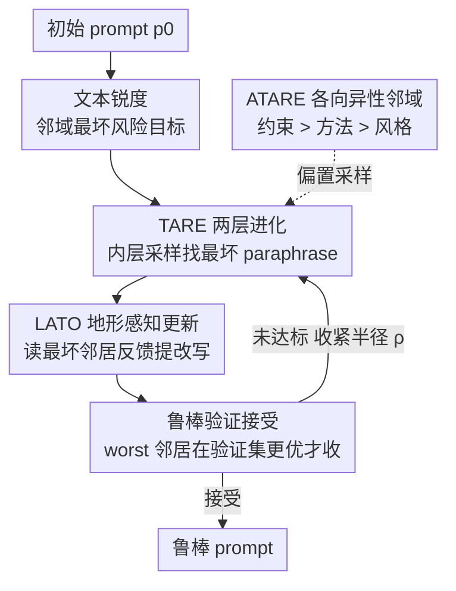

# Beyond Magic Words: Sharpness-Aware Prompt Evolving for Robust Large Language Models with TARE

**会议**: ICLR2026  
**OpenReview**: [https://openreview.net/forum?id=YEBDvqsniH](https://openreview.net/forum?id=YEBDvqsniH)  
**代码**: https://github.com/GuanchengWan/TARE  
**领域**: LLM / NLP（提示优化）  
**关键词**: 提示优化, 文本锐度, 锐度感知最小化, 进化搜索, 鲁棒性

## 一句话总结
把图像/权重空间里的"锐度感知最小化（SAM）"搬到离散的文本提示空间，提出 TARE/ATARE：用"内层找最坏 paraphrase、外层选邻域最稳"的无梯度进化框架，让优化出来的 prompt 在同义改写下不掉点，在 4 个推理基准、5 种被测模型上稳定超过 TextGrad / Revolve。

## 研究背景与动机
**领域现状**：LLM 的表现高度依赖 prompt 的写法。自动提示优化已从手工调试演进到 AutoPrompt、RLPrompt、APE、EvoPrompt、TextGrad 这类"让 LLM 当优化器"的进化/搜索方法，能在固定验证集上自动找出好 prompt。

**现有痛点**：这些方法几乎都只盯着**逐点准确率（point-wise accuracy）**——在某个验证集上把分数刷到最高。结果是优化出来的 prompt 极度脆弱：把一句话换成语义等价的同义改写（"helpful"→"supportive"、"count"→"tally"），准确率可能大幅波动。作者把这种"换句话就崩"的现象命名为提示地形的**文本锐度（textual sharpness）**。

**核心矛盾**：根因在于优化目标错了。只优化逐点准确率，等价于在损失地形里去找一个**尖锐的（sharp）极小点**——这个点本身很低，但稍微挪一步（同义改写）损失就飙升。深度学习早就知道**平坦极小点（flat minima）泛化更好**，SAM 正是显式地把解推向平坦区域；但 SAM 依赖连续参数空间和梯度，**无法直接用在离散、组合的文本上**。

**本文目标**：分解成两个子问题——Q1：如何在离散语义空间里**形式化并量化**一个 prompt 的"锐度邻域"？Q2：如何设计一个**无梯度、黑盒（仅 API）**的算法，在这个离散地形里找到既准又稳的 prompt？

**切入角度**：传统"无穷小梯度扰动"的局部邻域定义在文本上没意义，所以作者改用**语义邻域**——由一个高能力 LLM 来判断两个 prompt 是否语义等价，把 paraphrase/rephrase 当作"局部扰动"。锐度就是在这个语义邻域上的**最坏情况性能退化**。

**核心 idea**：把 SAM 的 min-max 思想搬到文本——内层最大化（找邻域内最坏的同义改写），外层最小化（选那些邻域整体仍然强的候选），用 LLM 当采样器+优化器，全程不碰模型参数。

## 方法详解

### 整体框架
TARE 把"找鲁棒 prompt"写成一个离散 min-max 问题：$\min_{p\in\mathcal{P}}\max_{p'\in B(p,\rho_\text{text})}\mathcal{L}(p')$，即在 prompt $p$ 的语义邻域 $B(p,\rho_\text{text})$ 里先取最坏的同义改写、再最小化这个最坏损失。整条 pipeline 是一个迭代循环：给一个初始 prompt，**内层对抗搜索**先采样一批语义邻居、挑出表现最差的那个最坏邻居 $p^\star_\text{adv}$，把它连同反馈喂给**外层更新**；外层用一个地形感知优化器 LATO 生成一批改进候选，再用**鲁棒验证**准则决定是否接受——只有当新 prompt 的最坏邻居在独立验证集上确实更好时才接受，否则收紧搜索半径 $\rho$ 或加大预算。ATARE 在此之上加一层**各向异性邻域**：先估计 prompt 各组件的敏感度，再用它来偏置内层采样（敏感组件少扰动、稳健组件多探索）。

### 关键设计

**1. 文本锐度：把"换句话就崩"形式化为离散语义空间里的锐度**

这是全文的地基，针对的痛点是——以前没人能在文本上定义"局部平坦/尖锐"。作者先给提示空间装上一个**语义不相似度** $d_\text{text}(p,p')$，注意它**不是向量距离，而是由一个高能力 LLM 给出的语义判断**，由此定义各向同性邻域 $B(p,\rho_\text{text}):=\{p'\in\mathcal{P}: d_\text{text}(p,p')\le\rho_\text{text}\}$。在这个邻域上，**文本锐度感知损失**就是局部最坏风险 $\mathcal{L}_S(p,\rho_\text{text}):=\max_{p'\in B(p,\rho_\text{text})}\mathcal{L}_D(p')$，对应的鲁棒优化问题是 $\min_{p}\mathcal{L}_S(p,\rho_\text{text})$。这一步把 SAM 里"参数空间扰动"精确替换成"语义空间的 paraphrase 扰动"，让后面所有算法都有了可优化的目标——优化器追求的不再是单点低损失，而是**整个语义邻域都低损失**，也就是把锐度间隙（sharpness gap）压下去。

**2. TARE 两层进化：内层对抗搜索找最坏改写、外层鲁棒选择 + 验证准则把关**

针对"怎么在离散地形里实际求解 min-max"。内层用生成器 oracle $G$ 在邻域内采样候选集 $C_{K_t}(p_t):=\{p'_1,\dots,p'_{K_t}\}\sim\text{Sample}(G,p_t,\rho_t,K_t)$，再在 minibatch 上取经验损失最大的那个作为最坏对抗邻居 $p^\star_{t,\text{adv}}:=\arg\max_{p'\in C_{K_t}}\hat{\mathcal{L}}(p';B_t)$——这一步专门暴露"看起来无害、实则会让性能塌掉"的同义改写。外层用优化器 oracle $O$ 在当前 prompt 和最坏邻居的条件下生成改进池 $U_{M_t}(p_t)$，再做**鲁棒选择**：$p_{t+1}:=\arg\min_{p'\in\{p_t\}\cup U_{M_t}}\max_{q\in C_{\tilde K}(p')}\hat{\mathcal{L}}(q;B_t)$，即在"当前+候选"里挑那个**自己邻域最坏值最小**的。这套"先 ascent 找最坏方向、再在该方向下做 descent"的逻辑正是 SAM 在文本上的镜像。为了防止鲁棒性只是某个 minibatch 的偶然，**接受准则**额外在独立验证集上把关：只有当 $\hat{\mathcal{L}}(p^\star_{t+1,\text{adv}};D_\text{valid})\le\hat{\mathcal{L}}(p^\star_{t,\text{adv}};D_\text{valid})-\eta$（容差 $\eta\ge0$）才接受，否则加大预算或退火半径 $\rho_{t+1}=\gamma\rho_t$。这保证了鲁棒风险估计单调不增、提升能泛化。

**3. ATARE 各向异性邻域：按组件敏感度（约束 > 方法 > 风格）自适应缩放**

TARE 的各向同性球 $B(p,\rho)$ 有个效率问题——它对 prompt 的所有部分一视同仁，但实际上一个 prompt 的不同成分敏感度天差地别。作者把 prompt 拆成三个层级：**约束（Constraint，如输出格式）、方法（Method，如"逐步思考"）、风格（Style，如"你是一个乐于助人的…"）**。经验观察发现：改约束往往直接触发任务失败（损失尖峰、敏感度高），改风格几乎没影响。形式上把组件 $j$ 的敏感度定义为它被扰动时的最坏性能退化 $s_{t,j}:=\max_{p'\in C_t}\mathbb{I}(p'\text{ modifies }j)\cdot[\mathcal{L}(p')-\mathcal{L}(p_t)]_+$，并按 $w_{t,j}\propto s_{t,j}$（且 $s_\text{Constraint}>s_\text{Method}>s_\text{Style}$）给各向异性权重。距离改成椭球度量 $d_\text{ani}(p_t,p';W_{p_t})=\|W_{p_t}\Delta(p_t,p')\|_2$，采样时让编辑某组件的概率**反比于其敏感度** $\Pr\{\text{edit }j\}\propto(1/w_{t,j})^\beta,\ \beta\ge1$。效果就是：高敏感的输出格式约束被严格保护（只微调措辞、绝不改"只输出数字"这条核心指令），低敏感的人设可以大胆重写（从"helpful counting assistant"变成"cheerful counter"）——把搜索预算花在真正稳健、值得探索的地方，加速收敛又避免误伤脆弱组件。

**4. LATO 地形感知文本优化器：让外层更新"看得见地形坡度"**

外层的 $O$ 用什么实例化很关键，作者给出 LATO（Landscape-Aware Textual Optimizer）。普通优化器只在当前位置 $p_t$ 纠错，LATO 则把**两个 prompt-损失对** $(p_t,\hat{\mathcal{L}}(p_t))$ 和 $(p^\star_{t,\text{adv}},\hat{\mathcal{L}}(p^\star_{t,\text{adv}}))$ 一起喂给优化器，外加最坏邻居的文本反馈：$\tilde p^{(i)}:=\text{LLM}(\Pi_\text{LATO}(p_t,p^\star_{t,\text{adv}},\hat{\mathcal{L}}(p_t),\hat{\mathcal{L}}(p^\star_{t,\text{adv}}),\text{Feedback},\delta_t))$。因为同时看到了"从 $p_t$ 到最坏邻居损失爬升的陡峭程度"和"最坏方向在哪"，LATO 能**感知局部锐度的几何**，据此调节编辑的方向和幅度，主动把 prompt 推向更平坦的语义盆地——比如它会避开"Count the items below"这种简洁但脆弱的尖峰，转而收敛到"List the items one by one and count them"这种邻域整体都稳的鲁棒解，而不像贪心优化器那样因为前者更短就选它。语义预算 $\delta_t$ 约束每步编辑幅度，保证改写不偏离任务本意。

### 一个完整示例
以物体计数任务为例，初始 prompt $p_0$ = "You are a helpful counting assistant. Your task is to count the number of objects. Think step by step and then provide only the final numerical answer."，损失 $\mathcal{L}$ 为输出非整数格式则记 1、否则记 0。内层采样器 $G$ 生成三个语义等价候选（把 "helpful"→"supportive"、"count"→"tally"、句式重排），但**人设、任务、推理方式、输出格式四大成分都保持不变**，用来探测哪个改写会让性能退化、从而暴露最坏邻居。到了 ATARE，采样按敏感度分化：低敏感人设被大胆重写为 "cheerful counter"，高敏感的输出格式约束只微调措辞（"give just the final number"）但内核"只输出一个数字"绝不动。LATO 拿到最坏邻居及其损失反馈后，朝"邻域更平坦"的方向改写当前 prompt，验证准则确认提升能泛化才接受，否则收紧半径重来。

### 损失函数 / 训练策略
全程**无梯度、仅 API**：不更新任何模型参数，优化的是 prompt 文本本身。核心目标是最坏邻域风险 $\min_p\max_{p'\in B(p,\rho)}\mathcal{L}(p')$。调度上有三类：半径退火 $\rho_{t+1}=\gamma\rho_t$（进展停滞时收缩）、语义预算 $\delta_t$（约束编辑幅度保任务本意）、采样预算 $(K_t,M_t,\tilde K)$（在算力和鲁棒性间权衡）。ATARE 相对 TARE 只增加与组件数成**线性**的开销。实验用 8 张 RTX 3090。

## 实验关键数据

### 主实验
4 个推理任务（BBH 的 Object Counting / Temporal Sequences / Tracking Shuffled Objects + GSM8K），5 种被测模型，优化器/评估器用 GPT-4o 和 Claude 3.5 Sonnet 两套通用骨干，基线为 CoT、TextGrad、Revolve。指标为严格字符串精确匹配准确率（%），↑ 为相对 TextGrad 的提升。

| 任务 (GPT-4o oracle) | 被测模型 | TextGrad | Revolve | TARE | ATARE |
|------|------|------|------|------|------|
| Object Counting | GPT-3.5 | 88.0 | 89.8 | 90.2 | **91.0** |
| Object Counting | Llama 3 8B | 85.8 | 86.8 | 88.7 | **90.3** |
| Temporal Sequences | GPT-3.5 | 81.0 | 84.0 | 87.5 | **88.0** |
| Tracking Shuffled Obj. | Gemini 1.5 Flash 8B | 83.0 | 82.5 | 88.6 | **93.7** |
| Tracking Shuffled Obj. | Llama 3 8B | 55.5 | 52.7 | 57.5 | **67.7** |
| GSM8K | Gemini 1.5 Pro | 93.3 | 93.0 | **95.5** | 94.7 |

可见 TARE/ATARE 在几乎所有任务×模型组合上都超过 TextGrad 和 Revolve，且 ATARE 多数情况优于 TARE；在最难的 Tracking Shuffled Objects（Llama 3 8B）上 ATARE 比 TextGrad 高出 12 个点。

### 消融实验
在 Llama 3.1 8B 上拆掉核心组件（Figure 3）：

| 配置 | 关键指标 | 说明 |
|------|---------|------|
| Full TARE / ATARE | 最佳 | 三大机制齐备 |
| w/o 内层对抗搜索 | 显著下降 | 找不到困难扰动，锐度无从暴露 |
| w/o LATO | 显著下降 | 失去地形信息，更新变盲目 |
| w/o 鲁棒验证 | 显著下降 | 提升无法泛化 |
| TARE → ATARE | 持续上升 | 即各向异性搜索的直接消融 |

### 关键发现
- **三大机制缺一不可**：内层对抗搜索负责暴露脆弱点、LATO 负责用地形信息聪明更新、鲁棒验证负责保证泛化，去掉任一个都明显掉点。
- **各向异性是免费的提升**：ATARE 对 TARE 的持续超越本身就是对"各向异性搜索"的消融，证明按敏感度分配扰动预算有效。
- **韧性强**：把 GPT-4o oracle 换成更弱的 Llama 3.1 8B，除 Tracking 任务的 Optimizer 退化外，准确率下降普遍控制在 5% 以内；把搜索预算 $(K_t,\tilde K)$ 砍到 1-2，性能相比预算 3 也只轻微下降——说明框架既稳健又省算力。

## 亮点与洞察
- **命名一个被忽视的失败模式**：作者最大的贡献不是某个 trick，而是把"prompt 换句话就崩"这件大家隐约知道却没人正式研究的事，命名为"文本锐度"并给出可优化的形式化定义——好的研究往往始于给对问题起对名字。
- **跨域思想迁移的范本**：把连续参数空间的 SAM（min-max、平坦极小点、最坏方向扰动）一一对应到离散文本空间（语义邻域、paraphrase 扰动、LLM 当采样器/判别器），是"老思想换新空间"的漂亮案例。
- **用 LLM 当语义距离度量**：把 $d_\text{text}$ 定义成"高能力 LLM 的语义判断"而非向量距离，绕开了离散文本没有自然度量的根本难题，这个思路可迁移到任何需要"语义邻域"的离散优化。
- **三层敏感度分解可复用**：约束 > 方法 > 风格的敏感度排序是个直观又实用的先验，任何做 prompt 编辑/扰动/防御的工作都能借用——保护输出格式约束、放开人设风格。

## 局限与展望
- **重度依赖强 oracle**：生成器、优化器、评估器都靠强 LLM（GPT-4o / Claude 3.5），虽证明了对 oracle 退化的一定韧性，但整套流程的 API 调用成本不低，论文未给出完整的 token/费用预算对比。
- **任务面较窄**：只在 4 个偏推理、答案可精确匹配的任务上验证（计数、时序、追踪、GSM8K），对开放式生成、长文本、多轮对话这类难以"精确匹配打分"的任务是否同样有效，尚待检验（作者也把多轮/工具增强列为未来方向）。
- **语义邻域由 LLM 主观定义**：邻域是否"语义等价"完全交给 LLM 判断，缺乏客观校准；不同判别 LLM 可能给出不一致的邻域，进而影响锐度估计的可靠性。
- **理论尚浅**：作者声称连接了连续优化理论与离散语言优化，但"文本锐度与泛化"的理论联系基本停留在类比层面，缺少正式的泛化界。

## 相关工作与启发
- **vs SAM / ASAM（连续空间锐度）**：SAM 在参数空间用梯度找平坦极小点，需要可微和梯度访问；本文在离散文本空间用无梯度采样实例化同一思想，把"扰动方向"从梯度上升换成"LLM 采样找最坏 paraphrase"。
- **vs TextGrad / Revolve（最强基线）**：它们仍以逐点准确率为目标，用文本"梯度"迭代改 prompt；本文显式优化邻域最坏风险，因此在同义改写下更稳，主实验全面超越二者。
- **vs EvoPrompt / APE（进化/自动提示）**：同属 LLM 驱动的进化搜索，但前者只挑"分数最高"的候选，本文挑"邻域最坏值最小"的候选——选择准则的改变是鲁棒性的来源。

## 评分
- 新颖性: ⭐⭐⭐⭐⭐ 首次把锐度概念形式化到离散提示空间，并给出可操作的鲁棒性准则，问题命名本身就有价值
- 实验充分度: ⭐⭐⭐⭐ 5 模型×4 任务×2 oracle 的网格 + 消融 + 韧性/敏感度分析较完整，但任务局限于可精确匹配的推理题
- 写作质量: ⭐⭐⭐⭐ SAM→文本的类比讲得清楚，计数任务的 running example 贯穿全文很有帮助
- 价值: ⭐⭐⭐⭐ 对"prompt 鲁棒性"这一实际痛点给出系统方案，三层敏感度先验和语义邻域思路有较强可迁移性

<!-- RELATED:START -->

## 相关论文

- [\[ACL 2025\] Beyond Prompt Engineering: Robust Behavior Control in LLMs via Steering Target Atoms](../../ACL2025/llm_nlp/beyond_prompt_engineering_robust_behavior_control_in_llms_via_steering_target_at.md)
- [\[ICLR 2026\] SPRIG: Improving Large Language Model Performance by System Prompt Optimization](sprig_improving_large_language_model_performance_by_system_prompt_optimization.md)
- [\[ICLR 2026\] Spectral Attention Steering for Prompt Highlighting](spectral_attention_steering_for_prompt_highlighting.md)
- [\[ICLR 2026\] DreamOn: Diffusion Language Models For Code Infilling Beyond Fixed-size Canvas](dreamon_diffusion_language_models_for_code_infilling_beyond_fixed-size_canvas.md)
- [\[ICLR 2026\] The Lattice Representation Hypothesis of Large Language Models](the_lattice_representation_hypothesis_of_large_language_models.md)

<!-- RELATED:END -->
