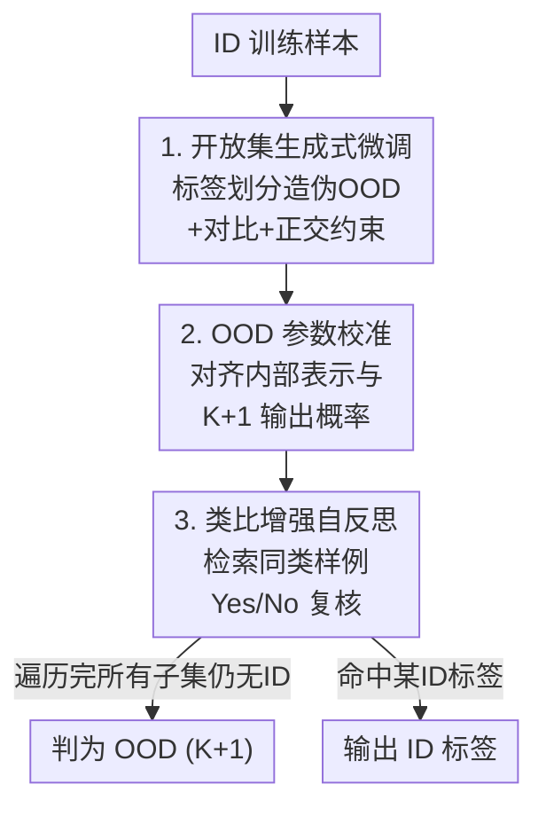

# Beyond the Known: An Unknown-Aware Large Language Model for Open-Set Text Classification

**会议**: ICLR 2026  
**OpenReview**: [https://openreview.net/forum?id=BqLGlQF46f](https://openreview.net/forum?id=BqLGlQF46f)  
**代码**: https://github.com/cx9941/UnLLM  
**领域**: NLP理解 / 开放集分类 / OOD检测  
**关键词**: 开放集文本分类, OOD检测, 大语言模型, 子集条件分类, 自反思推理

## 一句话总结
本文提出 UnLLM，把开放集文本分类从「闭集训练 + 事后 OOD 检测」改写成「给 LLM 喂部分标签子集、把候选外的样本显式标成 unknown」的子集条件分类任务，再用「表示—概率—推理」三级优化把对未知类的建模做实，在 6 个基准上 K-F1 / N-F1 双双稳定超过 SOTA。

## 研究背景与动机

**领域现状**：开放集文本分类（OSTC）要求模型既能把分布内（ID）样本分对类，又能可靠地把分布外（OOD）输入拒识。主流做法分两步：先在 ID 数据上做闭集训练（判别式如 ADB / CLAP / KNNCon，或生成式如 LLM-OOD），再套一个事后（post-hoc）OOD 检测分数（MSP、OpenMax、Energy）来卡阈值。

**现有痛点**：闭集训练全程只在 ID 标签上优化，模型从没见过「未知」长什么样，于是对 OOD 输入往往给出过自信、有偏的预测。判别式微调把嵌入挤成窄而密的簇，反而压坏了 OOD 的可分性；生成式微调（LLM-OOD）借助 LLM 更宽的输出空间和预训练知识，让表示更各向同性、可分性更好，但它依然假设标签空间就等于整个 ID 标签集，只在 ID 标签 token 上优化末位 token 表示——训练和测试的标签空间错位仍然把预测性能拖下去。

**核心矛盾**：真正的开放集训练需要「带正确监督的 OOD 样本」，但真 OOD 样本在训练时拿不到。计算机视觉里 VOS / NPO 用合成虚拟离群点来正则化边界，可这些合成样本不保证代表真实 OOD，尤其在 ID 覆盖稀疏时会引入标签噪声、限制泛化。于是作者追问：带「保证正确监督」的真开放集训练，是否根本无法实现？

**本文目标**：把 OOD 检测从事后判定变成训练时就内化的能力，同时回避合成离群点的保真度问题，并解决随之而来的三个落地难题：①条件 OOD 与真 OOD 的分布差、②模型内部知识与输出概率的错位、③对语义近似已知标签的 OOD 过度自信。

**切入角度**：作者发现 LLM 生成式头天然有更大的输出空间，可以直接为「未知」开辟 token 维度。只要在训练时给 LLM 喂标签的**部分子集**，让真值标签被故意排除在候选之外，就能构造出标签必然正确的「条件 OOD」样本（partition-conditional），从而让模型显式感知开放集风险。

**核心 idea**：把目标从 $\max P(y\mid x)$ 改写成 $\max P(\tilde{y}\mid x, Y_p)$——$Y_p$ 是已知标签的一个子集，$\tilde{y}=y$ 当 $y\in Y_p$，否则 $\tilde{y}=K+1$；用这种零成本、保证正确的 $K{+}1$ 类监督，直接打开 LLM 头去优化 OOD 相关 token 的参数。

## 方法详解

### 整体框架
UnLLM 是一个三阶段串行的流水线：第一阶段用「标签划分」把 ID 训练样本同时变成 ID 和伪 OOD 监督，做开放集生成式微调，并叠加对比学习与正交约束把 ID/OOD 表示拉开；第二阶段在训练后、不再反传梯度的前提下，校准 LLM 头里 $K{+}1$ 类 token 的权重，让内部表示和输出概率对齐；第三阶段在推理时用类比检索 + 自反思，专门压制对语义混淆样本的过度自信。三阶段正好对应「表示建模 → 概率校准 → 反思推理」三级，逐层把对「未知」的刻画做实。

### 关键设计

**1. 开放集生成式微调：用标签划分零成本造出「保证正确」的伪 OOD**

针对「闭集训练从没见过未知」这个根因，作者把分类目标从 $\max P(y\mid x)$ 改写为子集条件形式 $\max P(\tilde{y}\mid x, Y_p)$。具体做法是把标签集均匀切成 $s$ 个互斥的划分 $\{Y_{i}^{p}\}$，对某个 ID 样本 $x_i$，若它的真值落在当前候选子集 $Y_{i,j}^{p}$ 里就照常标成该类，否则标成 $K{+}1$（unknown）——因为真值被人为排除在候选外，这个 unknown 标签必然正确，从而绕开了合成离群点的保真度问题。提示里把候选类别和一个 unknown 类一起列给 LLM，让它做生成式判别，训练损失是标签 token 的自回归似然 $L_{gen}=\sum_{i,j}\sum_k \log P_\theta(\tilde{y}_{i,j,k}\mid x_i, Y_{i,j}^{p}, \tilde{y}_{i,j,<k})$。这一步直接在 LLM 头上优化了 OOD 相关 token 的参数，把 OOD 检测从事后判定变成训练时就具备的内在能力。

为进一步把表示拉开，作者叠了两个正则：一是**对比学习**，取末层 $\tilde{y}_{i,j}$ token 的归一化表示，最大化类间方差、最小化类内方差，损失 $L_{cl}$ 把同 $\tilde{y}$ 的样本拉近、不同的推远；二是**正交约束**，借鉴 ViM，假设每类表示服从类条件高斯 $\mathcal{N}(\mu_k,\sigma_k^2)$，从各类低似然（$\epsilon$-likelihood）区域采虚拟离群点近似决策边界附近的临界区域，用 PCA 提成主子空间 $O$，再令 ID 特征与之正交 $L_{orth}=\lVert H_{ID}O\rVert_F^2$。与 VOS/NPO 直接拿合成样本当监督不同，这里只用它们勾勒「边界结构方向」并强制 ID 远离，从而规避了合成样本的估计偏差。三项合成总损失 $L=\lambda_{cl}L_{cl}+\lambda_{orth}L_{orth}+L_{gen}$。

**2. OOD 参数校准：无需再训练，把内部表示与输出概率对齐**

开放集微调后模型在表示层已能分开 ID/OOD，但作者观察到内部知识（表示空间）和外部输出（token 概率）之间存在错位——标准生成依赖 token 级概率，给不出有意义的 OOD 置信度。针对这个错位，作者在激活空间里找一个「校准方向」去调整 LLM 头中 OOD token 的权重 $W_{K+1}$，整个过程不反传、不再训练。

具体三步：先在标签划分后的验证集上跑微调好的模型，分出假 ID 样本 $X^p$、假 OOD 样本 $X^o$、正确样本 $X^r$，取它们的平均表示 $h^p, h^o, h^r$，定义校准方向 $\Delta h = h^p - h^o$（指明 $W_{K+1}^\top$ 该往哪边挪，使它贴近 OOD、远离 ID）。为避免动了权重伤到原本对的预测，把 $\Delta h$ 投到正确表示 $h^r$ 的正交子空间，闭式解 $\Delta h^\perp=(h^r(h^{r\top}h^r)^{-1}h^{r\top})\Delta h$，再相减得到只含 OOD 调整成分的向量 $\Delta h'=\Delta h-\Delta h^\perp$。最后把权重沿该方向平移 $\tilde{W}_{K+1}^\top = W_{K+1}^\top + \lambda_v \Delta h'$。这样仅靠一次验证集统计就把 OOD 映射函数校准到位，让内部 OOD 知识真正反映到输出概率上。

**3. 类比增强自反思：用检索到的同类样例复核，压住对近似标签的过度自信**

推理时模型对每个测试样本按标签子集顺序逐一判断，一旦命中某个 ID 标签就停、否则判 OOD。但 LLM 对语义高度接近已知标签的文本常常过度自信，容易误判。针对这个痛点，作者借鉴 analogy-augmented generation，提出类比增强自反思：对样本 $x_i$ 及其生成标签 $\hat{y}_{i,j}$，用 PLM 嵌入按余弦相似度 $\mathrm{Sim}(x_i,a_j)=\cos(\mathrm{LM}(x_i),\mathrm{LM}(a_j))$ 检索与 $\hat{y}_{i,j}$ 关联的最相似训练样例 $\{a_1,a_2,\dots\}$，把这些类比样例回喂给 LLM，问「该文本是否严格属于指定范围？请先回答 Yes 或 No」。回答 No 的样本被改判为 OOD。借助同类真实样例当参照，模型能更准地理解标签语义，削掉仅凭表面相似度带来的偏差。

### 损失函数 / 训练策略
训练阶段联合优化 $L=\lambda_{cl}L_{cl}+\lambda_{orth}L_{orth}+L_{gen}$（$\lambda_{cl}$、$\lambda_{orth}$ 为权重超参）；第二阶段参数校准只做一次验证集统计 + 权重平移，无梯度更新；第三阶段在推理时做检索与一次额外 Yes/No 反思，不改模型参数。骨干为 LLaMA3.1-8B。

## 实验关键数据

### 主实验
在 6 个 OSTC 基准（BANKING、CLINC、StackOverflow、Reviews、Newsgroups，以及中文 THUCNews）、3 种已知类比例（25% / 50% / 75%）下评测，指标为 K-F1（ID 分类宏 F1）与 N-F1（OOD 检测宏 F1）。下表取 25% 已知类设置，UnLLM 与各数据集次优基线对比：

| 数据集 | 指标 | UnLLM | 次优基线 |
|--------|------|-------|----------|
| BANKING | K-F1 / N-F1 | 75.04 / 92.02 | 74.39 (VOS) / 90.82 (Energy) |
| CLINC | K-F1 / N-F1 | 83.90 / 93.58 | 83.10 / 91.46 (Energy) |
| StackOverflow | K-F1 / N-F1 | 88.65 / 96.00 | 86.01 / 95.60 (NPO) |
| Reviews | K-F1 / N-F1 | 62.16 / 91.94 | 61.35 (VOS) / 89.78 (NPO) |
| Newsgroups | K-F1 / N-F1 | 68.33 / 91.82 | 61.28 (VOS) / 85.49 (NPO) |
| THUCNews | K-F1 / N-F1 | 83.63 / 94.46 | 64.17 (LLM-OOD) / 92.79 (NPO) |

平均提升：K-F1 在 25% / 50% / 75% 已知类下分别 +4.40% / +2.80% / +2.55%，N-F1 分别 +1.63% / +1.53% / +5.09%（均为对各数据集均值）。

### 关键发现
- **LLM-OOD 不一定打得过判别式基线**：生成式的 LLM-OOD 常排第二却未稳超 EnergyBased 等判别式方法，说明此前的生成式策略没抓住判别性决策边界；UnLLM 的子集条件训练通过丰富训练时的样本多样性，把分类准确率和 OOD 检测同时拉起来。
- **长文本上 LLM 优势明显**：Reviews、Newsgroups 这类长文本上 BERT 系方法吃力，生成式 LLM 更会建模复杂语义结构，因此 UnLLM 的优势进一步放大（Newsgroups K-F1 68.33 vs 次优 61.28）。
- **比例越高 OOD 越难**：随已知类比例上升，K-F1 因 ID 标签更充足而走高，但 N-F1 普遍下滑（模型更易过拟合已知标签）；UnLLM 因显式建模 $K{+}1$ 类，在高比例下仍保持较强 OOD 检测，且 75% 设置的 N-F1 平均提升最大（+5.09%）。

## 亮点与洞察
- **「划分标签子集」是这篇最巧的一招**：它把无法获得的「真 OOD 监督」替换成「标签必然正确的条件 OOD」，零额外数据、零标签噪声，直接把开放集训练做成了可行的事——这正面回应了「带正确监督的开放集训练能否实现」。
- **三级优化各打一个痛点、互不重叠**：表示层（开放集微调+对比+正交）解决分布差，概率层（参数校准）解决内外错位，推理层（自反思）解决过度自信；这种「按失效环节分层补」的拆法很值得迁移。
- **无训练的参数校准**很实用：只靠一次验证集统计 + 正交投影就把输出概率对齐内部表示，不动训练流程，迁移到其它生成式分类 / 拒识任务几乎零成本。

## 局限与展望
- 推理阶段要按标签子集顺序逐一判断，并对每个候选做检索 + 额外一次 Yes/No 反思，类别数多时推理开销与延迟会上升。
- 自反思的检索依赖一个外部 PLM 嵌入模型来算相似度，引入了额外组件；检索质量与该嵌入的好坏强相关。
- 正交约束里的虚拟离群点仍来自类条件高斯假设，若真实表示严重非高斯，边界近似可能失真（作者用「只取方向、不当监督」缓解，但未根除）。
- 主结果以 LLaMA3.1-8B 为骨干，换更小/更大模型时三级优化的相对收益如何变化，文中讨论有限。

## 相关工作与启发
- **vs LLM-OOD（生成式微调）**: 两者都把分类当文本生成、都用末位 token 表示，但 LLM-OOD 仍是闭集训练（只在 ID 标签上优化）+ 事后 OOD 检测；UnLLM 用子集条件把 unknown 显式放进训练目标，把 OOD 检测内化为建模能力。
- **vs VOS / NPO（合成虚拟离群点）**: 它们直接拿合成 OOD 当监督正则化边界，合成样本保真度差、ID 稀疏时引入噪声；UnLLM 的伪 OOD 来自真实样本的「错排候选」，标签保证正确，虚拟离群点只用来勾勒边界方向而不当监督。
- **vs ADB / CLAP / KNNCon（判别式 PLM 边界）**: 这类方法学紧凑球形/对比边界但嵌入过于集中、压坏 OOD 可分性；UnLLM 借 LLM 更宽的生成输出空间 + 正交约束，兼顾 ID 紧凑与 ID/OOD 分离。

## 评分
- 新颖性: ⭐⭐⭐⭐⭐ 把开放集训练从「合成离群点」改成「标签子集造保证正确的条件 OOD」，是 OSTC 范式层面的转变
- 实验充分度: ⭐⭐⭐⭐ 6 个基准 × 3 比例 + 中英文 + 多类基线，但骨干与超参敏感性的探讨略浅
- 写作质量: ⭐⭐⭐⭐ 三难题→三级优化对应清晰，公式完整；个别符号（如 $\Delta h$ 方向定义）需对照原文确认
- 价值: ⭐⭐⭐⭐⭐ 给 LLM 时代的拒识/开放集分类提供了可落地、可迁移的训练范式

<!-- RELATED:START -->

## 相关论文

- [\[ACL 2025\] Open-Set Living Need Prediction with Large Language Models](../../ACL2025/llm_nlp/open-set_living_need_prediction_with_large_language_models.md)
- [\[ICLR 2026\] Evaluating Text Creativity across Diverse Domains: A Dataset and Large Language Model Evaluator](evaluating_text_creativity_across_diverse_domains_a_dataset_and_large_language_m.md)
- [\[ICLR 2026\] Beyond Magic Words: Sharpness-Aware Prompt Evolving for Robust Large Language Models with TARE](beyond_magic_words_sharpness-aware_prompt_evolving_for_robust_large_language_mod.md)
- [\[ICLR 2026\] SPRIG: Improving Large Language Model Performance by System Prompt Optimization](sprig_improving_large_language_model_performance_by_system_prompt_optimization.md)
- [\[ICLR 2026\] DreamOn: Diffusion Language Models For Code Infilling Beyond Fixed-size Canvas](dreamon_diffusion_language_models_for_code_infilling_beyond_fixed-size_canvas.md)

<!-- RELATED:END -->
