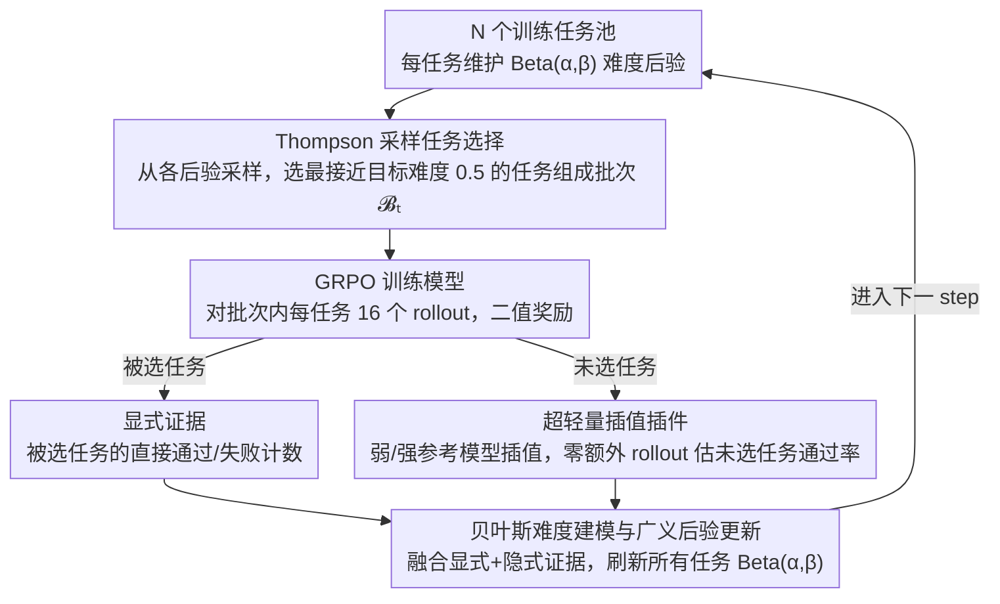

# BOTS: A Unified Framework for Bayesian Online Task Selection in LLM Reinforcement Finetuning

**会议**: ICLR 2026  
**arXiv**: [2510.26374](https://arxiv.org/abs/2510.26374)  
**代码**: [GitHub](https://github.com/modelscope/Trinity-RFT/tree/main/examples/bots)  
**领域**: LLM/NLP  
**关键词**: 强化微调, 在线任务选择, 贝叶斯推断, Thompson采样, 课程学习

## 一句话总结

提出 BOTS——一个基于贝叶斯推断的在线任务选择统一框架，在 LLM 强化微调中通过融合显式证据（直接评估的历史通过率）和隐式证据（利用参考模型插值推断的未评估任务难度），配合 Thompson 采样实现探索-利用平衡，在数学/代码/逻辑任务上以仅 0.2% 的额外开销带来最高 50% 的训练加速。

## 研究背景与动机

**领域现状**：强化微调（RFT）已成为对齐 LLM 能力和提升推理性能的核心技术，DeepSeek-R1、OpenAI o1 等模型的成功都依赖于大规模 RFT。然而 RFT 的效率瓶颈在于训练数据的选择——模型在每个 step 应该练什么样的题。当前主流做法是均匀采样训练集中的所有任务，这导致大量计算浪费在已经掌握（通过率=1）或完全无解（通过率=0）的任务上，有效的学习信号极其稀疏。

**现有痛点**：已有的任务选择解决方案可以分为四类，每类都有明显不足：(1) **离线课程学习**（Parashar et al., Shen et al.）预先安排从易到难的固定调度，无法适应模型能力在训练过程中的持续变化——训练中期模型能力跃升后，之前认为"适中"的任务可能已完全掌握；(2) **过采样过滤**（DAPO, StarPO）每步生成超大批次 rollout 再按通过率筛选，引入 2-4 倍额外推理开销；(3) **仅显式证据方法**（LIMRL, TTRL/MoPPS）根据历史直接评估结果估计任务难度，在训练早期数据极度稀疏时存在严重冷启动——每个任务只在被选中训练时才能获得通过率估计，未选中的任务难度完全未知；(4) **仅隐式证据方法**（AFRL/DOTS）利用任务间相似性预测通过率，但仍需额外 rollout 来评估锚点任务，且完全丢弃了已有的历史评估信息。

**核心矛盾**：显式证据和隐式证据各有互补优势却难以统一。作者通过实验发现了关键互补模式：显式证据（历史直接评估）提供准确稳定的难度估计，但新任务或训练早期无数据可用，启动极慢；隐式证据（跨任务推断）能在零历史时快速给出所有任务的难度估计，但随着模型持续进化，参考模型的预评估信号与当前模型的真实能力偏差逐渐累积，长期可靠性下降。依赖单一证据源必然在某个阶段失效。

**本文目标** (1) 如何在一个统一框架下融合两类异质证据，让它们在不同训练阶段各取所长？(2) 如何以极低计算开销实现隐式证据的在线估计？(3) 如何在证据不确定时自动平衡探索（评估未知任务）与利用（选择已知适中任务）？

**切入角度**：作者观察到，任务通过率天然服从 Bernoulli 分布，其共轭先验 Beta 分布可以优雅地编码"对任务难度的信念"——$\alpha$ 和 $\beta$ 参数就是累积的成功/失败伪计数。只要设计恰当的后验更新规则来融合两类证据，再用 Thompson 采样从后验中抽样决策，就能同时解决证据融合和探索-利用两个问题。

**核心 idea**：把在线任务选择重构为非平稳贝叶斯推断，通过广义后验更新融合显式+隐式证据，用 Thompson 采样自动做探索-利用权衡。

## 方法详解

### 整体框架

BOTS 在每个训练 step 执行一个三阶段循环：**任务选择 → 模型训练与证据收集 → 后验更新**。输入是 $N$ 个训练任务的池子 $\{\mathcal{T}^k\}_{k=1}^N$，每个任务维护一个 Beta 后验 $\text{Beta}(\alpha_t^k, \beta_t^k)$ 表示当前模型在该任务上的成功概率信念。每步的流程是：从后验采样估计难度 → 选择接近目标难度 $p^*=0.5$ 的任务组成训练批次 $\mathcal{B}_t$ → 用 GRPO 等 RL 算法训练模型 → 收集被选任务的直接评估结果（显式证据）和未选任务的插值预测结果（隐式证据）→ 融合更新所有任务的后验参数。整个循环里有三处贡献：选题用 **Thompson 采样**、给未选任务造难度用 **超轻量插值插件**、把两类证据合到一起用 **广义后验更新**。

### 关键设计

**1. 贝叶斯难度建模与广义后验更新：让显式与隐式证据共用一套后验**

冷启动的根子在于"只有被选中训练的任务才有难度数据"，BOTS 的解法是把每个任务 $\mathcal{T}^k$ 的模型成功概率 $p_t^k$ 直接建模成 Beta 分布 $\text{Beta}(\alpha_t^k, \beta_t^k)$——$\alpha,\beta$ 就是累积的成功/失败伪计数，天然编码"对难度的信念"。关键是后验更新写成一个能同时吃两类证据的广义形式：

$$\alpha_{t+1}^k = (1-\lambda)\,\alpha_t^k + \lambda\,\alpha_0^k + (1-\rho)\,s_t^k + \rho\,\tilde{s}_t^k$$

（$\beta$ 的更新对称）。式中 $s_t^k, f_t^k$ 是直接评估得到的显式成功/失败计数，只有被选任务 $k \in \mathcal{B}_t$ 才非零；$\tilde{s}_t^k, \tilde{f}_t^k$ 是融合后的伪计数——对被选任务就等于显式计数，对未选任务则交给下面的插值估计器 $\tilde{p}(k, \mathcal{B}_t)$ 现场生成。正是这个伪计数让从未被选中的任务也能在每一步拿到难度更新，冷启动迎刃而解。两个超参各管一件事：$\lambda \in [0,1]$ 通过把后验往先验 $\alpha_0, \beta_0$ 拉来实现"遗忘"，应对模型能力进化带来的非平稳——旧评估会过时，必须能丢；$\rho \in [0,1]$ 则控制显式/隐式证据的融合权重。作者证明该更新保持 Beta 族闭合，更新后仍是 Beta 分布，全程无需 MCMC 或变分近似；理论上后验的等效样本量 $n_t = \alpha_t + \beta_t$ 在稳态满足 $\rho n/\lambda \leq n_t - n_0 \leq n/\lambda$，即 $\lambda$ 和 $\rho$ 共同决定了估计的置信度。

**2. 超轻量插值插件：零额外 rollout 地造出隐式证据**

要给未评估任务现场估难度，又不愿付 rollout 代价，BOTS 借两个预评估过的参考模型(一弱一强)来插值。很多 RL 数据集(如 GURU)本就自带弱模型通过率 $\bar{p}_w^k$ 和强模型通过率 $\bar{p}_s^k$。每个 step 先用当前批次 $\mathcal{B}_t$ 的在线评估结果算出当前模型的相对能力系数 $\mu_t = (\bar{p}_t^{\text{ref}} - \bar{p}_w^{\text{ref}}) / (\bar{p}_s^{\text{ref}} - \bar{p}_w^{\text{ref}})$——即当前模型卡在弱-强两个参考之间的什么位置；为压随机性再做动量平滑 $\tilde{\mu}_t = \gamma \tilde{\mu}_{t-1} + (1-\gamma)\mu_t$。于是任意未评估任务 $k$ 的通过率就估为 $\tilde{p}(k, \mathcal{B}_t) = \text{clip}(\tilde{\mu}_t \cdot \bar{p}_s^k + (1-\tilde{\mu}_t) \cdot \bar{p}_w^k, 0, 1)$。和 AFRL 的注意力核方法要额外 rollout 评估锚点任务相比，这里只需一次性的参考模型评估加几次向量运算，训练时额外开销 $\leq 0.2\%$。线性插值确实是个强假设，但在弱-强模型之间的内插区间内已足够准，加上 BOTS 用 $\rho$ 给隐式证据限权，框架对其噪声本身就有鲁棒性。

**3. Thompson 采样任务选择：用后验方差自动权衡探索与利用**

有了每个任务的后验，怎么选题才不陷入局部最优？BOTS 不取后验均值贪心，而是对每个任务从当前后验采样 $\hat{p}_k \sim \text{Beta}(\alpha_t^k, \beta_t^k)$，按效用 $\hat{u}_k = -|\hat{p}_k - p^*|$（目标难度 $p^* = 0.5$）排序选出最高的若干个。妙处在于采样噪声与后验方差成正比：评估次数少、后验还很宽的任务，更容易被"意外"采到极端值而被选中去探索；后验已收紧的任务则趋于稳定利用——探索-利用的平衡不靠手调，而是从不确定性里自然涌现。直接用均值贪心看似高效，却会忽略那些因数据稀疏而后验不确定的潜在高价值任务；Thompson 采样既有 Bayes regret bound 的理论保证，实现又只是一行"从 Beta 采样"，消融也证实它比贪心给出更稳定的选题行为。

### 损失函数 / 训练策略

BOTS 本身是任务选择框架，与具体 RL 算法解耦。实验中使用 GRPO（Group Relative Policy Optimization）作为底层训练算法，每个任务生成 $n=16$ 个 rollout，以二值奖励（对/错）驱动策略梯度。任务选择发生在 GRPO 的外循环——决定每个 step 训练哪些题目，而非修改 GRPO 本身的优化目标。

## 实验关键数据

**实验设置**: GURU 数据集（数学、代码、逻辑三个子集），模型使用 Qwen2.5-1.5B-Instruct 和 Qwen2.5-7B，训练算法 GRPO，参考模型为 Qwen2.5-7B-Instruct（弱）和 Qwen3-30B-A3B（强）。评估基准包括 MATH500、AMC23、AIME24（数学），LiveCodeBench（代码），ARC（逻辑）。

**三个互补评估指标**：ETR（有效任务比率，通过率严格在 (0,1) 之间的任务占比）衡量选题质量；TTB（达标时间，达到目标性能的步数与随机基线的比值，$<1$ 表示更快）衡量训练加速度；BSF（最佳表现比，固定预算下性能与随机基线的比值，$>1$ 表示更优）衡量性能增益。

### 主实验：跨域跨规模对比（Qwen2.5-1.5B-Instruct）

| 方法 | Math TTB(50%↓) | Math TTB(100%↓) | Math BSF(25%↑) | Code TTB(50%↓) | Code BSF(25%↑) | Logic TTB(50%↓) | Logic BSF(25%↑) |
|------|:---:|:---:|:---:|:---:|:---:|:---:|:---:|
| Random | 1.00 | 1.00 | 1.00 | 1.00 | 1.00 | 1.00 | 1.00 |
| Offline（易→难） | 0.77 | 0.85 | 1.09 | 0.68 | 1.09 | 1.23 | 0.67 |
| BOTS-MoPPS（仅显式） | 1.02 | 0.89 | 0.98 | 0.78 | 1.09 | 0.87 | 1.13 |
| BOTS-DOTS（仅隐式） | 0.70 | 0.73 | 1.08 | 0.67 | 1.17 | 0.66 | 1.28 |
| **BOTS（默认）** | **0.85** | **0.72** | **1.06** | **0.58** | **1.17** | **0.85** | **1.19** |

7B 模型上 BOTS 在逻辑域实现 TTB(100%)=0.50（50% 训练加速），1.5B 模型上获得 18 项指标中的 10 项第一、6 项第二。

### 消融实验：$\rho$ 对证据融合的影响（1.5B，Math 聚合）

| $\rho$ 设置 | 含义 | TTB(50%↓) | TTB(100%↓) | BSF(25%↑) | BSF(100%↑) |
|:---:|:---|:---:|:---:|:---:|:---:|
| 0.0 | 仅显式证据 | 0.98 | — | 0.99 | 0.98 |
| 0.05 | 微量隐式 | 0.78 | 0.64 | 1.06 | 1.06 |
| **0.1** | **默认** | **0.85** | **0.72** | **1.06** | **1.05** |
| 0.2 | 中等隐式 | 0.78 | 0.69 | 1.07 | 1.05 |
| 0.5 | 偏隐式 | 0.79 | 0.89 | 1.09 | 1.00 |
| 1.0 | 仅隐式证据 | 0.78 | 0.99 | 1.05 | 1.01 |

（"—" 表示在评估窗口内未达到目标性能）

### 关键发现

- **隐式证据对冷启动至关重要**：$\rho=0$（仅显式证据）在训练前期的 ETR 与随机采样几乎无差别——因为大部分任务从未被选中评估过，没有历史数据可用。而所有 $\rho>0$ 的设置都在训练初期表现出 ETR 的急剧攀升，主要通过过滤掉完全不可解（$p=0$）的任务实现。这量化了隐式证据的"冷启动加速器"角色
- **过度依赖隐式证据长期有害**：$\rho=0.5$ 和 $\rho=1.0$ 在训练后期出现 ETR 下降——因为插值估计器的误差随模型能力偏离参考模型而累积，导致越来越多已掌握（$p=1$）的任务被错误地认为仍"适中"而被选中。这解释了为什么 $\rho=1.0$ 的 TTB(100%) 只有 0.99（几乎没有加速）
- **$\lambda$ 控制适应性-稳定性权衡**：$\lambda=0$（无遗忘）导致后验过度自信，无法跟踪模型能力的提升，后期选题质量劣化；$\lambda=1$（完全遗忘）使后验方差极大，Thompson 采样退化为近随机选择；$\lambda=0.1$ 取得所有指标的最优平衡
- **BOTS-DOTS 是最强基线**：即使仅用隐式证据 + 无 Thompson 采样，BOTS-DOTS 也显著优于 Offline 和 Random，证明插值插件本身提供了有价值的任务难度信号。但 BOTS 在其基础上进一步通过显式证据纠偏和 Thompson 采样探索来提升长期性能
- **计算开销可忽略**：BOTS 的任务选择全过程（后验更新 + 插值 + 采样）仅需简单向量运算，wall-clock 开销 $\leq 0.2\%$ 训练时间，相比过采样方法节省数倍推理成本

## 亮点与洞察

- **将任务选择重构为贝叶斯推断的统一视角**：这个建模选择的优雅之处在于一石三鸟——Beta-Bernoulli 共轭给出解析后验更新（无需 MCMC/变分推断）、后验方差自然编码不确定性（驱动 Thompson 采样的探索行为）、伪计数机制提供了融合异质证据的自然接口。整个框架没有引入任何神经网络或复杂优化，核心代码不超过几十行
- **显式/隐式证据互补性的定量发现**：不是简单声称"两者互补"然后融合，而是通过 $\rho$ 从 0 到 1 的系统消融精确刻画了互补模式——显式证据的价值随训练推进递增（历史越来越丰富），隐式证据的价值递减（模型偏离参考模型越来越远），这为融合权重的选择提供了可解释的指导
- **插值插件的零边际成本设计**：利用现有数据集已有的难度标签（如 GURU 的参考模型评估）作为隐式证据的基础，避免任何额外 rollout。这个设计使得 BOTS 成为真正的"即插即用"方案——不需要改训练算法、不需要额外推理预算、不需要训练额外模型

## 局限与展望

- **参考模型依赖**：隐式证据需要弱/强参考模型的预评估通过率。虽然很多数据集（GURU, BigMath）已自带此类标签，但对于全新构建的数据集仍需一次性 rollout。不过这个成本不会重复发生，可以被多次训练分摊
- **线性插值的粗糙性**：假设当前模型的通过率是弱/强模型通过率的线性插值，这在内插（当前模型介于弱强之间）时较准确，但外推时（模型已超过强参考或弱于弱参考）精度显著下降。作者也承认这是局限，提出设计更强的插件（如基于 embedding 的非线性预测器）是未来方向
- **二值奖励假设**：整个 Beta-Bernoulli 建模依赖于奖励是 0/1 二值的。对于非二值奖励场景（如对话质量打分、代码效率排名），需要扩展到 Gaussian-Normal 或 Dirichlet 等更一般的共轭族
- **目标通过率固定**：$p^*=0.5$ 作为"最有信息量的难度"是理论上的最优解（二值奖励下梯度期望最大），但实际训练中不同阶段可能受益于不同的目标——早期可以偏简单（$p^*=0.7$）建立基础能力，后期再逐步提高难度。自适应 $p^*$ 调度是一个直接的改进方向
- **超参数固定不自适应**：$\lambda$ 和 $\rho$ 的最优值在不同训练阶段可能不同（早期需要更多隐式证据 $\rho$ 大，后期应依赖显式证据 $\rho$ 小），但当前框架使用全程固定值。设计自适应的 $\lambda(t), \rho(t)$ 调度策略可能进一步提升性能

## 相关工作与启发

- **vs MoPPS (Qu et al., TTRL)**：MoPPS 可以看作 BOTS 的特例——$\lambda=0, \rho=0$，即完全依赖显式证据且无历史遗忘。BOTS 在此基础上增加了隐式证据和遗忘机制，在 18 个指标上全面超越。这说明单纯的 multi-armed bandit 建模不足以应对 RFT 的非平稳性和冷启动问题
- **vs DOTS (Sun et al., AFRL)**：DOTS 使用注意力核在 embedding 空间做跨任务预测，需要额外 rollout 评估锚点集，且完全不利用历史评估信息。BOTS-DOTS（$\lambda=1, \rho=1$ 的近似）用更简单的插值替代注意力核，性能相当但开销大幅降低。完整 BOTS 在 DOTS 基础上引入显式证据纠偏，进一步提升长期性能
- **vs 过采样方法 (DAPO, StarPO)**：过采样通过生成 4-8 倍超大批次来获得足够的"适中难度"任务，虽然有效但计算成本高昂。BOTS 用智能选题替代暴力过采样，在相同计算预算下达到更好的训练效率
- **启发**：BOTS 的框架设计——贝叶斯信念维护 + 异质证据融合 + Thompson 采样——具有很强的通用性，可以迁移到其他需要在线选择的场景：主动学习中的样本选择、多任务学习中的任务权重调度、课程学习中的自适应调度

## 评分

- 新颖性: ⭐⭐⭐⭐ 将任务选择重构为贝叶斯推断的统一视角清晰优雅，但底层组件（Beta-Bernoulli, Thompson 采样, 线性插值）都是成熟技术
- 实验充分度: ⭐⭐⭐⭐⭐ 多域（数学/代码/逻辑）×多规模（1.5B/7B）全面对比，$\rho$/$\lambda$ 的系统消融提供了深入理解，三种互补指标设计周到
- 写作质量: ⭐⭐⭐⭐⭐ 理论推导→实验验证的对应关系非常清晰，超参数分析既有理论解释又有实验验证，实用建议（默认配置、参考模型选择）完善
- 价值: ⭐⭐⭐⭐ 解决 RFT 中真实且普遍的任务选择瓶颈，即插即用代码已开源，默认超参数跨场景通用，实际部署门槛极低

<!-- RELATED:START -->

## 相关论文

- [\[ICLR 2026\] Discovering Novel LLM Experts via Task-Capability Coevolution](discovering_novel_llm_experts_via_task-capability_coevolution.md)
- [\[ICLR 2026\] Near-Optimal Online Deployment and Routing for Streaming LLMs](near-optimal_online_deployment_and_routing_for_streaming_llms.md)
- [\[ICLR 2026\] ELLMob: Event-Driven Human Mobility Generation with Self-Aligned LLM Framework](ellmob_event-driven_human_mobility_generation_with_self-aligned_language_models.md)
- [\[ACL 2025\] SSUF: A Semi-supervised Scalable Unified Framework for E-commerce Query Classification](../../ACL2025/llm_nlp/a_semi-supervised_scalable_unified_framework_for_e-commerce_query_classification.md)
- [\[ACL 2025\] From Selection to Generation: A Survey of LLM-based Active Learning](../../ACL2025/llm_nlp/from_selection_to_generation_a_survey.md)

<!-- RELATED:END -->
