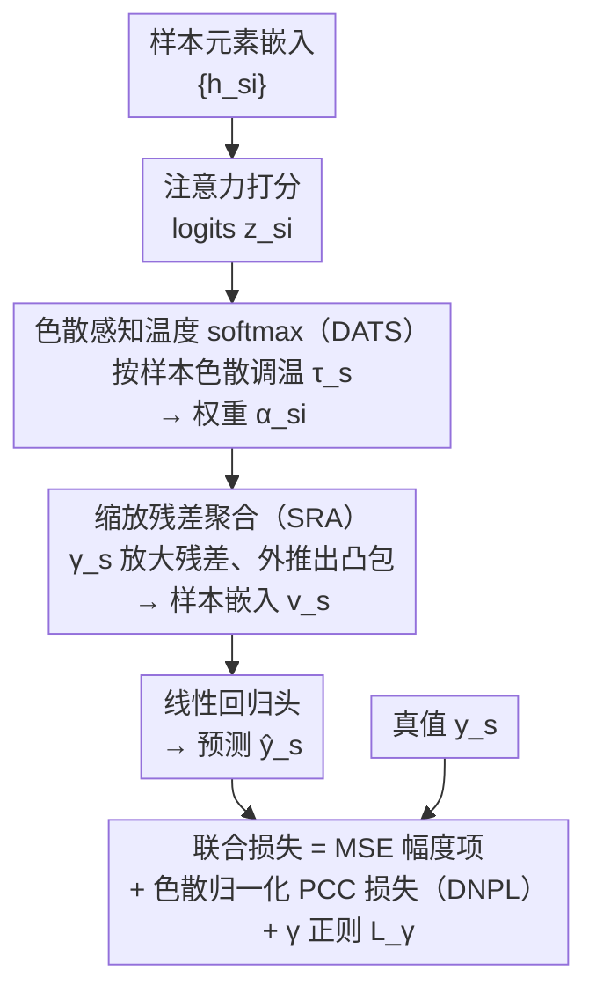

# Breaking the Correlation Plateau: On the Optimization and Capacity Limits of Attention-Based Regressors

**会议**: ICLR 2026  
**arXiv**: [2602.17898](https://arxiv.org/abs/2602.17898)  
**代码**: 暂无  
**领域**: LLM评测  
**关键词**: Pearson相关系数, 注意力回归, PCC plateau, 凸聚合, 优化动力学

## 一句话总结
本文首次从理论上分析了注意力回归模型在联合 MSE+PCC 训练时出现的"PCC平台期"现象——发现其根源在于 MSE 优化与 PCC 梯度之间的冲突以及 softmax 凸聚合的表达力上界——并提出 ECA（Extrapolative Correlation Attention）框架，通过缩放残差聚合、色散感知温度 softmax 和色散归一化 PCC 损失三个组件突破该限制。

## 研究背景与动机

**领域现状**: 注意力机制广泛应用于集合级别回归任务（如数字病理学、视频情感分析、空间转录组学），每个样本由多个元素组成，通过 attention 聚合元素嵌入来预测连续目标值。训练目标通常采用 MSE + PCC 联合损失，既关注预测值的绝对大小（magnitude），也关注预测排序/形状（shape）。

**现有痛点**: 训练过程中频繁出现 **PCC plateau** 现象——PCC 在训练早期就停止提升并趋于平坦，即使 MSE 仍在持续下降。增大 PCC 的损失权重 $\lambda_{\text{PCC}}$ 也无法解决。这个现象在样本内数据高度同质（homogeneous）的场景下尤为严重。

**核心矛盾**: 
   - **优化层面**: MSE 优化会驱动预测标准差 $\sigma_{\hat{y}}$ 向目标标准差 $\sigma_y$ 靠齐，而 PCC 梯度的全局缩放因子恰好与 $1/\sigma_{\hat{y}}$ 成正比，因此随着 $\sigma_{\hat{y}}$ 增大，PCC 梯度信号被压制。
   - **容量层面**: softmax 注意力是凸组合，聚合结果被限制在样本内嵌入的凸包内，PCC 的最大改善幅度受凸包半径约束。

**本文切入角度**: 作者从"为什么 PCC 会停滞"这个被广泛观察但从未被理论解释的现象出发，分别从优化动力学和模型容量两个维度给出严格分析，并基于分析结论设计针对性解法。

**核心 idea**: 通过理论揭示注意力回归中 PCC 梯度被 MSE 优化压制且受凸包约束的双重瓶颈，用"凸包外推 + 色散自适应温度 + 梯度归一化"三管齐下打破平台期。

## 方法详解

### 整体框架

这篇论文要解决的是注意力回归里一个反复出现却始终没被讲清楚的怪象：联合用 MSE + PCC 训练时，PCC 很早就停在某个值上不再涨（"PCC 平台期"），哪怕 MSE 还在稳稳下降、哪怕把 PCC 的损失权重 $\lambda_{\text{PCC}}$ 调大也救不回来。作者先从优化动力学和模型容量两个角度证明这个平台期其实是 softmax 注意力的结构性瓶颈，再据此设计出 ECA（Extrapolative Correlation Attention）——一个即插即用的注意力模块，直接替换标准 softmax attention 做端到端训练。

数据流没变：输入仍是每个样本的元素嵌入集合 $\{\mathbf{h}_{si}\}$，ECA 把它们聚合成样本级嵌入 $\mathbf{v}_s$，再经线性回归头得到标量预测 $\hat{y}_s$。改动落在聚合方式和损失上——整体损失在原有 MSE 之上叠加一个改造过的 PCC 项和一个缩放正则项：

$$\mathcal{L}_{\text{Total}} = \mathcal{L}_{\text{MSE}} + \lambda_{\text{PCC}} \cdot \tilde{\mathcal{L}}_{\text{PCC}} + \mathcal{L}_{\gamma}$$

ECA 模块的数据流可以一眼看完：元素嵌入先经 **DATS** 调温得到有区分度的注意力权重，再由 **SRA** 把聚合点推出凸包得到样本嵌入，过线性头出预测，最后用含 **DNPL** 的联合损失回传梯度。

### 理论分析：PCC 为什么会停滞

ECA 的三个组件不是拍脑袋拼出来的，每一个都对应一条理论结论，所以先把"为什么会停滞"讲清楚。

**Proposition 2.1（MSE 分解）** 把 MSE 拆成均值匹配项、标准差匹配项和加权相关项三部分。关键观察是：PCC 对仿射变换不变，而 MSE 对均值和尺度都敏感，于是优化器更愿意通过调均值、调尺度来压低 MSE，真正改善相关性的动力很弱——这是平台期的第一层根因。

**Theorem 2.1（PCC 梯度）** 给出 PCC 对注意力 logit $z_{si}$ 的梯度，它由一个全局因子 $1/\sigma_{\hat{y}}$ 与一个局部结构因子 $\alpha_{si}\,\mathbf{w}^\top(\mathbf{h}_{si}-\mathbf{v}_s)$ 相乘构成。问题就出在那个 $1/\sigma_{\hat{y}}$ 上。顺着它，**Corollary 2.1（梯度比衰减）** 算出：因为 MSE 优化会把预测标准差 $\sigma_{\hat{y}}$ 推向目标标准差 $\sigma_y$，PCC 梯度与 MSE 梯度的 RMS 比值以 $O(1/\sigma_{\hat{y}}^{3/2})$ 的速率衰减——$\sigma_{\hat{y}}$ 一变大，PCC 的梯度信号就被 MSE 盖过去了。

**Theorem 2.2（凸聚合 PCC 增益上界）** 则从容量上封死了出路：任何凸聚合器（softmax 也是凸组合）相对 mean pooling 的 PCC 改善幅度被 $2\tilde{R} / (\sigma_0/\|\mathbf{w}\|_2 - \tilde{R})$ 卡住，因为聚合结果只能落在样本内嵌入的凸包里，能挤出的相关性增益取决于凸包半径 $\tilde{R}$。样本越同质，凸包越小，上限越低——这正是平台期在同质场景下尤其严重的原因。

### 关键设计

三个组件顺着数据流依次发力：先让注意力在同质样本里重新有区分度，再把聚合点推出凸包，最后把被 MSE 压住的 PCC 梯度补回来——分别对症理论分析里的两个容量/优化瓶颈和那条梯度衰减结论。

**1. Dispersion-Aware Temperature Softmax（DATS）：在同质样本里把注意力重新拉开**

它针对的是 Corollary 2.2 点出的痛点：当样本内嵌入高度相似（同质场景），打分函数给出的 logits 方差很小，标准的固定温度 softmax 会塌成近乎均匀的权重 $\alpha_{si}\approx 1/n_s$，注意力失去选择性、残差也趋近于零。DATS 按每个样本的内部色散自适应地调 softmax 温度：

$$\tau_s = T_{\min} + \beta \sqrt{\tfrac{1}{n_s} \sum_i \|\mathbf{h}_{si} - \boldsymbol{\mu}_s\|^2}$$

色散小的同质样本拿到更低的温度，softmax 变得更尖锐、把微小差异放大，注意力重新有了区分度，残差 $\Delta \mathbf{v}_s$ 也随之变大。比起全局固定温度，这种逐样本调温更适合不同样本同质程度差异很大的数据集——更关键的是，它为下一步的残差外推备好了一个非零、有方向的残差。

**2. Scaled Residual Aggregation（SRA）：让聚合结果跳出凸包**

Theorem 2.2 证明 softmax 这种凸聚合的相关性增益被凸包半径锁死——聚合点只能落在样本内嵌入的凸包里，样本越同质凸包越小、增益上限越低。SRA 干脆允许聚合结果走出凸包：在 DATS 给出的注意力残差基础上，用一个可学习且 $\geq 1$ 的缩放因子放大残差：

$$\mathbf{v}_s^{ECA} = \boldsymbol{\mu}_s + \gamma_s \sum_i \alpha_{si}(\mathbf{h}_{si} - \boldsymbol{\mu}_s), \quad \gamma_s = 1 + \text{Softplus}(\text{MLP}(\boldsymbol{\mu}_s))$$

当 $\gamma_s > 1$ 时，聚合点沿残差方向外推到凸包之外，从根本上绕开了 Theorem 2.2 的约束。为防止它无限放大，作者加了一个把 $\gamma_s$ 往 1 拉的正则项 $\mathcal{L}_\gamma = \frac{\lambda_\gamma}{S} \sum_s (\gamma_s - 1)^2$，让外推幅度受控。

**3. Dispersion-Normalized PCC Loss（DNPL）：把被压住的 PCC 梯度补回来**

针对 Corollary 2.1 揭示的 $1/\sigma_{\hat{y}}$ 衰减——MSE 优化把预测标准差 $\sigma_{\hat{y}}$ 推大后，PCC 梯度与 MSE 梯度的 RMS 比值以 $O(1/\sigma_{\hat{y}}^{3/2})$ 的速率衰减——DNPL 直接在 PCC 损失上乘一个 $\sigma_{\hat{y}}$ 把它抵消：

$$\tilde{\mathcal{L}}_{\text{PCC}} = \text{StopGrad}(\sigma_{\hat{y}}) \cdot (1 - \rho)$$

乘上的 $\sigma_{\hat{y}}$ 恰好抵消梯度里的 $1/\sigma_{\hat{y}}$ 因子，让 PCC 的梯度信号在 $\sigma_{\hat{y}}$ 变大后依然保持量级；而 StopGrad 保证这个缩放只改变梯度大小、不挪动损失的驻点，PCC 该收敛到哪还收敛到哪。

## 实验关键数据

### 主实验

| 数据集/模型 | 指标 | Baseline | +ECA | 提升 |
|------------|------|----------|------|------|
| Appliance (UCI) | PCC↑ | 0.556 | **0.598** | +0.042 |
| Appliance (UCI) | MSE↓ | 6.108 | **5.790** | -5.2% |
| Online News (UCI) | PCC↑ | 0.408 | **0.420** | +0.012 |
| Superconductivity (UCI) | PCC↑ | 0.920 | **0.930** | +0.010 |
| 10xProteomic (病理) | PCC@F↑ | 0.602 | **0.690** | +14.6% |
| 10xProteomic (病理) | PCC@M↑ | 0.629 | **0.716** | +13.8% |
| 10xProteomic (病理) | MSE↓ | 0.056 | **0.051** | -9.8% |
| MOSI (情感分析) | PCC↑ | 0.783 | **0.806** | +2.3% |
| MOSI (情感分析) | F1↑ | 0.851 | **0.859** | +0.8% |

### 消融实验

| 配置 (Appliance) | MAE↓ | MSE↓ | PCC↑ |
|-----------------|------|------|------|
| FT-Transformer (baseline) | 39.333 | 6.108 | 0.556 |
| +ECA (full) | **38.665** | **5.790** | **0.598** |
| +ECA w/o SRA | 39.208 | 5.994 | 0.575 |
| +ECA w/o DATS | 38.906 | 6.037 | 0.561 |
| +ECA w/o DNPL | 39.742 | 5.910 | 0.583 |

### 关键发现
- **三个组件缺一不可**: 去掉 DATS 影响最大（PCC 从 0.598 降至 0.561），说明温度自适应对解决同质性问题至关重要
- **合成数据验证**: 在不同同质性水平下（$\tilde{\sigma} \in [0.10, 0.73]$），ECA 的 PCC 增益分别为 4.80%/5.76%/4.68%/3.05%，MSE 同时改善 20.3%~66.7%
- **平台期被打破**: 病理数据集 fold 2 中，EGN baseline 的 PCC 在 epoch 4 附近即趋平，而 EGN+ECA 持续提升，最终验证 PCC 提高约 16.5%
- **同质性越强，ECA 优势越明显**: 空间转录组（$\tilde{\sigma}=0.068$）和视频情感（$\tilde{\sigma}=0.098$）的高同质性场景下改善尤为显著

## 亮点与洞察
- **理论驱动的方法设计**: 每个组件都有明确的理论动机——SRA 对应 Theorem 2.2 的凸包限制，DATS 对应 Corollary 2.2 的色散项，DNPL 对应 Corollary 2.1 的梯度衰减。这种"先分析问题根因再设计解法"的范式非常值得学习
- **MSE-PCC 分解的洞察 (Proposition 2.1)**: 将 MSE 分解为均值匹配、标准差匹配和加权相关三项，简洁地揭示了为什么 MSE 下降不等于 PCC 提升的内在机制
- **凸包外推思想的通用性**: SRA 的"从凸组合到带缩放的残差外推"思路并不限于回归任务，可以迁移到任何使用 softmax attention pooling 的场景（如 MIL、文档分类等），为它们突破表达力瓶颈提供新途径
- **色散自适应温度**: DATS 根据每个样本的内部色散动态调节温度，比全局温度调度更灵活，尤其适合异质性数据集中不同样本同质性差异大的场景

## 局限与展望
- 目前理论分析假设单层注意力聚合+线性回归头，对深层 Transformer 中注意力交互的分析仍不完善（虽然附录有讨论）
- SRA 的缩放因子 $\gamma_s$ 使用了额外的 MLP，增加了参数和计算开销
- 实验数据集规模相对较小（MOSI 仅约 2200 个视频片段），在大规模场景下的表现待验证
- $\gamma_{\max}$ 的设定（如取 2）显得经验化，缺乏自适应确定方法
- 可考虑将三个组件的贡献解耦为连续的训练策略（如先 warmup MSE 再加 DNPL），观察不同训练阶段的效果

## 评分
- 新颖性: ⭐⭐⭐⭐ (首次从理论上解释 PCC plateau，分析扎实)
- 实验充分度: ⭐⭐⭐⭐ (合成+UCI+病理+情感四个维度，消融完整)
- 写作质量: ⭐⭐⭐⭐⭐ (理论推导清晰，图表精美，故事线流畅)
- 价值: ⭐⭐⭐⭐ (即插即用模块，理论可迁移)

<!-- RELATED:START -->

## 相关论文

- [\[ICML 2026\] On the Limits of LLM Adaptability: Impact of Model-Internalized Priors on Annotation](../../ICML2026/llm_nlp/on_the_limits_of_llm_adaptability_impact_of_model-internalized_priors_on_annotat.md)
- [\[ICLR 2026\] SIPDO: Closed-Loop Prompt Optimization via Synthetic Data Feedback](sipdo_closed-loop_prompt_optimization_via_synthetic_data_feedback.md)
- [\[ICLR 2026\] SPRIG: Improving Large Language Model Performance by System Prompt Optimization](sprig_improving_large_language_model_performance_by_system_prompt_optimization.md)
- [\[ICLR 2026\] Spectral Attention Steering for Prompt Highlighting](spectral_attention_steering_for_prompt_highlighting.md)
- [\[ICLR 2026\] Efficient Multi-objective Prompt Optimization via Pure-exploration Bandits](efficient_multi-objective_prompt_optimization_via_pure-exploration_bandits.md)

<!-- RELATED:END -->
