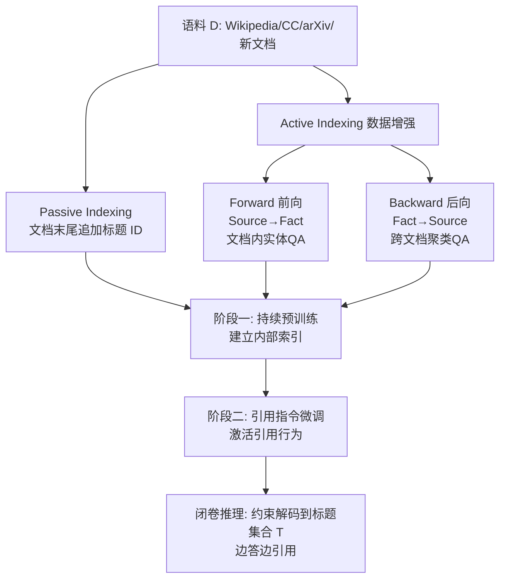

# Cite Pretrain: Retrieval-Free Knowledge Attribution for Large Language Models

**会议**: ICLR 2026  
**OpenReview**: [https://openreview.net/forum?id=D9bLUj7wUW](https://openreview.net/forum?id=D9bLUj7wUW)  
**代码**: [https://github.com/kkkevinkkkkk/CitePretrain](https://github.com/kkkevinkkkkk/CitePretrain)  
**领域**: LLM / NLP（知识归因 / 引用生成）  
**关键词**: 内部引用, 知识归因, 持续预训练, 主动索引, 数据增强, 检索无关  

## 一句话总结
通过在持续预训练阶段用"主动索引（Active Indexing）"把事实双向绑定到文档标识符，让 LLM 无需任何外部检索就能在闭卷状态下边回答边给出可验证的引用，引用精度最高提升 30.2%。

## 研究背景与动机
**领域现状**：可信 LLM 需要既正确又可验证的答案。当前主流做法是用外部检索（RAG）在推理时为答案附上引用——要么把检索到的文档喂进上下文生成，要么生成后再做对齐。

**现有痛点**：(1) LLM 自己直接生成的"内部引用"极不可靠，幻觉率高达 86%~91.4%、误归因率 24%~46%；(2) 外部检索虽然有效，但带来推理延迟、长上下文开销、对外部基础设施（如网络搜索）的依赖、以及检索噪声/与参数化知识冲突时的推理退化；(3) 很多问题本可直接从参数化记忆回答，外部检索是多余成本；(4) 外部检索对"模型内部到底记住/知道什么"提供的可解释性有限。

**核心矛盾**：要让模型在闭卷（不查检索器）的单次前向中同时产出正确答案与可验证的来源标识符，这比生成式检索（GR，只学 query→docID 映射）严格更难——模型不仅要学映射，还要内化知识、并在生成答案时恰当地使用和引用它。

**本文目标**：研究 LLM 能否通过改造训练流程，可靠地归因到（持续）预训练阶段见过的文档，而无需测试时检索。为此构建了 CitePretrainBench 基准（混合真实语料 Wikipedia/Common Crawl/arXiv 与全新未见文档，同时考察单事实短答与多事实长答的引用任务）。

**核心 idea**：**先在持续预训练中"建索引"，再用指令微调"激活引用行为"**——关键是把被动地把 ID 附在文档末尾（Passive Indexing）升级为**双向、形式多样的主动数据增强（Active Indexing）**，让模型即使事实被改写或跨文档组合也能找对来源。

## 方法详解

### 整体框架
两阶段训练：**阶段一持续预训练做索引**（让模型吸收语料事实，并学到把任意事实片段 $s \subset c_i$ 映射到其标题 $t_i$ 的内部索引），**阶段二引用指令微调**（让模型回答时输出 $(s_k, C_k)$ 即"事实陈述 + 支撑标题集合"）。推理时把引用解码空间约束到已知标题集合 $\mathcal{T}$ 以保证可验证。被动索引只是把文档 ID 附到文档末尾作 baseline，主动索引则用合成数据从前后两个方向强化"事实↔来源"绑定。

### 关键设计

**1. 被动索引及其失效诊断：为什么"附 ID"不够。** Passive Indexing 把自然语言标题 $t_i$（而非数字或结构化 ID，标题更易记忆且可扩展可改名去重）追加到文档内容 $c_i$ 末尾，让模型学 $f(c_i)=t_i$，形成 $c_i \to t_i$ 的训练样本，这与下游"先生成内容再附引用"的顺序一致。但在真实语料上作者发现两个前人合成数据集上不暴露的硬伤：其一，**复杂事实 ≠ 原文引文**——很多评测问题需要综合或改写散落在文档各处的信息，模型几乎学不会把这种非逐字事实关联到正确文档；其二，**仅靠粒度不够**——把 ID 插得离每个事实更近（逐句/逐段）只带来微弱提升，模型仍无法 ground 非逐字内容。这直接催生了主动索引。

**2. 前向增强（Source→Fact，文档内召回）。** 目标是强化"给定标识符 $t_i$ 能召回其事实集合 $S_i=\{s_{i1},\dots,s_{in_i}\}$"的映射，针对"需精确归因到单一来源"的场景。流程是先用辅助 LLM 从每个文档抽取 $N$ 个显著实体 $E_i=\{e_{i1},\dots,e_{iN}\}$（$N$ 控制增强规模），再对每个"实体-文档"对生成若干问答对 $\{(q_{ijk}, a_{ijk})\}$，其中问题 $q_{ijk}$ 引用 $t_i$ 并围绕实体 $e_{ij}$ 发问（who/what/where/why/how 等），答案基于 $c_i$ 给出包含 $S_i$ 中事实的详细回应。这构成一个闭卷训练信号，鼓励模型在被 $t_i$ 提示时内化并检索事实。

**3. 后向增强（Fact→Source，跨文档归因）。** 目标是把生成的事实陈述 $s_k$ 映射回其来源标识符集合 $C_k \subseteq \mathcal{T}$，强调跨文档推理，模拟"事实需从多个文档抽取"的真实任务。先把每个文档切成 $W$ 词的块 $C_i=\{c_{i1},\dots\}$ 并用 BM25 等检索方法建索引 $\mathcal{I}$；然后构造**块簇** $C_\ell$：从每个文档随机采 $N$ 个种子块，对每个种子块检索 $M\sim\text{Uniform}(2,4)$ 个来自不同文档的相关块；最后对每个块簇用 LLM 生成指令-答案对 $(q_\ell, R_\ell)$，其中 $R_\ell=\{(s_{\ell k}, C_{\ell k})\}$ 把事实陈述与支撑标题集合配对，正好对齐下游 $g: q \to \{(s_k, C_k)\}$ 的形态。为控成本，先用 GPT-4.1-mini 引导出种子集，再微调 Qwen-2.5-3B 批量扩增，并过滤约 5% 无效 doc-ID。前向+后向互补，合并后共增强 2.75B token（原始 390M token 的 7.05×）。

**4. 标题作为可验证、可扩展的标识符 + 约束解码。** 选用文档自然标题而非数字 ID，因为标题浓缩了显著内容、契合模型的文本学习范式，预实验也证明标题记忆效果优于数字/结构化替代；标题空间巨大、可改名去重以应对碰撞。对 Common Crawl 这类缺标题或低质标题的噪声源，用 LLM 生成一致命名并做 LLM 去重合并近重复，保证每个文档有稳定唯一 ID。推理时把引用解码限制在已知标题集合 $\mathcal{T}$ 内，从机制上保证引用一定指向真实存在的语料文档。

## 实验关键数据

### 主实验表格
Qwen-2.5-7B 在四个 QA 数据集上（Acc=答案正确性，C-Pr=引用精度，C-Re=引用召回）：

| 方法 | ASQA Acc/C-Pr | Eli5 Acc/C-Pr | SciQAG Acc/C-Pr | RepliQA Acc/C-Pr |
|------|---------------|---------------|------------------|-------------------|
| InsOnly（仅指令微调） | 19.1 / 20.0 | 11.5 / 5.9 | 65.9 / 0.6 | 24.2 / 0.9 |
| PassIdx（被动索引） | 21.5 / 24.1 | 14.5 / 8.9 | 65.7 / 2.4 | 24.8 / 2.4 |
| Repeat | 22.5 / 20.5 | 14.5 / 11.2 | 62.4 / 2.5 | 27.1 / 2.5 |
| ActIdx-F（仅前向） | 25.8 / 26.7 | 14.6 / 18.6 | 65.6 / 23.6 | 30.3 / 12.6 |
| ActIdx-B（仅后向） | 25.4 / 31.4 | 17.1 / 28.0 | 66.5 / 30.8 | 29.1 / 21.6 |
| **ActIdx（前+后）** | **27.6 / 30.9** | **17.6 / 29.3** | **66.6 / 32.6** | **31.9 / 24.4** |
| GPT-4.1（3-shot，解码不可约束） | 52.7 / 23.0 | 29.6 / 0.0 | 93.0 / 0.0 | - |

关键对比：SciQAG 引用精度从被动索引的 2.4 飙升到主动索引的 32.6；GPT-4.1 虽答案正确性远超 Qwen2.5，但内部引用精度在 Eli5/SciQAG 上几乎为 0，说明"规模大"不能替代"针对性训练"。

### 消融实验表格
文档 ID 记忆 vs. 泛化（RepliQA-7B，Acc@1，从纯记忆逐步过渡到下游使用）：

| 方法 | FullDoc | PartialDoc | GoldQA | ModelQA |
|------|---------|-----------|--------|---------|
| PassIdx | 27.0 | 5.8 | 8.6 | 7.8 |
| PassIdx-REP（多轮重放） | 74.6 | 10.6 | 6.6 | 6.0 |
| **ActIdx** | **95.2** | **72.8** | **66.4** | **54.2** |

标题语义捷径检验（RepliQA，按"真标题与陈述的语义相似排名"分桶）：

| 桶 | Easy | Medium | Hard | Very Hard | Total |
|----|------|--------|------|-----------|-------|
| C-Pre | 55.9 | 49.6 | 40.1 | 40.0 | 46.7 |
| 平均排名 | 2 | 10 | 60 | 761 | 208 |

### 关键发现
- **前后向互补**：合并前向+后向收益最大（如 RepliQA C-Pr 2.4→32.6），后向单独强于前向。
- **重放有害、主动监督关键**：纯 token 重放无益甚至因过拟合掉点；只做改写（PI-SCP）仍落后——必须显式训练模型在 QA 上下文里使用文档 ID。
- **持续 scaling 不饱和**：增强数据扩到原始语料 16× 仍单调上升，源于跨文档合成能造出组合式多样的高价值新 token。
- **非捷径学习**：>90% 情况下真标题不是语义最相似的（平均排第 208/6822），即便在 Hard/Very Hard 桶（语义信号失效）仍有 ~40% 引用精度，证明学到的是真正的"事实→ID"关联。
- **记忆≠泛化**：多轮重放提升 FullDoc 记忆（27.0→74.6）却损害下游 ModelQA（7.8→6.0）；主动索引同时兼顾记忆与下游使用。
- **内外互补**：检索差时内部引用大幅胜出，检索强时外部胜出，Hybrid 在各种检索质量下普遍最优（但离 Hybrid Oracle 上界仍有空间）。内部引用还把每查询输入 token 量降到 RAG 的约 1/130。

## 亮点与洞察
- **把多组件 RAG 栈"内化"为端到端单模型**：契合深度学习历史趋势（把手工管线变成统一模型），内部引用零推理开销、零外部依赖。
- **双向训练目标的设计很巧**：Source→Fact 管"会用来源生成"，Fact→Source 管"会为自己答案归因"，两者刚好覆盖引用的读写两面。
- **诊断驱动方法**：先用真实语料暴露被动索引"复杂事实≠引文""粒度不够"两个失效模式，再针对性提出主动索引，叙事有说服力。
- **可验证性内建**：约束解码到标题集合，从根上杜绝"引用了不存在的来源"这类幻觉。
- **互补而非替代**：明确把内部引用定位为检索失败时的 fallback / 检索噪声下的 safeguard，并给出 Hybrid 方案，落地姿态务实。

## 局限与展望
- **一次性训练成本高**：主动索引增强到原语料 7×（甚至 16×）token，持续预训练开销不小，只是把成本从推理时移到训练时。
- **依赖辅助 LLM 造数据**：实体抽取、QA 生成、去重命名都靠 GPT-4.1-mini / 微调小模型，合成数据质量与潜在偏差未充分讨论。
- **知识更新难**：内部索引绑定在权重里，新增/修订文档需要重新持续预训练，不如外部检索可即时更新——这也是作者保留 Hybrid 的原因。
- **离 Oracle 有差距**：Hybrid 与 Hybrid Oracle 之间仍有 gap，如何更好地调和"检索证据 vs. 记忆知识"（尤其冲突时）是开放问题。
- **规模与语料范围**：主要在 Qwen-2.5-3B/7B 上验证，超大模型与全量预训练规模下的表现仍待考察。

## 相关工作与启发
- **vs. RAG 外部引用**（Nakano 2021、Gao 2023b 等）：本文用内部归因替代推理时检索，降开销、提可解释、避检索噪声。
- **vs. 生成式检索 GR**（Tay 2022 DSI 等）：GR 只学 query→docID 且检索与回答分离、QA 仍开卷；本文把检索与回答统一进一个闭卷模型，严格更难。
- **vs. Source-aware training**（Khalifa 2024）：前人只在合成传记数据上做单事实引用，本文指出其在真实复杂文档上不泛化，并用 CitePretrainBench + 主动索引补齐。
- **启发**：合成数据"多样化改写 + 显式任务化监督"的组合，可推广到任何"想把外部能力内化进参数"的场景；以及"先诊断 baseline 失效模式再设计方法"的研究范式值得借鉴。

## 评分
- **新颖性**: ⭐⭐⭐⭐ 把"检索无关的内部引用"系统化为两阶段训练 + 双向主动索引，并配套构建真实复杂语料基准，问题设定与方法都新颖。
- **实验充分度**: ⭐⭐⭐⭐ 四数据集 × 多模型（Qwen 3B/7B/14B、Llama、GPT-4.1）、记忆vs泛化探针、语义捷径检验、16× scaling、内外混合谱系分析，相当扎实。
- **写作质量**: ⭐⭐⭐⭐ 动机层层递进、失效诊断→方法→验证逻辑清晰，图1框架与公式表述到位。
- **价值**: ⭐⭐⭐⭐ 面向监管对训练数据透明度的要求，提供可验证、零推理开销的归因路径，对可信 LLM 与可解释性有实际意义。

<!-- RELATED:START -->

## 相关论文

- [\[ICLR 2026\] Parameters vs. Context: Fine-Grained Control of Knowledge Reliance in Language Models](parameters_vs_context_fine-grained_control_of_knowledge_reliance_in_language_mod.md)
- [\[AAAI 2026\] LoKI: Low-damage Knowledge Implanting of Large Language Models](../../AAAI2026/llm_nlp/loki_low-damage_knowledge_implanting_of_large_language_models.md)
- [\[ACL 2025\] Knowledge Boundary of Large Language Models: A Survey](../../ACL2025/llm_nlp/knowledge_boundary_survey.md)
- [\[ACL 2025\] Acquisition and Application of Novel Knowledge in Large Language Models](../../ACL2025/llm_nlp/acquisition_and_application_of_novel_knowledge_in_large_language_models.md)
- [\[ACL 2025\] JoPA: Explaining Large Language Model's Generation via Joint Prompt Attribution](../../ACL2025/llm_nlp/jopa_explaining_large_language_models_generation_via_joint_prompt_attribution.md)

<!-- RELATED:END -->
