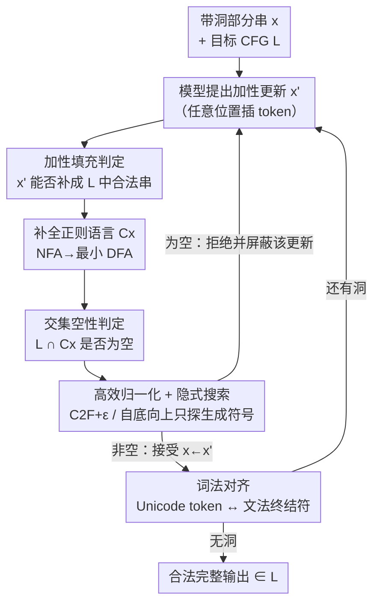

# Constrained Decoding of Diffusion LLMs with Context-Free Grammars

**会议**: ICLR2026  
**OpenReview**: [https://openreview.net/forum?id=7Sph4KyeYO](https://openreview.net/forum?id=7Sph4KyeYO)  
**代码**: https://github.com/eth-sri/constrained-diffusion  
**领域**: LLM / NLP（约束解码、形式语言）  
**关键词**: 约束解码, 扩散语言模型, 上下文无关文法, 多区域填充, 形式语言

## 一句话总结
本文提出第一个能在**扩散语言模型（DLM）**上强制满足**上下文无关文法（CFG）**的约束解码方法：把"任意顺序生成的带洞文本能否补全成合法串"抽象为一个**加性填充判定问题**，再把它归约为"目标 CFG 与所有可能补全构成的正则语言之交集是否为空"，并用一套高度优化的空性判定算法把理论上立方级的开销压到实用范围，在 C++ 代码、JSON、SMILES 上把语法正确率提到近 100%，同时还小幅提升了功能正确率。

## 研究背景与动机
**领域现状**：LLM 在代码补全、结构化数据抽取这些场景里被大量使用，而这些场景往往要求输出严格遵守某种**形式语言**的语法（合法的 C++、符合 schema 的 JSON）。由于 LLM 本质是概率模型，它的输出没有任何语法合法性保证。主流的补救手段是**约束解码（constrained decoding）**：拿目标语言的文法在生成的每一步去做增量解析/校验，把会导致非法的候选 token 提前屏蔽掉，从而不用重启推理就能保证输出落在语言内。商用 API（OpenAI、Anthropic）都已经把"限制输出为 JSON 或 CFG"做成了选项。

**现有痛点**：所有现成的约束解码方法都默认生成是**从左到右、前缀逐步延长**的——它们的解析器是顺着 token 流单向推进的。但新兴的**扩散语言模型**根本不是这么生成的：DLM 从一个全是掩码 $\bot$ 的序列出发，每步挑若干个掩码位置、任意顺序地往里填 token，直到没有掩码为止。这种"乱序往中间插字"的范式，让传统那套"维护一个左到右解析状态"的约束机制彻底失效。此前 Melcer et al. (2024) 只能处理固定前后缀之间的填空，Suresh et al. (2025) 的 DINGO 只能给 DLM 加**正则**约束——而没有任何工作能给 DLM 加 **CFG** 约束（CFG 才能表达括号配对、嵌套控制流这类递归结构，也就是真实编程语言的语法）。

**核心矛盾**：CFG 约束解码的算法假设是"输出是被单调延长的前缀"，而 DLM 的生成是"一个带任意多个洞的部分串被任意顺序地局部修改"。前者解析状态唯一且单向，后者每一步都要回答一个本质更难的问题——**当前这堆碎片，到底还能不能拼成一个合法的完整串**。

**本文目标**：(1) 把约束解码的形式框架推广到支持"带任意多填充区域的乱序更新"，从而同时覆盖**多区域填充（MRI）**和 **DLM** 两种设定；(2) 给出能在这个推广设定下强制 CFG 约束的判定算法；(3) 让这套算法的运行开销在真实模型上可接受。

**切入角度**：作者的关键观察是——不管 token 以什么顺序被填进来，"一个带洞的部分串 $x$ 的所有可能补全"其实构成一个**正则语言** $C_x$。于是"这堆碎片能否补成合法串"就等价于问"目标 CFG 语言 $L$ 与 $C_x$ 的交 $L \cap C_x$ 是否非空"。CFL 与正则语言的交仍是 CFL，而 CFL 的空性判定是多项式可解的——这就把一个看似要枚举无穷补全的难题，变成了一个有成熟理论支撑的判定问题。

**核心 idea**：用"**目标文法 ∩ 补全正则语言的空性判定**"代替"左到右增量解析"，从而第一次让 CFG 约束能加在乱序生成的扩散 LLM 上。

## 方法详解

### 整体框架
方法整体就是把一个标准的"采样—校验—接受/拒绝"约束解码循环（算法 1）跑在扩散/填充生成上：把部分输出写成字符串片段和填充洞交替的形式 $x = x_1\,\square\,x_2\,\square\,\dots\,\square\,x_n$；每一步让模型 $M$ 提出一个**加性更新** $x'$（在某个洞里插入 token，或把相邻片段合并掉一个洞）；然后调用判定器 `COMPLETABLE(x', L)` 判断 $x'$ 还能不能补全成 $L$ 里的合法串——能就接受 $x \leftarrow x'$、不能就拒绝并把这个更新从模型分布里屏蔽掉；当某次更新填掉了最后一个洞且仍 completable 时，输出就一定属于 $L$。

整个方法的技术重量全压在 `COMPLETABLE` 这一个判定上。它分四层解决：先把"能否补全"形式化为**加性填充判定问题**；再证明所有补全构成正则语言、并把判定归约成**CFG∩正则的空性检查**；接着用一整套**归一化 + 自底向上隐式搜索**把立方级开销压下去；最后处理"LLM 吐的是 Unicode token 而不是文法终结符"带来的**词法对齐**麻烦。

### 关键设计

**1. 加性填充判定问题：把乱序生成的合法性统一成一个判定**

传统约束解码把"输出"当成一个会被单调延长的前缀，这套抽象对 DLM 的乱序插字完全不适用。本文先把部分输出定义成片段与洞交替的序列 $x = x_1\,\square\,\dots\,\square\,x_n$（$x_i \in \Sigma^*$，$\square$ 是填充洞），并把每一步生成限定为**加性修改**：要么往某个洞里插入一个串（$a\,\square\,c \to a\,\square\,b\,\square\,c$），要么去掉一个洞、合并相邻片段。于是核心判定问题（定义 1）就是：是否存在 $n-1$ 个词 $y=(y_1,\dots,y_{n-1})$ 使 $w = x_1 y_1 x_2 \dots y_{n-1} x_n \in L$。它的妙处在于**一次抽象同时收编了 MRI 和 DLM 两种设定**——MRI 天然就是"固定片段 + 中间洞"；DLM 只需在序列首尾补隐式 $\varepsilon$ token、再把所有连续非掩码 token 合并成片段即可，例如 $(a,\bot,\bot,b,c,\bot)$ 化成 $x = a\,\square\,bc\,\square\,\varepsilon$。由于 completability 在加性更新下是保持的，所以总存在一串加性更新能把 $x$ 收敛到 $L$ 内，循环不会卡死。

**2. 补全语言的正则刻画 + 交集空性归约：把"能否补全"变成可判定问题**

这一步是整个方法成立的理论支点。作者证明：部分串 $x = x_1\,\square\,\dots\,\square\,x_n$ 的所有可能补全构成的语言 $C_x$——即所有以 $x_1$ 开头、$x_n$ 结尾、按序包含各 $x_i$、中间填任意符号的词——是一个**正则语言**，可以用一个 NFA 显式构造：为每个 $x_i$ 造一个只接受 $x_i$ 的自动机 $D_i$，在它后面接一个对任意 $\sigma$ 都自环（$\delta(q_i,\sigma)=q_i$）的状态 $q_i$ 表示"中间任意填"，再用 $\varepsilon$ 边把各段串起来，最后转成最小 DFA。有了它，"$x$ 能否补全"就等价于交语言 $L_\cap = L \cap C_x$ 是否非空。再利用两个经典事实——(a) CFL 与正则语言的交仍是 CFL，其文法可由 $L$ 的文法 $G$ 与 $C_x$ 的 DFA 构造出来；(b) CFL 的空性可在文法规模的多项式时间内判定——判定就完成了。交文法 $G_\cap$ 的符号形如 ${}_p\vec{A}_q$，直觉是"从 $A$ 推出一个词、同时让 DFA 从状态 $p$ 走到 $q$"，当能从 ${}_{q_0}\vec{S}_{q_f}$ 推出词时交集非空。代价是 $G_\cap$ 规模是立方级的：$|V_\cap| \in O(|V||Q|^2)$，$|P_\cap| \in O(|P||Q|^3 + |P||Q|^2|\Sigma|)$——这正是后面要全力压低的开销。

**3. 三招把立方开销压到实用：C2F+ε 归一化 + 自底向上隐式搜索**

立方 blowup 是这套方法能不能用的生死线，作者用三个优化逼近实用：(i) **C2F+ε 归一化**——标准交集算法要求文法是 Chomsky 范式（只允许 $A\to BC$ 与 $A\to a$），但转 CNF 会让产生式数量平方级膨胀；作者扩展出一个额外允许 $A\to\varepsilon$ 和 $A\to B$ 的范式 C2F+ε，把膨胀降到**线性**。(ii) **只探生成符号的自底向上搜索**——交语言里有极大比例的符号是"非生成的"（推不出任何终结串）。标准空性判定从起始符 $S$ 往下查会白白碰一堆非生成符号；作者改成自底向上：先把能直接推出终结符或空串的符号（$A\to\sigma$、$A\to\varepsilon$）标记为生成并入队，再不断检查"某产生式右端含已入队符号、且另一侧也已是生成符号"来扩散标记，一旦 $S$ 被标记就判定非空。实测这能避开 **98%～99.99%** 的产生式。(iii) **隐式构造交文法**——搜索时不预先生成整个 $G_\cap$，而是只在访问到 ${}_p\vec{B}_r$、${}_r\vec{C}_q$ 这些符号时，按原文法对应规则 $A\to BC$、$A\to B$ 即时枚举出相关交规则，从而完全跳过显式构造庞大文法。此外，判定时顺便记录被用到的产生式就能重建一棵 parse tree，在多次被拒后**零额外成本地采样出一个合法补全**塞回去，避免模型反复撞墙。

**4. 词法对齐：弥合 Unicode token 与文法终结符的错位**

CFG 是定义在终结符上的，但 LLM 吐出来的是 Unicode token，两者边界对不齐，尤其在洞的边界处会产生歧义。例如部分输出 $\bot 2$ 既可能补成 `<int>`（填 `1` 得 `12`）也可能补成 `<ident>`（填 `x` 得 `x2`）。作者在词法分析时**把洞两侧的文本当成可能不完整的终结符**：在洞前找"当前串是某终结符词的前缀"的候选 $t$、洞后找后缀候选，并允许一个终结符跨越一个或多个洞拼成。这样能枚举出所有与部分输出一致的终结符序列，只要其中一条能补成合法程序，部分输出就 admissible。为控住组合爆炸，做两个优化：把一个 $x$ 的所有可能终结符序列合成**单个 NFA**、只跑一次交集算法；并预处理消歧——当终结符 $t_\le$ 的语言被 $t_\ge$ 包含时，从 $t_\ge$ 里挖掉重叠并改写 CFG 让 $t_\le$ 能出现在 $t_\ge$ 允许的位置。最后从交语言采样出的是终结符序列，再把各终结符的正则语言拼接、与当前 Unicode 部分输出的正则语言求交、随机采一个串，就得到 Unicode 级别的合法补全。作者还证明在"最长匹配"词法假设下整套算法是**可靠（soundness，输出必合法）**且**完备（completeness，任何能导出合法输出的 token 都不会被拒）**的，并满足 Beurer-Kellner et al. (2024) 的**最小侵入性**——若无约束模型本来就会生成合法输出，加上约束后结果不变。

### 一个完整示例
以图 1 的 C++ 片段为例。输入 $x = \texttt{int}\,\square\,\texttt{() \{ return 2}\,\square$，目标 CFG 规定函数定义语法 $S \to \text{Def} ( ) \{ \text{Lines} \}$ 等。模型先提议把第一个洞填成 `foo()` 得到 `int foo()() { return 2 ...`——判定器构造该提议的补全正则语言 `int foo() .* (){ return 2 .*`，与 CFG 求交发现**空**（多出来的 `()` 破坏了函数头结构），于是拒绝该更新并屏蔽。改填 `foo` 得到 `int foo() { return 2 ...`，对应补全正则语言 `int foo .* (){ return 2 .*` 与 CFG 求交**非空**（存在合法补全如 `int foo() {return 2;}`），于是接受，解码从这个新状态继续。整个过程不需要从头重启推理，每一步只是一次交集空性判定。

## 实验关键数据

### 主实验
在 **MRI/FIM** 设定下评测 5 个开源填充模型（StarCoder2 7B、CodeGemma 7B、DeepSeek Coder 1.3B/6.7B/33B），任务是 C++ 版 HumanEval（164 题）随机挖 1～3 个 span。`Van.` 为无约束采样，`Con.−` 为约束解码但把超时实例算作失败，`Con.` 为约束解码并对中止实例随机采合法补全。

| 设定 | 指标 | Van.（均值趋势） | Con. | 说明 |
|------|------|------|------|------|
| 1-MRI | 语法正确率 | 88～94% | 近 100% | CodeGemma/DeepSeek 6.7B/33B 达 100% |
| 2-MRI | 语法正确率 | 55～66% | 93～99% | 模型越吃力，约束增益越大 |
| 3-MRI | 语法正确率 | 24～36% | 83～96% | `Con.−` 绝对提升达 +31.5% |
| 平均 | 功能正确率 | — | +2.8% | 语法合法是功能正确的前提 |

约束解码（`Con.`）平均能在 **95.8%** 实例上恢复出语法合法补全，剩余失败均来自超时；`Con.−` 在多区域下提升尤其显著（1/2/3-MRI 绝对提升 5.2% / 22.5% / 31.5%）。

在 **DLM** 设定下评测 4 个扩散模型（LLaDA 8B、Dream 7B、DreamCoder 7B、DiffuCoder 7B），跨 C++ / JSON / SMILES 三任务，并与 **Grammar Prompting（G.P.）** 基线比较。

| 任务 | 指标 | Van. | G.P. | Con.− | Con. |
|------|------|------|------|------|------|
| C++ | 语法正确率(DreamCoder) | 11.0% | 9.1% | 19.0% | 99.2% |
| JSON | 语法正确率(多模型) | 22～78% | 不稳定 | +14.7%均值 | **100%** |
| SMILES | 语法正确率(Dream) | 67.7% | 84.2% | 93.7% | 99.4% |

`Con.−` 对 C++/JSON/SMILES 的语法正确率平均提升 16.1% / 14.7% / 26.0%；加上合法补全采样后 JSON 达 100%、C++ 普遍升到 99%+。功能正确率平均提升约 2.2%（Dream 7B 在 JSON 上提升 6.9%）。

### 消融与开销

| 配置 / 维度 | 关键数据 | 说明 |
|------|---------|------|
| 自底向上搜索 | 避开 98%～99.99% 产生式 | 交语言里绝大多数是非生成符号 |
| MRI 运行开销 | 中位 4.2 ms/token | 1-MRI 3.1 ms → 3-MRI 7.7 ms |
| DLM 补全开销 | 中位 0.1 s | 预先中止时甚至加速最多 1 s |
| 中止阈值 | 100 次重采样 | >50 次重采样的任务仅 0.7% 功能正确 |
| vs DINGO（正则约束） | 同等语法/相近功能正确率 | 本文更通用（CFG）、开销 <0.3 ms 且无需预处理 |

### 关键发现
- **模型越吃力，约束增益越大**：3-MRI（最难）上无约束语法正确率跌到 24～36%，约束后拉回 83～96%，说明约束解码对"模型自己搞不定结构"的场景最有价值。
- **"采样合法补全"是把语法正确率推到接近 100% 的关键一招**：很多模型即便在约束下仍生成不出合法串（DreamCoder C++ 仅 19.0% 在 `Con.−`），靠从交语言里直接采一个合法补全才补到 99.2%。
- **Grammar Prompting 不可靠**：把文法规则塞进 prompt 的软约束基线对语法/功能正确率的影响时好时坏，远不如硬约束稳定。
- **开销可接受**：MRI 每 token 中位仅 4.2 ms、DLM 补全中位 0.1 s，且归一化与隐式搜索是把立方理论开销压到实用的核心。

## 亮点与洞察
- **把"乱序生成的合法性"归约成形式语言交集空性**，是这篇论文最漂亮的一步：一旦意识到"所有补全构成正则语言"，整个难题就接上了几十年积累的自动机/文法理论，可靠性与完备性都能被证明，而不是靠启发式拼凑。
- **MRI 与 DLM 被同一个加性填充抽象统一**：DLM 只是"首尾补 $\varepsilon$、合并连续非掩码 token"后的 MRI，一个判定器同时服务两种范式，工程上非常省。
- **理论立方开销 → 实用毫秒级**靠的不是降低最坏复杂度，而是三个互补的工程优化（C2F+ε 线性归一化、自底向上只探生成符号避开 99%+ 产生式、隐式按需构造交文法），这套"对付 blowup 的组合拳"可迁移到其他 CFL∩正则的判定场景。
- **可迁移性**：词法对齐那套"洞边界终结符可跨洞拼接 + 包含关系消歧"的处理，对任何需要把 LLM token 与形式终结符对齐的约束生成（不限扩散模型）都有参考价值。

## 局限与展望
- **空间被过逼近**：为简化，方法允许洞里填入任意长度的串（与前人一致），实际 LLM 能插的 token 数有限，因此 $C_x$ 略大于真实可达补全集——可能接受一些实际生成不出来的补全（作者在附录 E 讨论）。
- **依赖最长匹配词法假设**：soundness 证明依赖目标语言用 maximal munch 词法，对不满足该假设的语言不直接适用。
- **功能正确率提升有限**：约束只保证语法，SMILES 这种模型本身功能正确率仅 ~1.5% 的任务上，加语法约束几乎不提升功能正确（仅 +0.2%）——语法合法 ≠ 语义正确。
- **最坏复杂度未降**：交文法立方 blowup 是理论硬伤，本文靠启发式压低**实际**开销，但对极复杂文法/超长输出，最坏情况仍可能触发超时（实验里剩余失败正是超时）。
- **改进方向**：把"洞可填长度"建模得更精确以收紧过逼近；探索把判定结果在相邻解码步之间增量复用以进一步降开销。

## 相关工作与启发
- **vs Melcer et al. (2024)（FIM 约束解码）**：他们只能约束"固定前缀与固定后缀之间"的单段填空，本文推广到**任意多个填充区域 + 乱序更新**，从而能覆盖 DLM；两者都用采样—拒绝式实现，但本文的判定基于交集空性而非单向解析。
- **vs DINGO (Suresh et al., 2025)**：DINGO 是给 DLM 加约束的最接近工作，但只支持**正则语言**约束；本文支持更强的 **CFG**（能表达括号配对、嵌套结构），实测语法正确率与 DINGO 持平、功能相近，运行开销 <0.3 ms 且无需 DINGO 那样的预处理。
- **vs Grammar Prompting (Wang et al., 2023)**：G.P. 把文法规则写进 prompt 做软引导，不提供任何保证；本文是硬约束，语法正确率稳定且远高于 G.P.，后者在多个任务上反而拉低正确率。
- **vs 传统左到右 CFG 约束解码（Poesia 2022 / Beurer-Kellner 2024 / Ugare 2024）**：这些方法假设前缀单调延长、维护单一解析状态，无法处理乱序插字；本文用"补全正则语言 ∩ CFG 空性判定"取代增量解析，是把这类技术迁到扩散范式的关键桥梁。

## 评分
- 新颖性: ⭐⭐⭐⭐⭐ 第一个给扩散 LLM 加 CFG 约束的方法，形式语言归约干净漂亮
- 实验充分度: ⭐⭐⭐⭐ 覆盖 9 个模型 × 3 类任务（代码/JSON/分子），含开销与 DINGO 对比，但功能正确率提升空间有限
- 写作质量: ⭐⭐⭐⭐⭐ 理论与算法层层递进，图示（NFA/DFA/交集推导）清晰
- 价值: ⭐⭐⭐⭐⭐ 把"结构化输出保证"从自回归扩展到扩散范式，对代码/结构化生成有直接落地价值

<!-- RELATED:START -->

## 相关论文

- [\[ICLR 2026\] Stopping Computation for Converged Tokens in Masked Diffusion-LM Decoding](stopping_computation_for_converged_tokens_in_masked_diffusion-lm_decoding.md)
- [\[ICLR 2026\] Don't Settle Too Early: Self-Reflective Remasking for Diffusion Language Models](dont_settle_too_early_self-reflective_remasking_for_diffusion_language_models.md)
- [\[ICLR 2026\] In-Context Algebra](in-context_algebra.md)
- [\[ICLR 2026\] d²Cache: Accelerating Diffusion-Based LLMs via Dual Adaptive Caching](d2cache_accelerating_diffusion-based_llms_via_dual_adaptive_caching.md)
- [\[ICML 2026\] Masks Can Be Distracting: On Context Comprehension in Diffusion Language Models](../../ICML2026/llm_nlp/masks_can_be_distracting_on_context_comprehension_in_diffusion_language_models.md)

<!-- RELATED:END -->
