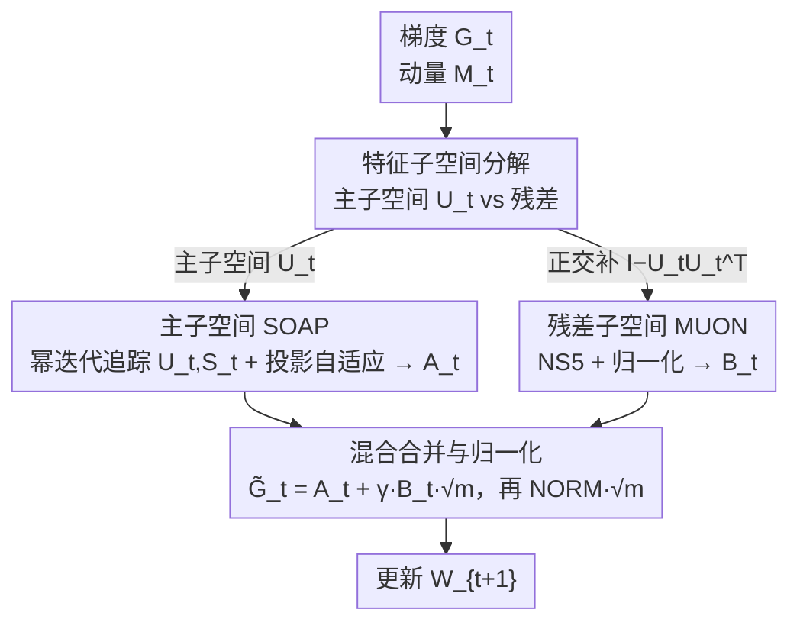

# COSMOS: A Hybrid Adaptive Optimizer for Efficient Training of Large Language Models

**会议**: ICLR2026  
**OpenReview**: [https://openreview.net/forum?id=j2QTOOtM8R](https://openreview.net/forum?id=j2QTOOtM8R)  
**代码**: 待确认  
**领域**: LLM效率 / 优化器  
**关键词**: 自适应优化器, 内存高效, 特征子空间, SOAP, MUON

## 一句话总结
COSMOS 把梯度矩阵按特征子空间拆成"主方向 + 残差"两部分，对信息量最大的低维主子空间用 SOAP 式二阶预条件、对剩下的高维残差用计算便宜的 MUON，从而以接近 MUON 的内存（约为 SOAP 的 1/5）拿到不输甚至略胜 SOAP 的预训练收敛效果。

## 研究背景与动机

**领域现状**：LLM 预训练的主流优化器是 AdamW，逐坐标维护一阶/二阶矩；为了更好刻画参数间的相互依赖，又出现了 Shampoo、SOAP 这类二阶方法（用梯度协方差的特征基做预条件），以及 GaLore、MUON 这类压内存/降算力的近似方法。

**现有痛点**：这几条路线各有硬伤。AdamW 把每个坐标独立处理，捕捉不到坐标间的曲率耦合，更新次优；SOAP 虽然能捕捉坐标依赖，但要维护稠密的 $n\times n$ 二阶矩 $H_t$ 和 $n\times n$ 旋转矩阵，内存随维度平方膨胀（论文里 SOAP 的优化器状态高达 $66d^2$，是 Adam 的近 3 倍），massive LLM 上跑不动；GaLore 只在前 $r$ 个主特征方向上保留动量，把残差子空间的梯度信息整个丢掉，序列长度超过 256 后效果明显退化；MUON 只用单个 batch 的梯度估计特征子空间，没有沿整个优化轨迹累积分布，鲁棒性不如 SOAP。

**核心矛盾**：内存效率和"保住梯度二阶统计/坐标依赖"之间存在 trade-off——想省内存就得近似甚至丢弃梯度统计，丢了就掉点；想保住统计就得维护稠密大矩阵，省不了内存。

**切入角度**：作者的关键观察是**梯度矩阵不同特征子空间的重要性差别很大**——前几个主特征方向（leading eigensubspace）承载了绝大部分优化动态，值得用 SOAP 这种精细但昂贵的处理；而残差子空间虽然也影响收敛、不能丢（这正是 GaLore 的教训），但用 SOAP 处理它"性价比太低"，换成便宜的 MUON 就够。

**核心 idea**：按特征子空间的重要性"分而治之"——主子空间走 SOAP、残差子空间走 MUON，且把 SOAP 严格限制在低维主子空间里，使其只需维护 $O(nr)$ 而非 $O(n^2)$ 的状态。

## 方法详解

### 整体框架

COSMOS 是一个逐层（per-layer）作用的混合优化器：对一个 $m\times n$ 权重矩阵 $W$（设 $m>n$），每步拿到随机梯度 $G_t$ 后，先把动量 $M_t$ 沿当前估计的**主特征子空间** $U_t\in\mathbb{R}^{n\times r}$（$r\ll n$）投影下去做 SOAP 式自适应更新，得到分量 $A_t$；再把动量在主子空间的**正交补**（残差）上用 MUON 的 Newton–Schulz 变换处理，得到分量 $B_t$；最后把两路加权合并、整体归一化后更新权重。整套流程每层只需常驻四个矩阵 $M_t\in\mathbb{R}^{m\times n}$、$U_t\in\mathbb{R}^{n\times r}$、$S_t\in\mathbb{R}^{r\times r}$、$V_t\in\mathbb{R}^{m\times r}$，把 SOAP 的 $n\times n$ 大块全部压成了细长的低秩块。

主子空间 $U_t$ 不是每步重新做 SVD，而是用"一步幂迭代 + QR"在线追踪：把上一步的低秩二阶矩代理 $U_{t-1}S_{t-1}U_{t-1}^\top$ 与新梯度的 $G_t^\top G_t$ 做 EMA 合成 $\tilde H_t$，再对 $\tilde H_t U_{t-1}$ 做 QR 得到新的 $U_t$，并刷新投影二阶矩 $S_t=U_t^\top \tilde H_t U_t$。因为只在 $n\times r$ 上算，QR 复杂度 $O(nr^2)$，可以每步都做、几乎零额外开销（对比 SOAP 的 $O(n^3)$ 还得控制预条件频率）。

### 关键设计

**1. 梯度特征子空间分解：把"重要但少"和"次要但多"分开处理**

COSMOS 的出发点是对梯度二阶矩 $H_t$ 的特征谱做"重要性分层"。它把更新拆成在主特征子空间 $U_t$ 上的投影分量、和在正交补 $P_t^\perp=I-U_tU_t^\top$ 上的残差分量。主子空间维度 $r$ 极小（实验里 $r=0.05d$ 量级，130M 模型取 $r=64$），却承载了主要优化动态，所以"少而精"的它配得上 SOAP 的精细处理；残差子空间维度大但每个方向贡献小，用便宜的 MUON 兜底即可。这一刀切的好处是：既没像 GaLore 那样把残差直接扔掉（避免长序列退化），又没像 SOAP 那样对全空间一视同仁地花大内存。

**2. 主子空间 SOAP：低秩投影 + 一步幂迭代在线追踪特征基**

这是 COSMOS 省内存的核心。SOAP 原本要维护稠密 $H_t=\beta_2 H_{t-1}+(1-\beta_2)G_t^\top G_t\in\mathbb{R}^{n\times n}$，COSMOS 改成只维护它的低秩代理：一组正交基 $U_t\in\mathbb{R}^{n\times r}$ 加投影二阶矩 $S_t\approx U_t^\top H_t U_t\in\mathbb{R}^{r\times r}$。更新时先把 $H_{t-1}$ 用 rank-$r$ 代理 $U_{t-1}S_{t-1}U_{t-1}^\top$ 替代，代入 EMA 得 $\tilde H_t=\beta_2 U_{t-1}S_{t-1}U_{t-1}^\top+(1-\beta_2)G_t^\top G_t$，再用一步幂迭代更新基 $U_t=\mathrm{QR}(\tilde H_t U_{t-1})$、刷新 $S_t=U_t^\top\tilde H_t U_t$。随后在 $U_t$ 张成的子空间里维护投影梯度的 EMA $V_t\in\mathbb{R}^{m\times r}$，做一次 SOAP 式自适应（带偏置校正）再投影回全空间：

$$A_t=\left(\frac{M_t U_t/(1-\beta_1^t)}{\sqrt{(V_t+\epsilon)/(1-\beta_2^t)}}\right)U_t^\top .$$

整套只在 $O(nr)$ 内存里完成，保留了 SOAP 捕捉坐标依赖的能力，却把它的 $n\times n$ 开销砍到细长低秩；又因 QR 只在 $n\times r$ 上算，可每步刷新基，不像 SOAP 必须为省算力降低 eigendecomposition 频率而损精度。

**3. 残差子空间 MUON：对正交补动量做 Newton–Schulz 近似 matrix-sign**

主子空间之外的残差不能丢，但用 SOAP 处理它"贵且不值"。COSMOS 改用 MUON 思路：先取动量在正交补上的分量 $M_t-M_tU_tU_t^\top$，归一化后送进 5 步 Newton–Schulz 迭代 $\mathrm{NS}_5(\cdot)$，再做一次 Frobenius 范数归一化得到

$$B_t=\mathrm{NORM}\!\left(\mathrm{NS}_5\!\left(\frac{M_t-M_tU_tU_t^\top}{\lVert M_t-M_tU_tU_t^\top\rVert_F}\right)\right).$$

$\mathrm{NS}_5$ 用固定系数（$a=3.4445,\ b=-4.7750,\ c=2.0315$）的多项式迭代近似 matrix-sign 算子 $\mathrm{MatSgn}(X)=UV^\top$，无需做 SVD、也不额外存矩阵，全靠矩阵乘法跑得快。值得注意的是 COSMOS 在 NS 之后多加了一步归一化（MUON 原版没有），消融显示即使把 MUON 也加上归一化，COSMOS 仍更好——说明收益不是单靠归一化，而是来自"主子空间分出去做 SOAP"。

**4. 混合合并与全局归一化：用一个无需调的 γ 把两路接起来**

两路分量按 $\tilde G_t=A_t+\gamma B_t\sqrt m$ 合并，再整体做 $W_{t+1}=W_t-\eta\,\mathrm{NORM}(\tilde G_t)\sqrt m$。其中 $\mathrm{NORM}(X)=\sqrt n\,X/\lVert X\rVert_F$，配合 $\sqrt m$ 让更新的 Frobenius 范数维持在 $\Theta(\sqrt{mn})$，与 MUON 的尺度对齐、保证训练稳定。折扣系数 $\gamma$ 控制残差分量的权重，作者给了一个免调启发式 $\gamma=\eta/\eta_0$（$\eta_0$ 是用 Adam 训练 embedding/输出层的学习率），实验证明它正好落在最优区间 $0.25\sim0.5$ 内，省掉了对 $\gamma$ 的额外网格搜索。

### 损失函数 / 训练策略

COSMOS 不改训练目标，仍是标准 LLM 预训练的下一 token 预测损失，它只替换优化器。实现上 embedding 与输出层用 Adam 训练，其余权重矩阵用 COSMOS（与 SOAP/MUON 的常规做法一致）。默认超参：动量 $(\beta_1,\beta_2)$、投影秩 $r\ll n$（130M 取 64）、$\gamma=\eta/\eta_0$，最大序列长 1024。

## 实验关键数据

### 主实验

在 C4 上预训练 LLaMA（130M/350M/1B），按 scaling law 喂 5B–26B token，比较最终验证困惑度（越低越好）：

| 模型(Token) | Adam | Adam-mini | GaLore | SOAP | MUON | COSMOS |
|------|------|------|------|------|------|------|
| 130M(5B) | 21.28 | 21.78 | 24.07 | 20.59 | 20.69 | **20.54** |
| 350M(10B) | 17.28 | 18.03 | 19.03 | 16.32 | 16.49 | **16.21** |
| 1B(26B) | 12.97 | – | – | – | 12.57 | **12.46** |

COSMOS 在三种规模上都拿到最低困惑度，token 效率与 SOAP 持平甚至略胜，并稳定优于 MUON；GaLore/Adam-mini 明显落后，印证"残差不能丢、坐标依赖很关键"。

1B 模型上的内存与单步耗时（batch=10）：

| 方法 | 显存 | 单步墙钟 |
|------|------|------|
| Adam | 62.75 G | 34.73 s |
| SOAP | 72.58 G | 39.51 s |
| MUON | 58.25 G | 35.56 s |
| COSMOS | **58.47 G** | 35.75 s |

COSMOS 显存比 SOAP 低 19.4%、比 Adam 低 6.8%，几乎与 MUON 持平，而耗时只比 MUON 多一点点、比 SOAP 快不少。优化器状态的理论显存对比更夸张：Adam $24d^2$、SOAP $66d^2$、MUON $12d^2$、COSMOS 仅 $13d^2$（取 $r=0.05d$）。单卡 A100-80G 上 COSMOS 最大 batch 14（与 MUON 同，SOAP 只有 10），吞吐比 SOAP 快 10.8%。

### 消融实验

| 配置 | 关键结果 | 说明 |
|------|---------|------|
| 不同学习率 ($\gamma=\eta/\eta_0$) | lr 从 2e-4→2e-3 困惑度 21.17→20.54→20.62→21.00 | COSMOS 对 lr 不敏感，全程优于 MUON（MUON 在 2e-3 时崩到 26.74） |
| 不同 $r,\gamma$ | 仅 ($r{=}128,\gamma{=}1$) 略逊 MUON，其余全胜 | 对秩和折扣因子都鲁棒，$\gamma\in[0.25,0.5]$ 最佳 |
| 给 MUON 也加归一化 | COSMOS 仍更优（Fig.7） | 增益不只来自归一化，而来自主子空间 SOAP |
| 长序列 (>256) | COSMOS 不退化，GaLore 显著退化 | 残差子空间保留信息的价值 |

### 关键发现
- **主子空间分出去做 SOAP 才是核心增益来源**：把 MUON 也补上归一化后 COSMOS 仍更强，说明性能不是归一化技巧带来的。
- **秩越大反而可能更差**：当 $r$ 偏大时，top-$r$ 特征值里混入了与残差接近的小特征值，一步幂迭代逼近这些方向误差变大，所以小秩（如 64）反而稳。
- **GaLore 长序列退化被复现并解释**：丢掉残差子空间在长序列上代价惨重，COSMOS 因保留残差而免疫。
- 跨设置稳健：在 FineWeb 上的 LLaMA-130M（大 batch 4096、强 weight decay）、Modded-NanoGPT、WikiText-103 上的 GPT-2 small/medium，COSMOS 都稳定优于 MUON/Adam。

## 亮点与洞察
- **"特征子空间按重要性分层、再分配不同算法"是个很可迁移的思路**：不是所有方向都值得同等算力，把贵方法留给少数主方向、便宜方法兜底残差，本质是在"信息密度"上做预算分配，可推广到其他需要二阶/曲率信息的场景（如内存受限的微调、分布式预条件）。
- **用一步幂迭代 + QR 在线追踪低维特征基**，避免了 SOAP 每隔若干步做全量 SVD/eigendecomposition 的尴尬，让"每步刷新预条件"在低秩下变得免费——这是把 SOAP 从 $O(n^3)$ 拉到 $O(nr^2)$ 的关键工程点。
- **$\gamma=\eta/\eta_0$ 免调启发式**很实用：把一个本该网格搜索的超参直接绑到已有学习率上，且恰好落在最优区间，省了一轮调参，工程友好。
- 让我"啊哈"的是它把 GaLore 的失败（丢残差→长序列崩）和 SOAP 的失败（全空间太贵）同时当作设计约束，最终方案像是两者缺点的"补集"。

## 局限与展望
- **大规模验证有限**：1B 上因算力没跑 SOAP 对照，350M 以上的消融也不充分，更大模型（10B+）上"主子空间承载主要动态"的假设是否依旧成立、$r=0.05d$ 是否仍够，尚未验证。
- **秩 $r$ 的选择缺乏自适应机制**：实验显示秩偏大会因幂迭代逼近误差变差，但论文用的是固定秩，没有给出随训练自适应调秩的策略，留作改进空间。
- **只覆盖预训练**：MUON/GaLore 在微调上的表现各异，COSMOS 在指令微调/长上下文持续训练等场景的行为未测。
- **一步幂迭代的逼近误差**在主子空间内特征值接近时会放大（作者自己指出），对谱较"平"的层可能不稳，值得做按层自适应的秩/迭代步数。

## 相关工作与启发
- **vs SOAP**：SOAP 在全 $n$ 维空间维护稠密二阶矩与旋转基（$66d^2$ 状态、$O(n^3)$ 分解），COSMOS 只在 rank-$r$ 主子空间做 SOAP（$13d^2$、$O(nr^2)$），用 MUON 兜残差；效果持平/略胜而内存砍到约 1/5。
- **vs MUON**：MUON 对整个动量做 NS5 近似 matrix-sign，只用单 batch 估计、没沿轨迹累积特征分布；COSMOS 在主子空间额外维护沿轨迹的二阶矩 EMA，鲁棒性与稳定性更好，全 lr 区间都赢 MUON。
- **vs GaLore**：GaLore 只在主子空间保留动量、丢弃残差，长序列（>256）退化；COSMOS 保留残差并交给 MUON，长短序列都不退化。
- **vs Adam / Adam-mini**：逐坐标、捕捉不到坐标依赖；COSMOS 通过子空间预条件保留了坐标间耦合，token 效率明显更高。

## 评分
- 新颖性: ⭐⭐⭐⭐ "按特征子空间重要性混合 SOAP+MUON"是简洁有效的新组合，思路清晰
- 实验充分度: ⭐⭐⭐⭐ 多模型多数据集 + 内存/吞吐 profiling + 丰富消融，但 1B+ 规模与 SOAP 对照受算力限制
- 写作质量: ⭐⭐⭐⭐ 动机—算法—内存分析—实验链条完整，伪代码与公式清楚
- 价值: ⭐⭐⭐⭐ 给内存受限的 LLM 预训练提供了一个接近 MUON 内存、接近 SOAP 效果的实用优化器

<!-- RELATED:START -->

## 相关论文

- [\[ICLR 2026\] PT2-LLM: Post-Training Ternarization for Large Language Models](pt2-llm_post-training_ternarization_for_large_language_models.md)
- [\[ACL 2025\] Semantic Exploration with Adaptive Gating for Efficient Problem Solving with Language Models](../../ACL2025/llm_nlp/semantic_exploration_adaptive_gating.md)
- [\[ACL 2025\] A Survey on Efficient Large Language Model Training: From Data-centric Perspectives](../../ACL2025/llm_nlp/a_survey_on_efficient_large_language.md)
- [\[ICLR 2026\] The Lattice Representation Hypothesis of Large Language Models](the_lattice_representation_hypothesis_of_large_language_models.md)
- [\[ACL 2026\] GRASS: Gradient-based Adaptive Layer-wise Importance Sampling for Memory-Efficient LLM Fine-tuning](../../ACL2026/llm_nlp/grass_gradient-based_adaptive_layer-wise_importance_sampling_for_memory-efficien.md)

<!-- RELATED:END -->
