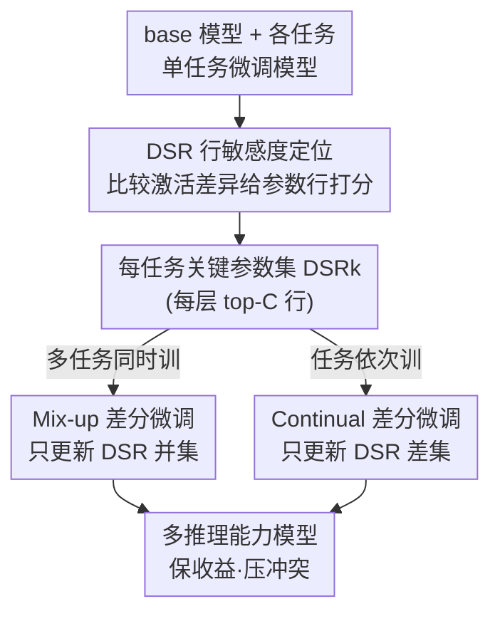

# Differential Fine-Tuning Large Language Models Towards Better Diverse Reasoning Abilities

**会议**: ICLR2026  
**OpenReview**: [https://openreview.net/forum?id=aIhn4GhTBW](https://openreview.net/forum?id=aIhn4GhTBW)  
**代码**: 待确认  
**领域**: LLM推理 / 监督微调 / 多任务学习  
**关键词**: 差分微调, 参数敏感度, 多任务冲突, 持续学习, 推理能力

## 一句话总结
本文发现不同推理能力（数学/代码/逻辑/常识）在 LLM 内部对应着各自"专属"的关键参数，提出 DiFT（Differential SFT）：先用 DSR 分数定位每个任务的关键参数行，再在混合微调时只更新这些关键参数的并集、在持续微调时只更新当前任务独有的关键参数，从而在多推理任务联合训练中既保住各自收益又避免互相破坏。

## 研究背景与动机
**领域现状**：监督微调（SFT）是给 LLM 注入推理能力的主流手段——在数学（MathInstruct）、代码（Code Bagel）、逻辑（LogiCoT）、常识（CommonsenseQA）等单一数据集上微调，能稳定提升对应能力。实际中人们希望一个模型同时具备多种推理能力，于是把多个数据集混在一起训（mix-up）或者依次训（continual）。

**现有痛点**：作者做了系统实验后发现一个反直觉现象——无论混合训还是持续训，都无法稳定保住"单数据集 SFT"的水平，有时更好、有时反而更差。例如 Llama3-8B 上 `Mix-Math-Code` 把 GSM8k 从 61.64% 提到 64.82%（数学和代码互相促进），但代码指标 xGLUE 反而略低于 `Code-only`；而 `Continual-Math-Logic` 直接把数学从 39.42% 砸到 10.99%，出现严重的负迁移。这说明朴素 SFT 既能促进推理能力、也会引入冲突。

**核心矛盾**：以往工作（HFT、LoTA、DMT）大多把任务间的相互作用一律当成"有害干扰"来抑制，或者只在数据层面做文章，忽略了任务关系其实是**有益、冲突、中立三种并存**的完整图景。问题的根因在于：不同推理能力到底是共享同一批参数（所以会打架）还是各占一摊（所以本可互不干扰）？此前没人从参数层面把这件事讲清楚。

**本文目标**：(1) 搞清不同推理能力之间的收益与冲突是怎么来的；(2) 设计一种微调策略，让混合/持续 SFT 都能保住各任务收益、压住冲突，甚至超过单数据集 SFT。

**切入角度**：作者去看微调后模型相对 base 模型在推理时的**参数变化**，假设"某个能力靠哪些参数"是可以被定位的。

**核心 idea**：用一个衡量参数敏感度的 DSR 分数把每个推理任务的"专属关键参数"找出来，然后**只对该更新的参数动手、冻结其余参数**——混合训练只动各任务关键参数的并集，持续训练只动新任务独有的那部分，从源头上避开不必要的冲突。

## 方法详解

### 整体框架
DiFT 分两步走。**第一步是分析**：给定一个 base 模型 $M_{base}$ 和若干已在单任务上微调好的模型 $\{M_{ft}^k\}$，对每个任务采样少量数据，在前向过程中比较 base 与微调模型在各层的**输出激活差异**，用 DSR（delta-scale row，行级缩放）分数给每一行参数打分，取每层 top-$C$ 高分行作为该任务的关键参数集 $DSR_k$。**第二步是差分微调**：根据是混合还是持续场景，用不同方式组合各任务的 $DSR_k$，只解冻这部分参数训练、冻结其余参数。整套流程的关键在于"该更新谁、该冻结谁"完全由 DSR 分析驱动，而不是像 HFT 那样随机冻一半、也不像 DMT 那样只在数据顺序上做文章。

### 关键设计

**1. DSR 分数：用激活差异定位每个推理任务的"专属参数行"**

要做差分微调，前提是知道"哪些参数对当前任务最关键"。作者从微调的本质出发：微调过程 $W^{s+1}=W^s-\eta_s g_s$ 意味着权重变化 $\Delta W_k=-\int_0^T g_k(\tau)\,d\tau$，对损失做二阶 Taylor 展开 $\Delta L_k=-g_k\Delta W_k-\tfrac{1}{2}H_{kk}(\Delta W_k)^2+o(\cdot)$，说明只有 $|\Delta W_k|$ 不平凡的行才真正参与了损失下降。但 $\Delta W$ 本身不好直接比较，作者转而看输出激活的变化：对同一输入 $X$，比较 base 与微调模型某层第 $k$ 行的输出差 $\Delta Y_t^k=Y_{ft}^k(t)-Y_{base}^k(t)=X_t\Delta W_k$，由此定义 DSR 分数

$$s_k=\mathbb{E}_t\big[\lVert \Delta Y_t^k\rVert_2^2\big]=\lVert \Delta W_k\rVert^2\,\mathbb{E}_t\big[\lVert X_t\rVert^2\big]$$

实践中用 $s_k=\tfrac{1}{N}\sum_{t=1}^N \lVert\Delta Y_t^k\rVert_2^2$ 估计。分数高的行表示微调让它的激活幅度变化大，是被这个任务"重塑"过的关键行。

这个设计的妙处在于它揭示了一条经验规律：作者用不同随机种子（42/43/44）多次采样，发现**同一推理任务的 DSR 分布高度稳定**（如数学任务在 284、1992、9246 等行反复出现尖峰），而**不同任务的高分行明显不同**（数学和逻辑的 top-2 是 284、1992，代码却是 6280、9246；逻辑还有 index>13000 的关键行，数学则全在 13000 以下）。这就从参数层面证实了"每种推理能力有自己的专属参数，重叠参数才是收益/冲突的来源"——为后面的差分更新提供了直接依据。

**2. Mix-up 差分微调：只训练各任务关键参数的并集，冻住其余**

混合微调要同时学多个任务。设任务 A、B 的关键参数集为 $S_A=DSR_A$、$S_B=DSR_B$，DiFT 计算所有涉及任务关键集的并集

$$DSR_{union}=\bigcup_{k=0}^{K-1}DSR_k$$

只在 $DSR_{union}$ 上、用混合数据 $\bigcup_k D_k$ 训练，其余参数 $1-S_A\cup S_B$ 全部冻结。

背后的逻辑很直白：$S_A$、$S_B$ 是维持 A、B 各自性能的"命根子"，必须放开让它们学；虽然 $S_A$ 与 $S_B$ 之间仍可能互相干扰，但这种细粒度冲突难以精确度量、不在本文处理范围，作者选择"抓大放小"——先保住 A、B 的基础性能。而并集之外的参数，作者在分析中已观察到它们更可能是冲突来源，因此干脆冻结，防止它们在联合训练中把 A、B 拖下水。相比 DMT 只调数据顺序、CoBa 只调 loss 权重，DiFT 是在**参数子空间**这一层把"该学的学、该护的护"分开。

**3. Continual 差分微调：只更新新任务独有的关键参数，护住历史能力**

持续微调天生带着灾难性遗忘，且本文证明遗忘之外还叠加了推理冲突。DiFT 的做法是：在第 $k$ 步（$k\ge 2$）只更新"对任务 $k$ 关键、但此前从未被当作关键"的参数差集

$$DSR_{diff}=DSR_k \setminus \bigcup_{j=0}^{k-1}DSR_j$$

从上一阶段模型 $M_{ft}^{k-1}$ 出发，只训练 $DSR_{diff}$。

直觉上，对历史任务 A，冻结 $S_A$ 能把当前任务 B 对 A 的负面冲击挡住（因为 $S_A$ 对 A 至关重要）；对新任务 B，只用 $S_B-S_A$ 这部分来提升 B，等于把"学新东西"和"旧表示"解耦开。作者也验证过另一种方案——直接训 $1-S_B$，但实验（附录 D.6）表明 $DSR_{diff}$ 更好。这一设计让模型在依次学习时既不抹掉旧能力、又能腾出独立参数学新技能。

### 损失函数 / 训练策略
DiFT 不改训练目标，仍是标准 SFT 交叉熵，只在**可训练参数的掩码**上做文章——根据 $DSR_{union}$（混合）或 $DSR_{diff}$（持续）决定哪些行解冻。所有 DiFT 结果基于 top-100 DSR 并集；DSR 分析只需用约 1k 条数据做小规模 SFT、再在少量样本上推理即可得到，计算开销比 task-vector、梯度类方法更轻。作者用 base 而非 instruct 模型做分析与验证，因为 instruct 模型经过海量后训练、内在收益/冲突难以测量；但 DiFT 微调出的模型在逻辑、常识等任务上甚至能超过 instruct 模型，说明结论对 base/instruct 都有借鉴意义。

## 实验关键数据

### 主实验
模型用 Qwen2.5-3B / Llama3-8B / Mistral-7B / Qwen2.5-14B，4 个推理基准：GSM8k（数学）、xGLUE（代码 pass rate）、LogiQA2（逻辑）、CSQA（常识）。核心指标 ATA（average target accuracy，平均目标准确率）：数学+逻辑取 $(math+logic)/2$，代码 pass rate ×50 对齐量纲，专门衡量涉及任务相对 base 的整体增减。

| 场景 | 组合 | 模型 | 基线最优 | DiFT (ours) | ATA 提升 |
|------|------|------|----------|-------------|----------|
| Mix-up | Mix-Math-Code | Llama3-8B | 59.91 (CoBa) | **60.35** | 保住数学/代码互益 |
| Mix-up | Mix-Math-Code | Mistral-7B | 52.87 (vanilla) | **54.80** | +1.93（朴素几乎不互益） |
| Mix-up | Mix-Code-Logic | Mistral-7B | 46.44 (vanilla) | **47.64** | 两能力齐升 |
| Mix-up | Mix-Logic-CSQA | Mistral-7B | 52.90 (vanilla) | **53.07** | 逻辑/常识冲突下仍保 |
| Continual | Math→Code | Llama3-8B | 48.28 (HFT) | **49.55** | +2.62 vs 基础 |
| Continual | Math→Code | Mistral-7B | 57.43 (HFT) | **65.81** | +1.23 且代码更强 |

混合场景下基线（DMT/CoBa）极难超过朴素 SFT，而 DiFT 在各模型各组合上稳定抬高 ATA；持续场景下 DiFT 在学好新任务（代码）的同时保住更多旧任务（数学）。

### 消融与分析

| 配置 | 关键发现 | 说明 |
|------|---------|------|
| DSR 跨种子稳定性 | 同任务高分行高度一致 | 关键参数对同任务不同输入不敏感 |
| DSR 跨任务差异 | 数学/逻辑 top-2 是 284/1992，代码是 6280/9246 | 不同推理能力占用不同参数 |
| $DSR_{diff}$ vs $1-S_B$ | $DSR_{diff}$ 更优（附录 D.6） | 持续场景差集更新更稳 |
| 因果性验证 | 收益来自冲突缓解而非正则（附录 D.2/D.5） | 排除"只是少更新参数"的解释 |

### 关键发现
- **任务关系有结构**：数学与代码倾向协同（共享相似的计算式推理背景），逻辑与常识倾向冲突（逻辑要守严格规则、常识靠基础知识与简单推理），这种结构和 DSR 参数重叠情况吻合。
- **收益不对称**：`Mix-Math-Code` 中数学受益更多、代码几乎无增益，说明两任务互益时一方可能拿走大部分好处。
- **冲突独立于遗忘**：持续场景下即便有灾难性遗忘，推理冲突仍单独存在（如 Continual-Math-Code 的 pass rate 从 1.084 掉到 0.9902），DiFT 可与数据驱动方法（DiFT-SSR）正交组合，先缓解遗忘再压冲突。

## 亮点与洞察
- **把"任务关系"做成了参数层面的可观测量**：DSR 分数让"数学靠哪些行、代码靠哪些行"变成能画出来的尖峰分布，这比泛泛说"任务有冲突"扎实得多，是全文最"啊哈"的地方。
- **抓大放小的工程哲学**：作者坦承 $S_A$ 与 $S_B$ 内部的细粒度冲突测不准，干脆只保关键参数、冻其余，方法因此简单可落地——不需要梯度投影、不需要复杂 loss 设计。
- **低成本可迁移**：DSR 只需 1k 数据小规模微调即可定位关键参数，这套"用激活差异找任务专属参数→只更新该更新的"思路可迁移到任意多任务 SFT、甚至模型合并/LoRA 子空间选择场景。
- **DSR 由二阶 Taylor + 激活差异双重推导**，把"参数变化大"和"对损失影响大"联系起来，理论动机比纯启发式的随机冻结（HFT）更清晰。

## 局限与展望
- **关键参数集内部冲突未解**：作者明确把 $S_A$、$S_B$ 之间的细粒度冲突划在范围外，这意味着当两任务关键参数高度重叠时，DiFT 的保护力会下降（如 Mix-Code-Logic 仍伤到 Llama3-8B 的数学）。
- **依赖已有单任务微调模型**：DSR 分析需要先有各任务的 $M_{ft}^k$ 来对比激活，多任务时这步成本和数据准备不可忽略。
- **top-$C$/top-100 是固定超参**：关键行数量如何随层、随任务自适应选择没有展开，可能影响在更多任务（4-5 个）混合时的可扩展性。
- **评测局限于 4 类推理 + 中小模型**：ATA 的加权方式（代码 ×50）带一定人为性，跨任务比较需谨慎；更大规模、更多样推理任务上的表现待验证。

## 相关工作与启发
- **vs HFT**：HFT 在持续微调时**随机冻结一半**参数来抗遗忘；DiFT 用 DSR **精确定位**该冻哪些，护的是真正承载历史能力的参数，而非碰运气。
- **vs LoTA**：LoTA 用 task vector 抽取 + 稀疏适配做梯度投影压制干扰；DiFT 不做投影，直接在参数子空间上"只训该训的"，计算更轻，且把任务关系建模为有益/冲突/中立三态而非一律有害。
- **vs DMT**：DMT 在数据层面设计双阶段混合顺序；DiFT 在参数层面动刀，二者正交，可叠加（DiFT-SSR）。
- **vs Task Vector / 子空间方法**：Task Vector 把微调-预训练参数差当任务权重做加减，Zhang et al. 找内在任务子空间；DiFT 进一步把"具体参数行"和"具体推理任务"绑定起来，填上了前人"没把参数和任务连起来"的缺口。

## 评分
- 新颖性: ⭐⭐⭐⭐ 把推理任务冲突落到 DSR 参数行层面并据此设计差分更新，视角新颖且有理论铺垫。
- 实验充分度: ⭐⭐⭐⭐ 覆盖 4 个模型、混合/持续两种场景、多组任务组合及因果性消融，但任务种类仍偏少。
- 写作质量: ⭐⭐⭐⭐ 分析→发现→方法链条清晰，DSR 推导完整；部分符号与附录引用较密。
- 价值: ⭐⭐⭐⭐ 给多推理任务 SFT 提供了简单可落地的参数级方案，对模型合并/持续学习有迁移价值。

<!-- RELATED:START -->

## 相关论文

- [\[ACL 2025\] HFT: Half Fine-Tuning for Large Language Models](../../ACL2025/llm_nlp/hft_half_fine-tuning_for_large_language_models.md)
- [\[ICML 2025\] Safe Delta: Consistently Preserving Safety when Fine-Tuning LLMs on Diverse Datasets](../../ICML2025/llm_nlp/safe_delta_consistently_preserving_safety_when_fine-tuning_llms_on_diverse_datas.md)
- [\[NeurIPS 2025\] Triplets Better Than Pairs: Towards Stable and Effective Self-Play Fine-Tuning for LLMs](../../NeurIPS2025/llm_nlp/triplets_better_than_pairs_towards_stable_and_effective_self-play_fine-tuning_fo.md)
- [\[NeurIPS 2025\] Sparse MeZO: Less Parameters for Better Performance in Zeroth-Order LLM Fine-Tuning](../../NeurIPS2025/llm_nlp/sparse_mezo_less_parameters_for_better_performance_in_zeroth-order_llm_fine-tuni.md)
- [\[ACL 2025\] Assessing and Enhancing the Causal Reasoning Abilities of Language Models via Faithful Textual Interpretation](../../ACL2025/llm_nlp/assessing_and_enhancing_the_causal_reasoning_abilities_of_language_models_via_fai.md)

<!-- RELATED:END -->
