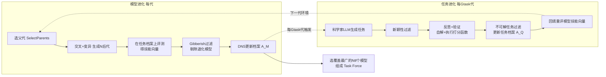

# Discovering Novel LLM Experts via Task-Capability Coevolution

**会议**: ICLR 2026  
**OpenReview**: [https://openreview.net/forum?id=efNINVs2So](https://openreview.net/forum?id=efNINVs2So)  
**代码**: 待确认  
**领域**: LLM / 开放式进化 / 模型合并  
**关键词**: open-endedness, coevolution, model merging, quality-diversity, collective intelligence, LLM discovery  

## 一句话总结
提出 AC/DC 框架，让一群 LLM（通过进化式模型合并演化）和一批合成任务（通过"科学家 LLM"生成）相互协同进化，在单次运行中自动发现一整套互补的小专家模型，其集体覆盖度（Coverage）能超过同族更大的模型乃至逼近/超过 GPT-4o，而总参数量却小得多。

## 研究背景与动机
**领域现状**：前沿模型开发追求模型持续涌现多样能力，但当下"预训练+后训练"范式每要扩展一项能力，都得人工启动一次新训练、配好静态数据集或奖励函数；即便用合成数据和宽域奖励做自改进，每次也只产出**一个**大而全的静态模型。

**现有痛点**：把所有现实问题都押注在单个大静态模型上有两层困境——一是"碎裂纠缠表示"（fractured entangled representations）和推理成本问题让单模型难以稳健覆盖全部任务；二是不断把模型做大、把数据搞多对普通 ML 研究者门槛过高、不可及。

**核心矛盾**：开发者被迫在静态数据/环境/算法/架构上做增量改进来推前沿，整个流程是"人工启动、单模型产出"，与"持续无止境地积累新能力"这个目标天然冲突——知识是开放积累的，但训练范式是封闭定向的。

**本文目标**：借鉴集体智能（CI）与开放式进化（open-endedness, OE）思想，在**单次运行**中自动发现一**整群**小而可及、能力互补的专家 LLM，不针对任何 benchmark 做显式优化，却能随时间持续涌现更新、更复杂的技能。

**核心 idea**：**[模型-任务协同进化]** 把开放式协同进化首次扩展到 LLM 发现——一边用进化式模型合并（crossover + mutation）演化 LLM 种群，一边用大"科学家 LLM"通过合成数据生成演化任务种群，两者互为环境、共同变难变多样；**[最小判据 + 质量-多样性]** 用最小判据（MC）过滤掉退化模型和不可解任务，用质量-多样性（QD）选择保证种群既高质又行为多样。

## 方法详解

### 整体框架
AC/DC（Assessment Coevolving with Diverse Capabilities）同时维护两个不断更新的档案：**模型档案 $A_M$**（由 DNS 基于技能向量选出的活跃 LLM）和**合成任务档案 $A_Q$**（一组越来越复杂、新颖的挑战）。每一代先做"模型进化"——选父代、合并变异生成后代、在任务上评测得到技能向量、过滤退化模型、用 QD 更新档案；每隔 $G_{task}$ 代再做一次"任务进化"——科学家 LLM 生成新任务、过滤相似/不可解任务、回填重评模型技能向量。最后从历史档案里选出覆盖合成任务分布最广的 $N_{tf}$ 个模型组成"任务力量（task force）"，再在 OOD 的真实 benchmark 上评测。

### 关键设计

**1. 进化式模型合并：用交叉与奇异值变异生成新 LLM 种群** —— AC/DC 不从头训练，而是把已有 LLM 当"踏脚石"做无梯度进化。交叉时随机抽两个父模型，对其任务向量 $\tau_{p_i}=\theta_{\text{parent}_i}-\theta_{\text{base}}$（父模型与基座之差）做加权线性插值合并（沿用 CycleQD 思路）。变异则更巧妙：对合并后每个权重矩阵 $W$ 做奇异值分解 $W=U\Sigma V^T$，只给 $\Sigma$ 的前 $k$ 个奇异值加噪声再重建——这样在改变表示结构的同时保留权重矩阵的整体几何，避免破坏性突变。这套算子让"造一个新专家"的成本从一次训练跑降到一次合并，是整个开放式发现得以在单次运行内进行的物理基础。

**2. Coverage 度量 + 技能向量：以集体互补能力而非单模型精度为目标** —— 衡量种群价值的不是单模型准确率，而是**集体能解多少题**。给定 $Q$ 道题、$N$ 个模型，Coverage 定义为
$$\text{Coverage}=\frac{1}{Q}\sum_{q=1}^{Q}\left(\bigvee_{i=1}^{N}(x_{q,i}=y_q)\right)$$
即"只要种群里有**任一**模型答对该题就算覆盖"（$\bigvee$ 为逻辑或）。每个模型再被表示成二值**技能向量**——每个分量记一道任务是否做对，这是模型的行为签名，使得无需像 MAP-Elites 那样预定义 niche 就能直接比较模型差异。技能向量之间的距离正是后续多样性选择的依据，把"我们要的是互补而非冗余"这一目标显式编码进了优化信号里。

**3. Dominated Novelty Search（DNS）做质量-多样性选择：奖励"离强者远"的模型** —— 传统优化求单个最优解，QD 求一**整组**又好又多样的解。AC/DC 用 DNS 在技能向量空间上选模型：对模型 $i$，先取所有比它更强的解集合 $D_i$，再在其中找 $k$ 个距离最近的邻居 $K_i$，计算局部竞争适应度
$$\tilde{f}_i=\begin{cases}\frac{1}{k}\sum_{j\in K_i}d_{i,j} & \text{if }|D_i|>0\\ +\infty & \text{otherwise}\end{cases}$$
含义是：一个模型若离"比它更强的那些模型"在行为空间上越远，得分越高（最强者 $|D_i|=0$ 直接得 $+\infty$ 保留）。这等于奖励"在某个角落独占强项、强者管不到的地方"的专家，从机制上逼出互补特化而非千篇一律。消融显示 DNS 与 gibberish 过滤是最关键的两个组件，去掉各自掉点 2.39%/2.46%（N=3）。

**4. 任务协同进化：科学家 LLM 按难度自适应生成 + 三重过滤保证可解可验** —— 任务不是静态数据集，而是随模型变强同步变难的"活环境"。大科学家 LLM 按 METR 任务标准（简化版）合成"问答对 + Python 打分函数"，并扩展出代码抽取工具以鲁棒地执行评测代码生成类任务。生成走四步：(1) **任务提案**——按父任务在当前模型种群上的平均通过率判断该"增难/降难/出新变体"，再喂三个随机参考任务给科学家 LLM；(2) **新颖性过滤**——在全局档案里用 embedding 余弦相似度取最近三个任务，由判官 LLM 裁定新颖度是否足够；(3) **反思与验证**——科学家 LLM 先自解自己出的题、执行打分函数，编译错误触发自动纠错、逻辑错误触发任务重写；(4) **质量保证与 MC**——删掉"没有任何模型能解出"的不可解任务、用其父任务替换。两个向量数据库（活跃任务 + 全局档案）支撑高效相似检索。正是这套"难度自适应 + 最小判据"让任务与模型形成开放式军备竞赛，而非各自饱和。

## 实验关键数据

### 主实验：Coverage 提升（跨 4 个基座模型族，相对各 baseline 的平均提升 %）

| Base Model | vs Experts(N=3) | vs Control N=8 | vs Big Model N=8 | vs GPT-4o N=8 |
|---|---|---|---|---|
| Qwen2 7B | +2.06 | +0.69 | -6.08 | +2.05 |
| Qwen2.5 7B | +4.40 | +3.85 | +1.02 | +6.95 |
| Qwen3 14B | -0.21 | +4.22 | +5.45 | +10.71 |
| DeepSeek V1 7B | +9.69 | +1.96 | -18.46 | -7.72 |
| **Average** | **+3.99** | **+2.68** | **-4.52** | **+2.99** |

- 参数效率亮眼：Qwen2.5 7B 只用 72B 模型 **29%** 的参数，在 N=3 上 Coverage 高 3.85%，N=8 时拉大到 +9.78%。
- N=8 集体在 Coverage 上超过 GPT-4o；N=3 时 3 个 Qwen2.5 7B 模型即已超过 GPT-4o。

### Best-of-N 单答案选择（相对 baseline 平均提升 %）

| Base Model | vs Experts(N=3) | vs Control N=8 | vs Big Model N=8 |
|---|---|---|---|
| DeepSeek V1 7B | +11.73 | +7.92 | +4.94 |
| Qwen3 14B | -0.49 | +0.50 | +1.37 |
| **Average** | **+1.34** | **+1.05** | **-0.25** |

- DeepSeek 7B 在 N=3 时逼近 67B 模型到 1.27% 以内（仅用 17% 参数），N=8 时反超 4.94%。

### 消融 / 对比

| 配置 | N=3 | N=8 |
|---|---|---|
| AC/DC (ours) | 60.82 | 69.00 |
| DNS | 60.18 | 66.48 |
| CQD | 59.85 | 65.42 |

- 去掉**全部**进化组件：N=3 掉 2.36%，N=8 掉 **7.02%**（集体越大越依赖进化）。
- 加入协同进化比"在静态合成数据上只演化模型"在 N=8 上高 3.62%。

### 关键发现
1. **不针对任何 benchmark 优化**却在 OOD benchmark 上覆盖最广，说明发现的是真·泛化的互补能力而非刷分。
2. **涌现特化**：8 个模型各有专长（如 Model 4 专攻没人会的化学题、Model 6 强于商科/CS、Model 3 强于生物），控制组则各类目方差极小、整体更弱。
3. **随时间持续改进**：更多代协同进化→测试期种群性能持续上升，单模型 MMLU/MMLU-Pro 也超过最佳种子模型。

## 亮点与洞察
- **范式层面的转向**：把"训一个大静态模型"换成"在单次运行里长出一群小专家"，并用 Coverage 这个集体度量取代单模型精度作为北极星指标——这把"集体智能"从口号落成了可优化的目标函数。
- **模型与任务互为环境**：任务难度按当前种群通过率自适应、模型又被逼着覆盖新任务，形成开放式军备竞赛，避免了静态数据集的能力饱和。
- **工程务实**：合并而非训练、奇异值加噪做温和变异、Python 打分函数 + 代码抽取做可执行验证、双向量库做去重——每一步都为"单次长跑、无人值守"服务。
- **参数效率说服力强**：用 GPT-4o 17%~29% 的参数逼近甚至超过它的覆盖度，给"小模型集体 vs 单个前沿大模型"提供了实证支点。

## 局限与展望
- **Best-of-N 仍是瓶颈**：Coverage（"有人会"）的优势要落到实际单答案部署，需要更好的 BoN 选择方法；当前 BoN 相对 GPT-4o 仍落后（N=8 平均 -7.17%），作者自己承认这是普遍开放难题。
- **稳定性参差**：DeepSeek 在 Coverage 对 Big Model/GPT-4o 上出现 -18.46%/-7.72% 的大幅波动，跨模型族行为不一致，方法鲁棒性还需打磨。
- **依赖强"科学家 LLM"与判官 LLM**：任务生成、新颖性判定、gibberish 过滤都靠大模型当裁判，其偏差会传导进整个进化方向（App.D.8 已显示换科学家模型有影响）。
- **评测仍偏 QA/MCQ/math/code**：合成任务与打分函数的表达力决定能涌现什么技能，更开放的创造性/交互式任务尚未充分验证。

## 相关工作与启发
- **进化式模型合并**：EvoMerge（Akiba et al. 2025，CMA-ES 自动合并）、CycleQD（任务向量插值）是直接基座；本文把单纯合并升级为"合并 + 任务协同进化"。
- **质量-多样性**：MAP-Elites、Novelty Search、DNS（Dominated Novelty Search）一脉；本文用技能向量替代预定义 niche，更适配 LLM 行为空间。
- **开放式进化 / AI-generating algorithms**：Stanley、Clune、Brant & Stanley 的最小判据协同进化思想被搬到 LLM 发现上。
- **集体智能与多智能体 LLM**：把 CI 思想具体化为"一群小专家 + BoN"，呼应 test-time scaling 与多智能体协作。
- **启发**：对资源受限的研究者，"用现有模型当踏脚石、靠合并与协同进化长能力"是一条绕开大规模训练的可行路线；Coverage 作为目标也提示我们重新思考"该优化单模型还是优化集体"。

## 评分
- **新颖性**: ⭐⭐⭐⭐⭐ 首次把开放式协同进化扩展到"LLM + 合成任务"的联合发现，模型-任务互为环境、Coverage 为目标，范式上很新。
- **实验充分度**: ⭐⭐⭐⭐ 覆盖 4 个模型族、多 benchmark、Coverage/BoN 双指标、丰富消融与 QD 对比；但 BoN 仍落后 GPT-4o、跨族波动大，部分结论保守。
- **写作质量**: ⭐⭐⭐⭐ 动机叙事（CI/OE）清晰、算法伪代码与图示完整；细节多压在附录，主文偶显信息密集。
- **价值**: ⭐⭐⭐⭐⭐ 给"小模型集体逼近前沿大模型"提供实证与可复用框架，对低资源研究者与持续学习范式有较强启发价值。

<!-- RELATED:START -->

## 相关论文

- [\[ACL 2025\] Re-TASK: Revisiting LLM Tasks from Capability, Skill, and Knowledge Perspectives](../../ACL2025/llm_nlp/re-task_revisiting_llm_tasks_from_capability_skill_and_knowledge_perspectives.md)
- [\[ICLR 2026\] BOTS: A Unified Framework for Bayesian Online Task Selection in LLM Reinforcement Finetuning](bots_a_unified_framework_for_bayesian_online_task_selection_in_llm_reinforcement.md)
- [\[ICML 2026\] Multi-Agent Teams Hold Experts Back: 自组织 LLM 团队为什么留不住「专家」](../../ICML2026/llm_nlp/multi-agent_teams_hold_experts_back.md)
- [\[ICLR 2026\] VERIFY: A Novel Multi-Domain Dataset Grounding LTL in Contextual Natural Language via Provable Intermediate Logic](verify_a_novel_multi-domain_dataset_grounding_ltl_in_contextual_natural_language.md)
- [\[ACL 2025\] Enhancing Open-Domain Task-Solving Capability of LLMs via Autonomous Tool Integration from GitHub](../../ACL2025/llm_nlp/paper_2312_17294.md)

<!-- RELATED:END -->
