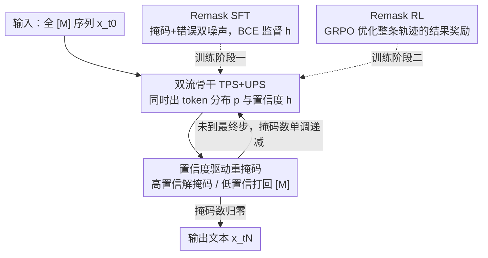

# Don't Settle Too Early: Self-Reflective Remasking for Diffusion Language Models

**会议**: ICLR2026  
**OpenReview**: [https://openreview.net/forum?id=BsZeTuB5fD](https://openreview.net/forum?id=BsZeTuB5fD)  
**代码**: https://github.com/maple-research-lab/RemeDi  
**领域**: 扩散语言模型 / 文本生成 / LLM  
**关键词**: 扩散语言模型, 重掩码, 自反思, 置信度预测, SFT+RL

## 一句话总结
针对掩码扩散语言模型「token 一旦解出就钉死、错了也改不了」的硬伤，本文提出 RemeDi：让模型在生成每一步同时预测 token 分布和逐 token 置信度，按置信度决定哪些位置解掩码、哪些已生成 token 要被打回掩码重采样，并配上「Remask SFT + Remask RL」两阶段训练，在开源扩散语言模型里拿到 SOTA（GSM8K 89.1%、HumanEval 73.2%）。

## 研究背景与动机
**领域现状**：扩散语言模型（Diffusion Language Models, DLM）正成为自回归（AR）模型之外有吸引力的文本生成范式。主流变体是掩码扩散模型（mask-based DLM，如 LLaDA、Dream）：前向过程把干净文本逐步替换成特殊的掩码 token `[M]`，反向过程从全掩码序列出发，分 $N$ 步逐渐把掩码 token 解出来。相比 AR，它不锁定从左到右的固定顺序，能并行预测多个 token，生成顺序更灵活。

**现有痛点**：掩码 DLM 有一个致命假设——**一旦某个位置被解掩码（unmask），它就被当成正确答案钉死，后续步骤不再改动**。但在生成早期，可见上下文很少，模型很容易解出错误 token；等后面上下文变丰富、错误本可被发现时，现有范式却没有任何机制把它改回来。错误就这样一路传播到最终输出。论文标题「别太早下定论」正是冲着这个问题。

**核心矛盾**：要修正错误，就得允许「已解出的 token 被打回掩码再重采样」，可这又和扩散模型的一条基本要求冲突——噪声水平（即掩码 token 的数量）必须随步数**单调递减**，最后一步归零才能完成生成。如果随便把已生成 token 打回掩码，掩码总数可能不降反增，破坏扩散过程的收敛性。已有补救要么是推理时随机重掩码一批 token（不知道哪些真错，纯靠多采样步数硬碰，低效），要么是改动扩散过程引入均匀噪声/编辑操作（但不保证掩码数单调递减）。**没有一个方法能有原则地「识别哪些 token 错了」并选择性纠正。**

**本文目标**：给掩码 DLM 加上一种「自反思式重掩码」能力——既能找出可能错的 token、把它打回掩码重采样，又能保证掩码数单调递减不破坏扩散收敛。

**切入角度**：作者的关键观察是——「该不该解掩码」本质是一个可学习的**逐 token 置信度**问题。如果模型能为每个位置输出一个置信分数，高置信的就解出、低置信的（不管之前是否已解出）就保持/打回掩码，那么重掩码就从「随机扰动」变成了「有依据的自我纠错」。

**核心 idea**：让模型在每个扩散步**同时预测 token 分布和逐 token 置信度**，用置信度统一驱动「解掩码 / 重掩码」决策；再用「Remask SFT 教模型识别并重掩码错误 token + Remask RL 在完整生成轨迹上做结果奖励优化」把这个能力训出来。

## 方法详解

### 整体框架
RemeDi 在标准 Transformer 上扩展出**双流结构**：一条 Token Prediction Stream（TPS）像普通 DLM 一样预测掩码位置的 token 分布 $p^i_\theta(\cdot|x_t)$，另一条 Unmasking Policy Stream（UPS）输出每个位置的置信分数 $h^i_\theta$。生成时从全掩码序列出发、迭代 $N$ 步去噪：每一步先由 UPS 给所有位置打置信分，挑出一个子集 $\mathcal{U}_n$ 解掩码——已经解出的 token 若被选中就保持不变，未解出的就从 TPS 的分布里采样；而**置信度低的 token，哪怕之前已经解出，也会被打回掩码**，留到上下文更丰富的后续步骤重采样。一个噪声调度让「已解掩码 token 总数」随步数从 0 线性增长到序列长度 $L$，保证掩码数最终归零。这个「识别错误 → 打回掩码 → 重采样」的能力靠两阶段训练习得：先 Remask SFT 教模型在带噪输入上识别并重掩码错误 token，再 Remask RL 用结果奖励优化整条生成轨迹。

### 关键设计

**1. 双流 Transformer：把「预测 token」和「预测置信度」解耦成两条并行流**

要支持自反思，模型必须在预测 token 的同时回答「这个位置我有多大把握」。RemeDi 没有粗暴地在单流上加个分类头，而是扩成双流：TPS 是一摞 Transformer block，照常预测掩码位置的概率 $p^i_\theta(\cdot|x_t)$；UPS 是另一摞 block，输出逐 token 置信分 $h^i_\theta$，表示「这个 token 该被高置信地解掩码，还是该保持/打回掩码以便（重）采样」。两条流并行跑，UPS 周期性插入、接收 TPS 的隐状态作输入，并做**双向特征共享**：UPS 的层以 TPS 特征 $f_\text{TPS}$ 为条件，其输出又反哺回 TPS 丰富其表示；最终层用两个独立线性头分别从 $f_\text{TPS}$、$f_\text{UPS}$ 同时产出 $p$ 和 $h$。UPS 的接入用 **zero init**，保证训练初期不破坏已有 DLM 骨干（RemeDi 从 LLaDA-8B-Instruct 适配而来）。把置信度建模成一条专门的流而非附属头，是因为「该不该解掩码」是一个需要全局上下文的策略判断，值得独立的表征容量。

**2. 置信度驱动的重掩码：用统一的置信分同时决定「解谁」和「打回谁」**

这是 RemeDi 区别于所有现有掩码 DLM 的核心机制。给定上一步序列 $x_{t_{n-1}}$，UPS 先为每个位置 $i$ 预测置信分 $h^i_{\theta,n}$，按置信度从高到低选出当前步要解掩码的子集 $\mathcal{U}_n$；被选中的位置，若已解出就保持原值，否则从 $p^i_\theta(\cdot|x_{t_{n-1}})$ 采样。与现有方法「token 解出即钉死」不同，RemeDi **每一步都重新判定每个 token 是解掩码还是（重）掩码**——于是一个已生成的 token 完全可能因为置信分变低而被打回掩码，留到后面重采样。为了不破坏扩散收敛，噪声调度让解出 token 的总数从 0 线性增到 $L$，等价于掩码数随步数单调递减、最终归零。正是这一点把「重掩码」从随机扰动升级为「有依据的自我纠错」：例如论文里模型先生成动词 "making"，等宾语 "tests and estimators" 出来后发现动宾搭配不当，就把 "making" 打回掩码、改成更合适的 "developing"。

**3. Remask SFT：把「错误 token」当成第二类噪声来教模型识别和重掩码**

普通掩码 DLM 的 SFT 只用随机掩码的输入训练，模型从没见过「错误的已解出 token」，自然学不会识别它们。RemeDi 在 SFT 里引入**第二类噪声**：除了用掩码比例 $\rho_{t,\text{mask}}$ 随机掩掉一部分 token，还在剩余未掩码位置里按比例 $\rho_{t,\text{incorrect}}$ 随机替换成别的 token，模拟反向扩散中可能冒出的错误 token。为保证掩码数单调递减（因为所有错误 token 都要被重掩码），两个比例必须满足
$$\lceil \rho_{t,\text{incorrect}}\cdot(1-\rho_{t,\text{mask}})\cdot L\rceil < \lceil \rho_{t,\text{mask}}\cdot L\rceil$$
否则把错误 token 全打回掩码会让下一步掩码数反增。作者取 $\rho_{t,\text{mask}}=t$、$\rho_{t,\text{incorrect}}=4r\cdot t(1-t)$（$r=0.1$），在 $t\in[0,1]$ 上恒满足该不等式。训练时除了常规扩散损失 $L_\text{diffusion}$（只在掩码位置算），还用 BCE 监督 UPS 的置信分：干净 token（$x^i_t=x^i_0$）给正标签 $y^i=1$（该保持解掩码）；错误 token（$x^i_t\neq x^i_0$ 且 $\neq[M]$）给负标签 $y^i=0$（该重掩码）；掩码 token 给**软标签** $y^i=p^i_\theta(x^i_0|x_t)$（预测越准越该解出，且用 stopgrad）。UPS 损失为
$$L_\text{UPS}(\theta)=\sum_i \text{BCE}\big(\sigma(h^i_\theta),\, y^i\big)$$
总目标 $L(\theta)=L_\text{diffusion}(\theta)+\lambda_\text{UPS}L_\text{UPS}(\theta)$。这样模型既学会补全掩码，又学会判断「哪些已解出的 token 其实是错的、该打回去」。

**4. Remask RL：在完整生成轨迹上用结果奖励把重掩码策略调到更优**

SFT 只在单步的带噪输入上监督，没有优化「整条生成轨迹最终对不对」。Remask RL 进一步用**结果导向的强化学习**微调：从全掩码先验 $x_{t_0}$ 出发走完 $N$ 步，每步由两个耦合策略组成——解掩码策略用 Plackett–Luce 模型按置信分**无放回地**依次抽出 $K_n$ 个位置 $\mathcal{U}_n$：
$$\pi^\text{unmask}_{\theta,n}(\mathcal{U}_n\mid x_{t_{n-1}})=\prod_{k=1}^{K_n}\frac{\exp(h^{u_n(k)}_{\theta,n})}{\sum_{j\notin\{u_n(1),\dots,u_n(k-1)\}}\exp(h^{j}_{\theta,n})}$$
token 预测策略在被选中且原为掩码的位置上从 $p^i_\theta$ 采样；二者相乘得到联合转移概率 $\pi_{\theta,n}(x_{t_n}\mid x_{t_{n-1}})$。在此之上用 **GRPO** 做轨迹级优化，奖励按任务类型给：数学/代码用可验证正确性，开放问答用奖励模型打分。和「只 reinforce token 预测」的方法不同，RemeDi 把**解掩码（含重掩码）策略本身也纳入优化**，让模型学会在每一步如何取舍解谁、打回谁，从而把整条轨迹推向更高奖励的最终答案。

### 损失函数 / 训练策略
- **Remask SFT 总损失**：$L=L_\text{diffusion}+\lambda_\text{UPS}L_\text{UPS}$，前者是只在掩码位置计算的交叉熵补全损失，后者是对置信分 $h_\theta$ 的逐位置 BCE（标签按 clean/incorrect/mask 三类分别为 1 / 0 / 软概率）。
- **噪声调度**：$\rho_{t,\text{mask}}=t$、$\rho_{t,\text{incorrect}}=4r\cdot t(1-t)$，$r=0.1$，确保掩码数单调递减。
- **Remask RL**：GRPO + Plackett–Luce 采样的联合策略，结果奖励（数学/代码可验证、开放问答用奖励模型）。
- **骨干与生成**：从 LLaDA 权重初始化，适配为可变长度的 block-wise 逐块生成；UPS 接入用 zero init。

## 实验关键数据

### 主实验
RemeDi 从 LLaDA 适配，经 Remask SFT 再 Remask RL 两阶段，在数学/代码/通用基准上对比其它开源 DLM 及同规模 AR 模型。

| 数据集 | 指标 | RemeDi(+SFT) | RemeDi(++RL) | 此前最强 DLM | 说明 |
|--------|------|------|------|----------|------|
| GSM8K | acc | 86.3 | **89.1** | 88.1 (LLaDOU) | 数学推理 |
| MATH | acc | 51.4 | **52.9** | 44.6 (LLaDOU) | 数学 |
| HumanEval | pass | 71.3 | **73.2** | 59.8 (Dream) | 代码 |
| MBPP | pass | 57.8 | **59.4** | 59.6 (Dream) | 代码 |
| ARC-C | acc | 85.2 | **87.7** | 83.9 (LLaDA) | 常识问答 |
| IFEval | acc | 81.9 | **85.4** | 73.5 (LLaDA1.5) | 指令遵循 |
| AlpacaEval | win | 12.5 | **24.8** | 13.9 (LLaDA1.5) | 人类偏好 |

RemeDi 在几乎所有基准上拿下开源 DLM 的 SOTA，且超过同规模 AR 模型（如 GSM8K 上与做了数学专门 RL 的 DeepseekMath 持平）。RL 阶段在 AlpacaEval 上提升最猛，比 SFT 模型 +12.3%。

### 消融实验

| 配置 | GSM8K | MATH-500 | HumanEval | MBPP | 说明 |
|------|------|---------|-----------|------|------|
| Baseline（可变长块生成） | 80.3 | 34.7 | 41.5 | 42.6 | 起点 |
| Vanilla SFT | 83.1 | 40.1 | 48.2 | 43.4 | 普通 SFT |
| Remask SFT | 83.6 | 42.7 | 50.0 | 44.0 | 本文 SFT |

Remask SFT 在所有基准上优于普通 SFT，MATH-500 +2.6%、HumanEval +1.8%。RL 阶段单独对比 LLaDOU RL（同样 reinforce 整条轨迹）：在 GSM8K 上 Remask RL 收敛更快、终值更高（200 步 83.33% vs 82.35%，50 步 80.00% vs 77.58%）。

### 关键发现
- **重掩码频率随任务结构约束上升**：代码 > 数学 > 通用任务（HumanEval 每块 28.5 次、MATH-500 11.8 次、AlpacaEval 2.8 次），因为代码要严格语法、数学要规范推导，开放问答容错更高。
- **越难的题重掩码越多**：MATH-500 上从难度 1–2 的每块约 9 个 token 升到难度 4–5 的近 14 个，说明迭代纠错对难题更必要。
- **学到的置信分是可靠的质量信号**：已正确解出的 token 普遍拿高置信分，被判低置信的 token 更可能不合适、被打回重测。

## 亮点与洞察
- **把「该不该改」建模成可学习的逐 token 置信度**：这是全文最巧的一步——重掩码不再靠随机或人为 schedule，而是由模型自己学出的置信分驱动，既能定位错误又天然兼容「掩码数单调递减」的扩散约束。
- **「错误 token 作为第二类噪声」的训练构造很可迁移**：在 SFT 里主动注入随机替换的错误 token、并用三类标签（clean/incorrect/mask 软标签）监督置信头，是教任何「带自纠错的迭代生成模型」识别错误的通用配方。
- **解掩码策略本身纳入 RL 优化**：用 Plackett–Luce 把「选哪些位置解掩码」写成可微的无放回采样策略，再和 token 预测策略组成联合策略丢进 GRPO，让强化学习同时优化「改哪、补什么」，而不只是优化 token 预测。
- **DLM 终于能像人一样「写完回头改」**：示例里把 "making" 改成 "developing"、把 "left" 改成 "used"，展示了替换/插入/删除等编辑能力，这是 AR 模型天生做不到的（一旦吐出就过去了）。

## 局限与展望
- **依赖人为设计的噪声调度**：$\rho_{t,\text{incorrect}}=4r\cdot t(1-t)$ 和约束不等式是手工设定的，$r$ 等超参对训练稳定性的影响、是否最优，论文未充分探讨。
- **可变长块生成是适配出来的**：因为没有开源的大规模可变长 block-wise DLM，作者从 LLaDA 适配而来，骨干本身的限制（如块大小、去噪步数预算）可能影响上限。
- **GPQA 上 RL 反而掉点**（32.6→29.5）：结果导向 RL 在某些知识密集任务上未必有益，奖励设计与任务类型的匹配仍需打磨。
- **重掩码带来额外步数开销**：纠错本质是用更多去噪步换质量，论文主打质量 SOTA，但对推理效率/步数预算的系统分析较少，实际部署时质量-速度权衡值得补充。

## 相关工作与启发
- **vs 推理时随机重掩码（ReMDM / predictor-corrector）**：它们在推理时随机打回一批 token，不知道哪些真错，得靠大量额外采样步硬碰，低效且难优化；RemeDi 训练出置信度来**定向**识别错误 token，纠错更精准高效。
- **vs 改扩散过程的纠错方法（混入均匀噪声 / 编辑式扩散，如 Seed Diffusion）**：这类方法允许 token 被改，但**不保证掩码数单调递减**，破坏扩散收敛的基本特性；RemeDi 用噪声调度 + 约束不等式显式保证单调递减。
- **vs LLaDOU RL**：同样在反向扩散的完整轨迹上做 RL，但 LLaDOU 不带可学习重掩码；RemeDi 的联合策略把解掩码/重掩码也纳入优化，收敛更快、终值更高。
- **vs 自回归 LLM（LLaMA3 / Deepseek 等）**：AR 模型 token 一旦生成不可回改，RemeDi 借扩散的非自回归特性 + 重掩码实现「生成中自我修订」，在同规模下数学/代码上反超多数 AR 模型。

## 评分
- 新颖性: ⭐⭐⭐⭐⭐ 把「该不该解掩码」建模成可学习置信度、统一驱动重掩码，并兼容扩散单调递减约束，是掩码 DLM 自纠错的原创解法。
- 实验充分度: ⭐⭐⭐⭐ 九个基准全面对比 DLM 与 AR，含 SFT/RL 分阶段消融与重掩码频率分析；但效率/步数权衡分析偏弱、GPQA 掉点未深究。
- 写作质量: ⭐⭐⭐⭐⭐ 动机层层递进，双流结构、两阶段训练、损失与噪声调度交代清晰，配图与可视化到位。
- 价值: ⭐⭐⭐⭐⭐ 开源 DLM 新 SOTA，且给「带自纠错的迭代文本生成」提供了一套可复用的训练范式。

<!-- RELATED:START -->

## 相关论文

- [\[ICML 2026\] Reasoning on the Manifold: Bidirectional Consistency for Self-Verification in Diffusion Language Models](../../ICML2026/llm_nlp/reasoning_on_the_manifold_bidirectional_consistency_for_self-verification_in_dif.md)
- [\[AAAI 2026\] IROTE: Human-like Traits Elicitation of Large Language Model via In-Context Self-Reflective Optimization](../../AAAI2026/llm_nlp/irote_human-like_traits_elicitation_of_large_language_model_via_in-context_self-.md)
- [\[ICLR 2026\] Constrained Decoding of Diffusion LLMs with Context-Free Grammars](constrained_decoding_of_diffusion_llms_with_context-free_grammars.md)
- [\[ICLR 2026\] Toward Safer Diffusion Language Models: Discovery and Mitigation of Priming Vulnerabilities](toward_safer_diffusion_language_models_discovery_and_mitigation_of_priming_vulne.md)
- [\[ACL 2026\] Unlocking the Potential of Diffusion Language Models through Template Infilling](../../ACL2026/llm_nlp/unlocking_the_potential_of_diffusion_language_models_through_template_infilling.md)

<!-- RELATED:END -->
