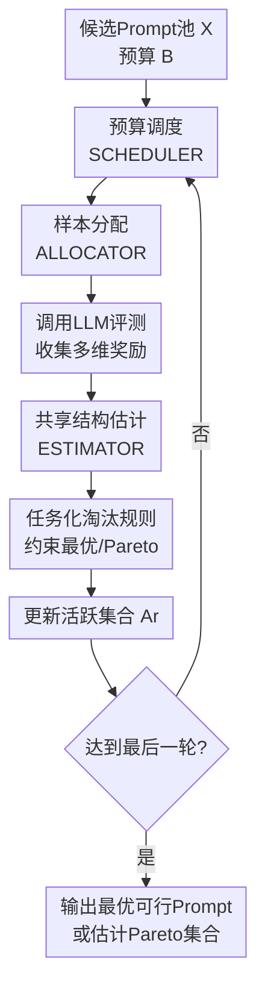

# Efficient Multi-objective Prompt Optimization via Pure-exploration Bandits

**会议**: ICLR2026  
**OpenReview**: [https://openreview.net/forum?id=M0n3gtwHNg](https://openreview.net/forum?id=M0n3gtwHNg)  
**代码**: 无（论文未开源）  
**领域**: LLM NLP / Prompt Optimization  
**关键词**: 多目标提示优化, 纯探索Bandit, 约束最优提示, Pareto前沿, 固定预算  

## 一句话总结
这篇论文把“提示词选择”从单指标优化扩展到多目标固定预算优化，基于纯探索 bandit 提出 GENSEC 与 GENPSI 两类算法，在摘要任务中显著优于均匀采样基线，并给出线性结构下的误差上界。  

## 研究背景与动机
**领域现状**：当前 Prompt Engineering 已从手工试 prompt 逐步走向自动搜索，但大多数方法仍把“好 prompt”定义为单一指标最优，例如只看准确率或 ROUGE。这个设定在研究论文里常见，在真实应用里却往往不成立。  

**现有痛点**：很多 NLP 任务天然是多目标的。以摘要为例，模型输出既要信息覆盖好（如 ROUGE），又要满足长度、简洁性、可读性、事实性等要求。单指标最优通常会牺牲其他维度，导致上线效果不稳定。  

**核心矛盾**：在有限评测预算下，开发者无法把所有候选 prompt 在所有维度上“测透”。如果仍用均匀采样，就会把大量预算浪费在明显次优或不可行的 prompt 上，最终既找不到最优可行解，也难恢复高质量 Pareto 前沿。  

**本文目标**：作者把问题拆成两个基础目标：第一，在约束条件下找到“主目标最高”的可行 prompt（best feasible prompt identification）；第二，在无硬约束时尽量恢复真实 Pareto 集（Pareto prompt set identification）。  

**切入角度**：作者将多目标提示选择映射为 pure-exploration bandits。每个 prompt 视作一只 arm，每次评测是一次 pull，返回多维随机 reward（例如 ROUGE 与 Brevity）。这样就能直接复用多目标 bandit 的理论工具与高效采样策略。  

**核心 idea**：用“分轮淘汰 + 结构化估计”的 bandit 框架替代静态均匀评测，在固定预算下优先探索最有希望的 prompt，并以可证明的方式降低误选概率。  

## 方法详解
作者统一提出一个“固定预算、分轮淘汰”的框架，并在两个任务上实例化为 GENSEC（约束最优）与 GENPSI（Pareto 集恢复）。论文重点不是生成新 prompt，而是从已有候选池中更高效地选 prompt。  

### 整体框架
输入是候选 prompt 集合 $\mathcal{X}$、预算 $B$、多目标评测函数 $f_1,\dots,f_m$（实验中主要是 ROUGE 与 Brevity），以及可选的 prompt 特征映射 $\phi(x)$。输出要么是最优可行 prompt $x^\*$，要么是估计的 Pareto 集 $\hat{\mathcal{X}}^\*$。  

算法以轮次 $r=1,\dots,R$ 运行。每轮先由调度器给预算，再由分配器决定拉哪些 arm，然后根据新观测更新 reward 估计，最后按任务目标做淘汰。被淘汰的 prompt 不再消耗预算，直到最后剩余解或剩余集合输出。  

### 关键设计
**1. GENSEC 排序淘汰：先可行、后最优，解决“可行性与主目标冲突”**

在 best feasible 任务里，作者把目标写成：最大化主目标 $\mu_1(x)$，同时满足约束 $\mu_j(x)\ge \tau_j$（实验可理解为 Brevity 不低于阈值）。每轮先构造经验可行集 $\hat{\mathcal{F}}_r=\{x: \hat\mu_{2,r}(x)>\tau\}$，再做分层排序：可行集内部按主目标降序；不可行集内部按约束指标降序。  

这一步很关键，因为它明确区分了“短期主目标高但违规”的 deceiver 臂和真正可行臂。淘汰时保留前 $l_r$ 个，等价于在有限预算下优先保护可能的最优可行臂，避免被偶然高分的不可行臂挤掉。  

**2. 通用四组件框架：Scheduler / Allocator / Estimator / Eliminator 可插拔**

论文没有把方法锁死为单一算法，而是给出一个可组合框架。调度器可用 Successive Rejection 或 Sequential Halving；分配器可均匀采样，也可用 G-optimal design；估计器可样本均值，也可用最小二乘或 MLP。  

这种设计让同一方法族兼容“无结构”与“有共享结构”两种场景。无结构时更稳、更简单；有结构时可借助跨 prompt 的参数共享提高样本效率。实验里的 CSR、MLP-CSR、EGE、MLP-EGE 都是该框架下的实例。  

**3. 结构化建模与理论保证：用共享参数换取更快收敛**

作者考虑一般形式 $\mu(x)=g_\theta(\phi(x))$，并重点分析线性情形 $\mu(x)=\phi(x)^\top\theta$。这样一次拉臂不仅更新当前 prompt 的估计，还会通过共享参数 $\theta$ 改善其他 prompt 的估计。  

在线性设定下，论文给出误选概率随预算指数衰减的结果，形式上可写成
$$
\Pr[x^\*\notin A_R]\le C\,\lceil\log_2 K\rceil\exp\!\left(-c\cdot\frac{B/\lceil\log_2 K\rceil}{dH}\right),
$$
其中 $K$ 是候选规模，$d$ 是特征维度，$H$ 由约束 gap 决定问题难度。直观上，预算越大、区分度越高，误选越快下降。  

### 一个完整示例
假设有 100 个摘要 prompt 候选，目标是在“Brevity 不低于阈值”的前提下最大化 ROUGE。总预算等价于每个臂平均 8 次评测。  

第一轮，系统对全部 prompt 做粗评，估计出经验可行集与不可行集。比如某 prompt 的 ROUGE 很高，但 Brevity 反复低于阈值，它会被放入不可行侧。  

第二到第四轮，活跃臂规模逐轮缩小，预算更集中地投给边界附近的候选：一类是主目标很强但可行性不稳；另一类是可行性稳定但主目标略弱。通过多轮更新，它们的置信区间逐步收敛。  

最终轮输出 1 个候选。论文实验显示，这种分配方式相较均匀采样更容易找到接近最优可行解，尤其在预算紧时优势更明显。  

### 损失函数 / 训练策略
这项工作本质是“纯探索选择”而非生成式训练，因此没有传统意义上的任务损失函数。优化对象是“固定预算下的识别错误概率”与“Pareto 恢复质量”。  

实现上，评测流程是：从数据集中采样输入，调用冻结 LLM（Llama-3-8B-instruct 或 Gemma-7B-it）生成摘要，再计算多目标 reward。结构化版本用 prompt embedding（GPT-3.5-turbo 提取后再 PCA）作为 $\phi(x)$，并在估计器中学习共享映射。  

## 实验关键数据

### 主实验
论文在 XSum 与 CNN/DailyMail 上评估，候选池规模设为 30/50/100，关注两类任务：约束最优识别与 Pareto 集恢复。下表汇总论文中的代表性结论（按文中描述整理）。  

| 任务 | 数据集/模型 | 基线 | 本文方法 | 关键结果 |
|------|-------------|------|----------|----------|
| 最优可行 Prompt 识别 | XSum + Gemma-7B（K=100） | Uniform | CSR / MLP-CSR | 当预算足够时，本文方法可恢复 >90% 最优可行效用；Uniform 仅约 20%-50% |
| 最优可行 Prompt 识别 | CNN/DM + Llama3-8B（K=100） | Uniform | CSR / MLP-CSR | 本文方法在各预算段基本都显著更高，且低预算下优势更明显 |
| Pareto 集恢复 | 多数据集多模型（K=100） | Uniform | EGE / MLP-EGE | 在 b=8/10 时，本文方法可恢复约 90% 真 Pareto 超体积，基线多在 80%中低段 |

从论文图 2 与图 3 的整体趋势看，bandit 淘汰策略在“预算受限 + 候选较多”时收益最大，因为它把预算从劣质臂转移到边界臂。  

### 消融实验
论文虽然没有以“模块剔除”命名消融，但通过不同实例化（Uniform/CSR/MLP-CSR、Uniform/EGE/MLP-EGE）给出了等效分析。  

| 配置 | 关键指标 | 说明 |
|------|----------|------|
| Uniform pulling | Soft constrained reward / HV | 不做自适应分配，作为最弱基线 |
| CSR / EGE | 同上 | 无共享结构，仅靠淘汰机制提升样本效率 |
| MLP-CSR / MLP-EGE | 同上 | 引入共享结构估计，部分场景进一步提升低预算表现 |

一个具体数字例子（来自文中表格）：在 XSum-Gemma 设置下，K=100、b=10 时，MLP-CSR 软约束奖励约为 0.147±0.001，而 Uniform 约为 0.044±0.015，差距非常明显。  

### 关键发现
- 多目标提示优化里，“评测预算如何分配”比“是否有更复杂生成器”更先决定上限；本文证明仅替换选择策略就能带来大幅收益。  
- 共享结构并非始终碾压无结构方法，但在低预算或候选较大时经常更有优势，说明跨 prompt 泛化确实能省样本。  
- 对 Pareto 任务，超体积 HV 作为统一指标很有效，能同时反映解集质量与多样性，而不必人为设定单一加权标量。  

## 亮点与洞察
- 把多目标 prompt 选择正式建模为 pure-exploration bandits，是这篇工作最核心的贡献。它把过去偏经验主义的 prompt 试错流程，转成了有理论边界的统计决策问题。  
- GENSEC 的排序淘汰规则非常实用：先判断可行性再比较主目标，直接贴合真实业务的“先过红线，再追求效果”逻辑。这个思路可迁移到安全、延迟、成本约束下的 LLM 推理策略选择。  
- 同一框架可同时覆盖 best feasible 与 Pareto 两类任务，降低了工程系统复杂度。实际部署时可先跑 Pareto 找候选，再按业务阈值切到 best feasible 做最终上线选择。  
- 线性情形的误差上界给了“预算-效果”定量关系，这对评测成本管理很有价值。团队可以据此反推需要多少评测预算才能把误选风险压到可接受水平。  

## 局限性 / 可改进方向
- 论文主要在摘要任务与两类开源模型上验证，任务域仍偏窄。对于代码生成、对话安全、长上下文代理任务，指标噪声和目标冲突可能更复杂，结论需要再验证。  
- 候选 prompt 仍来自预先生成并人工筛选的离散池，方法解决的是“选谁评估/保留”，不是“如何生成更强新 prompt”。若候选池本身质量偏低，算法上限会被卡住。  
- 约束设定目前以固定阈值为主，现实系统常见的是动态阈值或分层 SLA（如成本、延迟、风险联动）。后续可扩展到上下文相关约束或风险感知约束。  
- 结构化版本依赖 prompt embedding 质量。若特征映射与真实性能相关性弱，参数共享可能引入偏差。可以考虑更稳健的非线性不确定性估计或自适应特征更新。  

## 相关工作与启发
- **vs 单目标 Prompt 选择（TRIPLE / INSTINCT 等）**：单目标方法通常把所有收益压成一个分数，优化过程简单，但在多约束业务里容易选出“纸面最优、实际不可用”的 prompt。本文通过显式可行域与 Pareto 目标，避免了这种错配。  
- **vs 多目标 Prompt 生成（EMO-Prompts / GEPA 等）**：这类工作偏向“如何造 prompt”，但评估常采用相对粗糙的采样策略。本文反过来聚焦“如何高效选 prompt”，两者可互补：先生成，再用 bandit 选择。  
- **vs 多目标 bandit 理论工作（EGE/GEGE 等）**：本文的价值在于把这些理论工具落到 LLM prompt 优化语境，并补上 best feasible 识别与结构化实现细节，降低了理论到应用的落地门槛。  
- **实践启发**：在企业场景中，可把“准确率-成本-安全-风格一致性”统一写成多目标 bandit，先恢复 Pareto 前沿，再按业务策略选运行点，比拍脑袋调权重更可控。  

## 评分
- 新颖性: ⭐⭐⭐⭐☆（4.5/5） 将多目标 prompt 选择系统映射到纯探索 bandit，并同时覆盖约束最优与 Pareto 识别，问题定义与方法统一性都很强。  
- 实验充分度: ⭐⭐⭐⭐☆（4.3/5） 跨数据集、跨模型、跨候选规模给了较完整对比，但任务类型仍集中在摘要，外部泛化还需补充。  
- 写作质量: ⭐⭐⭐⭐☆（4.2/5） 公式定义与算法流程清晰，理论与实验衔接顺畅；若再补充更多真实业务案例会更有说服力。  
- 价值: ⭐⭐⭐⭐⭐（4.7/5） 对“固定预算下多约束 prompt 上线”非常实用，既有理论保证又有明显实验收益，工程可迁移性高。

<!-- RELATED:START -->

## 相关论文

- [\[ACL 2025\] SEE: Strategic Exploration and Exploitation for Cohesive In-Context Prompt Optimization](../../ACL2025/llm_nlp/see_strategic_exploration_exploitation_prompt_optimization.md)
- [\[ICLR 2026\] LLEMA: Evolutionary Search with LLMs for Multi-Objective Materials Discovery](llema_evolutionary_search_with_llms_for_multi-objective_material_design.md)
- [\[ACL 2025\] RiOT: Efficient Prompt Refinement with Residual Optimization Tree](../../ACL2025/llm_nlp/riot_efficient_prompt_refinement_with_residual_optimization_tree.md)
- [\[ACL 2025\] Gradient-Adaptive Policy Optimization: Towards Multi-Objective Alignment of Large Language Models](../../ACL2025/llm_nlp/gapo_multi_objective_alignment.md)
- [\[ICLR 2026\] SIPDO: Closed-Loop Prompt Optimization via Synthetic Data Feedback](sipdo_closed-loop_prompt_optimization_via_synthetic_data_feedback.md)

<!-- RELATED:END -->
