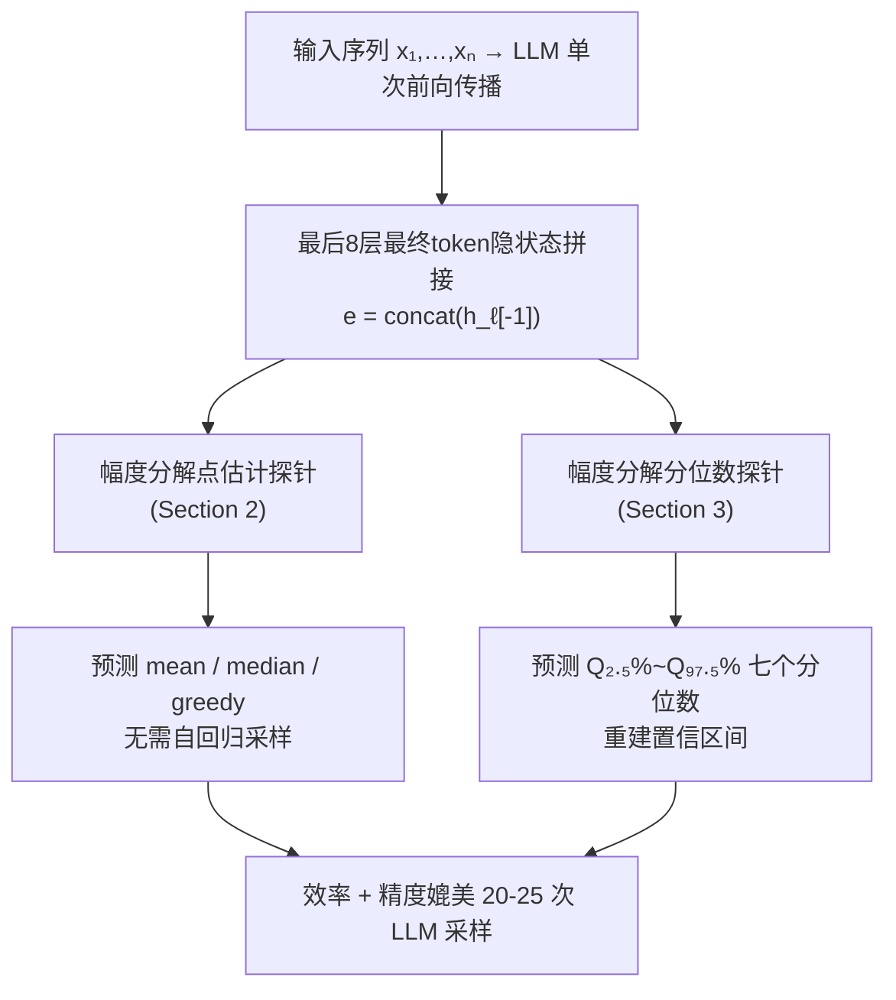

# Eliciting Numerical Predictive Distributions of LLMs Without Auto-Regression

**会议**: ICLR 2026  
**代码**: https://github.com/kasia-kobalczyk/guess_llm  
**领域**: LLM 数值预测 / 内部表示探测  
**关键词**: LLM 探测、不确定性量化、数值预测、自回归替代、时间序列预测

## 一句话总结

通过在 LLM 最后几层隐状态上训练轻量级"幅度分解探针"，无需自回归采样即可直接恢复 LLM 数值预测分布的均值、中位数及分位数，推理效率相当于 20-25 次采样的效果，且置信区间校准良好。

## 研究背景与动机

**领域现状**：LLM 已在表格回归、时间序列预测等结构化数据任务中展现出强大的 in-context learning 能力，甚至在少样本场景下与专业模型媲美。要获得 LLM 的预测分布（以便量化不确定性或提升精度），通常需要对同一输入重复执行自回归采样，每次生成一个完整数字。

**现有痛点**：自回归解码对连续数值输出天然不友好——一个实数往往跨多个 token，加之需要反复采样才能估计分布，导致推理时延和计算成本极高。例如仅估计均值就需要数十次前向传播。

**核心矛盾**：LLM 内部是否已经在隐状态中"提前决定好"了它要生成的数字，还是说数值的量级（小数点位置、数字终止符）只有在逐 token 解码时才被确定？如果能在 token 生成之前就从隐状态读出分布信息，则自回归采样将变得不必要。

**本文目标**：探究能否仅凭 LLM 对输入的一次前向传播所产生的内部表示，来重建其数值预测分布的统计量（点估计与不确定性），从而绕过昂贵的自回归采样。

**切入角度**：以时间序列一步预测为具体任务，设计可在 LLM 隐状态上训练的轻量探针（probe），直接预测分布的均值/中位数/分位数。

**核心 idea**：LLM 的数值"推理"主要发生在输入编码阶段，隐状态已充分编码了将要生成的数字及其不确定性，自回归解码只是在"读取"这一结果而非计算它。

## 方法详解

### 整体框架

本文提出一套两阶段探测框架：首先从 LLM（Llama-2-7B）最后 8 层的最终 token 隐状态拼接得到嵌入 $\mathbf{e}$，然后训练两类探针——点估计探针（预测均值/中位数/greedy 输出）和分位数探针（预测多个分位值，用于重建预测分布）。两类探针共享"幅度分解"的核心架构设计。

### 关键设计

**1. 幅度分解探针（Magnitude-Factorised Probe）：解决跨量级回归的梯度失稳问题**

直接对原始数值做回归时，MSE 损失会被大量级的数值主导，小量级预测梯度几乎消失。为此，作者将预测拆成两个串联子任务：**量级分类** $f_{\text{order}}: \mathbb{R}^{d_{\text{input}}} \to \mathbb{R}^M$ 先预测目标值 $y$ 的量级 $m(y) = \lfloor\log_{10}|y|\rfloor$ 所属类别，输出 softmax 概率向量 $\mathbf{p}(x)$；**条件值回归** $f_{\text{val}}: \mathbb{R}^{d_{\text{input}}+1} \to \mathbb{R}^M$ 对每个量级类 $m_k$ 分别预测缩放后的残差 $r_k$，最终预测值为 $\hat{y}_k = r_k \cdot 10^{m_k}$。推理时用 top-K 加权期望 $\mathbb{E}_K[\hat{y}] = \sum_{k \in \text{top-K}} p_k \hat{y}_k$ 得到最终结果。训练采用两阶段冻结策略：先冻结回归头只训分类头（交叉熵损失），再冻结分类头只训回归头（MSE 损失）——实验表明两阶段优于联合训练。这一设计让模型能在跨越 8 个量级的数据集上均保持 90%+ 量级预测精度，Pearson R 达 0.98。

**2. 分位数探针（Quantile Regression Probe）：从隐状态直接恢复分布不确定性**

在点估计之后，作者进一步问：LLM 隐状态是否也编码了其预测分布的"宽度"？分位数探针沿用幅度分解结构，为 $S=7$ 个目标分位数（0.025, 0.05, 0.25, 0.5, 0.75, 0.95, 0.975）各配一对分类/回归头。训练目标是 pinball loss，以 LLM 的 100 个真实样本 $\{y^j\}$ 作为监督信号：

$$\mathcal{L} = \sum_{s=1}^{S} \left( \mathcal{L}^s_{\text{order}} + \beta \cdot \mathcal{L}^s_{\text{val}} \right)$$

其中 $\mathcal{L}^s_{\text{val}}$ 对每个 LLM 样本计算 pinball loss。实验表明该探针能忠实恢复分布散度：预测 IQR 与采样 IQR 的 Spearman 相关高达 0.90；在四个不同量级的数据集上，50%/90%/95% 置信区间的实际覆盖率分别约为 50%/91%/95%，与名义水平高度一致。

**3. 泛化能力验证：跨长度、跨分布、合成→真实的三级迁移**

一个实用探针必须能在训练时未见过的设置上工作。作者从三个维度系统评估泛化：(a) **上下文长度泛化**——在受限长度范围 [10,20] 训练的模型在范围之外的置信区间覆盖率仅轻微下降，而在全范围 [3,40] 训练的模型表现更鲁棒；(b) **真实数据泛化**——在 Darts + Monash 的 31 个子集（约 45,000 序列）上，"见过所有域的子集"模型（Real-all）实现 48.8%/88.5%/94.3% 的覆盖率，略低于理论值但仍实用；(c) **合成→真实迁移**——仅在合成数据训练的模型（Synth）在真实数据上表现下滑明显，主因是量级分布的剧烈变化（真实数据量级跨度达 $10^{-3}$ 到 $10^{13}$），说明量级分布匹配是泛化的关键瓶颈。

## 实验关键数据

### 主实验

| 目标 | 探针 MSE | LLM 直接采样 MSE | 均值基线 | 最后值基线 |
|------|----------|-----------------|---------|-----------|
| mean (预测 $x_{n+1}$) | **0.0562** | 0.0555 | 0.3454 | 0.1226 |
| median | **0.0561** | 0.0553 | 0.3454 | 0.1226 |
| greedy | **0.0652** | 0.0668 | 0.3454 | 0.1226 |

探针性能与 LLM 直接采样几乎持平，且优于单纯用均值或最后值做预测。

### 点估计精度（scale=1.0 数据集）

| 目标 | 探针 MSE | 数据集均值基线 | 序列均值基线 | 最后值基线 |
|------|---------|-------------|------------|-----------|
| mean | **0.006** | 0.256 | 0.035 | 0.085 |
| median | **0.006** | 0.260 | 0.041 | 0.087 |
| greedy | **0.015** | 0.273 | 0.065 | 0.109 |

### 置信区间校准（分位数探针）

| 数据集量级 | 50% CI 覆盖率 | 90% CI 覆盖率 | 95% CI 覆盖率 |
|-----------|-------------|-------------|-------------|
| 1.0 | 52.0 ± 0.4 | 90.9 ± 0.3 | 95.5 ± 0.2 |
| 10.0 | 52.7 ± 0.5 | 91.3 ± 0.3 | 96.1 ± 0.2 |
| 1000.0 | 51.4 ± 0.3 | 90.7 ± 0.3 | 95.7 ± 0.2 |
| 10000.0 | 48.2 ± 0.3 | 90.5 ± 0.2 | 95.4 ± 0.2 |

### 关键发现
- 量级分类准确率跨所有量级均超过 90%，Pearson R 在均值/中位数目标上达 0.98
- 探针的效率等价于 20-25 次 LLM 采样，对于 N<25 样本的场景探针误差更低
- greedy 目标比 mean/median 更难预测（MSE 高约 2.5×），因为 greedy 是解码过程的副产品而非分布的显式统计量
- 真实数据上校准略有下降（Real-5fold 的 90% CI 覆盖率约 82%），合成→真实跨越更大（67%）

## 亮点与洞察
- **隐状态先于 token 编码完整数字**：这一发现挑战了"LLM 的数值能力依赖逐 token 解码"的直觉，表明数值推理主要在 Transformer 的前向传播过程中完成，解码只是在"读取"结论
- **幅度分解设计的通用性**：把回归问题分成量级分类+条件值回归的思路，可用于任何需要处理跨越多个量级输出的神经网络回归场景
- **单次前向传播替代多次采样**：探针只需对输入做一次 LLM 前向传播提取隐状态，相比多次完整采样节省计算量极为显著，为 LLM 在资源受限场景下的部署提供新路径
- **uncertainty without sampling**：首次系统展示了 LLM 的预测不确定性（分布宽度）也被编码在隐状态中，开辟了无采样不确定性量化的新方向

## 局限与展望
- 需要访问 LLM 内部激活（不适用于 API-only 部署场景）
- 探针是模型特异性的，换一个 LLM 架构或分词方案需要重新训练
- 训练探针本身仍需大量 LLM 采样来获取监督标签（约 100 次采样/序列），初始成本不低
- 合成→真实的泛化性有限，量级分布偏移是主要瓶颈
- 目前只验证了一步预测，多步预测、多变量场景有待探索

## 相关工作与启发
- **vs LLM 时间序列预测（Gruver et al., 2024）**：LLaMA-TS 等方法仍依赖自回归采样获取分布，本文探针可作为其推理加速的直接替代
- **vs Tuned Lens / 线性探针**：传统探针聚焦于分类任务，本文是将探针方法扩展到连续数值回归的首批系统性工作之一，且引入幅度分解解决量级跨越问题
- **vs 置信校准研究**：多数校准方法在模型输出层操作，本文从中间层隐状态直接校准，提供了更早期的不确定性信号
- **对 LLM 数值能力理解的启发**：结果暗示 LLM 在处理连续数值时有类似"内部计划"的机制，与近期关于 LLM 输出规划（Lindsey et al., 2025）的研究方向高度呼应

## 评分
- 新颖性: ⭐⭐⭐⭐ 探针方法用于 LLM 数值分布恢复是新颖问题设定，幅度分解架构是实用创新
- 实验充分度: ⭐⭐⭐⭐ 多量级、合成+真实、多模型（附录中有其他 LLM）验证全面，泛化分析系统
- 写作质量: ⭐⭐⭐⭐ 问题逐层递进（点估计→不确定性→效率→泛化），结构清晰
- 价值: ⭐⭐⭐⭐ 为 LLM 高效不确定性量化提供了轻量化新路径，对 AI 安全与可靠部署有实际意义

<!-- RELATED:START -->

## 相关论文

- [\[ICLR 2026\] Statistical Advantage of Softmax Attention: Insights from Single-Location Regression](statistical_advantage_of_softmax_attention_insights_from_single-location_regress.md)
- [\[ACL 2025\] How Numerical Precision Affects Arithmetical Reasoning Capabilities of LLMs](../../ACL2025/llm_nlp/how_numerical_precision_affects_arithmetical_reasoning_capabilities_of_llms.md)
- [\[ACL 2025\] Token Prepending: A Training-Free Approach for Eliciting Better Sentence Embeddings from LLMs](../../ACL2025/llm_nlp/token_prepending_training_free.md)
- [\[AAAI 2026\] Collaborative LLM Numerical Reasoning with Local Data Protection](../../AAAI2026/llm_nlp/collaborative_llm_numerical_reasoning_with_local_data_protection.md)
- [\[ICML 2026\] Stop Automating Peer Review Without Rigorous Evaluation](../../ICML2026/llm_nlp/stop_automating_peer_review_without_rigorous_evaluation.md)

<!-- RELATED:END -->
