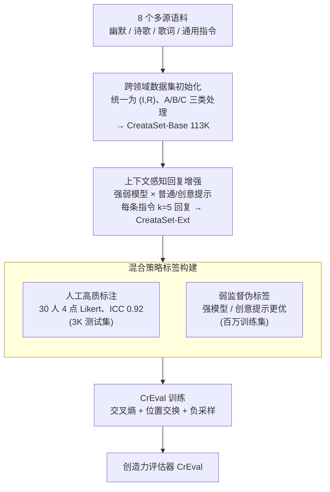

# Evaluating Text Creativity across Diverse Domains: A Dataset and Large Language Model Evaluator

**会议**: ICLR 2026  
**arXiv**: [2505.19236](https://arxiv.org/abs/2505.19236)  
**代码**: [项目页面](https://creval-creative-evaluation.github.io)  
**领域**: LLM/NLP  
**关键词**: creativity evaluation, LLM-as-a-judge, pairwise comparison, text creativity, dataset construction, CrEval, cross-domain evaluation

## 一句话总结

提出基于上下文感知的成对比较框架来评估文本创造力，构建了包含 100K+ 人类级别和 1M+ 合成数据的 CreataSet 数据集，训练出 CrEval 评估器，在与人类判断的对齐度上超越 GPT-4o 达 18.7%。

## 研究背景与动机

- **创造力评估是 LLM 评估的前沿挑战**：随着 LLM 在创意写作、文学、幽默等领域展现出创造力，如何准确评估其创意输出变得日益重要
- **现有方法三大局限**：
  1. **跨领域适用性差**：多数方法仅评估单一领域（如问题解决、幽默、比喻），创造力与其他概念纠缠，难以泛化
  2. **粒度不足**：多数方法在模型/被试层面评估，无法区分同一提示下两条回复哪个更有创意（text-level creativity）
  3. **自动化不可靠**：直接 prompt LLM 评估创造力时，判断不可靠、不一致且成本高
- **标注一致性问题**：缺少上下文指引时，人类标注者对创造力的理解不一致（ICC 仅 0.59）；提供共享指令后 ICC 提升至 0.75
- **创意数据稀缺**：训练可靠评估器需要大规模数据，但带有创造力标签的数据极为稀缺

## 方法详解

### 整体框架

本文把"评估文本创造力"重新定义为一个上下文感知的成对比较任务：给定指令 $I$ 和两条回复 $R_1, R_2$，判断哪条更有创意。围绕这个目标，作者用三步流水线搭起 CreataSet 数据集——从多源语料初始化跨领域指令-回复对（CreataSet-Base），再为同一指令增广出创意水平参差的多条回复（CreataSet-Ext），最后用"人工高质标注 + 弱监督伪标签"两套策略给比较关系打标签，并据此训练出评估器 CrEval。

### 关键设计

**1. 跨领域数据集初始化：解决创意语料只覆盖单一领域的问题**

创造力评估长期受限于数据，现有创意语料大多只盯着幽默或诗歌一个领域，训练出的评估器一换领域就失灵。作者从 8 个数据源收集语料并统一成 $(I, R)$ 指令-回复格式，按来源性质分三类处理：A 类是天然带创意属性的数据集（如 Oogiri-GO 幽默、Ruozhiba），可直接用；B 类是只有创意文本、缺少对应指令的独立语料（诗歌、歌词、散文），作者反转指令微调一个模型，从回复反推出缺失的指令；C 类是通用指令微调数据集（Infinity-Instruct），用来补足领域多样性。整合后的 CreataSet-Base 含 113K+ 创意样本，横跨 17 个核心领域、87 个子领域，覆盖面远超以往单领域数据集。数据以简体中文为主，因为创造力本身带有文化语境依赖，但整套构造流程不绑定语言、可迁移到其他语种。

**2. 上下文感知回复增强：为同一指令制造可比较的创意梯度**

成对比较需要"同题不同质"的回复对，但原始语料每条指令往往只有一个回复，无从比较。作者为每条指令生成 $k=5$ 条创意水平不同的回复 $(I, R_1, \ldots, R_k)$，梯度来自两个正交维度：一是用能力悬殊的模型（强模型 Qwen2.5-14B-Instruct 对弱模型 MiniCPM-2B-SFT），二是给每个模型套两种提示——普通提示 $\text{Prompt}_o$ 与创意导向提示 $\text{Prompt}_c$。对偏通用的 C 类数据，再额外用 GPT-4o 补一条更具创意的回复，拉开上限。这样同一指令下就自然形成了由强弱模型与提示风格交织出的创意层级，为后续打标签提供了天然的偏好信号。

**3. 混合策略标签构建：用人工标注保精度、弱监督保规模**

可靠评估器既要高质量标签又要海量数据，二者难以兼得，作者按测试集和训练集分而治之。测试集只取 3K 样本但下重金标注：30 名标注者在 4 点 Likert 量表上打分，达到 ICC(2k)=0.92 的高一致性，再按分差转成成对关系——分差 $>0.3$ 视为可区分、$<0.1$ 视为平局。训练集则放弃人工、改用弱监督伪标签，依赖两条经验假设：更强的模型通常产出更有创意的回复（实测 86.6% 准确率），创意导向提示通常优于普通提示（81.4% 准确率）。两条假设直接把设计 2 里的模型强弱和提示差异翻译成偏好标签，几乎零成本地把训练数据规模撑到百万级。

**4. CrEval 训练：把成对判断变成可学习的分类任务**

CrEval 接收三元组 $(I, R_1, R_2)$，输出哪条回复更有创意（或平局），损失就是这个分类的交叉熵：

$$\mathcal{L} = -\sum_{(I,R_1,R_2) \in \mathcal{D}} \log P(y \mid I, R_1, R_2)$$

分类标签以文本形式输出，沿用 LLM-as-a-judge 的成对比较范式。训练中加了两个针对性技巧：一是缓解位置偏差，把每个样本的 $R_1, R_2$ 顺序交换、标签同步翻转后一并喂入，避免模型只凭"谁排在前面"作判断；二是负采样，随机挑一条回复当作"最不创意"的对照，逼模型真正读懂指令上下文 $I$、而非脱离题目空泛地评好坏。

## 实验关键数据

### 主实验

**CrEval 与基线对比（CreataSet 测试集）**

| 方法 | F1 | Kappa | Agreement |
|------|-----|-------|-----------|
| PPL（困惑度） | 0.357 | -0.042 | 0.430 |
| DSI（语义散度） | 0.480 | 0.175 | 0.457 |
| Creativity Index | 0.531 | 0.231 | 0.568 |
| GPT-4o | 0.703 | 0.519 | 0.642 |
| Claude-3.5-Sonnet | 0.727 | 0.609 | 0.740 |
| o3 | 0.721 | 0.578 | 0.725 |
| DeepSeek-R1 | 0.653 | 0.457 | 0.547 |
| CrEval-7B | **0.732** | **0.601** | **0.745** |
| CrEval-14B | **0.735** | **0.613** | **0.762** |

CrEval-7B 已超越所有同规模和更大规模的通用 LLM，CrEval-14B 在 Kappa 上比 DeepSeek-V3 高 9.7%，比 GPT-4o 的 Agreement 高 12.6%。

**CrEval 相对基础模型的提升**

| 指标 | CrEval-7B vs Qwen2.5-7B |
|------|---------------------------|
| F1 | +19.2% |
| Kappa | +49.1% |
| Agreement | +29.8% |

### 消融实验

**数据来源消融**

| 数据配置 | F1 | Kappa |
|----------|-----|-------|
| 仅合成数据 | 0.689 | 0.513 |
| 仅人类数据 | 0.701 | 0.548 |
| 合成 + 人类混合 | **0.732** | **0.601** |

结论：人类数据和合成数据的结合对训练强健评估器不可或缺。

**跨领域泛化能力**

传统指标（PPL、DSI）在跨领域时表现极差（Kappa 接近 0）；Gemma 系列在短文本和歌词上优于其他模型，但在幽默领域（Oogiri-GO、Ruozhiba）和古典文体上泛化差。CrEval 在所有创意域上表现均衡稳健。

### 关键发现

1. **传统指标完全失败**：PPL 的 Kappa 接近 0，说明困惑度与人类创造力判断几乎无关
2. **推理模型未必更好**：DeepSeek-R1 的 F1（0.653）显著低于 GPT-4o（0.703），说明推理链对创造力评估帮助有限
3. **CrEval 可反哺 LLM 创造力提升**：将 CrEval 作为偏好信号用于训练，可提升 LLM 自身的创造力输出

## 亮点与洞察

1. **上下文感知的标注协议**：通过提供共享指令作为上下文，将人类标注 ICC 从 0.59 提升至 0.75——简单但有效的方法论创新
2. **弱监督大规模数据构建**：利用模型强弱和提示差异生成伪标签（86.6% 和 81.4% 准确率），巧妙解决创意数据稀缺问题
3. **7B 模型超越前沿 LLM**：CrEval-7B 在创造力评估上超越 GPT-4o、o3 等，证明领域特化训练的价值
4. **跨领域覆盖广**：87 个子领域的数据集远超现有创意数据集的领域覆盖
5. **实用闭环**：CrEval 不仅评估创造力，还可作为偏好信号提升 LLM 创造力

## 局限性

1. **语言局限**：数据集以简体中文为主，跨语言泛化尚未验证
2. **创造力定义主观性**：创造力本身高度主观且文化依赖，87 个领域的分类和评分标准可能存在偏差
3. **弱监督标签噪声**：基于"强模型更有创意"的假设并非总成立（13.4% 错误率），这些噪声会传递到训练中
4. **成对比较的可扩展性**：大规模排序需要 $O(n^2)$ 次成对比较，绝对创造力评分更实用但本文未涉及

## 相关工作与启发

- **与传统创意测试的区别**：RAT 和 TTCT 评估人类发散思维，粒度在被试层面；本文首次系统地在文本层面做跨领域创造力评估
- **与 LLM-as-a-judge 的关系**：继承了 Arena 式成对比较范式，但专门针对创造力这一最难评估的维度
- **与 LitBench 的区别**：LitBench 仅覆盖创意写作领域，本文覆盖 87 个领域且额外处理了标注一致性问题
- **对评估基础设施的启示**：创造力评估器可与安全、有用性评估器并行使用，构建更全面的 LLM 评估体系

## 评分

- **新颖性**: ⭐⭐⭐⭐ 首个跨领域文本级创造力评估框架，上下文感知标注协议巧妙
- **实验充分度**: ⭐⭐⭐⭐⭐ 对比了 25+ 基线（含前沿 LLM），消融实验覆盖数据来源、领域泛化、模型规模
- **实用价值**: ⭐⭐⭐⭐ 数据集和评估器均可开源使用，对 LLM 创造力提升有直接应用价值
- **写作质量**: ⭐⭐⭐⭐ 结构清晰，图表丰富，方法动机解释充分
- **总评**: ⭐⭐⭐⭐ 扎实的系统性工作，填补了跨领域文本创造力自动评估的空白

<!-- RELATED:START -->

## 相关论文

- [\[ACL 2025\] AgentGym: Evolving Large Language Model-based Agents across Diverse Environments](../../ACL2025/llm_nlp/agentgym_evaluating_and_training_large_language_model-based_agents_across_divers.md)
- [\[ICLR 2026\] WebDevJudge: Evaluating (M)LLMs as Critiques for Web Development Quality](webdevjudge_mllm_web_development.md)
- [\[ICLR 2026\] TEXT2ARCH: A Dataset for Generating Scientific Architecture Diagrams from Natural Language Descriptions](text2arch_a_dataset_for_generating_scientific_architecture_diagrams_from_natural.md)
- [\[ICLR 2026\] First is Not Really Better Than Last: Evaluating Layer Choice and Aggregation Strategies in Language Model Data Influence Estimation](first_is_not_really_better_than_last_evaluating_layer_choice_and_aggregation_str.md)
- [\[ICLR 2026\] SPRIG: Improving Large Language Model Performance by System Prompt Optimization](sprig_improving_large_language_model_performance_by_system_prompt_optimization.md)

<!-- RELATED:END -->
