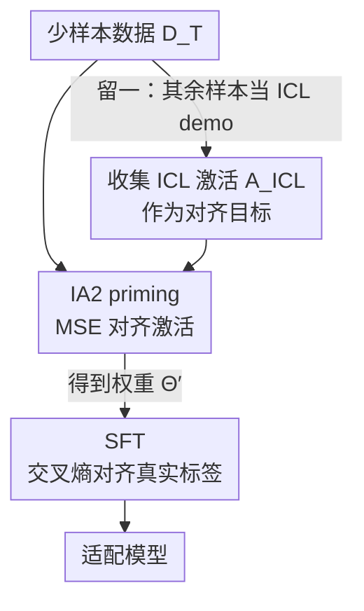

# IA2: Alignment with ICL Activations improves Supervised Fine-Tuning

**会议**: ICLR 2026  
**OpenReview**: [https://openreview.net/forum?id=r99m9ziONQ](https://openreview.net/forum?id=r99m9ziONQ)  
**代码**: 有（论文附代码，含答案解析函数）  
**领域**: LLM / NLP · 微调与适配  
**关键词**: 监督微调, 上下文学习, 激活对齐, 自蒸馏, 校准

## 一句话总结
本文发现监督微调（SFT）和上下文学习（ICL）虽然输出相似，但内部激活完全不同；据此提出 IA2——一个在 SFT 之前先用 MSE 把模型激活拉向「ICL 在场」时激活的自蒸馏 priming 步骤，在 12 个基准上同时显著提升了少样本适配的准确率和校准度。

## 研究背景与动机
**领域现状**：把通用大模型适配到窄任务有两条主流路线。一是 SFT（常配 LoRA 等 PEFT），用标注样本更新权重让模型直接产出目标响应；二是 ICL，把若干 demo 拼进 prompt，推理时不改权重就「学会」任务。SFT 适配后推理便宜（小 LoRA 即插即用），但少样本时需要大量标注才能泛化；ICL 在少样本下泛化好、响应更校准，但每次查询都要占掉宝贵的上下文，推理成本高。

**现有痛点**：人们普遍希望「用 SFT 把 ICL 的能力固化进权重」，已有工作（如把上下文蒸馏进权重）确实在做，但它们只用响应文本作为训练信号——也就是只让 SFT 模型去复现 ICL 模型的输出。本文指出这远远不够：让一个模型产出和 ICL 一样的输出，并不能保证它像 ICL 那样「运作」。

**核心矛盾**：有理论工作（Von Oswald 等）声称 ICL 等价于一次内部梯度下降，若成立则 base+ICL 的激活应当和 SFT 后无 demo 的激活相似。但本文实测发现：在同样数据下，ICL 和 SFT 的逐层激活并不对齐——尤其是中间层（被认为在抽象处理整个 demo 集的地方）差异最大。两者表面输出相近，内部却走着不同的功能回路。这种功能差异还外显为校准误差：ICL 在相近准确率下 ECE（期望校准误差）远低于 SFT，因为 SFT 的输出导向信号容易学到在新数据上失效的捷径，而 ICL 依赖复杂回路、被迫从 demo 里抽取可泛化的模式。

**本文目标**：能不能把「信息丰富的 ICL 激活」直接用作训练信号，来提升 SFT 的质量（准确率 + 校准），而不只是模仿它的输出？

**核心 idea**：在标准 SFT 之前插入一个 priming 步骤，用 MSE 显式地把「只给 query」时的激活对齐到「ICL 在场」时的激活，让 SFT 模型在功能层面（而非输出层面）变得像 ICL，然后再做常规 SFT 对齐输出。

## 方法详解

### 整体框架
IA2 把适配拆成「先对齐功能、再对齐输出」的两阶段流水线，用的是和 SFT 完全相同的少样本数据，所以是一次公平的「同数据」对比。给定一个少样本任务数据集 $D_T=\{(X_i,Y_i)\}$：先对每个样本用其余样本作为 ICL demo（留一复用，不引入额外数据），跑一遍 ICL 拿到「ICL 在场」时输出位置的激活张量 $A^i_{ICL}$，作为对齐目标；然后做 IA2 priming——把「只给 query」时的激活用 MSE 拉向 $A^i_{ICL}$，得到一组「内部已经像 ICL」的权重 $\Theta'$；最后在 $\Theta'$ 上接标准交叉熵 SFT，把输出对齐到真实标签 $Y$。

这里的关键量是激活相似度 $\mathrm{asim}(A_1,A_2)$——两个激活张量逐 token 的余弦相似度（尺寸 $L\times R$）。诊断实验显示纯 SFT 与 ICL 的 $\mathrm{asim}$ 很低（Qwen-4B 仅 0.52），而 IA2→SFT 把它拉到 0.67–0.83，准确率与校准也随之变好。

### 关键设计

**1. 收集 ICL 激活作为对齐目标：用留一复用把 demo「灌」进激活**

priming 要有「ICL 的样子」可对齐，就得先把它量化下来。本文对每个训练样本 $X_i$，用数据集里剩下的 $N-1$ 个样本（随机排序）拼成 demo 集 $I$，跑 $T_i=[I\circ X_i]$ 让模型产出 ICL 响应 $\hat Y_i$，并在输出 token 位置收集激活 $A^i_{ICL}\in\mathbb{R}^{L\times G\times d}$（$G$ 为响应长度，多 token 任务固定 $G=200$）。这一步的巧妙之处是**复用同一批训练数据**——既不引入任何额外标注，又保证 IA2、SFT、ICL 三者用的是完全相同的数据，让后续对比公平。之所以选「输出 token 位置」的激活，是因为激活是模型产出下一个 token 之前内部处理的「足迹」，在这里它最能反映 ICL 对 query 做了怎样的功能性加工。

**2. IA2：在激活空间做自蒸馏，把「只给 query」拉向「ICL 在场」**

这是本文的核心。它直接针对前面的痛点——只对齐输出不够，要对齐功能。目标写成：对每个新生成 token，寻找一组权重 $\tilde W_{QKVO}$ 使得
$$\mathrm{SA}([I\circ X];W_{QKVO})\approx \mathrm{SA}(X;\tilde W_{QKVO}),\quad \forall X\in T.$$
即让「无 demo、只给 query」的自注意力输出，逼近「有 demo」时的自注意力输出。已有工作只在线性化注意力上给出闭式解，本文则在真实非线性 Transformer 上找一个实用的通用解：构造未对齐激活 $A_i$（喂 $T_i=[X_i\circ\hat Y_i]$，假装模型只看 query 就产出了 ICL 响应），再最小化它与目标激活的均方误差
$$L_{IA2}=\sum_{i=1}^{N}\lVert A_i-A^i_{ICL}\rVert.$$
注意这里**完全不碰目标响应 token**——它不奖励模型产出某个输出，而是逼模型在每一层都「像 ICL 那样处理输入」。正因为它是模型对自己 ICL 行为的蒸馏（teacher 和 student 是同一个模型、只是 teacher 多了上下文），所以叫「自蒸馏」。实验里 IA2-only（不做 SFT）就能达到不错的准确率且校准良好，恰恰说明激活信号本身就富含可适配信息。

**3. IA2→SFT：先对齐功能、再对齐输出的两阶段顺序**

光有 IA2 还差一口气：激活对齐让校准变好，但「ICL 信号不总是对的」，过度追求激活相似会把一些本可由真实标签换来的准确率留在桌上（图 3 显示 asim 升高时 ECE 平滑下降，但极端对齐并非准确率最优）。所以本文在 IA2 把参数从 $\Theta$ 推到 $\Theta'$ 之后，**切换**到标准 SFT 损失 $L_{SFT}$（公式 2 的交叉熵），在真实标签上继续训到收敛。两个信号各司其职：IA2 负责内部功能对齐 ICL，SFT 负责输出对齐人为期望。为什么是「顺序」而非「联合」？因为 IA2 的目标激活来自模型自己生成的 ICL 响应，其长度/内容可能和数据集真值响应差很多，两个目标放一起训不兼容；权重子空间分析（图 4）进一步表明，IA2→SFT 与 IA2-only 平均共享约 39% 的权重子空间，而纯 SFT 的更新几乎与两者正交——意味着 IA2 找到的子空间是纯 SFT 训练根本到不了的，性能增益主要来自 IA2 这一步。

### 损失函数 / 训练策略
两阶段：先用 $L_{IA2}$（激活 MSE）训到收敛，再用 $L_{SFT}$（真值响应交叉熵）训到收敛。训练用 rank=8 的 LoRA 改 $W_Q,W_K,W_O$；少样本规模 $N\in\{2,4,8,16,\dots\}$，每个 $N$ 取 5 组随机集求平均；每个 (方法, 数据集) 跑三种学习率（1e-4 / 3e-4 / 1e-3）取最优，以抵消调参对结论的影响。全实验共训练超过 13,000 个模型。讨论里还给出联合变体 IA2+SFT（统一损失 $L_{IA2}+\beta\cdot L_{SFT}$）用于「只能用 ICL 响应、没有真值」的场景。

## 实验关键数据

### 主实验
覆盖单 token（分类 / True-False / MCQ）与多 token（数学 / 科学 QA）两类、12 个基准、Qwen3-4B-Base 与 Llama-3.2 两个模型族。指标为准确率 acc↑ 与期望校准误差 ECE↓。

单 token（Qwen3-4B，$N=4$，节选）：

| 数据集(训练→评测) | 指标 | ICL | SFT only | IA2 only | IA2→SFT |
|---|---|---|---|---|---|
| FinS→FinS | acc↑ | 63.6 | 67.4 | 63.1 | **78.7** |
| FinS→FinS | ece↓ | 0.12 | 0.31 | 0.24 | **0.16** |
| SST2→SST2 | acc↑ | 85.4 | 65.2 | 82.7 | **90.4** |
| SST2→SST2 | ece↓ | 0.13 | 0.22 | 0.28 | **0.06** |
| SST2→FinS*（OOD） | acc↑ | 41.9 | 68.4 | 71.3 | **82.4** |

多 token（Qwen3-4B，$N=4$，真值响应）：

| 数据集 | ICL | SFT only | IA2 only | IA2→SFT |
|---|---|---|---|---|
| GSM8K | 76.4 | 70.9 | 77.4 | **73.6** |
| GSM8Ks*（OOD） | 68.4 | 64.5 | 66.2 | **68.8** |
| HMathA | 60.4 | 50.4 | 47.8 | **55.3** |
| SciQ | 37.5 | 35.0 | 6.9 | **40.8** |

IA2→SFT 在全部多 token 数据集上都优于纯 SFT；单 token 上多数情况下连 ICL 的准确率也能超过（仅校准略逊）。

### 消融与对比实验
| 配置 | 关键结论 | 说明 |
|---|---|---|
| SFT only | 基线 | 输出导向，少样本下易学捷径、校准差 |
| IA2 only | acc 高且校准好 | 不碰真值 token，仅靠激活信号就有竞争力，证明信号之富 |
| IA2→SFT | 最优组合 | 功能对齐 + 输出对齐，acc 与 ece 双赢 |
| IA2+SFT（联合，仅 ICL 响应） | 远超纯 SFT | GSM8K 77.0 vs SFT 66.4，无真值时也能榨出 ICL 响应里的信息 |
| SFT（软标签 KD） | 多 token 强、单 token 弱 | 知识蒸馏 baseline；IA2 系训练单/多 token 都稳 |

### 关键发现
- **激活相似度 → 校准**：图 3 显示 asim 越高 ECE 越平滑下降，证实「内部像 ICL」直接带来更好校准；但 asim 极端高并非准确率最优，所以需要 SFT 这一步补上准确率。
- **IA2 的子空间纯 SFT 到不了**：纯 SFT 的权重更新几乎与 IA2 正交，而 IA2→SFT 与 IA2-only 平均共享 ~39% 子空间——增益主要源自 IA2 priming。
- **何时 ICL 仍赢**：Qwen 在数学（GSM8K/HMathA）上 ICL 超过所有训练方法，作者归因于 Qwen 中段训练吃过 STEM 数据使 ICL 极度样本高效（甚至 $N=2$ 的 ICL 强过 $N=4,8$）；多 token 上 IA2→SFT 偶尔逊于 ICL，疑因小 LoRA 难压缩长上下文，加大 rank 应能改善。

## 亮点与洞察
- **把「对齐」从输出空间搬到激活空间**：这是最「啊哈」的一点——同数据下 ICL 与 SFT 输出像但激活不像，说明它们是不同的功能回路；直接对齐激活（而非输出）才真正搬走了 ICL 的能力。
- **留一复用零额外数据**：用训练集自身的其余样本当 demo 来制造对齐目标，既保证「同数据公平对比」，又把方法的额外成本压到只多一个 priming 阶段。
- **可迁移的思路**：「先在中间表示上对齐一个更强但更贵的行为，再用任务损失收尾」可推广到任何「便宜模式 vs 昂贵但更鲁棒模式」并存的场景（如把工具调用 / 检索增强的内部状态蒸馏进无检索模型）。

## 局限与展望
- 作者承认多 token、长上下文场景下小 LoRA（rank=8）压缩能力有限，IA2→SFT 偶尔不及 ICL，需更大 rank 验证。
- 当底座对某任务「天生」极强（Qwen+STEM）时，ICL 本身已非常样本高效，IA2 的相对收益被压缩——方法收益依赖 base 模型与任务的匹配度。
- 自己发现的局限：均方误差对齐所有输出 token 的激活，对生成长度差异大的多 token 任务可能不稳定（这也是 IA2+SFT 不能直接联合训的根因）；实验集中在分类 / 数学 / QA，开放式长文本生成上的校准与质量尚未充分检验。

## 相关工作与启发
- **vs 上下文蒸馏（Snell 2022 / Chen 2024b）**：它们把上下文蒸馏进权重，但训练信号只来自响应文本，仍会继承 SFT 的捷径问题；IA2 改用激活做信号，对齐的是功能而非输出。
- **vs 知识蒸馏软标签（Hinton 2015）**：软标签 KD 在多 token 上接近 IA2+SFT，但单 token 上明显落后；IA2 系在单/多 token 上都稳定，说明激活信号比 token 概率分布更一致地携带可适配信息。
- **vs 「ICL = 内部梯度下降」理论（Von Oswald 2023 等）**：本文用激活实测反驳了该等价假说在真实 LLM 上的强形式——若等价成立，ICL 与 SFT 激活应当对齐，但中间层恰恰不对齐。

## 评分
- 新颖性: ⭐⭐⭐⭐⭐ 把适配的对齐对象从输出空间移到激活空间，并给出可在非线性 Transformer 上落地的自蒸馏方案。
- 实验充分度: ⭐⭐⭐⭐⭐ 12 基准、两个模型族、13,000+ 模型、含 OOD / 子空间 / KD / 联合训练等多角度分析。
- 写作质量: ⭐⭐⭐⭐ 动机—诊断—方法—验证链条清晰，但部分表格与图依赖附录，主文略密。
- 价值: ⭐⭐⭐⭐ 给少样本 SFT 提供了一个即插即用、同数据就能提准确率与校准的 priming 步骤，且对「ICL vs SFT 机制」给出概念洞见。

<!-- RELATED:START -->

## 相关论文

- [\[ICLR 2026\] Differential Fine-Tuning Large Language Models Towards Better Diverse Reasoning Abilities](differential_fine-tuning_large_language_models_towards_better_diverse_reasoning_.md)
- [\[ACL 2025\] HFT: Half Fine-Tuning for Large Language Models](../../ACL2025/llm_nlp/hft_half_fine-tuning_for_large_language_models.md)
- [\[ICML 2026\] In-Context Routing (ICR): 一次训练、处处可用的 attention-level 隐式 ICL](../../ICML2026/llm_nlp/train_once_reuse_everywhere_generalizable_implicit_in-context_learning_by_routin.md)
- [\[ACL 2026\] Synthetic Eggs in Many Baskets: The Impact of Synthetic Data Diversity on LLM Fine-Tuning](../../ACL2026/llm_nlp/synthetic_eggs_in_many_baskets_the_impact_of_synthetic_data_diversity_on_llm_fin.md)
- [\[ACL 2025\] SDD: Self-Degraded Defense against Malicious Fine-tuning](../../ACL2025/llm_nlp/sdd_self-degraded_defense_against_malicious_fine-tuning.md)

<!-- RELATED:END -->
