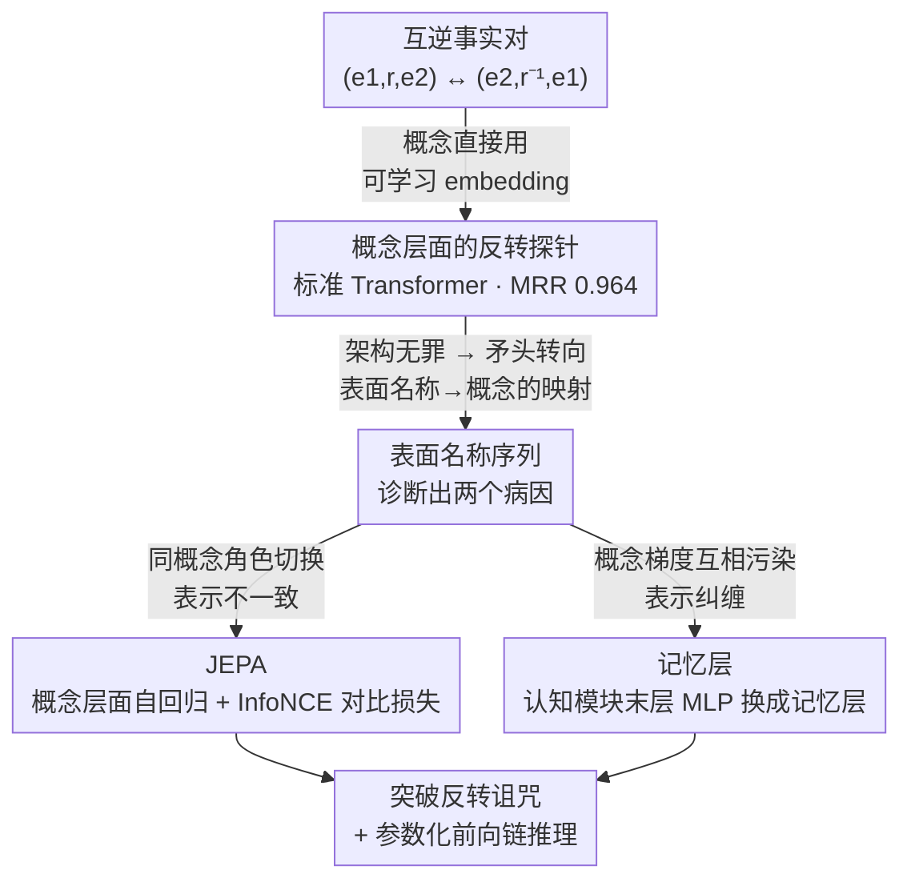

# Is the Reversal Curse a Binding Problem? Uncovering Limitations of Transformers from a Basic Generalization Failure

**会议**: ICLR 2026  
**arXiv**: [2504.01928](https://arxiv.org/abs/2504.01928)  
**代码**: [GitHub](https://github.com/OSU-NLP-Group/reversal-curse-binding)  
**领域**: LLM/NLP  
**关键词**: 反转诅咒, 绑定问题, JEPA, 概念表示, Transformer局限性

## 一句话总结
提出反转诅咒（Reversal Curse）是认知科学中"绑定问题"在Transformer中的表现——源于概念表示的不一致性和纠缠性，并首次设计出基于JEPA和记忆层的架构真正突破反转诅咒（非绕过）。

## 研究背景与动机
LLM存在一个基本的泛化失败——反转诅咒：训练时学到"Tom Smith的妻子是Mary Stone"后，无法回答"Mary Stone的丈夫是___"。这不仅限于自然语言，逆运算在数学、逻辑、科学中普遍存在。

现有解决方案要么是数据增强（翻转/打乱句子片段）要么是非因果训练目标——但这些是"绕过"问题而非真正解决。核心的第一个问题始终未被回答：**传统自回归Transformer是否注定无法学习反转？**

作者给出惊人回答：**不是。** 关键发现是，当输入在抽象概念层面表示时（每个概念一个可学习embedding），标准Transformer完全可以学习反转。问题出在**从表面形式到概念的映射过程**中。这将反转诅咒与认知科学的"绑定问题"联系起来。

## 方法详解

### 整体框架
这篇论文想回答一个被反复绕过却从没被正面回答的问题：自回归 Transformer 是不是注定学不会反转。它的探索分成两步。第一步先把"表面形式"这个变量拿掉，让模型直接在抽象概念层面学反转，看架构本身到底行不行；结果发现完全行（**概念层面的反转探针**），于是把矛头从"架构"转向"表面形式→概念"这道映射，并据此诊断出两个具体病因——表示的**不一致性**和概念间的**纠缠性**。第二步对症下药：用 **JEPA**（联合嵌入预测架构）治不一致性，用**记忆层**治纠缠性，最终在不靠数据增强、不改自回归目标的前提下真正学会了反转。

### 关键设计

**1. 概念层面的反转探针：先证明 Transformer 架构本身没问题**

要判断是不是架构的锅，就得把"表面形式"这个干扰项彻底剥掉。作者设了 $N=6$ 对互逆关系 $(r_i, r_i^{-1})$，把实体分成学习集 $\mathcal{E}_A$ 和测试集 $\mathcal{E}_B$，并且让**每个概念直接由一个可学习 embedding 表示、不带任何文本名称**。训练时 GPT-2 在学习集上能看到事实的所有方向，测试集里的实体只见过一个方向、反方向留作考查。结果 MRR 高达 0.964——标准 Transformer 在概念层面完全学得会反转。这一步的意义在于它直接否掉了"Transformer 天生学不会反转"的假说，把问题精确地压缩到了"表面名称如何映射成概念"这一段。

**2. 不一致性假说与 JEPA：让同一个概念在被读和被预测时长一个样**

定位到映射环节后，第一个病因是不一致性：同一个概念在当主语被感知、和当宾语被预测时，模型给它的表示并不一致，于是反方向的事实对不上号。JEPA 的做法是把自回归预测从表面层面搬到概念层面——一个认知模块先把表面名称编码成概念 embedding，之后的自回归预测直接在这个 embedding 空间里进行，训练目标用 batch 内对比学习的 InfoNCE loss。因为预测目标和输入编码共用同一个 embedding 空间，模型被强制对同一概念形成一致表示，这也是首次在没有数据增强、没有非因果目标的情况下做到非平凡的反转泛化。

**3. 纠缠性假说与记忆层：让不同概念的梯度别互相污染**

第二个病因藏在梯度里。作者分析认知模块 MLP 最后一层的更新发现，当两个概念 $a$、$b$ 的隐藏激活 $\alpha$、$\beta$ 有重叠（$\alpha^T\beta \neq 0$）时，对 $a$ 的更新会被 $b$ 的梯度污染：

$$\Delta a = -\eta\|\alpha\|^2 \frac{\partial L}{\partial a} - \eta\, \alpha^T\beta\, \frac{\partial L}{\partial b}$$

第二项就是交叉污染，而且会随模型深度逐层累积。解决办法是把认知模块的最后一个 MLP 层换成记忆层（Memory Layer，超宽 hidden + top-k 稀疏 + softmax 激活），让不同概念走向高度分离的激活模式，从而把纠缠消掉。一个关键对照是：单纯把模型加宽（768→1280）只带来边际改善，而相同参数量下换成记忆层却显著提升泛化——说明瓶颈不在容量，而在表示结构。

### 延伸应用：参数化前向链推理
反转能力打通后顺带解锁了一种参数化的记忆整合能力。比如已知 "X=5"、"Y=3"、"X+Y=Z"，要推出 "Z=8"，本质上需要把 5+3=8 反转成 Z=8 才行。在搜索树结构的多步算术推理任务上，JEPA + 记忆层靠参数化记忆完成推理，超过了 o3-Mini 和 Gemini-2.5-Pro 的非参数化（上下文内）推理。

## 实验关键数据

### 概念层面的反转学习（MRR）

| $|\mathcal{E}_A|$ | 1层 | 6层 | 12层 | 18层 |
|---|---|---|---|---|
| 2.5K | 0.823 | 0.890 | 0.810 | 0.823 |
| 50K | 0.947 | 0.951 | 0.951 | 0.944 |
| 100K | 0.964 | 0.861 | 0.960 | 0.975 |

### JEPA消融（multiplicity=10, $|\mathcal{E}_A|$=50K）

| 配置 (#Rec/#Sem) | 准确率 | 说明 |
|---|---|---|
| 1/1 | ~72% | 最浅即最优 |
| 1/6 | ~52% | 语义层变深→纠缠累积 |
| 6/6 | ~40% | 整体变深→更差 |
| 1/1 + 记忆层 | ~80% | 消除纠缠后最优 |

### 关键发现
- 标准Transformer在表面预测下**100%失败**（0%准确率），但概念层面可达0.975 MRR
- JEPA首次在无数据增强/非因果目标下突破反转诅咒，达到非平凡泛化（~72%）
- 纠缠效应随模型深度显著恶化：multiplicity=20时深层模型性能降至近零（multiplicity 指共享同一首/尾 token 的实体数，越大表面名重叠越多、纠缠越重）
- 记忆层比等参数量的宽模型效果好得多——证明问题不在容量而在结构
- 参数化前向链推理在branching factor 40（6.5K条事实）时仍保持高性能，超越o3-Mini

## 亮点与洞察
- 将LLM的基础泛化失败与认知科学的绑定问题系统关联，逻辑严密且富有启发性
- "概念层面可以→表面形式不行"的对比实验设计精巧，一针见血地定位了问题核心
- 纠缠性的梯度分析简洁有力：$\Delta a = -\eta\|\alpha\|^2 \frac{\partial L}{\partial a} - \eta \alpha^T\beta \frac{\partial L}{\partial b}$，清楚展示了交叉污染
- 参数化前向链推理是一个令人印象深刻的应用，展示了反转能力的深层价值

## 局限与展望
- JEPA需要先验知识来定位概念位置，不是自动化的解决方案
- 记忆层假设每个独特名字对应独特概念，同义词场景下会阻碍学习
- 实验在可控的合成数据上进行，与真实世界LLM预训练的差距需要弥合
- 从"绑定问题"到实际改进LLM的路径仍然很长

## 相关工作与启发
- **vs 数据增强方法** (Golovneva et al.): 数据增强是绕过问题，JEPA+记忆层是首次真正突破
- **vs Zhu et al. 理论分析**: Zhu证明特定条件下Transformer不能学反转，本文发现概念层面可以——条件不同结论不同

## 评分
- 新颖性: ⭐⭐⭐⭐⭐ 将反转诅咒与绑定问题关联是全新且深刻的视角
- 实验充分度: ⭐⭐⭐⭐⭐ 从发现到假说到验证到应用，实验链条完整
- 写作质量: ⭐⭐⭐⭐⭐ 叙事精彩，从惊人发现到深入分析层层推进
- 价值: ⭐⭐⭐⭐⭐ 对理解和改进LLM的基础性研究，影响深远

<!-- RELATED:START -->

## 相关论文

- [\[ICLR 2026\] Trapped by simplicity: When Transformers fail to learn from noisy features](trapped_by_simplicity_when_transformers_fail_to_learn_from_noisy_features.md)
- [\[ACL 2025\] Veracity Bias and Beyond: Uncovering LLMs' Hidden Beliefs in Problem-Solving Reasoning](../../ACL2025/llm_nlp/veracity_bias_llm_hidden_beliefs.md)
- [\[ICLR 2026\] Compositional-ARC: Assessing Systematic Generalization in Abstract Spatial Reasoning](compositional-arc_assessing_systematic_generalization_in_abstract_spatial_reason.md)
- [\[AAAI 2026\] Learning Spatial Decay for Vision Transformers](../../AAAI2026/llm_nlp/learning_spatial_decay_for_vision_transformers.md)
- [\[AAAI 2026\] Vision Transformers are Circulant Attention Learners](../../AAAI2026/llm_nlp/vision_transformers_are_circulant_attention_learners.md)

<!-- RELATED:END -->
