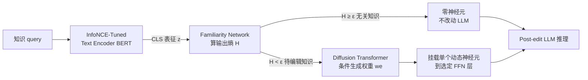

# Massive Editing for Large Language Models Based on Dynamic Weight Generation

**会议**: ICLR 2026  
**OpenReview**: [https://openreview.net/forum?id=GJfWu4BjoI](https://openreview.net/forum?id=GJfWu4BjoI)  
**代码**: [https://github.com/RodeWayne/MeG-for-Knowledge-Editing](https://github.com/RodeWayne/MeG-for-Knowledge-Editing)  
**领域**: 知识编辑 / 大规模模型编辑 / 扩散模型权重生成  
**关键词**: Knowledge Editing, Massive Editing, Dynamic Weight Generation, Diffusion Transformer, Locality  

## 一句话总结
MeG 给 LLM 挂一个"动态权重神经元"，用扩散模型按知识 query 条件生成这个神经元的权重，使大规模知识编辑（1024～10k 条）始终只新增一个神经元——既扩容了知识容量，又把对原模型的干扰锁定为常数，从而在 Locality 指标上大幅碾压现有改权重方法。

## 研究背景与动机
**领域现状**：知识编辑（Knowledge Editing, KE）想以远低于预训练的成本，把过时/错误知识更新进 LLM，理想编辑要同时满足三性——Reliability（新知识能被准确写入）、Generality（同义改写也能正确响应）、Locality（无关知识保持不变）。批量编辑（一次注入上万条新知识）是最实用也最难的场景。

**现有痛点**：现有大规模编辑方法（MEMIT、PMET、MALMEN）全是"内部改权重"路线，编辑量一上规模（尤其超过万条）性能急剧崩塌。作者把崩塌归因于两点——**① 知识容量有上限**：只改 LLM 的部分权重子集，可写入的知识体量存在固有天花板，超过阈值后 Reliability/Generality 同步恶化；**② 干扰累积**：改的权重越多，对原模型功能的破坏越严重，编辑规模越大 Locality 越难守住。而 T-Patcher、SCEN 这类"加神经元/扩专家"的方案虽能绕开容量上限，但每条知识都要静态存一份权重，算力和存储随编辑量线性暴涨，照样扛不住大规模场景。

**核心矛盾**：要扩容就得加结构，加结构又会让开销和干扰随编辑量线性膨胀——容量、干扰、开销三者此消彼长，没法同时压住。

**本文目标**：在批量编辑万条量级下，同时把 Reliability、Generality、Locality 都做高，且新增结构与开销不随编辑量增长。

**核心 idea**：**用"生成"代替"存储"**——不给每条知识静态存一个神经元权重，而是训练一个扩散模型，按当前知识 query 为条件**动态生成**单个神经元的权重，挂载到 LLM 的某一层做推理。这样无论编辑多少条知识，模型始终只多一个神经元：知识容量交给生成模型的分布建模能力承载（与 LLM 大小解耦），而对原模型的干扰是"加一个神经元"这一常数级（scale-invariant interference）。

## 方法详解

### 整体框架
MeG 由四个组件串成一条"编码—路由—生成—挂载"的流水线：知识 query 先过 **InfoNCE 微调的文本编码器** 得到表征，再进 **Familiarity Network** 判别它是待编辑知识还是无关知识；若属于待编辑知识，**基于 DiT 的权重生成模型** 以该表征为条件生成一个动态神经元的权重，**挂载机制** 把这个神经元加进 LLM 选定的 FFN 层完成推理；若属于无关知识，则生成零权重神经元（等价于不改动），从而守住 Locality。训练阶段先离线收集"知识—权重"配对来训扩散模型，推理阶段按 query 实时生成权重。

### 关键设计

**1. 单动态神经元 + 扩散权重生成：把"存知识"变成"生权重"。** 这是 MeG 的地基。作者先对每条待编辑知识 $x_e$，冻结原模型权重 $\theta$、只优化新增神经元权重 $w_e$，使输出 $y=f(x_e;(\theta,w_e))$ 等于目标 $y_e$，由此离线收集 $N$ 对"知识—权重" $(x_e^i, w_e^i)$。接着把权重生成当成"文生图"来做：用 DiT 架构的扩散模型，以知识 query 的文本表征为条件去生成神经元权重——这一类比并非牵强，因为单个神经元权重维度（Phi-2 约 25602 维、GPT-J/Llama-3 约 40962 维）恰好与一张图像同量级，扩散模型在高维细粒度生成上的优势正好用得上。训练用 v-prediction 目标提升稳定性，预测速度量 $v_t=\alpha_t\cdot\epsilon-\beta_t\cdot w$，损失为 $\mathcal{L}_{\text{v-pred}}=\mathbb{E}_{w,c,t}\big[\|v_t-\hat v_\theta(w_t,t,c)\|_2^2\big]$。这样无论编辑 1024 还是 10000 条，LLM 永远只多一个神经元，干扰恒为常数。

**2. InfoNCE 文本编码器：让同义改写"长得像"，撑起 Generality。** Generality 要求模型对同义改写的 query 也答对，关键在于让原句 $x_e$ 与其等价表达 $x_{eq}$ 编码到相近表征，这样它们在路由和权重生成时行为一致。作者把这视作对比表征学习问题：以 BERT 的 CLS 向量为表征，把同一知识的等价表达视作正样本、其它知识的原句视作负样本，用 InfoNCE 损失微调编码器 $\mathcal{L}_{f_{TE}}=-\frac{1}{B}\sum_{i=1}^{B}\log\frac{\exp(\text{sim}(x_{eq}^i,x_e^i)/\tau)}{\sum_{j=1}^{B}\exp(\text{sim}(x_{eq}^i,x_e^j)/\tau)}$。由于拿不到真实等价表达，作者额外造了一批伪编辑知识的"原句—等价句"对来训练，实验证明这套数据策略泛化良好。消融显示：在 COUNTERFACT-GPT-J-1024 上，InfoNCE 微调把 Generality 从冻结 BERT 的 18.46 直接拉到 84.96（AG），MSE 微调只能到 56.54，差距悬殊。

**3. Familiarity Network：用"熵"做新旧知识二分路由，专守 Locality。** 即便只加一个神经元，如果无关 query 也被改动，Locality 照样掉。作者的巧思是利用"神经网络训练是一个熵减过程"：网络对训练时见过（或邻近）的数据，输出分布的熵会显著低于没见过的数据。于是把所有待编辑 query 随机分到 $K=10$ 个类（$K\ll N$），训一个 5 层 FFN 的小分类器 $f_\mu$；推理时对任意 query 算其输出分布的熵 $H=-\sum_{k=1}^{K}P_\mu^k\log P_\mu^k$，与阈值 $\epsilon$ 比较：$H<\epsilon$ 判为待编辑知识、走 DiT 生成权重，$H\ge\epsilon$ 判为无关知识、生成零神经元不改动。消融表明该网络对 Locality 贡献巨大：ZsRE-Phi-2-1024 上把 Locality 提升 +34.86%(AG)/+12.21%(TF)。

**4. FFN 层选择 + 50 步快速采样：工程上的两处关键校准。** 作者发现"在哪一层加神经元"影响极大，因此不照搬 T-Patcher 加在最后一层 FFN，而是对每个 LLM 先探索、再选定特定的编辑层。推理上则把扩散的去噪步数从原始 1000 步压到 50 步（快速采样），在保持权重生成质量基本不变的前提下大幅提升推理效率；反向去噪从 $t=T$ 迭代到 $t=0$ 还原权重 $w_e=\frac{1}{\sqrt{\bar\alpha_t}}\big(w_t-\sqrt{1-\bar\alpha_t}\cdot v\big)$。

## 实验关键数据

### 主实验表格（ZsRE, edit num=10000, Score 为 6 项指标调和平均）

| 模型 | 方法 | Reliability(AG/TF) | Generality(AG/TF) | Locality(AG/TF) | Score↑ |
|------|------|------|------|------|------|
| Phi-2 | MALMEN | 71.79/85.94 | 41.54/68.67 | 18.22/80.78 | 45.64 |
| Phi-2 | **MeG** | 95.07/97.04 | 59.69/74.17 | **91.14/95.84** | **82.80** |
| GPT-J | MALMEN | 96.78/98.54 | 59.35/79.09 | 16.56/81.41 | 48.92 |
| GPT-J | **MeG** | 99.11/99.16 | 61.69/75.68 | **83.99/94.20** | **83.20** |
| Llama-3 | MALMEN | 87.23/94.72 | 57.95/80.92 | 44.65/85.86 | 70.03 |
| Llama-3 | **MeG** | 98.90/99.44 | 61.33/78.95 | **85.02/94.23** | **83.90** |

MeG 在三个模型上 Score 均断层领先；Locality 提升尤为夸张，GPT-J 上比次优高 +63.69%(AG)/+12.79%(TF)。COUNTERFACT 上结论一致（如 Phi-2 Score 69.09 vs MALMEN 5.65）。Scaling 曲线（1024→10k）显示 MeG 退化最慢，编辑越多领先越大。

### 通用能力保持（Phi-2, ZsRE 10k 编辑后）

| 任务 | Before | FT | MEMIT | MALMEN | MeG |
|------|--------|----|-------|--------|-----|
| GSM8K | 42.84 | 32.68 | 19.26 | 48.60 | **61.18** |
| MMLU | 56.98 | 52.68 | 45.19 | 53.97 | **57.00** |
| BBH | 40.58 | 20.12 | 30.31 | 38.45 | **40.67** |

万条编辑后 MeG 在通用 benchmark 上几乎不掉点（甚至略升），印证"单神经元=干扰可控"。

### 消融实验表格

| 消融项 | 设置 | 关键指标变化 |
|--------|------|------|
| Familiarity Network (ZsRE-Phi-2-1024) | w/o FN → Ours | Locality 53.81→88.67(AG), Score 81.32→91.30 |
| 文本编码器 (CF-GPT-J-1024) | Frozen/MSE/InfoNCE | Generality(AG) 18.46/56.54/**84.96** |
| 权重生成器 (Llama-3-ZsRE 10k) | MLP → DiT | Generality(AG) 45.49→61.33；MLP 训练快 90% 但泛化差 |

### 关键发现
- 单神经元的干扰是"非单调"的：不加 Familiarity Network 时，Locality 随编辑量从 1024 到 10k 仅退化 4.89%(AG)/3.06%(TF)，远好于改权重方法的单调崩塌。
- DiT 对 Generality 不可或缺：换成 MLP 后 Reliability/Locality 相当但 Generality 显著下滑，说明高精度权重生成是 Generality 的命门；框架可按需在 MLP（极致效率）与 DiT（高泛化）间取舍。

## 亮点与洞察
- **范式转换**：把"存权重"换成"按 query 条件生成权重"，一举把"结构开销/干扰随编辑量增长"这一大规模 KE 的根本瓶颈降为常数，思路很干净。
- **跨域迁移的类比很到位**：发现单神经元权重维度与一张图同量级，于是直接复用文生图 DiT 那套范式，把 Neural Network Diffusion 的趋势落到 KE 任务上。
- **熵减路由**：用"训练即熵减"的性质做无关知识识别，不需要无关知识参与训练就能守 Locality，是个轻巧又有效的设计。
- **评测更现实**：指出旧 Locality 指标在低准确率数据集上失真，改用"编辑前后对无关知识响应是否一致"，并新增更贴近真实的 AG（前缀自回归生成）设置。

## 局限与展望
- **额外推理开销**：每条待编辑 query 都要跑一次扩散去噪生成权重，即便压到 50 步，仍是相对原始推理的额外成本，超大吞吐场景需进一步加速。
- **离线配对成本**：训扩散模型前要为 N 条知识逐条优化采集"知识—权重"对，这个收集阶段本身随知识量线性增长。
- **伪等价数据依赖**：Generality 依赖人造的伪等价表达来训编码器，真实分布偏移下的泛化边界仍待验证。
- **单编辑层假设**：当前只在选定单层挂一个神经元，更复杂/冲突知识是否需要多层或多神经元仍是开放问题。

## 相关工作与启发
- **改权重路线**（ROME/MEMIT/PMET/MALMEN）：定位—编辑或元学习改 FFN 内部权重，是 MeG 直接对标并超越的大规模 KE 主流。
- **加神经元路线**（T-Patcher/RASE/SCEN）：靠新增神经元或外部权重库存知识，思路相近但静态存储导致开销暴涨——MeG 用"生成"替"存储"正是对它们的关键改进。
- **Neural Network Diffusion**（p-diff/Wang et al. 2024a）：证明扩散模型能建模网络参数分布并优于 VAE 超网络，是 MeG 权重生成的直接灵感来源；MeG 的创新在于把它从"一次性生成整套静态参数"推进到"按 query 条件动态生成单神经元"。

## 评分
- 新颖性: ⭐⭐⭐⭐⭐ —— "扩散条件生成单神经元权重"把大规模 KE 的结构开销/干扰从线性降到常数，是干净且少见的范式级思路。
- 实验充分度: ⭐⭐⭐⭐ —— 覆盖 3 模型 × 2 数据集 × 4 编辑规模，含通用 benchmark 与三项消融，论证扎实；效率分析与超大规模（>10k）边界可再加强。
- 写作质量: ⭐⭐⭐⭐ —— 动机、三性矛盾、组件职责讲得清楚，图 2 流水线清晰；部分记号略密。
- 价值: ⭐⭐⭐⭐ —— 在 Locality 上的大幅领先与编辑后通用能力保持，对实用化批量知识编辑很有意义。

<!-- RELATED:START -->

## 相关论文

- [\[ACL 2025\] Dynamic Knowledge Integration for Evidence-Driven Counter-Argument Generation with Large Language Models](../../ACL2025/llm_nlp/dynamic_knowledge_integration_for_evidence-driven_counter-argument_generation_wi.md)
- [\[ACL 2026\] From Static Inference to Dynamic Interaction: A Survey of Streaming Large Language Models](../../ACL2026/llm_nlp/from_static_inference_to_dynamic_interaction_a_survey_of_streaming_large_languag.md)
- [\[ACL 2026\] PersonaArena: Dynamic Simulation for Evaluating and Enhancing Persona-Level Role-Playing in Large Language Models](../../ACL2026/llm_nlp/personaarena_dynamic_simulation_for_evaluating_and_enhancing_persona-level_role-.md)
- [\[ICLR 2026\] PT2-LLM: Post-Training Ternarization for Large Language Models](pt2-llm_post-training_ternarization_for_large_language_models.md)
- [\[ICLR 2026\] Attend to the Active: Structure-Aware Dynamic Attention in LLMs for Compositional Instruction Following](attend_to_the_active_structure-aware_dynamic_attention_in_llms_for_compositional.md)

<!-- RELATED:END -->
