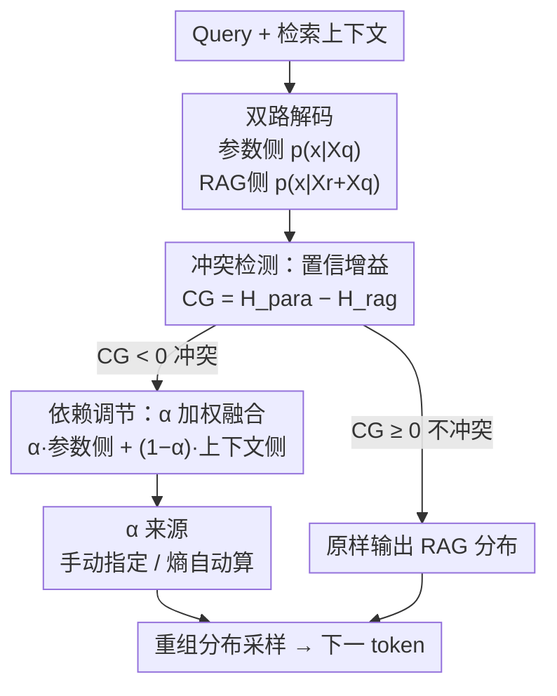

# Parameters vs. Context: Fine-Grained Control of Knowledge Reliance in Language Models

**会议**: ICLR 2026  
**OpenReview**: [https://openreview.net/forum?id=TJ3DqFiGau](https://openreview.net/forum?id=TJ3DqFiGau)  
**代码**: https://github.com/byronBBL/CK-PLUG  
**领域**: LLM / NLP  
**关键词**: RAG, 知识冲突, 解码干预, 参数知识, 上下文忠实度

## 一句话总结
本文提出 CK-PLUG，一个即插即用、无需训练的解码期方法：先用「置信增益（Confidence Gain）」逐 token 检测参数知识与检索上下文的冲突，再对冲突 token 用单一超参 $\alpha$ 加权融合「参数侧」和「上下文侧」两套概率分布，从而在「更信自己」与「更信检索」之间做连续、双向、可控的调节——在 LLaMA3-8B 上能把记忆召回率（MR）在 9.9%–71.9% 区间任意拨动，同时保持生成流畅度。

## 研究背景与动机

**领域现状**：RAG（检索增强生成）通过往 prompt 里塞外部知识来缓解 LLM 幻觉，已经是问答、事实核查等任务的主流做法。它默认外部检索到的内容比模型参数里的知识更可信。

**现有痛点**：但参数知识和检索上下文经常**冲突**。检索结果可能过时、噪声、甚至对抗性误导；模型自己的参数知识也可能已经陈旧。两种情况下都会出问题：盲信上下文会被坏检索带偏，盲信参数又会错过外部更新的事实。模型自己没法判断该信谁。

**核心矛盾**：参数的「事实性」和上下文的「忠实度」之间存在内在 trade-off。现有的对齐方法——要么把模型往「更忠于事实」拉，要么往「更忠于上下文」拉——都是**单向、不可控**的：它们把偏好固化进权重，没法在部署时根据「这次检索质量好不好」「这个模型新不新」灵活双向调整。

**本文目标**：做一个能**双向、连续、细粒度**调节知识依赖偏好的机制，且最好不改模型参数、不训多个版本、即插即用。

**切入角度**：作者观察到一个可量化的信号——当把冲突上下文插进 prompt 后，**知识敏感 token 的概率分布熵会升高**（模型变得更不确定）；而支持性上下文会让熵降低（模型更自信）。这意味着「插入上下文前后的置信变化」可以当作冲突探测器。

**核心 idea**：用「插入上下文前后的熵变（置信增益）」逐 token 定位冲突点，**只对冲突 token** 把参数侧、上下文侧两套 next-token 分布按 $\alpha$ 加权重组，用一个旋钮控制信参数还是信上下文。

## 方法详解

### 整体框架

CK-PLUG（Controllable Knowledge Plug-in）是一个挂在解码循环里的轻量插件，不动模型权重和结构。它在生成每个 token 时做三件事：① 同时算两套 next-token 分布——只喂 query 的「参数侧分布」$p(x\mid X_q)$ 和喂了 query+检索上下文的「RAG 分布」$p(x\mid X_r+X_q)$；② 用两者的熵差（置信增益 CG）判断当前 token 是不是冲突点；③ 若是冲突 token，就用超参 $\alpha$ 把参数侧、上下文侧两套分布加权融合后再采样，非冲突 token 则原样走标准 RAG 解码。$\alpha$ 越大越信参数，越小越信上下文。论文还提供一个免调参的自动模式：直接用两套分布的熵把 $\alpha$ 算出来。

### 关键设计

**1. 置信增益 CG：用熵变把「哪个 token 在冲突」精确点出来**

如果对所有 token 一视同仁地干预，会引发生成质量的灾难性崩溃，所以必须先定位真正发生知识冲突的 token，只动它们。作者把这个「开关」建立在信息熵上。熵的定义为 $H(a)=-\sum_i a_i\log_2 a_i$，熵越高代表分布越混乱、模型越不确定。作者在 NQ 数据上做了验证（图 2）：插入与参数知识矛盾的 Conflict Context 后，gold-answer token 的分布熵**上升**（模型变迷糊）；而插入印证性的 Support Context 后熵**下降**（模型更笃定）。据此定义置信增益

$$\mathrm{CG} = H(p(x\mid X_q)) - H(p(x\mid X_r+X_q))$$

即「只看参数」的熵减去「看了上下文」的熵。若插入上下文让某个 token 的置信明显下降（$\mathrm{CG}<0$，或低于按模型设定的阈值 $\varepsilon$），就判定它处在潜在知识冲突上，交给后续模块处理；否则放过。这个逐 token 的信号正好对应人类直觉中「这个词上模型在纠结到底信谁」的位置。

**2. 参数-上下文依赖调节：单旋钮 $\alpha$ 双向连续控制**

定位到冲突 token 后，需要一种轻量、不训练就能左右「信参数还是信上下文」的手段。CK-PLUG 在 log 概率空间里把两种来源拆开。它把「参数侧对数分布」记作 $q_{\text{para}}=\log p(x\mid X_q)$；再用 RAG 分布除以参数分布、隔离出上下文的纯贡献，得到「上下文侧对数分布」

$$q_{\text{cont}}(x\mid X_r+X_q)=\log\frac{p(x\mid X_r+X_q)}{p(x\mid X_q)}$$

对冲突 token（$\mathrm{CG}<0$）用调节函数把两者按 $\alpha$ 线性融合，非冲突 token 保持原 RAG 分布：

$$F(q_{\text{cont}}, q_{\text{para}}) = \alpha\cdot q_{\text{para}} + (1-\alpha)\cdot q_{\text{cont}}$$

调大 $\alpha$ 模型更靠参数知识，调小则更靠检索上下文——这就是「双向可控」的来源，相比旧的单向对齐方法，它把偏好做成了部署时一个可连续拨动的旋钮。为防止融合分布塌到长尾噪声 token 上，作者沿用 adaptive plausibility constraint，只在候选子集 $V_{\text{head}}$ 内重排——该子集取参数侧 top-k 与上下文侧 top-k 的**并集**，并集保证了那些上下文偏好但置信低的 token 也能进入候选，子集外的 token logit 直接置为 $-\infty$。

**3. 自适应模式：用熵把 $\alpha$ 自动算出来，免人工调参**

手动指定 $\alpha$ 在通用 RAG 里不现实（无法预知每条样本该信谁多一点）。作者据此把 $\alpha$ 重写成两套分布困惑度的归一化比值：记参数困惑度 $H_{\text{para}}=H(p(x\mid X_q))$、上下文困惑度 $H_{\text{cont}}=H(p(x\mid X_r+X_q))$，则

$$\alpha = \frac{H_{\text{cont}}}{H_{\text{para}}+H_{\text{cont}}}$$

直觉是：熵越高代表模型对那一侧越没信心，于是 $\alpha$ 自动把权重让给更自信的一侧——若上下文让模型更迷糊（$H_{\text{cont}}$ 大），$\alpha$ 变大、更信参数；反之更信上下文。这让 CK-PLUG 不需要人工设 $\alpha$ 就能按模型自身置信自适应平衡，同时增强了可解释性。

### 一个完整示例

以「Kevin De Bruyne 的母语是什么」为例：检索上下文写「他英语流利……」误导成 English，而参数知识里答案是 Dutch。解码到答案 token 时，CK-PLUG 同时算参数侧分布（Dutch 概率高）和 RAG 侧分布（被上下文拉向 English）。插入上下文后该 token 熵上升、$\mathrm{CG}<0$，被判为冲突。此时若用户设 $\alpha$ 偏大（信参数），融合后 Dutch 胜出；设 $\alpha$ 偏小（信上下文），English 胜出。非答案 token（如 "The native language is"）CG≥0，不被干预，照常生成，从而只在关键事实词上动刀、保住整句流畅。

## 实验关键数据

### 主实验

知识控制实验在 NQ（改成反事实上下文）、ConFiQA、MQuAKE 上做，指标为 ConR（上下文召回）、ParR（参数召回）和记忆比 $\mathrm{MR}=\frac{\text{ParR}}{\text{ParR}+\text{ConR}}$（越高越偏参数）。通过把 $\alpha$ 从 0.0 调到 1.0，MR 可被大幅、双向拨动：

| 模型 | 数据集 | Baseline MR | $\alpha{=}0.0$（偏上下文） | $\alpha{=}1.0$（偏参数） |
|------|--------|------|------|------|
| LLaMA3-8B | NQ | 43.5 | 9.9（↓77.2%） | 71.9（↑65.3%） |
| LLaMA3-8B | ConFiQA | 29.2 | 14.9（↓48.9%） | 62.5（↑114.0%） |
| LLaMA2-7B | MQuAKE | 40.9 | 21.0（↓48.7%） | 79.9（↑95.4%） |
| Mistral0.3-7B | NQ | 55.9 | 17.2（↓69.3%） | 72.2（↑29.2%） |

自适应模式在 6 个通用 RAG 任务（NQ/HotpotQA/FEVER/T-REX/Eli5/WOW）上对比 w/o RAG、w/ RAG、RAG+CK-PLUG，几乎全面带来稳定增益：

| 模型 | w/o RAG (Avg) | w/ RAG (Avg) | RAG + CK-PLUG (Avg) |
|------|------|------|------|
| LLaMA2-7B-Chat | 25.5 | 36.4 | 38.3 |
| LLaMA3-8B-Instruct | 30.7 | 42.3 | 43.5 |
| Mistral0.3-7B | 33.4 | 45.1 | 45.7 |
| Qwen2.5-7B | 27.2 | 45.4 | 45.9 |

### 消融实验

核心消融是去掉冲突检测（ConD），即不再只动冲突 token、而是无差别干预，用命中率（hit rate，输出是否包含参数答案或 gold 答案）衡量生成质量：

| 配置 | LLaMA3-8B 命中率 | 说明 |
|------|------|------|
| Baseline（标准 RAG） | 83.7 | 不加 CK-PLUG |
| w/ ConD，$\alpha{=}1.0$ | 86.7 | 有检测，质量与 baseline 持平甚至更好 |
| w/o ConD，$\alpha{=}0.0$ | 53.8 | 去检测后在极端 $\alpha$ 下大幅崩坏 |

### 关键发现
- **ConD 是防崩关键**：带 ConD 时命中率与标准 RAG 相当；去掉 ConD 后，尤其在 $\alpha{=}0.0$/$1.0$ 这类极端调节下，LLaMA 系列命中率从 80+ 掉到 50 多，验证「只动冲突 token」是避免灾难性生成崩溃的必要条件。
- **调节近似线性、平滑**：MR 随 $\alpha$ 大体线性变化，保证了细粒度可控；Qwen 偏向更信任自己的参数知识（与既往观察一致），但趋势仍接近线性。
- **不伤流畅度**：case study 显示干预只发生在知识敏感 token，整句保持流畅与逻辑一致，说明 CK-PLUG 是在根本上调节知识依赖而非破坏语言建模。

## 亮点与洞察
- **把「冲突」变成可测信号**：用「插入上下文前后的熵变」当冲突探测器，既有信息论根据又能逐 token 定位，比起整段判断「该不该信检索」精细得多。
- **log 空间相除隔离上下文贡献**：$q_{\text{cont}}=\log\frac{p(x\mid X_r+X_q)}{p(x\mid X_q)}$ 这一步很巧——用除法把「上下文带来的增量」从混合分布里干净地剥出来，使得参数侧/上下文侧可以独立加权。这种「对比解码」式的思路可迁移到其他需要分离两路信号的解码控制任务。
- **训练-free + 单旋钮 + 自适应**：既能让用户按场景（检索质量好坏、模型新旧）手动拨 $\alpha$，又能在无人工时用熵自动定 $\alpha$，部署友好。

## 局限与展望
- 冲突检测阈值 $\varepsilon$ 需要按模型逐个设定（论文给 LLaMA2/3、Mistral、Qwen 分别设 -2/-1/-1/-3），跨模型不通用，迁移到新模型要重新标定。
- 方法依赖「冲突时熵升、支持时熵降」这一经验规律，但在 Mistral、Qwen 上冲突条件下的熵变并不显著（图 2c/d），探测信号可能偏弱，对这类模型的鲁棒性存疑。
- 需要每步多跑一遍「只喂 query」的前向来拿参数侧分布，解码成本约翻倍；长生成场景的开销和延迟未充分讨论。
- 评测主要在事实型 QA 与构造的反事实冲突上，更开放、多跳或长文生成中冲突的定义与调节效果还需验证。

## 相关工作与启发
- **vs 事实性/忠实度对齐（如 DoLa、context-faithful 系列）**：它们把「更信事实」或「更信上下文」固化进训练，是单向且部署时不可调；CK-PLUG 在推理期用 $\alpha$ 做双向连续调节，无需训练多版本。
- **vs 对比解码 / adaptive plausibility（Li et al. 2022）**：CK-PLUG 借用了 top-k 并集约束来防长尾塌缩，但把对比对象从「专家 vs 业余模型」换成「参数侧 vs 上下文侧」分布，并引入熵驱动的冲突门控，目标从「提质量」变成「控知识来源」。
- **vs 知识编辑（如 MQuAKE 场景）**：知识编辑改权重让模型记住新事实；CK-PLUG 不改权重，而是在解码时调节信任谁，二者互补——编辑解决「记不记得」，CK-PLUG 解决「信不信」。

## 评分
- 新颖性: ⭐⭐⭐⭐ 把熵变冲突探测 + log 空间分布融合组合成可控旋钮，角度新颖且实用
- 实验充分度: ⭐⭐⭐⭐ 4 个模型 × 多数据集 + 自适应 6 任务 + ConD 消融，较完整；成本/延迟分析偏少
- 写作质量: ⭐⭐⭐⭐ 动机—信号—机制链条清晰，图示直观
- 价值: ⭐⭐⭐⭐ 训练-free、即插即用，对 RAG 部署中「信参数还是信检索」是实打实的痛点工具

<!-- RELATED:START -->

## 相关论文

- [\[ICLR 2026\] Fine-Grained Activation Steering: Steering Less, Achieving More](fine-grained_activation_steering_steering_less_achieving_more.md)
- [\[ACL 2025\] BehaviorBox: Automated Discovery of Fine-Grained Performance Differences Between Language Models](../../ACL2025/llm_nlp/behaviorbox_automated_discovery_of_fine-grained_performance_differences_between_.md)
- [\[ICLR 2026\] Cite Pretrain: Retrieval-Free Knowledge Attribution for Large Language Models](cite_pretrain_retrieval-free_knowledge_attribution_for_large_language_models.md)
- [\[ACL 2025\] ChartLens: Fine-Grained Visual Attribution in Charts](../../ACL2025/llm_nlp/chartlens_fine-grained_visual_attribution_in_charts.md)
- [\[ACL 2025\] RetroLLM: Empowering Large Language Models to Retrieve Fine-grained Evidence within Generation](../../ACL2025/llm_nlp/retrollm_empowering_large_language_models_to_retrieve_fine-grained_evidence_with.md)

<!-- RELATED:END -->
