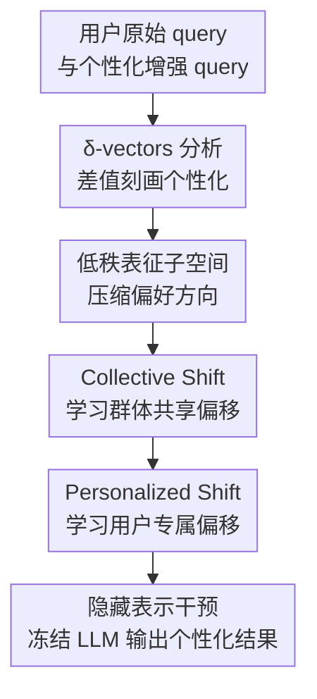

# PerFit: Exploring Personalization Shifts in Representation Space of LLMs

**会议**: ICLR 2026  
**OpenReview**: [https://openreview.net/forum?id=Lwn67fk9e1](https://openreview.net/forum?id=Lwn67fk9e1)  
**代码**: 论文称已提供项目主页代码，缓存中未给出具体 URL  
**领域**: LLM / NLP  
**关键词**: 个性化大语言模型、表征微调、activation steering、低秩子空间、用户偏好

## 一句话总结
PerFit 发现 LLM 中的个性化信息可以被低秩表征偏移刻画，并用“群体共享偏移 + 用户专属偏移”的两阶段表征空间干预，在 LaMP 六个个性化任务上接近或超过 LoRA/OPPU，同时相对 OPPU 平均减少约 92.3% 可训练参数。

## 研究背景与动机
**领域现状**：个性化大语言模型希望同一个基础 LLM 面对不同用户时，能根据用户历史、写作风格、评分习惯或领域偏好给出不同输出。现有路线大致分成两类：一类是不调参的 RAG、PAG、profile prompting 等方法，把用户历史或画像塞进上下文；另一类是 PEFT，尤其是 LoRA/OPPU 这类为用户训练个性化参数的方案。

**现有痛点**：不调参方法部署轻，但用户历史里常有噪声，检索到的上下文也不一定等于真实偏好，因此在隐式风格、标题习惯、评价尺度这类任务上容易只“看见资料”，却没有真正学到用户。LoRA 类方法效果更强，但每个用户都要存一份适配参数，哪怕是低秩适配也可能有百万级参数；在边云协同场景里，基础模型在云端、用户个性化参数在设备端，这会带来存储、通信和扩展性问题。

**核心矛盾**：个性化不是一个全模型都需要重写的能力，但现有强方法仍主要在参数空间里改权重；如果用户偏好其实只对应隐藏表示中的少数方向，那么为每个用户训练大量参数就是一种过度表达。论文的关键问题因此变成：LLM 的 hidden representation space 里是否存在可辨认、可压缩、可干预的个性化信号？

**本文目标**：作者先做机制分析，观察个性化信息在表征空间里是否形成稳定模式；再把观察转成一个轻量方法，在不更新基础模型参数的前提下，通过低秩表征干预实现用户级适配；最后在多个 LaMP 个性化分类和生成任务上验证效果、参数量、训练时间和鲁棒性。

**切入角度**：论文借鉴 activation steering 和 representation fine-tuning 的思路。与其把用户偏好编码进 LoRA 权重，不如直接在某些层的 residual stream 上加一个可学习干预向量；如果这些向量有低秩结构，就可以用很小的矩阵来学习。

**核心 idea**：把个性化看成隐藏表示中的低秩偏移，并把偏移拆成“所有用户共享的 collective shift”和“每个用户自己的 personalized shift”，用两阶段 PerFit 直接学习并注入这些表征偏移。

## 方法详解
### 整体框架
PerFit 的方法链条很清楚：先从原始 query 和加入个性化历史后的 query 中提取隐藏状态差值，分析这些差值在表征空间里的几何结构；再根据“低秩子空间 + 两类偏移”的观察，训练一个两阶段表征干预模块；推理时冻结基础 LLM，只把学到的低秩干预加到选定层的 hidden representation 上。它的输出仍由原 LLM 解码，但中间表示已经被推向符合目标用户偏好的方向。

更形式化地说，给定用户 $u_i$ 的原始查询集合 $Q_i^{orig}$ 和加入相关个性化信息后的查询集合 $Q_i^{per}$，论文在某一层 $\ell$ 取最后 token 的 residual stream 表示，计算两个均值表示 $m_i^{(\ell)}$ 与 $n_i^{(\ell)}$，并用差值 $v_i^{(\ell)}=n_i^{(\ell)}-m_i^{(\ell)}$ 作为用户个性化信息诱导出的 $\delta$-vector。所有用户的 $\delta$-vectors 被一起分析，而不是像传统 activation steering 那样只找单个属性方向。

这个分析得到两点：第一，$\delta$-vectors 可以由很小的正交低秩子空间解释，例如部分 LaMP 任务用极少维度就能解释 0.8 或 0.9 的方差；第二，低秩空间中先有一个所有用户大致共享的方向偏移，再围绕这个偏移向不同方向发散，反映个体差异。PerFit 的两阶段设计正是把这两种偏移分别建模。

### 关键设计
**1. δ-vectors：先把个性化从输入长度和任务语义里分离出来**

论文没有一上来就训练模块，而是先问“个性化信息在 LLM 里面长什么样”。对每个用户，它构造两类输入：普通 query 和带有最相关用户历史/个性化信息的 query，然后比较它们在同一层、最后 token 处的 residual representation。差值 $v_i^{(\ell)}=n_i^{(\ell)}-m_i^{(\ell)}$ 可以理解为“加入这个用户信息后，模型内部表示被推开了多少、往哪里推”。这一步的重要性在于，它把个性化从输出文本层面拉回到模型内部空间，让后续方法不必盲目猜测应该调哪些权重。

作者还做了一个必要的排除实验：如果只是往 query 前面加等长随机文本，表示当然也会变，但随机文本造成的均值坐标偏移明显小于真实个性化信息对应的 $\delta$-vectors。这说明观察到的偏移不是输入变长的伪影，而主要来自用户历史中携带的偏好信号。

**2. 低秩表征子空间：用小矩阵承载用户偏好，而不是给每个用户存大 LoRA**

SVD 分析显示，个性化差值并不需要完整 hidden dimension 才能表达。以 Llama hidden dimension 4096 为参照，多个 LaMP 任务在解释 0.8 或 0.9 方差时只需要很小的维度；例如 LaMP-2N 解释 0.8 方差只需 1 维，解释 0.9 也只需 4 维，LaMP-5 解释 0.9 需要 40 维。这意味着用户偏好虽然表面上多样，但在模型内部可能集中在少数可控方向上。

PerFit 因此用一个正交投影矩阵 $R\in\mathbb{R}^{r\times d}$ 把高维表示投到低维子空间，再用低维变换 $Wx+b$ 学习偏移，最后通过 $R^\top$ 映回原空间。单个阶段的干预写作 $\phi_{\Delta\Theta}(x)=x+R^\top(Wx+b-Rx)$。直观上，$R$ 负责找个性化所在的低秩坐标系，$W$ 和 $b$ 负责在这个坐标系里移动表示；由于 $r\ll d$，可训练参数自然比 LoRA 少得多。

**3. Collective Shift + Personalized Shift：先学人群共性，再学个人差异**

第二个观察是所有用户的 $\delta$-vectors 并非完全散乱：低秩投影后，某个主方向上有明显均值偏移，这对应 collective shift；在这个共享偏移基础上，不同用户又向不同区域扩散，这对应 personalized shift。PerFit 把这个几何结构直接写进训练流程：Stage 1 用所有用户数据训练共享干预，学习“个性化任务通常会把表示往哪里推”；Stage 2 在共享干预之后，为每个用户微调专属的第二阶段干预。

这个设计比“一阶段为每个用户直接学一个向量”更稳，因为用户自己的历史往往有限，直接从少量样本里估计完整偏移容易过拟合。先有 collective shift 等于给每个用户一个共同起点，Stage 2 只需要学习相对这个起点的残差。消融也支持这一点：只用 Stage 1 会丢掉个人差异，只用 Stage 2 则缺少群体先验，完整两阶段通常最好。

**4. 层与位置选择：个性化更像中前层表征问题，而不是末层解码问题**

PerFit 干预的是某些 transformer 层的表示，因此“在哪一层加偏移”很关键。论文的 layer-wise 分析显示，早中层的 $\delta$-vectors 更低秩，也更有明显 collective shift；越到后层，用户风格、任务语义和生成格式开始纠缠，干预效果下降。实验里单层干预从低层到高层整体变差，最后一层甚至会破坏输出格式。

这和知识编辑常在中后层找事实知识位置的经验不同。本文任务不是写入一个事实，而是让模型带着用户风格/偏好去处理后续生成或分类；这类信号如果在中前层注入，后续层还能继续传播和组合，若到太后面才改，既难影响完整生成过程，也更容易扰乱指令格式。

### 一个完整示例
假设某个用户经常写学术论文标题，历史标题偏好是“用冒号或破折号把方法与目标拆开”，另一个用户则偏好“using / based on”这类朴素方法短语。普通 LLM 看到同一篇 abstract 时，可能生成一个平均化标题；PAG/RAG 会把若干历史标题塞进上下文，但如果检索结果含噪，模型未必知道该模仿哪种风格。

PerFit 的处理方式是在训练时比较“只给 abstract 的 query”和“给 abstract + 用户历史标题信息的 query”在隐藏表示中的差异。第一个用户的差值向量可能靠近“标点分隔、标题结构更戏剧化”的区域，第二个用户则靠近“方法描述更直接”的区域。Stage 1 先学到“标题生成任务中，加入用户历史通常会把表示从通用标题方向推向个性化标题方向”；Stage 2 再把每个用户从这个共同起点推到自己的风格区域。推理时即使不把长历史全部塞入 prompt，也能通过低秩干预让 LLM 生成更贴近用户习惯的标题。

论文附录的 case study 也提供了类似证据：在 LaMP-5 这类标题生成任务中，靠近 collective vector 的用户标题更常使用逗号、破折号等标点；中间区域用户更常使用 based on / using 等方法表达；最远的点则多是 abstract 缺失或异常样本。这说明 personalized shifts 的空间位置确实和用户文本风格有对应关系。

### 损失函数 / 训练策略
训练目标仍是标准的监督个性化目标：让个性化模型 $M_i$ 对用户 $u_i$ 的 query $q_j^{(i)}$ 生成目标输出 $y_j^{(i)}$，同时尽量减少新增参数 $|\Delta\Theta_i|$。Stage 1 中，所有用户共享两阶段干预参数的初始化，并在全体用户数据上更新共享偏移；Stage 2 中，固定或继承 Stage 1 的共享部分，为每个用户单独微调第二阶段参数 $\Delta\Theta_i^{(2)}$。

实现上，基础模型权重保持冻结，训练的是表征干预参数。论文使用 AdamW，学习率 $1\times10^{-4}$，weight decay $1\times10^{-2}$，BF16 精度，梯度裁剪最大范数 0.3；基础 LLM 训练阶段 3 个 epoch，个人 PEFT 阶段 2 个 epoch。LoRA/OPPU 的 LoRA rank 设为 8；PerFit/ReFT 的低秩维度、干预层和干预位置通过 20 次随机搜索确定，例如多个任务的 collective rank 常取 32，user low-rank dimension 在 4 到 32 之间变化，干预层常落在 14、15、16 或附近组合。

## 实验关键数据

### 主实验
论文在 LaMP benchmark 的六个任务上评测，包括三类分类任务和三类生成任务。分类任务报告 Accuracy/F1 或 MAE/RMSE，生成任务报告 ROUGE-1/ROUGE-L。基础模型主要是 Llama2-7B，对比包括 Non-Personalized、PAG、RAG、StyleVector、LoRA-C、LoRA-P、LoFiT 和 OPPU。

| 任务 | 指标 | PerFit | OPPU | 结论 |
|------|------|--------|------|------|
| LaMP-2N News Categorization | Acc / F1 | 0.818 / 0.586 | 0.810 / 0.589 | Acc 更高，F1 基本持平 |
| LaMP-2M Movie Tagging | Acc / F1 | 0.630 / 0.518 | 0.600 / 0.493 | 两个指标均明显更好 |
| LaMP-3 Product Rating | MAE / RMSE | 0.179 / 0.443 | 0.179 / 0.443 | 与 OPPU 持平 |
| LaMP-4 News Headline Gen. | R-1 / R-L | 0.207 / 0.186 | 0.191 / 0.171 | 生成质量优于 OPPU |
| LaMP-5 Scholarly Title Gen. | R-1 / R-L | 0.521 / 0.451 | 0.519 / 0.442 | 小幅优于 OPPU |
| LaMP-7 Tweet Paraphrasing | R-1 / R-L | 0.525 / 0.472 | 0.539 / 0.483 | 略低于 OPPU，但参数少很多 |

| 任务 | PerFit 参数占比范围 | 相比 OPPU 参数减少 | 备注 |
|------|--------------------|----------------------|------|
| LaMP-2N | 0.0058% / 0.0117% | 93.75% / 81.25% | 表中蓝红分别对应两阶段参数 |
| LaMP-2M | 0.0078% / 0.0010% | 91.67% / 98.44% | Movie Tagging 上性能和效率同时提升 |
| LaMP-3 | 0.0117% / 0.0015% | 87.50% / 97.66% | 与 OPPU 持平但参数更少 |
| LaMP-4 | 0.0117% / 0.0015% | 87.50% / 97.66% | Headline 任务上 R-1/R-L 最好 |
| LaMP-5 | 0.0039% / 0.0010% | 95.83% / 98.44% | Scholarly title 任务效率优势明显 |
| LaMP-7 | 0.0078% / 0.0039% | 91.67% / 93.75% | 性能略输 OPPU，但参数大幅减少 |

### 消融实验
| 配置 | News Categorization Acc/F1 | Movie Tagging Acc/F1 | News Headline R-1/R-L | Tweet Paraphrasing R-1/R-L | 说明 |
|------|----------------------------|----------------------|------------------------|-----------------------------|------|
| Ours | 0.818 / 0.586 | 0.630 / 0.518 | 0.207 / 0.186 | 0.525 / 0.472 | 完整两阶段 PerFit |
| @Stage-1 | 0.792 / 0.529 | 0.466 / 0.415 | 0.189 / 0.169 | 0.493 / 0.450 | 只学 collective shift，缺少个体差异 |
| @Stage-2 (C+P) | 0.803 / 0.604 | 0.620 / 0.496 | 0.194 / 0.175 | 0.483 / 0.438 | 一阶段化但给更大 rank，部分指标可接近完整方法 |
| @Stage-2 (P) | 0.801 / 0.594 | 0.599 / 0.473 | 0.190 / 0.171 | 0.478 / 0.433 | 只用 personalized rank，整体弱于完整方法 |
| ref. LoRA-P | 0.591 / 0.397 | 0.528 / 0.383 | 0.120 / 0.108 | 0.398 / 0.333 | 个体 LoRA 基线，参数更多且效果弱 |

### 关键发现
- PerFit 的优势不是单纯“参数少”，而是在多数任务上用更少参数达到 OPPU 级别甚至更好的效果；分类任务 LaMP-2M 和生成任务 LaMP-4/5 尤其明显。
- 两阶段结构确实必要。只保留 Stage 1 会把用户之间的差异抹平；只保留 Stage 2 又少了群体共享先验，尤其在 Movie Tagging 和 Tweet Paraphrasing 上掉点明显。
- 参数效率非常突出。论文报告相比 OPPU 的参数削减范围为 81.25% 到 98.44%，整体平均约 92.3%，训练时间也比现有 fine-tuning baseline 减少 17.0% 到 35.8%。
- 干预层位置影响很大。单层干预在层 5 到 10 附近表现最好，层数过深后性能下降，最后一层会严重破坏任务格式；这和“个性化主要在早中层低秩表征中形成”的分析一致。
- 冷启动实验显示 PerFit 对 collective 用户数量不太敏感。即使 Stage 1 只有 10 个 collective users，PerFit 也比 OPPU 更稳，说明它学习到的是比较鲁棒的人群级偏移，而不是某组用户的偶然模式。

## 亮点与洞察
- 论文最有价值的地方是先做表征几何观察，再把观察变成方法，而不是直接提出一个新 adapter。低秩子空间、collective shift、personalized shift 三个概念彼此咬合，方法设计有清楚来源。
- PerFit 把个性化从“每人一套参数”改写成“每人在表征空间里有一个轻量偏移”。这对端侧个性化、隐私敏感个性化和大规模用户系统都很有启发，因为用户侧只需要保存很小的干预参数。
- 论文对“个性化信号在哪一层”给出了有意思的经验结论：它不像事实知识编辑那样偏向中后层，而更像早中层的风格/偏好表示问题。这个结论可迁移到 personalized agent memory、用户画像压缩、可控生成风格注入等方向。
- 与 RAG/PAG 相比，PerFit 提示我们：用户历史不一定每次都要以文本形式塞进上下文，也可以被蒸馏成表示空间中的偏移。这样既减少上下文噪声，也避免长历史导致的推理成本。

## 局限与展望
- 实验主要集中在 LaMP 的隐式个性化任务，虽然覆盖分类和生成，但仍属于相对标准化的数据集。真实聊天、长程 agent 记忆、跨会话偏好漂移中的用户需求更复杂，PerFit 是否还能稳定工作需要继续验证。
- PerFit 仍需要用户级训练数据来学习 Stage 2。对于完全新用户、历史极短用户或偏好快速变化的用户，如何在线更新干预而不反复训练，是实际部署里的关键问题。
- 论文强调参数减少，但个性化系统还涉及隐私和安全。表征偏移虽然小，也可能编码敏感用户信息；如果这些偏移被泄露或反推，仍可能带来隐私风险。
- 目前的 collective shift 主要是全体用户级别。未来可以扩展到社区级、群体级或任务级多层偏移，例如先学“学术写作用户群”的偏移，再学某个研究者个人的偏移。
- 层和 rank 的选择依赖随机搜索，不同 backbone、任务和用户数据分布下可能需要重新调参。后续若能从 $\delta$-vector 分析自动推断干预层与 rank，会让方法更易用。

## 相关工作与启发
- **vs RAG / PAG**: RAG 和 PAG 通过检索历史或构造用户画像来显式增强输入，优点是无需训练、部署灵活；PerFit 则把用户偏好压进隐藏表示偏移里，减少上下文噪声和 prompt 长度，但需要训练用户级干预。
- **vs LoRA-P / OPPU**: LoRA-P 为每个用户训练参数，OPPU 进一步结合 collective 与 personalized 两阶段 LoRA；PerFit 保留两阶段思想，但把干预从参数空间移到表示空间，因此参数量显著更低，也更贴合论文观察到的低秩偏移结构。
- **vs StyleVector / activation steering**: StyleVector 等方法通常通过对比样本找风格向量，在推理时做训练-free steering；PerFit 不只是手工构造一个 steering vector，而是用监督目标学习低秩干预，并显式建模群体和个人两类偏移。
- **vs ReFT / LoFiT**: ReFT 和 LoFiT 都说明直接改 hidden representation 是可行路线；PerFit 的区别是把这种路线专门改造成个性化框架，并用 $\delta$-vectors 的几何分析解释为什么要低秩、为什么要两阶段。

## 评分
- 新颖性: ⭐⭐⭐⭐⭐ 从个性化表征几何出发设计两阶段低秩干预，思路比较完整。
- 实验充分度: ⭐⭐⭐⭐ 覆盖六个 LaMP 任务、效率、消融、层分析、冷启动和 backbone，但真实交互场景还不够多。
- 写作质量: ⭐⭐⭐⭐ 主线清晰，观察和方法对应紧密；部分表格和附录信息较密，需要读者自己串起来。
- 价值: ⭐⭐⭐⭐⭐ 对大规模个性化 LLM 部署很有实际意义，也为“用户偏好在模型内部如何表示”提供了可复用分析框架。

<!-- RELATED:START -->

## 相关论文

- [\[ICML 2026\] The Cylindrical Representation Hypothesis for Language Model Steering](../../ICML2026/llm_nlp/the_cylindrical_representation_hypothesis_for_language_model_steering.md)
- [\[ICLR 2026\] The Lattice Representation Hypothesis of Large Language Models](the_lattice_representation_hypothesis_of_large_language_models.md)
- [\[ACL 2025\] HiCUPID: Exploring the Potential of LLMs as Personalized Assistants](../../ACL2025/llm_nlp/exploring_the_potential_of_llms_as.md)
- [\[ACL 2025\] LLMs Know Their Vulnerabilities: Uncover Safety Gaps through Natural Distribution Shifts](../../ACL2025/llm_nlp/llms_know_their_vulnerabilities_uncover_safety_gaps_through_natural_distribution.md)
- [\[AAAI 2026\] An Invariant Latent Space Perspective on Language Model Inversion](../../AAAI2026/llm_nlp/an_invariant_latent_space_perspective_on_language_model_inve.md)

<!-- RELATED:END -->
