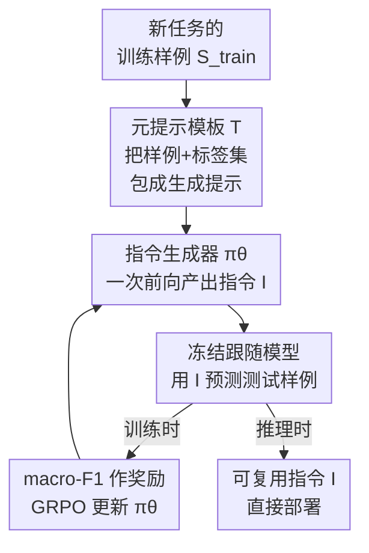

# Prompt-MII: Meta-Learning Instruction Induction for LLMs

**会议**: ICLR 2026  
**OpenReview**: [https://openreview.net/forum?id=zD9fjEj4Oz](https://openreview.net/forum?id=zD9fjEj4Oz)  
**代码**: https://github.com/millix19/promptmii  
**领域**: NLP理解 / 提示优化 / 元学习  
**关键词**: 指令归纳, 提示优化, 元学习, 强化学习, 上下文学习

## 一句话总结
本文把"从一堆样例里写出一条好任务指令"这件事变成一个可学习的策略：用强化学习在 3000+ 个分类数据集上元训练一个指令生成器，让它对任意新任务一次前向就吐出一条精炼指令，效果追平 100-shot 上下文学习（ICL），但用的 token 少 3-13 倍。

## 研究背景与动机
**领域现状**：把大模型适配到新任务，常见有三条路——写指令（prompting）、上下文学习（ICL，把训练样例直接塞进 context）、监督微调（SFT）。三者各有取舍：写指令最省 token、推理最快，但要人工反复调；ICL 效果强但样例一多 context 就爆、推理又慢又贵；SFT 推理时省，但训练贵、要存权重，而且很多任务还打不过 ICL。

**现有痛点**：介于 ICL 和写指令之间有一类方法叫"指令归纳"（instruction induction）：吃进训练样例 $S_{train}$，自动产出一条指令 $I$。但代表性方法如 APE、GEPA 都是在**测试时**跑昂贵的进化/搜索算法——APE 要 2000 次 LLM 调用、GEPA 要 150 次，针对每个新任务从头搜一遍，既慢又贵。

**核心矛盾**：指令归纳的"效果"和"效率"被绑死了——要效果好就得在每个任务上现场搜索，要效率高就只能用粗糙的一次性生成。问题根源在于，这些方法把每个任务都当成一个孤立的优化问题，每来一个新数据集都要把"怎么写好指令"这件事重新发现一遍，跨任务的知识完全没被复用。

**本文目标**：能不能训练出一个**通用**的指令归纳能力，对任意新分类任务，一次前向就生成一条又准又短的指令，免去测试时的逐任务搜索？

**切入角度**：作者把指令归纳重新表述成一个**元学习**问题——不再为每个任务单独优化 $I$，而是训练一个指令归纳策略 $\pi_\theta$，让它在多样化的任务分布上学会"如何构造好指令"这件事本身。

**核心 idea**：$I = \pi_\theta(S_{train})$——用一个元学习出来的策略代替逐任务搜索，把"写指令"从测试时的优化压成一次前向推理，跨数据集共享写指令的知识。

## 方法详解

### 整体框架
Prompt-MII 训练一个**指令生成器** $\pi_\theta$，让它具备通用的指令归纳能力。流程是：拿一个分类数据集，采样一批训练样例 $S^{(i)}_{train}$，套进一个**元提示模板** $T$ 转成给模型的提示；$\pi_\theta$ 读这个元提示后，一次前向生成一条任务指令 $I$；这条指令交给一个**冻结的指令跟随模型** $LM_{eval}$，让它在测试样例 $S_{test}$ 上做预测；用预测的 macro-F1 当奖励信号，反过来用强化学习更新 $\pi_\theta$。因为公开数据集普遍没有"标准答案指令"，没法做监督学习，但**下游任务表现**天然就是一个可计算的奖励，所以用 RL 是自然选择。训练在 3000+ 个数据集上滚动进行，让策略见过足够多样的任务；推理时则只剩"喂样例 → 出指令"这一步，没有任何搜索。

### 关键设计

**1. 把指令归纳变成可元学习的策略：一次前向替代逐任务搜索**

针对的痛点是 APE/GEPA 那种"每个任务现场搜几百上千次"的低效。作者不再对每个任务单独优化指令，而是训练一个策略 $\pi_\theta$，对任意新数据集都只做一次前向 $I = \pi_\theta(T(S^{(i)}_{train}))$。这样做有两个好处：一是跨数据集**共享**"怎么写好指令"的知识，不用每个任务从零发现；二是测试时把昂贵的优化过程压成一次推理（Prompt-MII 测试时只需 1 次 LLM 调用，对比 GEPA 的 150 次、APE 的 2000 次）。这是本文最核心的视角转换——指令归纳从"测试时优化"变成"训练时学一个会写指令的模型"。

**2. 以下游表现为奖励的 RL 训练：用 GRPO 把"指令好不好"变成可优化信号**

由于公开数据集没有"标准指令"可做监督，作者用强化学习训练 $\pi_\theta$，奖励直接取生成指令在测试集上的下游表现：

$$R(I, S_{test}) = \mathbb{E}_{\{\hat{y}_j\},\{y_j\}}\big[\text{metric}(\{\hat{y}_j\}, \{y_j\})\big]$$

其中 $\hat{y}_j = LM_{eval}(I + \text{"Input: "} + x_j + \text{"Label:"})$，跟随模型 $LM_{eval}$ 全程冻结，本文用 macro-F1（对标签不均衡更鲁棒）、每次取 $m=20$ 个测试样例平衡稳定性与效率。优化算法用 GRPO，并做了两点增强——**非对称裁剪**和**去掉 KL 损失**，以鼓励更多探索。为了不让模型把奖励浪费在学格式，作者在生成指令后手工拼一条固定格式约束（`Only return one of these options: {label_names}...`）再算奖励，并对所有 baseline 一视同仁地加上这条，保证比较公平。

**3. 元提示模板：引导模型写出可泛化的决策规则而非死记样例**

一个容易被忽略但很关键的设计是元提示模板 $T$。如果只是把样例丢给模型让它"总结"，它很容易要么照抄具体样例、要么只罗列标签名。作者用一个结构化模板，明确要求生成的指令要做到：定义清楚任务与每个标签的含义、给出**通用的判定规则**让标注者能处理没见过的输入、点明常见陷阱和易错边界、同时保持简洁。这把"指令该长什么样"的先验注入了生成过程。消融发现最优模板是**模型相关**的（Llama 偏好 meta1、Qwen 偏好 meta2），所以训练和评测对每个模型用各自最优模板，但同一模型下训练和所有 baseline 用同一模板，保证对照干净。

**4. 大规模多样化分类数据集训练：让"会写指令"这件事真正泛化**

元学习能不能学到通用能力，关键在训练分布够不够广。作者从 HuggingFace 收集了所有公开文本分类数据集，自动过滤后得到 3,811 个，随机切成 3,430 训练 / 381 验证，评测时从验证集另取 90 个**未见任务**。正因为见过这么多样的任务，策略学到的是"如何根据样例写好指令"的元技能，而非记住某几个任务。论文还做了污染检查（MD5 精确哈希泄漏率仅 0.35%）和基于 MPNet 嵌入的相似度分箱分析，验证即便对与训练集**最不相似**的数据集，Prompt-MII 依然稳定超过未训练版本并追平 100-shot ICL，说明泛化是真的而非靠数据泄漏。

### 一个例子：从模糊线索到可执行规则
拿一个 4 类文本分类任务（n=10 样例，Llama-3.1-8B）走一遍：未训练的 Prompt-MII-Zero 生成的指令偏空泛，只给"语气和用词可作线索"这类模糊提示，F1 仅 0.241；而训练后的 Prompt-MII 写出的指令把每个标签的判定边界具体化（"标签 0 是关于装机/升级/选购电脑硬件的求助……标签 3 是与电脑无关、属于商业金融加密货币的内容……"），给出可直接执行的判定规则，F1 飙到 0.829；同一批样例下纯 ICL 反而只有 0.026。这个例子直观说明：RL 训练让模型学会从样例里**提炼可泛化的决策标准**，而不是堆砌模糊措辞或照搬样例。

## 实验关键数据

### 主实验
在 90 个未见分类任务上，用 Llama-3.1-8B 和 Qwen-2.5-7B 两个变体评测（指标 macro-F1，越高越好；下方为平均指令 token 数，越低越好）：

| 方法 | Llama n=20 | Llama n=100 | Qwen n=20 | Qwen n=100 |
|------|-----------|-------------|-----------|-----------|
| Naive | 0.253 | 0.253 | 0.303 | 0.303 |
| ICL | 0.406 (5177 tok) | 0.430 (11531 tok) | 0.431 | 0.482 (12027 tok) |
| Prompt-MII-Zero | 0.343 | 0.336 | 0.383 | 0.371 |
| **Prompt-MII** | **0.433 (901 tok)** | 0.405 | **0.441** | 0.424 |

关键对比：Llama Prompt-MII 用 n=20 样例（0.433 F1，901 token）就追平了 ICL 用 n=100 样例（0.430 F1，11531 token）——**12.8× token 压缩且性能无统计差异**。整体上 Prompt-MII 比 ICL 提升 4-9 个 F1 点（10-20% 相对），同时 token 少 3-13 倍。

对比测试时搜索方法（macro-F1）：

| 方法 | 测试时 LLM 调用 | Llama n=100 | Qwen n=100 |
|------|----------------|-------------|-----------|
| APE | 2000 | 0.288 | 0.356 |
| GEPA | 150 | 0.299 | 0.347 |
| **Prompt-MII** | **1** | **0.405** | **0.424** |

Prompt-MII 单次前向就大幅超过昂贵的迭代搜索方法。作者推测 APE/GEPA 在分类任务上吃亏，是因为分类只给标签/对错，反馈信号稀薄、难做误差归因，小 minibatch 反思容易过拟合或破坏已有指令。

### 消融实验

| 配置 | 关键发现 | 说明 |
|------|---------|------|
| Prompt-MII vs Zero | Llama n=20 +9% 绝对 F1（26% 相对） | RL 训练带来的核心增益 |
| 元提示模板 meta1 vs meta2 | Llama 偏 meta1（+0.053），Qwen 偏 meta2（+0.031） | 最优模板模型相关 |
| 跨模型迁移 Llama→Qwen | 0.391-0.415，优于 Zero 但弱于 Qwen→Qwen（0.409-0.441） | 训练增益部分可迁移 |
| 相似度分箱（>0.85 / 0.5-0.85 / <0.5） | 三个分箱内 Prompt-MII 均稳超 Zero、追平/超 100-shot ICL | 泛化非靠数据泄漏 |

### 关键发现
- **RL 训练是增益主来源**：去掉训练（Zero）后 Llama n=20 掉 9 个绝对 F1 点，证明"一次前向指令归纳"确实是可学习的技能。
- **短样例与长样例都受益，但长样例压缩率更高**：因为长样例数据集 ICL 更容易撞 context 上限，Prompt-MII 的 token 压缩头部空间更大。
- **小模型自训可超大模型现成生成**：Prompt-MII Llama-3.1-8B 竟然超过了大得多的 Llama-3.1-405B Prompt-MII-Zero，说明针对性 RL 训练比单纯堆大模型更有效。
- **跨模型迁移可行但次优**：RL 会把指令风格优化到特定跟随模型的偏好上，换跟随模型会掉一些，但仍优于完全未训练。

## 亮点与洞察
- **视角转换最巧**：把"逐任务搜索指令"重构成"元学习一个会写指令的策略"，一举把测试时 150-2000 次 LLM 调用压成 1 次——这是把优化成本从推理期前移到训练期的经典思路，在指令归纳上是首次系统验证。
- **奖励设计干净**：直接拿下游 macro-F1 当奖励、跟随模型全程冻结，绕开了"没有标准指令做监督"的死结；手工拼格式约束再算奖励，避免模型把容量浪费在学格式上，这个小 trick 很实用。
- **可迁移性强**：指令是自然语言，天然可跨黑盒跟随模型迁移，这是相对软提示/微调的根本优势，也让该方法对闭源 API 模型友好。
- **"提炼规则 vs 照搬样例"的洞察**：案例分析清楚展示了 RL 训练让模型学会写**可执行的判定规则**而非模糊措辞，这点对理解 prompt 质量的本质很有启发。

## 局限与展望
- **只做了分类任务**：奖励用 macro-F1，方法目前局限于分类；作者承认生成类任务（QA、摘要）需换成 LLM-as-judge 之类奖励，效果未验证。
- **跟随模型固定为小模型**：为实用性把 $LM_{eval}$ 固定成小模型，没探索大跟随模型；跨模型迁移虽可行但次优，换模型要重训才能拿满分。
- **元提示模板要人工选**：最优模板模型相关，目前靠人工为每个模型挑，作者也指出未来可探索推理时搜索或自动选模板。
- **自己发现的局限**：评测全在分类、且训练数据全来自 HuggingFace 文本分类，对真正长尾/专业领域（如法律、医学细分）的泛化没单独验证；奖励里 $m=20$ 个测试样例估计 F1 可能有方差，对小众标签的奖励信号噪声值得关注。

## 相关工作与启发
- **vs APE / GEPA**：它们把指令归纳当测试时的进化/搜索问题，每个任务现搜（2000 / 150 次调用），效果好但慢且贵；Prompt-MII 把知识压进一个元学习策略，测试时 1 次前向出指令，效果反超、成本骤降。
- **vs RLPrompt / PRewrite / PRL**：这些也用 RL 优化提示，但都是**逐任务**训练一个新策略；Prompt-MII 学的是跨任务通用的指令归纳能力，免去测试时逐任务训练。
- **vs Honovich et al. (2022)**：最早提出从少样例做指令归纳，但只在"取首字母""两数求和"这类有近乎完美标准答案的简单任务上验证；本文扩到多样例、且面向标签边界模糊、常无标准答案的任意分类任务。
- **vs Ha et al. (2023)**：同样元学习指令归纳，但用监督微调，需要大量带标准指令的数据，规模受限难获取；Prompt-MII 用 RL 以下游表现为奖励，绕开了对标准指令的依赖。

## 评分
- 新颖性: ⭐⭐⭐⭐ 把指令归纳重构成元学习+RL 是清晰且有效的视角转换，虽然 RL-for-prompt 已有先例，但"跨任务通用、单次前向"是实打实的新点。
- 实验充分度: ⭐⭐⭐⭐ 90 个未见任务、双模型、对比搜索方法、污染与相似度分析都做了；扣分在只覆盖分类、跟随模型限小模型。
- 写作质量: ⭐⭐⭐⭐ 动机链条清晰，案例分析直观；表格与统计显著性标注规范。
- 价值: ⭐⭐⭐⭐ 3-13× token 压缩 + 追平 ICL，对部署期成本敏感的实际场景很有吸引力，且代码/模型/数据全开源。

<!-- RELATED:START -->

## 相关论文

- [\[NeurIPS 2025\] System Prompt Optimization with Meta-Learning](../../NeurIPS2025/llm_nlp/system_prompt_optimization_with_meta-learning.md)
- [\[ACL 2025\] Self-Instructed Derived Prompt Generation Meets In-Context Learning: Unlocking New Potential of Black-Box LLMs](../../ACL2025/llm_nlp/self-instructed_derived_prompt_generation_meets_in-context_learning_unlocking_ne.md)
- [\[ACL 2026\] Model-Agnostic Meta Learning for Class Imbalance Adaptation](../../ACL2026/llm_nlp/model-agnostic_meta_learning_for_class_imbalance_adaptation.md)
- [\[ICLR 2026\] SIPDO: Closed-Loop Prompt Optimization via Synthetic Data Feedback](sipdo_closed-loop_prompt_optimization_via_synthetic_data_feedback.md)
- [\[ICML 2025\] Beyond Induction Heads: In-Context Meta Learning Induces Multi-Phase Circuit Emergence](../../ICML2025/llm_nlp/beyond_induction_heads_in-context_meta_learning_induces_multi-phase_circuit_emer.md)

<!-- RELATED:END -->
