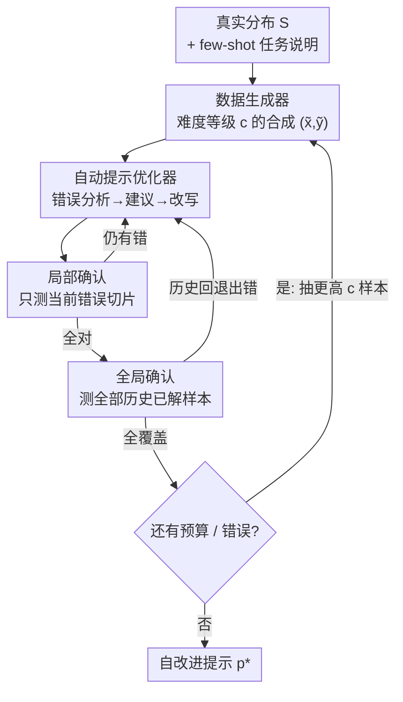

# SIPDO: Closed-Loop Prompt Optimization via Synthetic Data Feedback

**会议**: ICLR 2026  
**OpenReview**: [https://openreview.net/forum?id=kpT5rbbLdY](https://openreview.net/forum?id=kpT5rbbLdY)  
**领域**: LLM / NLP（提示优化）  
**关键词**: 提示优化, 合成数据, 闭环反馈, 课程学习, 难度梯度

## 一句话总结
SIPDO 把"造数据"变成提示优化的实时反馈信号：一个数据生成器不断造出难度递增、专戳当前提示弱点的合成样本，一个自动提示优化器据此逐轮诊断错误并改写提示，在不依赖外部标注的情况下让提示在多个推理基准上持续进步并超过主流提示调优方法。

## 研究背景与动机

**领域现状**：大模型对提示极其敏感，措辞、结构、格式上的微小改动都可能造成性能剧烈波动，因此自动提示工程（APE）成为把 LLM 落地到下游任务的核心环节。已有工作探索过手工调优、离散搜索、基于梯度的搜索、强化学习、进化算法，以及近年兴起的"LLM 作为反馈回路"的迭代改写（Self-Refine、Promptbreeder、TextGrad、REVOLVE、SPO 等）。

**现有痛点**：绝大多数方法都在一个**固定数据集**上优化提示，隐含假设输入分布是静态的。这样得到的提示"平均表现好"，但一旦遇到新的语言变体、边角样例或对抗性查询就会脆裂，甚至出现灾难性遗忘。换句话说，它们优化的是"在已见样本上不犯错"，而不是"面对没见过的输入还稳"。

**核心矛盾**：在监督学习里数据增强早就被用来提升鲁棒性，而 LLM 本身就能生成高质量合成数据——但现有提示优化方法没有以**动态、反馈驱动**的方式利用合成数据。光"造更多数据"没用：太简单的样本一眼解出、太离谱的样本又毫无信息量，真正需要的是**有目的、有压力**的数据，恰好踩在当前提示的失败模式上，并随优化进程逐步加压。

**本文目标**：把提示优化从"一次性的静态过程"改造成"动态自适应的学习闭环"，让提示能随输入分布演化而持续进化，且每个新场景只需极少监督（给个任务类型的大致说明即可，不用手写新提示）。

**切入角度**：既然 LLM 会造数据、又会改提示，那就让两者互相"逼"——生成器专门造让现提示出错的样本，优化器专门修这些错，形成对抗式的协同进化。

**核心 idea**：用"渐进难度的合成数据生成器 + 自动纠错的提示优化器"组成闭环，把数据增强变成提示优化的活反馈信号。

## 方法详解

### 整体框架
SIPDO 是一个**双智能体闭环系统**。记真实数据分布为 $S$，输入-标签对 $(x,y)\in\mathcal{X}\times\mathcal{Y}$，LLM 在提示 $p$ 下的输出函数为 $f(p,x)$，用有界代理损失 $L(f(p,x),y)\in[0,1]$ 衡量准确性。整个流程是：从 $S$ 出发，**数据生成器**在难度等级 $c$ 下造出一个合成问答对 $(\tilde{x},\tilde{y})$；**自动提示优化器**在这个样本上评估当前提示，经"错误分析 → 改进建议 → 定向改写"三个子模块输出修订提示；修订提示要先在当前错误上、再在所有历史已解样本上做双重确认——若还出错就回炉继续改，若通过就抽下一个（更高 $c$ 的）样本。如此循环，直到不再有错误或耗尽预算，最终产出一个自我改进过的提示 $p^*$。

### 关键设计

**1. 渐进难度的对抗式数据生成器：专造踩中弱点、逐级加压的合成样本**

这一设计直接回应"光造数据没用、要造有压力的数据"这个痛点。生成器先采一个目标标签 $\tilde{y}\sim p^*(y)$（**标签优先**采样，再据标签生成匹配的问题，保证标签有效性），并采一个刻画 few-shot 结构的隐变量 $z\sim g_\phi(z\mid S)$，由解码器在受控难度 $c$ 下产出 $\tilde{x}=q_\psi(z,\tilde{y},c)$。生成器参数 $\psi$ 通过一个**混合目标**学习，既要把样本造得让当前提示出错、又不能偏离真实标签分布：

$$\min_{\psi}\; R(\psi) + \lambda\, \mathbb{E}_{(\tilde{x},\tilde{y})\sim q_\psi}\big[L(f(p,\tilde{x}),y)\big],\quad R(\psi)=\mathrm{KL}\big(q_\psi(y)\,\|\,p^*(y)\big)$$

其中 KL 项像一道"税"，惩罚生成器为了制造高损失而乱造稀有标签离群点（$\lambda$ 越大税越重，对应论文里观察到的鲁棒性-准确率权衡）。关键创新在**难度课程**：难度参数 $c\in\{1,\dots,n\}$ 让同一个隐模板 $(z,y)$ 衍生出 $n$ 个难度对齐的变体；做课程生成时按 $c_1<\cdots<c_n$ 顺序采样，并把上一级样本经摘要器 $h_\phi$ 蒸馏成新的隐线索喂回生成器（$\tilde{x}^{(k)}=q_\psi(h_\phi(x^{(k-1)}),y,c_k)$），使语义深度逐级累积、难度单调增长，为提示提供一条"由易到难"的学习梯度。

**2. 三步纠错 + 双重确认的自动提示优化器：先修当前错、再保历史不退**

每来一个新合成样本，优化器都要"探测当前提示→定位弱点→修好再放下一个"。它对提示在集合 $A$ 上的得分定义为 $s_A(p)=\frac{1}{|A|}\sum_{(\tilde{x},\tilde{y})\in A}\mathbb{I}[f(p,\tilde{x})=\tilde{y}]$。具体走三步：**错误分析**先评估当前提示 $p^{(t)}$、收集错误切片 $E^{(t)}=\{(\tilde{x},\tilde{y})\in D: f(p^{(t)},\tilde{x})\neq\tilde{y}\}$，若为空说明已覆盖所有样本、直接终止返回；**改进建议**由反思模块 $R_\varphi$ 检视错误切片、当前提示及其输出，产出一段文本补丁 $\Delta^{(t)}$，说明为什么失败、该怎么改（澄清/修订指令、删掉干扰细节）；**定向改写**由编辑器 $U_\theta$ 把补丁应用到提示上得到修订版 $\tilde{p}^{(t)}$。

随后是两道确认闸门，这是它不同于一般迭代改写的地方：**局部确认**只在当前错误切片上测，若 $s_{E^{(t)}}(\tilde{p}^{(t)})<1$ 说明没修干净，就把修订版当新基线、回到建议步继续打补丁；通过后做**全局确认**，在迄今所有历史合成样本 $D_t$ 上重测，一旦发现历史样本被改退了，就把它们当新错误集送回去重修，直到 $E^{(t)}=\varnothing$ 才接受这次修订、抽下一个样本。这套"局部修好 + 全局不退"的机制专门防止"按下葫芦浮起瓢"——修了新错却破坏旧能力。

**3. 闭环耦合与收敛保证：让数据增强成为提示优化的活反馈信号**

前两个智能体不是各干各的，而是被一条反馈回路紧紧咬合：生成器造的样本难度随迭代 $t=c$ 递增，优化器把每次修好的提示作为下一轮被攻击的目标，二者对抗式协同进化。因为覆盖率得分 $s_D(p^{(t)})$ 单调不减且上界为 1，整个过程至多经 $M$ 次成功修正或用户设定的上限 $T_{\max}$ 就会停止，最终输出 $p^*=\arg\max_{0\le t\le T} s_D(p^{(t)})$，在预算内可达时实现完美覆盖（$s_{D_T}(p^*)=1$）。论文进一步给出理论保证（定理 3.1）：在标签保持、近似最大化、一致收敛等假设下，任意固定提示的总体最坏情况错误率被"经验风险 + 最难生成器的 KL 税 + $\varepsilon$ + 泛化项 $q(|\mathcal{P}|,n,\delta)$"上界——直观说就是只要提示经验损失低、且没有生成器能在不付高 KL 税的前提下抬高损失，再强的对抗生成器也无法让提示错得超过这个上界。

### 一个完整示例
以 BIG-Bench 的 Causal Judgment 任务为例：生成器在系统提示里被设定为"因果归因问答专家"，按指南造一对因果/非因果陈述题，并被告知总难度等级（如 10）与当前等级 $c$，同时把"过去已生成的带难度样本"一并喂入，要求难度随迭代单调增加且逻辑自洽。优化器在 $c=1$ 的样本上若答错，反思模块指出提示哪里含糊、编辑器据此改写；改写后先在这条错误上确认、再回测前面所有已解样本都不退，才进到 $c=2$ 的更难样本。如此从 $c=1$ 一路爬到 $c=10$（Penguins、Geometric Shapes 因推理复杂设到 $c=25$），错误清空或预算耗尽即得到最终提示。

### 损失函数 / 训练策略
生成器用式 (1) 的"KL 正则 + $\lambda$ 加权代理损失"混合目标；难度预算除 BIG-Bench 的 Penguins 与 Geometric Shapes 设 $c=25$ 外其余设 $c=10$，训练迭代数 $t=c$。温度策略上：数据生成用 0.5 保持连贯；提示优化的错误分析与改写步用 0.0 求确定性，而生成建议用 0.7 鼓励多样。MMLU 这类高难基准额外加**三票专家校验**——三个专家智能体独立核对每条生成样本的标签-输入一致性与基本事实正确性，全票通过才放行，以抑制幻觉。

## 实验关键数据

### 主实验
在 MMLU、BIG-Bench、ProofWriter/FOLIO/PrOntoQA 等推理基准上，SIPDO 用同一模型驱动所有合成与改写，对比 CoT、APE、PromptAgent、TextGrad、REVOLVE、Neuro-Symbolic、ANN 等。

| 基准 | 模型 | 指标 | SIPDO | 最强基线 | 对比 |
|------|------|------|-------|----------|------|
| MMLU College CS | GPT-4o | Acc | 93 | REVOLVE 90 | +3.0 |
| MMLU Machine Learning | GPT-4o | Acc | 93.8 | ANN 90.1 | +3.7 |
| BIG-Bench 平均 | GPT-4o-mini | Acc | 87.3 | PromptAgent 85.2 | +2.1 |
| FOLIO | GPT-4o | Acc | 83.2 | Neuro-S 79.2 | +4.0 |
| PrOntoQA | GPT-4o | Acc | 96.3 | CoT 95.6 | +0.7 |
| 逻辑推理三任务平均 | GPT-4o | Acc | 86.4 | Neuro-S 82.0 | +4.2 |
| 逻辑推理三任务平均 | GPT-4o-mini | Acc | 83.9 | Neuro-S 77.4 | +6.5 |

SIPDO 在 MMLU 三科全部最高，在 BIG-Bench 多数任务与模型上领先（GPT-4o 上 Geometric Shapes 略逊 PromptAgent 0.1%）；逻辑推理上 FOLIO、PrOntoQA 全胜，仅在 ProofWriter 上小幅落后 Neuro-Symbolic（GPT-4o 落后 2%、GPT-4o-mini 仅 0.4%）——但 Neuro-Symbolic 依赖预设规则数据集，而 SIPDO 完全靠生成的合成数据训练。

### 消融实验

| 配置 | 关键指标 | 说明 |
|------|---------|------|
| 完整 SIPDO（带难度梯度） | GPT-4o BIG-Bench 平均 Acc 基准 | 完整模型 |
| w/o 难度梯度 | GPT-4o 平均掉 17.3%，GPT-4o-mini 掉 24.3% | 去掉渐进难度课程 |
| w/o 难度梯度（最差子任务） | Object Counting 掉 40.9%/54.4% | 越需复杂推理的任务越依赖梯度 |
| One-Shot Extremes | 无可测增益 | 用"一次性造最极端样本"替代逐级加压 |

### 关键发现
- **难度梯度是核心增益来源**：去掉后 BIG-Bench 全子任务下滑，最陡的 Object Counting 在 GPT-4o-mini 上暴跌 54.4%；较弱的 GPT-4o-mini 比 GPT-4o 更依赖难度梯度（平均掉 24.3% vs 17.3%），说明渐进难度对弱模型尤其关键。
- **"一步到位造极端样本"行不通**：极端样本要么被秒解、要么只是原样本的轻微扰动，给不出新错误让优化器利用；作者推测它在金融报表等真实边角样本丰富的语料上才可能见效。
- **KL 系数 $\lambda$ 控制鲁棒性-准确率权衡**：$\lambda$ 越大最坏情况错误率越低，但可能牺牲准确率，与理论分析一致。

## 亮点与洞察
- **把数据增强变成"活的"反馈信号**：传统数据增强是离线扩样本，SIPDO 让生成器实时针对当前提示的失败模式造样本，数据与提示互相逼着进化——这是从"静态优化"到"自适应闭环"的范式转变。
- **局部 + 全局双重确认防退化**：很多迭代改写方法只盯当前样本，容易"修新错破旧能力"；SIPDO 强制每次修订都回测全部历史已解样本，把单调覆盖率作为收敛量，既给了停机保证又防灾难性遗忘。
- **难度课程 + 摘要回喂的设计可迁移**：用摘要器把上一级样本蒸馏成新隐线索、让难度语义逐级累积，这种"课程链"思路可迁移到任何需要逐步加压的合成数据场景（对抗训练、红队测试、自动出题）。
- **标签优先 + 三票校验保数据有效性**：先定标签再生成问题、外加专家投票核验，是用合成数据做严肃评测时控制幻觉的实用配方。

## 局限与展望
- **主要在合成推理任务上验证**："One-Shot Extremes" 失效也暗示当前合成套件缺乏真实边角样本；作者明确指出方法在金融报表、临床笔记等真实语料上的价值仍待检验。
- **理论假设偏理想**：标签保持（A1）、近似最大化器（A2）、一致收敛（A3）等假设在真实 LLM 生成器上未必严格成立，定理给的是上界而非可达保证。
- **成本与预算敏感**：难度预算 $c$、迭代上限 $T_{\max}$、三票校验都会成倍增加 LLM 调用；论文未充分讨论达到这些增益的 token/调用开销。
- **改进思路**：探索作者提出的"全自动变体"（让提示在持续模型反馈中演化），并在真实分布漂移的数据流上检验闭环是否仍稳。

## 相关工作与启发
- **vs TextGrad / REVOLVE**：它们把文本反馈或响应轨迹当作（高阶）梯度在固定数据上更新提示，SIPDO 则在优化回路里**主动造对抗样本**，把"优化什么数据"也纳入闭环——MMLU 上 SIPDO 93 vs REVOLVE 90 即体现这一差异。
- **vs PromptAgent / APE**：两者用蒙特卡洛搜索/MCTS 在已有数据上搜提示，依赖现成数据集；SIPDO 完全靠生成的渐进难度合成数据驱动，BIG-Bench 上多数设置领先。
- **vs Neuro-Symbolic**：后者把 LLM 输出转成结构化形式做规则推理，在 ProofWriter 上仍最强，但依赖预定义规则数据集；SIPDO 不靠规则、用合成数据就能在 FOLIO/PrOntoQA 上反超，泛化性更好。
- **vs Self-Refine / Promptbreeder / SPO**：这些是纯"输出反馈改提示"的迭代回路，SIPDO 的关键增量是把**数据合成**也变成回路的一环，并用难度课程提供"由易到难"的学习梯度。

## 评分
- 新颖性: ⭐⭐⭐⭐ 把数据增强从离线扩样升级为提示优化的实时对抗反馈，并配难度课程，角度新颖。
- 实验充分度: ⭐⭐⭐⭐ 覆盖 MMLU/BIG-Bench/逻辑推理三大类、四个模型，并有难度梯度与 One-Shot 两组消融；但缺成本分析、真实语料验证。
- 写作质量: ⭐⭐⭐ 方法与理论清晰，但部分符号（如 $R(\psi)$ 的 $\lambda^{-1}$ 缩放）与表述略有跳跃。
- 价值: ⭐⭐⭐⭐ 提供了"合成数据×提示优化互相强化"的可复用范式，对自动提示工程和合成评测都有借鉴意义。

<!-- RELATED:START -->

## 相关论文

- [\[ICLR 2026\] SPRIG: Improving Large Language Model Performance by System Prompt Optimization](sprig_improving_large_language_model_performance_by_system_prompt_optimization.md)
- [\[ACL 2025\] Evaluating Language Models as Synthetic Data Generators](../../ACL2025/llm_nlp/evaluating_lms_synthetic_data_gen.md)
- [\[ACL 2025\] Theorem Prover as a Judge for Synthetic Data Generation](../../ACL2025/llm_nlp/theorem_prover_as_a_judge_for_synthetic_data_generation.md)
- [\[ACL 2026\] Synthetic Eggs in Many Baskets: The Impact of Synthetic Data Diversity on LLM Fine-Tuning](../../ACL2026/llm_nlp/synthetic_eggs_in_many_baskets_the_impact_of_synthetic_data_diversity_on_llm_fin.md)
- [\[ICLR 2026\] Efficient Multi-objective Prompt Optimization via Pure-exploration Bandits](efficient_multi-objective_prompt_optimization_via_pure-exploration_bandits.md)

<!-- RELATED:END -->
