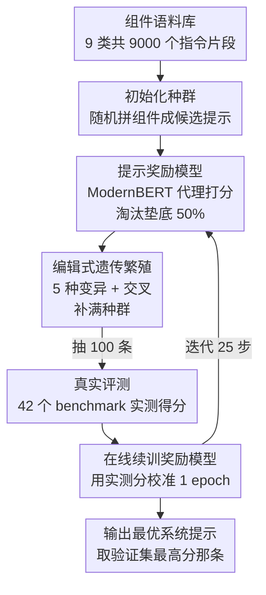

# SPRIG: Improving Large Language Model Performance by System Prompt Optimization

**会议**: ICLR 2026  
**OpenReview**: [https://openreview.net/forum?id=VdVV24KSWK](https://openreview.net/forum?id=VdVV24KSWK)  
**代码**: https://github.com/orange0629/prompting  
**领域**: NLP理解 / 提示优化  
**关键词**: 系统提示, 遗传算法, 提示优化, 奖励模型, 泛化

## 一句话总结
SPRIG 用一套"编辑式遗传算法 + 代理奖励模型"自动拼装出一条**任务无关的系统提示**，单条系统提示在 47 类任务上的平均提升就能和"为每个任务单独优化的任务提示"打平，二者叠加还能进一步刷新 SOTA，并且能跨模型家族、跨语言迁移。

## 研究背景与动机
**领域现状**：提示（prompt）的好坏对 LLM 输出质量影响巨大，因此"提示优化"成了热门方向。但绝大多数工作（GrIPS、APE、OPRO、当前 SOTA 的 ProTeGi）都在优化**任务提示**——即针对某个具体任务/benchmark 把指令调到最好。

**现有痛点**：任务提示天生不可泛化。每来一个新任务就得重新雕一条提示，随着任务数量爆炸，这种"一任务一提示"的工程量难以承受。另一类被广泛使用的**系统提示**（CoT 的"let's think step by step"、persona、风格、安全规则等通用前置指令）虽然被证明有用，但现有研究都是零散的、对场景细节高度敏感，没有一套系统化方法去构造一条"放之四海皆好用"的系统提示。

**核心矛盾**：系统提示的搜索空间和优化目标都和任务提示差异巨大——任务提示有明确的单任务监督信号，而系统提示要在几十类异质任务上同时表现好，现有任务级方法几乎无法迁移过来。同时，逐条系统提示在全部 benchmark 上实测一遍代价高到不可行。

**本文目标**：设计一个能在巨大设计空间里自动搜出"通用、可泛化"系统提示的优化器，并回答两个问题——系统提示优化和任务提示优化学到的是不是同一套策略？它能不能跨模型、跨语言、跨规模迁移？

**切入角度**：把"写系统提示"看成从一堆**可组合的指令片段（基因）**里挑选与排列的组合优化问题，用遗传算法做无梯度搜索；再训一个轻量代理模型来近似昂贵的真实评测，把搜索成本压下来。

**核心 idea**：用"组件语料 + 代理奖励模型 + 编辑式遗传算法"三件套，迭代地拼出一条对所有任务都好用的系统提示。

## 方法详解

### 整体框架
SPRIG（System Prompt Refinement for Increased Generalization）把系统提示优化变成一个遗传算法循环：每条候选提示是若干"组件"拼成的串，一代候选先被**代理奖励模型**快速打分、淘汰垫底的一半，剩下的通过**变异/交叉**繁殖出新种群；为了校准奖励模型，每代再抽一小批候选拿到真实 benchmark 上实测，用实测分数**在线续训**奖励模型，然后进入下一代。如此往复 25 步，取验证集上最优的那条作为最终系统提示。

整条流水线是"语料 → 初始化种群 → (打分淘汰 → 繁殖 → 抽样实测 → 续训奖励模型) 循环"的清晰串行+回环结构：

### 关键设计

**1. 组件语料库：把"写提示"变成可组合的基因池**

直接让模型从零生成提示文本（如 RLPrompt 那样的 token 级 RL）在 LLM 规模下扩展性差、还常生成语义不通的指令。SPRIG 改为从一个预先构建好的**组件语料库 $P$** 里挑片段组装，从而既保证每条提示语义连贯、又获得效率。一个"组件"被定义为**具有完整语义的最小提示单元**（通常是一句话，如"Let's think step by step"），天然可拼接且不破坏流畅度。语料构建是"人类专家 + 合成数据"两步走：先从已有文献收集 300 条人写系统提示，手工归为 9 类——good property、role、style、emotion、scenario、jailbreak、behavioral、Chain-of-Thought、safety；再用 GPT-4o 在每个类别下迭代扩写，最终得到 $9{,}000$ 个组件（每类 1000 个），构成遗传算法的"基因库"。

**2. 提示奖励模型：用轻量代理躲开"逐条全量评测"的天价开销**

在 47 个 benchmark 上把每条候选系统提示都实测一遍是不现实的，因此无法靠穷举打分来搜最优。SPRIG 借鉴 RLHF 里的奖励模型思路，**微调一个 ModernBERT** 作为代理来快速估计、排序任意系统提示的好坏。训练数据是：随机组合语料里的组件生成 $10{,}000$ 条提示（长度从重尾分布采样，覆盖 0–30 个组件的范围），再随机构造 $100{,}000$ 个提示对，配上它们的真实分数，用 **max-margin pairwise loss** 训练。最终该代理在未见过的提示上达到平均 Spearman 相关 0.59、NDCG@50% 为 0.72（随机基线为 0.00 / 0.48），足以稳定捕捉提示间的相对优劣，从而把"评估一条提示"的成本从跑几十个 benchmark 降到一次前向。

**3. 编辑式遗传算法 + 奖励模型在线校准：探索与精修的自适应交替**

有了基因库和代理打分器，SPRIG 用一个**无梯度的编辑式遗传循环**真正搜出好提示。每代从固定 population size 条提示出发（初代由 $P$ 初始化）：[Step 1] 先用奖励模型打分，淘汰垫底 50%；[Step 2] 在剩下的池子里，top 10% 的提示要么随机**变异**、要么与 top 50% 的提示**交叉**，变异有五种形式——Add（加一个 GPT-4o 建议的组件）、Rephrase（改写组件）、Swap（交换两个组件顺序）、Delete（删组件）、Merge（合并两个组件），交叉则取两条父代的随机子集组成后代（在引入变化的同时尽量保持父代长度），不断繁殖直到种群补满；[Step 3] 从新种群随机抽 100 条，在 42 个真实 benchmark 上实测拿到 ground-truth 分数；[Step 4] 用这批新分数加上部分历史数据，把奖励模型**续训一个 epoch**，再进入下一代。这个"代理快筛 + 真实抽检 + 奖励模型滚动校准"的闭环既避免了全量评测，又防止代理在迭代中失准。实验还发现算子使用是自适应的：早期偏好 add/crossover（探索），后期转向 refine/rephrase/swap（精修），呈现从广度探索到精细优化的自然过渡。

### 一个完整示例
以图 2 的一代演化为例：种群里有 `Prompt B'D`(0.84)、`Prompt DB`(0.82)、`Prompt ACA`(0.83)、`Prompt A`(0.73) 等候选。**Step 1** 奖励模型给所有候选打分，把 `Prompt A`(0.73)、`Prompt BCD`(0.78) 这类垫底的一半淘汰。**Step 2** 对存活的高分提示做变异/交叉：`Prompt ACA` 经 Delete 变成 `Prompt AC`，`Prompt DB` 与 `Prompt B'D` 交叉得到 `Prompt B'DA`，繁殖到种群补满。**Step 3** 从新种群抽 100 条拿到 42 个 benchmark 上实测，得到 `Prompt ACA`(0.86)、`Prompt DB`(0.79) 等真实分。**Step 4** 用这些真实分续训奖励模型一轮，下一代再用更准的奖励模型重新打分——如此 25 步后，`Prompt ACA` 这类稳定高分的组合胜出，成为最终系统提示。

## 实验关键数据

### 主实验
在 42 个 in-domain benchmark（7 大类：reasoning、math、social、commonsense、faithfulness、knowledge、language understanding）上，对 Llama3.1-8B / Mistral-Nemo / Qwen2.5-7B 三个中等规模模型评测，指标为多种子指标归一后取平均的 Average Score。对比的提示组合相对"Blank 系统提示 + Simple 任务提示"的提升如下：

| 配置 | 系统提示 | 任务提示 | 相对未优化的平均提升 |
|------|---------|---------|------|
| Unoptimized | Blank | Simple | 0（基线） |
| Base CoT | "let's think step by step" | Simple | 较小，明显弱于优化方法 |
| Task Optimized (ProTeGi) | Blank | ProTeGi 优化 | 较强 |
| **System Optimized (SPRIG)** | SPRIG 优化 | Simple | ∼10%，与 ProTeGi 基本打平 |
| **System+Task (SPRIG+ProTeGi)** | SPRIG 优化 | ProTeGi 优化 | 最高，超过所有现有方法 |

核心结论：**单条 SPRIG 系统提示** 较未优化版提升约 10%，显著超过 CoT 基线，虽略逊于 ProTeGi，但考虑到 SPRIG 对所有任务共用同一条提示、而 ProTeGi 为每个任务定制提示，这个小差距完全可接受；而**先 SPRIG 优系统、再 ProTeGi 优任务**的组合则超过两者各自，说明系统级优化触发了任务级方法忽略的能力。

### 消融 / 分析实验

| 分析维度 | 关键发现 |
|---------|---------|
| 组件构成演化 | CoT 与 Behavioral 组件随迭代快速增多、收敛到每条约 2–3 个；good property 约 1 个起辅助作用；Role 组件被选中概率远低于随机 |
| 系统 vs 任务互补性 | 两法都答对占 54%，仅一方答对占 28%（系统/任务大致各半），两法都答错仅 18% → 互补空间大 |
| 分领域增益 | math、reasoning 受益最大；knowledge、commonsense 增益最小；SPRIG 在 math/faithfulness/commonsense 上单独超过现有方法 |
| 跨模型迁移 | 系统/任务提示迁到同尺寸的另一模型，原模型上的大增益大多不保留 |
| 跨语言迁移 | 英文优化的系统提示在 5 个多语 benchmark 中 4 个显著提升，且超过 ProTeGi 直接在这些任务上的优化结果 |
| 跨规模迁移 | 系统或任务提示单独迁到 70B 级大模型均不显著；但 **System+Task 组合**带来 1.6% 提升，能泛化 |

### 关键发现
- **CoT 和 Behavioral 是主力组件**：高质量系统提示倾向于同时塞进多个"高层答题策略"组件（如"先分解""先复述再回答"），而非堆叠同一类型；组件的添加没有固定顺序，重要的是有效的**组合**而非次序。
- **knowledge 类任务几乎不受益**：作者推测此类任务更像在考"LLM 能否检索预训练里存的知识"（取决于预训练本身），而非"对知识做操作"，因此提示优化空间有限。
- **嵌入空间视角**：PCA 显示系统提示优化会把隐状态分布**整体移到新区域**（全局搜索更优行为空间），而任务提示优化只在局部小幅微调——这解释了二者的互补性，并提示"先用系统提示定位全局行为空间、再用任务提示在其中精修"的两阶段范式。

## 亮点与洞察
- **把提示工程转成"基因组合 + 代理评分"**：用语义完整的句子级组件当基因，既保证流畅度又压缩搜索空间；再用一个 ModernBERT 代理把"评估一条提示"从跑几十个 benchmark 降到一次前向，这套"代理快筛 + 真实抽检 + 在线校准"的闭环很值得复用到任何评测昂贵的搜索问题。
- **系统提示 vs 任务提示是互补而非冗余**：54/28/18 的答题重叠表 + PCA 的"全局迁移 vs 局部微调"双重证据，把"为什么二者叠加还能涨"讲得很有说服力，而不只是堆数字。
- **任务无关提示能跨语言迁移**：英文优化出来的系统提示直接用在多语 benchmark 上还能超过为该任务专门优化的 ProTeGi，说明系统级策略抓的是更底层、更通用的"答题姿势"。

## 局限与展望
- **跨模型迁移弱**：为某个模型优化的系统提示换到同尺寸的另一个模型，增益大多丢失，说明这些提示带有模型特异性，离"一条提示通吃所有模型"还很远。
- **跨规模单独迁移不显著**：系统或任务提示单独迁到更大模型都不显著，只有二者组合才有 1.6% 的小提升，提示大模型可能需要专门的提示策略。
- **代理奖励模型有上限**：Spearman 0.59 意味着代理排序并不完美，搜索质量受限于代理精度；作者靠在线续训缓解，但仍是潜在瓶颈。
- **计算与偏见成本**：作者在伦理声明中承认 SPRIG 计算开销大、碳足迹高，且 persona/role/behavioral 类组件可能放大语料中的偏见，需谨慎。

## 相关工作与启发
- **vs ProTeGi（任务级 SOTA）**：ProTeGi 用 LLM agent 总结每轮错误来精修**单任务**提示，对每个任务定制、不可泛化；SPRIG 优化的是**跨任务共享的系统提示**，单条就能与之打平，且二者叠加互补、跨语言更强。
- **vs CoT / persona 等手工系统提示**：以往系统提示是零散、对场景敏感的手工规则；SPRIG 把它们拆成可组合组件并用遗传算法系统化搜索，证明"多类高层策略组合"远胜单一 CoT。
- **vs GrIPS / RLPrompt 等 token 级编辑**：token 级编辑搜索空间受限、易生成不通顺指令；SPRIG 以句子级组件为单位，在保持流畅的同时扩大了可搜索的语义空间。

## 评分
- 新颖性: ⭐⭐⭐⭐ 首次系统化地把"系统提示"作为优化对象，组件基因 + 代理奖励模型 + 遗传算法的组合很完整。
- 实验充分度: ⭐⭐⭐⭐⭐ 47 类任务、三模型、跨语言/跨规模/跨模型多维泛化 + 组件演化与嵌入空间分析，覆盖面广。
- 写作质量: ⭐⭐⭐⭐ 逻辑清晰，互补性与嵌入空间分析尤其有说服力。
- 价值: ⭐⭐⭐⭐ 给"通用系统提示该怎么造"提供了可复用的方法论，工程意义明确。

<!-- RELATED:START -->

## 相关论文

- [\[ICLR 2026\] SIPDO: Closed-Loop Prompt Optimization via Synthetic Data Feedback](sipdo_closed-loop_prompt_optimization_via_synthetic_data_feedback.md)
- [\[NeurIPS 2025\] System Prompt Optimization with Meta-Learning](../../NeurIPS2025/llm_nlp/system_prompt_optimization_with_meta-learning.md)
- [\[ICLR 2026\] Prompt-MII: Meta-Learning Instruction Induction for LLMs](prompt-mii_meta-learning_instruction_induction_for_llms.md)
- [\[ICLR 2026\] Efficient Multi-objective Prompt Optimization via Pure-exploration Bandits](efficient_multi-objective_prompt_optimization_via_pure-exploration_bandits.md)
- [\[ICLR 2026\] Beyond Magic Words: Sharpness-Aware Prompt Evolving for Robust Large Language Models with TARE](beyond_magic_words_sharpness-aware_prompt_evolving_for_robust_large_language_mod.md)

<!-- RELATED:END -->
