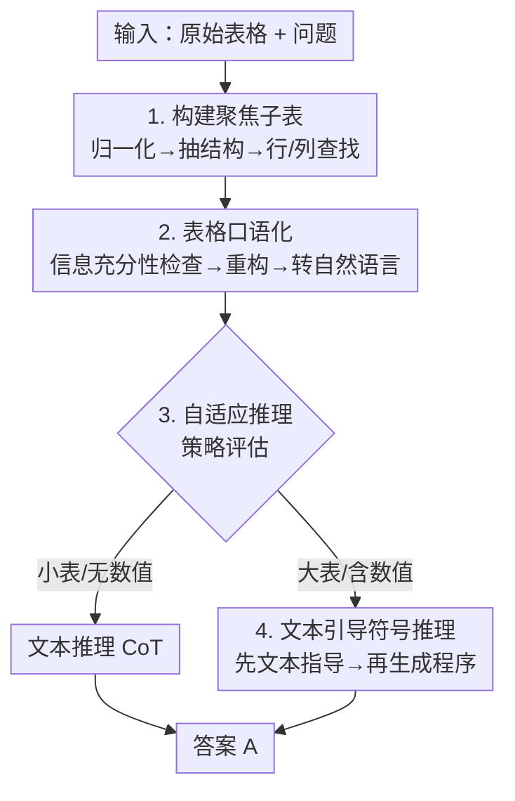

# TableMaster: A Recipe to Advance Table Understanding with Language Models

**会议**: ICLR 2026  
**OpenReview**: [https://openreview.net/forum?id=YyPZPrPjQD](https://openreview.net/forum?id=YyPZPrPjQD)  
**领域**: NLP理解 / 表格推理  
**关键词**: 表格理解, 聚焦子表, 表格口语化, 自适应推理, 符号推理

## 一句话总结
TableMaster 先把表格的"结构特征"系统拆成四类挑战，再针对性地给出"构建聚焦子表 + 口语化补语义 + 自适应在文本/符号推理间切换 + 文本引导符号推理"四味配方，串成一个无需微调的三阶段框架，在 WikiTQ 上用 GPT-4o-mini 把准确率从 64.73% 推到 78.13%。

## 研究背景与动机
**领域现状**：用语言模型（LM）做表格问答 / 表格事实核查时，主流的免微调路线有两条。一条是"抽子表"——像 Dater、Chain-of-Table 那样先从原表里裁出与问题相关的小表，缩短上下文好让 LM 看懂；另一条是"上程序"——像 Binder、LEVER 那样让 LM 生成 SQL/Python 来增强数值计算和定位能力。

**现有痛点**：这两条路各自只盯着表格理解的某一个侧面，方法之间相互孤立，缺一个把"表格到底为什么难"讲透、再系统性给方案的工作。结果就是换个更强的底座模型（如 gpt-4o-mini），很多老方法反而比 gpt-3.5-turbo 还差，因为它们过度依赖符号子表构建、没把文本链式推理的长处用上。

**核心矛盾**：表格本质是二维结构化数据，和 LM 预训练语料里的线性文本天然错位。作者把表格的四个特征——结构化（structured）、密集（intensive）、简洁（concise）、数值化（numerical）——逐一对应到四个会拖垮 LM 的具体毛病，而不是泛泛说"表格难"。

**本文目标**：先用实验把"表格难在哪"量化清楚，再为每个挑战配一个针对性解法，最后把这些解法整合成一个统一、可用于任意先进 LM 的免微调框架。

**切入角度**：作者的关键观察是——表格的难处不是单一的，是四个由不同特征引发的独立病灶，所以解法也得是组合拳，而非单点优化。四个挑战与解法一一对应：①数据密集 → 难定位目标数据 → 构建聚焦子表（Table-of-Focus）；②语义稀疏 → 表格语义缺失 → 表格口语化（Verbalization）；③数值密集 → 文本推理算不准 → 程序辅助推理（Symbolic）；④结构复杂+噪声 → 符号推理"语义僵化" → 表格归一化 + 文本引导的符号推理。

**核心 idea**：把表格理解拆成"结构理解 → 内容理解 → 推理"三阶段，每阶段塞进对应解药，并用一个自适应推理器按问题特性动态决定走文本还是符号路线。

## 方法详解

### 整体框架
TableMaster 是一个免微调的 prompting 框架，输入是一张原始表格 $T$ 和一个问题/陈述 $Q$，目标是预测答案 $A$，即学习一个 $F(T, Q) = A$。整条流水线分三阶段顺序推进：先把大而杂的原表收缩成只含相关信息的"聚焦子表"，再把这张子表补足语义、转成自然语言，最后由一个自适应推理器判断该用文本推理还是符号推理来出答案。

为提效，框架还用了一个"表格窥视（table peek）"小技巧：很多结构分析操作不必读全表，只取前 $k$ 行的窥视表 $T_{k\times n}$ 就够，既保留所有列又大幅压短上下文。

### 关键设计

**1. 构建聚焦子表（Table-of-Focus）：让 LM 只盯着该看的那几行几列**

针对的痛点是"数据密集 → 难定位目标数据"：表越大，LM 准确率越低（论文按行数、列数、面积、token 数四种尺度量化，结论一致下降），且容易出现长上下文幻觉、忽略中段信息。解法是显式裁出一张只含相关信息的子表。具体先对"野生表" $T_W$ 归一化——判断行主序还是列主序，列主序就转置 $T = \text{Transpose}(T')$，并清洗所有数值列统一日期/数字格式得到 $T_N$；再抽取顶部表头 $H$ 与作为行唯一标识的关键列；然后让 LM 做列查找 $C_0 = \text{Column Lookup}(T_N \mid Q)$（先把候选列按相关性 $C = \text{Rank}(H)$ 排序再选出 $b$ 列）和行查找 $R = \text{Row Lookup}(T_N \mid Q)$（让 LM 生成一条 SQL 来高效过滤相关行）。最后拼出初始聚焦子表 $T^F_{a\times b} = \text{Table Construction}(T_N, C_0, R)$。这样后续所有理解都在一张小表上进行，从源头消掉了"在大表里找不到目标"的问题。

**2. 表格口语化（Verbalization）：把简洁的单元格补成富语义自然语言**

针对"语义稀疏 → 表格语义缺失"：表格单元格多是孤立的词或短语，描述信息常散落在表头等结构里，单看一个 cell 很难懂，这和 LM 预训练时见惯的富语义文本完全不同。解法是把表先转成顺序自然语言描述 $T^T = \text{Verbalization}(T^F_{a\times b})$，类似 table2text，让数据更贴近 LM 的预训练分布。在口语化之前还有一道信息充分性检查与重构：先让 LM 判断当前聚焦子表 $T^F_{a\times b}$ 是否够答 $Q$，不够就从排好序的候选列里增量补列，直到信息足够或候选耗尽，从而弥补第一步裁表可能造成的信息丢失。论文实测口语化让弱模型涨约 1.5%，且描述质量越高收益越大。

**3. 自适应推理（Adaptive Reasoning）：按问题特性在文本与符号间动态择路**

针对的是文本推理和符号推理各有死穴：纯文本推理在不需计算的问题上很强（72.4%），但一旦要算数就暴跌 20.1%；而基础符号推理整体反而更差。与其固定走一条路，不如先做策略评估 $S = \text{Strategy Assessment}(T^F, T^T, Q)$，$S \in \{\mathcal{T}, \mathcal{S}\}$。规则很直观：小表或无数值的问题直接走文本推理（CoT）；大表或含数值的问题走符号推理（程序执行）。这正是消融里掉点最狠的一环——去掉文本推理 WikiTQ 掉 4.28%，说明把两种推理的长处按需调度是框架的命脉。

**4. 文本引导的符号推理（Text-guided Symbolic Reasoning）：先想清楚再写代码**

针对"结构复杂+噪声 → 符号推理语义僵化"：LM 生成程序时常常不是真理解上下文，而是套用预训练里记住的代码模板，碰上噪声表（噪声格式下符号推理掉 31.8%，比文本推理的 20.5% 更惨）就崩。解法分两手：一是前面已做的表格归一化（结构归一 + 列归一）让程序能批量处理；二是在真正生成程序前，先让 LM 做一遍文本推理产出"指导" $G$（不给最终答案），再把 $G$ 喂给符号推理去写程序，即
$$A = \begin{cases} \text{Chain-of-Thought}(T^F, T^T, Q), & S = \mathcal{T} \\ P(\text{Program-of-Thought}(T^F, T^T, Q \mid G)), & S = \mathcal{S} \end{cases}$$
其中 $P$ 是 Python/SQL 执行器。这一步类似 plan-and-solve，让模型"先充分思考再推理"，把计算题准确率从基础符号推理拉到 59.1%，缓解了符号推理只会硬套模板的毛病。

## 实验关键数据

### 主实验
三个数据集：WikiTQ（表格问答）、TabFact（事实核查）、FetaQA（自由形式问答）；WikiTQ/TabFact 用精确匹配准确率。TableMaster 在三种底座（gpt-3.5-turbo、gpt-4o-mini、Llama-3.1-70B）上全面领先。

| 数据集 | 底座 | TableMaster | 之前最佳 | 提升 |
|--------|------|-------------|----------|------|
| WikiTQ | gpt-3.5-turbo | 68.21 | 64.70 (TabSQLify) | +3.51 |
| WikiTQ | gpt-4o-mini | 78.13 | 64.73 (PoTable) | +13.40 |
| WikiTQ | Llama-3.1-70B | 77.95 | 65.56 (PoTable) | +12.39 |
| TabFact | gpt-3.5-turbo | 83.65 | 81.92 (Tree-of-Table) | +1.73 |
| TabFact | gpt-4o-mini | 90.12 | 88.93 (PoTable) | +1.19 |
| TabFact | Llama-3.1-70B | 91.16 | 87.06 (PoTable) | +4.10 |

值得注意的是 Binder、Dater、TabSQLify、Chain-of-Table 这些方法在 gpt-4o-mini 上反而拉胯（有时比 gpt-3.5-turbo 还差），因为它们重度依赖符号子表构建、没用上文本链式推理的长处——这恰好反证了 TableMaster 融合文本+符号策略的必要性。

### 消融实验
在 WikiTQ / TabFact（gpt-4o-mini，完整模型 78.13 / 90.12）上逐组件移除：

| 配置 | WikiTQ | 降幅 | 说明 |
|------|--------|------|------|
| Full model | 78.13 | – | 完整框架 |
| w/o Structure Extraction | 74.75 | −3.38 | 去掉结构抽取，后续步骤连锁出错 |
| w/o Row Lookup | 76.59 | −1.54 | 行查找比列查找更关键（表通常行多） |
| w/o Column Lookup | 77.00 | −1.13 | 列查找贡献略小 |
| w/o Table of Focus | 76.40 | −1.73 | 不裁聚焦子表 |
| w/o Re-Construction | 75.55 | −2.58 | 不做信息补全重构 |
| w/o Verbalization | 75.78 | −2.35 | 不补语义口语化 |
| w/o Textual Reasoning | 73.85 | −4.28 | 掉点最多 |
| w/o Symbolic Reasoning | 76.10 | −2.03 | 去掉程序推理 |
| w/o Textual Guidance | 75.21 | −2.92 | 符号推理失去文本指导 |

### 关键发现
- **推理阶段最关键**：去掉文本推理 WikiTQ 掉 4.28%、去掉文本指导掉 2.92%，说明"文本/符号自适应 + 先文本后符号"是框架的核心收益来源。
- **结构抽取是地基**：去掉它掉 3.38%，因为结构理解错了，后面查找和构建会连锁崩。
- **行查找 > 列查找**：去掉行查找掉 1.54%、列查找只掉 1.13%，因为大表行数远多于列数，定位行更难也更重要。
- **口语化对复杂任务收益更大**：WikiTQ 掉 2.35% 但 TabFact 几乎不掉，说明补语义在需要深度理解的问答上更值。

## 亮点与洞察
- **把"表格为什么难"做成可量化的诊断学**：四个特征 → 四个挑战 → 四个解法的一一对应表（Figure 1），不是事后凑动机，而是每条都有对照实验支撑，这种"先体检再开方"的叙事很有说服力。
- **自适应推理是便宜又有效的调度器**：不训练、只加一个策略评估 prompt，就把文本推理（擅长语义）和符号推理（擅长算数）的长处按问题特性拼起来，规避了"一条道走到黑"的结构性缺陷。
- **"先文本指导再写程序"可迁移**：让 LM 在生成代码前先用自然语言把思路想清楚再落地为程序，这套 plan-then-code 的范式不止表格，任何"LM 写代码解题"的场景（数学、数据分析 agent）都能借鉴。
- **聚焦子表的归一化细节很实用**：行/列主序判断 + 转置 + 数值列格式清洗，是处理真实"野生表"绕不开的脏活，论文把它显式写进流程而非假设输入干净。

## 局限与展望
- **方法重，调用次数多**：结构抽取、行/列查找、充分性检查、口语化、策略评估、文本指导、程序生成——一次问答要串多次 LM 调用，延迟和 token 成本都不低，论文未给出端到端开销对比。
- **强依赖 LM 自评能力**：充分性检查和策略评估都建立在"LM 能判断信息够不够 / 该走哪条路"的假设上，弱模型上这些判断本身可能不准，误差会沿流水线累积。
- **主要在 OpenAI 系 + Llama 验证**：评测集中在 WikiTQ/TabFact/FetaQA 这类相对规整的 benchmark，对超大表、多表关联、强噪声真实表的鲁棒性仍待考。
- **改进思路**：可探索把多次 LM 调用蒸馏/合并以降本，或对策略评估引入置信度回退机制，判断不准时退回到双路都跑再投票。

## 相关工作与启发
- **vs Dater / Chain-of-Table（抽子表派）**：它们也裁子表，但只解决"定位难"一个侧面；TableMaster 在聚焦子表之上再叠口语化补语义和自适应推理，是组合拳而非单点。
- **vs Binder / LEVER / PoTable（上程序派）**：它们重度依赖符号/程序，碰上需要语义灵活性的题就僵化，且换强底座反而退化；TableMaster 用"先文本指导再写程序"和"按需在文本/符号间切换"补上了符号推理的语义短板。
- **vs MIX-SC**：同样用了表格归一化和文本+程序的结合，但 MIX-SC 靠自一致性投票合并两路结果，TableMaster 则用策略评估显式择路，更省调用也更有针对性。

## 评分
- 新颖性: ⭐⭐⭐⭐ 单个组件多源自已有工作，但"四特征→四挑战→四解法"的系统化诊断与整合视角是真贡献
- 实验充分度: ⭐⭐⭐⭐⭐ 三数据集 × 三底座主实验 + 十组消融 + 大量挑战分析实验，证据链完整
- 写作质量: ⭐⭐⭐⭐⭐ "先体检后开方"的叙事清晰，图表与文字一一对应，易读
- 价值: ⭐⭐⭐⭐ 免微调、可套任意先进 LM，gpt-4o-mini 上 +13.4% 的提升对落地很实用

<!-- RELATED:START -->

## 相关论文

- [\[ACL 2025\] TableLoRA: Low-rank Adaptation on Table Structure Understanding for Large Language Models](../../ACL2025/llm_nlp/table_lora_structure_understanding.md)
- [\[ICLR 2026\] Transducing Language Models](transducing_language_models.md)
- [\[ICLR 2026\] Toward Safer Diffusion Language Models: Discovery and Mitigation of Priming Vulnerabilities](toward_safer_diffusion_language_models_discovery_and_mitigation_of_priming_vulne.md)
- [\[ICLR 2026\] The Lattice Representation Hypothesis of Large Language Models](the_lattice_representation_hypothesis_of_large_language_models.md)
- [\[ICLR 2026\] DreamOn: Diffusion Language Models For Code Infilling Beyond Fixed-size Canvas](dreamon_diffusion_language_models_for_code_infilling_beyond_fixed-size_canvas.md)

<!-- RELATED:END -->
