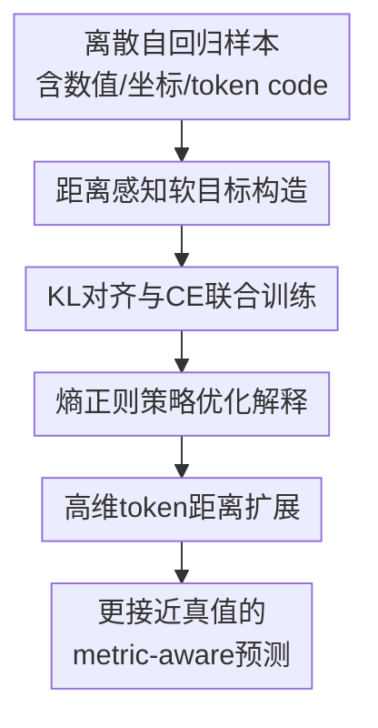

# Teaching Metric Distance to Discrete Autoregressive Language Models

**会议**: ICLR 2026  
**OpenReview**: [https://openreview.net/forum?id=s0zLtkY7iu](https://openreview.net/forum?id=s0zLtkY7iu)  
**代码**: 未见公开代码  
**领域**: LLM / NLP  
**关键词**: 距离感知监督、离散自回归模型、软目标分布、度量空间、DIST2Loss  

## 一句话总结

这篇论文提出 DIST2Loss，把数值、坐标、角度、VQ code 等 token 之间的度量距离转成距离加权的软目标分布，让离散自回归语言模型在保持 next-token 训练形式的同时学到“错得近比错得远好”的结构先验，并在视觉定位、机器人操作、奖励建模和图像生成中提升数据效率与下游表现。

## 研究背景与动机

**领域现状**：大语言模型的基础训练范式通常是离散 token 上的自回归预测。给定前文 token，模型输出词表上的 categorical distribution，再用交叉熵把概率压到真实 token 上。这个范式最初服务于自然语言，但现在已经被迁移到视觉、机器人、奖励建模、图像生成等任务：框坐标可以被写成数字 token，机械臂动作可以被写成位置和角度 token，图像也可以先经 VQ tokenizer 变成离散 code 序列。

**现有痛点**：一旦输出 token 带有数值或几何含义，普通 one-hot 监督就显得太粗糙。比如真实横坐标是 500，模型预测 499 和预测 102 在交叉熵里同样都是“非真实 token”；真实评分是 17，预测 16 和预测 3 也被同样视为错误。训练信号只告诉模型哪个 token 是对的，却不告诉它哪些 token 更接近、更可接受，因此浪费了任务本身已经给出的度量结构。

**核心矛盾**：离散自回归模型的输出接口是 categorical distribution，但很多下游任务的标签空间其实是带距离的 metric space。直接改模型结构会破坏 LLM/VLM 的通用训练栈；直接用 RL 或序列级 reward 又需要采样、rollout 和高方差估计。作者想解决的矛盾是：能否不改模型、不引入额外标注、不做复杂 RL，只在 loss 层把 token 间距离变成可学习的监督信号。

**本文目标**：论文把问题拆成三层。第一，给有度量意义的 token 子集定义距离函数，例如数字之间的平方距离、坐标之间的欧氏距离、VQ embedding 之间的 MSE 或 cosine distance。第二，把距离变成一个可归一化的软目标分布，让接近真值的 token 得到更高概率。第三，用一个仍兼容自回归语言模型训练的 KL loss，把模型输出拉向这个距离感知分布。

**切入角度**：作者的关键观察是，很多“离散输出”并不是真的无结构类别，而是连续空间或有序空间被 tokenizer 离散化后的结果。既然真实标签附近的 token 更合理，就可以把目标从 one-hot 改成以真值为中心、按距离指数衰减的分布。这相当于把回归问题的局部几何先验塞回 categorical training 中。

**核心 idea**：用预定义 token 距离构造 reward-weighted soft target，以 KL divergence 训练离散自回归模型，从而用一个 plug-and-play loss 替代 one-hot 监督在有度量输出上的信息浪费。

## 方法详解

### 整体框架

DIST2Loss 的输入仍然是普通的自回归训练样本：上下文 token、目标 token，以及模型在每个位置输出的 logits。不同之处在于，作者先识别出序列中哪些位置属于有度量意义的 token 子集 $V_d$，然后用任务定义的距离函数 $d$ 为每个目标 token 生成一个软目标分布 $p_d$，最后用 KL divergence 让模型概率分布靠近这个距离感知目标，同时保留原始交叉熵以维持精确 token 匹配。

这张图里的核心贡献节点和下面四个关键设计一一对应。前两个设计是实际训练流程：先从 metric 得到软目标，再和模型输出做 KL 对齐；后两个设计解释了这个 loss 为什么像一个无采样版本的 RL，并说明它怎样扩展到 VQ codebook 这类高维离散词表。

### 关键设计

**1. 距离感知软目标构造：把“错得近”显式写进目标分布**

标准交叉熵把真实 token 之外的所有候选都归为零概率，这对自然语言词表也许合理，但对坐标、分数、角度和量化 embedding 并不合理。DIST2Loss 先选出有度量意义的词表子集 $V_d$，再对每个目标位置 $t$ 比较候选 token $v$ 与真实组件 $x_t$ 的距离。距离越小，候选 token 在目标分布中得到的概率越高；距离越大，概率指数衰减。

核心公式是：

$$
p_d(v \mid x,t)=\frac{\exp(-d(v,x,t)/\tau)}{\sum_{v'\in V_d}\exp(-d(v',x,t)/\tau)}.
$$

这里 $\tau$ 控制分布平滑程度。小 $\tau$ 会让概率集中在真值附近，接近 one-hot；大 $\tau$ 会让更多邻近 token 分到概率。对数字 token，论文默认用平方欧氏距离并设置 $\tau=1$，它等价于一个离散化的单位方差 Gaussian。这样模型不仅知道“5 是真值”，还会知道“4 和 6 比 1 和 9 更像合理答案”。

**2. KL对齐与CE联合训练：不改模型结构，只改监督信号**

DIST2Loss 没有要求模型输出连续值，也没有改变 Transformer 或 tokenizer。模型仍然在整个词表上输出 $p_\theta(v\mid s_{<t})$，只是在有度量意义的位置额外把输出分布拉向 $p_d$。作者用 KL divergence 定义距离 loss：

$$
L_{dist}=\sum_{t=1}^{n}\sum_{v\in V_d}p_d(v\mid x,t)\log\frac{p_d(v\mid x,t)}{p_\theta(v\mid s_{<t})}.
$$

最终训练目标是 $L=L_{CE}+\alpha L_{dist}$，实验里固定 $\alpha=0.1$。这个组合很重要：$L_{CE}$ 继续保证模型把最高概率放在真实 token 上，$L_{dist}$ 则给所有邻近 token 一个有序的学习信号。相比只在 $V_d$ 上再做一次 one-hot CE 的 vocab baseline，DIST2Loss 的信息量更高，因为它不是简单提醒模型“这些是数字 token”，而是告诉模型数字之间、坐标之间、codebook embedding 之间的相对远近。

**3. 熵正则策略优化解释：用闭式软策略替代高方差RL**

作者把候选 token 看成 action，把距离的负值看成 reward：越接近真值，reward 越高。熵正则 policy optimization 的目标是最大化期望奖励加熵项，形式上是 $\mathbb{E}_{a\sim\pi}[R(a)]+\tau H(\pi)$。这个问题有闭式最优解 $\pi^*(a)\propto\exp(R(a)/\tau)$。如果令 $R(a)=-d(a,x,t)$，得到的正是 DIST2Loss 里的距离加权目标分布。

这个解释让 DIST2Loss 的位置很清楚：它保留了 reward alignment 的核心机制，却不用在线采样、rollout 或 policy gradient。只要每个 token 的 reward 能由已知 metric 独立算出，训练就可以退化成稳定的 supervised learning。它也说明了方法边界：如果输出 token 没有可解释距离，或者奖励必须依赖整段序列的全局组合，DIST2Loss 就不再天然适用。

**4. 高维token距离扩展：让VQ codebook也能带几何监督**

距离感知目标不只适用于一维数字。对图像生成中的 VQ token，词表里的每个 code 对应一个高维 embedding，两个 token 的相似性可以由 embedding 空间距离衡量。论文用 VQ 模型的 token embedding 计算 MSE 距离，也讨论了 cosine distance 的一般形式 $d(v(x),v(y))=1-\frac{v(x)\cdot v(y)}{\|v(x)\|\|v(y)\|}$。

这一点把 DIST2Loss 从“数字标签 smoothing”扩展成了更通用的离散表示学习目标。图像实验先通过替换中心 VQ token 观察到：近邻 token 往往保持语义，随机或远距离 token 会造成失真或语义漂移。因此，在训练自回归图像生成器时，把概率分给 codebook 中的语义近邻，能比 one-hot 更好地传达“这个位置需要的视觉语义是什么”。

### 一个完整示例

假设一个多模态模型要输出 referring expression 对应的边界框，答案被写成四个整数坐标 token，例如目标框是 $(120, 340, 500, 780)$。在普通 SFT 中，第一个坐标位置的 token 只有 `120` 是正类，`119`、`121`、`400` 都是负类。模型预测 `121` 和预测 `400` 得到的监督惩罚没有体现几何差别。

使用 DIST2Loss 时，第一个坐标位置会以 `120` 为中心构造分布。若距离函数取平方误差，`119` 和 `121` 的 $d$ 很小，会分到较高软概率；`100` 概率更低；`400` 几乎没有概率。训练时模型仍然通过 teacher forcing 看见真实序列，但它的输出分布会被鼓励成“围绕真实坐标的局部峰”，而不是在所有非真值 token 上一刀切。

这个例子也解释了论文在 hard-case IoU 分析里的现象：即使模型没有达到 IoU≥0.5 的正确判定，DIST2Loss 训练出的框也可能更接近真实框。它不只是提高分类式 accuracy，而是在错误样本里也改善了几何对齐。

### 损失函数 / 训练策略

训练时，DIST2Loss 只作用在有 metric 的输出 token 上；普通文本 token 仍主要由标准 CE 监督。论文强调，多个结构化元素出现在同一序列时，可以分别计算它们的距离 loss 再求和。对多 token 结构，作者采用逐位置分解而不是枚举所有候选序列，因为联合枚举会随长度指数增长。

默认超参比较克制。loss 权重 $\alpha$ 在主要实验中固定为 $0.1$，没有为每个任务精调；数字 token 的温度 $\tau=1$，VQ codebook 的 $\tau$ 通过熵匹配得到，论文报告 $K=16{,}384$ 的 codebook 对应 $\tau\approx9.7$。这种设置让方法更像一个可插拔训练目标，而不是依赖大量调参的任务专用技巧。

作者也讨论了多 token 距离的 credit assignment 问题。如果一个真实结构需要多个 token 共同表达，整体距离很难准确归因到某个位置。论文没有在主实验中强行做序列级 DIST2Loss，而是聚焦在 token 级 reward 能自然分解的场景，如整数、坐标、角度和连续 token embedding。附录中给出 contrastive target augmentation 和 place value weighting 作为折中方案。

## 实验关键数据

### 主实验

论文用五类任务验证同一个训练思想：toy 线性回归、视觉 grounding、机器人操作、生成式奖励建模和 VQ 图像生成。最能体现通用性的结果是，它不只在一个视觉任务上有效，也能在 LLM alignment 的 reward modeling 和图像 token 生成中带来收益。

| 任务 | Backbone / 设置 | 主要指标 | SFT 基线 | DIST2Loss | 结论 |
|------|-----------------|----------|----------|-----------|------|
| Visual grounding | Phi3V 在 RefCOCO 系列上微调 | RefCOCO test-A accuracy | 93.5 | 94.5 | 框坐标 token 加入距离监督后，定位更准 |
| Visual grounding | Phi3V 在 RefCOCO+ test-B | accuracy | 78.7 | 81.4 | 更困难 split 上提升 2.7 个点 |
| Robotic manipulation | LLaRA / VIMABench L2，1K 数据 | accuracy | 46.2 | 51.5 | 低数据动作学习提升明显 |
| Reward modeling | Llama-3.1-8B / RewardBench | average accuracy | 75.3 | 85.3 | 生成式评分 token 的距离结构很有用 |
| Image generation | LlamaGen-111M / ImageNet 50 epoch | FID ↓ / IS ↑ | 10.03 / 116.37 | 9.41 / 127.44 | VQ token 近邻监督改善早期训练 |
| Image generation | LlamaGen-343M / ImageNet 300 epoch | FID ↓ / IS ↑ | 3.08 / 256.07 | 3.04 / 258.19 | 大模型长训后仍有小幅收益 |

视觉 grounding 的完整表中，DIST2Loss 在 RefCOCO、RefCOCO+、RefCOCOg 多个 split 上都优于 Phi3V-sft；vocab baseline 则有升有降，说明“只强调数字词表”不等于“学到几何距离”。机器人实验也呈现类似趋势，尤其在 1K 数据规模下，L2 从 46.2 提到 51.5，说明 metric prior 在低数据下更有价值。

奖励建模是这篇论文比较有意思的跨域验证。模型被训练成用自然语言模板生成 0 到 20 的总体分数，以及 0 到 4 的五个细项分数。这里的 score token 天然有序，DIST2Loss 可以让 18 比 8 更接近 20。结果显示，Llama-dist 在 RewardBench 平均准确率达到 85.3，比 Llama-sft 高 10.0 个点，并且在 Chat Hard、Safety、Reasoning 上都有明显提升。

### 消融实验

| 配置 | MAE ↓ | RMSE ↓ | 说明 |
|------|-------|--------|------|
| Llama-dist | 0.092 | 0.124 | 完整 DIST2Loss，在 10 个训练问题的 meta linear regression 上最好 |
| - Place value weighting | 0.098 | 0.137 | 去掉位值权重后，多位数字的误差归因变弱 |
| - Contrastive loss | 0.099 | 0.139 | 去掉多 token 近邻负样本后，结构学习变差 |
| - Distance-aware target | 0.099 | 0.142 | 换成普通 label smoothing 后退化明显 |
| Llama-sft | 0.113 | 0.154 | 只用 one-hot CE，低数据泛化最弱 |

| 检查项 | 设置 | 结果 | 解读 |
|--------|------|------|------|
| Loss weight $\alpha$ | reward modeling sweep | $\alpha=0.1$ 得到 85.3 accuracy | 过小会接近 SFT，过大也会损害精确匹配 |
| 随机距离 | 用 random metric 替代 Euclidean | 76.0 vs SFT 75.3 | 没有语义的距离几乎不给收益 |
| 灾难性遗忘 | Reward model 测 MMLU | DIST2Loss 43.9，SFT 42.8 | 距离 loss 没明显破坏通用能力 |
| 视觉泛化 | RefCOCO 微调后测 RealWorldQA | 54.3 vs backbone 54.4 | grounding 微调后视觉理解基本保持 |
| Hard-case IoU | RefCOCO testA 错例 | DIST2Loss 40.3，SFT 31.0 | 即使预测错，框也更接近真值 |

### 关键发现

- DIST2Loss 的收益主要来自“距离语义”，不是来自额外约束词表。vocab baseline 在多个任务中不稳定，而 random metric 也无法带来有效提升，这两个对照一起证明：真正起作用的是有意义的 token 间距离。
- 低数据场景收益更明显。toy regression 和 VIMABench 1K 设置都显示，metric prior 可以在样本少时提供额外归纳偏置；数据变多后，SFT 可以从大量样本中慢慢补上部分结构，差距会缩小但不完全消失。
- 方法对不同输出空间都可迁移。坐标、动作角度、评分数字、VQ embedding 形式上差异很大，但只要能定义 token-level distance，就可以套用同一个 $p_d$ 构造和 KL 训练。
- 限制也很清楚：DIST2Loss 不适合无度量词表，或需要序列级整体 reward 才能评估的任务。它不是通用 RL 替代品，而是 metric reward 已知时的闭式监督化方案。

## 亮点与洞察

- 最巧妙的地方是把“回归式距离”转成 categorical soft target，而不是把 LLM 输出头改成连续回归头。这样做保留了现有自回归模型、tokenizer、teacher forcing、Trainer 基础设施，工程侵入性很低。
- 论文给 one-hot CE 的问题找到了一个很具体的切口：不是所有 token 类别都应被当成互斥无序标签。对于坐标和数字，one-hot 丢掉的不是小细节，而是任务本身最重要的几何信息。
- RL 解释很有启发。DIST2Loss 可以看作在已知 token reward 时直接写出 entropy-regularized optimal policy，再用 supervised KL 去蒸馏这个 policy。这让“为什么不用 PPO/DPO 类方法”有了清晰答案：当 reward 可闭式计算时，采样估计反而是不必要的。
- 高维 VQ token 的实验扩展了方法想象空间。很多 multimodal generation 都依赖离散 latent code，如果 codebook 的 embedding 空间有语义几何，那么生成模型训练时就不该把所有错误 code 一视同仁。
- 对 LLM 评分/奖励建模也很自然。生成式 reward model 输出的是分数 token，分数天然有序；DIST2Loss 让模型知道 19 和 20 的差距比 1 和 20 小得多，这比把评分当普通文本 token 更合理。

## 局限与展望

- 方法依赖预定义 metric 的语义正确性。随机距离实验已经说明，错误 metric 不会带来收益，甚至可能误导模型。对于自然语言词表、抽象概念标签或主观偏好类别，距离怎么定义并不显然。
- 当前主实验基本避开了真正复杂的序列级 credit assignment。边界框、评分、动作 token 可以逐位置处理，但如果一个结构的质量取决于多个 token 的组合关系，简单 per-token factorization 会丢掉全局约束。
- 论文使用固定 $\alpha=0.1$ 展示了鲁棒性，但不同任务中 CE 与 distance loss 的最佳平衡仍可能不同。尤其在高精度坐标预测和语义 code 生成之间，过平滑与过尖锐的风险并不一样。
- 实验覆盖面广但每个方向的深挖有限。例如图像生成只在 LlamaGen/VQ 设置中验证，机器人只到 VIMABench 的 L1/L2，后续可以看更复杂操作、时间序列预测、医学数值预测或检索 embedding 生成。
- 一个有价值的后续方向是学习 metric 本身。当前 DIST2Loss 假设距离由任务或 tokenizer 给定；如果能从数据中校准距离，或者结合人类偏好学习非欧式距离，它可能扩展到更多弱结构输出。

## 相关工作与启发

- **vs 标准 SFT / cross-entropy**: SFT 把每个输出 token 当成无序类别，本文在不改变自回归接口的情况下给有度量 token 加上邻域结构。优势是简单、稳定、兼容现有训练；劣势是只在 metric 有意义时成立。
- **vs label smoothing**: 普通 label smoothing 给所有非真值类别分配均匀小概率，DIST2Loss 按距离分配非均匀概率。两者都让目标不再 one-hot，但 DIST2Loss 的平滑方向来自任务几何，而不是无差别降置信度。
- **vs RLHF / policy optimization**: RL 方法可以处理复杂 reward，但需要采样和高方差优化。DIST2Loss 只处理已知 token-level reward，却能用闭式最优策略构造监督目标，因此更稳定、更便宜。
- **vs 知识蒸馏**: KD 用 teacher model 的分布当软标签，本文不用 teacher，也不需要额外推理；软标签完全由 ground truth 和 metric 决定。它更像“结构先验蒸馏”而不是模型到模型的知识转移。
- **vs ordinal / distance-aware classification loss**: 这些方法常针对固定任务标签空间设计，本文把思想搬到 LLM 词表与自回归训练中，强调输出空间可以是数字、坐标、动作或 VQ code，因此应用面更广。

## 评分

- 新颖性: ⭐⭐⭐⭐☆ 把距离感知软目标系统化地接入离散自回归 LLM/VLM 训练，想法不复杂但切中 one-hot 监督的真实盲点。
- 实验充分度: ⭐⭐⭐⭐☆ 任务覆盖非常广，含视觉、机器人、奖励建模和图像生成；不足是每个方向主要是代表性验证，统计重复和更大规模实验仍有限。
- 写作质量: ⭐⭐⭐⭐☆ 主线清楚，公式和 RL 解释能帮助理解；实验章节跨度大，部分实现细节需要读附录才能完全复现。
- 价值: ⭐⭐⭐⭐⭐ 这是一个低侵入、易迁移的训练目标，对任何把连续/有序对象 token 化后交给 LLM 生成的任务都有直接参考价值。

<!-- RELATED:START -->

## 相关论文

- [\[ACL 2025\] Comparing Linguistic Acceptability Judgments of Autoregressive Language Models](../../ACL2025/llm_nlp/comparing_linguistic_acceptability_judgments_of_autoregressive_language_models.md)
- [\[ACL 2025\] Language-Codec: Bridging Discrete Codec Representations and Speech Language Models](../../ACL2025/llm_nlp/language_codec_bridging_discrete_codec_speech_language_models.md)
- [\[ACL 2025\] Analyzing and Mitigating Inconsistency in Discrete Speech Tokens for Neural Codec Language Models](../../ACL2025/llm_nlp/analyzing_and_mitigating_inconsistency_in_discrete_speech_tokens_for_neural_code.md)
- [\[ACL 2025\] Detecting Referring Expressions in Visually Grounded Dialogue with Autoregressive Language Models](../../ACL2025/llm_nlp/detecting_referring_expressions_in_visually_grounded_dialogue_with_autoregressiv.md)
- [\[ICML 2025\] Generalized Interpolating Discrete Diffusion](../../ICML2025/llm_nlp/generalized_interpolating_discrete_diffusion.md)

<!-- RELATED:END -->
