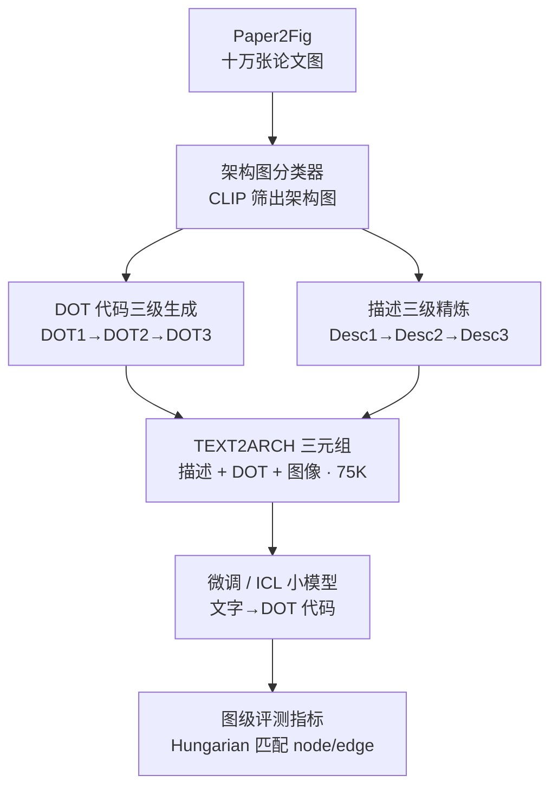

# TEXT2ARCH: A Dataset for Generating Scientific Architecture Diagrams from Natural Language Descriptions

**会议**: ICLR 2026  
**OpenReview**: [https://openreview.net/forum?id=dHWtOTiceO](https://openreview.net/forum?id=dHWtOTiceO)  
**代码**: https://github.com/shivank21/text2arch （含模型与数据集）  
**领域**: NLP理解 / 代码生成 / 多模态  
**关键词**: 文本生成图表、架构图、DOT 代码、数据集构建、图级评测指标

## 一句话总结
本文提出 TEXT2ARCH——一个含 7.5 万条「架构图图像 + 干净文本描述 + DOT 代码」三元组的大规模数据集，把「文字描述→科学架构图」这一未被充分探索的任务形式化为「文字→中间 DOT 代码→编译成图」，并基于该数据微调出一批 7B–8B 小模型，结果显著超过 DiagramAgent、与 GPT-4o 的上下文学习持平。

## 研究背景与动机
**领域现状**：把文字变成图，目前主流有两条路。一条是文生图 / 扩散模型（Stable Diffusion 等），擅长自然场景图像；另一条是「文字→中间图描述语言代码（TikZ / DOT）→编译器渲染」，常用于画简单图表。近期的 DiagramAgent 用多智能体框架，覆盖八类图、支持生成与编辑。

**现有痛点**：扩散模型在「结构化架构图」上几乎不可用——它的输入上下文窗口很短（CLIP 文本编码器只吃 77 个 token），无法读懂长描述，更无法表达显式的逻辑结构，常常生成文字乱码、连线错乱、且生成后几乎无法编辑微调。走代码这条路虽然可编辑，但现有方法在「语义丰富、层次清晰」的复杂图上同样吃力。更根本的是：**这个方向没有一个干净、大规模、开放获取的数据集**——已有的 ACL-Fig、Paper2Fig 混杂了各种图类型、标注不一致，且缺少专门针对「架构图」的、与图像严格对齐的文本描述。没有数据，自然也没有有效的开源模型。

**核心矛盾**：架构图生成需要严格的语义对齐、结构连贯和细粒度精确（哪些节点、哪些有向边），这和自然图像生成的「像不像」是两回事；而缺乏「文本↔代码↔图像」三者干净对齐的语料，使得既无法训练也无法严肃评测。

**本文目标**：把「文字→科学架构图」立成一个新任务，并补齐三块拼图——（1）一个干净大规模数据集；（2）一批可落地的开源模型；（3）一套能真正衡量「结构保真度」的评测体系。

**切入角度**：不直接生成像素图，而是让语言模型生成中间的 DOT 代码（由带标签节点 + 有向边构成），再交给标准 DOT 编译器渲染。这样既保留了结构与可编辑性，又把任务转化为语言模型擅长的「结构化代码生成」。

**核心 idea**：用一条多步自动化标注管线从 Paper2Fig 海量论文图中**筛出架构图、合成高质量 DOT 代码、精炼出干净描述**，造出 TEXT2ARCH 三元组数据集，再用它微调小模型；同时因为最终评测的是 DOT 代码而非像素，专门设计图级匹配指标来量化结构保真度。

## 方法详解

### 整体框架
TEXT2ARCH 的核心其实是「怎么造出干净三元组数据」，而不是某个新网络结构。整条工作分两段：**前段是数据集构建管线**（把 Paper2Fig 的十万张论文图，加工成「描述 Desc3 + DOT 代码 DOT3 + 图像」对齐三元组），**后段是基于该数据的建模与评测**（微调 / 上下文学习若干小模型，用文本指标 + 图级指标衡量生成的 DOT 代码质量）。

数据集构建管线有三个串行步骤：先训练一个「架构图 vs 非架构图」分类器，把 Paper2Fig 里的架构图筛出来；再对筛出的每张图，用「GPT 抽取 → 检测+OCR 重建 → GPT 融合精修」三级流程合成 DOT 代码（DOT1→DOT2→DOT3）；最后用「原文段落 + TF-IDF 检索 + GPT 改写」三级流程产出干净描述（Desc1→Desc2→Desc3）。两路精炼都遵循「先有粗版、再用结构信息纠偏、最后让 GPT 融合」的思路。

### 关键设计

**1. 架构图 vs 非架构图分类器：先从噪声海量图里把架构图捞干净**

整个数据来源是 Paper2Fig 这类论文图库，但里面混了大量曲线图、表格、流程图等非架构图，且没人专门标过「哪些是架构图」。本文先定义清楚「架构图」是什么——可视化系统/模型/流程的结构、组件与关系，包括神经网络结构、软件系统（微服务/数据库/API/数据管线）、论文里描述模型设计或实验流程的研究图。然后用三个来源拼出训练集：ACL-Fig 里挑 103 张神经网络 + 105 张架构图作正例、其余 1474 张作负例；SciFig 靠图注挑出 6482 张正例并随机采等量负例；Paper2Fig 人工标 2004 张（1239 正、765 负，其中 1003 张留作测试）。最终得到约 7929 张架构图 + 8918 张非架构图。在这之上训练 CLIP / ViT / BEiT / ResNet，最优是学习率 1e-5 的 CLIP，测试准确率 83.45%、召回高达 0.92（作者强调高召回是下游首要目标，宁可多收也别漏掉架构图）、F1 0.87。用它对整个 Paper2Fig 推理，得到约 8 万张候选架构图，作为后续两路精炼的素材。

**2. DOT 代码三级生成：用「检测重建」给「GPT 直出」纠结构错**

Paper2Fig 没有 DOT 代码标注，而八万张图手工标注不现实，所以本文设计了一条互补的三级合成流程。**DOT1** 直接把图喂给 GPT-4o 抽取 DOT 代码——好处是语义完整，坏处是 GPT 缺乏精确空间推理、节点连边经常错乱（表 3 中 DOT1 边 F1 只有 31.2）。**DOT2** 改走纯视觉：用基于 Faster-RCNN、在 350 张专利图上训的目标检测器抽节点/箭头/文字框，再用 Florence-2 OCR 读出节点文字，箭头方向按检测到的箭头朝向判定、并把箭头两端连到最近的节点（若最近节点已被占用则连到次近节点以避免自环）——节点与文字对齐好了，但边的连通性和整体连贯性很差（DOT2 边 F1 仅 8.3）。**DOT3** 则把 DOT2 + 原图一起喂给 GPT-4o 做融合精修：用 DOT2 的结构定位锚定组件、再借 GPT 的生成能力补全语义，得到既结构正确又语义连贯的代码（DOT3 在节点 F1 74.5、边 F1 51.7 上全面碾压 DOT1/DOT2）。这种「先各取所短、再融合互补」正是数据质量的关键，DOT3 最终作为训练与评测的 ground truth。顺带地，统计节点数还能把图按复杂度分桶：易（0–14 节点）、中（15–24）、难（25+）。

**3. 描述三级精炼：把论文里散落的相关段落聚成一段干净描述**

光有 DOT 代码还不够，作为模型输入需要一段「干净、信息完整」的文本描述。**Desc1** 直接取 Paper2Fig 自带的、图首次被引用处的那段论文文字。**Desc2** 做检索增强：从 PDF（pypdf 抽取）里找出所有提到该图（Figure/Fig./fig. 等各种写法）的段落作为候选，用 OCR 标签 + 图注的组合去算 TF-IDF 余弦相似度，保留 top-3 最相关段落，再与 Desc1 拼起来。**Desc3** 把当前图 + 这 top-3 段落一起喂给 GPT，让它产出一段改写后的完整描述。GPT 对比评测（并交换提示词位置以消除位置偏置）显示，Desc3 相比 Desc1 和 Desc2 都被偏好超过 90%。最终把「架构图子集 + DOT3 标签 + Desc3 描述」去掉空项、去掉被 GPT 判为非架构的图，得到 75127 条样本（训练 60519 / 验证 7565 / 测试 7043，按节点数分层切分；难度约 54.3% 易、32.4% 中、其余难），平均每图 15.24 节点、13.89 边、描述约 203 词；并另由作者人工标注 99 张图的 DOT 代码作为高质量测量集。

**4. 图级评测指标：因为最终比的是结构，不只是文本相似**

由于系统生成的是 DOT 代码、再编译成图，作者认为「评图像像不像」意义不大，真正要量化的是结构保真度。除了标准 NLG 指标（ROUGE-L、CodeBLEU、Levenshtein 编辑距离、chrF），本文专门设计图级指标：把预测图与真值图各自还原成图结构，**节点用标签字符串相似度、经匈牙利算法做最优匹配**后算 Node Precision/Recall/F1；改变匹配阈值得到 Node PR-AUC 以衡量在不同相似度门槛下的鲁棒性；在匹配上的节点之间评 Edge Precision/Recall、Edge PR-AUC 以及边集合的 Jaccard 相似度。这套指标让「节点抄对了但连线全错」这种失败无所遁形，比单纯文本相似度更贴合本任务。

## 实验关键数据

### 主实验
在 TEXT2ARCH 测试集与人工标注集上比较 DiagramAgent、GPT-4o 零样本、三个小模型的少样本 ICL 与微调版本（DiagramAgent 产出 TikZ，先用 GPT-4o 转成 DOT 再评）。微调后的 DeepSeek-7B 在文本与图级指标上整体最优。

| 集合 | 方法 | ROUGE-L | CodeBLEU | Node F1 | Edge F1 |
|------|------|---------|----------|---------|---------|
| 测试集 | DiagramAgent | 42.2 | 31.0 | 55.1 | 24.8 |
| 测试集 | GPT-4o 零样本 | 30.8 | 17.7 | 60.7 | 44.6 |
| 测试集 | Llama-3-8B（ICL） | 34.9 | 21.5 | 59.7 | 32.5 |
| 测试集 | **DeepSeek-7B（微调）** | **46.8** | **34.5** | **65.7** | 38.0 |
| 人工集 | DiagramAgent | 49.1 | 40.9 | 54.3 | 25.3 |
| 人工集 | GPT-4o 零样本 | 28.2 | 16.3 | 63.0 | 46.2 |
| 人工集 | **DeepSeek-7B（微调）** | **55.2** | **49.3** | **69.4** | **49.1** |

微调显著优于少样本 ICL 与 GPT：人工集上微调 DeepSeek-7B 的 ROUGE-L 55.2 / CodeBLEU 49.3，远超最好的 ICL（Llama-3-8B 37.3 / 23.1）和 GPT（28.2 / 16.3）；图级指标上它也拿下最高的节点/边 F1 与 PR-AUC。GPT-4o 在节点/边精度上偏高，但综合不及微调 DeepSeek-7B。

### 消融实验
DOT 三级生成的有效性（人工标注集，以 DOT3 为参照衡量各变体质量）：

| DOT 变体 | 来源 | Node F1 | Edge F1 | Jaccard |
|----------|------|---------|---------|---------|
| DOT1 | GPT 直接抽取 | 67.5 | 31.2 | 22.9 |
| DOT2 | 检测 + OCR 重建 | 54.6 | 8.3 | 5.1 |
| **DOT3** | DOT2 + 图 → GPT 融合 | **74.5** | **51.7** | **41.2** |

### 关键发现
- **DOT3 融合策略是数据质量的命门**：DOT1 节点语义还行但边乱（边 F1 31.2），DOT2 节点对齐好但边几乎全错（边 F1 仅 8.3），DOT3 融合后边 F1 跃到 51.7、Jaccard 41.2，验证了「检测结构 + GPT 生成」互补的必要性。
- **微调 > 少样本 ICL**：少样本 ICL 表现不稳定（Llama/Qwen 的 ICL 反而比微调好、DeepSeek 则相反），而微调 DeepSeek-7B 稳定领先，说明领域数据微调对结构化代码生成的价值。
- **GPT-4o 主观评测对齐客观指标**：GPT 打分（0–5）中 GPT-4o 2.72、DeepSeek-7B 2.68 双双超过 DiagramAgent 2.37 与 Qwen2 2.24、Llama-3 1.90，人评与自动指标一致。
- **Desc3 描述被偏好 >90%**：检索增强 + GPT 改写产出的描述质量明显优于原始单段落。

## 亮点与洞察
- **把「画图」转成「写代码」**：用 DOT 中间表示绕开扩散模型「短上下文 + 无法表达逻辑结构 + 不可编辑」三大硬伤，最终图还能被人类专家继续微调，工程上很实用。
- **三级互补合成是可复用的标注范式**：「弱模型直出粗版 → 用另一种模态（检测/OCR/检索）纠结构 → 强模型融合精修」这一套，对任何「缺标注但能用多源信号互补」的数据合成都能迁移。
- **图级匹配指标补上了文本指标的盲区**：用匈牙利算法做节点最优匹配、再在匹配节点上评边，让「节点对、连线错」这种结构失败可量化——这对一切「结构化输出」任务（代码、知识图谱、布局）都有借鉴意义。
- **小模型可达 GPT-4o 水平**：7B 微调模型在本任务上与 GPT-4o 持平甚至更好，说明垂直任务上数据 + 微调能抹平参数规模差距。

## 局限与展望
- **ground truth 本身是合成的**：DOT3 由 GPT 融合而来、Desc3 也是 GPT 改写，训练与评测都建立在「GPT 造的真值」上，可能继承 GPT 的系统性偏差；人工标注集只有 99 张，规模有限。
- **不评像素图**：作者明确说「评图像意义不大」，但实际下游用户看的是渲染出的图，DOT 正确不完全等于图好看/好读（布局、重叠、可读性未被衡量）。
- **DOT2 的几何启发式较脆**：箭头按最近节点连、用次近节点避自环，这类启发式在复杂/密集图上容易接错边，难图（25+ 节点）上误差可能被放大。
- **任务局限于有向图结构**：仅覆盖「带标签节点 + 有向边」的架构图，对含分组框、并排泳道、复杂排版的图表达力有限。

## 相关工作与启发
- **vs DiagramAgent**：DiagramAgent 用多智能体框架、覆盖八类图、文本-代码-图对齐较松散，产出 TikZ；本文专注科学架构图、走端到端单模型、三元组对齐干净、产出 DOT，并配套图级评测指标，更聚焦也更可量化，主实验上微调模型显著反超 DiagramAgent。
- **vs 扩散类文生图（Stable Diffusion 等）**：它们擅长自然图像但受限于短上下文、无法表达显式逻辑结构、不可编辑；本文用「文字→DOT 代码→渲染」彻底换路，换来结构保真与可编辑性。
- **vs 已有图表数据集（ACL-Fig / Paper2Fig / SciCap / Paper2Fig）**：这些数据集混杂多种图类型、标注不一、文本噪声大；本文在 Paper2Fig 之上用分类器过滤 + GPT 精炼，得到专注架构图、文本-代码-图严格对齐的高质量语料。

## 评分
- 新颖性: ⭐⭐⭐⭐ 把「文字→架构图」立为新任务并给出完整数据 + 评测体系，DOT 中间表示与图级指标是实打实的贡献，但单项技术（分类器/检测/GPT 精修/微调）多为已有组件组合。
- 实验充分度: ⭐⭐⭐⭐ 覆盖零样本/ICL/微调、文本+图级双指标、GPT 评测、DOT/Desc 变体消融、人工标注集，较全面；像素级/布局可读性评测缺位。
- 写作质量: ⭐⭐⭐⭐ 数据管线与指标讲解清晰，图 2 把三步管线交代得很直观。
- 价值: ⭐⭐⭐⭐ 75K 三元组数据 + 开源模型 + 图级指标填补了该方向空白，对软件文档、教育、企业架构可视化有直接落地潜力。

<!-- RELATED:START -->

## 相关论文

- [\[ICLR 2026\] VERIFY: A Novel Multi-Domain Dataset Grounding LTL in Contextual Natural Language via Provable Intermediate Logic](verify_a_novel_multi-domain_dataset_grounding_ltl_in_contextual_natural_language.md)
- [\[ACL 2025\] QualiSpeech: A Speech Quality Assessment Dataset with Natural Language Reasoning](../../ACL2025/llm_nlp/qualispeech_a_speech_quality_assessment_dataset_with_natural_language_reasoning_.md)
- [\[ICLR 2026\] Evaluating Text Creativity across Diverse Domains: A Dataset and Large Language Model Evaluator](evaluating_text_creativity_across_diverse_domains_a_dataset_and_large_language_m.md)
- [\[ACL 2026\] Identifying the Periodicity of Information in Natural Language](../../ACL2026/llm_nlp/identifying_the_periodicity_of_information_in_natural_language.md)
- [\[ACL 2026\] Repeated Sequences Reveal Gaps between Large Language Models and Natural Language](../../ACL2026/llm_nlp/repeated_sequences_reveal_gaps_between_large_language_models_and_natural_languag.md)

<!-- RELATED:END -->
