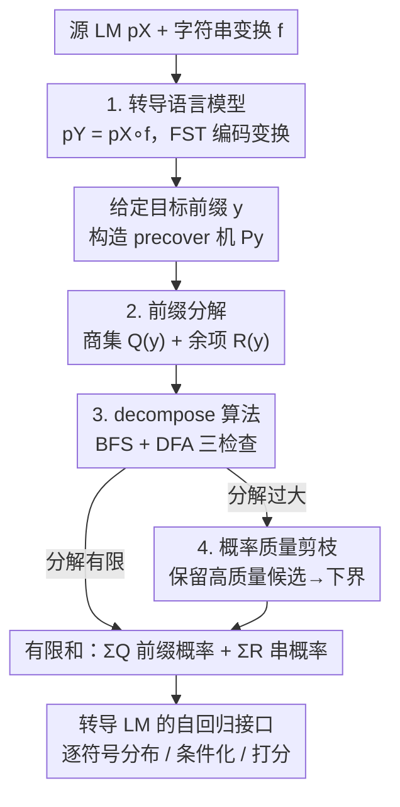

# Transducing Language Models

**会议**: ICLR 2026  
**OpenReview**: [https://openreview.net/forum?id=qOyF214xmg](https://openreview.net/forum?id=qOyF214xmg)  
**代码**: https://github.com/rycolab/transducing-language-models  
**领域**: NLP理解 / LLM效率  
**关键词**: 有限状态转录器, 字符串变换, 子词到字节, 前缀概率, 推理期适配

## 一句话总结
这篇论文把"对语言模型输出做确定性字符串变换"这件工程上的小事，正式抬升为一类全新的语言模型——用有限状态转录器（FST）编码变换、再与预训练 LM 组合，配上一套能在有限时间内对所有"映射到目标串的源串"求和的算法，从而**不改任何模型参数**就给变换后的模型补上自回归接口（逐符号下一符号分布、前缀概率、条件化），在"子词→字节""子词→词""DNA→氨基酸"三个场景上验证了推理期适配。

## 研究背景与动机
**领域现状**：现代语言模型本质上定义的是"字符串上的概率分布"。但它生成的是哪一种字符串，取决于训练时用的单元——主流 LLM 输出的是 BPE 子词串（Sennrich et al., 2016），DNA 模型输出的是核苷酸串。下游任务想要的单元往往是另一套：心理语言学和受控生成要字符/字节级，句法分析要 Penn Treebank 那样的"正字法词"，蛋白质应用要的是氨基酸序列。

**现有痛点**：工程上大家就是在生成管线后面随手接一个字符串变换（lowercase、子词拼字节、密码子翻译）。作者把这件事命名为 **string mismatch problem（字符串错配问题）**。问题在于：变换之后**采样依然简单**（采一个源串 $x\sim p_X$，套上 $f$ 就行），但其他操作全废了——你想算"某个变换后字符串 $y$ 的概率"，或者"在变换后的输出上做条件化"，都变得不可行。

**核心矛盾**：根源在于变换 $f$ 是**多对一**的。给定目标串 $y$，映射到它的源串集合（preimage）$f^{-1}(y)=\{x: f(x)=y\}$ 通常是指数级甚至无穷大。正确的语言模型变换必须把**所有**源串的概率都加起来：$p_Y(y)=\sum_{x\in f^{-1}(y)} p_X(x)$。Fig. 1 给了直观例子——能 lowercase 成 `hello` 的 BPE 子词串有一大堆（`HE|LL|O`、`hell|o`、`H|ello`……），每多一个输出符号，候选源前缀数量就翻倍。把一个串变换成另一个串很 trivial，把一个**分布**变换成另一个分布完全不 trivial。

**本文目标**：给"字符串变换后的语言模型"补齐自回归接口（增量下一符号分布 + 前缀概率），让它能像普通 LM 一样被任何现成系统调用——且不重训、不改参数。

**切入角度**：作者注意到这其实是概率论里的老把戏——对随机变量 $X\sim p$ 套一个函数 $f$，就得到一个诱导分布的新随机变量 $f(X)$。既然如此，就该把字符串变换当成语言建模管线里的**一等公民**来对待。而要让这套求和**可计算**，关键是给变换一个**有结构的表示**：有限状态转录器。FST 既足够强（能表达 lowercase、子词拼字节、带前瞻的 PTB 分词、密码子翻译），又足够 tractable（状态机结构能被算法显式利用）。

**核心 idea**：用 FST 编码字符串变换，把它和预训练 LM "组合"成 **transduced language model（转导语言模型）**；再借助 FST 的状态结构，把"对 preimage 求无穷和"分解成"商集前缀概率 + 余项概率"的有限计算，从而恢复自回归接口。

## 方法详解

### 整体框架
要给转导语言模型 $p_Y = p_X\circ f$ 补上自回归接口，核心是算出它的**前缀概率** $\overrightarrow{p_Y}(y)=\Pr_{X\sim p_X}[y\preceq f(X)]=\sum_{x\in P(y)} p_X(x)$，其中 $P(y)=\{x: y\preceq f(x)\}$ 叫 $y$ 的 **precover（前覆盖）**：所有"变换后会以 $y$ 打头"的源串。有了前缀概率，标准的 $\overrightarrow{p_Y}(y'\mid y)$ 条件分解就能逐符号左到右生成。难点是 $P(y)$ 一般无穷大，不能硬枚举。

整套方法是这样转的：把变换 $f$ 写成 FST，与源 LM 组合；给定目标前缀 $y$，由 FST 构造出一台只接受 $P(y)$ 的 **precover 自动机** $P_y$（NFA 经确定化、剪枝得到 DFA）；在这台机器上跑一个 BFS 分解算法 `decompose`，把无穷的 $P(y)$ 切成两块——一块"凡是以它打头的串全都在 $P(y)$ 里"的极大柱集（quotient/商集 $Q(y)$），一块零散的余项（remainder $R(y)$）；于是无穷和坍缩成有限和 $\overrightarrow{p_Y}(y)=\sum_{x\in Q(y)}\overrightarrow{p_X}(x)+\sum_{x\in R(y)}p_X(x)$，全部还原成对源 LM 的若干次前缀概率/串概率查询。当分解仍然过大（如 DNA 那种指数膨胀），再用按概率质量剪枝得到下界近似。

### 关键设计

**1. 转导语言模型：把字符串变换变成一等的语言模型**

针对"工程上随手接一个变换、却没人把它当真正的 LM 来对待"这个痛点，作者给出形式化定义：源 LM $X\sim p_X$ 套上变换 $f$ 后，$f(X)$ 的概率质量函数是 $p_Y(y)=\Pr_{X\sim p_X}[y=f(X)]=\sum_{x\in f^{-1}(y)} p_X(x)$。关键观察是：直接照这个式子算 $p_Y(y)$ 不可行（preimage 太大），但**采样反而平凡**（采 $x\sim p_X$ 再套 $f$）。真正卡住实用化的是另外两件事——给变换后的串打分、在变换后的输出上条件化，二者都依赖前缀概率 $\overrightarrow{p_Y}(y)=\sum_{x\in P(y)}p_X(x)$。

之所以选 FST 来编码 $f$，是因为它把"哪些源串映射到以 $y$ 打头的输出"这件事变成了一条条带输入/输出标签的状态转移路径——这种显式结构正是后面分解算法能"顺着机器走、在有限步内判定"的前提。换句话说，FST 不只是表示变换的工具，它直接决定了求和能不能被算法利用：lowercase、子词拼字节、PTB 分词、DNA 密码子翻译这些例子都落在 FST 可表达的关系族里。

**2. 前缀分解：用"商集 + 余项"把无穷和切成有限和**

$P(y)$ 一般是无穷集，但它有结构可挖。作者定义 $C(y)=\{x:\langle x\rangle\subseteq P(y)\}$ 为 $P(y)$ 里**最大的那个柱集**——只要源串 $x$ 落进 $C(y)$，它的所有延伸串也都覆盖 $y$，于是这一整个柱 $\langle x\rangle$ 的概率可以用源 LM 的**一次前缀概率** $\overrightarrow{p_X}(x)$ 一把算掉，不必逐串枚举。由此把 precover 拆成两块：商集 $Q(y)=\mathrm{pf}(C(y))$（取每个柱最短的那个代表元、且彼此无前缀关系），余项 $R(y)=P(y)\setminus C(y)$（剩下那些"自己覆盖 $y$、但延伸出去不再覆盖"的零散串）。这对分解满足三个性质：$Q(y)$ 前缀无关、$P(y)=\langle Q(y)\rangle\sqcup R(y)$（有效性）、$\langle Q(y)\rangle=C(y)$（极大性）。

它的回报是那条计算捷径：

$$\overrightarrow{p_Y}(y)=\sum_{x\in P(y)}p_X(x)=\sum_{x\in Q(y)}\overrightarrow{p_X}(x)+\sum_{x\in R(y)}p_X(x)$$

只要 $Q(y)$、$R(y)$ 有限，无穷和就变成对源 LM 的有限次查询。Example 1（lowercase 到 `ab`）里余项为空、商集就 4 个元素；Example 2（newspeak 把 `bad`→`ungood`）里 `bad` 落在柱 $\langle ba\rangle$ 内却不在 $P(ba)$ 里，于是必须把它从柱里挖掉，这正是"余项"存在的理由。作者进一步给出有限性的充分条件（§6）：严格前缀单调保证空余项 + 有界商集（这是 Vieira et al. 2025a 处理的子词→字节情形）；放宽到前缀单调可支持多符号前瞻（如 DNA 需两符号前瞻）；再用转录器层面的 **safety** 条件（IP-universal / 有限闭包 / 后继全 safe）覆盖非前缀单调但仍可有限分解的情形。

**3. decompose 算法：在 precover DFA 上用 BFS + 三种状态检查求分解**

有了分解的定义，还得有算法把 $Q(y)$、$R(y)$ 真的找出来。作者把变换 FST 与"接受所有以 $y$ 打头输出"的拷贝机组合、投影到输入侧，得到一台只接受 $P(y)$ 的 NFA，再**确定化 + trim** 成 DFA $P_y$；这样扫一个源串 $x$ 就唯一落到某个状态 $\mathrm{run}_y(x)$，所有判断都退化成状态属性。`decompose`（Fig. 2）以 BFS 最短优先地枚举候选源串，每个串过三道检查（Fig. 3）：**Cylinder**——$\langle x\rangle\subseteq P(y)$ 吗？等价于 $x$ 落到的状态是否"universal"（从该状态出发任何延伸都被接受），是则收进 $Q$ 且不再往下探（一整柱搞定）；**Member**——$x$ 自己在 $P(y)$ 里吗？等价于该状态是否接受态，是则收进 $R$ 但继续探它的延伸；**Live**——$x$ 还有没有延伸落在 $P(y)$ 里？trim 之后等价于状态非空，只有 live 的延伸才入队。最短优先保证一旦某前缀进了商集，它的延伸根本不会再入队，于是 $Q$ 自动前缀无关。

直接做这套会因"急切确定化大转录器"而炸，所以作者堆了一串工程优化（§C）：**惰性确定化**用 frontier（扫过源前缀后可达的转录器状态集 + 已输出缓冲）边走边做子集构造，避免预先把 DFA 建出来；**增量下一符号分解** `decompose_next` 在一趟 BFS 里同时把所有 $y'\in Y$ 的延伸分解从 $y$ 的分解推出来；外加 non-cylinder monotonicity、cylinder uniqueness、all-universal 快路径等结构性捷径跳过冗余检查，以及标准的 **label pushing**（把输出标签尽量前推，让 cylinder 检查更早成功）。

**4. 概率质量剪枝：分解爆炸时退而求其下界近似**

当 $P(y)$ 的分解太大（典型是 DNA→氨基酸，候选随序列长度指数膨胀），把它全部枚举打分就不现实了。作者的 `prune` 策略是：按前缀概率给候选排序，砍掉累计概率质量低于阈值 $\tau$ 的那部分尾巴。由于剪枝只是从队列里**删**候选、从不加错，找到的每个元素都仍正确（$\langle Q\rangle\sqcup R\subseteq P(y)$），代价是覆盖不全、分解不再 valid——因此算出来的前缀概率是真值的一个**下界**。这恰好把"精确但可能无穷"和"高效但有偏"接成一根可调旋钮：$\tau$ 越小越接近精确、JSD 越低，但吞吐越慢。实验正是用这条旋钮在精度/速度之间扫描，并发现一个实用的近似就足以在远低于精确算法的成本下拿到很好的估计。

### 一个完整示例
以 Example 2 的 newspeak 规则 `bad`→`ungood`、目标前缀 $y=\texttt{ba}$ 走一遍：朴素地看 $\overrightarrow{p_Y}(\texttt{ba})$ 要对所有"变换后以 `ba` 打头"的源串求和。柱 $\langle ba\rangle$ 里几乎所有串都满足，唯独 `bad` 例外——它会被改写成 `ungood`，根本不以 `ba` 打头，所以必须从柱里挖掉。`decompose` 于是给出 $P(\texttt{ba})=\langle ba\cdot(X\setminus\{d\})\rangle\sqcup\{ba\}$：商集那一大柱用一次前缀概率算掉 $\sum_{x\neq d}\overrightarrow{p_X}(bax)$，余项就单个串 `ba` 贡献 $p_X(\texttt{ba})$，合起来 $\overrightarrow{p_Y}(\texttt{ba})=p_X(\texttt{ba})+\sum_{x\in X\setminus\{d\}}\overrightarrow{p_X}(bax)$。一个本来要对无穷源串求和的量，被切成"一柱 + 一串"两项有限计算——这就是商集/余项分解在干的事。

## 实验关键数据

### 主实验
作者在三个变换场景上做实验，统一指标是近似分布与参考分布之间的 **Jensen–Shannon 散度（JSD）** 以及吞吐量（bytes/sec），通过扫描剪枝阈值 $\tau$ 画出"精度–速度"权衡曲线；另报交叉熵损失（反映对具体序列打分的成本）。源模型用 GPT-2 Large、LLaMA 3.2-1B、LLaMA 3.1-8B、Phi-4（14B）以及一个在人类基因组上训练的 DNA 模型。三个场景正好铺满前缀单调谱系。

| 变换场景 | 单调性 | 变换/数据 | 结果概述 |
|--------|------|------|------|
| 子词→字节 (T2B) | 严格前缀单调 | FST $f_\alpha$，$O(\|X\|)$ 状态；wikitext-2 前 10 段（7684 字节） | $\tau$ 越小 JSD 越低、吞吐越低；JSD 与 Vieira et al. 2025a 相当（参考 $\tau$=1e-5） |
| 子词→正字法词 (PTB) | 非前缀单调 | $p_X\circ f_\alpha\circ f_{ptb}$，FST 编码 PTB 分词器 | 同样"低阈值低 JSD、低吞吐"（参考 $\tau$=1e-4，Phi-4 为 3e-4） |
| DNA→氨基酸 | 前缀单调（两符号前瞻） | $f_{dna2aa}$，$X$=4 核苷酸 → $Y$=22 氨基酸；65 条人类蛋白 | 候选随序列长度指数膨胀，需对候选集设上限，扫描 cap 看 JSD/吞吐 |

### 消融实验
论文没有传统意义的"去模块"消融，而是把**剪枝阈值 $\tau$** 当成核心可调旋钮做敏感性分析——它直接刻画了"近似 vs 精确"的代价。

| 配置 | 关键现象 | 说明 |
|------|---------|------|
| $\tau\to$ 小（趋近精确） | JSD↓，吞吐↓ | 保留更多分解元素，逼近真分布，但成本高 |
| $\tau\to$ 大（激进近似） | JSD↑，吞吐↑ | 砍掉低质量候选，便宜但偏差大（恒为下界） |
| 最紧阈值下 | 部分模型跑不完所有段落 | 分解尺寸过大导致超出预算（§G.2） |
| T2B vs Vieira et al. 2025a | 后者吞吐更高、精度相当 | 其专用 trie 算法仅限严格前缀单调；本文以通用性换部分速度 |

### 关键发现
- **一个实用的剪枝近似就够用**：在远低于精确算法的成本下即可拿到很好的概率估计，这是全文最实用的结论。
- **通用性 vs 专用速度的取舍**：在 T2B 这个最简单场景上，Vieira et al. 2025a 的 trie 专用算法吞吐更高，但只能处理严格前缀单调变换；本文框架覆盖整个前缀单调谱系（含非单调的 PTB），代价是部分场景吞吐略逊。
- **DNA→氨基酸最难**：分解的候选数随序列长度指数增长，必须靠候选集上限 + 剪枝压制组合爆炸，是检验近似策略上限的压力测试。

## 亮点与洞察
- **把"随机变量套函数得诱导分布"这条概率论常识，认真落到语言模型上**：表面平平无奇，但作者真正把它做成了带自回归接口的一等公民——难点不在"采样"而在"打分/条件化"，识别出这个错位本身就很有洞察力。
- **商集/余项分解是真正的技术内核**：把"对无穷 preimage 求和"翻译成"找最大柱集 + 零散余项"，让一整柱用源 LM 一次前缀概率查询搞定，是把无穷变有限的关键一招，且能严格证明最优性。
- **FST 既是表示也是算法引擎**：选择有限状态转录器不是随便挑的——正是它的状态结构让 cylinder/member/live 三检查退化成 DFA 状态属性，把抽象的集合判断变成可执行的 BFS。
- **可迁移的思路**：任何"对生成式模型输出做确定性后处理、又想算变换后概率/做条件化"的场景（受控生成、格式约束、单位转换）都能套这套框架——只要变换能写成 FST，就能在推理期把已有模型适配到新单元，零重训。

## 局限与展望
- **吞吐是主要瓶颈**：精确计算依赖分解有限，而很多有用变换（如 PTB 的 $f_{ptb}$）商集就是无穷的，只能靠剪枝近似；最紧阈值下大模型甚至跑不完全部测试段落，说明大词表/长序列场景的可扩展性仍受限。
- **近似只给下界、无显式误差控制**：剪枝得到的前缀概率恒为真值下界，但论文用 JSD 事后衡量偏差，缺少对单次估计的可证误差界——下游若依赖精确条件概率需谨慎。
- **变换必须可表示为 FST**：框架的表达力被 FST 关系族框死，需要更强上下文/无界记忆的变换（超出有限状态）无法直接套用；作者也把这类扩展留给"未来从有限状态方法的进展中获益"。
- **DNA 场景的指数膨胀**：候选集随长度指数增长、只能靠人为 cap，提示这套近似在"一对多极度发散"的变换上会快速逼近可用边界。

## 相关工作与启发
- **vs Vieira et al. (2025a)**：他们处理**严格前缀单调**变换（子词→字节），用专用 trie 算法，吞吐高但适用面窄。本文是其严格推广——放宽到前缀单调以支持多符号前瞻，并引入"余项"以处理**非前缀单调**变换（如 PTB 分词），代价是通用框架在最简单场景上吞吐略低于专用实现。
- **vs 子词→字节概率估计系列（Phan et al. 2024; Hayase et al. 2025）**：这些工作针对"从子词模型估计字节级概率"这一**特定**子问题；本文把它们统一进"任意 FST 可编码变换"的一般框架，子词→字节只是其中一个特例。
- **vs 受控生成 / 自动机约束解码（Lew et al. 2023; Cognetta et al. 2025 等）**：同样用有限状态机器约束 LM 输出，但那条线侧重"约束生成空间"，本文侧重"对变换后的输出分布做正确的概率计算与条件化"，两者可互补——前者管能生成什么，后者管变换后概率怎么算对。

## 评分
- 新颖性: ⭐⭐⭐⭐⭐ 把字符串变换抬升为带自回归接口的一等语言模型，并给出商集/余项分解这一干净的理论内核
- 实验充分度: ⭐⭐⭐⭐ 三场景铺满单调性谱系、多模型验证，但偏 proof-of-concept，缺少下游任务端到端收益
- 写作质量: ⭐⭐⭐⭐⭐ 形式化严谨、例子（lowercase / newspeak / DNA）层层递进，定理与证明完整
- 价值: ⭐⭐⭐⭐ 为"推理期把已有 LM 适配到任意单元、零重训"提供了通用且有理论保证的工具，吞吐是落地主要约束

<!-- RELATED:START -->

## 相关论文

- [\[ICLR 2026\] TableMaster: A Recipe to Advance Table Understanding with Language Models](tablemaster_a_recipe_to_advance_table_understanding_with_language_models.md)
- [\[ICLR 2026\] Neural Synchrony Between Socially Interacting Language Models](neural_synchrony_between_socially_interacting_language_models.md)
- [\[ICLR 2026\] Toward Safer Diffusion Language Models: Discovery and Mitigation of Priming Vulnerabilities](toward_safer_diffusion_language_models_discovery_and_mitigation_of_priming_vulne.md)
- [\[ICLR 2026\] PT2-LLM: Post-Training Ternarization for Large Language Models](pt2-llm_post-training_ternarization_for_large_language_models.md)
- [\[ICLR 2026\] Massive Editing for Large Language Models Based on Dynamic Weight Generation](massive_editing_for_large_language_models_based_on_dynamic_weight_generation.md)

<!-- RELATED:END -->
