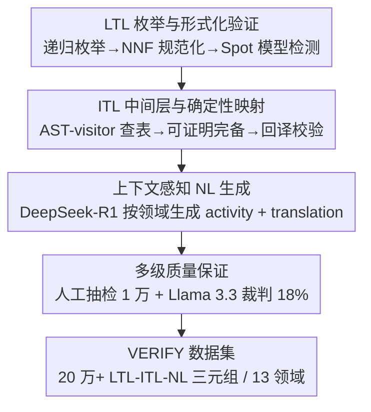

# VERIFY: A Novel Multi-Domain Dataset Grounding LTL in Contextual Natural Language via Provable Intermediate Logic

**会议**: ICLR 2026  
**OpenReview**: [https://openreview.net/forum?id=NChBLvOr7I](https://openreview.net/forum?id=NChBLvOr7I)  
**代码**: https://github.com/sedislab/Verify （数据另发布于 HuggingFace / Kaggle）  
**领域**: NLP理解 / 语义解析 / 形式化方法  
**关键词**: 线性时序逻辑, 数据集, 中间表示, 语义解析, LLM 生成

## 一句话总结
VERIFY 构建了首个大规模（20 万+三元组、13 个领域）的「LTL 公式 — 中间技术语言 ITL — 上下文自然语言」三层对齐数据集，用「枚举 + 模型检测 + 可证明完备的确定性映射 + LLM 生成 + 多级校验」的流水线保证形式正确性与语义保真度，并用 T5/Llama/CodeLlama 等基线揭示出「NL→LTL 方向极难（最佳仅 31.5% 语义等价）」这一核心挑战。

## 研究背景与动机
**领域现状**：形式化方法（尤其是线性时序逻辑 LTL）能精确描述系统应满足的时序性质，被广泛用于硬件、软件、关键基础设施的规约与验证。但 LTL 的符号语法对领域专家和多数开发者来说晦涩难懂，而现实中的需求又几乎都用自然语言（NL）记录——NL 灵活可读，却天然带有歧义、不完整、不一致。把这两端对齐（NL↔LTL 互译），是可靠工程、机器人、AI 安全里长期未解的瓶颈。

**现有痛点**：要训练能做这种互译的模型，需要大规模、跨领域、上下文丰富的配对语料，但现有数据集在几个维度上都不达标。规模上大多只有几千到低几万条（如 Lang2LTL ≈2.1k、NL2TL ≈28k），不足以训练现代神经模型捕捉「逻辑结构 ↔ 语言变体」的复杂耦合；领域上往往局限于机器人指令、导航这类窄场景；语言形态上很多是「命令式」或「贴着逻辑写的技术句」，而非真实需求文档里那种带领域语境的描述；且不同团队格式各异、零散难用。

**核心矛盾**：直接把复杂 LTL 公式映射成流畅、准确、带上下文的 NL 极难——译文要么过于技术化/模板化，要么丢失语义保真度。LTL 的符号抽象与 NL 的语境丰富之间存在巨大的语义鸿沟，单步跨越容易翻车。

**本文目标**：造一个同时满足「大规模 + 多领域 + 上下文丰富 + 形式可验证」的数据集，把不可歧义的形式表达与富语境的 NL 系统性对齐，并给出基线以暴露这条任务到底难在哪。

**切入角度**：作者不直接做 LTL↔NL 两层映射，而是在中间插一层**中间技术语言（ITL）**作为「结构 + 语义」的过渡桥梁——它保留 LTL 抽象语法树的逻辑结构，但把符号算子换成受控英文关键词，比 NL 更结构化、比 LTL 更可读，从而把一次大跨越拆成两次小跨越。

**核心 idea**：用「LTL — ITL — 上下文 NL」三层表示 + 形式可验证的构造流水线，造出首个统一这三者的大规模多领域语料 VERIFY。

## 方法详解

### 整体框架
VERIFY 本质是一个**数据集构造流水线**，目标是批量产出「形式正确、语义保真、语境相关」的 LTL-ITL-NL 三元组。整条流水线分四个串行阶段：先用枚举器穷举 LTL 公式并经模型检测过滤出非平凡、可满足的合法公式；再用确定性规则把每条合法 LTL 映射成 ITL 中间表示，并回译校验语义等价；接着用推理型 LLM 在指定领域语境下把 LTL/ITL 生成上下文化的 NL；最后通过人工抽检与 LLM 裁判做多级质量保证。下面的框架图自上而下即为四个阶段的数据流向。

三层表示是理解全文的地基：**LTL** 用 $G$（总是）、$F$（最终）、$X$（下一刻）、$U$（直到）、$W$（弱直到）、$R$（释放）等算子精确表达时序性质，提供机器可验证的无歧义语义；**ITL** 保留 LTL 的语法树结构但换成关键词，例如 $G(\text{system\_ready} \rightarrow (\text{check\_a}\ U\ \text{check\_b}))$ 写成 `Always(IF system_ready THEN (check_a Until check_b))`；**NL** 则必须结合 `domain`（如「金融服务」「家居自动化」）与 `activity`（给每个命题变量的领域内自然语言定义）才能把抽象公式落到具体语境，比如上式在金融场景译为「必须始终保证：若交易系统报告就绪，则检查 A 必须持续有效，直到检查 B 完成」。

### 关键设计

**1. LTL 枚举与形式化验证：保证形式层「非平凡且合法」**

数据集的根基是一批语法正确、语义有意义的 LTL 公式，作者用一个程序化枚举器递归构造公式（枚举递归深度上限 25，使用 $G,F,X,U,R,W$ 与布尔连接词，作用在原子命题 $p$ 到 $w$ 上），每步随机选择以保证结构多样性。为了管控天文数字般的候选并去掉平凡重复，每条公式先做**结构规范化**：转成否定范式（NNF）、展开蕴含/等价、套用结合律/分配律、对可交换算子的操作数排序，再算一个规范哈希存进 SQLite，只保留结构互异的公式。最关键的一步是用模型检测工具 **Spot** 做形式化验证，过滤掉语法非法或平凡的公式，并把 Spot 给出的规范字符串存回数据库。值得注意的是，枚举深度 25 只是搜索空间控制参数，经 Spot 规范化后实际保留公式的 AST 平均深度仅约 5.0，因为很多深层嵌套会被等价化简成更短形式。这一步确保后续所有阶段拿到的 LTL 都是良构、标准化、且锚定在形式工具上的。

**2. ITL 中间层与可证明完备的确定性映射：用一层桥梁拆解语义鸿沟**

这是本文最核心的创新，针对的正是「LTL 直接生成 NL 极难」这一痛点。ITL（Intermediate Technical Language）是一种新设计的中间表示，比自由 NL 更结构化、更少歧义，又比裸 LTL 更可读、语言上更接近 NL。它的生成是**确定性、规则驱动**的：先用 Spot 把已验证 LTL 解析成抽象语法树（AST），再用一个 AST-visitor 脚本遍历语法树，在每个算子节点做 $O(1)$ 字典查表，从一套精心整理的「人类可读时序表达」模板库里取词（如 $G(p)$ 映射为 `Always p`，$pUq$ 映射为 `p Until q`），递归拼出规范 ITL 串。由于映射严格跟随 AST 结构且每个算子有固定对应，整个 LTL→ITL 变换是确定性且保结构的，作者据此在附录中证明了源 LTL 与规范 ITL 之间的**可证明完备**关系。为防万一，还加了一道 ITL 验证：用受文法约束的解析器把 ITL 回译成 LTL，再用 Spot 的语义等价检查器与原 LTL 比对，确认 ITL 经其文法解释后保留了精确逻辑语义。这一层把单步大跨越拆成两次更易处理的小跨越，并在实验中被证明确实降低了翻译难度（见实验 A）。

**3. 上下文感知 NL 生成：让译文「贴领域」而非「贴模板」**

抽象公式 $G(p \rightarrow Fq)$ 的有意义 NL 译法完全取决于 $p,q$ 在具体场景里代表什么，因此作者用推理型 LLM（**DeepSeek-R1**）在领域语境约束下生成 NL，而非套通用模板。对数据库里每个 LTL/ITL 对，先用概率采样策略选一个目标领域（设计上平衡 13 个领域的分布），再构造提示词让模型扮演「形式化方法 + 该领域」的专家，并要求它在指定标签里输出两部分：`<activity>`——在该领域语境下定义各原子命题含义的自然语言描述；`<translation>`——结合 activity 语境、清晰准确的 LTL/ITL 逻辑 NL 译文。正因为生成被领域与变量语义条件化，产出的 NL 在各自领域语境内绝大多数是唯一或近唯一的，从而带来真正的上下文丰富性而非千篇一律的句式。

**4. 多级质量保证：人工 + LLM 裁判双重把关语义保真度**

形式层和 ITL 层的正确性靠 Spot 与确定性映射「按构造保证」，但 NL 层是 LLM 生成的，必须额外校验。作者做了两道：其一是**人工抽检**——随机抽 1 万条三元组，从语义等价（NL 是否精确传达 LTL/ITL 含义，尤其时序关系）、上下文相关（activity 是否符合领域、译文是否一致）、语言质量（流畅、合语法、易懂）三方面复核，发现错误率低于 1%，多为轻微流畅性问题或细微时序偏差，并据此迭代改进提示词；其二是 **LLM 裁判**——用 Llama 3.3 70B Instruct 对占数据集 18% 的样本评判，输入 LTL+ITL+NL，输出结构化 JSON（`is_correct` 布尔、`score` 0–10、`issues` 问题列表、文字理由）。两道合起来估计语义正确率超过 97%。

## 实验关键数据

作者把数据集按领域分层划成 80%/10%/10% 的训练/验证/测试集，围绕五个任务建立基线，用以暴露任务难度与 VERIFY 的设计价值。评测指标按方向选取：生成 NL 用 BERTScore（语义，DeBERTa-v3-large）与 ROUGE-L（词面）；生成逻辑用语义等价（Spot 判等价）、精确匹配 EM、树编辑距离 TED、句法正确率 SynCorr。

### 主实验

NL→LTL/ITL 方向（Task 3&4）整体很难，这是数据集暴露出的核心挑战：

| 模型 | NL→LTL (SemEq / EM / SynCorr) | NL→ITL (EM / TED / SynCorr) |
|------|------|------|
| T5-large | 22.3 / 2.8 / 66.1 | 2.2 / 11.8 / 68.3 |
| Llama-3-8B-Instruct (FT) | 28.2 / 4.1 / 73.6 | 4.3 / 23.5 / 77.2 |
| Mistral-7B-Instruct (FT) | 25.6 / 2.9 / 68.4 | 1.6 / 17.9 / 74.5 |
| CodeLlama-7b-Instruct (FT) | 25.4 / 3.3 / 71.1 | 3.2 / 19.2 / 74.8 |
| DeepSeek-Coder (FT) | **31.5** / 5.4 / 74.2 | 4.1 / 18.8 / 79.5 |

反方向（生成 NL）则容易得多：微调后的 LLM 在 LTL/ITL→NL 上 BERTScore F1 普遍超过 0.91，呈现明显的能力**不对称**——读懂逻辑写人话可行，从人话精确还原逻辑公式很难。Task 5（LTL↔ITL）因映射确定，LTL→ITL 的 EM 最高约 31.7%，ITL→LTL 语义等价最高约 56.4%，说明模型能较好学到这套结构对应。

### 消融实验

两组分析实验直接验证 VERIFY 的核心设计选择：

| 配置 | 关键指标 | 说明 |
|------|---------|------|
| 实验 A：LTL→NL（Llama-3-8B FT） | BERTScore 0.91 / ROUGE-L 0.67 | 直接从 LTL 生成 NL |
| 实验 A：ITL→NL（Llama-3-8B FT） | BERTScore 0.94 / ROUGE-L 0.73 | 经 ITL 中转，语义与词面均提升 |
| 实验 A：T5-large LTL→NL | BERTScore 0.67 | 弱模型直译尤其吃力 |
| 实验 A：T5-large ITL→NL | BERTScore 0.89 | 同模型经 ITL 中转大幅跃升 |
| 实验 B：NL→LTL 带上下文 | SemEq 28.2 / EM 4.1 | 含 domain+activity |
| 实验 B：NL→LTL 去上下文 | SemEq 7.7 / EM 0.8 | 去掉语境后语义等价骤降 |

### 关键发现
- **ITL 中间层确有增益**：所有模型从 ITL 译 NL 都优于从 LTL 直译，弱模型受益最大（T5-large 的 BERTScore F1 从 0.67 跳到 0.89），支持「用中间表示桥接形式与非形式语言」这一通用策略。
- **上下文是刚需**：去掉 domain/activity 后 NL→LTL 的语义等价从 28.2 暴跌到 7.7、EM 从 4.1 跌到 0.8，印证了「上下文化 NL 生成」设计的必要性。
- **NL→LTL 的失败有结构性**：对 Llama-3-8B 的 100 个错例分析显示，41% 是逻辑作用域错误（括号/嵌套放错，如把 $G(p\rightarrow(q\,U\,r))$ 写成 $(G(p\rightarrow q))\,U\,r$），28% 是时序算子混淆（最常见是 $U$ 与 $W$ 互换，把活性需求误成安全性质），只有 5% 是纯句法错误——说明模型已掌握 LTL 表层语法，难点在「作用域 + 算子语义」，提示需要结构化解码或神经符号架构。
- 需注意 Spot 的语义等价是严格二元判定，差一个算子即记零分，故 NL→LTL 的低分既反映真实失败也反映指标严苛，作者建议未来补充 TED 等部分给分指标。

## 亮点与洞察
- **「插一层中间语言」把难任务拆成两个易任务**：ITL 既保结构（可被证明完备地从 LTL 映射）又近自然语言，这种「确定性可验证的中间层 + LLM 负责最后一跳柔性生成」的分工，是可迁移到其他「形式↔非形式」桥接任务的范式。
- **形式正确性靠工具、语义保真靠 LLM、对齐质量靠双裁判**：把流水线里「能形式保证的部分」（LTL 验证、LTL→ITL 映射）交给 Spot 与确定性规则，「只能软保证的部分」（NL 生成）才用 LLM，再用人工 + LLM 裁判兜底，这种「能证明就证明、不能证明才生成」的职责切分值得借鉴。
- **错误分类法本身是产物**：把 NL→LTL 失败归纳成「作用域/算子/原子/语境/句法」五类，给出了一个比单一准确率更有诊断力的评估视角，也直接指向「为何自回归解码不擅长生成良构逻辑公式」的结论。

## 局限与展望
- **核心指标偏严苛**：用 Spot 二元语义等价评 NL→LTL，差一个算子即零分，低分难以区分「真失败」与「接近但不精确」，作者自己也建议引入 TED 等部分给分指标，否则容易低估模型实际能力。
- **NL 由单一 LLM（DeepSeek-R1）生成**：尽管有多级校验，但生成模型的风格偏好与潜在系统性偏差可能渗入数据，使「上下文 NL」带上该模型的印记；LLM 裁判（Llama 3.3）也只覆盖 18% 样本，>97% 正确率是估计值。
- **基线偏「直接微调」**：实验主要是把现成 seq2seq/LLM 微调后跑各方向，并未真正实现作者暗示的「LTL→ITL→NL 两阶段管线」或结构化解码/神经符号方法，因此「ITL 中转能落地多少端到端收益」仍待验证。
- **可改进方向**：把 ITL 作为强制中间步骤训两阶段模型、引入约束解码或语法引导解码以根治作用域错误、用部分给分指标重评，都是顺理成章的下一步。

## 相关工作与启发
- **vs NL2TL (Chen et al., 2023)**：NL2TL 用 GPT-3 造「lifted」（抽象掉具体细节）的 NL-时序逻辑对并微调 T5 追求跨域泛化，规模约 28k；VERIFY 反其道把 NL **接地**到 13 个领域的具体变量语义，规模 200k+，且独有 ITL 中间层与 Spot 形式验证，强调上下文丰富而非抽象模板。
- **vs 早期规则/NMT 方法（Brunello 2019；Cherukuri 2022）**：早期靠属性文法/启发式在解析树上做 LTL→NL，或用 OpenNMT 在符号级别翻译，脆且难扩展、语言也技术化；VERIFY 用确定性映射只负责 LTL↔ITL 这段可证明的部分，把语境化、流畅化的最后一跳交给推理型 LLM，兼顾规模与保真。
- **vs 机器人/导航命令数据集（Lang2LTL、Language-to-Landmarks 等）**：这些局限在机器人指令式语言、规模仅几千，泛化不出「命令-控制」场景；VERIFY 的跨域广度与语境深度正是为训练可泛化模型而设。

## 评分
- 新颖性: ⭐⭐⭐⭐ 首个统一「LTL-ITL-NL」三层、200k+、13 领域的大规模数据集，ITL 中间层 + 可证明完备映射是实打实的新设计。
- 实验充分度: ⭐⭐⭐⭐ 五任务多基线 + ITL/上下文两组消融 + 五类错误分析，作为数据集论文证据链完整；但基线偏直接微调、未实现两阶段管线。
- 写作质量: ⭐⭐⭐⭐ 三层框架与流水线讲得清楚，指标口径与 caveat（Spot 严苛性）交代到位。
- 价值: ⭐⭐⭐⭐ 填补形式化方法与实用 NLP 之间的大规模语料空白，对需求工程、AI 安全、神经符号方向都有现成抓手。

<!-- RELATED:START -->

## 相关论文

- [\[ICLR 2026\] TEXT2ARCH: A Dataset for Generating Scientific Architecture Diagrams from Natural Language Descriptions](text2arch_a_dataset_for_generating_scientific_architecture_diagrams_from_natural.md)
- [\[ACL 2025\] QualiSpeech: A Speech Quality Assessment Dataset with Natural Language Reasoning](../../ACL2025/llm_nlp/qualispeech_a_speech_quality_assessment_dataset_with_natural_language_reasoning_.md)
- [\[ICLR 2026\] Discovering Novel LLM Experts via Task-Capability Coevolution](discovering_novel_llm_experts_via_task-capability_coevolution.md)
- [\[ACL 2025\] NewsInterview: a Dataset and a Playground to Evaluate LLMs' Grounding Gap via Informational Interviews](../../ACL2025/llm_nlp/newsinterview_a_dataset_and_a_playground_to_evaluate_llms_grounding_gap_via_info.md)
- [\[ACL 2025\] Enhancing Transformation from Natural Language to Signal Temporal Logic Using LLMs with Diverse External Knowledge](../../ACL2025/llm_nlp/enhancing_transformation_from_natural_language_to_signal_temporal_logic_using_ll.md)

<!-- RELATED:END -->
