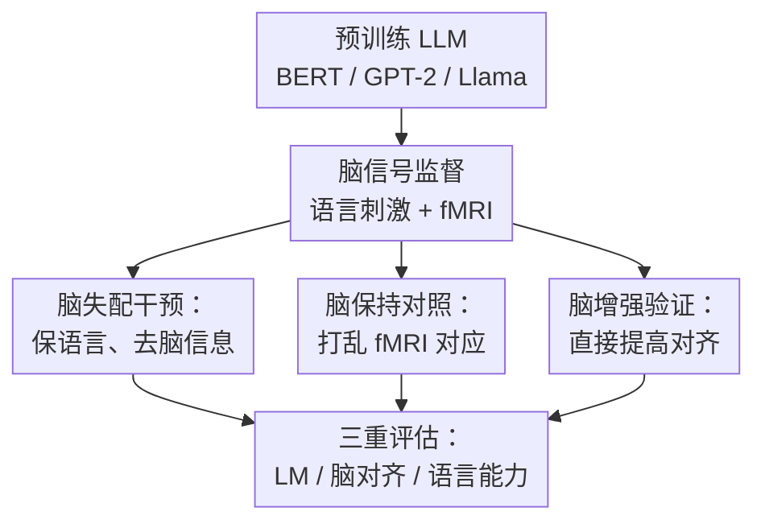

# When Language Models Lose Their Mind: The Consequences of Brain Misalignment

**会议**: ICLR 2026  
**OpenReview**: [https://openreview.net/forum?id=MkrsbXl1GI](https://openreview.net/forum?id=MkrsbXl1GI)  
**代码**: 待确认  
**领域**: LLM 其他  
**关键词**: 脑对齐, fMRI, 语言能力, 对抗微调, 因果干预  

## 一句话总结
这篇论文用“脑失配”干预把 LLM 表征中可预测人脑语言区 fMRI 的信息刻意拿掉，同时尽量保持语言建模损失不变，发现这种脑对齐下降会系统性损害语义、句法等 200 多个语言探针任务，反过来提高脑对齐又能带来语言能力收益。

## 研究背景与动机
**领域现状**：近几年大量认知神经科学和 NLP 工作都发现，预训练语言模型的中间表征可以在同一段语言刺激下预测人类脑活动，尤其是语言相关脑区的 fMRI 响应。这个现象通常被称为语言模型与人脑的 brain alignment：模型不是只在行为上会做题，它的表示空间似乎也捕捉到了一些与人类语言处理相近的结构。

**现有痛点**：问题在于，观察到“对齐”并不等于知道“对齐有用”。一种可能是脑对齐只是强语言模型训练后的副产物，模型因为语言建模能力强而顺便能预测脑信号；另一种可能是，能和人脑语言系统对齐的那部分表示本身就是模型完成语义、句法、篇章推理等任务的重要基础。仅做相关性分析很难区分这两种解释。

**核心矛盾**：这篇论文抓住的矛盾是：如果脑对齐只是副产物，那么在保持语言建模性能近似不变的前提下削弱脑对齐，不应该明显伤害下游语言能力；但如果脑对齐承载了语言能力所需的信息，那么“失配”应该会让模型在细粒度语言任务上退化。关键难点是，脑对齐不像词性、实体类别那样有明确的反事实输入，不能简单改几个 token 就构造一个去除脑信息的样本。

**本文目标**：作者希望构造一组可比较的模型：一组模型在语言建模能力上保持接近，但脑对齐能力被主动降低；另一组模型经历相似的训练和扰动，却不破坏真实刺激与脑活动之间的对应关系；再加上一组主动提升脑对齐的模型。这样就能把“训练过程本身”“继续微调”“对抗移除”等干扰因素尽量控制住，单独观察脑对齐变化对语言能力的影响。

**切入角度**：论文从表征干预入手，而不是从输入反事实入手。作者给 BERT、GPT-2 和 Llama-3.2-1B 加上脑映射头，用 fMRI 监督去测量表示能否预测脑活动，再用梯度反转层让主干表征朝着“让脑映射头预测不好”的方向更新。这样模型仍在同一批语言刺激上做语言建模，却被迫丢掉一部分脑相关信息。

**核心 idea**：用“语言建模保持 + 脑预测对抗移除”的双目标微调造出 brain-misaligned LLM，并与脑保持模型、脑增强模型对照，从而检验脑对齐是否是语言能力的功能性支撑。

## 方法详解

### 整体框架
整篇论文的方法不是提出一个新的下游任务模型，而是提出一种因果干预实验。输入是同一批自然语言刺激及其对应的 fMRI 记录，输出是三类经过 LoRA 微调的语言模型：Brain Misaligned、Brain Preserving 和 Brain Tuned。随后作者分别测量三类模型的语言建模损失、脑对齐相关系数和 200 多个语言能力探针任务表现，用控制条件隔离脑对齐本身的影响。

作者使用两个公开 fMRI 数据集作为脑信号来源。Harry Potter 数据集包含 8 名被试逐词阅读《哈利波特》一章时的 fMRI；Moth Radio Hour 数据集包含 6 名被试阅读故事文本时的 fMRI。论文只选取噪声上限大于 0.05、并位于语言相关脑区的体素，以减少 fMRI 噪声对结论的影响。

语言模型侧覆盖 BERT-base-cased、GPT-small 和 Llama-3.2-1B。训练时用 5 个 TR 对应的词序列作为样本，刺激文本被切成四段做交叉验证；BERT、GPT-2 和 Llama 的干预都通过 LoRA 完成，避免全量更新导致模型整体能力发生不可控漂移。

### 关键设计
**1. 脑失配干预：在保持语言建模的同时主动移除脑可预测信息**

Brain Misaligned 模型的关键不是简单让模型变差，而是让它“在语言建模上尽量不变、在脑预测上明显变差”。作者在预训练 LLM 顶部同时接两个目标：一个是标准语言建模头，继续用文本刺激训练模型；另一个是脑映射头，尝试从模型表征预测对应 fMRI 体素。脑映射头前放置梯度反转层，前向传播时它正常预测脑活动，反向传播时梯度方向被翻转，于是主干模型会学习产生让脑映射头难以预测 fMRI 的表示。

这个设计针对的是相关性研究里的最大漏洞：如果直接比较原模型和一个随便微调过的模型，性能下降可能来自训练噪声或语言建模能力下降，而不是脑对齐本身。Brain Misaligned 通过同时保留语言建模损失，把干预集中到“脑相关信息是否仍可从表征中读出”这一点上。论文用的总损失可概括为 $L=\omega_{lm}L_{lm}+\omega_{ba}L_{ba}$，其中 $L_{lm}$ 是语言建模交叉熵，$L_{ba}$ 与预测 fMRI 和真实 fMRI 的 Pearson 相关有关；在梯度反转层作用下，主干表征被推向低脑对齐。

**2. 脑保持对照：用打乱 fMRI 控制对抗训练和继续微调的混杂因素**

Brain Preserving 模型和 Brain Misaligned 使用几乎相同的训练流程，但作者打乱了 fMRI 图像与语言刺激之间的对应关系。这样模型仍然经历脑映射头、对抗式训练结构、LoRA 微调和同样的语言刺激，但脑损失不再携带真实的“这段语言刺激对应这段脑活动”的信息。

这个对照非常重要，因为梯度反转本身可能会扰动表示，继续微调也可能改变语言能力。如果 Brain Misaligned 比 Brain Preserving 差，而两者语言建模损失相近，那么差异就更难解释为“微调把模型训坏了”，更接近真实脑对齐信息被移除后的后果。论文还设定了成功比较条件：Misaligned 和 Preserving 在语言建模目标上没有显著差异，同时 Misaligned 的脑对齐显著更低，只有满足这个条件的被试/模型组合才进入后续语言能力比较。

**3. 脑增强验证：用反向方向检验脑对齐是否不仅必要而且有益**

Brain Tuned 模型去掉了梯度反转层，直接让脑映射头的损失鼓励模型提高 fMRI 预测能力，同时仍保留语言建模目标。它不是主实验的唯一证据，而是一个方向相反的验证：如果降低脑对齐会伤害语言能力，那么提高脑对齐是否会带来收益？

这个设计让论文的论证更像一个双向干预，而不只是单点破坏实验。结果显示 Brain Tuned 在所有实验设置中都系统性优于 Brain Preserving，尤其在语义和句法任务上更明显；这说明脑相关信号不只是“拿掉会坏”的脆弱相关项，也可能是可以被利用来改善语言能力的训练信号。

**4. 三重评估：同时看语言建模、脑对齐和细粒度语言能力**

作者没有只用困惑度或单一 benchmark 评价模型，而是把评估拆成三层。第一层是语言建模损失，用同一批 held-out fMRI 刺激文本检查模型是否仍能做基本语言建模；第二层是脑对齐，用岭回归线性头从最后一个 transformer block 表征预测 held-out fMRI，并用 Pearson 相关度量；第三层是 Holmes benchmark 上 200 多个 classifier-based probing 数据集，覆盖语义、句法、形态、篇章、推理等子领域。

这种三层评估的价值在于，它避免把“语言模型总体变差”误读成“脑对齐重要”。只有当语言建模近似持平、脑对齐明显下降、下游语言能力也随之下降时，论文的因果解释才站得住。Holmes 还进一步把任务拆到具体语言现象，例如 filler-gap、negative polarity item licensing、量词、语义角色、指代、修辞结构等，使作者能看到脑失配主要伤到哪些语言现象。

### 一个完整示例
可以把一次训练/评估想成下面这个流程。假设某个被试阅读 Harry Potter 中连续 5 个 TR 的文本，模型先把这段文本编码成 token 表征；语言建模头要求它仍能预测被 mask 的词或下一个词，脑映射头则尝试从这些表征预测该被试语言脑区的 fMRI 体素值。

在 Brain Misaligned 条件下，脑映射头越能预测 fMRI，主干模型收到的反向信号越会让表示朝相反方向更新；因此下一轮同样的文本表征仍要服务语言建模，却更难被线性读出脑活动。在 Brain Preserving 条件下，fMRI 与文本被打乱，对抗信号不再对应真实语言理解脑活动，所以它主要控制训练机制的副作用。在 Brain Tuned 条件下，梯度不反转，主干模型会被鼓励保留或增强能预测脑活动的语言信息。

训练完成后，作者先检查三类模型在 held-out 文本上的语言建模损失是否可比，再用线性脑映射头重新测脑对齐。最后，每个模型在 Holmes 的 200 多个探针任务上跑 6 个随机种子；只有两个模型在某个数据集上的差异达到统计显著时，才记为一次“win”。这些 win 再跨被试、run、模型和数据集聚合，得到论文图中的平均胜率。

### 损失函数 / 训练策略
语言建模损失沿用各模型适配的标准做法：BERT 使用随机 mask token 的交叉熵，GPT-2 和 Llama 使用所有 token 上的自回归交叉熵。脑对齐评估时，作者从最后一个 transformer block 提取表示，并把当前 TR 和前 5 个 TR 的表示拼接起来，以适配 fMRI 血氧响应存在数秒延迟的事实。

脑映射头是带 ridge 正则的线性函数，训练时用交叉验证选择 ridge 参数。脑对齐指标是预测体素值 $\hat{y}_j$ 与真实体素值 $y_j$ 的 Pearson 相关：$brain\ alignment(q,v_j)=corr(\hat{y}_j,y_j)$。训练中只选择噪声上限较高且位于语言 ROI 的体素，减少低信噪比体素让模型学到无意义相关的风险。

微调配置上，作者对 BERT、GPT-2 和 Llama 都使用 LoRA，训练 5 个 epoch，batch size 为 16，优化器为 AdamW。语言建模损失权重固定为 $\omega_{lm}=0.1$，脑对齐损失权重为 $\omega_{ba}=10$。这些权重是根据微调前两类损失的相对量级选择的，目标是让模型既不完全忽视语言建模，也能产生足够强的脑对齐干预。

## 实验关键数据

### 主实验
| 比较 | 模型 / 数据 | 评估对象 | 主要结果 | 结论 |
|------|-------------|----------|----------|------|
| Brain Misaligned vs Brain Preserving | BERT、GPT-2、Llama；Harry Potter 与 Moth | 全部 Holmes 语言任务 | 平均后 Preserving 显著优于 Misaligned，整体差异达到 $p<0.05$ | 移除脑对齐会降低总体语言能力 |
| Brain Misaligned vs Brain Preserving | BERT-Harry | 语义、句法、形态、推理、篇章 | 全部语言子领域 Preserving 均显著更好 | BERT 上脑失配影响最稳定 |
| Brain Misaligned vs Brain Preserving | GPT2-Harry | 全部任务 | Preserving 更好，整体趋势 $p=0.055$ | GPT-2 上趋势一致但统计强度较弱 |
| Brain Misaligned vs Brain Preserving | Llama-Harry | 全部任务与子领域 | Preserving 在整体任务上 $p<0.001$，语义/句法显著更好 | 较新 LLM 上仍能观察到脑失配损害 |
| Brain Tuned vs Brain Preserving | 所有实验设置平均 | 全部 Holmes 语言任务 | Tuned 显著优于 Preserving，整体 $p<0.05$ | 提高脑对齐也能带来语言能力收益 |

### 消融实验
| 配置 | 关键指标 | 说明 |
|------|---------|------|
| Brain Preserving | 脑对齐高，语言建模与 Misaligned 可比 | 保留训练流程，但打乱 fMRI 对应，是控制组 |
| Brain Misaligned | 脑对齐显著下降，语言能力下降 | 通过梯度反转移除脑相关信息，是主干预组 |
| Brain Tuned | 脑对齐提高，语言能力普遍提升 | 去掉梯度反转，直接用 fMRI 信号增强表征 |
| GPT2-Moth Misaligned | 脑移除效应较弱，语言能力结果不稳定 | 说明结论受模型、数据集和脑对齐移除强度影响 |
| 子领域拆分 | 语义和句法最常显著 | 脑对齐对细粒度语言结构特别关键 |

### 关键发现
- Brain Misaligned 模型在 fMRI 语言相关脑区的 Pearson 相关明显低于 Brain Preserving，说明对抗干预确实移除了脑可预测信息，而不是只改变了无关体素。
- 在语言建模损失可比的条件下，Brain Misaligned 在 Holmes 语言能力 benchmark 上更差，支持“脑对齐具有功能意义”而不是“脑对齐只是副产物”的解释。
- 语义和句法是最稳定受影响的两个子领域：BERT-Moth、Llama-Harry、Llama-Moth 等设置都显示这两个方向差异更明显。
- Brain Tuned 的结果形成反向验证：提高脑对齐后，模型在整体语言任务上显著优于 Brain Preserving，并在语义/句法上有最清晰收益。
- 不同模型和 fMRI 数据集之间存在差异，尤其 GPT2-Moth 的脑移除效果弱，说明这套因果干预的有效性依赖于原始模型、脑数据质量和对齐信号强度。

## 亮点与洞察
- 这篇论文最强的地方是把 brain alignment 从“相关性现象”推进到“可干预变量”。作者不是只证明模型像不像人脑，而是问：如果让模型不像人脑了，它还能不能保持语言能力？这个问题比单纯报一个 brain score 更接近因果解释。
- Brain Preserving 的控制设计很巧妙。打乱 fMRI 与文本的对应关系后，模型仍经历同样的训练管线和扰动，因此可以排除“继续微调导致退化”“对抗头导致退化”这类粗糙解释，把差异更集中地归因到真实脑-语言对应被移除。
- Brain Tuned 是一个很有说服力的补充。如果论文只有 Misaligned 变差，读者可能怀疑这是破坏式训练的副作用；但 Tuned 方向的提升说明 fMRI 信号可能真的含有对语言表示有帮助的信息。
- 用 Holmes 的 200 多个探针任务比只跑 GLUE/SuperGLUE 更适合这篇论文。因为作者关心的是“语言能力内部哪些结构依赖脑对齐”，而 Holmes 能把语义、句法、形态、篇章、推理拆得更细。
- 对 NeuroAI 和可解释 NLP 来说，这篇论文提供了一个可迁移范式：任何“涌现属性”如果难以构造输入反事实，都可以尝试用表征层面的保持组、移除组、增强组来做因果验证。

## 局限与展望
- fMRI 数据规模仍然有限。Harry Potter 和 Moth Radio Hour 都是经典数据集，单被试数据量较大，但被试数、语言、文本体裁和脑记录条件都有限，结论未必能直接推广到其他语言、对话、代码、数学推理或多模态输入。
- Holmes benchmark 虽然覆盖 200 多个数据集，但不是完整语言能力图谱。某些子领域如篇章任务样本较少，具体语言现象的显著性可能受任务分布影响。
- Brain Misaligned 并不保证只移除“人脑语言处理所需信息”。梯度反转移除的是可被当前线性脑映射头读出的 fMRI 相关信息，其中可能混有任务难度、刺激统计或数据集特有模式。
- 论文重点看表示与 fMRI 的线性可预测性，但人脑和模型之间的关系可能包含非线性结构。未来可以比较线性映射、非线性映射和层级脑区映射，看哪些脑对齐形式真正影响下游能力。
- Brain Tuned 的收益很有启发，但实际训练 LLM 时使用 fMRI 信号成本极高。更实际的后续方向可能是把脑对齐信号蒸馏成可扩展的文本数据增强、偏好信号或表征正则项。
- 论文没有深入解释“为什么语义和句法最受影响”。后续可以把受损任务和脑区、模型层、语言现象之间做更细的对应分析，找出脑对齐究竟对应哪些可计算的表示维度。

## 相关工作与启发
- **vs 语言模型-大脑对齐相关性研究**: Toneva & Wehbe、Schrimpf 等工作证明 LLM 表征能预测脑活动，本文进一步问这种对齐是否对模型能力有功能意义。区别在于前者主要测相似性，本文通过对抗移除和增强训练做干预。
- **vs brain-tuning 语言模型**: 早期工作尝试用脑信号微调语言模型并观察下游收益，本文同时做负向移除和正向增强，因此能更清楚地区分“脑信号有用”和“任意额外监督都有用”。
- **vs Causal NLP**: Causal NLP 常通过反事实输入或机制干预解释模型行为，本文面对脑对齐这种没有自然反事实输入的抽象属性，选择在表示层移除/保留/增强目标信息，是一种适合认知属性的因果分析路径。
- **vs 语言能力 probing benchmark**: Holmes、BLiMP、GLUE 等 benchmark 评估模型是否掌握语言现象；本文把这些 benchmark 当作干预后的读出层，用来判断脑相关表示是否支撑不同语言子能力。
- **启发**: 对齐人脑不一定只是为了可解释或认知建模，也可能成为改进语言模型的一类训练约束。但要把它用于大规模模型，还需要找到比直接 fMRI 监督更便宜、更稳定、更可扩展的代理信号。

## 评分
- 新颖性: ⭐⭐⭐⭐⭐ 通过构造脑失配、脑保持和脑增强三类模型来检验脑对齐的功能作用，比常规相关性分析更进一步。
- 实验充分度: ⭐⭐⭐⭐☆ 覆盖 3 类 LLM、2 个 fMRI 数据集和 200 多个语言任务，但脑数据和任务分布仍有限。
- 写作质量: ⭐⭐⭐⭐☆ 论文主线清楚，控制组设计容易理解，不过不少关键数值依赖图和附录，正文定量表述可以更集中。
- 价值: ⭐⭐⭐⭐⭐ 对 NeuroAI、认知科学和 LLM 表征分析都有启发，尤其提供了研究抽象涌现属性因果作用的通用实验模板。

<!-- RELATED:START -->

## 相关论文

- [\[NeurIPS 2025\] Do Language Models Use Their Depth Efficiently?](../../NeurIPS2025/llm_nlp/do_language_models_use_their_depth_efficiently.md)
- [\[ACL 2025\] Improve Language Model and Brain Alignment via Associative Memory](../../ACL2025/llm_nlp/improve_language_model_and_brain_alignment_via_associative_memory.md)
- [\[ICLR 2026\] Trapped by simplicity: When Transformers fail to learn from noisy features](trapped_by_simplicity_when_transformers_fail_to_learn_from_noisy_features.md)
- [\[ACL 2025\] Theory of Mind in Large Language Models: Assessment and Enhancement](../../ACL2025/llm_nlp/theory_of_mind_llm.md)
- [\[ACL 2026\] CoSToM: Causal-oriented Steering for Intrinsic Theory-of-Mind Alignment in Large Language Models](../../ACL2026/llm_nlp/costomcausal-oriented_steering_for_intrinsic_theory-of-mind_alignment_in_large_l.md)

<!-- RELATED:END -->
