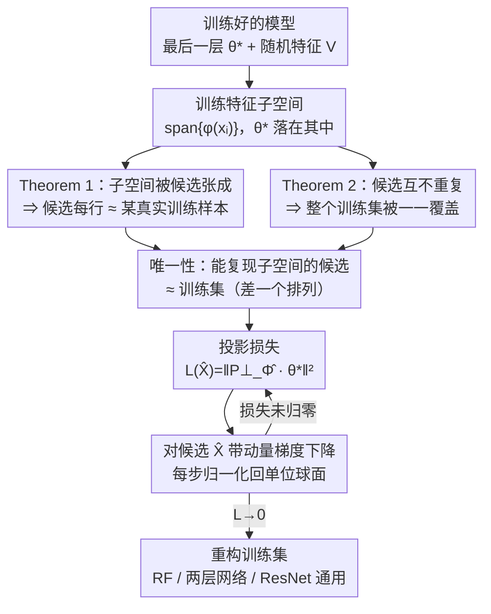

# A Law of Data Reconstruction for Random Features (and Beyond)

**会议**: ICLR 2026  
**arXiv**: [2509.22214](https://arxiv.org/abs/2509.22214)  
**代码**: [https://github.com/iurada/data-reconstruction-law](https://github.com/iurada/data-reconstruction-law)  
**领域**: 机器学习理论 / 隐私  
**关键词**: 数据重构, 过参数化, 随机特征, 记忆化, 隐私  

## 一句话总结
从信息论和代数角度证明随机特征模型中存在数据重构定律：当参数量 $p \gg dn$（$d$ 为数据维度，$n$ 为样本数）时，训练数据可被完整重构，并通过投影损失优化方法在 RF、两层网络和 ResNet 上验证了该阈值的普适性。

## 研究背景与动机

**领域现状**：已知当参数量 $p \gg n$ 时神经网络可以插值（记忆标签），经典理论将记忆化等同于标签拟合。

**现有痛点**：关于从模型参数重构训练数据（而非仅拟合标签），缺乏理论刻画。经验上观察到模型越大重构越容易，但无严格的参数量阈值理论。基础模型（如 GPT-4、Stable Diffusion）的数据提取攻击揭示了隐私风险，亟需理解重构的可行性条件。

**核心矛盾**：标签拟合需要 $p \geq n$ 个自由度（$n$ 个方程），但数据重构需要恢复整个 $d \times n$ 维输入矩阵，直觉上需要 $p \geq dn$ 个自由度——但这是否成立缺乏证明。

**本文目标** 建立数据重构的参数量阈值理论，回答"模型需要多大才能记忆训练数据（而非仅记忆标签）"。

**切入角度**：在可分析的随机特征 (RF) 模型上建立理论，通过特征空间子空间的性质推导重构充分条件，再通过数值实验验证推广到深度网络。

**核心 idea**：数据重构存在相变阈值 $p \approx dn$——低于此值不可能，高于此值训练数据可从模型参数完整恢复。

## 方法详解

### 整体框架
全文围绕一个问题展开：模型要多大，训练数据才能从参数里被原样掏出来？理论侧选了最干净的随机特征回归模型 $f_{RF}(x,\theta) = \varphi(x)^\top \theta$ 作为载体——它的训练解有闭式表达，特征子空间的代数结构可以精确分析。整条链路是这样转的：拿到训练好的最后一层参数 $\theta^*$ 和随机特征矩阵 $V$，它们一起确定了训练样本在特征空间张成的子空间；作者证了两个定理，合起来说明只要参数量 $p \gg dn$，能复现这个子空间的候选输入集合本质上只有训练集本身（最多差一个排列）。有了这个唯一性，重构就从"猜数据"变成"解约束"——把"候选子空间要包住 $\theta^*$"这个条件落成一个投影损失，对候选输入做梯度下降直到损失归零，就把训练集解了出来；最后把同一套损失直接搬到两层网络、ResNet 的最后一层，验证阈值是否照样成立。

### 关键设计

**1. Theorem 1：特征子空间相等 ⇒ 输入数据相近**

这是整个重构论证的地基，要解决的痛点是——光知道候选 $\hat{X}$ 能拟合输出还不够，得证明它必须长得跟真实训练数据一样。定理断言：当 $p \gg dn$ 时，若候选重构 $\hat{X}$ 的特征所张成的子空间包含了原始特征，则 $\hat{X}$ 的每一行都必然接近某个真实训练样本 $x_i$。证明的关键在两点：先用 RF 核的集中性保证特征矩阵 $\Phi$ 的各行线性无关（这样子空间才有判别力），再对非线性激活的 Hermite 展开做分析——把约束 $\varphi(\hat{x}) = \sum_i a_i \varphi(x_i)$ 拆到各阶 Hermite 分量上，逐阶比对迫使 $\hat{x}$ 只能落在某个 $x_i$ 附近。由于要对所有可能的 $\hat{x}$ 一致成立，作者用 $\varepsilon$-net 把连续空间离散化后做一致集中，而这一步正是 $p \gg dn$ 条件发挥作用的地方：参数足够多，集中不等式才能在整张 net 上同时成立。

**2. Theorem 2：排除重复，保证整集被还原**

Theorem 1 留了个缺口——它只说每行都接近某个训练样本，但没排除"多行都挤到同一个 $x_1$、漏掉别的样本"这种退化解。Theorem 2 针对的就是这个：在 $n=2$ 的情形下证明 $\hat{x}_1, \hat{x}_2$ 不会同时接近 $x_1$，从而整个训练集被一一覆盖而非部分冗余。手法是反证加 Taylor 展开：假设两行都贴着 $x_1$，把残差沿 $\varepsilon_2 - \varepsilon_1$ 方向投影后做展开，高阶非线性项用广义 Stein 引理处理，最终推出矛盾。它和 Theorem 1 互补——一个保证"每行都对得上某个样本"，一个保证"不同行对上不同样本"，两者合起来才支撑起"训练集被完整重构（差一个排列）"的结论。

**3. 投影损失：把唯一性条件变成可优化目标**

有了理论，还需要一个真能跑的重构算法，这一点的关键观察是训练解的代数结构：最小二乘解 $\theta^* = \Phi^+ Y$ 必然落在训练特征张成的子空间 $\text{span}\{\varphi(x_i)\}$ 里。反过来，如果某个候选 $\hat{X}$ 重构正确，它的特征子空间就该把 $\theta^*$ 包进去；$\theta^*$ 在该子空间正交补上的分量越小，候选越好。把这个直觉写成损失就是

$$\mathcal{L}(\hat{X}) = \big\|P_{\hat{\Phi}}^\perp\, \theta^*\big\|_2^2,$$

其中 $P_{\hat{\Phi}}^\perp$ 是候选特征张成子空间的正交投影补。优化时对 $\hat{X}$ 做带动量的梯度下降，每步后把各行归一化回单位球面（与数据预处理的尺度约束一致）。这个损失是理论自然导出的、不是凑出来的，而且它只用到 $\theta^*$ 和特征映射、不依赖 RF 的具体形式，所以能原封不动迁移到两层网络和 ResNet 的最后一层。

### 损失函数 / 训练策略
重构本身不训练任何新模型，只对候选输入 $\hat{X}$ 用带动量的梯度下降优化上面的投影损失。前提是能拿到训练好的最后一层参数 $\theta^*$ 以及随机特征矩阵 $V$（或等价的前层参数）——也就是说，攻击者只需读取模型权重，就能反推训练数据。

## 实验关键数据

### 主实验

**CIFAR-10 RF 模型重构 ($n=100$, $d=3072$, ReLU):**

| 参数量 $p$ | 训练损失 | 重构误差 $\rho$ | 状态 |
|-----------|---------|---------------|------|
| $p = n$ | ~0 | ~1.0 | 仅标签拟合 |
| $p = dn$ | ~0 | ~0.5 | 开始重构 |
| $p = 10dn$ | ~0 | **~0** | 完整重构 |

### 消融实验

| 配置 | 重构阈值 | 说明 |
|------|---------|------|
| RF (球面数据) | $p \approx dn$ | 与理论完全一致 |
| 两层网络 (GD训练) | $p^{(L)} \approx dn$ | 最后一层参数量决定 |
| ResNet (GD训练) | $p^{(L)} \approx dn$ | 同样成立 |
| Logistic loss (分类) | $p \approx dn$ | 不限于回归 |
| Cross-entropy | $p^{(L)} \approx dn$ | 同样成立 |

### 关键发现
- 标签拟合阈值 $p = n$ 和数据重构阈值 $p = dn$ 是两个截然不同的相变——两者之间存在巨大的"灰色地带"（模型记住标签但无法重构数据）
- ReLU 的符号歧义：由于 ReLU 的奇数阶 Hermite 系数（$\geq 3$ 阶）为零，重构可能出现符号翻转。使用 $\phi(z) = \text{ReLU}(z) + \tanh(z)$ 可消除此问题
- 阈值 $p \gg dn$ 与对抗鲁棒性文献中发现的光滑插值阈值一致，暗示对抗鲁棒性与数据重构能力之间存在内在联系
- 在 $\hat{n} \neq n$ 的情况下（不知道精确样本数），$\hat{n} > n$ 时会生成正确样本+部分重复，$\hat{n} < n$ 时会合并样本

## 亮点与洞察
- **优雅的相变发现**：$p = n$ 为标签记忆阈值，$p = dn$ 为数据记忆阈值，两者的比值恰好是数据维度 $d$，物理直觉清晰——重构需要恢复 $dn$ 个自由度
- **理论指导算法**：投影损失不是凭空设计，而是理论分析自然导出的——如果 $\theta^*$ 在特征子空间内，则重构成功。这种"理论→算法"的路径值得学习
- **跨架构的普适性**：虽然理论仅在 RF 模型上成立，但实验表明阈值在两层网络、ResNet、ViT 上都适用，暗示最后一层的过参数化是关键

## 局限与展望
- Theorem 2 仅证明了 $n=2$ 的情况，$n \geq 3$ 的排除重复证明存在组合爆炸的技术困难
- 理论假设激活函数需满足特定 Hermite 系数条件（ReLU 不完全满足），实际实验中 ReLU 仍然工作但有符号歧义
- 未证明投影损失的全局最优解一定是训练数据的排列——目前在非凸优化层面缺乏保证
- 对 $n \ll p \ll dn$ 的"中间区间"信息论是否可能重构单个样本有初步讨论但未定论

## 相关工作与启发
- **vs Haim et al. 2022**: Haim 通过最大间隔 KKT 条件重构边界样本；本文方法通过子空间投影重构所有样本，不限于分类边界
- **vs Loo et al. 2022**: Loo 在无限宽网络 ($p \to \infty$) 设置下推导重构；本文明确了有限的阈值 $p \gg dn$
- **vs 对抗鲁棒性**: $p \gg dn$ 阈值同时是光滑插值的充要条件，暗示"能光滑记忆 → 能被重构"的深层联系

## 评分
- 新颖性: ⭐⭐⭐⭐⭐ 首次给出数据重构的参数量相变阈值，理论贡献清晰且有深度
- 实验充分度: ⭐⭐⭐⭐⭐ 从合成数据到 CIFAR-10/Tiny-ImageNet，从 RF 到 ResNet/ViT，覆盖全面
- 写作质量: ⭐⭐⭐⭐⭐ 理论和实验结合紧密，Figure 1 的展示极具说服力，证明sketch 清晰
- 价值: ⭐⭐⭐⭐⭐ 对隐私和安全有重要启示——给出了"模型多大就危险"的定量刻画

<!-- RELATED:START -->

## 相关论文

- [\[NeurIPS 2025\] Optimal Online Change Detection via Random Fourier Features](../../NeurIPS2025/llm_pretraining/optimal_online_change_detection_via_random_fourier_features.md)
- [\[ICLR 2026\] What Scales in Cross-Entropy Scaling Law?](what_scales_in_cross-entropy_scaling_law.md)
- [\[ICLR 2026\] Understanding the Emergence of Seemingly Useless Features in Next-Token Predictors](understanding_the_emergence_of_seemingly_useless_features_in_next-token_predicto.md)
- [\[ICLR 2026\] Beyond Length: Quantifying Long-Range Information for Long-Context LLM Pretraining Data](beyond_length_quantifying_long-range_information_for_long-context_llm_pretrainin.md)
- [\[ICLR 2026\] Beyond Multi-Token Prediction: Pretraining LLMs with Future Summaries](beyond_multi-token_prediction_pretraining_llms_with_future_summaries.md)

<!-- RELATED:END -->
