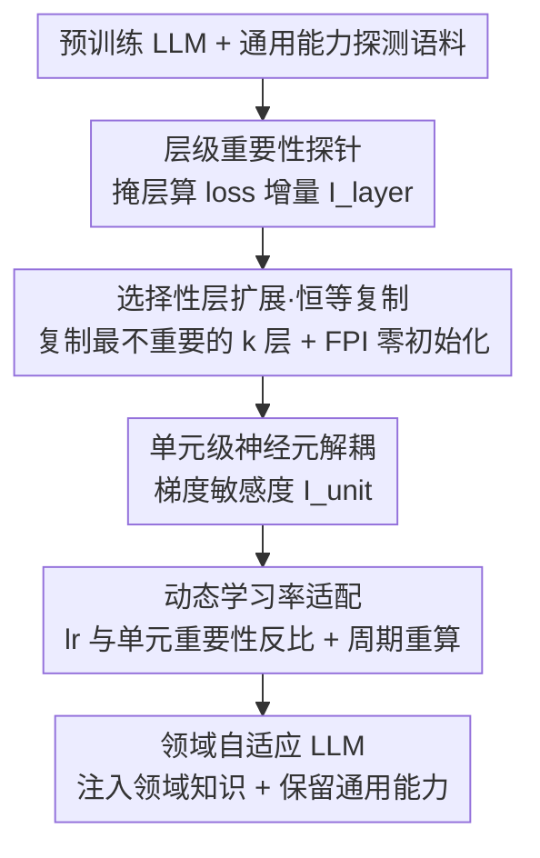

# ADEPT: Continual Pretraining via Adaptive Expansion and Dynamic Decoupled Tuning

**会议**: ICLR 2026  
**OpenReview**: [https://openreview.net/forum?id=vcWDDfA4Ev](https://openreview.net/forum?id=vcWDDfA4Ev)  
**代码**: https://github.com/PuppyKnightUniversity/ADEPT.git  
**领域**: LLM 预训练 / 持续预训练 / 领域自适应  
**关键词**: 持续预训练、灾难性遗忘、层扩展、功能特化、解耦微调

## 一句话总结
ADEPT 发现 LLM 各层、各参数单元对"通用能力"的贡献是高度不均的，于是只复制那些对通用域最不重要的层来腾出新容量，并在这些扩展层内部按单元重要性分配不对称学习率，从而在数学/医学领域持续预训练中既注入新知识又几乎不损伤通用能力——只调 15% 参数、不到 50% 训练时间，却比全参 CPT 在通用基准上高 5.76%、领域基准上高 5.58%。

## 研究背景与动机

**领域现状**：把通用 LLM 适配到数学、医疗这类专业领域，主流做法是持续预训练（Continual Pretraining, CPT）——拿领域语料在预训练好的模型上继续做下一词预测。

**现有痛点**：CPT 的老大难是**灾难性遗忘**。预训练后的模型参数已经被通用知识"占满"，留给领域知识的容量很少；硬用梯度去拟合领域信号，就会过度改写已有参数，导致通用能力崩塌。已有缓解手段各有缺陷：数据回放（replay）能部分保住旧知识，但不增加模型容量，注入与保留的矛盾依旧；层扩展（如 LLaMA-Pro）通过插新层增容量，但它**均匀地**在各深度插层、并**无差别地**更新所有新参数。

**核心矛盾**：均匀扩展忽略了 LLM 内部的**功能特化（functional specialization）**。作者的探针实验发现：通用知识关键层集中在**浅层**，越往深层越不重要；同一层内不同参数单元（注意力投影、MLP、归一化）对通用能力的贡献也极不均衡。在这种结构下盲目扩展和更新，等于把新知识写进了通用关键区域，遗忘问题自然解决不了。

**本文目标**：让容量分配是"重要性引导"的，让优化是"功能解耦"的，二者都要最小化对通用能力的干扰。

**切入角度**：既然层和单元有功能分工，那扩展就该挑**对通用域约束最弱**的层去做（它们更"可塑"、更能吸收领域知识），更新就该**保护通用关键单元、放开可塑单元**。

**核心 idea**：把扩展和更新都变成"功能感知"的——只复制通用域最不重要的层来扩容，并在扩展层内按单元重要性反比分配学习率。

## 方法详解

### 整体框架

ADEPT 是一个两阶段框架。**Stage 1（General-Competence Guided Selective Layer Expansion，通用能力引导的选择性层扩展）**先用探针给每层打一个"通用域重要性分"，挑出最不重要的 $k$ 层做恒等复制（identity copy），给领域知识腾出一块"白板"容量；**Stage 2（Adaptive Unit-Wise Decoupled Tuning，自适应单元级解耦微调）**再把这些扩展层拆成语义单元、按单元重要性反比地给不对称学习率，让通用关键单元被保守更新、可塑单元放开学领域知识。整个过程原始层冻结，只训练复制出来的扩展层。

### 关键设计

**1. 层/单元重要性探针：用"消融掉它会损失多少通用能力"来量化功能特化**

ADEPT 的一切都建立在"哪些参数对通用域重要"这个度量上，所以先做两层探针。**层级**：给定通用能力探测语料 $D_{\text{probe}}$，先算原模型的基线下一词预测损失 $L_{\text{base}}=\frac{1}{|D_{\text{probe}}|}\sum_x \ell(M_0(x),x)$；再用残差旁路把第 $l$ 层的输出掩掉，重算损失 $\hat{L}^{(l)}$，则该层重要性就是损失增量 $I^{(l)}_{\text{layer}}=\hat{L}^{(l)}-L_{\text{base}}$——掩掉它通用 loss 涨得越多，说明它越关键。结果显示通用关键层集中在浅层。**单元级**：把每层拆成功能单元（注意力投影、MLP、归一化），对单元 $U$ 里每个参数 $\theta_j$ 用一阶 Taylor 近似估其重要性 $I_j=\theta_j\cdot\nabla_{\theta_j}L$，单元重要性取均值 $I_{\text{unit}}=\frac{1}{|U|}\sum_{j\in U}I_j$。这个度量是后续两个阶段的共同抓手——比逐神经元分析便宜，又比整层粒度细。

**2. 选择性层扩展 + 恒等复制：只在"最可塑"的层腾容量，且初始化不扰动**

针对"均匀插层会改写通用关键层"的痛点，ADEPT 按 $I^{(l)}_{\text{layer}}$ 升序排序，选出重要性最低的 $k$ 层 $S_k=\arg\min_{|S|=k}\sum_{l\in S} I^{(l)}_{\text{layer}}$，称为**领域可塑层（Domain-Adaptable Layers）**。对每个选中层直接复制参数（$\tilde{\Theta}^{(l)}=\Theta^{(l)}$，不重新初始化）。为了不破坏稳定性，复制分支遵循**函数保持初始化（FPI）**原则：把复制出来的注意力和 FFN 子层的**输出投影置零**（$W^{\text{out}}_{\text{MHSA}}=0,\,W^{\text{out}}_{\text{FFN}}=0$），于是扩展后的模型在初始时刻输出与原模型完全一致 $M_1(x)=M_0(x)$。这样复制层就成了一块"白板"——既提供了全新的领域表征容量，又因为挑的是通用最不重要的层，把干扰通用能力的风险压到最低。论文在附录 F.1 证明：扩展通用重要性最低的层可证明地最小化遗忘风险。

**3. 单元级解耦 + 动态不对称学习率：在扩展层内按重要性反比配学习率**

光是扩展还不够，扩展层内部各单元的可塑性也不同。ADEPT 在扩展层上做单元级解耦：复用 $I_{\text{unit}}$，给每个单元分配学习率 $lr_U=2\cdot(1-I_{\text{unit}})\cdot lr_{\text{base}}$，其中系数 2 用于把全局尺度归一化、让有效平均学习率大致不变。含义很直白——对通用越关键（$I_{\text{unit}}$ 越高）的单元给越小的学习率以防改写，越不重要的单元放开学领域数据。训练目标就是标准自回归损失 $L=-\sum_{t=1}^{T}\log P(x_t\mid x_{<t};\Theta)$。关键是这个分配是**动态**的：单元重要性会随训练漂移，所以 ADEPT 周期性重算 $I_{\text{unit}}$ 并刷新学习率。附录 F.2 进一步证明这种"学习率与单元重要性反比"的分配最小化了通用域遗忘上界。

### 一个完整示例

以 Qwen3-1.7B-Base 适配医学域为例：先用探测语料给 28 层各打重要性分，发现浅层（如 $L_1,L_2$）分高、深层分低，于是挑出分最低的 $k$ 层做恒等复制（输出投影置零，此刻模型行为不变）；冻结所有原始层，只训练这几层复制分支。训练中把每个复制层拆成注意力/MLP/归一化单元，算出每个单元的 $I_{\text{unit}}$——归一化层往往通用关键、学习率被压低，某些 MLP 单元不重要、学习率被放大到接近 $2\,lr_{\text{base}}$；每隔若干步重算一次。最终在 MedQA 上从 48.39% 升到 50.75%、CMB 从 63.67% 升到 65.43%，同时 MMLU/CMMLU 几乎不掉甚至微升。

### 损失函数 / 训练策略
训练目标是标准的自回归下一词预测损失。优化上只更新 Stage 1 复制出来的扩展层（约占总参数 15%），原始层全程冻结；扩展层内部用式 $lr_U=2(1-I_{\text{unit}})lr_{\text{base}}$ 的单元级动态学习率，并周期性重算单元重要性。

## 实验关键数据

### 主实验
在数学（OpenWebMath + AceReason-Math）和医学（MMedC + IndustryIns + MMedBench）两域、四个骨干（Qwen3-1.7B/4B/8B、LLaMA3-8B）上评测；通用基准用 MMLU/CMMLU，领域基准数学用 GSM8K/ARC，医学用 MedQA/MMCU-Medical/CMB。

| 骨干/基准 | 指标 | Vanilla | PT-Full | LLaMA-Pro | ADEPT |
|--------|------|------|------|------|------|
| Qwen3-1.7B · GSM8K（数学） | Acc | 57.62 | 51.86 | 60.03 | **70.51** |
| Qwen3-1.7B · MMLU（通用） | Acc | 62.57 | 60.07 | 61.54 | **62.62** |
| LLaMA3-8B · CMB（医学） | Acc | 35.61 | 61.65 | 47.05 | **61.78** |
| Qwen3-8B · MedQA（医学） | Acc | 66.30 | 67.24 | 66.77 | **69.24** |

ADEPT 在所有骨干和领域基准上一致夺最佳：相对全参 CPT，领域基准平均提升最高 5.58%，通用基准最高 5.76%；多数 baseline 在 MMLU/CMMLU 上明显退化，ADEPT 却能保住甚至反超 vanilla（如 Qwen3-4B 医学 CPT 后 CMMLU 从 77.92 升到 78.77）。且这些提升只调了 15% 参数、训练时间不到其他 baseline 的一半。

### 消融实验（医学域）

| 配置 | Qwen3-1.7B · MMCU-Medical | LLaMA3-8B · MMCU-Medical | 说明 |
|------|------|------|------|
| ADEPT | **70.98** | **67.03** | 完整模型 |
| w/o Stage-1 | 61.55 | 53.32 | 去掉选择性层扩展，直接在可塑层上解耦微调（掉点最多） |
| w/o Stage-2 | 66.19 | 50.68 | 去掉动态解耦微调，直接全调扩展层 |
| Uniform Expansion | 66.51 | 47.05 | 改成均匀插层（等价 LLaMA-Pro 策略） |

### 关键发现
- **Stage-1 贡献最大**：去掉选择性层扩展掉点最猛，说明"自适应容量分配"是有效领域适配且不牺牲通用能力的关键前提。
- **重要性引导 > 均匀扩展**：把重要性引导扩展换成均匀插层结果明显变差，验证"只扩最可塑的层"的价值。
- **扩展是解耦能成立的前提**：KDE 激活分析显示，最可塑层在原模型上通用/医学激活仍严重重叠（参数耦合强）；不扩展直接解耦（w/o Stage-1）也分不开；只有复制出"白板"层后，两域激活才清晰分离。

## 亮点与洞察
- **把"功能特化"从观察变成可操作的度量**：用"掩层 loss 增量"和"一阶 Taylor 单元重要性"两个简单度量，就把"哪些参数动不得"量化出来，再据此同时驱动扩展和优化——度量便宜、思路统一。
- **恒等复制 + FPI 零初始化很优雅**：复制层而非随机初始化，配合输出投影置零让初始输出不变，既给了新容量又不扰动已有能力，是个可直接复用的扩容 trick。
- **学习率即"软冻结"**：$lr_U=2(1-I_{\text{unit}})lr_{\text{base}}$ 把"保护 vs 学习"做成连续可调，比硬冻结/全调更细腻，且系数 2 保证平均学习率不变、不用重调超参。
- **遗忘有理论保证**：附录证明"扩展最不重要层""学习率反比重要性"分别最小化遗忘风险/上界，让经验设计有了支撑。

## 局限与展望
- 重要性探针依赖一个人工构造的"通用能力探测语料"，其覆盖度直接决定层/单元重要性估计的可靠性，语料偏置可能误判关键区域。
- 只验证了数学和医学两个领域、Qwen3/LLaMA 系列骨干，对更长尾领域（法律、代码）或更大规模模型的普适性待考。
- 单元划分粒度（注意力/MLP/归一化）是预设的，没探讨更细或更粗的划分如何影响效果；周期性重算单元重要性的频率也是个待调超参。
- 扩展层数 $k$ 是超参，论文未充分讨论 $k$ 与领域难度/数据量的关系，自动选 $k$ 是个可改进方向。

## 相关工作与启发
- **vs LLaMA-Pro**：都靠层扩展增容量，但 LLaMA-Pro 均匀插层、无差别训新参数；ADEPT 只扩通用最不重要的层、且层内按单元重要性配学习率。消融里 Uniform Expansion 全面落后，说明"扩在哪"和"怎么更新"都很关键。
- **vs Replay**：回放靠混通用数据保旧知识，但不增容量，注入/保留矛盾未解；ADEPT 用扩展腾出独立容量，从结构上解耦两域。
- **vs PT-LoRA / TaSL**：LoRA 类只更新少量低秩参数，是参数高效但容量受限；TaSL 进一步按层解耦 LoRA 做多任务。ADEPT 在领域和通用两侧都更稳，且省训练时间。

## 评分
- 新颖性: ⭐⭐⭐⭐⭐ 把"功能特化"贯穿到扩展和优化两端，恒等复制 + 单元级反比学习率是清晰的新组合
- 实验充分度: ⭐⭐⭐⭐ 四骨干两域、含消融/激活分析/理论，但领域种类偏少
- 写作质量: ⭐⭐⭐⭐⭐ 从探针观察推导到方法逻辑顺畅，图表清楚
- 价值: ⭐⭐⭐⭐⭐ 只调 15% 参数、半数时间就同时改善领域与通用，工程实用性强

<!-- RELATED:START -->

## 相关论文

- [\[ACL 2025\] Velocitune: A Velocity-based Dynamic Domain Reweighting Method for Continual Pre-training](../../ACL2025/llm_pretraining/velocitune_a_velocity-based_dynamic_domain_reweighting_method_for_continual_pre-.md)
- [\[ICLR 2026\] Synthetic Bootstrapped Pretraining](synthetic_bootstrapped_pretraining.md)
- [\[ACL 2026\] Data Mixing Agent: Learning to Re-weight Domains for Continual Pre-training](../../ACL2026/llm_pretraining/data_mixing_agent_learning_to_re-weight_domains_for_continual_pre-training.md)
- [\[ICLR 2026\] Reformulation for Pretraining Data Augmentation](reformulation_for_pretraining_data_augmentation.md)
- [\[ICML 2026\] SPARe: Stacked Parallelism with Adaptive Reordering for Fault-Tolerant LLM Pretraining Systems with 100k+ GPUs](../../ICML2026/llm_pretraining/spare_stacked_parallelism_with_adaptive_reordering_for_fault-tolerant_llm_pretra.md)

<!-- RELATED:END -->
