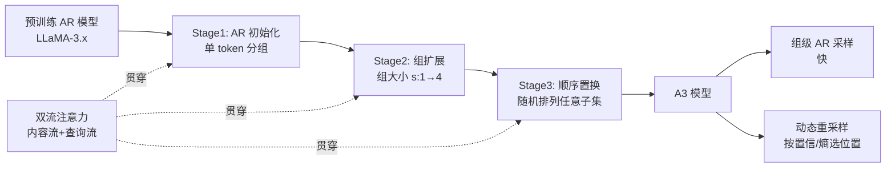

# Autoregressive Models Rival Diffusion Models at Any-Order Generation

**会议**: ICLR 2026  
**OpenReview**: [https://openreview.net/forum?id=vtDUomlazQ](https://openreview.net/forum?id=vtDUomlazQ)  
**代码**: [https://github.com/PKU-ML/Any-order-Any-subset-AR](https://github.com/PKU-ML/Any-order-Any-subset-AR)  
**领域**: LLM 预训练 / 语言建模范式  
**关键词**: 任意顺序生成, 自回归, 扩散语言模型, 双流注意力, 渐进式适配  

## 一句话总结
本文提出 **A3（Any-order Any-subset Autoregressive modeling）**，把扩散语言模型的"任意顺序、任意子集"灵活性重新装回自回归框架——通过分组式因子分解保留 AR 的多层依赖建模能力，再用双流注意力 + 渐进式课程把预训练 AR 模型平滑改造成任意顺序生成器，在用更少训练数据的前提下全面超过同规模扩散语言模型。

## 研究背景与动机

**领域现状**：扩散语言模型（MDLM，如 LLaDA、DiffuLlama、Dream）近年成为自回归（AR）之外的热门方案。它们通过迭代去噪部分掩码序列，天生支持任意顺序生成、双向条件，能做填空（infilling）、全局改写、自我纠错等 AR 难以胜任的任务，灵活性极具吸引力。

**现有痛点**：扩散建模的训练范式是"在单步内用序列的一部分预测另一部分"——即把索引集划成两个不相交子集 $G_1, G_2$，预测 $P(x_{G_2}\mid x_{G_1})=\prod_{t\in G_2}P(x_t\mid x_{G_1})$。这只构成**单层依赖结构**：$G_2$ 里的每个 token 只直接依赖 $x_{G_1}$，彼此之间没有递归依赖。相比 AR 因子分解的多步组合本质，这种浅依赖削弱了深层、层级化的建模能力，导致扩散模型在生成质量和训练稳定性上往往不如 AR，还需要多步去噪、对噪声调度和超参敏感。

**核心矛盾**：**AR 因子分解的表达力**（多层递归依赖、概率严谨、训练稳定）与**扩散式生成的灵活性**（并行、双向、任意顺序）之间存在固有权衡，二者似乎不可兼得。

**本文目标**：构造一个既保留 AR 多层依赖与稳定性、又继承扩散任意顺序灵活性的统一框架。

**核心 idea**：**【重新表述】** 不把扩散当成新范式，而是把它的"两组预测"推广成"多组预测"——将索引集划成 $K$ 个有序分组 $\{G_1,\dots,G_K\}$，做**组级（group-wise）自回归因子分解** $P(x_{1:N})=\prod_{k=1}^{K}P(x_{G_k}\mid x_{G_{<k}})$。每组可含一个或多个 token、组顺序任意，于是单层的扩散预测被还原成"多层依赖的 AR"，而灵活性（并行、任意子集、任意顺序）依然保留。

## 方法详解

### 整体框架
A3 由三部分构成：(1) **统一的组级 AR 因子分解**，把标准 token 级 AR $P(x_{1:N})=\prod_t P(x_t\mid x_{<t})$ 推广为任意分组、任意顺序的组级版本，本质上是 XLNet 排列语言模型在"组"粒度上的推广；(2) **双流注意力架构**，用内容流 + 查询流两套表示，在保持递归依赖的同时解除生成顺序约束；(3) **三阶段渐进式课程**，从预训练 AR checkpoint 出发，逐步放松到任意顺序预测；外加灵活推理（组级 AR 采样 + 动态重采样）。

### 关键设计

**1. 组级 AR 因子分解：用"分组"统一 AR 与扩散。** 标准 AR 是逐 token 的链式分解，扩散是两组的单层预测，A3 把二者都视作"分组式 AR"的特例：当每组为单 token 时退化为标准 AR，当只有两组时对应扩散的一步预测，而一般情形下 $P(x_{1:N})=\prod_{k=1}^{K}P(x_{G_k}\mid x_{G_{<k}})$ 既允许组内多 token 并行预测，又通过组间条件保留了多层递归依赖。训练时对分组划分与排列做随机采样，模型见到多样的因子分解顺序，从而对各种条件结构鲁棒——这正是把 XLNet 的排列 LM 目标从 token 级抬升到组级，换来更强的结构建模。

**2. 双流注意力：分离"预测什么"与"在哪预测"。** 解码器式 Transformer 的因果掩码假设固定左到右顺序，无法做任意顺序；编码器式掩码语言模型能并行重建任意子集但只有单层依赖。A3 借 XLNet 的双流注意力把二者优点合并：每个位置维护**内容流** $H_c$（编码语义/上下文，组 $k$ 的 token 可注意所有 $\le k$ 的组，含自身组）与**查询流** $H_q$（编码位置条件，只能注意 $<k$ 的组、不含自身组）。形式化地，
$$H_c^{(l)}(i)=\mathrm{Attn}\big(Q=H_c^{(l-1)}(i),\,K,V=H_c^{(l-1)}(\le G_k)\big),$$
$$H_q^{(l)}(i)=\mathrm{Attn}\big(Q=H_q^{(l-1)}(i),\,K,V=H_c^{(l-1)}(<G_k)\big),$$
其中查询流初始化为一个跨位置共享的可学习向量 $w$，最终预测 $p(x_i\mid X_{<G_k})=\mathrm{Softmax}(W\cdot H_q^{(L)}(i))$。查询流负责"在哪预测"（位置条件），内容流负责"预测什么"（上下文支撑），从而既保留 AR 的递归结构、又解除顺序约束。

**3. 三阶段渐进式课程：让 AR 平滑长成任意顺序生成器。** 为利用现成 AR 模型的稳定性与强初始化，A3 从预训练 checkpoint 出发，分三阶段逐步放松约束：**Stage 1（AR 初始化）** 把双流掩码设成精确复现左到右分解，序列划成单 token 组 $G_t=\{t\}$，等价标准 AR，给出稳定起点；**Stage 2（组扩展）** 允许组大小 $s>1$，按连续片段切分并把 $s$ 从 1 逐步增到 4，教模型在组内联合预测多 token、组间仍保持 AR 依赖；**Stage 3（顺序置换）** 用随机排列 $\pi$ 把任意索引分配到各组 $G_1=\{\pi(1),\dots,\pi(s)\},\dots$，组结构仍顺序、但组内 token 是任意子集，最终学到 $P(x_{1:N})=\prod_k P(x_{G_k}\mid x_{G_{<k}})$。关键之处在于每个 token 始终恰好属于一个组、所有 token 都被预测，学习信号与计算效率都拉满。

**4. 灵活推理：组级 AR 采样 + 动态重采样。** A3 的统一形式天然支持多种解码模式。**组级 AR 采样** 按组顺序逐组采样（token 级退化为标准 AR，固定大小 $s\in\{2,4\}$ 可并行加速，填空任务则把含掩码位置的组排到上下文组之后，从而同时条件于左右上下文——这是普通 AR 做不到的）。**动态重采样** 不固定分组：每步对所有未完成位置 $U_t$ 计算 $p_\theta(x_i\mid x_{F_t})$，按最大置信、最小熵或随机准则选子集 $S_t$ 提交，更新 $F_{t+1}=F_t\cup S_t$ 直至填满。它能自适应地先确定容易的 token、推迟不确定的位置，且直接用 AR 因子分解定义的条件分布、保证训练-推理一致，不像扩散依赖预设噪声调度。二者构成速度↔质量的可调权衡。

## 实验关键数据

### 主实验表格
模型初始化自 LLaMA-3.1-8B/3.2-3B/3.2-1B，仅用 8B token（FineWeb+SlimPajama 混合）全参微调；评测沿用 DiffuLlama 协议。

| 模型 | 规模 | 类型 | TriQA | HSwag | Wino. | SIQA | PIQA | ROCStories(R1/2/L) |
|------|------|------|-------|-------|-------|------|------|------|
| Llama-3.1 | 8B | AR | 52.1 | 76.0 | 63.9 | 46.7 | 80.3 | 11.7/2.3/10.5 |
| Plaid* | 1B | 连续扩散 | 1.2 | 39.3 | 51.3 | 32.3 | 54.5 | 12.1/1.1/11.2 |
| Dream | 7B | 离散扩散 | 18.3 | 26.9 | 51.8 | 36.6 | 55.8 | 11.7/2.3/10.5 |
| DiffuLlama* | 7B | 离散扩散 | 18.5 | 58.7 | 56.4 | 43.2 | 63.3 | 23.3/5.5/21.2 |
| **A3** | 1B | A3 | 10.2 | 40.2 | 52.8 | 35.1 | 64.7 | 11.8/1.7/11.1 |
| **A3** | 3B | A3 | 15.9 | 49.6 | 54.3 | 38.9 | 70.1 | 11.3/2.3/10.2 |
| **A3** | 8B | A3 | 19.4 | 58.4 | 60.2 | 45.2 | 78.1 | 19.2/4.6/18.6 |

A3-8B 在 QA、常识推理上基本全面压过同规模扩散基线（TriQA 19.4 / PIQA 78.1），且只用 8B token，而 DiffuLlama 用了 65B token。与 AR 基线仍有差距，作者归因于训练数据量受限。

条件生成质量（用 Llama-3.1-8B 测困惑度，越低越好）：

| 模型 | Random(512/1024) | Confidence(512/1024) | Entropy(512/1024) |
|------|------|------|------|
| Dream | 58.4/46.2 | 21.3/17.2 | 18.7/16.4 |
| DiffuLlama | 72.3/58.4 | 24.1/18.3 | 20.9/14.3 |
| **A3-8B** | 66.4/49.3 | 20.1/16.8 | **14.3/11.2** |

在置信/熵动态采样下，A3-8B 困惑度持续最低（Entropy 1024 步 11.2 vs Dream 16.4 / DiffuLlama 14.3）。

### 消融实验表格
训练课程的作用（均在 2B token 上训练）：

| 课程 | TriQA | HSwag | Wino. | SIQA | PIQA | ROCStories |
|------|-------|-------|-------|------|------|------|
| 原始三阶段 | 15.6 | 49.3 | 56.7 | 39.6 | 69.4 | 13.2/2.3/12.6 |
| 跳过 Stage 1&2（直接 Stage 3） | 11.3 | 44.2 | 54.1 | 37.3 | 64.2 | 13.1/2.2/12.4 |

跳过前两阶段直接做任意顺序置换会全面掉点（如 TriQA 15.6→11.3），证明"AR 初始化 → 组扩展 → 顺序置换"的渐进课程是必要的。

### 关键发现
- **清晰的规模化趋势**：A3 从 1B→3B→8B 性能稳定提升，说明它和常规 AR 一样吃模型规模红利。
- **数据效率高**：8B token 即超过用 65B token 训练的 DiffuLlama，证明把灵活性建在 AR 基座上更省数据。
- **采样策略决定质量-速度权衡**：固定分组快但依赖分组与文本结构对齐；动态重采样慢但按置信度自适应、困惑度更低。
- **课程顺序至关重要**：渐进式放松约束远好于一步到位的任意顺序训练。

## 亮点与洞察
- **视角反转**：与其把扩散当作要追赶的新范式，不如把它"还原"成 AR 的特例——A3 用组级因子分解一举统一了标准 AR、多 token 预测、掩码扩散三条线，理论上优雅。
- **复用预训练资产**：从 LLaMA checkpoint 出发 + 渐进课程，避免从零训练扩散 LM 的高成本与不稳定，工程上务实。
- **训练-推理一致性**：动态重采样直接用 AR 条件分布，不需要扩散那套预设噪声调度，回避了调度敏感问题。
- 双流注意力把"位置条件（在哪预测）"和"上下文（预测什么）"显式解耦，是支撑任意顺序又不丢递归依赖的关键巧思。

## 局限与展望
- **仍逊于纯 AR 基线**：A3-8B 在多数任务上落后 LLaMA-3.1-8B，作者归因于训练数据量（8B token），但这一假设尚未通过大规模实验证实。
- **填空优势不突出**：ROCStories 上 A3-8B（19.2/4.6/18.6）反而不及 DiffuLlama（23.3/5.5/21.2），任意顺序在某些填空场景的潜力未完全兑现。
- **动态重采样开销大**：每步重评所有未完成位置，推理成本高，速度-质量权衡仍需针对任务调。
- **规模与任务范围有限**：仅到 8B、限于 QA/常识/填空，未验证代码、长文本、指令跟随等更广任务。
- 未来方向：更大规模预训练以缩小与 AR 的差距、更高效的动态采样准则、把任意顺序能力迁到推理/agent 等需要回溯修改的场景。

## 相关工作与启发
- **掩码扩散语言模型（LLaDA、DiffuLlama、Dream、Plaid）**：A3 的直接对标对象，借鉴其任意顺序/双向灵活性，但用 AR 因子分解替换单层去噪。
- **AR 多 token 预测 / 投机解码（Gloeckle et al. 2024 等）**：同样想加速 AR，但锁死左到右顺序；A3 通过任意分组把它推广为既能并行又能任意顺序。
- **XLNet 排列语言模型与双流注意力**：A3 的方法基石，把 token 级排列目标抬升到组级，并复用内容流/查询流设计。
- **启发**：当一个"新范式"在质量上打不过老范式时，把新范式重新表述成老范式的推广（而非替代），常能同时拿到二者的好处——这套"统一框架"思路对其他生成建模问题（图像、语音的并行 vs 自回归之争）也有借鉴意义。

## 评分
- **新颖性**: ⭐⭐⭐⭐ 把扩散重新表述为组级 AR、用双流注意力 + 渐进课程统一两大范式，视角新颖且自洽。
- **实验充分度**: ⭐⭐⭐ 覆盖 QA/常识/填空 + 规模化 + 课程/采样消融，但规模止于 8B、仍未追平 AR 基线，数据量假设未证。
- **写作质量**: ⭐⭐⭐⭐ 动机—公式—架构—课程—推理层层推进，图表清晰，统一框架叙述完整。
- **价值**: ⭐⭐⭐⭐ 为"灵活生成 vs AR 质量"之争提供了务实可落地的折中路线，数据效率与规模化趋势令人看好。

<!-- RELATED:START -->

## 相关论文

- [\[ICLR 2026\] Soft-Masked Diffusion Language Models](soft-masked_diffusion_language_models.md)
- [\[ICLR 2026\] Time is a Feature: Exploiting Temporal Dynamics in Diffusion Language Models](time_is_a_feature_exploiting_temporal_dynamics_in_diffusion_language_models.md)
- [\[CVPR 2025\] ScaMo: Exploring the Scaling Law in Autoregressive Motion Generation Model](../../CVPR2025/llm_pretraining/scamo_exploring_the_scaling_law_in_autoregressive_motion_generation_model.md)
- [\[CVPR 2025\] Improving Autoregressive Visual Generation with Cluster-Oriented Token Prediction](../../CVPR2025/llm_pretraining/improving_autoregressive_visual_generation_with_cluster-oriented_token_predictio.md)
- [\[NeurIPS 2025\] Composition and Alignment of Diffusion Models using Constrained Learning](../../NeurIPS2025/llm_pretraining/composition_and_alignment_of_diffusion_models_using_constrai.md)

<!-- RELATED:END -->
