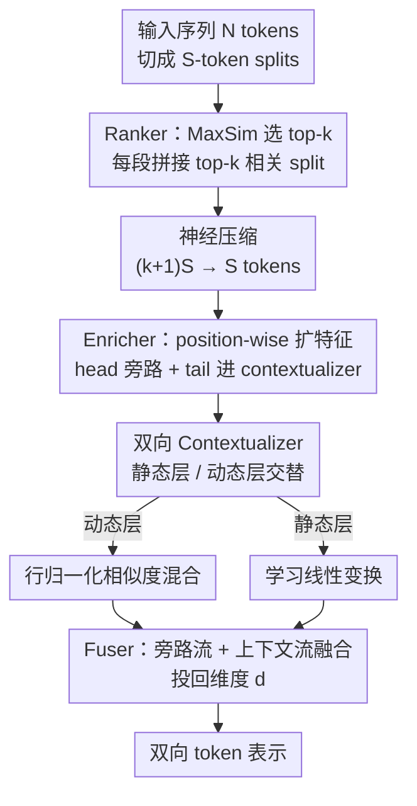

# Avey-B：把无注意力架构改造成双向编码器

**会议**: ICLR2026  
**OpenReview**: [https://openreview.net/forum?id=kQ9j5RY8ff](https://openreview.net/forum?id=kQ9j5RY8ff)  
**代码**: 待确认（论文称已开源全部实现与预训练 checkpoint）  
**领域**: LLM 预训练 / 编码器架构 / 无注意力架构  
**关键词**: 双向编码器, 无注意力, 检索式上下文, 动态参数化, 长上下文

## 一句话总结
Avey-B 把原本自回归的无注意力架构 Avey 改造成 BERT 式双向编码器：去掉因果掩码、把静态权重和动态相似度解耦成交替层、给动态层加行归一化、再在 ranker 里塞一个神经压缩器，结果在 token 分类和信息检索上稳超 BERT/RoBERTa/ModernBERT/NeoBERT，且预训练 token 量比 ModernBERT 少约 11×、在 96K 长度上吞吐快 ModernBERT 3.38×。

## 研究背景与动机
**领域现状**：在算力/显存吃紧的工业 NLP 场景里，紧凑型的预训练双向编码器（BERT、RoBERTa、ModernBERT、NeoBERT）一直是主力。它们靠 self-attention 同时看左右文，给每个 token 产出完全上下文化的表示，因此在分类、检索、抽取式问答这类判别任务上比单向解码器更强，而且模型小、微调便宜、部署时延和内存可控。

**现有痛点**：full self-attention 的时间和显存都是序列长度的二次方，这是个绕不开的瓶颈，直接限制了在成本敏感场景里把上下文窗口拉长。学界为缓解这点做了大量工作（线性注意力、RNN 式架构、状态空间模型等），但这些几乎都是为**单向/解码器**设计的，很少有人把它们搬到**双向、encoder-only** 这个范式上。

**核心矛盾**：双向编码器要的是「每个 token 都要被完整上下文化」，这天然要求一次前向就把所有位置都算出来；而要既省算力又保住双向上下文质量，就得找到一个不依赖 $O(N^2)$ attention、又能做选择性全局交互的机制。

**本文目标**：把最近提出的无注意力自回归架构 Avey 改造成双向编码器，并补上三处架构创新，让它在判别任务上打得过 Transformer 编码器、同时在长上下文上更省。具体子问题：(1) 怎么去掉因果性、做双向；(2) Avey 原本把静态权重和动态相似度逐元素耦合，会破坏「越相关贡献越大」的单调性，怎么修；(3) Avey 把每个 split 和它的 top-k split 拼接再处理，双向场景下每个 split 都要这么干，序列被放大约 $k{+}1$ 倍，怎么压回来。

**切入角度**：作者观察到，Avey 里基于余弦相似度的选择机制和「学习到的跨 embedding 线性变换」本身并不依赖因果顺序，所以它**天然适合改成双向**——这就像当年 GPT（解码器）到 BERT（编码器）的迁移，只不过底座从 Transformer 换成了无注意力的 Avey。

**核心 idea**：保留 Avey「ranker 选相关 split + 神经处理器上下文化」的骨架，去掉因果掩码做双向，再用「静态/动态解耦 + 行归一化 + 检索内容神经压缩」三招把质量和推理效率同时拉上去。

## 方法详解

### 整体框架
Avey-B 的输入是一段长为 $N$ 的序列，输出是每个 token 的双向上下文化表示。它沿用 Avey 的两大件——**ranker（排序器）**和**neural processor（神经处理器）**：先把序列切成每段 $S$ 个 token 的 split；对每个目标 split，ranker 用 MaxSim 算它和其它 split 的相关度、选出 top-k 最相关的 split；这些被选中的 split 经过**神经压缩**后送进神经处理器，由 enricher → contextualizer → fuser 三个模块逐层加工，产出最终表示。

Avey-B 相对原版 Avey 的改造集中在三处：**去因果掩码做双向**、**把 contextualizer 里耦合的静态权重和动态相似度拆成交替层并给动态层加行归一化**、**在 ranker 里加神经压缩器**。整体数据流如下图：

为读懂关键设计，先补两个 Avey 背景件。**Ranker**：把序列切成 $S$ token 的 split（不整除就补零），对目标 split 用 MaxSim 算和各 split 的相关度排序、取 top-k；选中的 split 先把 MaxSim 分数除以其中最大值做归一化，再按归一化分数加权后和当前 split 拼接（这叫 weighted-selective-split，既剪掉无关 split、又按相关度缩放每个 split 的贡献）。ranker 每次完整前向/反向只调用一次，训练期复杂度 $O(N^2 d)$。**Neural processor** 每层三模块：enricher 是 position-wise 网络，把每个 token 的 $d$ 维 embedding 升到 $m>d$ 维 $Z=\sigma(XU+b)$，再切成旁路头 $Z_h$（直接送 fuser，保留原始 token 特征、缓解层数加深时的过平滑）和尾 $Z_t$（送 contextualizer）；contextualizer 在 $Z_t$ 上做 embedding 间的混合；fuser 把旁路流和上下文流拼起来投回 $d$ 维 $f(Z)=[Z_h\,\|\,c(Z_t)]O$，并和该层输入做残差相加。

### 关键设计

**1. 双向上下文化：去掉因果掩码，让每个 token 同时看左右文**

Avey 原本是自回归的，contextualizer 里带因果掩码，每个 token 只能看左边。Avey-B 直接把这个掩码丢掉——当一个 split 和它的 top-k split 一起被上下文化时，允许其中**所有 token 互相交互**，没有任何因果约束。这一步把 Avey 从解码器式架构变成编码器式架构，但 ranker 带来的「选择性全局访问」（top-k 检索）依然保留。换句话说，双向化只动 contextualizer 的掩码，检索骨架原封不动，所以能无痛继承 Avey 解耦上下文宽度与序列长度的能力。

**2. 解耦静态/动态参数化：避免「越相关反而贡献越小」的反转**

这是论文最核心的改动。Avey 的 contextualizer（式 2）把一个学习到的静态权重矩阵 $V$ 和输入相关的余弦相似度矩阵 $N(Z_{tr})N(Z_{tr})^\top$ 做**逐元素相乘**，再用结果线性组合 embedding。问题在于：固定权重和数据驱动的相似度这么硬耦合，会出现一种病态——某个 token 明明和目标 token 更相似，最终贡献却被压得比更不相似的 token 还小。论文用图 1(a) 举例：若余弦相似度 $s_{21}>s_{31}$，理应 $e_2$ 对神经元 $n_1$ 的贡献不小于 $e_3$；但和学习权重逐元素相乘后，若 $w_{31}\gg w_{21}$，有效贡献 $s_{21}w_{21}$ 和 $s_{31}w_{31}$ 的大小关系可能被**反转**（推理时尤甚），削弱了从最有信息量 token 处的证据累积。这违反了「相关度单调性」：更相关的 token 贡献至少不该更小。

Avey-B 的修法是把两个参数来源（学习权重、输入相似度）**拆开、沿深度交替**：每层要么是静态层、要么是动态层。**静态层**做纯学习线性变换 $c_{static}(Z)=\sigma(VZ_{tr}+b^{(s)})$；**动态层**只按余弦相似度混合 $S=N(Z_{tr})N(Z_{tr})^\top$、$c_{dyn}(Z)=\sigma(\tilde S Z_{tr}+b^{(d)})$。这样动态层内部的相似度单调性被保住（$s_{21}>s_{31}$ 就保证 token 2 贡献多于 token 3，没有学习权重插进来作梗）；而静态层是「相似度无关」的——它顶多对神经元聚合结果施加一个全局（可能为负）增益 $w_{11}$，可能翻整体符号，但改不了动态层定下的幅度排序，因为 $|w_{11}s_{21}|/|w_{11}s_{31}|=s_{21}/s_{31}>1$。保留带符号的静态权重还能编码抑制性（inhibitory）模式。作者证明（附录 A）静态层虽然能改后续相似度赖以计算的表示，但改不了前面动态层已经打出的分数，因此不破坏其单调性。实验里最有效的排布是 $S\to D$ 交替重复（表 1）。

**3. 动态层行归一化：把相似度矩阵变成行随机算子，稳住深层训练**

光解耦还不够，作者发现动态层的相似度矩阵若不归一化，深层会出问题。于是给每个位置的相似度分数除以该位置所有分数之和：$\tilde S_{i,j}=S_{i,j}/(\sum_{j} S_{i,j}+\varepsilon)$（式 6，$\varepsilon>0$ 保证分母为正）。这让相似度矩阵变成**行随机算子**（行和 $\le 1$），从而限住每行的增益、抑制随深度增长的大奇异值，改善数值条件和可训练性。对照原版 Avey 不归一化时，膨胀的奇异值会让激活和梯度随深度发散，导致优化不稳、泛化变差。消融显示这种行归一化稳定地优于 softmax 和 RMS 式的替代方案（附录 E）。

**4. Ranker 内神经压缩：把 $(k{+}1)S$ 检索块压回 $S$，让 per-split 计算与 $k$ 解耦**

把 Avey 搬到双向会引出一个可扩展性问题。Avey 把每个当前 split 和它的 top-k 检索 split 拼接后一起上下文化，序列被放大约 $k{+}1$ 倍。自回归推理时这没事——只需把最近一个 split 展开；但双向推理时**每个 split 都得展开**才能产出完整的 token 级表示，开销直接爆掉，而编码器的推理效率在工业界又特别关键。

Avey-B 在 ranker 里加了一个**神经压缩器**：把拼接好的 $(k{+}1)S$ token 块用一个可学习矩阵 $P\in\mathbb{R}^{S\times(k+1)S}$ 线性压回 $S$ 个代表性 token，$\hat X=PX_{cat}$（式 8），$\hat X$ 取代 $X_{cat}$ 送进神经处理器。因为 $P$ 是学出来的，它能保留全局有用内容、丢掉冗余，换来漂亮的精度/吞吐折中。为防止把当前 split 的信号也压没了，压缩器输出和该 split 原始 $S$ token 之间加了残差连接，提升稳定性和下游效果。论文报告这一压缩让 per-split 上下文化的 token 数从 $(k{+}1)S$ 降到 $S$，吞吐提升 $4.37\times$（不过渐近复杂度仍是关于 $N$ 的二次方，没变）。神经处理器因此对每个 split 独立处理、token 数和原序列一致，吞吐高于 Transformer 编码器。

### 损失函数 / 训练策略
预训练沿用 BERT 的掩码语言建模（MLM）目标，扫出来最佳掩码率为 20%（表 1）。Avey-B 有 base 和 large 两档，各在 FineWeb 语料上预训练 180B token。最佳架构超参：序列长度 $N=2048$、split 大小 $S=256$、top-$k=3$，ranker 本身不做双向（表 1，附录 C–G）。下游微调按任务类别设置：SC/TC 各 1 epoch、QA 4 epoch、IR 1000 步；每个 benchmark 扫 4 个学习率 $\{2\times10^{-5},6\times10^{-5},1\times10^{-4},5\times10^{-4}\}$、各跑 10 个随机种子，取最佳学习率下种子中位数；学习率线性衰减、前 10% 步 warmup。

## 实验关键数据

### 主实验
评测覆盖四大类下游任务，每类三个 benchmark：序列分类 SC（MNLI/QQP/SST-2，准确率）、token 分类 TC（CoNLL-2003/OntoNotes/UNER，F1）、问答 QA（ReCoRD/SQuAD/SQuAD-v2，F1）、信息检索 IR（MLDR/MS MARCO/NQ，NDCG@10）。base 档各类别平均分如下：

| 模型 (base/medium) | SC Avg. | TC Avg. | QA Avg. | IR Avg. |
|--------|------|------|------|------|
| **Avey-B** | 88.78 | **93.59** | 62.45 | **63.83** |
| BERT | 87.14 | 89.82 | 57.65 | 57.42 |
| RoBERTa | 89.44 | 90.27 | **75.05** | 56.07 |
| ModernBERT | **89.61** | 92.78 | 74.44 | 54.29 |
| NeoBERT (M) | 85.36 | 88.20 | 55.67 | 39.98 |

base 档下，Avey-B 在所有任务类别上都超过 BERT 和 NeoBERT（参数比 NeoBERT 少约 85M），并在 TC、IR 两类上**超过所有 Transformer 编码器**；SC 上 QQP（与 ModernBERT 并列）和 SST-2 拿最佳，MNLI 略逊 RoBERTa/ModernBERT；QA 上 SQuAD-v2 领先，但 ReCoRD/SQuAD 落后 RoBERTa/ModernBERT。large 档下，Avey-B 同样在所有类别超 BERT/NeoBERT，并在 TC、IR 上超所有 Transformer。值得注意：**Avey-B 的 base 模型在 TC、IR 上甚至超过了所有 large 档 Transformer 编码器**，而它的预训练 token 量比 ModernBERT 少约 11×。

### 效率实验
固定 batch=8，在 H200 上测吞吐/时延随上下文长度变化。因 Avey 尚无 fused kernel，作者用 `torch.compile`（Avey-B-torch-compile）和 eager 两种配置，对照开/关 FlashAttention 的 ModernBERT、NeoBERT：

| 序列长度 | Avey-B 相对 ModernBERT | Avey-B 相对 NeoBERT |
|------|------|------|
| 128–96K 全程 | 始终更快 | 始终更快 |
| N = 96K | 3.38× | 11.63× |

吞吐随长度的幂律拟合 $T(N)\propto N^{-\alpha}$：Avey-B 的衰减指数 $\alpha\approx0.44$，远小于 ModernBERT 的 $0.77$ 和 NeoBERT 的 $0.81$，即随序列变长，Avey-B 吞吐下降速度大约只有 ModernBERT 的一半（相对 NeoBERT 更慢），优势随长度持续扩大。

### 关键发现
- **三招各有贡献**：解耦+交替静态/动态、动态层行归一化、ranker 神经压缩，消融（附录 H）逐一验证每招都带来增益；其中神经压缩单项把吞吐拉了 $4.37\times$。
- **Avey-B 强在 TC 和 IR**：作者归因于两点——TC 依赖短 span 内的局部证据，Avey-B 的 split 处理 + 剪掉低相关 split/token 提升了信噪比、锐化了 token 级表示；IR 受益于「把全局相关内容和它的近邻局部上下文选择性耦合」这一由检索机制显式注入的归纳偏置。而 Transformer 全 token 双向处理随长度变长容易引入干扰、稀释相关性。
- **设计选择落点**：交替 $S\to D$、行归一化、$N{=}2048/S{=}256/k{=}3$、ranker 不双向、掩码率 20%（表 1）。

## 亮点与洞察
- **「解耦单调性」是真问题**：把静态权重和余弦相似度逐元素相乘会让「更相似 → 更高贡献」这条直觉被反转，作者不仅指出来还给了反例和形式证明，再用「静态/动态交替层」干净地修掉——这种「相似度无关的静态层动不了动态层已打出的分数」的论证很有说服力，可迁移到任何「学习权重 × 数据相似度」的混合机制。
- **检索骨架天然好双向**：Avey 的余弦选择 + 跨 embedding 线性变换不依赖顺序，所以双向化只需删掉一个掩码，几乎零成本继承长上下文能力——这复刻了 GPT→BERT 的迁移逻辑，但换到无注意力底座上。
- **压缩器是工业向的实用招**：双向场景把序列放大 $k{+}1$ 倍这个隐患，用一个学习线性投影压回去，既保住「增大 $k$ 检索更多相关 token」的好处、又让 per-split 计算和 $k$ 解耦，是个直接面向编码器推理效率痛点的设计。
- **小 token 量打赢大模型**：在 TC/IR 上 base Avey-B 用约 1/11 的预训练 token 超过 large Transformer，说明「选择性检索 + 局部锐化」的归纳偏置在判别任务上确实比无差别全注意力更对路。

## 局限与展望
- **渐近复杂度没降**：神经压缩只是把常数因子里的 $(k{+}1)$ 拿掉，整体训练复杂度仍是关于序列长度的二次方 $O(N^2 d)$，长上下文的真正瓶颈没从根上解决。
- **缺 fused kernel**：效率对比是在 `torch.compile`/eager 下做的，而 ModernBERT/NeoBERT 用了 FlashAttention 等成熟手写 kernel——若 Avey-B 也补上专用 CUDA/Triton kernel，吞吐优势可能更大，但目前是「未优化 vs 已优化」的不完全对等比较，需谨慎解读。
- **QA 偏弱**：在 ReCoRD/SQuAD 这类抽取式问答上 Avey-B 落后 RoBERTa/ModernBERT，说明它的局部锐化偏置对需要细粒度跨 span 对齐的任务不一定占优；SC 的 MNLI 也略逊。
- **超参依赖**：$N/S/k$、交替模式、掩码率都是扫出来的最佳值，换语料或任务时这些是否稳健、ranker 该不该双向，仍需更多验证。

## 相关工作与启发
- **vs BERT / RoBERTa**：同为双向编码器、同走 MLM 预训练，但 BERT 系靠 $O(N^2)$ self-attention 做全 token 双向；Avey-B 无注意力，用 ranker 选择性检索 top-k split + 局部上下文化，长序列更省、TC/IR 更强，但 QA 上 RoBERTa 仍占优。
- **vs ModernBERT / NeoBERT**：后两者是「现代化 BERT」，叠加 RoPE、FlashAttention、SwiGLU、RMSNorm、全局/局部交替注意力等；Avey-B 不靠这些注意力优化，而是换架构底座，在 TC/IR 上用更少 token 反超，96K 长度吞吐快 ModernBERT 3.38×、快 NeoBERT 11.63×。
- **vs 原版 Avey**：Avey 是自回归、把静态权重和动态相似度耦合、每 split 拼 top-k 直接处理；Avey-B 去因果做双向、解耦静态/动态交替层、加动态层行归一化、加 ranker 神经压缩，是「GPT→BERT」式的编码器化重构。
- **vs 线性注意力 / SSM（Mamba 等）**：这些缓解二次方瓶颈的工作大多面向单向解码器，少有搬到 encoder-only；Avey-B 填了「无注意力 + 双向编码器」这块空白。

## 评分
- 新颖性: ⭐⭐⭐⭐ 把无注意力架构系统改造成双向编码器，并精准修掉耦合参数化的单调性病态，思路扎实。
- 实验充分度: ⭐⭐⭐⭐ 四类 12 个 benchmark + 多档规模 + 幂律效率拟合 + 大量消融，但效率对比存在 kernel 不对等。
- 写作质量: ⭐⭐⭐⭐ 动机、反例、形式化论证层层递进，方法叙述清楚。
- 价值: ⭐⭐⭐⭐ 用更少 token 在 TC/IR 上超大模型 + 长上下文显著更快，对成本敏感的工业编码器部署有实用价值。

<!-- RELATED:START -->

## 相关论文

- [\[ICLR 2026\] Conditioned Initialization for Attention](conditioned_initialization_for_attention.md)
- [\[ICLR 2026\] Block-Sample MAC-Bayes Generalization Bounds](block-sample_mac-bayes_generalization_bounds.md)
- [\[ICLR 2026\] Can Small Training Runs Reliably Guide Data Curation? Rethinking Proxy-Model Practice](can_small_training_runs_reliably_guide_data_curation_rethinking_proxy-model_prac.md)
- [\[ICLR 2026\] CHAMMI-75: Pre-training multi-channel models with heterogeneous microscopy images](chammi-75_pre-training_multi-channel_models_with_heterogeneous_microscopy_images.md)
- [\[ICLR 2026\] Deconstructing Positional Information: From Attention Logits to Training Biases](deconstructing_positional_information_from_attention_logits_to_training_biases.md)

<!-- RELATED:END -->
