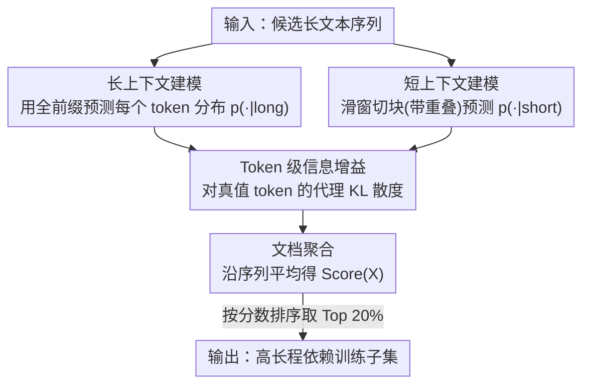

# Beyond Length: Quantifying Long-Range Information for Long-Context LLM Pretraining Data

**会议**: ICLR2026  
**OpenReview**: [https://openreview.net/forum?id=C9TDQ8Wwx7](https://openreview.net/forum?id=C9TDQ8Wwx7)  
**代码**: 待确认  
**领域**: LLM预训练 / 长上下文 / 数据筛选  
**关键词**: 长上下文预训练, 数据筛选, 信息增益, 条件互信息, KL散度

## 一句话总结
针对"长文本 ≠ 长依赖"这个被忽视的事实，提出 LongFilter——用同一个语言模型在长/短上下文下对每个 token 的预测分布做对比，量化"扩展上下文带来的信息增益"，据此筛掉那些虽然很长但其实只靠局部就能预测的样本；用筛后的数据继续预训练 LLaMA-3-8B（8K→64K），在 HELMET、LongBench、RULER 上平均提升 2 分以上，且约一半数据量即可达到等效效果。

## 研究背景与动机
**领域现状**：要让语言模型获得长上下文能力，主流做法是先在短上下文上预训练、再在长上下文数据上做"继续预训练"（continued pretraining），配合 RoPE 频率调整、位置插值等技巧把有效窗口从 8K 拉到 64K/128K。这条路线已经比较成熟，训练成本也在下降。

**现有痛点**：但绝大多数长上下文的数据工程都只盯着一个维度——**序列长度**：要么提高语料里长序列的占比，要么调长短序列的混合比例。问题是，长度长不代表内容真有长程依赖。一本诗集很长，但每首诗之间几乎没有依赖，单首诗本身又短，其实更适合短上下文；很多网页长文本是重复段、独立片段，或者下一个 token 用前面几十个 token 就能预测出来。在这种数据上训练，因为 loss 是对所有 token 平均的，那些"不需要长上下文"的 token 也在平摊学习信号，等于把训练信号稀释掉了，甚至会损害长上下文任务表现。

**核心矛盾**：判断一段长文本"是否真的依赖长程上下文"，光看长度做不到，需要一个能直接度量"长程依赖强弱"的信号。已有的相关尝试要么用的指标对短文本同样适用（没抓住长程这一点），要么用 attention score 当依赖强度——但研究已表明 attention 分数并不可靠地反映 token 重要性。

**本文目标**：设计一个专门衡量"扩展上下文对预测当前 token 有没有帮助"的打分函数，并据此从大语料里挑出真正富含长程依赖的样本。

**切入角度**：作者把已有"提高长序列占比"的做法看成"0→1"——让模型开始接触长上下文；本文要再走一步"1→2"——进一步提高那些**真正需要长上下文理解**的序列占比，把学习信号更多地分配到依赖扩展上下文的 token 上。

**核心 idea**：一条数据对长上下文训练有价值，当且仅当"长上下文确实让模型预测得更准"。把这个"信息增益"形式化为同一个模型在长上下文 vs 短上下文下对下一个 token 预测分布之间的 KL 散度，逐 token 计算再聚合成整条序列的分数。

## 方法详解

### 整体框架
LongFilter 是一个用于继续预训练的数据筛选框架。它不改模型、不改训练流程，只在"喂哪些数据"上做文章。核心是：用一个现成的因果语言模型，分别在**长上下文**和**短上下文**两种条件下，估计每个位置下一个 token 的预测分布；如果加上"扩展上下文"（长上下文里超出短上下文的那一段）后预测分布明显改变（KL 散度大），说明这段扩展上下文对该 token 有真实信息贡献；把逐 token 的信息增益沿整条序列平均，得到该样本的 LongFilter 分数；最后对所有样本排序，取高分的一部分作为长上下文继续预训练的数据。

整条流水线分三步：长上下文建模、短上下文建模、LongFilter 打分。

### 关键设计

**1. 信息增益 = 条件互信息，用代理 KL 把它落地到单条样本**

要回答"扩展上下文 $E$ 在已知短上下文 $S$ 的前提下，对预测下一个 token $T$ 还提供了多少额外信息"，理论上最对口的工具是**条件互信息**（CMI）$I(T;E\mid S)$，它衡量在已知 $S$ 后再观测到 $E$ 所减少的关于 $T$ 的不确定性。CMI 有一个等价写法把它表达成预测分布间 KL 散度的期望：

$$I(T; E \mid S) = \mathbb{E}_{p(s,e)}\Big[D_{\mathrm{KL}}\big(p(T\mid S=s, E=e)\,\|\,p(T\mid S=s)\big)\Big]$$

这个形式很直观：它度量的是"看到扩展上下文后的后验信念 $p(T\mid S,E)$"与"只看短上下文的先验信念 $p(T\mid S)$"之间的距离。对单条样本 $(e^*, s^*)$，取一次采样估计，就用这一项的 KL 散度做近似。但直接用整个词表上的 KL（式 4）有两个毛病：一是它不依赖真值 token $t^*$（同一个上下文，无论真值是什么分数都一样），二是要在整个词表 $V$ 上求和，代价很高。

**2. token 级代理分数：只盯真值 token，并按模型置信度加权**

为了既利用真值 token、又避免遍历词表，作者只保留 KL 求和里**对应真值 $t^*$ 的那一项**，得到 token 级代理分数：

$$\text{score}(t^*, s^*, e^*) = p(t^*\mid e^*, s^*)\,\log\frac{p(t^*\mid e^*, s^*)}{p(t^*\mid s^*)}$$

它可以读成：在已经观测到短上下文 $s^*$ 的前提下，扩展上下文 $e^*$ 为预测这个具体目标 $t^*$ 带来的增益。把整条序列 $X^*$ 上每个位置的分数沿长度平均，就是最终的 LongFilter 分数：

$$\text{Score}(X^*) = \frac{1}{N}\sum_{i=1}^{N} p(x^*_i\mid x^*_{i-\ell_{\text{Long}}:i-1})\,\log\frac{p(x^*_i\mid x^*_{i-\ell_{\text{Long}}:i-1})}{p(x^*_i\mid x^*_{i-\ell_{\text{Short}}:i-1})}$$

换成标准的逐 token 交叉熵损失（即负对数似然）来看更易理解。记 $L^{\text{long}}_i$、$L^{\text{short}}_i$ 分别是用长、短上下文预测真值 token 的损失，则

$$\text{Score}(X^*) = \frac{1}{N}\sum_{i=1}^{N}\exp(-L^{\text{long}}_i)\,\big(L^{\text{short}}_i - L^{\text{long}}_i\big)$$

这个形式把设计意图说得很清楚：分数偏爱那些**用长上下文比短上下文损失下降更多**（$L^{\text{short}}-L^{\text{long}}$ 大）的 token；而这个损失下降量还要乘上一个权重 $\exp(-L^{\text{long}})=p(x^*_i\mid \text{long})$，也就是模型在完整上下文下对该 token 的**置信度**。加这个权重是为了避免被噪声 token 误导——只有模型认为"在长上下文下这个 token 本来就该比较可信"时，它的增益才算数。这一点是相比朴素 KL 的关键改进：既省掉了词表求和，又把信号锚在真值 token 和模型置信度上。

**3. 长/短上下文建模：全前缀 vs 带重叠的滑窗短块**

打分需要两组分布。**长上下文建模**直接像因果语言模型训练那样，用每个位置的全部前缀预测下一个 token，得到 $p(\cdot\mid \text{long})$。**短上下文建模**则把整条文本切成较短的块，每块单独喂进同一个模型，从而把可见上下文限制在块边界内，得到 $p(\cdot\mid \text{short})$。这里有个工程细节：每个短块开头的几个 token 因为前文不足会预测不准，作者在切块时让相邻块之间**保留重叠**，避免块首 token 因上下文不足而拿到失真的短上下文分布。实验里短窗设 4K、长窗设 64K，用支持 128K 的 Llama-3.1-8B 做打分模型；两套分布算完后用上面的式子算分、排序，取高分子集。

### 损失函数 / 训练策略
LongFilter 本身不引入新的训练损失，它只是一个**离线数据打分+选择**的预处理。训练阶段沿用 ProLong 把 LLaMA-3-8B 从 8K 扩到 64K 的全部配置（优化器、学习率等），唯一改动是把 RoPE base 频率从 $5\times10^5$ 提到 $8\times10^6$，以及——最关键的——**只换训练数据**：用 LongFilter 选出的样本替代未筛选数据。batch 设为 4M tokens，训练 1000 步，共处理 4B tokens；数据构成为 80% 长文本 + 20% 短文本，筛选只作用于长文本部分，取分数 Top 20% 作为最终训练集。

## 实验关键数据

### 主实验
继续预训练 LLaMA-3-8B（8K→64K），在三个 SlimPajama 子语料（Arxiv / Book / CommonCrawl）上分别实验，对比 ProLong（同样数据源、同短长比，但不做信息增益筛选）与 LongWanjuan。LongBench Overall 结果：

| 语料 | 方法 | LongBench Overall |
|------|------|-------------------|
| Arxiv | ProLong | 38.58 |
| Arxiv | LongWanjuan | 39.36 |
| Arxiv | **LongFilter** | **39.52** |
| Book | ProLong | 37.47 |
| Book | LongWanjuan | 37.69 |
| Book | **LongFilter** | **39.81** |
| CC | ProLong | 38.37 |
| CC | LongWanjuan | 40.02 |
| CC | **LongFilter** | **40.66** |

RULER 上的 Overall（更侧重 NIAH/结构化检索）优势更明显，尤其在 Book 语料：

| 语料 | 方法 | RULER Overall |
|------|------|---------------|
| Arxiv | ProLong / LongWanjuan / **LongFilter** | 69.28 / 69.69 / **70.13** |
| Book | ProLong / LongWanjuan / **LongFilter** | 73.35 / 73.74 / **78.95** |
| CC | ProLong / LongWanjuan / **LongFilter** | 72.59 / 74.08 / **75.37** |

### 数据效率 / 收敛分析

| 配置 | 关键指标 | 说明 |
|------|---------|------|
| 未筛选数据 | 需 3–4B tokens | 达到某一 HELMET 水平所需训练量 |
| LongFilter 筛选 | 约 1.5B tokens | 达到同等水平，约**省一半数据** |
| HELMET（随训练量增长） | 各语料均更高且更稳 | 在 0.5B–1B 小规模即超过 ProLong/LongWanjuan，4B 时 Recall 任务普遍 >90 |

### 关键发现
- **省一半数据**：用 1.5B 筛选后 tokens 就能匹配未筛选数据 3–4B tokens 的效果，说明信息增益筛选确实把训练信号集中到了"该学的 token"上。
- **长程依赖任务收益最大**：在 LongBench 的 Synthetic（CC 上 57.02）和 RULER 的 MultiKey/MultiValue/MultiQuery 等结构化检索任务上提升最显著——这些任务恰恰强依赖"从上下文任意位置取信息"的能力。
- **打分可解释**：token 级分数可视化显示，一篇博士论文的连贯学术散文得高分，而 TikZ 绘图代码这类缺乏长程语义结构的重复内容得低分；高分文档（AvgScore≈0.55）与低分文档（AvgScore≈0.01）相差近两个数量级。

## 亮点与洞察
- **把"长文本 ≠ 长上下文"这件直觉的事做成了可计算的分数**：用同一个模型长/短两种条件的预测分布对比，绕开了"靠长度近似依赖"的老路，这个视角干净且可迁移。
- **代理 KL 的两步简化很巧**：先从全词表 KL 退到"只取真值 token"项（省掉词表求和、并让分数依赖真值），再用 $\exp(-L^{\text{long}})$ 给损失下降量加置信度权重（防噪声 token 刷分）——这两步把一个理论量 CMI 变成了能在大语料上跑得动的工程指标。
- **零模型改动、纯数据侧增益**：不动结构、不动训练流程，只换数据就拿到 2 分以上提升，意味着这套打分可以正交地叠加到任何长上下文继续预训练流程上。
- **可迁移性**：这套"长短上下文预测分布差"的思路不只用于筛选，也能当作数据质量诊断/可视化工具（哪段文本真有长程依赖一目了然），甚至有潜力推广到 token 级别的训练加权。

## 局限与展望
- **打分成本不低**：要对每条样本在长窗（64K）下跑一遍前向，作者用 32 张 H100 才把单语料压到一天内；对更大规模语料或更长窗口，离线打分开销仍可观。
- **打分模型本身的能力上限**：信息增益由打分模型（Llama-3.1-8B）的预测分布定义，如果打分模型自己长上下文能力弱，可能低估某些真实长程依赖；用更强模型打分 vs 用待训模型打分之间的关系文中未深入。
- **代理分数 vs 真 CMI 的偏差**："只取真值 token 一项 + 置信度加权"是对 CMI 的近似，何时近似得好、何时会偏，缺乏理论刻画（等价性推导放在附录）。
- **筛选比例与混合比例**：Top 20%、80/20 长短混合等是经验设定，不同语料/不同目标窗口下的最优比例是否一致还需更多实验；目前只在 LLaMA-3-8B 8K→64K 一种设置上验证。

## 相关工作与启发
- **vs ProLong（Gao et al., 2024）**：ProLong 调长短数据混合比例，但在长文本内部不区分"是否真有长依赖"，从全部数据采样；本文在 ProLong 的训练配置上只把长文本部分换成 LongFilter 选出的高增益子集，结果三个语料全面胜出，说明长度/比例之外，"长程信息含量"是被忽略的关键维度。
- **vs LongWanjuan（Liu et al., 2024c）**：LongWanjuan 也提了若干长文本质量指标，但多数指标对短文本同样适用、且其基于模型的过滤所用窗口太短（最长窗口仅相当于本文的短窗），抓不住真正的长程依赖；本文显式用长 vs 短上下文的预测差来定义信号。
- **vs LongAttn（Wu et al., 2025）**：LongAttn 用 attention score 建模长程依赖，但 attention 分数并不可靠地反映 token 重要性；本文改用预测分布的 KL 散度，绕开了 attention 可解释性的争议。
- **vs 短上下文数据筛选（质量分类器/去重/启发式）**：这些方法在短上下文预训练上很成功，但几乎都不是为长上下文设计的；本文填的正是"长上下文专属数据工程"这块空白。

## 评分
- 新颖性: ⭐⭐⭐⭐ 把"长文本≠长上下文"形式化为可计算的条件互信息代理分数，视角清晰、切入点新。
- 实验充分度: ⭐⭐⭐⭐ 三语料 × 三大长文本 benchmark + 数据效率与 token 级可视化，较完整；但只在单一模型/单一窗口设置上验证。
- 写作质量: ⭐⭐⭐⭐ 动机—公式—工程实现层层递进，CMI→代理分数的推导讲得清楚。
- 价值: ⭐⭐⭐⭐ 零模型改动、约省一半数据，可正交叠加到现有长上下文继续预训练流程，实用性强。

<!-- RELATED:START -->

## 相关论文

- [\[ICLR 2026\] Beyond URLs: Metadata Diversity and Position for Efficient LLM Pretraining](beyond_urls_metadata_diversity_and_position_for_efficient_llm_pretraining.md)
- [\[ICLR 2026\] Pretraining with Hierarchical Memories: Separating Long-Tail and Common Knowledge](pretraining_with_hierarchical_memories_separating_long-tail_and_common_knowledge.md)
- [\[ICML 2026\] On Training Large Language Models for Long-Horizon Tasks: An Empirical Study of Horizon Length](../../ICML2026/llm_pretraining/on_training_large_language_models_for_long-horizon_tasks_an_empirical_study_of_h.md)
- [\[ICLR 2026\] Distilled Pretraining: A modern lens of Data, In-Context Learning and Test-Time Scaling](distilled_pretraining_a_modern_lens_of_data_in-context_learning_and_test-time_sc.md)
- [\[ICLR 2026\] Beyond Multi-Token Prediction: Pretraining LLMs with Future Summaries](beyond_multi-token_prediction_pretraining_llms_with_future_summaries.md)

<!-- RELATED:END -->
