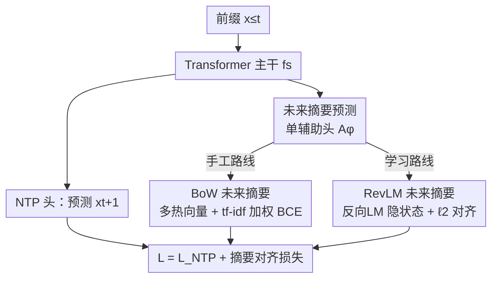

# Beyond Multi-Token Prediction: Pretraining LLMs with Future Summaries

**会议**: ICLR2026  
**OpenReview**: [https://openreview.net/forum?id=aeYIFVn4vb](https://openreview.net/forum?id=aeYIFVn4vb)  
**代码**: 待确认  
**领域**: LLM 预训练 / 预训练目标  
**关键词**: 预训练目标, 多 token 预测, teacher forcing, 反向语言模型, 未来摘要

## 一句话总结
这篇论文提出 **未来摘要预测（Future Summary Prediction, FSP）**：在标准的下一 token 预测之外挂一个辅助头，让模型预测对**长程未来序列的紧凑摘要**（而不是逐个预测未来若干 token），并给出两种摘要构造方式——手工的词袋摘要（FSP-BoW）和用反向语言模型蒸馏出来的学习式摘要（FSP-RevLM）；3B/8B 大规模预训练实验显示它在数学、推理、代码任务上稳定超过 NTP 与多 token 预测（MTP），数学任务上最高提升约 4–5 个百分点。

## 研究背景与动机
**领域现状**：当前大模型预训练的基石是 **下一 token 预测（NTP）+ teacher forcing**——训练时总是用真实历史 $x_{\le t}$ 去预测下一个 token $x_{t+1}$。在「数据墙」逼近、单纯堆数据/算力收益递减的背景下，大家转而想从固定数据里榨出更多预测信号，于是出现了 **多 token 预测（MTP）**：用多个辅助头同时预测 $x_{t+2}, x_{t+3}, \dots$，已被 DeepSeek-V3、Qwen-3 等系统采用。

**现有痛点**：teacher forcing 带来两个老问题——**曝光偏差**（推理时模型要吃自己的输出，误差累积，长程生成质量下降）和 **捷径学习**（模型直接从真实前缀里抄局部线索，而不去学真正的长程依赖）。MTP 只能缓解一点点：它的辅助头预测的是**紧邻的几个未来 token**，仍是短程；而且各辅助头通常假设给定前缀后未来 token 相互独立，对长程联合分布逼近很差。想覆盖更长未来就得加更多辅助头，但「一个 token 一个头」根本不可扩展。

**核心矛盾**：真正有信息量的监督信号可能藏在**很远的未来**，远超 MTP 预测的窗口 $k$；但逐 token 地把未来全预测出来，代价上不可承受。模型既需要「看得够远」又要「头的数目可控」。

**本文目标**：用**单个**辅助头，把长程未来的信息压进一个**摘要向量**里当监督目标，从而在不爆炸辅助头数量的前提下大幅减少 teacher forcing。

**切入角度**：作者用一个「teacher forcing 程度」的直觉来串起 NTP→MTP→FSP——每暴露一个真实 token，模型被要求预测多少关于未知 token 的信息？要求越多，teacher forcing 越弱。NTP 最强（只预测下一个），MTP 弱一点（预测一小块），FSP 最弱（预测整段未来的全局性质）。

**核心 idea**：用「预测未来的**摘要**」代替「预测未来的**逐个 token**」——并进一步指出手工摘要会把不相关的未来也塞进来，于是用一个反向语言模型学出「只保留对当前预测有用的未来」的自适应摘要。

## 方法详解

### 整体框架
FSP 把一个标准 Transformer 主干 $f_s$ 的输出分给两条头：一条是常规的 **NTP 头** $f_h$，照旧预测 $x_{t+1}$；另一条是 **摘要辅助头** $f'_{ha}$（记作 $A_\phi$），它不预测具体 token，而是去逼近一段未来 $(x_{t+2},\dots,x_{t+\tau})$ 的摘要向量 $a(t,\tau)$。总目标是在 NTP 损失上加一项摘要对齐损失：

$$\mathcal{L}_{\text{FSP}} = \mathcal{L}_{\text{NTP}} + \mathbb{E}_{x}\big[\, l_a\big(A_\phi(x_{\le t}),\, a(t,\tau)\big)\,\big]$$

整个架构其实是 NTP / MTP / FSP 的统一抽象：区别只在「辅助头预测什么目标」。FSP 的关键好处是辅助头**只有一个**，所以无论想覆盖多长的未来，结构开销都不变。剩下的核心问题就是「摘要 $a(t,\tau)$ 怎么构造」，作者给了两条路线：手工词袋摘要、反向语言模型学习式摘要。推理阶段辅助头被丢弃，只留主干 + NTP 头正常自回归生成——FSP 纯粹是个预训练期的辅助监督。

### 关键设计

**1. 未来摘要预测（FSP）：用一个辅助头压住整段未来，而不是堆头逐 token 预测**

这是全文的统一框架，直接针对「MTP 要看得远就得加头、加头不可扩展」的痛点。FSP 不再让 $k$ 个辅助头各预测一个紧邻 token，而是只用 $A_\phi(x_{\le t}) = f'_{ha}\circ f_s(x_{\le t})$ 这一个头，去匹配一段未来 $(x_{t+2},\dots,x_{t+\tau})$ 的摘要 $a(t,\tau)$。这样做之所以有效，是因为它把「覆盖多长未来」和「需要多少辅助头」**解耦**了——$\tau$ 可以取到几十甚至上百，而结构成本恒为一个头。更关键的是，被要求预测一段未来的全局摘要，会**强迫模型减少 teacher forcing**：它没法再靠真实前缀的局部线索抄捷径，必须对整条未来轨迹的丰富性质做规划。作者用 NTP→MTP→FSP 的 teacher forcing 递减谱系把这点讲清楚：NTP 每步只赌下一个 token（最强 teacher forcing），FSP 每步要交代整段未来的概要（最弱）。

**2. FSP-BoW（手工词袋摘要）：把未来窗口压成一个「会出现哪些词」的多热向量**

这是摘要的第一种具体实现，回答「summary 最朴素能怎么造」。在每个位置 $t$，对未来窗口定义一个词表上的多热向量 $a(t,\tau)_i = \mathbb{I}\big(i\in\{x_{t+2},\dots,x_{t+\tau}\}\big)$——只标「这些词会不会在未来出现」，**不关心它们出现在哪个位置**。辅助头输出 logits $z_i$，用一个**重加权的二元交叉熵**来训练：

$$l_a = -\sum_{i=1}^{V} w(i)\big[\,a_i\log\sigma(z_i) + (1-a_i)\log(1-\sigma(z_i))\,\big]$$

其中 $w(i)$ 体现 token $i$ 的重要度（如 tf–idf），用来压低高频虚词的权重、突出有信息量的词。它的价值在合成的 **path-star 图任务**上很直观：NTP 会学到「扫一遍邻接表、从 $v_i$ 直接抄出 $v_{i+1}$」的捷径，导致除第一步外梯度饿死（gradient starvation），无法学会长程规划；而 BoW 把整条路径上的未来节点一次性压进监督目标，捷径失效，模型被逼着规划整条路径，于是在 $G(2,6)$、$G(2,8)$ 上都做到满分，而 MTP 随路径变长会退化。

**3. FSP-RevLM（学习式摘要）：用反向语言模型蒸馏出「只留有用未来」的自适应摘要**

BoW 的毛病是「一视同仁」——它把窗口里**所有**未来 token 都塞进目标，但很多未来其实与当前预测无关，反而成了噪声（在 sibling discovery 任务上，跨组件的未来 token 对预测当前兄弟节点毫无帮助）。FSP-RevLM 用一个**反向语言模型** $Q_\psi$ 来解决：它在「从右往左」的序列上训练，目标是 $-\mathbb{E}\big[\sum_t \log Q_\psi(x_{t+1}\mid x_{\ge t+2})\big]$，于是它的隐状态 $a(t, T{-}t) = g_h\circ g_s(x_{\ge t+2})$ 天然是一段未来的**紧凑、且偏向「对预测当前 token 有用」的表示**。正向模型的辅助头再用 $\ell_2$ 损失去匹配这个表示：

$$l_a = \big\|\,A_\phi(x_{\le t}) - g_h\circ g_s(x_{\ge t+2})\,\big\|_2^2$$

本质上这是把「反向顺序的信息」蒸馏进正向模型。之所以比 BoW 更鲁棒：反向 LM 学到的表示会自动**强调可预测、有信息的未来、过滤掉本就不可预测或无关的部分**，因此在 sibling discovery 上随组件数增加仍持续比 NTP 收敛更快，而 BoW 只在组件少时有效、超过约 6 个组件收益就消失。代价是反向模型与正向模型同尺寸、同步数训练，使总训练算力约翻倍；作者按蒸馏惯例做 iso-data（而非 iso-compute）比较，并辩护说在「算力富裕、数据受限」的当下，用更多算力从固定数据里榨取增益是划算的。

### 损失函数 / 训练策略
- 总损失 $\mathcal{L}_{\text{FSP}} = \mathcal{L}_{\text{NTP}} + l_a$；FSP-BoW 的 $l_a$ 为 tf-idf 重加权 BCE，FSP-RevLM 的 $l_a$ 为 $\ell_2$ 表示匹配。
- 训练规模：3B（250B tokens）与 8B（1T tokens），数据以 DCLM 类语料 + GitHub 为主，辅以数学/编程专项语料。
- 公平性约定：所有方法 iso-data；为对齐 FSP 的「单辅助头」，MTP/DS-MTP 也限制为单个预测紧邻 token 的辅助头。FSP-RevLM 的反向模型与正向同尺寸同步数，故总算力约 ×2，按蒸馏惯例不计入对比预算。

## 实验关键数据

### 主实验
8B 预训练（pass@16 用于 code/math，accuracy 用于 ARC，3 个 seed 均值）：

| 任务 | NTP | MTP | DS-MTP | FSP-RevLM |
|------|-----|-----|--------|-----------|
| ARC-Easy | 0.718 | 0.736 | 0.617 | **0.766** |
| ARC-Challenge | 0.531 | 0.552 | 0.426 | **0.559** |
| GSM8K | **0.716** | 0.678 | 0.704 | 0.705 |
| MATH | 0.342 | 0.309 | 0.335 | **0.351** |
| MBPP | 0.657 | 0.672 | 0.678 | **0.683** |
| HumanEval+ | 0.478 | **0.541** | 0.526 | **0.541** |

FSP-RevLM 在 ARC-Easy/Challenge、MATH、MBPP 上领先，HumanEval+ 与 MTP 持平；仅 GSM8K 上 NTP 略高但 FSP-RevLM 仍把差距拉近。3B 规模下 DS-MTP 是更强的整体 baseline，但 FSP-RevLM 在数学推理上反超它，且从 3B 到 8B **相对增益随规模放大**、整体反超 DS-MTP。

### 消融实验
8B 上不同未来摘要策略作为辅助头目标（节选）：

| 配置 | GSM8K | MATH | ARC-Easy | 说明 |
|------|-------|------|----------|------|
| MTP（预测紧邻 token） | 0.678 | 0.309 | 0.736 | 基线 |
| MTP-Skip τ:12（随机/跳跃 token） | 0.621 | 0.287 | 0.710 | 随机采未来 token，反而更差 |
| FSP-BoW τ:12 | 0.699 | 0.331 | 0.737 | 词袋摘要，数学明显提升 |
| FSP-BoW τ:100 | 0.714 | 0.331 | 0.662 | 更长窗口进一步推高 GSM8K |
| FSP-RevLM | 0.705 | **0.351** | **0.766** | 学习式摘要，全任务最稳 |

### 关键发现
- **「预测什么未来」比「预测多少 token」更重要**：随机/跳跃地采未来 token（MTP-Skip）比预测紧邻 token 的 MTP 还差，且窗口越大越差；而把未来**聚合成摘要**（BoW / RevLM）才带来增益。
- **手工 vs 学习式的分水岭在「未来是否都相关」**：path-star（整条未来都有用）上 BoW 就够，sibling discovery（只有部分未来相关）上 BoW 随组件增多失效、RevLM 才持续有效。
- **数学推理收益最大**：FSP-RevLM 在 MATH（+4.2）、GSM8K（+3.5，相对 MTP）提升最明显，且 Figure 5 显示它在不同 pass@k 下输出**多样性**更高。
- **规模友好**：FSP-RevLM 的相对优势随 3B→8B 扩大，暗示该辅助信号在大模型上更值。

## 亮点与洞察
- **一个统一框架收编了一堆预训练目标**：NTP / MTP / 随机 token MTP / BoW / RevLM 都能套进「辅助头预测某种未来摘要」的同一抽象，差别只在摘要的构造。这种「换目标不换结构」的视角，本身比任一具体方法更有迁移价值。
- **「单头压长程」破解了 MTP 的扩展性死结**：把「看多远」和「几个头」解耦，是个干净且可复用的工程思路——任何想引入长程监督又怕结构爆炸的场景都能借鉴。
- **用反向 LM 当「未来摘要老师」很巧**：右到左训练的隐状态天然是「对预测当前有用的未来表示」，再用 $\ell_2$ 蒸馏进正向模型，等于把双向信息单向化注入，且推理零额外开销。
- **teacher forcing 谱系是个好讲法**：用「每暴露一个真 token，模型要交代多少未知信息」把三类目标排成一条线，给「为什么要预测摘要」提供了清晰直觉。

## 局限与展望
- **训练算力翻倍**：FSP-RevLM 需要一个同尺寸的反向 LM，总 FLOPs 约 ×2；作者用 iso-data 而非 iso-compute 比较，是否「公平」取决于你站在数据受限还是算力受限的视角。
- **GSM8K 上未稳赢 NTP**：8B 上 NTP 仍以 0.716 vs 0.705 略胜，说明摘要监督并非对所有数学任务一致更优。
- **3B 上不及 DS-MTP**：小规模时学习式摘要的优势尚未显现，方法的吸引力高度依赖「够大 + 数据墙」的前提。
- **摘要构造仍偏经验**：窗口 $\tau$、tf-idf 权重、从反向 LM 哪层取表示等都需调，缺乏自动选择机制；BoW 的「无序词袋」也丢掉了未来 token 的顺序信息。
- **可改进方向**：让正向模型自身蒸馏反向信号以省掉独立反向 LM、或把 BoW 与 RevLM 摘要联合监督、对 $\tau$ 做自适应，都值得探索。

## 相关工作与启发
- **vs MTP / DeepSeek-MTP**：它们用多辅助头预测紧邻未来 token，受短程视野和「头数随未来长度爆炸」的限制；FSP 用单头预测未来摘要，把长程信息装进一个目标，结构开销恒定。
- **vs 随机/跳跃 token MTP（Thankaraj/Gerontopoulos 等）**：靠启发式采样未来 token 来提效，但容易漏掉最有信息的长程信号；FSP-RevLM 用学习式摘要主动抽取相关长程信息。
- **vs SemFormer（Yin et al., 2024）**：SemFormer 引入特殊「规划 token」、靠自编码学未来嵌入，且只在指定位置施加未来监督；FSP 不需要特殊 token，在**每个位置**经辅助头施加摘要对齐，且用反向 LM 学未来表示。
- **vs Twin Networks / Belief State Transformer / Meet-in-the-Middle**：这些都利用了反向/双向信号，但 BST 主要构造紧凑信念态、未显式针对 teacher forcing；MiM 靠参数共享 + 一致性正则并假设正反输出分布严格匹配；FSP-RevLM 走**蒸馏**路线（不共享参数、不要求分布严格相等），且把 RevLM 放进一个更一般的「未来摘要预测」框架里解释何时该用何种摘要。

## 评分
- 新颖性: ⭐⭐⭐⭐⭐ 「预测未来摘要」的统一框架 + 反向 LM 蒸馏自适应摘要，视角和方法都新。
- 实验充分度: ⭐⭐⭐⭐ 3B/8B 大规模 + 两个合成任务 + 多策略消融，但算力门槛高、未做 iso-compute。
- 写作质量: ⭐⭐⭐⭐⭐ teacher forcing 谱系串起全文，合成任务把「长摘要/自适应摘要为何重要」讲得很透。
- 价值: ⭐⭐⭐⭐ 在数据墙背景下给出一条「用算力换数据效率」的预训练目标新路，对大规模预训练有现实意义。

<!-- RELATED:START -->

## 相关论文

- [\[ACL 2026\] Toward Consistent World Models with Multi-Token Prediction and Latent Semantic Enhancement](../../ACL2026/llm_pretraining/toward_consistent_world_models_with_multi-token_prediction_and_latent_semantic_e.md)
- [\[ICLR 2026\] Beyond URLs: Metadata Diversity and Position for Efficient LLM Pretraining](beyond_urls_metadata_diversity_and_position_for_efficient_llm_pretraining.md)
- [\[ACL 2025\] Pre-Training Curriculum for Multi-Token Prediction in Language Models](../../ACL2025/llm_pretraining/pre-training_curriculum_for_multi-token_prediction_in_language_models.md)
- [\[ICLR 2026\] Beyond Length: Quantifying Long-Range Information for Long-Context LLM Pretraining Data](beyond_length_quantifying_long-range_information_for_long-context_llm_pretrainin.md)
- [\[ICML 2025\] Position: The Future of Bayesian Prediction Is Prior-Fitted](../../ICML2025/llm_pretraining/position_the_future_of_bayesian_prediction_is_prior-fitted.md)

<!-- RELATED:END -->
