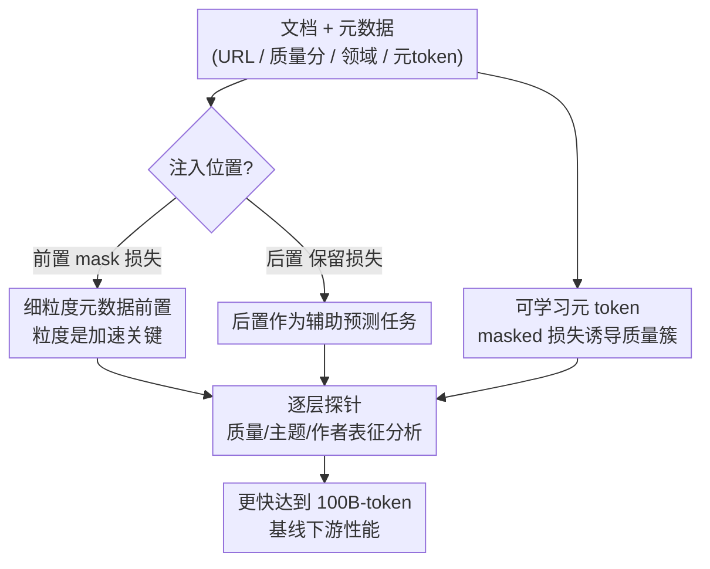

# Beyond URLs: Metadata Diversity and Position for Efficient LLM Pretraining

**会议**: ICLR2026  
**OpenReview**: [https://openreview.net/forum?id=fZ64NwiBpt](https://openreview.net/forum?id=fZ64NwiBpt)  
**代码**: 待确认  
**领域**: LLM预训练 / 数据工程  
**关键词**: 元数据条件化, 预训练加速, 细粒度元数据, 辅助预测任务, 表征探针

## 一句话总结
这篇论文系统地拓宽了"元数据条件化加速 LLM 预训练"的设计空间：除了已知有效的 URL 前置，作者发现**细粒度**的质量分数与领域信息同样能加速训练，并提出"后置元数据作为辅助预测任务"和"可学习元 token"两种新机制，再用逐层探针揭示这些信号如何重塑潜在表征。

## 研究背景与动机
**领域现状**：LLM 预训练的效率优化长期聚焦在"保留哪些网页数据、用多少"——靠 C4、RefinedWeb、FineWeb 这类语料的启发式过滤与去重，或基于困惑度/重要性的数据选择来分配算力。一条互补的轴线是**给输入注入文档级元数据**（来源、领域、时间等）让模型条件化地学习表征。最近的 MeCo（Gao et al., 2025）和 Fan et al.（2025）把这件事形式化为"元数据条件化"：在文档前面**前置**简单可得的指示符（如源 URL、领域标签），就能省下 30–40% 的预训练 token，并在推理时用一个"冷却"阶段去掉对元数据的依赖。

**现有痛点**：但已有证据几乎只支持"前置 URL"这一种信号。系统比较反而报告：其他唾手可得的元数据（粗粒度主题、质量指标）在同等预算下**没能**展现可比的加速。于是三个问题悬而未决——(1) 除了 URL，还有没有别的元数据能加速？(2) 除了前置，还有没有别的注入位置（后置、特殊 token 段头、旁路）有用？(3) 元数据到底如何重塑预训练中的潜在表征？机制层面几乎是黑箱。

**核心矛盾**：之前"质量分数/领域信息没用"的结论，可能不是这些信息本身没用，而是**粒度太粗**。粗粒度标签（如只有 3 档质量、24 类主题）携带的区分信息太少，模型学不到额外结构。

**本文目标**：把元数据的"类型 × 位置"设计空间整体铺开做实验，找出真正有效的信号与位置，并用探针给出"为什么有效"的机制证据。

**切入角度**：作者注意到所有已知有效的元数据（典型就是 URL）有个共同特征——它在**很细的粒度**上编码信息（一条完整 URL 几乎能唯一标识一个文档）。于是假设：**细粒度才是加速的关键**，而非元数据的具体语义类型。

**核心 idea**：用"细粒度"统一解释元数据加速效应——把质量分数、领域信息也做到足够细，它们就和 URL 一样能加速；同时把元数据从"前置条件"扩展为"后置辅助预测任务"和"可学习元 token"两种新形态。

## 方法详解

### 整体框架
本文不是提出单一新模型，而是把"元数据如何进入预训练"拆成**两个正交维度**做系统探索：**元数据类型**（URL / 粗细两档质量分数 QS / 粗细两档领域信息 DI / 可学习元 token）× **注入位置**（前置 prepend / 后置 append）。所有元数据都用一对特殊 token `<boc>`（begin-of-context）和 `<eoc>`（end-of-context）包裹，前置时放在 `<s>` 与文档之间、后置时放在文档之后；长文档切成多段时每段都附上元数据，并恒定做 10% 的元数据 dropout。两种位置的关键差别在**损失处理**：前置时元数据 token 在反向传播里被 mask 掉（只当条件、不预测）；后置时则**保留**元数据的损失参与反传，从而把"预测元数据"变成一个辅助任务。

整套实验在 1.5B Llama（16 层）上、FineWeb-Edu 语料、用 Megatron-LM 训练，并辅以一套**逐层探针**（layer-wise probing）：在冻结表征上训练三层 MLP 分类器去预测文档的质量/主题/作者，从而把"加速"翻译成"潜在表征里多编码了什么"。

### 关键设计

**1. 细粒度元数据前置：粒度而非语义类型才是加速的关键**

针对"质量/领域信息此前被判定无效"的痛点，作者把它们做细：粗粒度质量分数 QS-coarse 只有 3、4、5 三档（FineWeb-Edu 的 `int_score`），细粒度 QS-fine 直接取回归器原始分并放大成 $\lfloor \text{score} \times 10 \rfloor$（25–50 的两位数，至少细 10 倍）；领域信息 DI-coarse 用 WebOrganizer 的 24×24=576 类，DI-fine 则让 Llama3.1-8B 开放式生成主题/格式标签（类别数无上限）。结果（Table 1、Figure 2 左）很干净：URL 和 QS-fine 都只用 **60B token** 就追平标准训练 **100B token** 的下游均分，DI-fine 用少 20B token 超过基线；而它们的粗粒度版本几乎没有变化。这支撑了**Observation 1——只有细粒度条件化才有正向加速**。机制上，作者对"主题预测"做探针（Figure 4），发现细粒度前置的模型在各层都把主题信息编码得更好，证实细粒度帮模型在潜在空间里更有效地刻画文档的显著属性。一个有趣的反例是 URL 内部解剖：把 URL 拆成前缀（`https://`）、域名、后缀，注意力大量聚到**前缀**上（典型的 attention sink），但消融（Table 2）显示只前置前缀完全无加速；真正有用的是域名和后缀，且二者编码互补信息、单独都追不平完整 URL——说明"注意力多"不等于"贡献大"（Observation 2）。

**2. 后置元数据作为辅助预测任务：用"预测元数据"当软正则**

前置是把元数据当**条件**喂进去，后置则反过来——让模型读完整段后去**预测**这段的质量分/主题。由于后置时元数据损失参与反传，这等价于给模型加了一个辅助目标，逼它把序列的显著信息压进隐藏状态才能在末尾恢复出元数据，相当于一种软正则。实验（Figure 2 右、Table 1）显示后置 DI-fine 帮助最大，后置 QS-coarse 和 URL 也有效，整体能省约 **20% token**（弱于前置但仍正向），即 **Observation 3**。这里出现一个反直觉现象：后置 **QS-coarse 反而比 QS-fine 好**。按理 QS-fine 模型只要预测两位数的第一位就能达到 QS-coarse 的效果，但它没这么做；探针（Figure 7）揭示 QS-fine 模型**过度专精**在质量预测这个辅助任务上——它在"预测质量"探针上略强，却在与质量无关的"主题预测"探针上更弱，说明细粒度辅助任务挤占了学习其他通用能力的容量。这与前置正相反，提示"细粒度"并非放之四海皆好，得看它是当条件还是当预测目标。

**3. 可学习元 token：模型能自行编码质量感知的潜在簇**

前两个设计都依赖**外部已有**的元数据标注。作者进一步问：模型能不能**自己**学出元信息？为此往词表里加 5 个全新的空 token `<s1>`–`<s5>`，以 0.9 概率前置到每段（同样 `<boc>/<eoc>` 包裹、损失 mask 掉反传）。这 5 个 token 内容完全相同，所以编码信息的只能是**注意力模式**。结果（Figure 2 左）它们同样带来加速；分析（Figure 9）发现：在最后一层，高质量文档对 `<s4>` 的注意力显著低于中低质量文档，且把前 100 token 到这些元 token 的注意力向量做欧氏距离统计，**簇间距离持续大于簇内距离**——不同质量等级的文档呈现出可区分的注意力指纹。这就是 **Observation 4**：LLM 能在本身不带语义的可学习 token 上，自发编码出质量感知的潜在簇结构（而主题/格式没有这么清晰的分离）。

**4. 逐层表征探针：定位元数据到底改写了哪一层的什么概念**

贯穿全文的分析工具是探针，作者把它独立成一个机制视角。在中间层（第 6 层，兼顾信号保留与不过度专精）对三类高层概念——写作风格（用作者归属近似）、文档主题、文档质量——训练探针（Figure 10）。结论 **Observation 5**：标准预训练模型在三项上探针精度都最低，说明它对这些高层概念的潜在理解最弱；带 URL 的模型（无论前后置）在写作风格和质量上最强，印证 URL 隐含编码了质量与风格信息；质量预测上 URL 与 QS-fine 最有效。此外训练曲线分析（Figure 8、4.3 节）给出一个额外洞察：下游性能与训练 loss **没有明显相关**，唯一例外是 URL 前置会让 loss 明显更快下降——作者归因于"复制效应"（URL 后缀像页面摘要，泄露了部分后文，让 next-token 预测变容易）；同时含元数据的训练 loss 尖峰更少，暗示元数据还能**稳定**预训练。

## 实验关键数据

### 主实验
模型 1.5B Llama / FineWeb-Edu，指标为 9 个下游任务（Arc-C/E、CSQA、MMLU、PIQA、SIQA、HS、LBD、WG）的平均准确率。

| 配置 | 位置 | 下游均分 (Avg) | 说明 |
|------|------|------|------|
| standard | — | 46.7 | 100B-token 基线 |
| `<boc><eoc>` 空前缀 | 前置 | 46.7 | 排除特殊 token 本身的影响 |
| URL | 前置 | **47.7** | 最强，60B token 即追平基线 |
| QS-fine | 前置 | 47.3 | 细粒度质量分有效 |
| DI-fine | 前置 | 47.3 | 细粒度领域信息有效 |
| QS-coarse | 前置 | 46.6 | 粗粒度无加速 |
| DI-coarse | 前置 | 46.7 | 粗粒度无加速 |
| Meta Tokens | 前置 | 47.1 | 可学习空 token 也能加速 |
| DI-fine | 后置 | 47.3 | 后置最强，约省 20% token |
| QS-coarse | 后置 | 47.1 | 后置时粗粒度反而更好 |

### 消融实验
URL 各部件前置的拆解（Table 2，均分 Avg）：

| 配置 | Avg | 说明 |
|------|------|------|
| 完整 URL | 47.7 | 域名 + 后缀互补，缺一不可 |
| 仅 URL 前缀 (`https://`) | 46.6 | 吸走最多注意力却**不超基线**（attention sink） |
| 仅 URL 域名 | 47.2 | 有增益但追不平完整 URL |
| 仅 URL 后缀 | 46.9 | 编码主题信息，与域名互补 |

### 关键发现
- **粒度是前置场景的胜负手**：同一类元数据，细粒度版本一致优于粗粒度，且能把"原本被判无效"的质量/领域信息变成有效加速信号。
- **注意力多 ≠ 贡献大**：URL 前缀拿走最多注意力却毫无加速；真正有用的域名/后缀注意力反而少——警示别用注意力权重当因果解释。
- **细粒度在后置场景会反噬**：QS-fine 后置不如 QS-coarse，因为模型过度专精于辅助预测任务，挤占了通用能力（探针交叉验证）。
- **下游性能与训练 loss 解耦**：除 URL 前置因"复制效应"loss 更快下降外，加速与 loss 曲线无明显相关，提醒不能只看 loss 评估元数据收益。

## 亮点与洞察
- **用"细粒度"一个变量统一了元数据加速的解释**：把之前零散的"URL 有用、质量分没用"重新组织成"细粒度才有用"，并用主题探针给出机制证据——这是把经验现象升级为可迁移原则的漂亮一步。
- **后置 = 辅助预测任务**这一视角很有启发：它把"注入元数据"从单纯的条件化扩展到自监督辅助目标，且揭示"辅助任务太难/太细会喧宾夺主"，对设计任何多任务预训练都有借鉴。
- **可学习元 token 自发形成质量簇**：在不喂任何外部标注的情况下，模型能把质量信息编码进语义为空的 token 的注意力模式里，这对"模型能否自蒸馏出数据质量信号"是很强的正面证据。
- **可迁移 trick**：用逐层探针 + 注意力簇距离把"加速"翻译成"表征里多了什么概念"，这套诊断流程可直接搬到任何"某改动为何有效"的预训练分析。

## 局限与展望
- 作者坦承**仍不清楚元数据为何有效**的根本机制——探针只说明"多编码了什么概念"，没回答"为什么这些概念能转化为下游加速"。
- 规模有限：只在 1.5B / FineWeb-Edu / 100B token 这一档验证，更大模型、更大数据、更长训练下细粒度优势是否保持、后置的 20% 节省是否还成立，都未知。
- 元数据质量依赖外部标注器（FineWeb-Edu 回归器、WebOrganizer、Llama3.1-8B 生成的 DI-fine），标注噪声/偏差如何影响结论没有单独消融；DI-fine 开放式生成的类别无上限，可复现性与一致性存疑。
- 开放问题：元数据能否同样增益**后训练**（post-training）阶段，作者只做了初步尝试、未给定论。
- 一个可改进方向：既然细粒度在前置有益、在后置有害，能否设计"位置自适应"的元数据策略，或对后置辅助任务做难度退火，避免过度专精。

## 相关工作与启发
- **vs MeCo (Gao et al., 2025)**：MeCo 首次系统提出"前置 URL/领域标签 + 冷却阶段"加速预训练；本文把视野从 URL 拓展到细粒度质量/领域信息，并新增后置与可学习 token 两种形态，是对 MeCo 的直接扩展与机制深化。
- **vs Fan et al. (2025)**：本文沿用其实验设置（1.5B Llama、FineWeb-Edu），并把其"质量/领域元数据无明显加速"的结论修正为"是粒度不够、而非类型无效"，二者构成承接关系。
- **vs Source-Aware Training (Khalifa et al., 2024)**：后者把文档 ID 后置/重复注入用于来源归属（attribution）；本文借用"元数据可放在不同位置"的思路，但目标换成**预训练加速**，并把后置解释为辅助预测任务而非溯源。
- **vs CTRL (Keskar et al., 2019)**：CTRL 用控制码条件化来操控生成；本文同属"用结构信号条件化"的脉络，但关注的是训练效率与表征结构，而非可控生成。

## 评分
- 新颖性: ⭐⭐⭐⭐ 不是全新范式，但"细粒度统一解释 + 后置辅助任务 + 可学习元 token"三点组合扎实，把已有方向显著拓宽。
- 实验充分度: ⭐⭐⭐⭐ 类型×位置全矩阵 + 多组探针 + URL 解剖消融，机制证据丰富；扣分在仅单一模型规模。
- 写作质量: ⭐⭐⭐⭐ 用 5 个 Observation 组织发现，逻辑清晰、图表配套到位。
- 价值: ⭐⭐⭐⭐ 给出可直接落地的"细粒度元数据 + 位置选择"预训练加速指南，对数据工程实践很实用。

<!-- RELATED:START -->

## 相关论文

- [\[ICLR 2026\] Beyond Length: Quantifying Long-Range Information for Long-Context LLM Pretraining Data](beyond_length_quantifying_long-range_information_for_long-context_llm_pretrainin.md)
- [\[ICLR 2026\] Beyond Multi-Token Prediction: Pretraining LLMs with Future Summaries](beyond_multi-token_prediction_pretraining_llms_with_future_summaries.md)
- [\[ICML 2026\] AC-ODM: Actor–Critic Online Data Mixing for Sample-Efficient LLM Pretraining](../../ICML2026/llm_pretraining/ac-odm_actor--critic_online_data_mixing_for_sample-efficient_llm_pretraining.md)
- [\[ICLR 2026\] Scaling with Collapse: Efficient and Predictable Training of LLM Families](scaling_with_collapse_efficient_and_predictable_training_of_llm_families.md)
- [\[ICLR 2026\] Selective Rotary Position Embedding](selective_rotary_position_embedding.md)

<!-- RELATED:END -->
