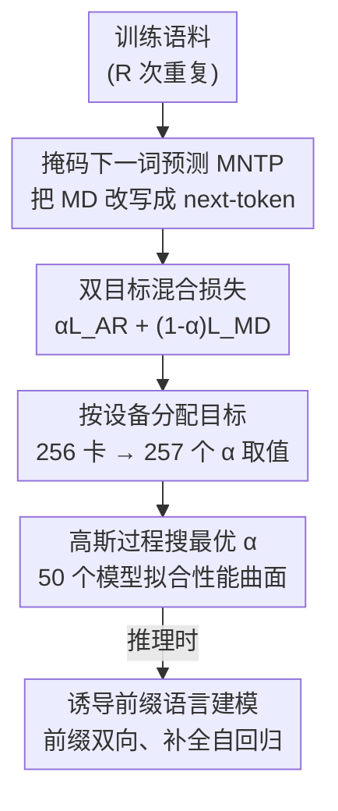

# Dual-objective Language Models: Training Efficiency Without Overfitting

**会议**: ICLR2026  
**OpenReview**: [https://openreview.net/forum?id=BrPt0GFgOM](https://openreview.net/forum?id=BrPt0GFgOM)  
**代码**: https://github.com/ltgoslo/dual-language-models （有，模型也开源在 HuggingFace `ltg/dual-lm-470m`）  
**领域**: LLM 预训练 / 训练目标 / 数据受限缩放  
**关键词**: 双目标训练, 自回归, 掩码扩散, 过拟合, 数据墙

## 一句话总结
在**不改动任何模型结构**的前提下，把自回归（AR）和掩码扩散（masked-diffusion, MD）两种训练目标用一个权重 $\alpha$ 线性混合到同一个 Transformer 上训练，让模型同时拥有 AR 的训练高效率和 MD 的抗过拟合能力；作者训了 50 个 470M 模型系统地扫出了在不同数据重复次数下的最优 $\alpha$，结论是「任何设置下混合都比单目标好」。

## 研究背景与动机
**领域现状**：当前主流大模型几乎都用自回归的「预测下一个 token」目标训练（GPT 系）。它的最大优点是训练高效——一次前向就能并行算出整条序列每个位置的损失，能极快地吸收海量文本。

**现有痛点**：自回归目标有一个被长期忽视的软肋——**当训练数据被重复多次时极易过拟合**。Muennighoff 等人发现纯自回归模型从超过 16 次数据重复中几乎学不到新东西，再重复就开始 held-out loss 发散。另一条路线掩码扩散语言模型（masked-diffusion，本质上是把 BERT 式掩码恢复扩展成扩散过程）天生抗过拟合、能利用双向上下文，但**样本效率低、收敛慢**，要更多算力才能追上 AR。

**核心矛盾**：AR「快但易过拟合」与 MD「稳但慢」之间存在一个清晰的 trade-off，而且这个 trade-off 正变得越来越要命——随着「数据墙」逼近（高质量文本即将枯竭、但算力还在指数增长），未来训练必然要在**有限数据上反复重复**，过拟合会成为头号敌人。

**本文目标**：能不能让一个模型同时占住 AR 的高效率和 MD 的抗过拟合？并且给出「在某个数据重复程度下到底该怎么配比两个目标」的可操作指南。

**切入角度**：两种目标的优缺点正好互补，作者的直觉是——用 AR 负责「快速吸收」、用 MD 当「正则项」防止它跑偏。关键观察是：只要把 MD 改写成也是「预测下一个 token」的形式，两个目标就能共用同一套参数、同一种架构，混合训练几乎零代价。

**核心 idea**：训练时最小化 $\alpha L_{\text{AR}} + (1-\alpha)L_{\text{MD}}$ 的混合损失，用单一超参 $\alpha$ 调节两者配比；推理时直接当普通自回归模型用，**没有任何额外开销**。

## 方法详解

### 整体框架
方法要解决的是「如何让一个 Transformer 同时被两种看似不兼容的目标训练，且不增加任何结构或推理成本」。整体思路分三步转：① 把掩码扩散目标改写成「掩码版的预测下一个 token」（MNTP），使它和自回归一样都是 next-token prediction，从而能复用**完全相同的网络与参数**——两种模式的唯一区别只在「输入是否被掩码 + 注意力掩码是因果还是双向」；② 用权重 $\alpha$ 把两个目标线性混合成一个联合损失，为了不拖慢吞吐，作者**按 GPU 设备分配目标**（每块卡只算一种目标），256 块卡天然给出 257 个可选的 $\alpha$ 离散值；③ 训 50 个模型、用高斯过程回归（GPR）拟合「数据重复次数 × $\alpha$ → 下游性能」的曲面，反推出每个数据受限程度下的最优 $\alpha$，并提炼成可直接套用的经验法则；额外地，训练好的模型在推理时还能免费获得「前缀语言模型」能力。

### 关键设计

**1. 掩码下一词预测 MNTP：让扩散目标也变成「预测下一个 token」**

直接混合 AR 和 MD 的最大障碍是两者「形状不同」——AR 在位置 $i$ 用 $x_{<i}$ 预测 $x_i$，标准掩码扩散则在被掩位置直接预测该位置的原 token。如果两个目标的输出对齐方式不一样，就没法共用同一组参数。作者采用 Lv 等人的**掩码下一词预测（MNTP）**：模型**永远用位置 $i$ 的隐状态去预测位置 $i+1$ 的 token**，无论是 AR 模式还是扩散模式。这样一来两种模式被统一成同一件事——next-token prediction，唯一差别是输入与注意力掩码。掩码扩散损失写成对时间 $t\in[0,1]$ 的积分上界：

$$-\log p_\theta(x) \le -\int_0^1 \mathbb{E}_{x^t\sim q_{t|0}(\cdot|x)}\Big[\tfrac{1}{t}\sum_{\{i\,|\,x^t_i=\text{mask}\}}\log p_\theta(x_i\mid x^t)\Big]\,dt \overset{\text{def}}{=} L_{\text{MD}}(x;\theta)$$

其中前向扩散过程让每个 token 以概率 $t$ 变成 mask（$t=0$ 是原句、$t=1$ 全掩），积分用蒙特卡洛采样 $t\sim U(0,1)$ 估计。作者在附录里证明了 MNTP 这种参数化与标准掩码恢复**表达力等价**，所以改写不损失能力。

**2. 双目标混合损失与权重 $\alpha$：用一个旋钮调「快」与「稳」**

有了统一形状，就能把两个目标加权相加，训练目标变成

$$\arg\min_\theta\ \mathbb{E}_{x\sim D}\big[\alpha L_{\text{AR}}(x;\theta) + (1-\alpha)L_{\text{MD}}(x;\theta)\big]$$

$\alpha$ 是全文的灵魂超参：$\alpha=1$ 退化成纯自回归，$\alpha=0$ 退化成纯扩散，中间值则在「训练效率」和「抗过拟合」之间连续插值。它之所以有效，是因为大比例的 AR 负责快速收敛、小比例的 MD 像一个施加「有用建模先验」的正则项，把 AR 容易过拟合的倾向往回拉。一个反直觉的发现是：即使你**只关心双向（扩散）性能**，也不该用纯 MD 训练——只掺一点点 AR（$\alpha$ 很大）反而能得到比纯 MD 更强的双向能力。

**3. 按设备分配目标：零吞吐损失地实现批内混合**

如果在同一个 batch 里既混 AR 样本又混 MD 样本，计算图会变得动态、难以编译，吞吐会掉。作者的工程巧思是**每块 GPU 只负责一种目标**——让每块卡的计算图保持简单静态、可被高效编译。模型训练分布在 **256 块设备**上，于是 $\alpha$ 自然落在 $\{i/256\mid i=0,1,\dots,256\}$ 这 257 个离散值上，分配多少块卡给 AR 就等价于设了多大的 $\alpha$。这个设计把「混合两个目标」从算法问题降维成「分配设备数」的简单问题。

**4. 高斯过程搜最优 $\alpha$ + 两条经验法则：把 50 次实验压缩成可操作指南**

数据本身有噪声、且「重复次数 × $\alpha$ → 性能」是个二维曲面，逐点比较不可靠。作者训了 **50 个模型**，用**高斯过程回归（GPR）**（各向异性 Matérn 核 ν=1.5 + 白噪声核）拟合这张曲面，$R^2$ 全部超过 0.99，再从后验采样估出「给定重复次数下，哪个 $\alpha$ 最优」的概率密度。由此分出两个区间并给出法则：**常规数据区**（≤16 次重复，AR 还不过拟合）——用 $\alpha\approx 63/64$，即掺一点点 MD，就能在不损失 AR 性能的前提下拿到比纯 MD 更强的双向能力（Remark 1）；**数据受限区**（>32 次重复，过拟合是主要矛盾）——选一个让 AR 目标「实际只看到约 16 次数据重复」的 $\alpha$（Remark 2），因为超过 32 次 AR 重复会过拟合、少于 8 次又欠拟合。

**5. 诱导前缀语言建模：推理时免费再涨一截**

因为模型训练时同时见过单向和双向注意力，作者测试它能否**零额外训练**地泛化到「前缀语言建模」——把提示的条件部分（prefix）用双向注意力处理、把要生成的补全部分仍用自回归处理。结果发现：在大多数混合训练的配置下，这种前缀式推理比纯自回归推理**稳定高出 1 个百分点以上**（Remark 3）。相比之下，过去 Katz 等人要实现同样效果还得专门训练 adapter，而本文的双目标训练把这个能力「白送」了。

## 实验关键数据

实验统一在 470M 参数模型（360M 非嵌入权重）、32B token 总预算上做。重复因子 $R$ 表示采样 $32\text{B}/R$ 的唯一子集再重复 $R$ 遍。优化器用 Muon，WSD 学习率调度，语料取自 HPLT v2 英文网页。

### 主实验：自回归评测（归一化分数，0=随机、100=满分）

| 重复次数 | 模型配置 | 平均分 | 关键对比 |
|---------|---------|-------|---------|
| 1× | Dual (α=63/64) | **26.9** | 略胜纯 AR |
| 1× | Autoregressive (α=1) | 26.1 | — |
| 32× | Dual (α=3/4) | **23.9** | 比纯 AR 高 1.9 |
| 32× | Autoregressive (α=1) | 22.0 | — |
| 128× | Dual (α=1/8) | **19.1** | 比纯 AR 高 9.7 |
| 128× | Autoregressive (α=1) | 9.4 | 灾难性过拟合 |

核心信号：数据重复越极端，双目标的优势越夸张——128 次重复下纯 AR 直接崩到 9.4（部分任务甚至跌破随机基线变负），而双目标仍有 19.1，几乎翻倍。即便在 1 次重复的常规设置下，双目标也不输纯 AR。

### 消融 / 分析：α 与过拟合的关系

| 配置 | 现象 | 说明 |
|------|------|------|
| α=1（纯 AR） | >16 次重复后过拟合 | held-out loss 发散 |
| α=0（纯 MD） | 双向评测下也被双目标反超 | 样本效率低、收敛慢 |
| 中间 α | 全部 9 任务多数上涨 | 重复越多增益越大 |
| 前缀推理 | 多数配置 +1pp 以上 | 零额外训练 |

### 关键发现
- **混合永远更优**：在所有评测设置（含常规数据 + 数据受限、含单向 + 双向评测）下，混合都严格优于任一单目标，这比并行工作「MD 仅在数据受限时胜过 AR」的结论更强。
- **最优 $\alpha$ 与过拟合行为绑定**：最优 $\alpha$ 正好落在「会过拟合的 $\alpha$ 区间」正下方；由于过拟合行为不随模型规模变化（前人结论），作者据此论证最优 $\alpha$ 在更大模型上也应稳定，且大模型上双目标收益可能更大。
- **数据墙被推远一个量级**：纯 AR 从超过 16 次重复中学不到东西，双目标把这个上限至少推高了一个数量级（128 次重复仍有非平凡性能，相当于只看了 256M token）。

## 亮点与洞察
- **「换形状」而非「换结构」**：用 MNTP 把扩散目标改写成 next-token 形式，是整个方法零成本的关键——它让两个目标共享同一套参数、同一种架构，推理时直接当 GPT 用，没有任何额外开销。这个「统一表面形式」的思路可迁移到任何想混合异构目标的场景。
- **把超参搜索工程化成「分配设备数」**：按 GPU 分配目标既解决了吞吐问题，又把连续超参 $\alpha$ 离散成 257 个干净取值，是非常漂亮的系统-算法协同设计。
- **用 GPR 对抗噪声实验**：面对 50 个噪声模型点，不做逐点比较而是拟合一张光滑曲面再采后验估「最优概率」，这种「先建概率模型再读结论」的实验分析范式值得借鉴。
- **最反直觉的一点**：要双向能力强，最优解竟然不是纯双向训练，而是「大量 AR + 一点 MD」，说明 AR 提供的快速收敛对双向表示也有正向迁移。

## 局限与展望
- **规模外推靠论证而非实测**：所有实验都在 470M 上做，「结论在更大模型成立」是基于「过拟合不随规模变化」的间接推理，缺直接验证（作者也承认大规模实验太贵）。
- **数据受限区的最优 $\alpha$ 窗口很窄**：Remark 2 给的是经验启发式（让 AR 实际看约 16 次重复），但论文也指出该区间狭窄、对配置敏感，落地时仍需小心调。
- **任务与语料范围有限**：仅评测 9 个零样本英文任务、单一 HPLT 英文语料，多语言/代码/更大下游任务上的表现未知。
- **改进方向**：可探索训练中**动态调度 $\alpha$**（而非全程固定），或把 MNTP 统一框架推广到更多目标（如前缀、UL2 式去噪）的多目标混合。

## 相关工作与启发
- **vs GPT-BERT (Charpentier & Samuel, 2024)**：本文直接建立在 GPT-BERT 的混合目标之上，但把它从 BabyLM 的极小模型扩展到了**掩码扩散**目标和大几个数量级的算力规模，验证了其实用性。
- **vs CM3 / GLM / T5 / BART**：这些早期工作也混合双向与自回归，但多数依赖 encoder-decoder 或特殊位置编码等非标准结构；本文不改任何架构，且 $\alpha$ 提供了全程细粒度配比，还额外泛化了掩码扩散。
- **vs AntLM (Yu et al., 2024)**：AntLM 用课程式「先 AR→再 MLM→再 AR」切换目标，但切换会遗忘前一个目标；本文是**同时连续学习**两个目标，不存在遗忘。
- **vs 纯扩散缩放工作 (Prabhudesai et al., 2025; Ni et al., 2025)**：他们证明 MD 在数据受限下胜过 AR；本文证明**任一单目标都非最优，混合应当总是更好**，不止在数据受限时。

## 评分
- 新颖性: ⭐⭐⭐⭐ 不是全新机制，但「零成本统一 + 系统扫 α + 数据墙视角」的组合很有价值
- 实验充分度: ⭐⭐⭐⭐ 50 个模型 + GPR 拟合扎实，但仅单一规模/语料，缺大模型直接验证
- 写作质量: ⭐⭐⭐⭐⭐ 动机清晰、图表（尤其 Figure 1/4）极有说服力，三条 Remark 落地性强
- 价值: ⭐⭐⭐⭐⭐ 面向「数据墙」的实战指南，零推理开销、可直接用于未来大模型训练

<!-- RELATED:START -->

## 相关论文

- [\[ICLR 2026\] Pre-training LLM without Learning Rate Decay Enhances Supervised Fine-Tuning](pre-training_llm_without_learning_rate_decay_enhances_supervised_fine-tuning.md)
- [\[ICLR 2026\] Pre-training Limited Memory Language Models with Internal and External Knowledge](pre-training_limited_memory_language_models_with_internal_and_external_knowledge.md)
- [\[ICLR 2026\] Soft-Masked Diffusion Language Models](soft-masked_diffusion_language_models.md)
- [\[ICLR 2026\] Steering Language Models with Weight Arithmetic](steering_language_models_with_weight_arithmetic.md)
- [\[ICLR 2026\] CHAMMI-75: Pre-training multi-channel models with heterogeneous microscopy images](chammi-75_pre-training_multi-channel_models_with_heterogeneous_microscopy_images.md)

<!-- RELATED:END -->
