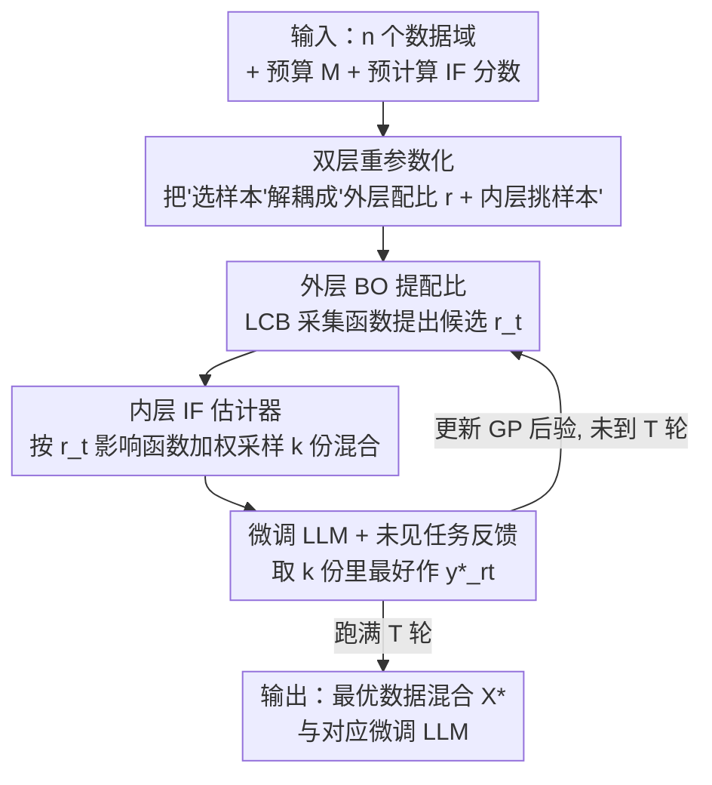

# DUET: Optimizing LLM Training Data Mixtures via Noisy Feedback from Unseen, Downstream Evaluation Tasks

**会议**: ICLR2026  
**OpenReview**: [https://openreview.net/forum?id=9QpBwvTfBh](https://openreview.net/forum?id=9QpBwvTfBh)  
**代码**: https://github.com/chenzhiliang94/BO-for-LLMs  
**领域**: LLM预训练 / 数据混合 / 贝叶斯优化  
**关键词**: 数据混合, 数据选择, 贝叶斯优化, 影响函数, 未见评测任务

## 一句话总结
DUET 面对"评测任务数据看不见、只能拿到多轮粗糙噪声反馈"的现实场景，用"全局贝叶斯优化调数据域配比 + 局部影响函数挑高质量样本"交替迭代的方式优化 LLM 训练数据混合，并给出收敛性证明，在多个语言任务上显著超过 DoReMi、LESS 等需要细粒度数据信息的方法。

## 研究背景与动机
**领域现状**：LLM 的表现强烈依赖训练数据域与下游评测任务的匹配程度。围绕"怎么配数据"已经有两条主线：一是数据混合（data mixing），如 DoReMi、BiMix、Aioli，去优化各数据域在训练集里的配比；二是数据选择（data selection），如 LESS、influence function、TracIn，从每个域里挑出高质量样本。

**现有痛点**：这些方法几乎都假设你能拿到评测任务的"细粒度数据信息"——要么知道评测数据的分布/标签，要么能算出评测样本的梯度，要么干脆假设训练数据和评测任务同分布。但在真实部署里这往往不成立：一个典型例子是聊天机器人，用户与模型的对话是端到端加密的，模型拥有者根本看不到测试时到底是什么数据，只能收到"用户评分""停留时长"这类**粗糙且带噪声**的反馈。作者把这类任务称为**未见评测任务（unseen evaluation task）**。

**核心矛盾**：未见任务设定下，你既不能直接最小化评测损失（它没有闭式表达、看不到数据），也不能暴力遍历所有数据混合（训练 LLM 太贵）。而恰恰是这种"只有一个黑箱反馈通道、还带噪声"的约束，让所有依赖细粒度信息的现有方法失效——论文实测把 DoReMi、LESS 直接搬到这个设定下，效果反而比 DUET 差。

**本文目标**：在"看不到评测数据、只有多轮粗糙噪声反馈"的前提下，自动优化训练数据混合，让微调后的 LLM 在未见任务上表现最好。

**切入角度**：作者注意到这正是贝叶斯优化（BO）擅长的问题形态——优化一个无闭式、只能查询、查询结果还带噪声的黑箱函数，而且 BO 是**样本高效**的（query-efficient），正好契合"每查询一次就要训练一个 LLM、查询很贵"的现实。把"数据域配比"当成 BO 的输入变量，把"未见任务反馈"当成黑箱目标，就能用有限几轮反馈逐步逼近最优配比。

**核心 idea**：把数据混合优化重参数化成"外层调配比、内层挑样本"的双层问题——外层用 BO 利用噪声反馈调各域**配比**（global），内层用影响函数等数据选择方法在给定配比下挑**高质量样本**（local），两者交替迭代，无需任何评测数据细节即可收敛到最优数据混合。

## 方法详解

### 整体框架
DUET 要解的原始问题是：在"选 $M$ 个训练样本组成混合 $\mathcal{X}$、微调出参数 $\theta_\mathcal{X}$、最小化未见任务损失 $L_{\text{eval}}(\theta_\mathcal{X})$"这个高维离散优化里找到最优混合 $\mathcal{X}^*$。直接搜 $\mathcal{X}^*$ 既是离散又是高维、还看不到 $L_{\text{eval}}$ 的形式，无从下手。

DUET 的破局思路是 **global-to-local（全局到局部）** 的双层结构。论文先证明（Theorem 3.1）：最优样本集 $\mathcal{X}^*$ 当且仅当它对应的**数据域配比** $r^* = \text{ratio}(\mathcal{X}^*)$ 是重参数化问题的最优解，从而把"挑哪些样本"解耦成"外层定配比 $r$ + 内层在该配比下挑样本"两层。整条流水线就是一个反馈回环：外层 BO 用历史观测提出一个候选配比 $r_t \to$ 内层按 $r_t$ 用影响函数加权采样挑出 $k$ 份数据混合 $\to$ 各自微调 LLM、丢到未见任务上收集反馈 $\to$ 取最好那份作为该配比的内层估计 $\to$ 把 $(r_t, \tilde{y}^*_{r_t})$ 喂回 BO 更新高斯过程后验，循环 $T$ 轮后取整个过程中表现最好的混合作为 $\mathcal{X}^*$。

### 关键设计

**1. 双层重参数化：把"挑哪些样本"换成"先定配比、再挑样本"**

原问题在样本空间 $\mathcal{X}\subseteq D$ 上是高维离散优化，搜索空间随数据量爆炸。DUET 的第一步是把它重写成关于**配比** $r\in\mathbb{R}^n$（$n$ 个数据域上的概率单纯形，$\|r\|_1=1$）的双层问题：

$$\min_{r\in\mathbb{R}^n}\ \min_{\mathcal{X}\in S_r} L_{\text{eval}}(\theta_\mathcal{X}),\qquad S_r \triangleq \{\mathcal{X}: \mathcal{X}\in D,\ \text{ratio}(\mathcal{X})=r,\ |\mathcal{X}|=M\}.$$

Theorem 3.1 保证这个重写是**等价的**：原问题的最优样本集 $\mathcal{X}^*$ 对应的配比 $r^*$ 恰是重参数化问题的最优配比。这一步是整个方法的骨架——它把一个无法直接搜的离散问题，拆成"外层在低维连续单纯形上搜 $r$（适合 BO）+ 内层在固定配比下挑样本（适合数据选择）"，让 global-to-local 的分工有了理论依据，而不是拍脑袋拆。

**2. 影响函数驱动的内层估计器：在给定配比下挑出高质量样本**

内层要解的是 $\mathcal{X}^*_r = \arg\min_{\mathcal{X}\in S_r} L_{\text{eval}}(\theta_\mathcal{X})$，即在满足配比 $r$ 的所有混合里找表现最好的那个。最朴素的做法是从 $S_r$ 里**均匀随机**采 $k$ 份混合、各训一个 LLM、取最小损失作为估计 $\tilde{y}^*_r$（一阶顺序统计量）。这个均匀随机估计器虽然一致（$k\to\infty$ 时收敛），但方差很大——随机采几乎不可能正好采到最优混合。

DUET 的改进是把**数据选择**塞进采样过程：以影响函数（Influence Function, IF）为例，先对每个域 $D_i$ 单独（可用更小的代理模型）微调一个 LLM，算出该域每个样本的 IF 分数并预存；之后给定配比 $r$ 时，在每个域内**按 IF 分数加权采样**（高分样本更容易被选中）直到满足 $r$，得到一份混合 $\mathcal{X}^{IF}$。重复 $k$ 次得到 IF-driven 估计器：

$$\tilde{y}^*_r = \min_{\mathcal{X}_i}\{L_{\text{eval}}(\theta_{\mathcal{X}^{IF}_1}),\dots, L_{\text{eval}}(\theta_{\mathcal{X}^{IF}_k})\}.$$

因为高 IF 分数被普遍认为对应高质量样本，IF-driven 估计器比均匀随机**偏差和方差都更小**（Fig. 3 的经验分布更贴近真值）。论文进一步给出 Theorem 3.2：假设单次 $L_{\text{eval}}(\theta_{\mathcal{X}^{IF}})$ 服从平移截断指数分布 $y^*_r + \text{expt}(\lambda,c)$，则估计器是随机变量 $y^*_r+\epsilon$，噪声 $\epsilon$ 的 PDF 为

$$\text{PDF}_\epsilon(u)=\frac{\lambda k\, e^{-\lambda u}}{1-e^{-\lambda c}}\left(\frac{e^{-\lambda u}-e^{-\lambda c}}{1-e^{-\lambda c}}\right)^{k-1},\quad u\in[0,c],$$

并据此说明估计误差随 $k$ 增大渐近趋 0。这个估计器的设计是 DUET 的灵活性来源——IF 只是默认选择，coreset、LESS、log-det、TracIn 乃至均匀随机都能即插即用，对应不同的"性能-算力"权衡。

**3. 配比上的贝叶斯优化：用粗糙噪声反馈调外层**

把内层解只依赖配比这一事实形式化为黑箱函数 $f(r)\triangleq y^*_r=\min_{\mathcal{X}\in S_r} L_{\text{eval}}(\theta_\mathcal{X})$，外层问题就成了 $\min_r f(r)$。DUET 在约束 $\|r\|_1=1$ 的单纯形上用 BO 求解。选 BO 有两个对症的理由：其一，$f$ 没有闭式形式（评估一次要跑一遍内层估计器并训 LLM），BO 正是优化这类黑箱的标准框架；其二，内层估计器只能给出**带噪声**的观测 $f(r)+\epsilon$（噪声分布同 Theorem 3.2），而 BO 天然能优雅处理噪声观测。具体地，DUET 把 $f$ 建模为高斯过程，用平方指数核刻画配比间相关性，每轮用 LCB 采集函数 $r_{t+1}=\arg\min_r \mu_t(r)-\beta_{t+1}\sigma_t(r)$ 在"利用低均值"和"探索高方差"间权衡，提出下一个候选配比。BO 的样本高效性是关键——它让"每查询一次都要训一个 LLM"这种昂贵反馈下，少数几轮（实验用 $T=10$）就能逼近最优配比。

**4. 交替迭代 + 累积遗憾收敛保证：把两层缝成一个有理论支撑的回环**

Algorithm 1 把外层 BO 和内层 IF 估计器缝成一个闭环：每轮 $t$ 先用 LCB 提配比 $r_t$，再用 IF 加权采样得 $k$ 份混合、训 LLM、收反馈算出 $\tilde{y}^*_{r_t}$ 并记下最好那份 $\mathcal{X}^*_t$，然后把 $(r_t,\tilde{y}^*_{r_t})$ 并入观测、更新 GP 后验，跑满 $T$ 轮后回收全局最优混合。论文用**累积遗憾**给出收敛性（Theorem 4.1）：定义 attained cumulative regret $\tilde{R}_T=\sum_t |\tilde{y}^*_{r_t}-f(r_t)| = \sum_t|f(r^*)+\epsilon_t-f(r_t)|$，它由两部分组成——$|f(r^*)-f(r_t)|$ 衡量外层 BO 提出的配比好不好，$\epsilon_t$ 衡量内层估计准不准。论文证明平均遗憾 $\tilde{R}_T/T$ 在 $T\to\infty$ 时有上界（与采样数 $k$、截断参数 $c$ 相关），且**即便没有任何评测任务的细粒度信息**也能收敛到最优数据混合。更大的 $k$ 会降低内层估计误差从而收紧界，这与"$k$ 越大越准"的直觉和实验一致——但有意思的是，实验显示 $k=1$ 已足够好。

## 实验关键数据

### 主实验
设置：对 Llama-3-8B-Instruct 做 PEFT 微调（另在 Qwen2.5-7B-Instruct 上复现，结论一致），训练数据域涵盖 9 个主题（Wikitext、gsm8k、PubmedQA、HeadQA、SciQ、TriviaQA、TruthfulQA、Hellaswag、CommonsenseQA）。BO 用 50 个随机混合 warm-start，采样数 $k=1$、BO 轮数 $T=10$、样本预算 $M=10000$、温度 0.75（使反馈带噪）。基线在相同迭代数下取最优结果以保证算力可比。

| 设定 | 评测任务 | DUET | 对比基线（DoReMi / LESS / Uniform） | 结论 |
|------|---------|------|--------------------------------|------|
| 域内（in-domain） | TruthfulQA | 最优（更高 acc） | 均更低 | DUET 自动把配比向相关域 TruthfulQA 倾斜 |
| 域外（out-of-domain） | gsm8k | 优于基线 | 无法适配粗糙反馈 | 即便评测域被移出训练域，DUET 仍能用反馈优化 |
| 域外 | PubMedQA / HeadQA | 优于基线 | 无法适配 | 跨域数据仍有用（如 Wikitext 帮到 gsm8k） |
| 域外 | Commonsense / Trivia | 优于基线 | 无法适配 | DUET 在域内/域外均有效 |

> 注：论文主结果以折线图（Fig. 4，10 轮迭代，越高越好）呈现，未给出统一数值表；上表为各子图结论的归纳。DUET 还在 Table 1/2 中与 Aioli、Multi-fidelity BO、online data-mixing 及"加更多 token / 随机搜索 / 只做数据选择"等朴素基线比较，总体仍找到更好的数据混合。

### 消融实验

| 配置 | 关键现象 | 说明 |
|------|---------|------|
| Uniform 混合 | 基线性能（红虚线） | 不调配比、不挑样本 |
| + 仅 BO | 增益 (A) | 自动重配各域配比即有提升 |
| + BO + 数据选择（DUET-IF） | 再增益 (B) | 内层挑高质量样本进一步提升 |
| 换不同数据选择方法 | 增益幅度不同 (C) | IF 优于 LESS / RH / log-det |
| 增大采样数 $k$ | 越大越优 | 与 Theorem 4.1 一致；但 $k=1$ 已超基线 |

### 关键发现
- **BO 和数据选择缺一不可**：只用 BO 调配比就有可观增益，再叠加 IF 数据选择还能继续涨，验证了"交替 global-to-local"的必要性。
- **IF 是内层最佳选择**：在 DUET 内层里 IF 优于 LESS、Remove-Harmful、log-det，原因是 IF 更擅长剔除低质量样本；但这只是默认推荐，内层可按算力预算自由替换。
- **$k=1$ 就够**：理论上更大的 $k$ 收敛更快，但实验里 $k=1$ 已超过所有基线，说明"数据选择"远比"多采几份随机混合"划算。

## 亮点与洞察
- **问题设定本身就很有价值**：把"评测数据加密看不见、只有粗糙噪声反馈"提炼成 unseen evaluation task，是一个被现有数据混合/选择文献忽略却极贴近真实部署（加密聊天、用户评分）的设定。
- **BO × 数据选择的解耦很巧**：用一条等价性定理把高维离散的"挑样本"拆成"低维连续配比（BO 拿手）+ 固定配比挑样本（数据选择拿手）"，让两类成熟工具各司其职、即插即用。
- **样本高效是设定逼出来的必然**：在"每次查询都要训一个 LLM"的昂贵反馈下，BO 的 query-efficiency 不是锦上添花而是唯一可行解，这个论证把方法选择讲得很有说服力。
- **理论与工程都给了出路**：既有累积遗憾的收敛证明，又坦诚 IF 算力贵并给出并行/Hessian 近似/预计算/代理模型/换 LESS-TracIn 等降本手段，可迁移到任何"黑箱+可微分组件"的 AutoML 流水线。

## 局限与展望
- **只验证了微调**：作者承认实验聚焦 LLM 微调，虽相信 DUET 同样适用于预训练，但未实证，留作未来工作。
- **IF 计算开销**：影响函数分数计算昂贵，虽可预计算/近似，但在大规模数据上仍是成本瓶颈；退而求其次用 LESS/TracIn 会有性能折损。
- **理论假设较强**：Theorem 3.2/4.1 依赖"内层样本损失服从平移截断指数分布"这一经验观察，换分布需读者自行延拓（App. B.4），普适性有待检验。
- **反馈通道理想化**：方法假设能稳定收集多轮反馈且噪声为 sub-Gaussian，真实场景中反馈稀疏、延迟、有系统性偏差时的鲁棒性未充分讨论。

## 相关工作与启发
- **vs DoReMi / BiMix / Aioli（数据混合）**：它们优化数据域配比，但都假设能拿到评测任务的细粒度信息（分布/同分布假设）；DUET 不需要任何评测数据信息，只靠粗糙噪声反馈，实测把它们直接搬到 unseen 设定下反而更差。
- **vs LESS / TracIn / Influence Function（数据选择）**：它们靠梯度相似度或影响分挑样本，同样依赖评测数据（如评测梯度）；DUET 把它们当作内层可替换的模块，并在外层用 BO 补上"评测数据不可见"时的配比搜索。
- **vs 域适应（DA）/ 域泛化（DG）**：DA 假设有评测域的标注/无标注数据或分布，DG 则假设对评测任务一无所知（连反馈都没有）；DUET 处在两者之间——看不到数据但能拿多轮反馈，是一个更贴近部署现实的中间设定。
- **vs AutoAI / 黑箱+可微分 AutoML（Chen et al., 2024b）**：DUET 复用了"把系统重参数化为黑箱外层 + 可微内层"的思路，把数据混合优化纳入同一框架，可启发其它"训练-评测带噪反馈回环"的系统优化问题。

## 评分
- 新颖性: ⭐⭐⭐⭐⭐ 首次把"BO 调配比 + 数据选择挑样本"交替起来解未见任务下的数据混合，问题设定和方法都新。
- 实验充分度: ⭐⭐⭐⭐ 两个 LLM、9 个域、域内域外、多基线、三组消融较扎实；但主结果以折线图为主、缺统一数值表。
- 写作质量: ⭐⭐⭐⭐ 动机讲得清楚、理论与方法衔接顺，符号偏密集需要读者跟上 BO 背景。
- 价值: ⭐⭐⭐⭐⭐ 直击加密/隐私部署下"看不到评测数据"的真实痛点，方法灵活、有理论保证、可迁移到预训练与更广的 AutoML 场景。

<!-- RELATED:START -->

## 相关论文

- [\[ACL 2025\] Optimizing Pre-Training Data Mixtures with Mixtures of Data Expert Models](../../ACL2025/llm_pretraining/optimizing_pre-training_data_mixtures_with_mixtures_of_data_expert_models.md)
- [\[ICLR 2026\] Predicting Training Re-evaluation Curves Enables Effective Data Curriculums](predicting_training_re-evaluation_curves_enables_effective_data_curriculums_for_.md)
- [\[ICLR 2026\] Train on Validation (ToV): Fast Data Selection with Applications to Fine-Tuning](train_on_validation_tov_fast_data_selection_with_applications_to_fine-tuning.md)
- [\[ICLR 2026\] Beyond Length: Quantifying Long-Range Information for Long-Context LLM Pretraining Data](beyond_length_quantifying_long-range_information_for_long-context_llm_pretrainin.md)
- [\[ICLR 2026\] Rewriting Pre-training Data Boosts LLM Performance in Math and Code](rewriting_pre-training_data_boosts_llm_performance_in_math_and_code.md)

<!-- RELATED:END -->
