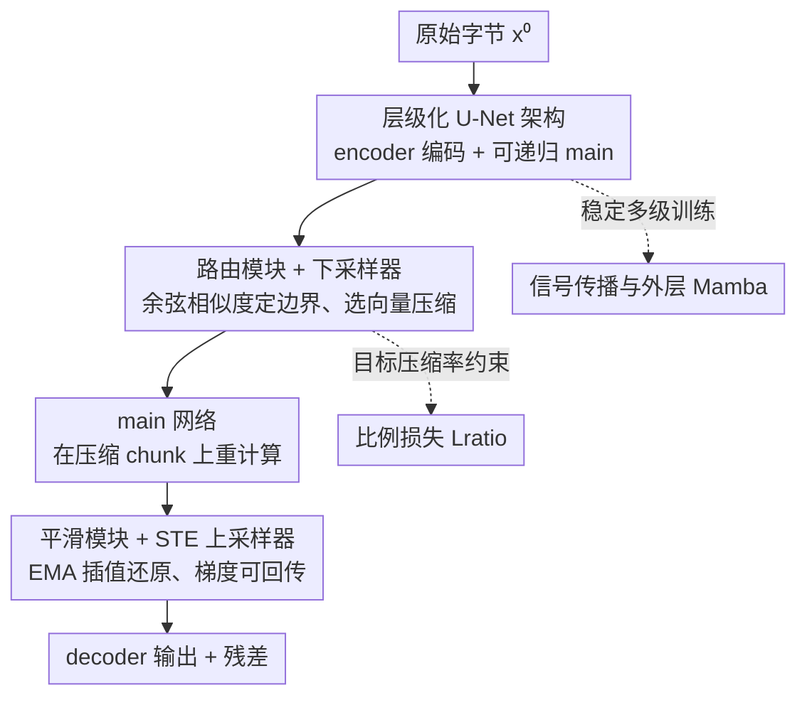

# Dynamic Chunking for End-to-End Hierarchical Sequence Modeling

**会议**: ICLR2026  
**OpenReview**: [https://openreview.net/forum?id=ZbfLR9NbNF](https://openreview.net/forum?id=ZbfLR9NbNF)  
**代码**: 待确认  
**领域**: LLM预训练 / 基础模型架构  
**关键词**: 动态分块, tokenizer-free, 层级序列建模, H-Net, 端到端

## 一句话总结
本文提出 H-Net，一个用可学习的「动态分块（Dynamic Chunking, DC）」机制取代 BPE 分词的层级序列模型：网络在 byte 级输入上自动学会在哪里切 chunk、压缩到什么粒度，全程端到端可微，单级 H-Net 在算力/数据对齐下就超过了基于 BPE 的强 Transformer，两级 H-Net 还能匹敌两倍大小的 token 级模型。

## 研究背景与动机
**领域现状**：现代语言模型的主流范式是「tokenization → LM → detokenization」，先用 BPE 之类的算法把原始字节压成固定词表的 token，再喂给 Transformer。分词起到了压缩、缩短序列的关键作用，是当下不可或缺的一环。

**现有痛点**：分词是一个**手工设计、与模型割裂**的预处理步骤，带来一系列已被充分记录的缺陷——字符级理解差、缺乏可解释性、在中文/代码/DNA 这类「弱分词启发式」的语言和模态上表现明显退化。它违背了深度学习「从原始数据端到端学习」的精神（bitter lesson）。

**核心矛盾**：要做真正端到端的 tokenizer-free 模型，必须把「分块」这件事直接塞进网络里联合训练，但这同时要跨过三道坎——**效率**（byte 级序列太长，各向同性模型算力代价高）、**可学习性**（边界是离散选择，没有监督信号、梯度断流）、**稳定性**（已有可训练边界预测器在放大模型或叠多级层级时会训崩）。此前的折中方案要么用固定 pooling（不依赖内容，对变信息率的语言不友好），要么靠外部 delimiter/entropy 启发式（依赖外置边界预测器，modality-specific，仍非真端到端）。

**本文目标**：让模型自己学会「在哪里切、切多细」，同时解决效率、可学习性、稳定性三个问题，得到第一个在算力对齐下匹配甚至超过 BPE Transformer 的 tokenizer-free 模型。

**切入角度**：作者观察到**有意义的边界往往出现在「语义/上下文发生跳变」处**——当上下文变了，相邻表示的相似度就会降低。于是用相邻向量的余弦相似度做边界打分，再配上一套让离散选择可微的技巧，把分块变成标准梯度优化能搞定的事。

**核心 idea**：用一个**内容/上下文相关、端到端可学的动态分块机制**替换 BPE，嵌进一个类 U-Net 的层级网络（H-Net）里，并且这个层级可以**递归嵌套**，让模型自动发现从字节→词→更高层抽象的多级结构。

## 方法详解

### 整体框架
H-Net 是一个**类 U-Net 的层级网络**：原始字节先经一个小的 **encoder** 网络，再被 **chunking layer** 动态下采样成更短、语义更丰富的 chunk 序列，送进参数量最大的 **main** 网络处理，最后经 **dechunking layer** 上采样回原分辨率、过 **decoder** 网络输出。和传统 U-Net 不同的是，这里的边界**不是固定步长 pooling 决定的，而是由数据动态决定**。整体管线可写成 $\hat{x}^s = E^s(x^s),\ \hat{z}^S = M(x^S),\ \hat{z}^s = D^s(z^s)$，其中分块/解分块为 $(x^{s+1}, p^s) = \mathrm{Chunk}(\hat{x}^s)$ 和 $z^s = \mathrm{Dechunk}(\hat{z}^{s+1}, p^s) + \mathrm{Linear}(\hat{x}^s)$。

关键在于 **main 网络本身可以又是一个完整的 H-Net**，从而递归地堆出多级层级：一个 $S$ 级模型有 $E^0, E^1, \dots, M, \dots, D^1, D^0$，外层捕捉细粒度模式、内层在压缩表示上操作更高阶抽象（字符→词→短语→句子）。chunking 的核心组件是 **Dynamic Chunking（DC）**，它夹在 main 网络和 encoder/decoder 之间，由「chunking layer（路由模块 + 下采样器）」和「dechunking layer（平滑模块 + 上采样器）」两半组成，再加一个把压缩率拉到目标的「比例损失」。此外还有一套信号传播技巧保证多级、放大时不训崩。

### 关键设计

**1. 层级化 U-Net 架构：用 encoder-main-decoder 把算力花在刀刃上，且能递归**

byte 级序列动辄上万长，各向同性（isotropic）模型在每个字节上都跑完整大模型，算力浪费在低信息区域。H-Net 借鉴 U-Net 的「压缩—处理—还原」结构：encoder/decoder 是小网络、在原始分辨率上跑，main 网络是大头、只在被压缩到 token 级粒度（约 4.5–5 bytes/chunk，与 BPE 接近）的短序列上跑，从而把绝大多数参数和算力集中到有效 token 上。作者发现 **encoder/decoder 用 Mamba-2（SSM）效果显著更好**，因为 SSM 天然有「压缩」的归纳偏置；main 网络则可以是任意标准架构（Transformer 或 SSM）。最妙的是 main 可以再嵌一个 H-Net，于是 $S$ 级层级把「字节→词→短语」的多级抽象显式地建进网络，两级版本（$N^0{=}3, N^1{=}3$）就明显强于单级。

**2. 路由模块 + 下采样器：用相邻向量余弦相似度判边界，再直接选点压缩**

这是 chunking layer，解决「在哪里切」。路由模块给 encoder 输出 $\hat{x}_t$ 投影出 query/key $q_t = W_q\hat{x}_t,\ k_t = W_k\hat{x}_t$，用相邻向量的余弦相似度算边界概率：

$$p_t = \frac{1}{2}\left(1 - \frac{q_t^\top k_{t-1}}{\|q_t\|\|k_{t-1}\|}\right) \in [0,1],\quad b_t = \mathbf{1}\{p_t \ge 0.5\}$$

直觉是：当 $\hat{x}_{t-1}$ 和 $\hat{x}_t$ 跨越语义边界（词素/词/短语之间）时，它们的投影在隐空间发散、余弦相似度低，于是边界概率 $p_t$ 高；规定 $p_1 = 1.0$ 保证序列从一个边界开始。下采样器**直接保留 $b_t{=}1 的向量、丢弃 $b_t{=}0$ 的**（比 mean/max pooling、cross-attention 都简单且更有效），把 $\hat{x}^s$ 压成更短的 $x^{s+1}$；边界概率 $p^s$ 也同步压成 $P^{s+1}$ 留给 dechunking 用。这套机制让边界由内容/上下文决定，而非固定步长。

**3. 平滑模块 + STE 上采样器：把离散 chunk 变可微，让边界能学**

离散的边界选择会**截断梯度**，是端到端训练分块器最难的地方。dechunking layer 用两招让梯度回流。平滑模块对 main 网络输出 $\hat{z}_t$ 做指数滑动平均（EMA）插值：$\bar{z}_t = P_t \hat{z}_t + (1-P_t)\bar{z}_{t-1}$，用路由器的置信度 $P_t$ 把「不确定的边界」软化、相邻 chunk 之间平滑过渡，从而显著改善可学习性——边界越不确定，越多地混合前一个 chunk 的信息。上采样器再把压缩表示还原回原分辨率，并用 **STE（straight-through estimator）** 把路由置信度接回梯度图：定义 $c_t = p_t^{b_t}(1-p_t)^{1-b_t}$（$b_t{=}1$ 时取 $p_t$，否则取 $1-p_t$），$\mathrm{STE}(c_t) = c_t + \mathrm{stopgradient}(1-c_t)$，前向数值是 1、反向却把 $c_t$ 的梯度透传，于是 $\mathrm{Upsampler}(\bar{z}, c)_t = \mathrm{STE}(c_t)\cdot \tilde{z}_t$ 既不改变前向重建、又让路由器的边界决策收到来自最终损失的梯度。

**4. 比例损失：把压缩率拉到目标，避免退化成全保留或全丢弃**

没有约束时，模型会塌到平凡解：要么保留几乎所有向量（压缩没意义），要么压得太狠（丢失关键信息）。借鉴 MoE 的负载均衡思想，作者加了 ratio loss：

$$L_{\text{ratio}} = \frac{N}{N-1}\big((N-1)FG + (1-F)(1-G)\big),\quad F = \frac{1}{L}\sum_t b_t,\ G = \frac{1}{L}\sum_t p_t$$

$F$ 是实际被选中的向量比例（不可微），$G$ 是平均边界概率（可微），$N$ 控制目标压缩率。机制上：虽然 $F$ 不可导，但网络可以通过 $G$ 这条连续反馈被推向目标压缩率，当 $F = G = 1/N$ 时损失取最小值 1；由于架构鼓励路由器做出**自信决策**（边界概率趋近 0 或 1），$F$ 会自然收敛到 $G$。总损失为 $L = L_{\text{AR}} + \alpha \sum_{s=0}^{S-1} L_{\text{ratio}}^s$，全篇固定 $\alpha = 0.03$。这样压缩是内容自适应的——按语义重要性决定保留谁，而非固定模式。

**5. 信号传播与外层 Mamba：让端到端的多级层级在放大时不训崩**

端到端训练多级层级，子网络之间的信号尺度、不同 stage 的有效 batch size 都不一样，直接训会不稳。作者引入几项工程化技巧：(i) 精心放置投影层和归一化层（post-network norm、residual projection），平衡相互作用的子网络之间的信号传播；(ii) 按每层的维度和有效 batch size 给**逐层调整优化参数**（如外层网络上的学习率乘子）。这套「信号传播」改进正是让 H-Net (space) 超过 SpaceByte++、并让模型能稳定叠到两级、放大到 1B+ 参数的关键（消融中去掉这些技巧性能明显回落）。

### 损失函数 / 训练策略
总损失 $L = L_{\text{AR}} + \alpha\sum_s L_{\text{ratio}}^s$，$\alpha=0.03$。优化用 AdamW + WSD（warmup-stable-decay）调度，10% 线性 warmup、20% 逆平方根衰减；学习率取 GPT-3 标准的 2.5×（Large 6.25e-4、XL 5.0e-4）。所有模型在 FineWeb-Edu 的 100B token 子集上训练，tokenizer-free 模型每条处理 8192 字节、Transformer 用 1792 个 GPT2 token（约等价 8192 字节），严格对齐 bytes-per-batch 与 FLOPs-per-byte。

## 实验关键数据

### 主实验
算力/数据严格对齐，用 bits-per-byte（BPB，越低越好）衡量。单级 H-Net 就追平 BPE Transformer，两级 H-Net 全面超越。

| 设置（GPT-3 Large, 760M FLOPs 对齐） | F-Edu BPB ↓ | 下游 7 任务平均 ACC ↑ |
|--------|------|------|
| Transformer（BPE token） | 0.756 | 53.3 |
| MambaByte（各向同性 byte） | 0.845 | 44.3 |
| SpaceByte（外部 delimiter 监督） | 0.791 | 49.4 |
| SpaceByte++（本文改进的层级 baseline） | 0.760 | 53.6 |
| H-Net (space)（启发式分块 + 本文训练技巧） | 0.755 | 53.4 |
| **H-Net (1-stage)**（DC 端到端） | **0.755** | **53.6** |
| **H-Net (2-stage)**（(3,3)-DC） | **0.743** | **55.5** |

XL（1.3B FLOPs 对齐）尺度下，H-Net (2-stage) BPB 0.715 / 平均 58.2，**超过 Transformer（0.730 / 55.5）**，并匹敌两倍大小的 token 级模型；训练曲线显示两级 H-Net 仅用约 **30B 训练字节**就反超 BPE Transformer，且差距随训练持续拉大。

### 消融实验
通过对比一组「层级 baseline」逐项验证各设计的贡献：

| 配置 | 关键现象 | 说明 |
|------|---------|------|
| 各向同性（Transformer/MambaByte/LlamaByte） | 远弱于所有层级模型 | 层级结构本身是大前提 |
| H-Net (pool) | 明显弱于其他 H-Net 变体 | 固定步长 pooling 无效，验证「数据相关分块」必要性 |
| SpaceByte → SpaceByte++ | 大幅提升 | 验证外层用 Mamba + 网络设计（设计 1）的价值 |
| SpaceByte++ → H-Net (space) | 继续提升 | 验证信号传播技巧（设计 5） |
| H-Net (space) → H-Net (1-stage) | 再提升 | 验证动态分块（设计 2/3/4）优于强启发式 |
| H-Net (1-stage) → H-Net (2-stage) | 显著提升 | 验证递归层级能学到嵌套抽象 |

### 关键发现
- **鲁棒性**：不做任何噪声增强，H-Net 在 noisy HellaSwag（AntSpeak/Drop/RandomCase/Repeat/UpperCase 五种扰动）上比 BPE Transformer 鲁棒得多，2-stage 平均准确率最高、Robustness Score 最高（Transformer 仅 20.2，byte 级模型普遍 34–38）。
- **可解释性**：可视化学到的边界发现 H-Net 无监督地自动切出语义连贯的单元，验证端到端学习能捕捉传统靠手工分词强加的结构。
- **弱分词语言/模态收益更大**：中文/代码上 XWinograd-zh 从 59.9 → 66.3；DNA 语言建模相比各向同性模型有约 **3.6×** 数据效率提升（摘要称对 baseline 近 **4×**）。
- DC 自然把数据压到与 BPE 相近的粒度（约 4.5–5 bytes/chunk），无需任何外部监督或启发式。

## 亮点与洞察
- **把「分词」从预处理变成可学的网络组件**：最核心的「啊哈」是用相邻向量余弦相似度当边界打分器，配上 EMA 平滑 + STE，把一个本质离散、无监督的分块问题变成标准可微优化能解的事——这是此前端到端方案训不稳、做不大的关键障碍。
- **递归层级是真正的可扩展性来源**：main 网络可以又是 H-Net，让「字符→词→短语」的多级抽象显式建进架构，且 2-stage 一致优于 1-stage，暗示继续加深还有空间。
- **ratio loss 的设计很巧**：用可微的 $G$（平均边界概率）当代理去逼近不可微的 $F$（实际选中比例），借 MoE 负载均衡的思路把压缩率精确控到目标 $1/N$，可迁移到任何「需要控制离散选择比例」的场景。
- **外层用 SSM、内层可用任意架构**的分工很实用：SSM 的压缩归纳偏置适合做 encoder/decoder，把昂贵的注意力留给短的 main 序列。

## 局限与展望
- 主网络仍以 Transformer 为主，DC 解决的是「输入端分词」，对长上下文注意力本身的二次复杂度没有直接改善（虽然压缩缩短了序列）。
- 实验规模到 1B+ 参数、100B token 量级，是否在真正的前沿规模（数百 B 参数 / 万亿 token）上继续保持对 BPE 的优势仍需验证。
- ratio loss 在 $F \ne G$ 时理论上可低于最小值 1（作者也观察到），说明该正则并非严格凸约束，依赖「路由器做自信决策」这一经验性收敛，$\alpha=0.03$ 在别的设置下可能需要重新调。
- 多级层级、信号传播技巧带来不少超参与工程细节（逐层学习率乘子、归一化放置），复现门槛偏高。

## 相关工作与启发
- **vs MegaByte / Hourglass Transformer**：它们也用层级结构压缩 byte，但用**固定步长 pooling**（每 $k$ 个压一次），不依赖内容，对变信息率的语言表现差；H-Net 的 H-Net (pool) 消融正是它们的代表，明显弱于动态分块。
- **vs SpaceByte / Byte Latent Transformer (BLT)**：它们引入数据相关分块，但依赖**外部 delimiter/entropy 启发式边界预测器**，modality-specific、非真端到端；H-Net 把边界预测内化为联合训练的路由模块，无需外部监督，在中文/代码/DNA 这类弱分词模态上优势更大。
- **vs 早期可训练边界预测器（Nawrot et al. 2023）**：理想但训练不稳，无法放大或叠多级；H-Net 用平滑模块 + STE + 信号传播技巧解决了稳定性，首次把端到端 tokenizer-free 模型做到匹配/超过 BPE Transformer。
- **vs 标准 BPE Transformer**：H-Net 不再需要手工分词预处理，字符级鲁棒性和可解释性更好，且更符合「从原始数据端到端学习」的 bitter lesson 精神。

## 评分
- 新颖性: ⭐⭐⭐⭐⭐ 首个在算力对齐下匹配/超过 BPE Transformer 的端到端 tokenizer-free 模型，动态分块机制是实质创新
- 实验充分度: ⭐⭐⭐⭐⭐ 多尺度、多 baseline、严格 FLOPs/数据对齐，覆盖英文/中文/代码/DNA + 鲁棒性 + 可解释性
- 写作质量: ⭐⭐⭐⭐ 结构清晰、动机与机制讲得透，但 DC 的多个可微化技巧细节较密、需对照附录
- 价值: ⭐⭐⭐⭐⭐ 可能撼动「分词不可或缺」的基本假设，为下一代基础模型架构提供新方向

<!-- RELATED:START -->

## 相关论文

- [\[NeurIPS 2025\] Conformal Risk Training: End-to-End Optimization of Conformal Risk Control](../../NeurIPS2025/llm_pretraining/conformal_risk_training_end-to-end_optimization_of_conformal_risk_control.md)
- [\[ICLR 2026\] Learned Meta-Tokens for Language Modeling](learned_meta-tokens_for_language_modeling.md)
- [\[ICLR 2026\] Pretraining with Hierarchical Memories: Separating Long-Tail and Common Knowledge](pretraining_with_hierarchical_memories_separating_long-tail_and_common_knowledge.md)
- [\[ICLR 2026\] ADEPT: Continual Pretraining via Adaptive Expansion and Dynamic Decoupled Tuning](adept_continual_pretraining_via_adaptive_expansion_and_dynamic_decoupled_tuning.md)
- [\[ICLR 2026\] Imagine How To Change: Explicit Procedure Modeling for Change Captioning](imagine_how_to_change_explicit_procedure_modeling_for_change_captioning.md)

<!-- RELATED:END -->
