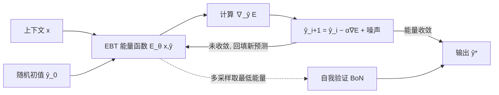

# Energy-Based Transformers are Scalable Learners and Thinkers

**会议**: ICLR 2026  
**OpenReview**: [https://openreview.net/forum?id=ZBj3Qp1bYg](https://openreview.net/forum?id=ZBj3Qp1bYg)  
**代码**: [github.com/alexiglad/EBT](https://github.com/alexiglad/EBT)（项目页 energy-based-transformers.github.io）  
**领域**: LLM 预训练 / 能量模型 / System 2 推理  
**关键词**: Energy-Based Models, Transformer, 推理时计算, System 2 Thinking, 无监督学习, 可扩展性  

## 一句话总结
本文把"预测"重新表述为"对一个学到的验证器（能量函数）做梯度下降优化"，提出一类可扩展的能量模型 Energy-Based Transformers (EBTs)，让模型仅靠无监督预训练就涌现出跨模态、跨任务的 System 2 思考能力（动态分配算力 + 自我验证），在语言与图像上同时超越 Transformer++ 和 DiT。

## 研究背景与动机
- **领域现状**: 推理时计算（inference-time computation，类比人类 System 2 慢思考）正成为提升模型能力的主流手段，O1、R1、Claude 等"推理模型"靠延长思考时间在数学/代码上大幅提分。
- **现有痛点**: 主流 System 2 方法有三重局限——**模态绑定**（只在文本上有效）、**问题绑定**（只在数学/代码这类可验证域有效）、**依赖额外监督**（需要 verifier 或可验证奖励 RL）。而 RL 路线只在规则奖励能轻易判对的领域奏效，对写作等任务反而有害，且可能无法培养出新的推理模式。
- **核心矛盾**: 现有前馈 Transformer / RNN 每个预测的算力是固定的、无法逐 token 动态分配，也没有显式的"预测验证"能力（即 Generative AI Paradox：会生成却不会判断自己生成得对不对）。DiT 虽能通过多步去噪动态分配算力，但并非作为显式验证器训练。能量模型（EBM）天然兼具"动态算力（Facet 1）+ 预测验证（Facet 2）"两大认知要素，却长期受困于训练不稳定、训练耗时、无法规模化，至今没有一个基础规模的 EBM。
- **本文目标**: 回答"能否完全依赖无监督学习培养出通用的 System 2 思考？"——做一个可扩展、可并行、跨模态的能量模型基础架构。
- **核心 idea**: **【验证比生成更容易】** 学一个能量函数 $E_\theta(x,\hat y)$ 给"输入-候选预测"打兼容性分（能量越低越兼容），**【预测即优化】** 把预测重构为"从随机初值出发沿能量景观梯度下降直到收敛"，从而把验证器与生成器统一进同一个模型——生成器隐式地由验证器的梯度定义。

## 方法详解

### 整体框架
EBT 不直接输出预测，而是维护一个能量标量 $E_\theta(x,\hat y)$ 表示上下文 $x$ 与候选预测 $\hat y$ 的兼容度（未归一化似然）。每次预测时，从随机初值 $\hat y_0\sim\mathcal N(0,I)$ 出发，反复对 $\hat y$ 做梯度下降以最小化能量，直到能量收敛——这个迭代过程就是"思考"：能量收敛得快说明问题简单（少算力），收敛得慢说明问题难（多算力），自然实现动态算力分配；而最终能量值本身就是对预测好坏的验证。训练时整条优化轨迹都参与反向传播（需要二阶导数，靠 Hessian-向量积高效计算）。架构上提供两个变体：GPT 式因果解码器 EBT（自回归）和全序列注意力的双向 EBT（图像）。

### 关键设计

**1. 预测即对验证器的优化（统一 verifier 与 generator）：** EBM 用 Boltzmann 分布 $p_\theta(x)=e^{-E_\theta(x)}/Z(\theta)$ 建模，但配分函数 $Z$ 不可解，因此采用未归一化形式 $p_\theta(x,\hat y)\propto e^{-E_\theta(x,\hat y)}$，只需让真实数据流形能量低、其它地方能量高。预测就是在能量景观上找最低点，用梯度下降迭代 $\hat y_{i+1}=\hat y_i-\alpha\nabla_{\hat y_i}E_\theta(x,\hat y_i)$。这一步把"判别"与"生成"合二为一：前向传播时 EBM 像 GAN 判别器给出能量"验证"，反向传播时像 GAN 生成器通过最小化能量去"骗过"判别器。相比把 verifier 和 generator 拆开的方案（树搜索 + LLM 需要成千上万次采样、且存在对抗动态与扩展性问题），这种耦合天然缓解了对抗与可扩展性难题。

**2. 可扩展的 EBM 学习——优化式训练绕开维度灾难：** 传统对比式 EBM 训练要同时压低正样本、抬高负样本能量，但高维空间里负样本数量随维度指数爆炸，无法规模化。本文改用优化式（regularized）训练：直接把初始预测优化到真值，反向传播穿过整条优化过程，从而在真值附近隐式塑造出一个局部极小，**隐式地正则化能量景观**只在真实数据流形上取低能量，避开了显式枚举负样本的维度灾难。这是 EBM 能首次扩展到基础模型规模的关键。

**3. 三招能量景观正则化让"思考"涌现：** 高维真值景观很难天然平滑、只有单一极小，作者引入三项技术保证景观良好从而思考能力可涌现——**回放缓冲（replay buffer）** 复用更长的优化轨迹，让极小点附近的景观被充分定义；**Langevin 动力学** 在更新中加噪声 $\hat y_{i+1}=\hat y_i-\alpha\nabla_{\hat y_i}E_\theta(x,\hat y_i)+\eta_i,\ \eta_i\sim\mathcal N(0,\sigma)$ 鼓励对景观的探索（否则只会探索通往极小的单一路径，其它区域定义不良）；**随机化优化路径**（随机步长 $\alpha$ 与优化步数）显著提升泛化。消融显示随机步长尤其关键，去掉它思考收益几乎消失。

**4. 两种 System 2 思考方式：** 训练好后有两条对应两大认知要素的思考路线——对应 Facet 1 的 **"思考更久"（Thinking Longer）**，即对单个预测做更多优化步；对应 Facet 2 的 **"自我验证"（Self-Verification / BoN）**，即对同一预测采样 $N$ 个候选、取能量最低者 $\hat y^*=\arg\min_j E_\theta(x,\hat y_{M,j})$。后者类似语言模型的 Best-of-N，但 EBM 把它推广到离散+连续两种模态，并且作用于**每一个预测**而非整条序列。

## 实验关键数据

### 主实验：学习与思考可扩展性
- **预训练扩展性**（语言，RedPajamaV2 100B + GPT-NeoX 分词）：在数据、batch size、深度、参数量、FLOPs、嵌入维度六个轴上，EBT 的扩展率全面高于 Transformer++ 配方；FLOP 与参数扩展率高出约 **8.97%**，整体最高可达 35% 更快的扩展。
- **下游任务泛化**（同数据同参数，越靠右越 OOD）：尽管 EBT 预训练困惑度略差，下游多数任务反而更好——

| 模型 | Pretrain ↓ | GSM8K ↓ | SQuAD ↓ | BB Math QA ↓ | BB Dyck ↓ |
|------|-----------|---------|---------|--------------|-----------|
| Transformer++ | **31.36** | 49.6 | 52.3 | 79.8 | 131.5 |
| EBT | 33.43 | **43.3** | 53.1 | **72.6** | **125.3** |

- **图像去噪与表征**（双向 EBT vs DiT，且仅用 1% 的前向次数）：

| 模型 | PSNR↑(ID) | MSE↓(ID) | PSNR↑(OOD) | MSE↓(OOD) | Top-1 Acc↑ | Top-5 Acc↑ |
|------|-----------|----------|------------|-----------|-----------|-----------|
| DiT | 26.58 | 142.98 | 19.56 | 718.7 | 0.31% | 1.36% |
| EBT | **27.25** | **122.55** | **23.29** | **305.2** | **5.32%** | **13.2%** |

EBT 在去噪上用 **99% 更少的前向次数**仍全面超过 DiT，线性探测分类准确率约高出 **10×**，说明学到的图像表征更好。

### 消融实验（System 2 思考，以困惑度改善百分比衡量）

| 配置 | 思考更久 ↑ | 思考更久 + 自我验证 ↑ |
|------|-----------|----------------------|
| 无随机步长 | -1.47 | 0.19 |
| 无随机步数 | 0.00 | 9.65 |
| 无 Langevin 动力学 | 17.2 | 17.0 |
| 无回放缓冲 | 14.8 | 17.8 |
| 完整 System 2 配置 | 7.19 | **18.7** |

去掉随机步长几乎抹掉思考收益；去掉 Langevin 在"无验证"时反而单路径更好，体现性能-算力权衡；完整配置在"思考更久 + 自我验证"组合下最优。

### 关键发现
- **思考收益随 OOD 程度线性上升**：数据越偏离分布，思考带来的提升越大，呼应人类靠 System 2 应对陌生情境。
- **思考能力随训练规模增长**：训练越久，自我验证收益从 4%–8% 升到 12%–14%，暗示在 Llama3 量级（≈1000× 当前规模）上自我验证潜力更大。
- **预训练差但下游好**：EBT 困惑度略高却下游更优，说明验证器路线泛化更强（验证比生成在 OOD 上更容易）。
- 通过延长思考，语言模型性能比 Transformer++ 多提升 **29%**，而 Transformer++ 无法逐 token 改善。

## 亮点与洞察
- **把"思考"形式化为"对学到的验证器做优化"**，统一了动态算力分配与预测验证两大要素，且完全来自无监督预训练，不依赖 verifier/可验证奖励，天然跨模态、跨任务。
- **首次把 EBM 扩展到 Transformer 规模**：用优化式训练绕开对比式的维度灾难，配合三招景观正则化，让长期"不可扩展"的 EBM 真正可并行、可规模化。
- **验证器视角解释泛化**：因为验证通常比生成容易，OOD 上验证更鲁棒，所以 EBT 在预训练略弱时下游/OOD 反而更强——这是对 Generative AI Paradox 的一个建设性回应。

## 局限与展望
- **规模受限**：受算力约束，实验停在小模型 + 大数据，最大规模性能仍属推测；EBT 当前 FLOP 效率不如 Transformer++（下游对比中用了更多 FLOPs）。
- **无法复用现有基础模型**：EBT 架构与现有预训练模型不兼容，只能从零训练，无法微调既有 LLM。
- **训练成本**：需二阶导（Hessian-向量积）穿过整条优化轨迹，单步训练比标准前馈更重。
- **自回归实现需防信息泄漏**，工程上比双向版本更需小心。
- **CoT 等技巧暂未见效**：从零小模型规模下未观察到 Chain-of-Thought 收益，需更大规模验证。

## 相关工作与启发
- 对照 AR Transformer / RNN（固定算力、无验证）、DiT（可动态算力但非显式验证器），EBT 同时具备两大要素。
- 继承 Du & Mordatch 等 EBM/优化式训练与 Langevin 动力学思路，并把它们 Transformer 化、规模化。
- 与 GAN 的对偶关系（前向=判别器、反向=生成器）给出了一个统一 verifier-generator 的优雅视角，对"自我验证的统一模型"是有力启发。

## 评分
- **新颖性**: ⭐⭐⭐⭐⭐ 把预测重构为"对学到能量验证器的优化"，并首次把 EBM 扩展到 Transformer 基础规模，跨模态实现无监督涌现的 System 2 思考，概念与工程都很新。
- **实验充分度**: ⭐⭐⭐⭐ 六轴扩展性 + 语言/图像双模态 + OOD 泛化 + 消融齐全；但受算力限制只在小模型大数据上验证，大规模表现仍属推测。
- **写作质量**: ⭐⭐⭐⭐⭐ 以"两大认知要素"为主线层层推进，图表（能量景观、扩展曲线）直观，动机—方法—证据闭环清晰。
- **价值**: ⭐⭐⭐⭐⭐ 提供了一条不依赖可验证奖励、跨模态、随规模增益的 System 2 路线，对推理模型与基础架构研究都有较大启发潜力。

<!-- RELATED:START -->

## 相关论文

- [\[NeurIPS 2025\] Scalable Fingerprinting of Large Language Models](../../NeurIPS2025/llm_pretraining/scalable_fingerprinting_of_large_language_models.md)
- [\[ICCV 2025\] ETA: Energy-based Test-time Adaptation for Depth Completion](../../ICCV2025/llm_pretraining/eta_energy-based_test-time_adaptation_for_depth_completion.md)
- [\[ACL 2026\] Working Memory Constraints Scaffold Learning in Transformers under Data Scarcity](../../ACL2026/llm_pretraining/working_memory_constraints_scaffold_learning_in_transformers_under_data_scarcity.md)
- [\[NeurIPS 2025\] Does Object Binding Naturally Emerge in Large Pretrained Vision Transformers?](../../NeurIPS2025/llm_pretraining/does_object_binding_naturally_emerge_in_large_pretrained_vision_transformers.md)
- [\[ICML 2025\] Counting in Small Transformers: The Delicate Interplay between Attention and Feed-Forward Layers](../../ICML2025/llm_pretraining/counting_in_small_transformers_the_delicate_interplay_between_attention_and_feed.md)

<!-- RELATED:END -->
