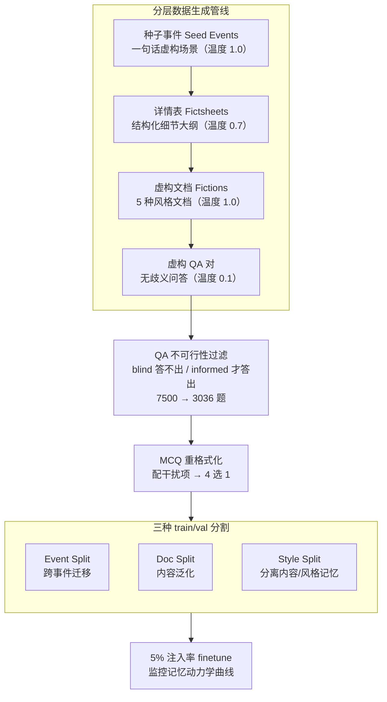

# FictionalQA: A Dataset for Studying Memorization and Knowledge Acquisition

**会议**: ICLR 2026  
**arXiv**: [2506.05639](https://arxiv.org/abs/2506.05639)  
**代码**: [https://github.com/jwkirchenbauer/fictionalqa](https://github.com/jwkirchenbauer/fictionalqa)  
**领域**: LLM预训练  
**关键词**: Memorization, Knowledge Acquisition, synthetic data, LLM Training Dynamics, Factual Memorization

## 一句话总结
提出 FictionalQA 数据集及生成管线，通过合成关于虚构事件的 webtext 风格文档和 QA 对，在受控环境下研究 LLM 训练中事实记忆与逐字记忆的双重过程，发现更多样的表面形式有助于知识获取而简洁的结构化列表反而最不利于泛化。

## 研究背景与动机

**领域现状**：LLM 训练中会发生两种记忆现象：逐字记忆（verbatim memorization，精确复述训练序列）和事实记忆（factual memorization，将训练中见过的事实泛化到新任务）。逐字记忆已被 Carlini 等人广泛研究，但对事实记忆的理解仍然有限。

**现有痛点**：研究事实记忆的难点在于难以量化某个事实在训练数据中出现的频率。现有数据集要么太模板化（TOFU 用 fill-in-the-blank）、太小（New News 仅 75 篇文章）、要么含科幻内容导致与真实世界知识产生纠缠（Fictional Knowledge 有星际旅行等题材）。

**核心矛盾**：需要同时满足"表面形式逼真"和"事实内容完全虚构"两个条件——逼真才能模拟真实训练场景，虚构才能确保事实不与预训练语料中的真实知识交互，以实现受控实验。

**本文目标** 构建一个"洁净室"式的合成数据集，使研究者能在严格控制条件下区分和研究不同形式的记忆现象，特别是事实记忆的训练动力学。

**切入角度**：用 GPT-4o 生成分层结构的虚构数据——种子事件 → 详情表 → 多风格文档 → QA对，并设计多种 train/val 分割策略来分离不同因素。

**核心 idea**：通过可控的虚构合成数据，在实验室环境中揭示事实记忆与逐字记忆发生条件不同，多样化表面形式促进知识获取而最简洁的事实表述反而最不利于泛化。

## 方法详解

### 整体框架

要在受控条件下研究 LLM 的记忆现象，核心难点是造出一批"长得像真实 webtext、但事实完全虚构"的数据，并且让"表面风格"和"事实内容"能当成两个独立变量来切。FictionalQA 为此把数据构造拆成一条层层展开的生成管线，再接两道后处理，最后用三种切分喂给训练：先用 GPT-4o 从一句话的种子事件（Seed Events）逐级扩写出结构化详情表（Fictsheets）、5 种风格的虚构文档（Fictions）和无歧义的 QA 对，每级用不同温度控制发散程度；生成完再做 QA 不可行性过滤（剔掉模型靠先验就能答对的题，7500 题筛到 3036 题）和 MCQ 重格式化（配干扰项转成 4 选 1 便于打分）；最后把同一批数据按事件 / 文档 / 风格三种方式切成 train/val，以 5% 的低注入率混进真实 webtext 做 finetune，全程监控训练/验证 loss 与 MCQ 准确率，观察事实记忆何时出现。

### 关键设计

**1. 分层数据生成管线：把"一个虚构事实"摊成多种表面形式**

要研究表面形式多样性如何影响知识获取，前提是同一个虚构事实能以风格各异的文本反复出现，且这些文本都"长得像真实 webtext"。管线为此设计成层层展开的四级结构，每级用不同温度控制随机性：种子事件（Seed Events）是一句话的虚构场景描述，用高温 1.0 保证发散多样；Fictsheets 把种子扩写成含人物、地点、具体细节的结构化大纲，温度降到 0.7 收敛细节；Fictions 再把同一份 Fictsheet 展开成 5 种风格的文档——新闻、社交媒体、百科、企业文档、博客，温度回到 1.0 拉开风格差异；QA 对则从文档里抽取无歧义的问答，温度压到 0.1 保证答案确定。这样同一个底层事实就有了一份"骨架"（Fictsheet）加 5 份"血肉"（多风格文档），后续才能把"事实内容"和"表面风格"当作两个独立变量来切。

**2. QA 标注的不可行性过滤：剔掉模型本来就会答的题**

合成 QA 有个隐患——有些问题靠 GPT-4o 自己的先验知识就能蒙对，那训练后 QA 准确率上升就分不清是真学到了虚构事实，还是先验在起作用。过滤的做法是让同一个 GPT-4o 在两种条件下各答一遍：blind 模式只给问题，informed 模式给问题加对应虚构文档，只保留 blind 答不出、informed 才答得出的那些 QA。经过这道闸，实验里观测到的任何 QA 提升就只能归因于训练数据里的事实记忆，把先验知识这个混淆变量挡在了门外。

**3. 三种 train/val 分割：用切分方式把"泛化"拆成不同维度**

同一批数据怎么切成训练/验证，直接决定能测出哪种泛化。论文设计了三种正交的切法。Event Split 把 2/3 种子事件的全部文档拿去训练、1/3 整个留作验证，验证集在内容上与训练集毫无交集，测的是跨事件的知识迁移。Doc Split 则在每个种子事件的每种风格里各留 1 篇做验证，于是验证集的内容和风格都在训练分布内（in-distribution），测的是同一事实在新文档上的内容泛化。Style Split 介于两者之间——每个事件训练 4 种风格、留 1 种作验证，内容匹配但风格 out-of-distribution，专门用来把"内容记忆"和"风格记忆"分离开。三种切法一摆，就能分别回答"事实没见过能不能迁移""见过的事实换篇文档认不认得""换种文风还认不认得"这三个问题。

**4. 训练实验设计：5% 低注入率把模型卡在"泛化窗口"里**

实验在 Llama 3.1/3.2、Gemma 1/2 的 base checkpoint 上 finetune，配方是 5% 虚构数据混 95% 真实 webtext，50 步 warmup 后再注入虚构数据。注入率压到 5% 是关键考量：如果虚构数据占比太高，模型会直接逐字背下整段文本，纯 verbatim 记忆占主导，事实泛化就被淹没看不见了；保持低注入率才能让模型停在既没完全背诵、又开始抽取事实的"泛化窗口"中，从而观察事实记忆的出现过程。训练时同步监控训练/验证 loss、QA 条件答案 loss、MCQ 准确率这几条动力学曲线，并用 TriviaQA 盯着真实世界知识有没有被虚构数据破坏。

### 损失函数 / 训练策略

标准的 next-token prediction loss（交叉熵），核心是通过不同数据分割和注入策略来研究记忆动力学，而非提出新的训练目标。

## 实验关键数据

### 主实验

| 实验设置 | 观测指标 | 关键结果 |
|---------|---------|---------|
| Doc Split vs Event Split | 验证 loss 最小值 | Doc Split 的泛化更好（验证 loss 更低），因为所有事实都被部分覆盖 |
| Fictsheets Split | 验证 loss 趋势 | 几乎立即过拟合，无可观测的泛化期 |
| 各模型 MCQ 准确率 | 随训练步数变化 | 更大模型 MCQ 准确率更高，且上升更快 |
| 不同分割的 MCQ | 分割类型 vs MCQ | Doc Split 和 Style Split 转移效果最好，Fictsheets 最差 |

### 消融实验

| 配置 | QA 转移效果 | 说明 |
|------|-----------|------|
| Doc Split (5种风格, 同事件) | 最强 | 多样化表面形式 + 完整事实覆盖 |
| Style Split (4种风格训练) | 较强 | 风格变化但事实完整 |
| Event Split (不同事件) | 中等 | 事实不完整覆盖限制泛化 |
| Fictsheets (结构化列表) | 最弱 | 最简洁但表面形式最单一 |
| Base Webtext Only (控制组) | 无效果 | 确认提升来自虚构数据 |

### 关键发现
- **逐字记忆和事实记忆的发生条件不同**：Fictsheets 被快速逐字记忆（训练 loss 降到接近 0），但事实记忆（MCQ 准确率提升）几乎没有
- **表面形式多样性促进知识获取**：训练在多风格文档上比训练在结构化列表上产生更好的 QA 泛化，这与直觉相反——人类可能觉得结构化列表更容易提取知识
- **知识获取机制存在"泄漏"**：即使某些事实完全不在训练集中（Event Split 的验证集），模型在对应 MCQ 上的准确率仍有提升，说明模型可能依赖分布特征而非原子事实
- **大模型知识获取更快**：8B 模型比 1B 模型在 MCQ 准确率上提升更快更高

## 亮点与洞察
- **"简洁不等于有效"的反直觉发现极具启发性**：结构化的事实列表（Fictsheets）导致快速过拟合但最差的知识泛化，而多样化的自然语言文档反而促进事实记忆。这暗示 LLM 的知识获取依赖分布模式而非显式事实编码。
- **数据集设计为"活资产"**：管线可以重新生成新数据集，其他研究者可以复用和修改。这种方法论比一次性的静态数据集有更大的长期价值。
- **严格的 blind/informed 标注和 TriviaQA 控制实验** 确保了实验结论的可信度，是很好的实验设计范本。
- 事实记忆的"泄漏"现象表明，LLM 的知识边界可能比预期更模糊，对 machine unlearning 研究有直接启示。

## 局限与展望
- 虚构文档之间可能存在未预期的内容重叠（跨种子事件的相似性），导致"泄漏"效应可能部分来自数据本身而非模型行为
- 仅用 GPT-4o 生成数据，生成模型的偏置可能影响结论的泛化性
- 实验仅在 <8B 规模模型上进行 finetune，大规模预训练场景下的行为可能不同
- 5% 注入率是固定的，未系统研究注入率对不同记忆形式的影响
- QA 对的去重不够完善，文中承认存在大量重复问题

## 相关工作与启发
- **vs TOFU 数据集**: TOFU 为 unlearning 设计，用 fill-in-the-blank 模板，缺乏表面形式多样性且不发布源文档。FictionalQA 同时提供文档和 QA，多风格设计更接近真实预训练数据。
- **vs Allen-Zhu & Li 的合成传记**: 那些传记较为模板化，FictionalQA 的 webtext 风格更自然多样，适合研究表面形式多样性的影响。
- **vs New News (Park et al. 2025)**: 仅 75 篇手工策划的文章 + 375 个问题，FictionalQA 规模更大且完全自动化。
- **vs Fictional Knowledge (Chang et al. 2024)**: 含科幻内容（星际旅行），可能与真实知识纠缠；FictionalQA 刻意避免此类题材。

## 评分
- 新颖性: ⭐⭐⭐⭐ 分层生成管线和多分割策略的设计巧妙，但核心想法（用虚构数据研究记忆）并非全新
- 实验充分度: ⭐⭐⭐⭐ 多模型多分割的系统实验，但缺乏大规模预训练实验
- 写作质量: ⭐⭐⭐⭐⭐ 结构清晰，实验设计的 motivation 讲解细致，控制变量严谨
- 价值: ⭐⭐⭐⭐ 对理解 LLM 记忆机制有学术价值，数据集作为可复用资产有长期影响力

<!-- RELATED:START -->

## 相关论文

- [\[ICLR 2026\] TNT: Improving Chunkwise Training for Test-Time Memorization](tnt_improving_chunkwise_training_for_test-time_memorization.md)
- [\[ICLR 2026\] Pretraining with Hierarchical Memories: Separating Long-Tail and Common Knowledge](pretraining_with_hierarchical_memories_separating_long-tail_and_common_knowledge.md)
- [\[ICLR 2026\] Nemotron-CC-Math: A 133 Billion-Token-Scale High Quality Math Pretraining Dataset](nemotron-cc-math_a_133_billion-token-scale_high_quality_math_pretraining_dataset.md)
- [\[ICLR 2026\] Pre-training Limited Memory Language Models with Internal and External Knowledge](pre-training_limited_memory_language_models_with_internal_and_external_knowledge.md)
- [\[ACL 2025\] Second Language (Arabic) Acquisition of LLMs via Progressive Vocabulary Expansion](../../ACL2025/llm_pretraining/second_language_arabic_acquisition_of_llms_via_progressive_vocabulary_expansion.md)

<!-- RELATED:END -->
