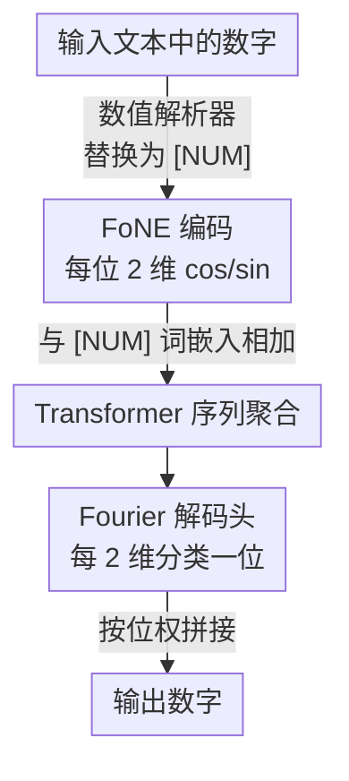

# FoNE: Precise Single-Token Number Embeddings via Fourier Features

**会议**: ICLR 2026  
**OpenReview**: [https://openreview.net/forum?id=g0vtWmwDDh](https://openreview.net/forum?id=g0vtWmwDDh)  
**领域**: LLM预训练 / 数字表征 / Tokenization  
**关键词**: 数字嵌入, Fourier 特征, 单 token, 算术任务, 频率偏差

## 一句话总结
FoNE 用一组不同周期的正余弦（Fourier 特征）把任意数字直接映射成**单个 token** 的嵌入，每位数字只占 2 维，从而绕过分词碎片化与频率偏差；一个 38M 的从零训练 Transformer 在加减乘上就能超过微调的 Llama-3.2-1B，并且是唯一在十万级测试样本上达到 100% 准确率的方法。

## 研究背景与动机

**领域现状**：当前 LLM 把数字当成普通词 token 处理，要么用 subword 分词（GPT-4o、Llama-3、Phi-2），要么用 digit-wise 分词（Llama-2、Mistral），再由模型从多个 token 里"拼"出数值。

**现有痛点**：这种做法有两个具体毛病。其一是**频率偏差**——数字 token 的嵌入主要反映它在语料里出现的频率，而非数值本身的大小/进位等数学性质，于是模型按"训练数据里常不常见"来猜数，而不是按数值规律算数。其二是**碎片化**——一个数字被切成多个 token，模型必须跨 token 聚合才能恢复数值，既低效又容易出错，导致连十亿参数模型都做不对多位加法和乘法。

**核心矛盾**：词的表征可以靠共现统计学出来，但数字需要的是**系统化、与频率无关**的表征；用学词的方式（co-occurrence）去学数，天然学不出精确的数值结构，也无法外推到更大的数。

**切入角度**：可解释性研究发现，预训练 LLM 在内部其实自发地用一组**稀疏的 Fourier 特征**来表示数字 token，这些特征同时编码了数的大小和精确值（Zhou et al., 2024）。既然模型"想要"的就是 Fourier 表征，不如干脆**直接构造**这种表征，跳过分词和"自己学"的环节。

**核心 idea**：用一组不同周期的 $\cos/\sin$ 把数字直接写进嵌入空间——每位数字只用 2 维、整个数字编成 1 个 token，从根上消除碎片化与频率偏差。

## 方法详解

### 整体框架
FoNE 要解决的是"如何让一个数字在 LLM 里既是单 token、又携带精确数值"。整条链路是：输入文本里的数字先被数值解析器识别并替换成特殊 token `[NUM]`，同时记录其规范数值；这个数值经 **FoNE 编码器**算成一组 Fourier 特征向量（每位数字 2 维），加到 `[NUM]` 的词嵌入上送进 Transformer；输出端用一个 **Fourier 解码头**把最后一层隐状态按"每 2 维对应 1 位数字"拆开，对每位做 10 类分类，再按位权拼回完整数字。也就是说，编码端把数装进周期函数、解码端从周期函数里读数，中间的 Transformer 照常做序列聚合。

### 关键设计

**1. FoNE 编码：用多周期正余弦把每位数字压进 2 维**

针对碎片化和频率偏差，FoNE 不再依赖分词，而是给定一个圆嵌入 $\phi(x, T) = \left(\cos\frac{2\pi}{T}x,\ \sin\frac{2\pi}{T}x\right)$，把数字 $x$ 映射到单位圆上的一点。完整嵌入取一组周期 $T_i = 10^i$（$i$ 从 $-n+1$ 到 $m$，$m$、$n$ 是全局固定的整数位与小数位上限）：

$$\mathrm{FoNE}(x, m, n) = \big[\phi(x, T_{-n+1});\ \phi(x, T_{-n+2});\ \dots;\ \phi(x, T_m)\big].$$

之所以"每个 $T$ 抓一位数字"，关键在一条引理：给定 $\left(\cos\frac{2\pi}{T}x,\ \sin\frac{2\pi}{T}x\right)$ 就能恢复 $x \bmod T$。于是 $T_i=10^i$ 这一组周期分别给出 $x \bmod 10$、$x \bmod 100$……每个余数对应一位数字。为什么不只用一个大周期？因为 $T$ 很大时 $\phi(x)$ 与 $\phi(x+1)$ 在圆上几乎重合，相邻数值无法区分；用从小到大的一组 $10^i$ 才能让每一位都被清晰刻画。这样每位数字只占 2 维、整个数字是 1 个 token，且由于数值是按比例（ratio）写进 $\cos/\sin$ 的，**对 LayerNorm/RMSNorm 不敏感**——这正是它比靠幅值的 xVal 更稳的原因。维度对齐到模型的 $d$ 维时，既可用可学习线性层 $W\in\mathbb{R}^{d\times 2(m+n)}$，也可直接补零，二者效果相当。

**2. Fourier 解码头：把隐状态按位拆开做分类而非回归**

数字空间是连续的，给所有可能数字逐一算 logit 不现实，所以 FoNE 设计了一个解码头，把"恢复数字"变成"逐位分类"。它约定最后一层隐状态 $h$ 的每相邻 2 维对应 1 位：第 $i$ 位取 $(h[2i], h[2i+1])$，与候选集 $\{\phi(0,10),\dots,\phi(9,10)\}$ 中 10 个圆嵌入做内积，谁最相似就预测哪个数字：

$$\hat{y}_i = \arg\max_{j\in\{0,\dots,9\}} \big(h[2i], h[2i+1]\big)\cdot \phi(j, 10).$$

训练用交叉熵的 Fourier Number Loss $\mathcal{L}_{\mathrm{FoNE}}(h,y,i) = \mathcal{L}_{\mathrm{CE}}\big(y_i,\ [h[2i],h[2i{+}1]]\cdot[\phi(0,10);\dots;\phi(9,10)]^\top\big)$，对所有位取平均。注意所有位共用同一个 10 类候选集——因为不论位权大小，每位都只是 $\{0,\dots,9\}$ 的一个，这让所有位能**并行解码**。坚持分类而非回归，是因为回归会吐出 "1996.9999" 这类连续值，在 token 级生成里不可用；分类损失则能与标准 LLM 训练无缝衔接。

**3. `[NUM]` 集成与长数字分块：让 FoNE 嵌进任意文本与超长数**

真实文本里数字格式五花八门（`1,234.56`、`$99.99`、`3.14e-2`），FoNE 先用一个标准数值解析器统一识别并取规范值，再把原数字替换成词表里新增的单一 `[NUM]` token；该 token 的词嵌入与该数的 FoNE（以及位置嵌入，若架构使用）相加后入模，输出端一旦预测到 `[NUM]` 就调用解码头还原数值。这样 FoNE 既能处理纯算术数据，也能塞进通用语料。对于超过 float64 精度上限（约 15 位）的超长数字，FoNE 把数字切成若干 5 位的 chunk，对每个 chunk 各算一段 10 维表征再拼接——**整个数仍只占 1 个 token**，由此 8 层 Transformer 在 60 位加法上一次前向就能拿到 97.42% 的平均准确率。

## 实验关键数据

### 主实验
在 6 位十进制加法上比较数据效率与最终误差（从零训练同规模 Transformer）：

| 方法 | 达 ≥99% 所需训练样本 | 每个数 token 数 | 是否达 100% |
|------|---------------------|----------------|-------------|
| FoNE（本文，~37.55M） | 6,400 | 1 | 是（51,200 样本） |
| Digit-wise | 409,600 | 6 | 否 |
| Subword | 409,600 | 3 | 否 |
| 微调 Llama-3.2-1B | —（被 3,200 样本的 FoNE 超过） | — | 否 |

FoNE 比 subword / digit-wise 少用 **64×** 数据即可达 99%，每个数 token 数分别是它们的 1/3 与 1/6；FoNE 是唯一在 6 位十进制加法、6 位整数加法、5 位减法、3 位乘法上都拿到满分的方法。训练/推理效率（一个 epoch）：

| 方法 | 十进制加法准确率 | 乘法准确率 | 减法训练时间 |
|------|----------------|-----------|-------------|
| FoNE | 100 | 98.56 | 2′42″ |
| Digit-wise | 99.85 | 81.21 | 9′41″ |
| Subword | 97.94 | 8.05 | 5′47″ |
| XVAL | 0.44 | 0 | 2′54″ |

### 消融实验
| 配置 | 关键指标 | 说明 |
|------|---------|------|
| 线性层对齐 vs 补零 | 100% vs 100%（加法） | 两种维度对齐方式等价 |
| 周期 [2,5,10] vs [10] | 100 vs 100 | 二者相当，单 10 更省参数 |
| 仅周期 [5] | 1.52（十进制加法） | 单 mod5 无法区分如 2 与 7 |
| 仅周期 [7] | 3.64 | mod7 无法表示十进制各位 |
| 直接编码 [5,6,7]（无正余弦） | 99.3%（需 100 epoch） | LayerNorm 后 999/888 难区分，FoNE 仅 6 epoch 更优 |

### 关键发现
- **正余弦编码是必需的**：直接把数字各位塞进独立维度（如 567→[5,6,7]）会在 LayerNorm 后让 999 与 888 难以区分，最佳也只有 99.3% 且要训 100 epoch，而 FoNE 6 epoch 即更优。
- **周期必须覆盖各个数量级**：只用 mod5 或 mod7 都掉到个位数准确率，因为单一模数无法承载十进制每一位的信息；$10^i$ 这组周期才能逐位对齐。
- **不损害语言能力**：用 4 种数字编码方案从零预训练 GPT-2-117M 跑 10B FineWeb token，FoNE 取得最低验证困惑度（46.8，优于 xVal 48.8 / BPE 52.6 / SingleDigit 48.7）。
- **可叠加在现有 LLM 上**：对 Llama-3.1-1B 做简化版 FoNE 的持续预训练（15B token），4 位加法零样本从 51.35% 提到 59.00%、5 位加法 29.40%→35.75%，且 MMLU 不掉。
- **可与位置嵌入互补**：把 Abacus 的各位数字嵌入替换为对应 FoNE，10 位训练、50 位测试的长度外推一致变好。

## 亮点与洞察
- **从"模型偷偷在学的东西"反推设计**：作者不是凭空发明编码，而是看到预训练 LLM 内部本就长出 Fourier 特征，于是直接把它构造出来——这种"把可解释性发现反向工程成显式归纳偏置"的思路很可迁移。
- **对归一化免疫是关键技术点**：FoNE 用 $\cos/\sin$ 的比值表数，天然不受 LayerNorm/RMSNorm 缩放影响，这解释了它为何稳压靠幅值的 xVal——做嵌入设计时"让信息落在对归一化不变的量上"是一条可复用准则。
- **分类而非回归的取舍**：坚持逐位分类损失，换来与标准 LLM token 级训练的无缝兼容，避免回归输出 "1996.9999" 这类生成里没法用的连续值。
- **长数字分块仍是单 token**：把超长数切 5 位 chunk 再拼，既绕开 float64 精度墙，又保持"一个数一个 token"的效率承诺。

## 局限与展望
- **任务以算术/数值为主**：核心实验是加减乘、模加、线性分类等结构化数值任务，对需要数字参与复杂语义推理（如长文档量化推理）的真实下游收益验证仍有限。
- **依赖全局固定的位长 $m,n$**：整数位与小数位上限是为整个数据集/模型预设的超参数，而非按数自适应；超出范围或精度需求变化时需重新设定或分块。
- **持续预训练用的是简化版 FoNE**：为降低改造难度，融入现有 LLM 时是在 BPE 之上加对齐投影层的简化方案，与从零训练的完整 FoNE 并非同一形态，二者效果差异未充分对比。
- **改进思路**：作者提出每位 2 维之外可叠加更多特征以编码更丰富的数值属性（如符号、量纲），以及探索非十进制基底以适配特定任务。

## 相关工作与启发
- **vs xVal (Golkar et al., 2023)**：xVal 用单个标量幅值缩放一个共享嵌入来表数，受归一化影响大、且单位圆难分量级；FoNE 用多周期 $\cos/\sin$ 的比值，既抗归一化又能同时刻画大小与周期性，准确率与稳定性都更高。
- **vs digit-wise / subword 分词**：传统方案把一个数切成多 token、靠模型聚合，效率低且带频率偏差；FoNE 单 token 编码，token 数降到 1/3~1/6、数据需求降 64×。
- **vs Abacus (McLeish et al., 2024a)**：Abacus 是面向 digit-wise 的位置嵌入、解决对齐与长度外推；FoNE 与之正交，可把各位数字嵌入替换为 FoNE 实现互补，外推更好。
- **vs DICE / SALSA**：这两者把数字映到单个单位圆，难以区分不同数量级；FoNE 用多正弦分量同时编码量级与周期，区分力更强。

## 评分
- 新颖性: ⭐⭐⭐⭐⭐ 把可解释性发现（LLM 内生 Fourier 特征）反向工程成显式单 token 数字编码，思路干净有力。
- 实验充分度: ⭐⭐⭐⭐⭐ 覆盖数据/参数效率、多种算术任务、60 位外推、GPT-2 预训练与 Llama 持续预训练，且消融到位。
- 写作质量: ⭐⭐⭐⭐ 定义与引理清晰、图示直观，部分理论细节下放附录。
- 价值: ⭐⭐⭐⭐⭐ 简单、可叠加、不伤语言能力，是数字表征方向很有落地潜力的基础设计。

<!-- RELATED:START -->

## 相关论文

- [\[ICLR 2026\] Understanding the Emergence of Seemingly Useless Features in Next-Token Predictors](understanding_the_emergence_of_seemingly_useless_features_in_next-token_predicto.md)
- [\[NeurIPS 2025\] Optimal Online Change Detection via Random Fourier Features](../../NeurIPS2025/llm_pretraining/optimal_online_change_detection_via_random_fourier_features.md)
- [\[ICLR 2026\] A Law of Data Reconstruction for Random Features (and Beyond)](a_law_of_data_reconstruction_for_random_features_and_beyond.md)
- [\[ICLR 2026\] Token-level Data Selection for Safe LLM Fine-tuning](token-level_data_selection_for_safe_llm_fine-tuning.md)
- [\[ICLR 2026\] ssToken: Self-modulated and Semantic-aware Token Selection for LLM Fine-tuning](sstoken_self-modulated_and_semantic-aware_token_selection_for_llm_fine-tuning.md)

<!-- RELATED:END -->
