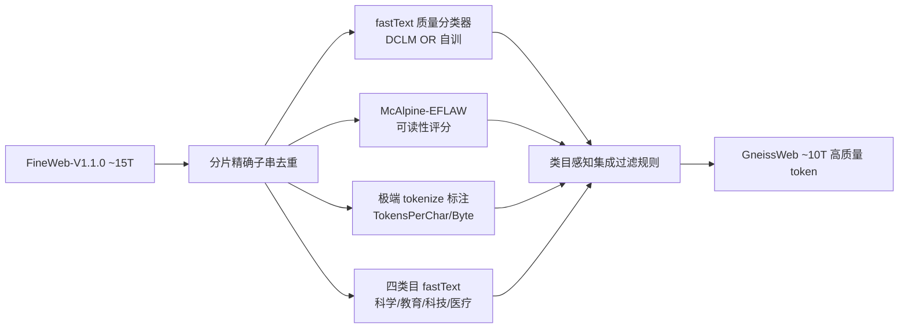

# GneissWeb: Preparing High Quality Data for LLMs at Scale

**会议**: ICLR 2026  
**OpenReview**: [https://openreview.net/forum?id=NRWUAo075J](https://openreview.net/forum?id=NRWUAo075J)  
**代码**: [IBM/data-prep-kit](https://github.com/IBM/data-prep-kit) · [数据集 ibm-granite/GneissWeb](https://huggingface.co/datasets/ibm-granite/GneissWeb)  
**领域**: LLM 预训练 / 数据集构建  
**关键词**: 预训练数据集, 数据质量过滤, 去重, 可读性评分, 集成过滤  

## 一句话总结
GneissWeb 用「分片精确子串去重 + 一组互补的新颖质量过滤器集成」从 15T 的 FineWeb 蒸馏出约 10T 高质量 token，让 7B 模型在 11 个基准上平均超过 FineWeb 训练版 2.73 个百分点，填补了「<5T 小而精」和「>15T 大而糙」之间的空白。

## 研究背景与动机
**领域现状**：领先 LLM（Llama-3 训了 15T token、Gemma-2 训 13T、Granite-3.0 训 12T）的预训练数据普遍远超 Chinchilla 最优规模，且其数据配方不公开。开源界为此造了一批数据集（FineWeb、RedPajama、DCLM 等），大多从 Common Crawl 处理而来。

**现有痛点**：大模型 Stage-1 长 token 预训练需要「又大又干净」的语料，但现有开源集要么**量够质糙**（FineWeb 15T、RedPajama v2 30T，质量一般），要么**质好量少**（FineWeb-Edu 1.3T、DCLM-Baseline 3.8T 靠激进的模型分类器过滤把规模砍到 <5T，不足以支撑只过一两遍数据的预训练）。

**核心矛盾**：单纯依赖一个 model-based 质量分类器做激进过滤，要么误删大量好数据、要么放过低质文档，无法在「质量」和「保留 token 量（要凑够 ~10T）」之间取得细粒度平衡。

**本文目标**：造一个可复用、可规模化的 Stage-1 数据配方，从 FineWeb 蒸馏出约 10T 高质量 token，在不牺牲规模的前提下显著提升下游性能。

**核心 idea**：**集成而非单点**——不靠一个分类器，而是把多个刻画文本不同侧面的质量信号（fastText 分类器、可读性、tokenize 异常）组合成一个集成过滤规则；同时**类目感知**——按文档领域（科学/教育/科技/医疗等）施加宽严不同的阈值，避免对教育类长文「一刀切」误杀。

## 方法详解

### 整体框架
GneissWeb 配方是一条接在 FineWeb-V1.1.0 之上的流水线：先做**分片精确子串去重**清掉文档内/跨文档的逐字重复，再对每篇文档打上多路质量标注（两个 fastText 质量分类器、McAlpine-EFLAW 可读性分、极端 tokenize 标注、四个类目分类器），最后用一个**集成质量过滤规则**联合这些信号、在「保留约 10T token」的约束下决定每篇文档去留。全部步骤基于开源 Data Prep Kit 在 Kubernetes 集群上规模化运行，并额外用 Bloom filter 提供轻量复现路径。

### 关键设计

**1. 分片精确子串去重：在 FineWeb 模糊去重之上再清逐字重复。** FineWeb 只做了每快照内的 fuzzy 去重，序列级的逐字重复仍残留在文档内和跨文档之间。本文改造 Lee et al. 基于后缀数组（suffix array）的精确子串去重实现，移除任何长度超过阈值、逐字重复出现一次以上的子串，并把它改成**分片（sharded）**执行以适配 10T 级规模。去重虽在小 token 量下看不出收益，但在 350B token 的 1.4B 消融里把高信号平均分从 55.99% 提到 57.39%。

**2. 双 fastText 质量分类器取并集：互补而非二选一。** 沿用 fastText 二分类器的高效率，本文同时用两个分类器——一个是 DCLM 提供的（在 OpenHermes-2.5 指令数据 + ELI5 高分帖上训的），另一个是自训的（在 Cosmopedia 合成数据等正例 + 用 Mixtral-8x22B 标注的 FineWeb 负例上训，40 万文档正负各半、用 bigram）。两者并集（`DCLM-fastText OR our-fastText`）作为集成里的 fastText 组件：单独用任一个都把高信号分从 51.94% 推到 52.3~52.5%，并集进一步到 52.92%，说明两个分类器抓的是不同的低质模式。

**3. 类目感知可读性过滤：用阅读难度筛掉读不通的文档。** 引入 McAlpine-EFLAW 可读性公式 $\text{score}(D)=(W+M)/S$，其中 $W$ 是词数、$M$ 是「迷你词」（≤3 字符的词）数、$S$ 是句子数，分越低越易读。作者实测它优于 Flesch-Kincaid、ARI、Gunning Fog 等候选。关键在于**按类目调阈值**：科学、教育、科技与计算、医疗健康这几类教育性长文天然可读性分偏高，于是对它们放宽阈值、对其余类目收紧，避免误删高质教育内容。单这一项就把高信号分从 51.94% 提到 53.20%。

**4. 极端 tokenize 文档移除：用「分词前后不一致」抓隐藏低质。** 作者发现有些被 fastText 和可读性都误判为正常的低质文档，在 tokenize 后会产生异常的 token 数——字符长度相近的文档 token 数却差异巨大。于是定义两个标注：$\text{TokensPerChar}=\frac{\#\text{tokens}}{\#\text{chars}}$ 和 $\text{TokensPerByte}=\frac{\#\text{tokens}}{\text{bytes}}$，把落在某类目分布两个极端的文档判为「极端 tokenize 文档」剔除，同样按类目宽严分阈值。这个跨「pre-tokenization / post-tokenization」信号的过滤器把高信号分提到 52.85%。

**5. 集成过滤规则：在保 10T 约束下联合所有信号取最优。** 有了多路标注后，作者比较了五种集成聚合规则，调 fastText 阈值使最终保留约 10T token。GneissWeb 选用的集成规则在 35B 消融里达 54.29%，不仅超过 FineWeb 基线（51.94%），也超过任何单个过滤器和其余四种集成规则（52.56~53.53%），证明「组合多个互补信号」优于「堆一个强分类器」。该规则对操作顺序不变。

## 实验关键数据

### 主实验表格（同规模大数据集对比，1.4B 模型 350B token，3 seed 平均）

| 数据集 | Tokens | High-Signal | Extended |
|---|---|---|---|
| FineWeb-V1.1.0 | 15T | 56.26 ± 0.14 | 47.33 ± 0.30 |
| FineWeb-Edu-Score-2 | 5.4T | 57.36 ± 0.42 | 48.16 ± 0.29 |
| **GneissWeb** | **9.8T** | **58.40 ± 0.19** | **48.82 ± 0.27** |

3B / 7B 模型上结论一致：7B 模型 GneissWeb 高信号 67.34 vs FineWeb 64.61（+2.73），Extended 55.14 vs 53.39（+1.75）。

### 消融实验表格（各过滤器单独 vs 集成，35B token 高信号分）

| 配置 | High-Signal |
|---|---|
| FineWeb-V1.1.0 基线 | 51.94 |
| 仅可读性（McAlpine-EFLAW） | 53.20 |
| 仅极端 tokenize | 52.85 |
| 仅 fastText 并集 | 52.92 |
| 集成规则 1（次优） | 53.53 |
| **GneissWeb 集成规则** | **54.29** |

### 关键发现
- 每个新颖过滤器单独都能在基线上带来增益，集成后增益叠加且超过任意单项与其余集成规则。
- 增益随规模放大（1.4B→3B→7B）和评测集扩展（11→20 基准）稳定保持，符合「小规模消融可预测大规模」的经验。
- 去重收益要在足够大 token 量（260B+）才显现，小数据上几乎看不出。

## 亮点与洞察
- **「集成 + 类目感知」范式**：把数据清洗从「一个强分类器一刀切」升级为「多路互补弱信号 + 按领域调阈值」，在质量与保留量之间做细粒度权衡，这个思路可迁移到任何数据 curation 流程。
- **两个真正新颖的信号**：可读性评分和极端 tokenize 文档移除都是从「人类阅读」和「分词器行为」这两个被忽视的角度刻画质量，能抓住分类器漏掉的低质文档。
- **工程可复现性强**：全流程开源（Data Prep Kit transform + fastText 模型 + 数据集），还提供 28GB 的 Bloom filter 让人用 `is-in-GneissWeb` 布尔列低成本近似复现 ~12B 文档的数据集。

## 局限与展望
- 消融与对比集中在 1.4B–7B、100B–350B token，受限于算力没在更大模型/更多 token 上直接验证，靠「小-大规模高秩相关」外推。
- 强依赖 FineWeb 作为起点，虽声称配方可迁移到其他语料但未充分验证；类目划分依赖 IAB/WatsonNLP 分类体系，可能引入领域偏置。
- 阈值通过网格搜索在 8 个高信号任务子集上调，存在对评测集过拟合的风险（作者已用扩展集缓解）；可读性公式偏向「英语为外语者易读性」，对某些专业文本可能偏严。

## 相关工作与启发
对照 FineWeb（15T，模糊去重）、FineWeb-Edu / DCLM-Baseline（靠激进 model-based 过滤把规模砍到 <5T）、RedPajama v2（30T，质量一般），GneissWeb 的定位是「在保住 ~10T 规模的前提下提质」。启发在于：预训练数据工程的下一步不是造更强的单一质量分类器，而是设计**互补信号的集成 + 领域自适应阈值**；可读性、tokenize 异常等廉价统计信号值得纳入质量画像；同时用 Bloom filter 发布「成员判定」而非原始文本，是规避版权/规模分发难题的实用范式。

## 评分
- 新颖性: ⭐⭐⭐⭐ 可读性评分过滤与极端 tokenize 文档移除是真正新颖的质量信号，集成 + 类目感知框架有清晰贡献；但单项技术（去重、fastText）多为已有工具的工程组合。
- 实验充分度: ⭐⭐⭐⭐ 1.4B/3B/7B 三档规模、11+20 基准、3 seed 平均带标准差，逐项消融完整；扣分在于受算力限制未在更大模型直接验证。
- 写作质量: ⭐⭐⭐⭐ 结构清晰、每个过滤器都配独立消融，动机与设计交代到位；细节多压在附录略增阅读成本。
- 价值: ⭐⭐⭐⭐⭐ 完整开源 ~10T 数据集 + 配方 + 工具链 + Bloom filter，对开源 LLM 预训练社区有直接、可复用的高价值。

<!-- RELATED:START -->

## 相关论文

- [\[ICLR 2026\] Nemotron-CC-Math: A 133 Billion-Token-Scale High Quality Math Pretraining Dataset](nemotron-cc-math_a_133_billion-token-scale_high_quality_math_pretraining_dataset.md)
- [\[ICLR 2026\] How to Train Data-Efficient LLMs](how_to_train_data-efficient_llms.md)
- [\[ICLR 2026\] Scaling Laws Revisited: Modeling the Role of Data Quality in Language Model Pretraining](scaling_laws_revisited_modeling_the_role_of_data_quality_in_language_model_pretr.md)
- [\[ICLR 2026\] Joint Selection for Large-Scale Pre-Training Data via Policy Gradient-based Mask Learning](joint_selection_for_large-scale_pre-training_data_via_policy_gradient-based_mask.md)
- [\[ICLR 2026\] Learning Facts at Scale with Active Reading](learning_facts_at_scale_with_active_reading.md)

<!-- RELATED:END -->
