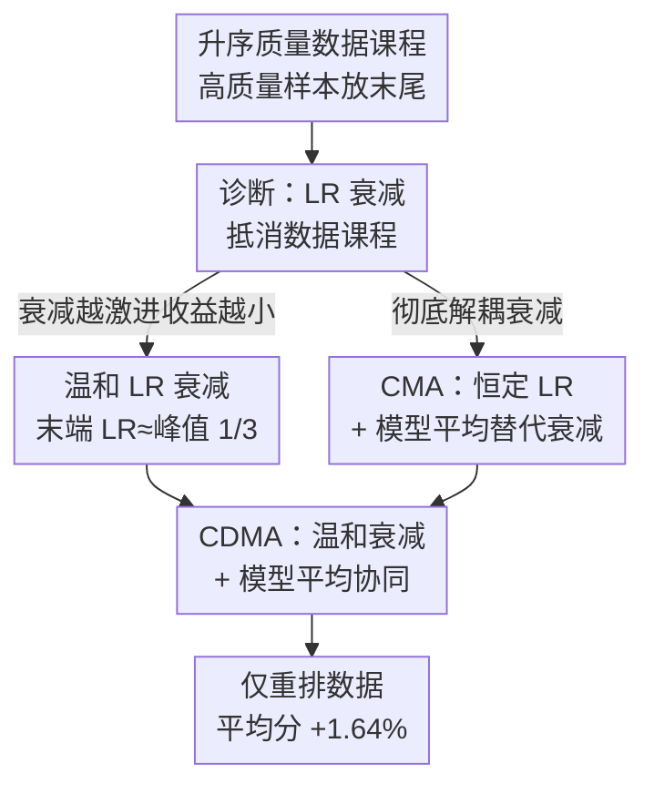

# How Learning Rate Decay Wastes Your Best Data in Curriculum-Based LLM Pretraining

**会议**: ICLR 2026  
**OpenReview**: [https://openreview.net/forum?id=T5wkZJqzkz](https://openreview.net/forum?id=T5wkZJqzkz)  
**领域**: LLM 预训练 / 课程学习 / 优化  
**关键词**: 数据课程, 学习率衰减, 模型平均, 预训练, 高质量数据

## 一句话总结
作者指出"按质量升序排数据的课程学习"与"学习率衰减"天然冲突——高质量数据被故意放在末尾，却正好撞上学习率衰减到最低、更新步长最小的阶段，于是好数据被白白浪费；通过"温和衰减 + 用模型平均替代衰减"两招，在 1.5B 模型 / 30B token 上仅靠重排数据就把标准 benchmark 平均分相对随机打乱提升了 1.64%。

## 研究背景与动机
**领域现状**：高质量数据稀缺，LLM 预训练通常在质量参差的混合语料上训练。除了在数据清洗阶段过滤、加权高质量数据，一个自然的想法是用**课程学习（curriculum learning）**：把数据按质量分数升序排列，让模型在训练后期才接触最优质的数据，从而在"灾难性遗忘"机制下让好知识留到最后、记得最牢。

**现有痛点**：但已有研究反复报告，这种实例级（instance-level）课程学习只带来很有限甚至令人失望的收益。为补救，有人提出 folding（折叠）课程——把数据切成几段、段内各自排序，让高质量数据更均匀地分布在训练全程；但作者发现 folding 很脆弱，换到更大规模、用广泛使用的 DCLM fastText 质量分时优势就消失了。

**核心矛盾**：作者识别出一个此前被忽视的关键因素——**升序的数据质量顺序与衰减的学习率（LR）调度互相抵消**。学习率在每步更新 $\theta_{t+1}=\theta_t-\eta_t g_t$ 中其实充当了每个样本的**隐式重要性权重**：梯度 $g_t$ 可拆成信号方向 $E[g_t]$ 和噪声 $\epsilon_t$，衰减的 $\eta_t$ 一方面压噪声稳住训练，另一方面也缩小了沿信号方向的步长。课程学习故意把高质量样本放在训练末尾，可恰恰此时常规 LR 调度把 $\eta_t$ 衰减到最小——最有价值的数据反而被"调小了音量"，课程的本意被削掉了。

**本文目标**：先证实这个冲突真实存在且随衰减越激进越严重，再给出能解开冲突、不需要任何额外数据清洗的简单训练策略。

**切入角度**：既然衰减是罪魁，那就两个方向修——要么让衰减"温和"一点（末端 LR 不要逼近零），要么干脆**不靠衰减来降噪、改用模型平均（weight averaging）**，从而全程保持高学习率、让末尾的高质量数据充分发力。

**核心 idea**：用恒定学习率 + 模型平均替代学习率衰减来配合数据课程（即 CMA），并进一步把"温和衰减 + 模型平均 + 课程"三者协同设计（CDMA），揭示一个被长期忽略的高性能预训练区间。

## 方法详解

### 整体框架
论文不是提出一个新网络，而是诊断"数据课程 × LR 调度"的耦合并给出修复配方。整体逻辑是：先用恒定 LR 隔离出"课程本身确实有效"，再证明常规衰减会吃掉这份收益、且越激进吃得越多；然后给三档逐步加强的解法——温和衰减（治标）、用模型平均替代衰减的 CMA（解耦，治本）、温和衰减再叠模型平均的 CDMA（协同，最稳最强）。所有结论在 1.5B 参数、30B token、多种质量分（DCLM / PreSelect）和多种数据混合（含 mid-training）上验证。

### 关键设计

**1. 诊断学习率衰减抵消数据课程：好数据撞上最小步长**

这是全文的支点。作者把 LR 解读为每个样本的隐式重要性权重：恒定 LR 下，按 DCLM 分升序排列的课程（Ascend）显著优于随机均匀（Uniform），验证损失更低、收敛更快，而降序课程（Descend）因为数据分布逐渐远离高质量验证集反而越训越差——说明只要不被衰减干扰，质量课程本身就很有效。可一旦换上 WSD 或 cosine 这类末端衰减到很低的调度，课程的优势就基本消失，cosine 因为全程衰减还更糟。作者进一步系统消融衰减激进程度：把 WSD 的衰减步数在训练的 37%/18%/6%/0%（Long/Mid/Short/Zero）之间变化、末端 LR 在 $1\times10^{-5}$ 到 $3\times10^{-3}$ 之间变化，发现衰减阶段越长、末端 LR 越低，课程相对 Uniform 的验证损失差 $L_{\text{Uniform}}-L_{\text{Ascend}}$ 就越小、最终趋于可忽略。结论清晰：高质量样本被故意安排在末尾，而末尾正是 LR 被压到最低、沿信号方向更新步长最小之处，于是最值钱的数据贡献被衰减抹掉。folding 课程能稍微缓解（把部分高质量数据提前到衰减前处理），但在 cosine 下仍打不过 Uniform，在恒定 LR 下又被简单端到端升序反超——说明它只是症状的权宜之计，没碰到根因。

**2. CMA：用模型平均替代学习率衰减，全程保持高 LR 榨干好数据**

既然衰减的"降噪"和"缩信号步长"是绑在一起的副作用，CMA（Curriculum Model Averaging）直接把衰减整体换掉：全程用**恒定 LR**，最后对训练末尾的若干 checkpoint 做加权平均当作最终模型。模型平均同样能稳住参数、抑制训练噪声（类似衰减的好处），却**不缩小更新幅度**，因此模型能在高质量数据登场的末段仍保持大步长、沿更清晰可靠的信号方向快速前进，再用平均把噪声方向上的抖动磨平。默认实现用指数滑动平均（EMA，$\alpha=0.2$）对最后六个 checkpoint 平均，另对比简单滑动平均 SMA 和加权滑动平均 WMA。关键发现是**协同**而非单独使用：EMA+Ascend 同时超过 WSD+Uniform、WSD+Ascend 和 EMA+Uniform——把课程和模型平均拆开任一个都只有有限收益，必须两者合用；而且让 checkpoint 权重与数据顺序对齐（EMA/SMA 给越靠后、质量越高的 checkpoint 越大权重）比 WMA 更好。直觉上（Figure 4 的损失景观视角）：Ascend+Decay 步长衰减太快，末尾好数据的信号没被用上；Ascend+EMA 在高质量区间保住更新幅度、又靠平均压噪，在"前进"和"稳定"间取得更优平衡。

**3. CDMA：温和衰减 + 模型平均协同，解锁被忽视的最优区间**

作者发现两条修法可以叠加。先单看温和衰减：对 Uniform 数据，末端 LR 越低验证损失越好（最优几乎贴零）；但对课程数据，收益随衰减变温和（更少衰减步、更高末端 LR）而**增大**，其最优末端 LR 约在 $1\times10^{-3}$，即峰值 LR 的约 1/3，远高于 Uniform 的最优值——这本身就说明"为均匀数据调好的超参不一定适合课程训练"。CDMA（Curriculum with LR Decay Model Averaging）把温和衰减再叠上 EMA：在末端 LR 从 $1\times10^{-5}$ 扫到 $3\times10^{-3}$ 的实验中，这个组合在温和衰减档位上给出最稳定也最优的结果，比单用温和衰减更不挑超参。由此提炼出操作指南：课程式预训练应当用比均匀数据更温和的 LR 衰减，并叠加模型平均。最终在 mid-training 设置下，最佳组合相对基线（Uniform+WSD、末端 LR $1\times10^{-5}$）把平均 benchmark 准确率提升约 1.68%，整体相对随机打乱 + 标准衰减提升 1.64%，全程没有任何额外数据精炼。作者还给了一个二次损失 $L(w)=\tfrac12\|w-w^*\|_2^2$ 上的 SGD 简化理论模型，复现了"用模型平均替代激进衰减才能让课程收益显现"的经验结论。

## 实验关键数据

### 主实验
1.5B 参数模型、30B token、DCLM-Baseline 数据、DCLM fastText 质量分；下游用 OLMES 框架评测，Core = MMLU/ARC-c/ARC-e/CSQA（高信噪比四项），Avg. 为九项平均。基线 WSD+Uniform 为最强标准组合。

| 配置 (WA / Order / LRS) | Core | Avg. | 相对基线 |
|---|---|---|---|
| ✗ / Uniform / Cos | 44.31 | 49.13 | −1.43 |
| ✗ / Uniform / WSD（基线） | 46.21 | 50.56 | — |
| ✗ / Ascend / WSD | 45.45 | 50.34 | −0.22 |
| EMA / Uniform / Const | 45.29 | 49.94 | −0.62 |
| **SMA / Ascend / Const** | **47.02** | **50.94** | **+0.38** |
| **EMA / Ascend / Const** | 46.95 | 50.95 | **+0.39** |

关键对比：把课程直接套上标准衰减（WSD+Ascend）反而比基线掉点；模型平均套在均匀数据上（EMA+Uniform）也追不平 WSD；只有"课程 + 模型平均 + 恒定 LR"（EMA/SMA+Ascend）才正向提升，印证两者缺一不可。

### mid-training 实验（混合质量，更贴近实践）

| 配置 (WA / Order / LRS) | Core | Avg. | 相对基线 |
|---|---|---|---|
| ✗ / U,U / WSD（基线） | 41.61 | 47.49 | — |
| ✗ / A-T / WSD | 42.73 | 48.01 | +0.52 |
| EMA / U,A / Const | 41.30 | 47.45 | −0.04 |
| **EMA / A,A / Const** | **43.61** | **48.69** | **+1.20** |
| **EMA / A-T / Const** | 43.82 | 48.69 | **+1.20** |
| **SMA / A-T / Const** | 43.90 | 48.69 | **+1.20** |

mid-training 下 CMA 收益更大：EMA+A-T 相对 WSD+U,U 平均 +1.20%、Core 超过 +2.0%。作者解释：高质量数据稀疏时每个好样本的更新信号相对更值钱，放大了 CMA 的好处。

### 关键发现
- **只在末段加课程不够**：U,A（仅高质量阶段排序）几乎无收益（−0.04），而 A,A（两阶段都升序排）+2.00 Core——说明对前期低质量阶段也排序有益，可能借遗忘机制削弱混进来的"毒样本"影响。
- **衰减越激进、课程越没用**：验证损失差 $L_{\text{Uniform}}-L_{\text{Ascend}}$ 随衰减步数增多 / 末端 LR 降低而单调缩小。
- **超参区间会偏移**：课程训练的最优末端 LR（约 $1\times10^{-3}$）远高于均匀训练（约 $1\times10^{-5}$），用错区间正是过去课程学习"收益甚微"的原因。
- **鲁棒性**：换质量分（PreSelect）、换未过滤数据集（WebOrganizer）结论依旧成立。

## 亮点与洞察
- **把 LR 重新解读为"样本重要性权重"**：一句话点破了课程学习和优化调度本是耦合的两件事，过去却被各自孤立研究——这是全文最"啊哈"的洞见。
- **用模型平均替代衰减**很巧：衰减把"降噪"和"缩步长"绑死，模型平均只取前者、保住后者，于是高质量数据能在大步长下被充分利用。
- **强调"为均匀数据调的超参不能照搬到课程训练"**：很多课程学习的负面结论可能只是超参区间用错了，这个方法论提醒可迁移到任何"换了训练范式却沿用旧超参"的场景。
- 纯靠重排数据 + 改优化策略、零额外数据清洗就拿到 1.64% 提升，工程上几乎零成本。

## 局限与展望
- 规模止步 1.5B / 30B token，作者自陈是"足以支撑结论"的规模，但能否外推到几十 B 参数 / 万亿 token 仍待验证。
- 最优末端 LR（约峰值 1/3）、EMA 的 $\alpha$ 与平均窗口都依赖具体设置，缺一套自适应选取的配方；作者把"系统化的组合配方"列为未来工作。
- 理论部分只是 $\mathbb{R}^2$ 二次损失上的 SGD 简化模型，与真实 Adam + Transformer 的差距较大，仅作直觉佐证。
- 结论建立在"高质量数据放末尾"的升序假设上，若质量分本身噪声大或分布漂移，课程的前提可能失效。

## 相关工作与启发
- **vs 多阶段 / mid-training 预训练**：OLMo 2 / Phi-4 等用两阶段把高质量数据放后期，本文从实例级排序切入并指出它们也受 LR 衰减拖累，CMA 在 mid-training 下收益尤其明显。
- **vs folding 课程（Dai 2025 / Zhang 2025）**：folding 把好数据均匀铺开来躲衰减，本文证明它脆弱（大规模 + DCLM 分下优势消失），且只是治标；恒定 LR 下简单端到端升序反而最强。
- **vs 模型平均工作（Izmailov SWA / Tian 2025 / Li 2025c）**：以往把权重平均用在均匀数据上，本文揭示它与课程学习协同才有更大收益，单独用在均匀数据上甚至追不平 WSD。

## 评分
- 新颖性: ⭐⭐⭐⭐⭐ 点破"数据课程 × LR 衰减"耦合这一被忽视因素，视角新且解释力强
- 实验充分度: ⭐⭐⭐⭐ 多质量分 / 多调度 / mid-training 验证扎实，但规模偏小、缺更大模型外推
- 写作质量: ⭐⭐⭐⭐⭐ 诊断→机制→三档解法层层递进，图表与直觉解释清晰
- 价值: ⭐⭐⭐⭐⭐ 零额外数据成本、可直接落地的预训练配方，并重估了整条课程学习路线

<!-- RELATED:START -->

## 相关论文

- [\[ICLR 2026\] Pre-training LLM without Learning Rate Decay Enhances Supervised Fine-Tuning](pre-training_llm_without_learning_rate_decay_enhances_supervised_fine-tuning.md)
- [\[ICLR 2026\] LLM Pretraining with Continuous Concepts](llm_pretraining_with_continuous_concepts.md)
- [\[ICLR 2026\] How to Train Data-Efficient LLMs](how_to_train_data-efficient_llms.md)
- [\[ICLR 2026\] Reformulation for Pretraining Data Augmentation](reformulation_for_pretraining_data_augmentation.md)
- [\[ICLR 2026\] Scaling Laws Revisited: Modeling the Role of Data Quality in Language Model Pretraining](scaling_laws_revisited_modeling_the_role_of_data_quality_in_language_model_pretr.md)

<!-- RELATED:END -->
