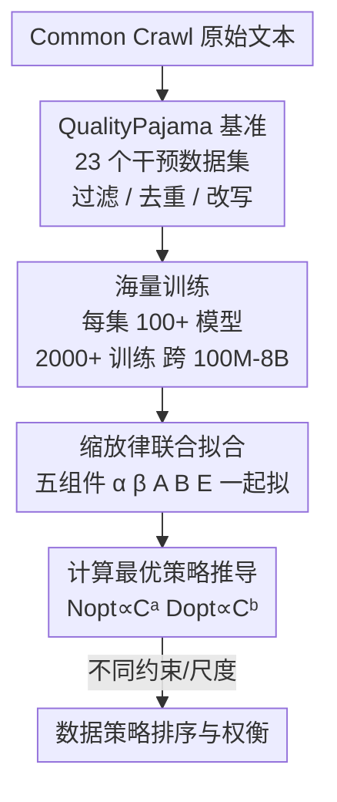

# How Text Quality Interventions Reshape Neural Scaling Laws for LLMs: Empirical Study

**会议**: ICLR 2026  
**OpenReview**: [https://openreview.net/forum?id=ZC5QBfdOw7](https://openreview.net/forum?id=ZC5QBfdOw7)  
**领域**: LLM预训练 / Scaling Law / 数据质量  
**关键词**: 神经缩放律, 数据质量干预, 计算最优, 去重, 合成数据  

## 一句话总结
作者构建了 23 个不同数据质量干预的数据集 QualityPajama，训练了 2000+ 个模型来系统测量「过滤 / 去重 / LLM 改写」如何改变神经缩放律的全部五个参数，发现数据干预同时改变缩放律的系数和指数（不像架构改动只改系数），导致计算最优的 token/参数比可跨数量级波动，从而把缩放律分析确立为评估数据策略的原则性框架。

## 研究背景与动机

**领域现状**：神经缩放律 $\text{Loss}(N,D) \sim A D^{-\alpha} + B N^{-\beta} + E$（$N$ 为参数量、$D$ 为 token 数）被广泛用于性能预测、ROI 分析和算力分配。已有大量经验与理论工作刻画了预训练损失随资源投入的幂律下降，缩放律已是 LLM 研发的核心决策工具。

**现有痛点**：尽管缩放律被广泛采用，数据质量对它的影响却几乎没人系统研究过。一个典型悬案是 Kaplan 与 Hoffmann（Chinchilla）对计算最优 token/参数比的预测相差悬殊（21 vs. 1），近期工作猜测训练数据差异可能是分歧根源，但始终没有定论。理论工作（数据流形理论、Zipf 分布理论）只能预测幂律的指数，对系数 $A$、$B$ 和不可约损失 $E$ 保持沉默，而且往往把模型/数据中一个指数取无穷极限、只孤立分析另一个。

**核心矛盾**：现有把数据质量纳入缩放律的尝试（effective tokens、utility-based scaling）都只把质量当成对 $D$ 或单个指数 $\beta$ 的修正，忽视了它对其余组件的广泛影响；而组件之间常常**反向移动**——改善一个反而恶化另一个，孤立看任一指标都会得出误导性结论。

**本文目标**：第一次大规模、系统地测量文本质量干预如何同时影响缩放律的全部五个组件 $\alpha,\beta,A,B,E$，并据此回答「能否用缩放律作为跨尺度排序数据质量的原则性框架」。

**切入角度**：与其依赖理论假设或小规模实验，不如直接用海量训练把缩放律「拟合出来再看」——枚举一整套质量干预、为每个干预训练上百个不同规模的模型，把组件随干预的真实漂移测出来。

**核心 idea**：把缩放律的**联合拟合**（五个组件一起拟合，而非孤立指数）当作衡量数据质量的显微镜，再从拟合出的组件推导计算最优策略，揭示数据质量与数量之间的根本权衡。

## 方法详解

### 整体框架

这是一篇方法论与实证研究：核心不是提出新模型，而是搭一条「干预数据集 → 海量训练 → 联合拟合缩放律 → 分解五组件 → 推导计算最优策略」的测量流水线。作者先用三类质量干预（启发式过滤、去重、LLM 改写）在 Common Crawl 上派生出 23 个数据集（QualityPajama），对每个数据集训练 100+ 个不同规模（100M–8B 参数、100M–200B token）的模型、累计 2000+ 次训练；再对每个数据集联合拟合出缩放律的五个参数 $\alpha,\beta,A,B,E$，观察它们随干预如何漂移；最后利用 $a=\beta/(\alpha+\beta)$、$b=\alpha/(\alpha+\beta)$ 把组件翻译成计算最优的参数量、token 数及其比值，比较不同干预在「固定算力 / 固定数据 / 固定模型」约束下的真实优劣。

### 关键设计

**1. QualityPajama 基准：把抽象的「数据质量」拆成三类可枚举的具体干预**

数据质量本身是个模糊、依场景而变的概念，难以直接研究。作者把它操作化为三大族干预，共 23 个数据集（14 个启发式过滤 + 9 个合成改写），全部基于 Common Crawl 派生，使得「质量」变成可控变量：**启发式过滤**包括 NSFW 过滤、美学过滤（剔除 lorem ipsum、内联代码、字母数字比 > 0.8 的文本）、PageRank 分档过滤（按 33/67 百分位切 low/med/high/unknown）、模糊去重（MinHashLSH 在 0.7–1.0 不同相似度阈值下、从近重簇里挑困惑度最低的文档）、句长语法复杂度过滤（10/25 token 阈值切 short/medium/long）；**合成改写**包括高质量改写（HQ）、问答式改写（QA）、教科书式改写（TB，受 Phi 模型启发），每种再按合成 vs. 自然（CC）数据的混合比例（100 / 67-33 / 33-67）展开。这套谱系覆盖了从删内容、去冗余到重写内容的整条质量光谱，是后续一切测量的基础。

**2. 缩放律的联合分解：五个组件一起拟合，而不是只盯指数**

以往理论只预测幂律指数、把系数和不可约损失当常数；以往把质量纳入缩放律的工作也只改 $D$ 或单个 $\beta$。本文针锋相对地对每个数据集**联合拟合** $\text{Loss}(N,D)\sim A D^{-\alpha}+B N^{-\beta}+E$ 的全部五个参数，从而能看到一个干预到底动了哪几个组件。关键发现是：与「架构改动主要平移系数」不同，**数据干预同时移动系数和指数**，从根本上改变拟合出的缩放律，这是现有理论没预料到的。更微妙的是组件之间存在张力——经验上 $A\propto\alpha$、$B\propto\beta$ 强正相关（拟合越好的指数往往伴随更大的系数），而增大指数会降损失、增大系数却抬升损失，于是「改善一个组件可能同时恶化另一个」。直觉上指数是指数级、系数只是线性应当被指数压过，但作者指出在当今算力尺度（如 $10^{24}$ FLOPs）这种张力依然存在，因为 $A,B$ 跨好几个数量级变化、而 $\alpha,\beta$ 始终很小，无力补偿。这解释了为什么必须联合看所有组件、而非依赖任何单一指标判断质量好坏。

**3. 从组件推导计算最优策略：把拟合参数翻译成 token/参数比**

有了五个组件，作者用经典关系 $N_{opt}\propto C^{a}$、$D_{opt}\propto C^{b}$、$D_{opt}/N_{opt}\propto C^{b-a}$（其中 $a=\beta/(\alpha+\beta)$、$b=\alpha/(\alpha+\beta)$）把缩放律组件直接翻译成给定算力 $C$ 下的最优模型大小、token 数及其比值。因为数据质量改变了 $\alpha,\beta$，它就直接改变了计算最优设计点。实测在当今算力尺度上，最好与最差干预之间最优参数量可差 14×、最优 token 数差 13×、而 token/参数比可差到惊人的 182×，揭示出缩放中根本性的「数据质量↔数量」权衡。这一步是把抽象的组件漂移落到「该训多大模型、喂多少 token」这种工程决策上的关键桥梁，也是把缩放律确立为数据策略评估框架的核心论据。

## 实验关键数据

设置：QualityPajama 23 个数据集，每个训练 100+ 个模型，跨 100M–8B 参数、100M–200B token，共 2000+ 次训练；以 Llama 3.1（$N$=405B、$D$=15.6T）为对照基准外推。

### 缩放组件能否可靠排序数据干预（跨验证集 Spearman 相关）

| 数据干预 | $A$ | $B$ | $\alpha$ | $\beta$ | $E$ |
|----------|-----|-----|----------|---------|-----|
| 全部启发式过滤 | 0.45 | 0.34 | 0.46 | 0.32 | 0.34 |
| 全部合成数据 | 0.81 | 0.91 | 0.76 | 0.91 | 0.54 |

启发式过滤的组件排序只在验证集间「部分保持」（0.3–0.5 中等相关），说明自然数据干预的缩放律行为对验证集敏感；而合成数据的排序高度一致（多在 0.76–0.91），说明对合成数据用缩放组件评估更可靠。

### 计算效率视角下的干预对比（基于拟合参数的计算缩放律）

| 干预 | $A$ | $B$ | $\alpha$ | $\beta$ | $E$ | 要点 |
|------|-----|-----|----------|---------|-----|------|
| deduped_1.0 | 2471.6 | 157.3 | 0.34 | 0.156 | 0.05 | 精确去重，$E$ 最低 |
| deduped_0.7 | 3246.6 | 186.8 | 0.38 | 0.160 | 0.13 | 模糊去重，算力效率最高 |
| aesthetic | 3211.5 | 442.3 | 0.39 | 0.171 | 0.50 | 美学过滤 |
| high_pr | 1959.0 | 210.2 | 0.30 | 0.161 | 0.36 | 高 PageRank |
| QA100 | 14377.5 | 1586.4 | 0.47 | 0.291 | 1.43 | 纯问答改写，$\alpha$ 高但 $A$ 巨大 |
| QA67-CC33 | 14201.3 | 4193.5 | 0.48 | 0.337 | 1.53 | 合成-自然混合 |

### 关键发现
- **去重的算力收益远超数据量缩减**：精确去重只把数据量降到原来的 83%，却带来约 100× 的算力效率提升；更模糊的 dedupe_0.7 比 dedupe_0.9 省约 3× 算力、比精确去重省 10×、比不去重省 300×——说明去重的价值绝不只是「少喂点 token」。
- **PageRank 是有相关性但不够用的信号**：虽然 high_pr > med_pr > low_pr 印证了高 PageRank 对应高质量，但严格只用高 PageRank 过滤并不优于基线；反而把不在排名表里的页面（no_pr）纳入会显著提升算力效率，作者推测是「新近性」效应。
- **合成与自然混合稳定胜过任一单独使用**，但最优混合比随模型/算力尺度演化，没有固定配比。
- **数据质量排名随尺度翻转**：不同干预的缩放曲线频繁交叉，小尺度上最优的数据集到大尺度可能被反超；把小规模实验结论外推到高算力区有实质风险。
- **「最好」依赖资源约束**：固定算力、固定模型大小、固定 token 数三种约束下，最优数据策略各不相同，必须先明确主约束再选策略。

## 亮点与洞察
- **把「数据质量」做成可枚举的实验变量**：QualityPajama 把模糊概念拆成 23 个可控干预，使缩放律组件漂移第一次能被干净地测出来，这套基准本身就是可复用资产。
- **「联合拟合 + 组件张力」的视角**：揭示 $A\propto\alpha$、$B\propto\beta$ 的耦合，以及指数在当今尺度压不过系数（因 $A,B$ 跨数量级而 $\alpha,\beta$ 很小），把「为什么不能只看指数」讲透，这个分析框架可迁移到任何研究数据/架构对缩放律影响的工作。
- **182× 的 token/参数比波动**是最有冲击力的数字，直接说明 Kaplan vs. Chinchilla 之争很可能源于数据质量差异，为长期悬案提供了实证证据。
- **去重 100×/300× 的算力收益**给出了「去重该多激进」的工程指南，可直接迁移到语料清洗流程的成本-收益决策。

## 局限与展望
- **干预只在预训练前一次性施加**，不涉及训练中自适应剪枝/课程，而后者（如 Sorscher 等）可能超越幂律、逼近指数改进，本文结论不覆盖这种动态设定。
- **只研究上游损失（预训练 loss）**，没直接评估下游任务表现；高质量小数据在后训练对齐的价值也未纳入。
- **跨验证集敏感性**意味着自然数据干预的排序结论本身不够稳健，实际选型仍需在接近部署的真实尺度上验证。
- 缩放组件漂移与 Zipf 分布、数据流形理论的预测**并不总一致**，作者坦承现有理论解释力有限，留待更深的理论工作。

## 相关工作与启发
- **vs effective-token / utility-based scaling（Chang、Muennighoff、Goyal 等）**: 他们把数据质量当成对 $D$ 或单个指数 $\beta$ 的修正，本文证明数据干预扰动全部五个组件，给出更完整的图景。
- **vs 数据混合的「full scaling law」（Shukor 等，2025）**: 精神最接近，但他们聚焦混合配比这一种干预，本文把启发式过滤与合成改写一并纳入，拓宽了数据中心干预的研究范围。
- **vs 合成数据缩放律（Fan 2024、Qin 2025）**: 他们研究合成图像或生成器规模对下游的影响，本文关注上游损失、并系统比较合成-自然混合在 LLM 中的缩放行为。

## 评分
- 新颖性: ⭐⭐⭐⭐⭐ 第一次系统测量数据干预对缩放律全部组件的影响，视角与规模都罕见
- 实验充分度: ⭐⭐⭐⭐⭐ 23 数据集、2000+ 模型、跨 100M–8B，实证体量扎实
- 写作质量: ⭐⭐⭐⭐ 论点清晰、贡献分明，但图表密集、部分组件漂移叙述偏散
- 价值: ⭐⭐⭐⭐⭐ 为 Kaplan vs. Chinchilla 之争提供证据，并给出可落地的数据策略与去重指南

<!-- RELATED:START -->

## 相关论文

- [\[ICLR 2026\] Scaling Laws Revisited: Modeling the Role of Data Quality in Language Model Pretraining](scaling_laws_revisited_modeling_the_role_of_data_quality_in_language_model_pretr.md)
- [\[ICLR 2026\] GneissWeb: Preparing High Quality Data for LLMs at Scale](gneissweb_preparing_high_quality_data_for_llms_at_scale.md)
- [\[ICLR 2026\] How to Train Data-Efficient LLMs](how_to_train_data-efficient_llms.md)
- [\[ICLR 2026\] Pretraining Scaling Laws for Generative Evaluations of Language Models](pretraining_scaling_laws_for_generative_evaluations_of_language_models.md)
- [\[ICLR 2026\] Unveiling Downstream Performance Scaling of LLMs: A Clustering-Based Perspective](unveiling_downstream_performance_scaling_of_llms_a_clustering-based_perspective.md)

<!-- RELATED:END -->
