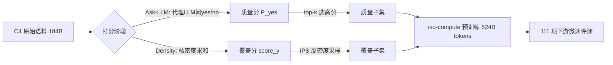

# How to Train Data-Efficient LLMs

**会议**: ICLR 2026  
**OpenReview**: [https://openreview.net/forum?id=yKUbw7q1IA](https://openreview.net/forum?id=yKUbw7q1IA)  
**代码**: 待确认  
**领域**: LLM 预训练 / 数据筛选  
**关键词**: 数据高效预训练, 数据筛选, 质量评分, 覆盖采样, Ask-LLM, 密度采样  

## 一句话总结
本文系统对比 22 种数据筛选策略对 LLM 预训练的影响，提出基于指令微调 LLM 直接打质量分的 **Ask-LLM** 和基于核密度估计做覆盖采样的 **Density**，发现质量筛选（Ask-LLM）即便只保留 10% 数据也能超过全量训练并收敛快 70%，而覆盖采样通常只能"追平"全量。

## 研究背景与动机
- **领域现状**：LLM 预训练是机器学习里数据和算力最密集的任务，但受幂律 scaling law 约束，靠线性堆数据/堆参数的回报急剧递减。已有工作（LIMA、Phi-2、D4）表明精心筛选的小数据集能让小模型超过大几十倍的 baseline，数据筛选成为突破幂律软上限的关键杠杆。
- **现有痛点**：数据筛选大致分为冲**覆盖度**（coverage，让模型见到全谱系主题/语言）和冲**质量**（quality，优选高价值样本）两类，但二者孰优、各自在什么阶段起作用，缺乏大规模公平对比——因为这种实验要在多个模型尺寸 × 多个采样率 × 多种筛选策略上反复预训练，成本极高，社区里几乎没人做过完整对照。
- **核心矛盾**：**便宜的覆盖启发式（如最大覆盖、聚类采样）是否足以训出 SoTA LLM？还是说昂贵的、逐样本精评质量的采样器确有不可替代的价值？** 这是本文的核心研究问题。
- **本文目标**：构造两个分别**纯冲质量**和**纯冲覆盖**的采样器，把它们放在质量↔覆盖光谱的两个极端，再做一次穷举式 benchmark，搞清楚覆盖、质量、采样成本在预训练不同阶段的角色。
- **核心 idea**：**用指令微调 LLM 的零样本推理能力直接当"质量评审"**（Ask-LLM），并用**核密度求和高效估计样本局部密度来做覆盖采样**（Density），在 T5 系列上跑 220 次预训练 + 1100 次微调做全面对照。

## 方法详解

### 整体框架
本文把数据筛选拆成"打分 + 选样"两步：先用一个采样器给数据集每个样本算一个浮点分（衡量质量或覆盖），再用 top-k 或重要性采样（IPS）从中选出子集。两个采样器位于光谱两端——Ask-LLM 对每个样本做高度情境化的质量评估（贵，需逐样本 LLM 推理），Density 则只问"我们是不是已经采过很多相似样本了"（便宜，比聚类还快）。

### 关键设计

**1. Ask-LLM 质量采样：把数据评审外包给指令微调 LLM。** 不再用样本在某个模型下的 perplexity 当质量代理，而是直接把候选训练样本塞进一个固定 prompt——"这段被 ### 包住的文字对预训练 LLM 是否含有 informative signal？要求格式良好、含有用世界知识、且不含有害/种族歧视/性别歧视内容。选项：yes / no"——取代理 LLM 输出 token "yes" 的 softmax 概率作为质量分：$\text{score} = P(\text{"yes"} \mid \text{prompt})$。这种设计绕开了 perplexity 过滤的几个典型失败模式：perplexity 会偏好缺乏上下文的样本（如有问无答）、会因常见词组合似然高而选中重复废话、又会因生僻但合法的词组合误杀小众但有价值的长尾知识。Ask-LLM 借助 LLM 的推理与上下文理解能识别这些情况；更关键的是，它用 LLM 做"质量评判"而非"似然估计"，因此摆脱了 perplexity 过滤器的**分布内偏置**（perplexity 是按打分模型自己的训练数据做决策，而非按待采样数据集）——这一点即使 Ask-LLM 与 perplexity 用同尺寸模型也成立，实验也证实两者打分零相关。

**2. Density 覆盖采样：用核密度求和估计局部密度再反向采样。** 直觉是数据分布本身就是强覆盖信号——高概率区是有大量近重复的"原型"样本，低概率区是离群/稀有/独特输入；要最大化主题覆盖，就该放大欠表示区域、压制冗余高密度信息。给定嵌入数据集 $D$ 和核函数 $k(x,y)$，对每个样本估计密度为核求和：$\text{score}(y) = \sum_{x \in D} k_\lambda(x, y)$，其中带宽 $\lambda$ 控制点的影响尺度。朴素求和是 $O(N^2)$，本文借助算法社区的近似哈希技巧把复杂度降到 $O(N \log N)$。与 D4 的聚类做法不同，Density 不聚类、而在模型潜空间（而非 n-gram 的 Jaccard 距离）上直接做密度估计，并采用有更强理论保证（Theorem C.2）的两遍采样算法。最终 Density 用 IPS（重要性采样，按密度倒数采样）来最大化覆盖——作者实验发现 top-K/bottom-K 不维持覆盖、表现很差。

**3. iso-compute 公平评测协议：固定训练 token 数而非固定 epoch。** 低采样率会得到极小数据集，若按固定 epoch 训练会让"采少量高质量可重复 token"的方法吃亏。本文统一在 **iso-compute** 设定下训练——所有模型都恰好训 524B token，小采样率意味着更多 epoch 重复。这给每种筛选方法同等机会发挥，既不惩罚采少量高质量可重复 token 的方法，也不偏袒采大量不重复 token 的方法，从而让 22 种采样器的对比建立在公平算力预算之上。

**4. Effective Model Size 归一化指标：把 111 个异质任务压成一个可比数。** 111 个下游任务对数据/模型优化的响应速率各不相同，难以用单一指标概括。受 scaling law 文献启发，本文定义 **Effective Model Size**：基于"参数量 vs 下游评测"趋势的参数化拟合做外推，回答"若某技术带来 x 性能，不用该技术时需要多大的 LLM 才能达到同样的 x"。这把"性能提升"翻译成"等效模型尺寸"，让覆盖/质量/成本的权衡有了统一可读的量纲。

## 实验关键数据

### 主实验表格
T5-Large 固定采样到约 10%（18B token）后 iso-compute 预训练 524B token，对比各采样器（节选自 Table 1，Effective Model Size 越大越好）：

| Sampler | # Tokens | Effective Model Size | GLUE | SuperGLUE | MMLU | BBH |
|---|---|---|---|---|---|---|
| 全量 T5-Large | 184B | 800M | 88.2 | 82.5 | 40.7 | 33.6 |
| Random | 18B | 713M | 88.4 | 82.3 | 41.8 | 33.6 |
| Density | 18B | 802M | 88.0 | 80.5 | 42.6 | 35.5 |
| Prototypes | 18B | 423M | 87.7 | 80.5 | 36.7 | 33.0 |
| Perplexity (Small) | 18B | 301M | 87.6 | 80.2 | 36.8 | 33.8 |
| DSIR | 18B | 476M | 87.3 | 81.7 | 39.8 | 33.3 |
| Q-Classifier | 18B | 797M | 88.7 | 83.6 | 40.5 | 35.0 |
| **Ask-LLM (Gemma-7B)** | 18B | **1.5B** | 88.2 | 82.5 | 44.2 | 37.1 |

只用 10% 数据，Ask-LLM (G.7B) 把 800M 的 T5-Large 训到等效 1.5B 模型的水平，几乎翻倍；而 Density 等覆盖法约等于"追平"全量（802M），perplexity 过滤反而严重退化（301M）。

### 消融 / 成本表格
训练与打分的 accelerator-hour 成本（Table 2，30 次运行平均）：

| 指标 (Accelerator-Hr) | T5-XXL | T5-XL | T5-Large | T5-Base | T5-Small |
|---|---|---|---|---|---|
| Scoring Cost (C4) | 49.0 | 10.0 | 1.7 | 0.76 | 0.24 |
| Training Cost (C4) | — | — | 24.0 | — | 9.3 |

以 Ask-LLM-T5-XL 打分训 T5-Large 为例：Figure 1 显示可保守地砍掉 44% 训练预算而性能不掉，成本约 $56\% \times 24 + 10 \approx 23.44$ 加速器小时，对比全量 24 小时仍有净收益，且打分成本可摊销复用。

### 关键发现
- **推理改善效率**：Ask-LLM 把 800M 模型训到 1.5B 的等效水平，持续超过同等模型容量（XL）的 perplexity 过滤和覆盖 baseline，且收敛更快（Figure 5）。
- **质量分与 perplexity 零相关**（Figure 7）：prompting 给采样器注入了 perplexity 里没有的关键信息，说明"推理 + 上下文"是不可替代的成分。
- **昂贵打分何时值得**：其他采样器只在大采样率（≥60%）才接近 Ask-LLM；在低数据区间 Ask-LLM 显著领先。故 LLM 级过滤最划算的两个场景是——(i) 提升全量上限（靠去掉最低质量数据推高天花板）；(ii) 低数据区（只留最高质量数据带来最大增益）。
- **覆盖 vs 质量**：覆盖采样通常能"恢复"全量训练性能，但质量过滤（Ask-LLM）能"超过"它。

## 亮点与洞察
- 用一次穷举式大规模对照（22 采样器 × 多尺寸 × 多采样率，220 预训练 + 1100 微调）正面回答了"便宜覆盖启发式 vs 昂贵质量评审"这个长期悬而未决的问题，结论清晰且可操作。
- Ask-LLM 的精髓在于**把"质量"从似然估计重定义为"LLM 的推理判断"**，从而摆脱 perplexity 的分布内偏置——这一视角解释了为何同尺寸模型下两者打分仍零相关。
- Effective Model Size 与 iso-compute 是两个很扎实的方法论贡献：前者让异质多任务可比，后者让不同采样率的对比公平，二者使结论更可信。

## 局限与展望
- 实验主体是 T5-style 编码器-解码器模型（60M / 800M）和 C4 数据集，未验证在 decoder-only 大模型、万亿 token、多语料混合下结论是否同样成立。
- Ask-LLM 需对每个样本做一次 LLM 推理，打分成本随数据规模线性增长；虽可摊销，但在超大语料上仍是显著开销，文中也坦承其性价比依赖于"训练成本足够大到能摊平打分成本"。
- 作者预期 chain-of-thought 等更强 prompting 能进一步提升 Ask-LLM，但本文未展开；Density 的带宽 $\lambda$ 选择与潜空间嵌入质量对结果的敏感度也值得更深入分析。

## 相关工作与启发
- 与 D4（Tirumala et al., 2023）同样假设可用预训练 LLM 的嵌入，但 Density 用核密度求和替代聚类、在潜空间而非 n-gram Jaccard 上估密度，并有更强理论保证。
- 把 perplexity/loss 过滤统一解释为"基于模型的密度采样"，把 SemDeDup、SSL Prototypes 解释为"离散化的相似度密度估计 + 离群过滤"，为后续设计采样器提供了统一的"质量↔覆盖光谱"框架。
- 对实践者的启发：在算力受限的单 epoch 区间，先用 LLM 评审去掉最低质量数据，是当前最稳的提质量+提速手段；覆盖采样更适合"省成本追平"而非"突破上限"。
- 后续社区把 LLM 数据效率问题进一步分解为"质量过滤 + 数据混合"两个子问题（Li et al., 2024），并出现基于评分的语料重加权、多 rubric 评分聚合、用小代理 LLM 训练结果反推质量分等方向；本文的 Ask-LLM 可视为这一脉络中"质量过滤"分支的代表性起点。

## 评分
- **新颖性**: ⭐⭐⭐⭐ — Ask-LLM 把数据评审重定义为 LLM 推理判断、Density 用核密度做高效覆盖采样，两个采样器 + 统一光谱框架都有原创性。
- **实验充分度**: ⭐⭐⭐⭐⭐ — 22 采样器 × 多尺寸 × 多采样率，220 预训练 + 1100 微调 + 111 下游任务，规模罕见、对照公平。
- **写作质量**: ⭐⭐⭐⭐ — 研究问题清晰、图表充分、方法论（iso-compute / Effective Model Size）交代到位。
- **价值**: ⭐⭐⭐⭐⭐ — 直接回答了数据筛选领域的核心争论，对工业级数据高效预训练有强指导意义。

<!-- RELATED:START -->

## 相关论文

- [\[ICLR 2026\] Train on Validation (ToV): Fast Data Selection with Applications to Fine-Tuning](train_on_validation_tov_fast_data_selection_with_applications_to_fine-tuning.md)
- [\[ICLR 2026\] GneissWeb: Preparing High Quality Data for LLMs at Scale](gneissweb_preparing_high_quality_data_for_llms_at_scale.md)
- [\[ICLR 2026\] Imagine How To Change: Explicit Procedure Modeling for Change Captioning](imagine_how_to_change_explicit_procedure_modeling_for_change_captioning.md)
- [\[ICLR 2026\] Identifying and Evaluating Inactive Heads in Pretrained LLMs](identifying_and_evaluating_inactive_heads_in_pretrained_llms.md)
- [\[ICML 2025\] How to Synthesize Text Data without Model Collapse?](../../ICML2025/llm_pretraining/how_to_synthesize_text_data_without_model_collapse.md)

<!-- RELATED:END -->
