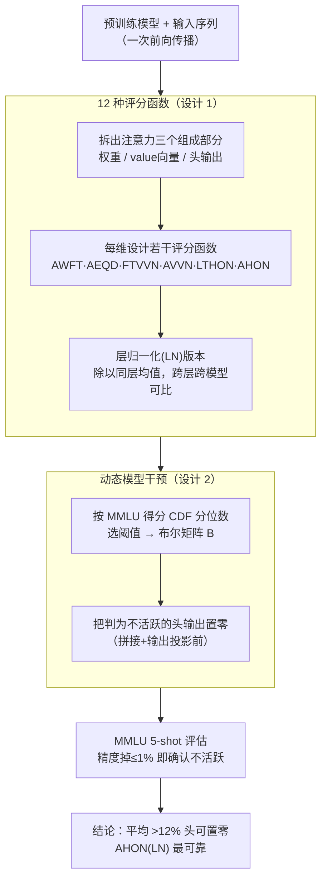

# Identifying and Evaluating Inactive Heads in Pretrained LLMs

**会议**: ICLR 2026  
**arXiv**: [2504.03889](https://arxiv.org/abs/2504.03889)  
**代码**: [GitHub](https://github.com/psandovalsegura/inactive-heads)  
**领域**: LLM 预训练 / 模型分析  
**关键词**: Inactive Attention Head, Score Function, Attention Sink, Model Intervention, Head Output Norm

## 一句话总结

系统评估12种评分函数识别LLM中不活跃注意力头，发现基于头输出范数的评分函数（AHON LN）比传统注意力权重指标更能跨模型家族一致地识别不活跃头，14个模型上平均超过12%的头可被置零而保持MMLU精度在1%以内。

## 研究背景与动机

**领域现状**：注意力机制是 Transformer LLM 的核心组件，但已有研究发现一些注意力头表现出"注意力汇聚"(attention sink)现象——第一个 token 获得最多注意力权重，尽管其语义重要性有限。Guo et al. (2024a) 据此提出"dormant heads"概念，通过首 token 注意力权重判断头是否活跃。**现有痛点**：仅基于注意力权重的判断存在盲区：（1）头可能关注多个 value 向量近零的 token 从而输出近零，但不满足"首 token 高权重"模式；（2）头的注意力权重看似"dormant"但实际输出并非近零；（3）不同模型家族（Llama、OLMo、Qwen）的注意力模式差异大，首 token 权重指标不具模型无关性。**核心矛盾**：不活跃头的定义有多种——注意力集中在无关 token、value 向量近零、头输出近零——但先前工作只关注第一种，导致对不活跃头普遍程度的低估。用 AWFT（首 token 平均权重）仅识别约 4.6% 的不活跃头，漏掉了约 7.6%。**本文目标** 系统回答"不活跃注意力头有多普遍"，并找到最佳的跨模型识别方法。**切入角度**：不局限于注意力权重，而是全面考查注意力的三个组成部分——注意力权重、value 向量、头输出——设计12种简单评分函数，通过阈值分类+模型干预实验验证哪些头是真正不活跃的。**核心 idea**：不活跃注意力头应通过头输出范数而非注意力权重模式来识别，因为小输出才真正意味着对模型无贡献。

## 方法详解

### 整体框架

这篇论文要回答一个看似简单却没被认真量化过的问题——预训练 LLM 里到底有多少注意力头是"不活跃"的。它采取的是一条**度量→分类→验证**的诊断流水线：先在一次前向传播里把注意力拆成权重、value 向量、头输出三个组成部分，用 12 种简单评分函数从不同角度给每个头打分；再按分数和阈值把头分成"可能不活跃"和"活跃"两类；最后通过模型干预——把判为不活跃的头输出动态置零、看 MMLU 精度掉不掉——来验证这些头是不是真的不活跃。整套流程在 14 个预训练/微调模型（Llama-3.1/3.2、OLMo-2、Qwen2.5 三个家族）上跑，最终结论是平均超过 12% 的头可以被安全置零，而最可靠的识别信号来自头输出范数（AHON），不是传统的注意力权重。

### 关键设计

**1. 12 种评分函数：从注意力的三个组成部分而非单一权重去量化"不活跃"**

先前工作只盯着注意力权重，于是把"看起来集中在无关 token"误当成不活跃的唯一标志。本文把注意力拆成权重、value 向量、头输出三个维度，每个维度各设计若干个简单到只需一次前向传播就能算出的评分函数。**注意力权重类**衡量注意力分布本身：Avg Weight of First Token (AWFT) 看首 token 的平均权重 $\frac{1}{N}\sum_i \mathbf{A}_{i,0} > \tau$，Avg Entropy of Query Distributions (AEQD) 看查询分布的平均熵 $< \tau$（熵越低说明注意力越集中在少数 token）。**Value 向量类**绕过权重直接看被聚合的内容：First Token Value Vector Norm (FTVVN) 看首 token 的 value 范数 $< \tau$，Avg Value Vector Norm (AVVN) 看平均 value 范数 $< \tau$——即便权重很高，若 value 近零，头的输出也接近零。**头输出类**直接看头最终吐出的向量：Last Token Head Output Norm (LTHON) 看末 token 的头输出范数 $< \tau$，Avg Head Output Norm (AHON) 看平均头输出范数 $< \tau$，这才是"对模型有没有贡献"的最直接信号。

由于原始分数在不同层、不同模型之间量纲差异很大，每个函数都配一个层归一化 (LN) 版本，把一个头的得分除以同层其他头的平均得分：

$$\frac{\text{AvgNorm}(\text{head}^i)}{\frac{1}{N_{\text{layer}}}\sum_j \text{AvgNorm}(\text{head}^j)}$$

这样阈值才能跨层、跨模型家族通用，而不必为每个模型单独调。这些函数确实在捕捉不同类型的不活跃：IoU 分析显示任意两个函数识别出的头集合最大 IoU 只有 0.58、最大 Precision 只有 0.73，说明"权重 dormant"和"输出近零"指向的并非同一批头——这正是单看权重会漏掉一大块不活跃头的根源。

**2. 动态模型干预：用"置零后精度变不变"来验证识别出的头是否真的不活跃**

评分函数只是给出候选，真正不活跃与否要靠干预来证伪。每次前向传播时，按当前输入算出的评分和阈值构建一个布尔矩阵 $\mathbf{B} \in \{0,1\}^{N_{\text{heads}} \times N_{\text{layers}}}$，把 True 位置的头输出在拼接和输出投影之前直接置零，再评估 MMLU 5-shot 准确率。阈值不是写死的，而是按 MMLU 输入上的得分 CDF 分位数动态选取（p=0,5,10,…,30），从而把被置零的头比例控制在最多 30% 以内，并与"随机置零同样数量的头"做基线对比。

之所以用逐输入的动态置零而非一次性永久剪枝，是因为同一个头对不同输入的活跃程度会变——动态置零按当前输入内容决定哪些头该关掉，更贴近"这次前向传播里到底浪费了多少计算"。判据很直接：如果一个头真的不活跃，把它的输出置零后 MMLU 精度应当几乎不动；精度一旦明显掉下来，就说明它并非不活跃。最终能在精度保持基线 1% 以内的前提下置零的头越多，对应的评分函数就越可靠。

### 损失函数 / 训练策略

本文是分析性工作，不涉及训练。所有评估基于预训练/微调后的模型。评分通过 100 条 FineWeb-Edu 训练样本（随机截断到 10-3000 tokens）或 MMLU 评估样本上的前向传播计算。使用 lm-evaluation-harness 进行标准化评估。

## 实验关键数据

### 主实验

**14个模型可置零头比例**（Table 2，MMLU精度保持在基线1%以内）：

| 模型 | AWFT可置零(%) | 最佳函数可置零(%) | 提升 | 最佳评分函数 |
|------|-------------|-----------------|------|------------|
| Llama-3.1-8B | 8.56 | **17.11** | +8.55 | AHON (LN) |
| Llama-3.1-8B-Inst | 1.01 | **10.97** | +9.95 | AHON (LN) |
| OLMo-2-7B | 0.42 | **8.34** | +7.93 | AHON (LN) |
| OLMo-2-7B-DPO | 2.14 | **20.60** | +18.46 | AHON (LN) |
| OLMo-2-7B-Inst | 1.46 | **19.54** | +18.07 | AHON (LN) |
| Qwen2.5-0.5B | 7.43 | **14.42** | +6.99 | LTHON (LN) |
| Qwen2.5-3B | 5.67 | **8.78** | +3.11 | AHON |
| Qwen2.5-7B | 1.25 | **7.54** | +6.29 | AHON (LN) |
| **平均** | **4.61** | **12.18** | **+7.56** | — |

AHON (LN) 在 8/14 模型排名第1，13/14 模型排名前3。

### 消融实验

**跨数据集稳定性**（OLMo-2-7B-Inst，15%头被识别为不活跃）：

| 评分函数 | MMLU 阈值 | PIQA 阈值 | WinoGrande 阈值 | 稳定性 |
|---------|----------|----------|----------------|--------|
| AWFT | 0.077 | 0.265 | 0.109 | 不稳定（3.4倍差异）|
| AHON (LN) | 0.457 | 0.435 | 0.473 | 稳定（<9%差异）|

### 关键发现

- **看输出非权重**：头输出范数才是不活跃性的真正指标——注意力权重看似"dormant"的头输出未必为零，反之注意力看似活跃但输出可能很小
- **>12% 可安全移除**：远高于 AWFT 估计的 ~4.6%，先前方法漏掉了 7.6% 的不活跃头
- **模型无关性**：AHON (LN) 跨 Llama、OLMo、Qwen 三个家族一致有效，AWFT 在 OLMo 上几乎完全失效（仅识别 0.42-2.14%）
- **微调不改变注意力行为**：SFT、DPO、RLHF 后的评分分布与基础模型几乎一致（Wasserstein 距离最小），说明注意力头行为在预训练后基本固定
- **规模效应存在阈值**：Qwen2.5 从 0.5B 到 7B 评分分布相似，但 14B 出现显著不同，暗示大规模模型学到了不同的头特化模式

## 亮点与洞察

- 简单到极致的方法——12 种阈值函数就能有效识别不活跃头，无需复杂优化或特殊训练
- 深刻洞察：注意力权重是"误导信号"——看起来 dormant 不等于真正不活跃，应关注头的实际输出贡献
- 14模型 × 12函数 × 多阈值 × 3基准的全面实验矩阵，结论高度可信
- 动态置零（按输入决定）比永久剪枝更精确地度量计算冗余
- 为 KV cache 压缩、推理加速提供了更好的头识别方法——AHON (LN) 可直接用于实际系统

## 局限与展望

- 聚焦于理解和识别，未实现实际推理加速（置零只是验证手段）
- 未分析 MLP 模块——注意力后的 MLP 也可能逐 token 不活跃
- 缺乏对 GQA（Grouped-Query Attention）的专门讨论——现代模型共享 KV 头可能影响分析
- 评估主要依赖 MMLU，在生成任务上不活跃头的模式可能不同
- 置零不等于真正移除参数——内存和计算的实际节省需要额外工程

## 相关工作与启发

- **vs Dormant Attention (Guo et al., 2024a)**：仅用注意力权重判断不充分，AHON 系函数识别的不活跃头是 AWFT 的 2.6 倍
- **vs Attention Sinks (Xiao et al., 2024)**：首 token 聚集是不活跃的一种表现但非全部，本文揭示了更丰富的不活跃模式

## 评分
- 新颖性: ⭐⭐⭐⭐ 从输出而非权重角度重新定义"不活跃"是关键创新，12种函数的系统比较前所未有
- 实验充分度: ⭐⭐⭐⭐⭐ 14模型 × 3家族 × 12函数 × 多阈值，覆盖预训练/微调/规模变化
- 写作质量: ⭐⭐⭐⭐ 逻辑清晰，图表丰富，实验设计严谨
- 价值: ⭐⭐⭐⭐ 为理解LLM注意力冗余提供了可靠的方法论基础，可直接指导推理优化

<!-- RELATED:START -->

## 相关论文

- [\[ICLR 2026\] How to Train Data-Efficient LLMs](how_to_train_data-efficient_llms.md)
- [\[ICLR 2026\] StochasTok: Improving Fine-Grained Subword Understanding in LLMs](stochastok_improving_fine-grained_subword_understanding_in_llms.md)
- [\[ICLR 2026\] GneissWeb: Preparing High Quality Data for LLMs at Scale](gneissweb_preparing_high_quality_data_for_llms_at_scale.md)
- [\[ICLR 2026\] Unveiling Downstream Performance Scaling of LLMs: A Clustering-Based Perspective](unveiling_downstream_performance_scaling_of_llms_a_clustering-based_perspective.md)
- [\[ICML 2025\] Evaluating Morphological Alignment of Tokenizers in 70 Languages](../../ICML2025/llm_pretraining/evaluating_morphological_alignment_of_tokenizers_in_70_languages.md)

<!-- RELATED:END -->
