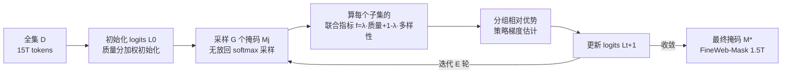

# Joint Selection for Large-Scale Pre-Training Data via Policy Gradient-based Mask Learning

**会议**: ICLR 2026  
**OpenReview**: [https://openreview.net/forum?id=fs2uDib85s](https://openreview.net/forum?id=fs2uDib85s)  
**代码**: [https://github.com/ByteDance-Seed/DATAMASK](https://github.com/ByteDance-Seed/DATAMASK)  
**领域**: LLM 预训练 / 数据选择  
**关键词**: 预训练数据选择, 质量-多样性联合优化, 掩码学习, 策略梯度, FineWeb  

## 一句话总结
把万亿 token 级预训练数据选择重新表述成"可学习掩码"问题，用分组策略梯度同时优化质量与多样性两类指标，比贪心算法快 98.9%，从 15T 的 FineWeb 选出 1.5T 的 FineWeb-Mask，在 1.5B/7B 模型上分别带来 3.2%/1.9% 的平均提升。

## 研究背景与动机
**领域现状**：开源预训练语料（FineWeb、DCLM）的"数据配方"核心是按某种打分筛样本，打分大致分两类——**质量指标**（启发式规则、LLM 裁判、fastText 分类器，如 FineWeb-Edu、UltraFineWeb、DCLM）和**多样性指标**（pair-wise 相似度、facility location、DiSF 维度坍缩度、Semdedup 去重）。

**现有痛点**：作者的实证研究揭示两类指标各有硬伤。只按质量选，长期预训练会出现**严重的边际收益递减**——质量高的样本在嵌入空间里聚得很紧（语义冗余高、信息多样性低），训得越久越没东西可学；只按多样性选，又会**误删大量有价值的高质量样本**，性能甚至跌破原始 FineWeb。

**核心矛盾**：最直接的解法是两类指标联合选，但**质量分是逐样本独立计算的（top-k 即可），多样性分却是定义在集合上的集合函数**，求解依赖代价高昂的贪心算法。在万亿 token 规模下，贪心算法当样本超过 10 万就要 78 小时，根本跑不动，因此现有工作几乎从不在单次选择里联合考虑这两类指标。

**本文目标**：让万亿级语料能在一次选择流程里同时优化质量和多样性，且选择时间可接受。

**核心 idea（掩码学习 + 策略梯度）**：把"选哪些样本"建模为对全集学一个**二值掩码 $M$**，再做**概率松弛**——不直接优化离散掩码而是学每个样本的采样 logits，最后用**分组策略梯度**估计梯度迭代更新，绕开集合函数难以微分、组合空间巨大的障碍。

## 方法详解

### 整体框架
DATAMASK 把选择预算 $S$ 下的子集选择写成"学一个最优掩码"的优化问题，再经"概率松弛 → 策略梯度估计 → 分组优势更新"三步把不可微的离散采样变成可迭代的连续优化，最后从收敛 logits 采出最终掩码得到选中子集。

### 关键设计
**1. 掩码学习 + 概率松弛：把组合选择变成连续可优化问题。** 对全集 $D=\{x_i\}_{i=1}^N$ 引入二值掩码 $M\in\{0,1\}^N$，$M_i=1$ 表示选入子集 $U=\Phi_M(D)$，于是选择等价于 $M^*=\arg\max_M f(\Phi_M(D))$ s.t. $\sum_i M_i=S$。但二值掩码离散、不可微，且万亿规模组合爆炸。作者把掩码视为从分布 $P(M|L)$ 中采样得到，每个样本被选概率由 softmax 给出 $P(M_i|L)=e^{L_i}/\sum_j e^{L_j}$，对子集做 $S$ 次无放回采样。优化目标转为求最优 logits $L^*=\arg\max_L \mathbb{E}_{M\sim P(M|L)}[f(\Phi_M(D))]$——logits 是连续的，从而可优化，这是整个框架能 scale 到万亿 token 的根本。

**2. 分组相对优势的策略梯度估计：压方差、稳收敛。** 采样仍不可微，作者用 Policy Gradient Estimation（REINFORCE）得到 $\nabla_L \mathbb{E}[f]=\mathbb{E}[f(\Phi_M(D))\nabla_L\ln P(M|L)]$。但选中样本数远小于全集，单次估计方差巨大、收敛困难。借鉴 GRPO 的相对优势思想，作者一次采 $G$ 个掩码，用组内均值 $\mu_G$、标准差 $\sigma_G$ 把奖励标准化成相对优势作为 baseline：$\nabla_L \mathbb{E}[f]\approx \frac{1}{G}\sum_{j=1}^G \frac{f(\Phi_{M_j}(D))-\mu_G}{\sigma_G}\nabla_L\ln P(M_j|L)$，再以学习率 $\eta$ 更新 logits。组归一化显著降低方差、加速训练，这是相比朴素 REINFORCE 的关键改进。

**3. 质量-多样性联合目标：一个 λ 调和两类指标。** 联合目标取 $f(U)=\lambda f_{qua}(U)+(1-\lambda)f_{div}(U)$。质量项用 DCLM、Edu、Wiki 三种分类器分之和；多样性项在 pair-wise 相似度、facility location、DiSF 之间消融。实验发现 FineWeb 上 DiSF 与质量分冲突最大（负作用），**pair-wise 相似度配 $\lambda\in[0.1,0.5]$ 最佳**。其本质是把质量分当作奖励注入多样性优化，从而在去冗余的同时保住高质量样本。

**4. 工程加速三件套：让万亿 token 真的跑得动。**（一）**质量感知剪枝 + 初始化**——先按质量分滤掉最差 40–50% 样本避免选出极低质量数据，并令初始采样概率正比于质量分，既提性能又加速收敛；（二）**分块更新**——平台无法一次加载上亿文件，随机切成 100 万样本的子集（远大于 DiSF 的 1024）；（三）**批更新**——每步只随机取 5–10% 样本更新 logits，不仅大幅省时，引入的随机噪声还能跳出局部最优、收敛到更好的分数。组数 $G$ 推荐 128/256（太小发散、太大费算力）。这套组合把 DiSF 求解从贪心的 78 小时压到约 50 分钟。

## 实验关键数据

### 主实验表格
12 个任务三大类能力平均分（1.5B dense 训 400B tokens / 7B MoE 训 300B tokens）：

| 语料 | 1.5B Avg | vs FineWeb | 7B MoE Avg | vs FineWeb |
|---|---|---|---|---|
| FineWeb（原始） | 44.9 | — | 50.7 | — |
| FineWeb-Semdedup（纯多样性） | 43.8 | -1.1 | 50.0 | -0.7 |
| FineWeb-Edu（质量） | 46.8 | +1.4 | 51.2 | +0.5 |
| UltraFineWeb-en | 45.8 | +0.9 | 49.5 | -1.2 |
| FineWebPro | 47.2 | +2.3 | 51.4 | +0.7 |
| FineWeb-DCLM | 46.9 | +2.0 | 52.2 | +1.5 |
| **FineWeb-Mask（本文）** | **48.1** | **+3.2** | **52.6** | **+1.9** |

12 任务中胜出数：1.5B 模型 6/12（最高），7B MoE 4/12（最高）；相比最强 baseline 仍 +0.9%（dense）/+0.4%（MoE）。

### 消融实验表格

| 维度 | 设置 | 结论 |
|---|---|---|
| 多样性指标 | pair-wise / facility location / DiSF | pair-wise 与 facility location 优于纯质量，DiSF 因与质量冲突最大反而负作用 |
| 平衡系数 λ | 1.0→0.1 | 推荐 λ∈[0.1,0.5]；全部配置均超原始 FineWeb，多数超 FineWeb-Edu |
| 组数 G | 32→512 | G 太小训练发散，太大费算力，推荐 128/256 |
| 质量剪枝+初始化 | Random→+Pruning→+Init | 性能 44.3→45.0→45.1，选择时间 18h→10h→7h |
| 批更新比例 | 100%/10%/5%/1% | 5–10% 既省时又因噪声逃离局部最优、分数更好 |

### 关键发现
- **加速**：在 DiSF 上比贪心算法快 98.9%（10 万样本从 78 小时→50 分钟）。
- **冲突根因**：把样本聚成 1 万簇做质量×多样性热图，发现高质量和低质量区都存在语义冗余，纯多样性方法会无差别删掉高质量样本；联合学习能通过质量奖励控制侧重。
- **长度偏好**：质量分类器（FineWeb-Edu 147%、UltraFineWeb 114%）偏好长文档，多样性方法偏好短文本（嵌入是 token 平均，长句相似度差异小）。
- **架构差异**：UltraFineWeb 在 dense 上更好、MoE 上更差；FineWeb-Mask 在两种架构上都最优。

## 亮点与洞察
- **问题重述漂亮**：把"集合函数难优化"的数据选择转成"学采样 logits"，一举绕开贪心算法的规模瓶颈，是把组合优化 RL 化的典型范式。
- **实证先于方法**：先用质量初始化/联合优化的对照曲线（Figure 3）和 t-SNE 可视化讲清"质量 vs 多样性冲突"的根因，动机扎实而非堆方法。
- **GRPO 思想跨界**：把 LLM 后训练里的分组相对优势搬到数据选择的策略梯度上压方差，迁移得自然。
- **真·大规模落地**：不是小批量玩具实验，而是真在 15T FineWeb 上选出 1.5T 子集、用 384 GPU 训 1.5B/7B 模型验证，并开源 FineWeb-Mask。

## 局限与展望
- **只验证了质量+多样性两类指标的二元组合**，框架声称可扩展到任意多指标，但更复杂组合留待未来工作。
- **超参依赖经验**：λ、G、批更新比例都靠在 FineWeb 上调，换语料/换模型规模的可迁移性未充分验证（DiSF 的失效就说明指标-数据强相关）。
- **嵌入质量是隐含上限**：多样性完全依赖 E5 文本嵌入，嵌入的长度偏置直接影响选样长度分布，嵌入本身的偏差会传导到选择结果。
- **绝对增益不算大**：7B MoE 上仅 +1.9%（相比最强 baseline +0.4%），在更大模型/更多 token 下能否保持优势仍待观察。

## 相关工作与启发
- **质量类**：QuRating、FineWeb-Edu（LLM 裁判）、UltraFineWeb、DCLM（fastText 分类器）、GneissWeb（子串去重+质量集成）。
- **多样性类**：pair-wise 相似度、facility location、DiSF、Semdedup（嵌入去重）。
- **方法源头**：REINFORCE 策略梯度（Williams 1992）、GRPO 相对优势（DeepSeek 系），以及概率松弛求解组合优化的一系列工作。
- **启发**：把"贵且离散"的数据筛选问题概率松弛后用策略梯度求解，是一条可推广到数据剪枝、coreset 选择、active learning 的通用思路；"先实证冲突再设计联合目标"的叙事也值得借鉴。

## 评分
- **新颖性**: ⭐⭐⭐⭐ — 掩码学习 + 分组策略梯度求解集合函数式数据选择，是把组合优化 RL 化的新颖且自洽的范式。
- **实验充分度**: ⭐⭐⭐⭐ — 真在 15T 语料、1.5B/7B 双架构上验证，消融覆盖指标/λ/G/剪枝/批更新，扎实；但绝对增益有限、超参可迁移性验证偏弱。
- **写作质量**: ⭐⭐⭐⭐ — 动机由实证驱动、图表丰富、逻辑清晰，可读性好。
- **价值**: ⭐⭐⭐⭐ — 开源 FineWeb-Mask 与可扩展框架，对大规模预训练数据配方有直接工程价值。

<!-- RELATED:START -->

## 相关论文

- [\[ICLR 2026\] LLM-JEPA: Large Language Models Meet Joint Embedding Predictive Architectures](llm-jepa_large_language_models_meet_joint_embedding_predictive_architectures.md)
- [\[ICLR 2026\] Learning Facts at Scale with Active Reading](learning_facts_at_scale_with_active_reading.md)
- [\[ICLR 2026\] SPICE: Submodular Penalized Information–Conflict Selection for Efficient Large Language Model Training](spice_submodular_penalized_informationconflict_selection_for_efficient_large_lan.md)
- [\[ICLR 2026\] GneissWeb: Preparing High Quality Data for LLMs at Scale](gneissweb_preparing_high_quality_data_for_llms_at_scale.md)
- [\[ICLR 2026\] Rewriting Pre-training Data Boosts LLM Performance in Math and Code](rewriting_pre-training_data_boosts_llm_performance_in_math_and_code.md)

<!-- RELATED:END -->
