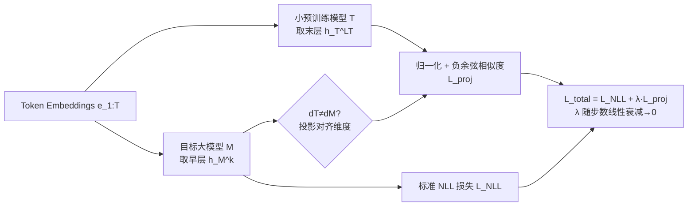

# Late-to-Early Training: 让 LLM 更早学到后期知识，从而更快更好

**会议**: ICLR 2026  
**OpenReview**: [https://openreview.net/forum?id=EVZMZQogUm](https://openreview.net/forum?id=EVZMZQogUm)  
**代码**: 待确认  
**领域**: LLM 预训练 / 训练加速  
**关键词**: 预训练加速, 表示对齐, 知识蒸馏, 模型成长, 收敛加速  

## 一句话总结
LET 用一个小很多（最多 10×）的开源预训练模型的**末层表示**去对齐目标大模型**早期训练步的早层表示**，让大模型在预训练初期就"提前"学到后期才会形成的知识，从而在 1.4B/7B 上实现约 1.6× 加速且下游准确率提升近 5%。

## 研究背景与动机
- **领域现状**：LLM 预训练靠 scaling 取得成功，但代价极高（训练一个 12B 模型约需 72,000 A100 GPU 小时）。与此同时开源社区已积累了大量不同规模的预训练模型，这些已经"烧掉"的算力理应被复用。
- **现有痛点**：传统知识蒸馏（KD）需要一个**更大**的教师，反而带来巨大显存/算力开销，且学生通常打不过教师，难以作为继续 scaling 的基座；SALT（Rawat et al. 2024）虽提出小模型可 bootstrap 大模型，但师生规模差距仅 1.87×（教师仍很大），还依赖重度数据预处理；model growth 类方法则要刻意改架构（加深加宽），限制了可行架构范围。
- **核心矛盾**：想用"小、便宜、现成"的开源模型加速"大"模型训练，但小模型能力有限——训练后期大模型反而会**超过**小模型，此时再硬对齐小模型表示只会拖累学习。
- **本文目标**：提出一个**架构无关**、只依赖表示、且对"小模型能力上限"鲁棒的通用范式，能用比目标小 10× 的模型稳定加速大模型预训练。
- **核心 idea**：**晚期→早期对齐**——把小模型（处于"晚期训练阶段"、末层）的表示，用来引导大模型在**早期训练步**的**早层**，并随训练衰减权重逐步退出，让后续层自然接管并精炼这些表示。

## 方法详解

### 整体框架
LET 在标准因果语言建模损失之外，加一项**表示对齐损失**：前向时同时过目标模型 $M$ 与小预训练模型 $T$，取 $T$ 的末层表示去对齐 $M$ 的第 $k$ 层（早层）表示，对齐强度 $\lambda$ 随训练步线性衰减到 0。两个机制贯穿其中——**late-to-early-step**（只在早期步用 $T$，逐步淘汰）与 **late-to-early-layer**（用 $T$ 末层对齐 $M$ 早层）。

### 关键设计

**1. Late-to-Early-Layer 对齐：用小模型末层喂大模型早层。** 标准预训练只优化 NLL 损失 $L_{\text{NLL}} = -\sum_{t=1}^{T}\log P_M(x_t\mid x_{<t})$。LET 额外取小模型 $T$ 末层表示 $h^{(L_T)}_T$ 与目标模型 $M$ 第 $k$ 层表示 $h^{(k)}_M$，先归一化再以负余弦相似度作为对齐损失 $L_{\text{proj}} = -\tilde h^{(k)\top}_M \tilde h^{(L_T)}_T$（当维度 $d_T\ne d_M$ 时先做一次投影匹配维度）。把对齐放在**早层**而非末层是关键洞察：$M$ 早层之后还留着大量层作为"缓冲区"，可以在训练动力学中自然吸收并**精炼**来自 $T$ 的表示；一旦 $M$ 整体能力超过 $T$，后续层也不会被 $T$ 的有限表示拖死。消融中 L2E（$T$ 末层→$M$ 早层）在六种对齐配置里困惑度最低、最鲁棒，而把 $T$ 表示压到 $M$ 末层（L2L）会在对齐结束后出现困惑度跳升。

**2. Late-to-Early-Step 退火：早期借力、后期撒手。** 对齐项权重按 $\lambda = \lambda_0\cdot\max\!\big(0, \frac{S_{\text{stop}}-s}{S_{\text{stop}}}\big)$ 线性衰减，其中 $s$ 是当前步、$S_{\text{stop}}$ 是权重归零的步数，总损失 $L_{\text{total}} = L_{\text{NLL}} + \lambda L_{\text{proj}}$。早期 $\lambda$ 较大，让 $M$ 充分吸收 $T$ 的表征引导（此时 $T$ 比"刚起步的 $M$"强）；随训练推进 $\lambda$ 衰减，$M$ 把重心交回主目标 $L_{\text{NLL}}$，避免后期反被弱小的 $T$ 牵制。这正是对"小模型会被大模型反超"这一核心矛盾的直接回应——把小模型当作早期的脚手架而非长期的天花板。

**3. 对小模型的鲁棒性与架构无关性。** 因为只对齐表示（不蒸馏 logits、不复用权重、不改架构），LET 可跨不同 tokenizer/架构的小模型工作：实验用 OPT-125M、Pythia-160M、SmolLM-135M 三种约 125–160M 的小模型都能稳定降困惑度，且 SmolLM 作 $T$ 效果最佳，说明不同小模型带来不同表示从而影响 $M$ 的训练动力学，但整体增益稳健。$\lambda$ 的消融进一步表明 $\lambda=0.1$ 为最佳平衡点：过大（如 3.0）会让 $M$ 过度对齐 $T$ 从而压制从数据本身学习，过小（0.01）则对齐不足、收益有限。

## 实验关键数据

设置：基于 LLaMA 架构（RMSNorm + SwiGLU，BF16），在 The Pile 上训练 ~20B tokens，1.4B/3B/7B 规模，32×A100 80GB，AdamW + cosine schedule。小模型 $T$ 来自 OPT/Pythia/SmolLM 家族。下游评测沿用 Groeneveld et al. (2024) 的 9 个任务的 one-shot 准确率。

### 主实验表格（9 任务平均准确率，%）

| 模型规模 | 方法 | Avg. |
|---|---|---|
| 1.4B | Baseline | 41.6 |
| 1.4B | RKD | 41.4 |
| 1.4B | SALT | 42.9 |
| 1.4B | LET(67% 步数) | 42.5 |
| 1.4B | **LET** | **43.6** |
| 7B | Baseline | 43.3 |
| 7B | RKD | 42.2 |
| 7B | SALT | 44.7 |
| 7B | LET(67% 步数) | 43.9 |
| 7B | **LET** | **45.5** |

亮点：1.4B 上 LET 只用 **<67%** 训练步数（且 $T$ 比 $M$ 小 10×）就已超过 baseline 的最终平均性能；完整训练再涨到 43.6。图 1 显示 1.4B 约 **1.6× 加速 + 4.68% 提升**，7B 约 **1.56× 加速 + 5.13% 提升**。

### 消融实验表格（核心结论）

| 消融维度 | 设置 | 结论 |
|---|---|---|
| 对齐层组合 | L2E/L2M/L2L、M2E/M2M/M2L | **L2E（末层→早层）最优最鲁棒**；用 $T$ 中层（M2*）一律弱于用末层（L2*）；L2L 对齐结束后困惑度跳升 |
| 权重 $\lambda$ | {0.01,0.1,0.3,1.0,3.0} | **$\lambda=0.1$ 最优**；$>0.1$ 过度对齐压制数据学习，$=0.01$ 对齐不足 |
| 小模型选择 | OPT-125M / Pythia-160M / SmolLM-135M | 三者都稳定降困惑度（跨 tokenizer 鲁棒），**SmolLM 最佳** |

### 关键发现
- RKD 在"教师远小于学生"时甚至**低于 baseline**：它能强化 ARC-c/LAMB 等推理类任务，却在 SciQ 等科学多选上崩盘，说明硬蒸馏会损伤整体学习能力。
- 困惑度（图 2）在三种词表下一致下降，与下游提升趋势吻合，验证增益与具体 tokenization 无关。
- 表示相似度随训练稳步上升且对 $\lambda$ 不敏感，说明即使很小的 $\lambda$ 也能提供有效对齐。
- LET 不仅加速语言建模与下游泛化，论文附录还显示其表征引导能跨域迁移（如时间序列分类），暗示该范式不局限于纯文本预训练。
- 加速来自"提前形成有用早层表示"：大模型在早期步就被推向后期才会出现的表征分布，相当于把后期才学到的知识"前置"，这也是标题 late-to-early 的本意。

## 亮点与洞察
- **反直觉地"以小教大"**：突破了 KD"大教师教小学生"的范式，证明 10× 更小的现成模型也能加速大模型，且把社区已花费的算力变现。
- **"早层 + 退火"是点睛之笔**：把外部表示注入早层 + 让后续层当缓冲区 + 权重衰减退出，三者共同解决了"小模型终将被反超"的根本矛盾，这是 LET 比 SALT/RKD 更鲁棒的本质原因。
- **极简且通用**：只加一项余弦对齐损失、不改架构、不动权重、不依赖数据预处理，落地成本低。

## 局限与展望
- 实验数据集集中在 The Pile（~20B tokens）、规模到 7B，更大规模（数百 B token、几十 B 参数）与多语料下的增益是否保持需进一步验证。
- 需要同时前向 $T$，早期会带来额外计算/显存；虽然 $T$ 很小，但对齐层 $k$、$\lambda_0$、$S_{\text{stop}}$ 等超参仍需调。
- 为何"早层对齐 + 缓冲层精炼"在理论上更优，论文以经验解释为主，缺乏更形式化的分析；最佳小模型（SmolLM）的选择规律也偏经验。

## 相关工作与启发
- **知识蒸馏（KD/RKD）**：LET 把"匹配 logits 分布"换成"对齐隐藏表示"，并反转师生规模关系，规避了大教师开销与学生被压制的问题。
- **小模型 bootstrap 大模型（SALT）**：LET 把师生规模差从 1.87× 拉到 10×，去掉数据预处理依赖，更通用。
- **Model Growth（加深/加宽继承权重）**：LET 不改架构、纯表示对齐，约束更少。
- **启发**：表示级、可退火的"软引导"或许是一类比权重继承更灵活的迁移范式，可推广到多模态、时间序列（论文附录已展示跨域到时间序列分类）等场景。

## 评分
- 新颖性: ⭐⭐⭐⭐ 「以小教大 + 末层→早层 + 退火」组合切入了一个被忽视但实用的问题，思路清晰且反直觉。
- 实验充分度: ⭐⭐⭐⭐ 覆盖 1.4B/7B、三种小模型、对齐层与 $\lambda$ 消融完整；但规模/数据量偏小，未到更大 scale 验证。
- 写作质量: ⭐⭐⭐⭐ 动机—机制—实验逻辑顺畅，公式与图表清晰（个别段落有重复表述）。
- 价值: ⭐⭐⭐⭐ 复用社区已有算力、低成本加速预训练，工程落地价值高。

<!-- RELATED:START -->

## 相关论文

- [\[ICLR 2026\] Scaling with Collapse: Efficient and Predictable Training of LLM Families](scaling_with_collapse_efficient_and_predictable_training_of_llm_families.md)
- [\[ICLR 2026\] Rewriting Pre-training Data Boosts LLM Performance in Math and Code](rewriting_pre-training_data_boosts_llm_performance_in_math_and_code.md)
- [\[ICLR 2026\] Pre-training LLM without Learning Rate Decay Enhances Supervised Fine-Tuning](pre-training_llm_without_learning_rate_decay_enhances_supervised_fine-tuning.md)
- [\[ACL 2026\] Demystifying Data Organization for Enhanced LLM Training](../../ACL2026/llm_pretraining/demystifying_data_organization_for_enhanced_llm_training.md)
- [\[ICLR 2026\] Rethinking Data Curation in LLM Training: Online Reweighting Offers Better Generalization than Offline Methods](rethinking_data_curation_in_llm_training_online_reweighting_offers_better_genera.md)

<!-- RELATED:END -->
