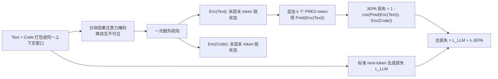

# LLM-JEPA: Large Language Models Meet Joint Embedding Predictive Architectures

**会议**: ICLR 2026  
**OpenReview**: [https://openreview.net/forum?id=GbXKPo9QfH](https://openreview.net/forum?id=GbXKPo9QfH)  
**代码**: [https://github.com/galilai-group/llm-jepa](https://github.com/galilai-group/llm-jepa)  
**领域**: LLM 预训练 / 表示学习 / 自监督  
**关键词**: JEPA, 嵌入空间训练, 联合嵌入预测, 多视图, LLM 微调与预训练  

## 一句话总结
把视觉里大获成功的 JEPA（联合嵌入预测架构）首次搬到 LLM 上：在标准 next-token 重构损失之外，再加一项"用 Text 的嵌入预测 Code 的嵌入"的隐空间目标，在不牺牲生成能力、且抗过拟合的前提下，跨四个模型家族、四个数据集显著超过标准微调与预训练。

## 研究背景与动机
**领域现状**：表示学习长期分裂成两派——(i) 生成 / 重构派（输入空间重建，GPT、MAE 这类），(ii) 反重构的 JEPA 派（不在像素/token 空间重建，而是让一个视图的嵌入去预测另一个视图的嵌入，同时防止表示坍缩）。在视觉里，JEPA 已被证明在感知任务上有多重可证优势、偏置更少。

**现有痛点**：到了 NLP/LLM 这边，几乎清一色还是输入空间的自回归重构。LLM 被普遍以"能否在文本空间生成正确答案"来评判，导致 JEPA 这种纯嵌入空间目标很难直接套用——已有的隐空间方法（SimCSE、Sentence-BERT 等）虽然学到好的句向量，却**丢失了生成能力**，应用面被严重限制。

**核心矛盾**：LLM 的任务其实也包含感知与推理（JEPA 在这些场景更占优），但 LLM 的生成评测刚性又要求保留 token 级生成。如何让 JEPA 的嵌入空间结构化收益和 LLM 的生成能力**同时存在**，是横在中间的鸿沟。

**本文目标**：设计第一个既保留 LLM 生成能力、又引入 JEPA 嵌入预测的训练目标，并在微调和预训练两个阶段都验证收益。

**核心 idea**：**[把 (Text, Code) 当作同一底层知识的两个视图]** 很多 NLP 数据天然成对——自然语言↔正则、问题描述↔SQL、git issue↔code diff，这两边正是"同一功能的两个视图"。于是可以在标准生成损失上**叠加**一项 JEPA 损失：让 `Pred(Enc(Text))` 去逼近 `Enc(Code)`，从而把视觉 JEPA 的对齐结构引入 LLM，而生成头照常工作。

## 方法详解

### 整体框架
LLM-JEPA 的损失由两项相加：原始的 next-token 生成损失 `L_LLM`（保证生成能力不退化）+ 一项 JEPA 嵌入预测损失（让 Text 视图的预测嵌入对齐 Code 视图的嵌入），即

$$
\mathcal{L}_{\text{LLM-JEPA}} = \sum_{\ell=2}^{L}\mathcal{L}_{\text{LLM}}(\text{Text}_{1:\ell-1},\text{Text}_{\ell}) + \lambda \cdot d\big(\text{Pred}(\text{Enc}(\text{Text})),\ \text{Enc}(\text{Code})\big)
$$

其中 $\lambda\ge 0$ 平衡两项，$d$ 取余弦相似度，编码器与预测器都**复用 LLM 本身的权重**，不引入额外网络。整个方法对 `L_LLM` 是无关的（agnostic），因此可无缝接到各种模型与任务上。

### 关键设计

**1. 编码器：复用 LLM 隐状态当嵌入，靠分块掩码一次前向拿两个视图。** 编码器直接取"最后一层、最后一个 token 的 hidden state"作为序列嵌入（LLM probing 的常规做法）。难点在于要同时拿到 Text 和 Code 两个视图的嵌入：若简单拼接，因果注意力会让 Code 的表示依赖 Text，污染视图独立性。作者设计了一个**按块因果（block-causal）的自定义注意力掩码**——把序列切成 Text、Code 两块，块内保持三角因果、块间互相 `-inf` 屏蔽，使两个视图彼此看不见。借助 HuggingFace 的加性掩码（entry $(i,j)=-\infty$ 阻止 token $j$ 关注 $i$），只需**一次额外前向**就能同时得到两个干净的视图嵌入，而不是两次。

**2. 预测器：用绑权重的 [PRED] token 把 LLM 自身当预测网络。** JEPA 需要一个预测器把 Text 嵌入映射到 Code 嵌入空间。作者不另建网络，而是利用 LLM 的自回归 + 自注意力特性做**绑权重预测器**：在 Text 末尾追加 $k$ 个特殊 token `[PRED_1],...,[PRED_k]`，让模型对输入做进一步非线性处理，取最后一个 `[PRED]` token 的末层隐状态作为 $\text{Pred}(\text{Enc}(\text{Text}))$。当 $k=0$ 时预测器退化为恒等映射 $\text{Pred}(x)=x$。消融显示性能提升主要来自**增加预测步数（FLOPs）**而非 token embedding 的多样性——用相同的 `[PRED]` token 效果几乎一致（GSM8K 36.36 vs 36.74）；而独立的可训练线性预测器因冷启动反而更差。

**3. 度量：余弦相似度对齐，而非 InfoNCE 这类排斥型对比。** 比较两个视图嵌入时，作者沿用视觉里成熟的余弦相似度。一个关键消融是把它换成 InfoNCE 对比损失，结果**掉到基线以下且方差暴增**（34.40±6.10 vs LLM-JEPA 71.46±1.34）。作者的解释是：精度增益来自**表示对齐**——模型学会把语义相近的 Text/Code 压进一个狭窄、近似一条直线的子空间，从而有利于外推与泛化；而 InfoNCE 的对比目标显式地把表示**推开**，恰好破坏了这种对齐。

**4. "好的 NTP ≠ 好的 JEPA"，并用 loss dropout 摊薄开销。** 作者先用一个对照实验回答"JEPA 项是否多余"：用纯 NTP 训练但只监控（不回传）JEPA 损失，发现 NTP 并不会隐式最小化 JEPA 损失（精度 51.95% vs 71.10%），证明该项必须显式加入；同时加了 JEPA 项后 NTP 损失曲线几乎不变，说明生成能力没被牺牲。为缓解额外前向带来的训练开销，作者提出**随机 JEPA-loss dropout（LD）**：每个 mini-batch 以一定比例丢弃 JEPA 项，在相同 PFLOPs 下既省算力又往往**进一步提分**（如 LD=0.75 反而比 LD=0 更高）。

## 实验关键数据

### 主实验表格（微调，NL-RX-SYNTH 等，准确率 %）

| 设置 | 模型 / 数据 | Baseline (L_LLM) | LLM-JEPA (ours) |
|---|---|---|---|
| 微调 | Llama3.2-1B / SYNTH | 37.0 | 51.6 |
| 微调 | gemma2 / SYNTH | 51.3 | 66.6 |
| 微调 | OpenELM / SYNTH | 56.0 | 70.4 |
| 微调 | Llama3.2-1B / Spider | 55.2 | 70.9 |
| 微调 | Llama3.2-1B / GSM8K | 51.5 | 71.8 |
| 预训练 | Llama3.2-1B / SYNTH | 54.38 ± 1.70 | 60.59 ± 1.01 (p=2.94e-4) |

跨四模型家族（Llama3、gemma2、OpenELM、OLMo）、四数据集、6 个 epoch、四种规模（1B/3B/7B/8B）均稳定提升，且 **LLM-JEPA 抗过拟合**而标准微调会过拟合。

### 拓展实验：超越 Code 视图与推理模型（Llama3.2-1B / GSM8K，准确率 %）

| 数据 / 模型 | Baseline | LLM-JEPA | 配置 |
|---|---|---|---|
| NQ-Open | 20.12 ± 0.41 | 21.59 ± 0.40 | λ=1024, k=0 |
| HellaSwag | 27.93 ± 0.46 | 35.22 ± 2.09 | λ=1, k=4 |
| Qwen3-1.7B / GSM8K | 44.32 ± 0.39 | 45.00 ± 0.40 | λ=1, k=0 |
| R1-Distill-Qwen-1.5B / GSM8K | 13.87 ± 1.01 | 15.04 ± 0.15 | λ=0.5, k=1 |

即便在没有天然双视图的 QA 任务、以及强推理模型上也有统计显著提升；λ 一路加大到 1024 仍未见平台期。

### 消融实验表格（NL-RX-SYNTH，lr=2e-5, λ=1, k=1，准确率 %）

| 变体 | 准确率 |
|---|---|
| Baseline | 57.29 ± 5.32 |
| **LLM-JEPA（余弦）** | **71.46 ± 1.34** |
| ℓ2-norm | 2.22 ± 0.07 |
| MSE | 70.64 ± 2.05 |
| Prepend [PRED] | 68.07 ± 2.57 |
| Code → Text 方向 | 65.70 ± 2.63 |
| InfoNCE | 34.40 ± 6.10 |
| 均值池化（替代末 token） | 65.46 ± 3.51 |
| 线性预测器 (λ=0.5) | 70.16 ± 1.87 |

### 关键发现
- **结构化表示**：t-SNE 显示 LLM-JEPA 让 Text/Code 表示形成清晰结构，而纯 NTP 微调反而破坏了基模型原有结构；`Enc(Text)−Enc(Code)` 的奇异值比基线/普通微调低几个数量级，说明映射被约束在狭窄子空间，且近似**线性变换**。
- **生成能力不退化**：加 JEPA 项后 NTP 损失曲线与基线重合，精度却从 51.95% 升到 71.10%，增益来自隐空间结构而非牺牲生成。
- **方向与度量很重要**：Text→Code 优于 Code→Text；余弦/MSE 可行而 InfoNCE/ℓ2-norm 失败。

## 亮点与洞察
- **首个保留生成能力的 LLM 版 JEPA**：填补了"语言侧缺 JEPA 目标"的空白，且只加一项损失、复用模型自身权重，工程上极轻量。
- **"两视图"视角的巧妙落地**：把成对数据（NL↔正则/SQL、问题↔答案、context↔续写）重新解读为 JEPA 的多视图，给嵌入空间训练找到了语言里的天然对应物。
- **严谨的"对照"实验**：用"只监控不回传 JEPA"的设置，干净地证明了 NTP 不会隐式优化 JEPA、且 JEPA 项不损生成，论证比单纯刷分更有说服力。
- **抗过拟合 + loss dropout**：既给出了实用收益（抗过拟合），又用 LD 把"额外前向"的算力代价摊平甚至反向提分。

## 局限与展望
- **依赖非平凡的双视图**：方法成功的前提是数据天然提供"两个非平凡视图"；对没有现成视图的通用语料，仍缺类似视觉数据增强的造视图机制——作者明确把这列为后续方向。
- **训练开销**：即便压到"一次额外前向"，相对基线仍有可观训练放缓，靠 LD 缓解但未根除；推理阶段无额外开销。
- **预训练仍属初探**：从随机初始化的预训练实验受限于数据规模（模型学不好终止符，需改评测口径），结论是"鼓励性"而非定论。
- **超参敏感**：$(\lambda, k)$ 需网格搜索，不同任务最优值差异大（λ 从 0.5 到 1024 都出现过），自动选参仅在附录给了经验方法。

## 相关工作与启发
- **视觉 JEPA**（I-JEPA、data2vec、V-JEPA 等）是直接思想来源：嵌入空间预测、防坍缩、偏置更少；本文是其在语言侧的首次系统移植。
- **隐空间 LLM 目标**：SimCSE（dropout 正样本对比）、Sentence-BERT、E5 等学好句向量但无生成能力；LSP/LCM（Barrault et al.）等用结构约束但落在 JEPA 范围外——本文的差异是**保留生成 + 纯 JEPA 式对齐**。
- **成对生成任务**：NL→Regex、NL→SQL、issue→diff 等历来是"学一边生成另一边"，本文把它们重新框定为 JEPA 多视图，是一种视角迁移。
- **启发**：JEPA 给 LLM 带来的"近线性、低维对齐"结构可能是泛化/外推的几何基础；这暗示未来 LLM 预训练或许能借"造视图 + 嵌入对齐"在通用语料上获得类似视觉的表示收益。

## 评分
- **新颖性**: ⭐⭐⭐⭐⭐ 首个保留生成能力的 LLM-JEPA，把视觉 JEPA 干净地搬到语言侧，视角与构造都新。
- **实验充分度**: ⭐⭐⭐⭐ 跨四模型家族/四数据集/多规模/微调+预训练，五种子+配对 t 检验，消融细致；唯预训练偏初探、通用语料尚缺。
- **写作质量**: ⭐⭐⭐⭐ 动机—矛盾—方法—对照实验链条清晰，公式与图表配合到位。
- **价值**: ⭐⭐⭐⭐⭐ 为 LLM 嵌入空间训练打开一条可落地、可扩展的新路线，对预训练范式有潜在长期影响。

<!-- RELATED:START -->

## 相关论文

- [\[ICLR 2026\] Joint Selection for Large-Scale Pre-Training Data via Policy Gradient-based Mask Learning](joint_selection_for_large-scale_pre-training_data_via_policy_gradient-based_mask.md)
- [\[NeurIPS 2025\] Scaling Embedding Layers in Language Models](../../NeurIPS2025/llm_pretraining/scaling_embedding_layers_in_language_models.md)
- [\[ICLR 2026\] Selective Rotary Position Embedding](selective_rotary_position_embedding.md)
- [\[ICLR 2026\] MrRoPE: Mixed-radix Rotary Position Embedding](mrrope_mixed-radix_rotary_position_embedding.md)
- [\[ICLR 2026\] Soft-Masked Diffusion Language Models](soft-masked_diffusion_language_models.md)

<!-- RELATED:END -->
