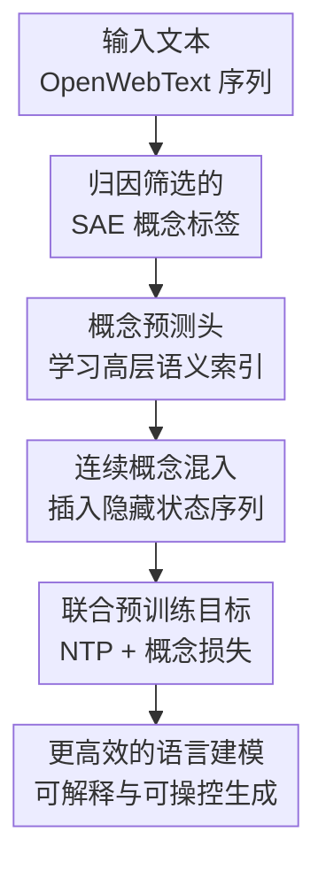

# LLM Pretraining with Continuous Concepts

**会议**: ICLR 2026  
**OpenReview**: [https://openreview.net/forum?id=wTGcb3DxOn](https://openreview.net/forum?id=wTGcb3DxOn)  
**代码**: 无公开代码  
**领域**: LLM预训练  
**关键词**: 连续概念, 稀疏自编码器, 下一词预测, 弱到强监督, 可解释预训练

## 一句话总结

这篇论文提出 CoCoMix，在标准下一词预测之外让模型预测由 SAE 抽取并按归因筛选出的高层概念，再把这些概念压缩成连续向量插入 Transformer 隐状态序列，从而在语言建模、下游推理和可控生成上比普通 NTP 与知识蒸馏更高效。

## 研究背景与动机

**领域现状**：大语言模型预训练最常见的目标仍然是 next token prediction，也就是给定上下文预测下一个离散 token。这个范式很简单、可扩展、能吃下海量无标注文本，因此成为 GPT 系列和后续开放模型的基础训练方式。模型中的语义表示、推理能力和世界知识，大多都是在优化 token-level perplexity 的过程中间接学出来的。

**现有痛点**：token 是语言表面的离散符号，里面既有承载语义的词，也有大量功能词、标点和局部搭配。只让模型逐 token 拟合文本，会把训练信号压在很细的语言表面上，高层概念和长程推理只能作为副产物慢慢浮现。对于需要规划、抽象概括或跨多步依赖的任务，这种信号不够直接，往往需要更多 token 和更大模型规模才能学到相同能力。

**核心矛盾**：下一词预测不能简单丢掉，因为模型最终仍要生成连贯文本；但只依赖离散 token 又会让概念学习过于隐式。真正的问题是，如何在不破坏 token-level 语言建模的前提下，把模型内部已经存在的高层语义概念变成可监督、可使用、可分析的训练信号。

**本文目标**：作者希望把预训练目标从“只预测下一个 token”扩展为“同时预测下一个 token 和对预测有用的连续概念”。具体要解决三个子问题：先从已有 LLM 的隐藏状态里抽取可解释概念；再判断哪些概念真的影响下一词预测；最后让新模型学会预测这些概念，并把它们作为额外信息参与后续 Transformer 计算。

**切入角度**：论文借用了 mechanistic interpretability 里的 Sparse Autoencoder。SAE 可以把 LLM hidden state 分解成稀疏的概念维度，其中每个激活维度往往对应某种语义特征。这个性质很适合做“概念标签”：它比完整 hidden state 更稀疏、更可解释，也比离散 token 更接近模型内部正在使用的抽象语义。

**核心 idea**：用 SAE 抽取并按梯度归因筛选的概念监督 LLM 预训练，让模型不仅预测 token，还预测“接下来真正有用的概念”，并把这些概念以连续向量形式插入隐藏序列供后续层使用。

## 方法详解

### 整体框架

CoCoMix 的训练流程可以看成给下一词预测加了一条概念通道。离线侧先用一个预训练概念模型和 TopK SAE，把每个位置的 hidden state 分解成稀疏概念，再用归因分数挑出对真实下一个 token 最有影响的概念索引。在线训练侧，新模型从自己的中间 hidden state 预测这些概念索引，把预测 logits 稀疏化并投影成一个连续概念向量，然后把它与 token hidden representation 交错插入，让后续 Transformer block 同时读到 token 信息和概念信息。

这不是传统 KD 那种直接模仿 teacher 的完整输出分布，也不是 pause token 那种只给模型额外计算位。CoCoMix 让额外位置携带明确的语义内容：它来自 SAE 概念空间，经过 attribution 过滤，并通过辅助损失被模型显式学会。

### 关键设计

**1. 归因筛选的 SAE 概念标签：只监督真正影响下一词的概念**

SAE 首先把预训练模型 $M_{con}=f_{con}\circ h_{con}$ 的某层 hidden state $h^{con}_t$ 映射到高维稀疏概念空间。TopK SAE 的编码过程可以写成 $c^{pre}_t=E(h^{con}_t)$、$c_t=TopK(c^{pre}_t)$、$\hat{h}^{con}_t=D(c_t)$，训练时用重构损失 $\|h^{con}_t-\hat{h}^{con}_t\|_2^2$ 约束。这样得到的 $c_t$ 不是密集黑箱向量，而是一组被激活的概念维度。

但“被激活”不等于“对当前预测重要”。一段上下文里可能同时激活很多语义特征，真正决定下一个 token 的只有其中一部分。CoCoMix 因此用 activation 乘梯度的归因分数来选目标概念：$a_t=c_t\odot\nabla_{c_t}-\log f_{con}(x_{t+1}\mid D(c_t),h_{<t})$。直观地说，如果轻微改变某个概念会明显影响真实下一个 token 的负对数似然，那么这个概念就更值得被监督。论文随后取 $a_t$ 的 top-$K_{attr}$ 概念索引 $I=\{i_1,\ldots,i_{K_{attr}}\}$ 作为训练标签。

这个设计的关键在于，监督信号不是 teacher 模型所有知识的平均压缩，而是“对当前 token 预测有因果影响的概念切片”。这解释了为什么弱到强场景里它比 KD 稳：小 teacher 的完整输出分布可能噪声很大，但 SAE 概念经过 attribution 过滤后，只把相对有用的语义方向传给更大的 student。

**2. 概念预测头：把高层语义学习变成显式辅助目标**

得到概念标签后，新模型不直接回归 teacher hidden state，而是在自己的中间 hidden state $h_t=h(x)_t$ 上接一个线性预测头 $M$，输出概念 logits $z_t=M(h_t)\in\mathbb{R}^C$。对 attribution 选出的每个概念索引 $i\in I$，模型用交叉熵做多目标概念预测，损失为 $L_{concept}(a_t)=\frac{1}{K_{attr}}\sum_{i\in I}CE(z_t,i)$。

这个选择看起来比直接拟合 hidden state 更“离散”，但它恰好避开了 dense representation 里的噪声。完整 hidden state 混有语法、位置、局部词形和 teacher 自身的冗余特征，回归它会迫使 student 学很多对下一词预测不必要的细节。CoCoMix 只预测 SAE 概念索引，相当于把 teacher 表示先投影到可解释、稀疏、语义化的坐标系里，再让 student 学其中最重要的方向。

论文的分析实验支持这一点：用 $\ell_1$、$\ell_2$ 或 cosine loss 直接预测 hidden state 都会让 perplexity 明显变差，而概念预测保持了更好的训练曲线。这说明性能提升不是来自“额外 teacher 信号”本身，而是来自概念空间对信号做了有效过滤。

**3. 连续概念混入：把预测出的概念作为独立信息单元交给后续层使用**

只让模型预测概念还不够，因为辅助损失可能只改变 hidden state 的几何结构，却未必让后续层真正使用这些概念。CoCoMix 因此把预测 logits $z_t$ 先 TopK 稀疏化，再通过可学习投影压缩成与 hidden dimension 相同的连续概念向量 $\hat{c}_t=WTopK(z_t)+b$。随后模型把序列从普通的 $(h_1,\ldots,h_t)$ 变成交错形式 $(h_1,\hat{c}_1,\ldots,h_t,\hat{c}_t)$，再送入剩余 Transformer blocks。

这个“插入”与把概念向量直接加到 hidden state 上不同。加法干预会把 token 表示和概念表示揉成一个向量，后续层很难区分哪些信息来自原 token，哪些来自预测概念；交错插入则把概念作为单独 token-like 单元保留下来，让 attention 可以显式选择何时读概念、何时读 token。论文对比也显示，interleaving 比直接 adding 效果更好。

这个设计还带来可解释性和可操控性。因为中间的 $z_t$ 是 SAE 概念空间上的 logits，研究者可以直接看模型在某个位置预测了哪些概念，也可以放大或压低某个概念维度来影响生成。论文的定性实验中，放大“website address”“phone”“politics/law”等概念后，CoCoMix 的输出会朝对应语义方向移动。

**4. 联合预训练目标：让 token 流畅性和概念抽象共同优化**

CoCoMix 最终仍以标准语言建模为主目标，只是在每个位置加上概念预测项。训练目标是 $\sum_{t=1}^{T-1}-\log f(x_{t+1}\mid h_{\leq t},\hat{c}_{\leq t})+\lambda L_{concept}(a_t)$。论文把 $\lambda$ 设为 $0.1$，意图很明确：概念损失提供方向，但不能压过 next token prediction。

这让方法保持了预训练范式的兼容性。模型仍然学习生成真实文本，不需要额外人工标注，也不需要 teacher 生成海量 synthetic corpus；新增部分只依赖一个预训练 SAE 和概念预测头。与此同时，概念向量进入后续层后又不只是 regularizer，而是实实在在改变下一词预测路径，因此概念学习和语言建模被端到端绑在一起。

### 一个完整示例

假设上下文是“The best platform for buying tickets is the”，普通 NTP 只能要求模型预测下一个 token，也许是 “website”“app” 或某个具体平台名。CoCoMix 会先让 GPT-2 加 SAE 在当前位置抽取概念，例如“ticketing”“website address”“phone app”“price”等若干激活维度；再用 attribution 判断哪些概念会最影响真实下一个 token。

如果 attribution 发现“website address”对预测最关键，这个概念索引会进入 $I$，成为新模型要预测的标签。训练中的 CoCoMix 先从当前 hidden state 预测这个概念，再把预测结果压缩成 $\hat{c}_t$ 插在 $h_t$ 后面。后续层看到的不再只有“The best platform...”对应的 token hidden states，还会看到一个显式的“网站地址相关”连续概念单元。

生成时，这个设计也能被干预。论文展示了把某个概念 logit 放大后，模型输出会从普通描述转向更具体的网站、价格或手机相关表达。这种操控不是靠 prompt 外部诱导，而是直接发生在模型内部概念通道上，因此比普通输出分析更接近“模型当前在想什么概念”。

### 损失函数 / 训练策略

训练时使用 GPT-2 风格 Transformer 和 tokenizer，上下文长度为 1024。SAE 是在 124M GPT-2 上训练的开源 TopK SAE，概念空间大小为 32,768，SAE 激活概念数 $K_{concept}=32$，概念抽取层固定为 GPT-2 的第 6 层。CoCoMix 在 69M 模型上从第 4 层预测概念，在 386M 和 1.38B 模型上从第 6 层预测概念。

主要实验在 OpenWebText 上训练，主结果使用 200B tokens，其余分析多用 20B tokens。优化设置遵循 GPT-3 类预训练习惯：warmup 占总步数的 $1/300$，之后 cosine decay 到最大学习率的 10%；69M、386M、1.38B 的最大学习率分别是 $6e^{-4}$、$3e^{-4}$、$2e^{-4}$，weight decay 为 0.1，AdamW 的 $\beta_1=0.9$、$\beta_2=0.95$。

概念预测损失权重 $\lambda=0.1$，attribution 选择的概念数 $K_{attr}=4$。KD baseline 使用 teacher 与 student 输出分布的 KL divergence，同样把 KD 项权重设为 0.1，以便和 CoCoMix 的辅助信号强度大致可比。

## 实验关键数据

### 主实验

论文评估了 OpenWebText 验证 perplexity，以及 LAMBADA、WikiText-103、HellaSwag、PIQA、SIQA、Arc-Easy、WinoGrande 等下游任务。最重要的结论是，CoCoMix 在 69M、386M、1.38B 三个规模上几乎都优于 NTP，并且在弱到强监督场景里比 KD 更稳。

| 模型规模 | 方法 | OWT PPL↓ | LAMBADA PPL↓ | Wiki PPL↓ | 平均PPL↓ | 平均Acc↑ |
|----------|------|----------|--------------|-----------|----------|----------|
| 69M | NTP | 25.3 | 107.6 | 52.3 | 61.8 | 42.7 |
| 69M | KD | 25.2 | 99.3 | 51.0 | 58.5 | 42.8 |
| 69M | CoCoMix | 24.7 | 99.1 | 50.9 | 58.2 | 42.9 |
| 386M | NTP | 16.3 | 26.3 | 29.9 | 24.2 | 46.8 |
| 386M | KD | 16.4 | 24.6 | 29.1 | 23.4 | 47.0 |
| 386M | CoCoMix | 15.9 | 19.3 | 29.1 | 21.4 | 47.5 |
| 1.38B | NTP | 14.3 | 16.6 | 25.0 | 18.6 | 48.7 |
| 1.38B | KD | 14.2 | 16.6 | 24.9 | 18.5 | 49.1 |
| 1.38B | CoCoMix | 13.9 | 15.4 | 24.9 | 18.1 | 49.7 |

从表中看，CoCoMix 在 386M 上的平均 PPL 从 NTP 的 24.2 降到 21.4，提升尤其明显；在 1.38B 上，CoCoMix 的平均准确率也从 NTP 的 48.7 提到 49.7。论文还报告，在 1.38B 规模、200B token 训练曲线上，CoCoMix 达到 NTP 同等验证 perplexity 时少用了 21.5% 的训练 token。

| 设置 | 对比对象 | 关键结果 | 说明 |
|------|----------|----------|------|
| 200B token 训练 | CoCoMix vs NTP | 1.38B 模型同等 PPL 少用 21.5% tokens | 说明概念通道提升 sample efficiency |
| 弱到强监督 | CoCoMix vs KD | 386M 平均 PPL 21.4，KD 为 23.4，NTP 为 24.2 | 小 teacher 的概念可监督更大 student |
| 分布迁移 | OpenWebMath 训练 | CoCoMix 曲线优于 KD 和 NTP | teacher 来自 OWT，概念仍能迁移到数学语料 |
| 可操控生成 | 放大概念 logit | 输出转向 website、phone、politics/law 等概念 | 概念预测空间可被直接分析和 steering |

### 消融实验

消融集中回答三个问题：概念怎么选、概念要不要插入、插入方式是否重要。结论比较一致：attribution 比 activation 更好，SAE concept prediction 比 dense hidden state regression 更好，预测与 interleaving 两部分缺一不可。

| 配置 | 关键指标 / 现象 | 说明 |
|------|------------------|------|
| activation 选概念 | 比 attribution 低效 | 单看激活值会选到与当前 token 预测不直接相关的概念 |
| attribution 选概念 | 相比 activation 达到同等 PPL 少用 17.5% tokens | 梯度乘激活更接近“影响下一个 token 的概念” |
| 直接预测 hidden state | $\ell_1$、$\ell_2$、cosine loss 均明显更差 | dense hidden state 含噪声，语义不如 SAE 概念稀疏 |
| 只加概念预测损失 | 有小幅 PPL 改善 | 说明辅助概念目标本身有效 |
| 只做概念插入 | 参数增加但收益有限 | 没有概念监督时，插入位缺少明确语义 |
| 预测 + 插入 CoCoMix | 69M OWT PPL 24.7 | 两个组件结合后效果最好 |
| adding 概念向量 | 优于 NTP 但弱于 interleaving | 概念被混进 token hidden state 后可分离性较差 |
| pause token baseline | 20B tokens 下 PPL 25.1，CoCoMix 为 24.7 | 额外计算位本身不够，关键是位上有语义概念 |

### 关键发现

- 归因筛选是 CoCoMix 的核心过滤器。SAE activation 本身说明“概念出现了”，但 attribution 进一步说明“这个概念影响当前真实下一词”，因此更适合作为训练标签。
- 直接回归 teacher hidden state 并不是好蒸馏。论文的 hidden prediction baseline 说明，teacher 表示如果不经过概念空间离散化和筛选，可能把噪声一起传给 student。
- 交错插入比加法干预更自然。interleaving 让概念作为独立序列元素存在，attention 能显式读取它；adding 则把概念混入 token 向量，解释性和使用方式都更模糊。
- 计算成本增加是可控的。69M、20B tokens 设置下，NTP FLOPs 为 $2.88\times10^{18}$，pause token 为 $3.48\times10^{18}$，CoCoMix 为 $3.37\times10^{18}$；200B token 设置下，CoCoMix 用 141B tokens 就达到 NTP 200B 的 PPL，对应 FLOPs 也更少。
- 弱到强监督是很有价值的信号。124M GPT-2 提取的概念能帮助 386M 和 1.38B 模型，说明小模型概念不一定只能限制大模型，只要筛选得当，也能成为有用的训练支架。

## 亮点与洞察

- CoCoMix 把可解释性工具真正接进了预训练目标，而不只是训练后分析。SAE 概念在这里既是监督标签，又是模型内部可操控的中间接口。
- 论文没有把“概念”做成文本标签或人工 ontology，而是从 LLM hidden state 自动抽取。这样避免了人工标注成本，也保持了与大规模无监督预训练的兼容性。
- attribution 这一步很巧妙，因为它把 concept selection 从“语义上是否出现”改成了“对当前预测是否有用”。这让概念监督更像训练信号，而不是解释性展示。
- 连续概念插入可以理解为一种带语义内容的 pause token。pause token 只提供额外计算时间，CoCoMix 的概念 token 则同时提供计算位置和高层语义方向。
- 这套思路可迁移到安全与对齐预训练。若能识别 harmful、bias 或 refusal 相关概念，就可能在预训练阶段选择性压低或过滤某些概念，而不是只在后训练阶段补救。

## 局限与展望

- CoCoMix 依赖一个预训练模型和 SAE。当前实验主要使用在 GPT-2 124M 上训练的 SAE，说明方法可行，但也限制了概念质量和覆盖范围；如果 SAE 概念本身有偏或不完整，后续训练会继承这些问题。
- 训练计算和实现复杂度高于普通 NTP。虽然论文显示 FLOPs 相比 pause token 更划算，但交错插入会拉长上层序列，工程上需要处理 attention mask、位置编码和内存开销。
- 论文没有充分探索更大规模和更现代语料。1.38B 与 200B tokens 已是 academic-scale，但距离主流 frontier pretraining 仍有数量级差距；SAE 在更大模型上的概念是否同样稳定，还需要验证。
- 概念可操控性目前主要是定性展示。放大某个概念能改变输出方向，但这种 steering 的可控边界、安全风险和对事实性的影响还没有系统评估。
- 未来可以尝试不依赖外部 teacher 的概念学习。论文也提到，若能在预训练过程中同步学习连续概念，而不是先由已有 LLM + SAE 提供标签，CoCoMix 会更接近完全自举的预训练框架。

## 相关工作与启发

- **vs Next Token Prediction**: NTP 只在离散 token 层面提供监督，CoCoMix 保留 NTP 作为主目标，但额外要求模型预测影响下一词的连续概念，并让这些概念参与后续层计算。优势是 sample efficiency 和可解释性更好，代价是需要 SAE 与额外计算。
- **vs Knowledge Distillation**: KD 通常模仿 teacher 的输出概率分布，容易在 weak-to-strong 场景里把弱 teacher 的噪声传给强 student。CoCoMix 不模仿完整分布，而是抽取并筛选高层概念，因此在 386M 和 1.38B student 上更稳。
- **vs Pause Token**: pause token 通过插入可学习 token 给模型更多计算空间，但 token 本身没有外部语义标签。CoCoMix 插入的是由概念预测头产生的连续概念向量，因此额外位置携带可解释语义。
- **vs hidden-state regression**: 直接预测 teacher hidden state 看似信息更多，但实验更差。CoCoMix 的启发是，预训练监督不一定越密越好，经过可解释空间压缩和 attribution 过滤后的稀疏信号反而更有效。
- **vs 机制可解释性干预**: 传统 representation engineering 或 SAE steering 多是训练后干预 hidden state。CoCoMix 把这种概念接口放进预训练循环，说明可解释性方法也可以成为训练算法的一部分。

## 评分

- 新颖性: ⭐⭐⭐⭐⭐ 把 SAE 概念、归因筛选和 LLM 预训练目标端到端结合，是从可解释性走向训练机制的有趣一步。
- 实验充分度: ⭐⭐⭐⭐ 覆盖多规模、NTP/KD/pause token、弱到强和分布迁移，但更大模型与更多现代语料仍待验证。
- 写作质量: ⭐⭐⭐⭐ 方法图和消融逻辑清楚，核心机制容易追踪；部分定性 steering 图的 OCR 文本较乱，读表需要结合正文理解。
- 价值: ⭐⭐⭐⭐⭐ 如果能扩展到更大模型，CoCoMix 可能为“更抽象、更可控、更可解释”的 LLM 预训练提供一条实用路线。

<!-- RELATED:START -->

## 相关论文

- [\[ICLR 2026\] How Learning Rate Decay Wastes Your Best Data in Curriculum-Based LLM Pretraining](how_learning_rate_decay_wastes_your_best_data_in_curriculum-based_llm_pretrainin.md)
- [\[ICLR 2026\] Beyond URLs: Metadata Diversity and Position for Efficient LLM Pretraining](beyond_urls_metadata_diversity_and_position_for_efficient_llm_pretraining.md)
- [\[ICLR 2026\] Synthetic Bootstrapped Pretraining](synthetic_bootstrapped_pretraining.md)
- [\[ICLR 2026\] Beyond Length: Quantifying Long-Range Information for Long-Context LLM Pretraining Data](beyond_length_quantifying_long-range_information_for_long-context_llm_pretrainin.md)
- [\[ICLR 2026\] Reformulation for Pretraining Data Augmentation](reformulation_for_pretraining_data_augmentation.md)

<!-- RELATED:END -->
